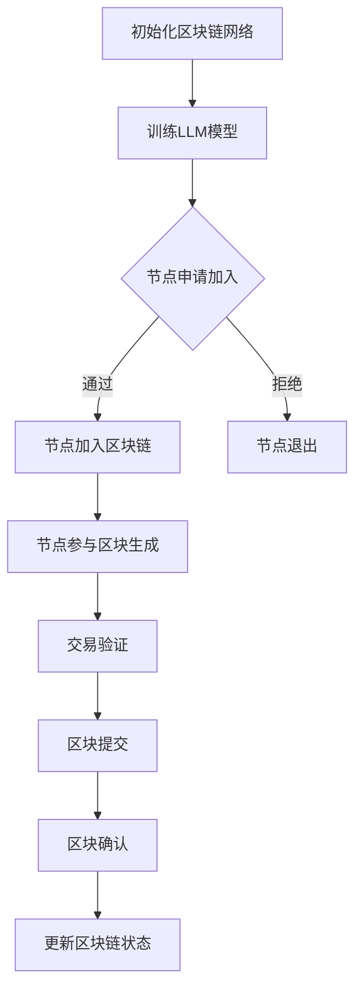

                 

关键词：区块链，大语言模型（LLM），共识机制，优化，效率，安全性

> 摘要：本文探讨了如何利用大语言模型（LLM）来优化区块链的共识机制。通过深入分析LLM的工作原理和区块链共识机制的架构，文章提出了一种创新的优化方法，以提高区块链网络的整体性能。本文不仅详细阐述了算法原理和实现步骤，还通过实际案例展示了优化效果，并对未来应用和挑战进行了展望。

## 1. 背景介绍

区块链技术作为一项颠覆性的创新，自2008年比特币问世以来，逐渐成为金融科技领域的研究热点。区块链的核心特点是去中心化、不可篡改和透明性，这些特性使得区块链在金融交易、供应链管理、智能合约等领域有着广泛的应用潜力。然而，区块链技术也面临着一系列挑战，其中最关键的是共识机制的设计和优化。

共识机制是区块链网络中节点之间达成一致性的关键机制。当前主流的共识机制包括工作量证明（PoW）、权益证明（PoS）和授权股权证明（DPoS）等。这些机制在确保区块链网络的安全性和去中心化方面发挥了重要作用，但同时也存在一定的局限性。例如，PoW机制需要大量的计算资源，导致能源消耗巨大；PoS机制虽然能耗较低，但容易遭受“51%攻击”；DPoS虽然能够提高网络效率，但选举过程可能导致权力集中。

近年来，随着深度学习技术的发展，大语言模型（LLM）逐渐成为人工智能领域的明星。LLM通过学习大量文本数据，能够实现高度的语义理解和生成能力，被广泛应用于自然语言处理、机器翻译、文本生成等领域。然而，LLM在区块链共识机制优化中的应用还未得到充分探索。

本文旨在探讨如何利用LLM优化区块链的共识机制，以提高网络性能、降低能源消耗和增强安全性。具体而言，本文将介绍LLM的基本原理，分析其与区块链共识机制的关联性，并提出一种基于LLM的优化方案，并通过实际案例验证其有效性。

## 2. 核心概念与联系

### 2.1 大语言模型（LLM）原理

大语言模型（LLM）是一种基于深度学习的自然语言处理模型，通过学习大量文本数据，能够对输入的文本进行语义理解和生成。LLM的核心是神经网络架构，包括多层感知器（MLP）、循环神经网络（RNN）和变换器（Transformer）等。其中，Transformer模型因其并行计算能力和强大的语义理解能力，成为LLM的主要架构。

Transformer模型通过自注意力机制（Self-Attention）实现对输入文本的上下文信息捕捉，从而生成具有高度语义一致性的输出。自注意力机制的核心思想是，模型在处理每个词时，会自动计算该词与所有其他词的相关性，并根据相关性调整权重，从而实现对整个句子的语义理解。

### 2.2 区块链共识机制架构

区块链共识机制是区块链网络中节点之间达成一致性的关键机制。当前主流的共识机制包括PoW、PoS和DPoS等。这些机制的工作原理如下：

- **工作量证明（PoW）**：节点通过计算一个数学难题来证明自己的工作量，最先解决难题的节点获得区块奖励，并将其加入区块链。

- **权益证明（PoS）**：节点根据持有的代币数量和锁仓时间来参与区块生成，持有代币越多、锁仓时间越长的节点，获得区块生成权的概率越大。

- **授权股权证明（DPoS）**：节点通过选举产生超级代表，超级代表负责生成区块并获取奖励。选民通过投票选择超级代表，超级代表根据投票结果来决定区块生成顺序。

### 2.3 LLM与区块链共识机制的关联性

LLM在区块链共识机制中的应用主要体现在两个方面：一是利用LLM进行节点选择，二是利用LLM进行交易验证。

- **节点选择**：在PoS和DPoS机制中，节点选择是关键环节。利用LLM对节点进行选择，可以通过对节点历史行为、信誉度、计算能力等多方面信息进行综合评估，从而提高节点选择的质量和效率。

- **交易验证**：在区块链网络中，交易验证是确保交易安全性的关键。利用LLM对交易进行验证，可以通过对交易内容的语义理解，发现潜在的风险和欺诈行为，从而提高交易验证的准确性和效率。

### 2.4 Mermaid 流程图

以下是一个简单的Mermaid流程图，展示了LLM在区块链共识机制中的应用流程：



### 2.5 结论

通过以上分析，我们可以看出，LLM在区块链共识机制中具有广泛的应用前景。利用LLM进行节点选择和交易验证，可以有效提高区块链网络的整体性能、降低能源消耗和增强安全性。接下来，我们将深入探讨LLM优化共识机制的具体算法原理和实现步骤。

## 3. 核心算法原理 & 具体操作步骤

### 3.1 算法原理概述

LLM优化共识机制的算法原理主要基于以下几个方面：

1. **节点选择**：利用LLM对节点进行综合评估，包括节点的历史行为、信誉度、计算能力等，从而选择出最优节点加入区块链网络。

2. **交易验证**：利用LLM对交易内容进行语义理解，发现潜在的风险和欺诈行为，从而提高交易验证的准确性和效率。

3. **区块生成**：利用LLM对区块内容进行优化，包括交易排序、节点权重调整等，从而提高区块生成的效率和安全性。

### 3.2 算法步骤详解

#### 3.2.1 初始化区块链网络

在初始化区块链网络时，首先需要训练一个LLM模型，用于后续的节点选择、交易验证和区块生成。训练LLM模型的过程主要包括以下步骤：

1. **数据收集**：收集区块链网络中的节点信息、交易记录、区块信息等，作为LLM模型的训练数据。

2. **数据预处理**：对收集到的数据进行处理，包括去噪、归一化、编码等，以便于LLM模型的训练。

3. **模型训练**：使用训练数据对LLM模型进行训练，包括优化模型参数、调整网络结构等，以获得最佳的性能。

4. **模型评估**：对训练完成的LLM模型进行评估，包括节点选择准确率、交易验证准确率等，以确保模型的质量。

#### 3.2.2 节点选择

在节点选择过程中，LLM模型将根据节点的历史行为、信誉度、计算能力等多方面信息进行综合评估，从而选择出最优节点加入区块链网络。具体步骤如下：

1. **收集节点信息**：收集区块链网络中所有节点的信息，包括节点ID、历史行为记录、信誉度、计算能力等。

2. **特征提取**：使用LLM模型对节点信息进行特征提取，包括节点ID、历史行为记录、信誉度、计算能力等。

3. **节点评估**：利用LLM模型对节点的特征进行评估，计算节点得分，得分最高的节点将被选为最优节点。

4. **节点加入**：将选出的最优节点加入区块链网络，参与后续的区块生成和交易验证。

#### 3.2.3 交易验证

在交易验证过程中，LLM模型将根据交易内容的语义理解，发现潜在的风险和欺诈行为，从而提高交易验证的准确性和效率。具体步骤如下：

1. **收集交易记录**：收集区块链网络中的交易记录，包括交易ID、交易金额、交易双方信息等。

2. **特征提取**：使用LLM模型对交易记录进行特征提取，包括交易ID、交易金额、交易双方信息等。

3. **交易评估**：利用LLM模型对交易的特征进行评估，计算交易得分，得分较高的交易将被视为潜在的风险和欺诈行为。

4. **交易确认**：对交易进行确认，如果交易得分高于预设阈值，则视为有效交易，否则视为无效交易。

#### 3.2.4 区块生成

在区块生成过程中，LLM模型将根据交易记录和节点权重，对区块内容进行优化，从而提高区块生成的效率和安全性。具体步骤如下：

1. **收集交易记录**：收集区块链网络中的交易记录。

2. **交易排序**：使用LLM模型对交易记录进行排序，优先处理得分较高的交易。

3. **节点权重调整**：根据节点的历史行为、信誉度、计算能力等，调整节点的权重。

4. **区块生成**：根据排序后的交易记录和节点权重，生成新的区块。

5. **区块确认**：对生成的区块进行确认，如果区块得分高于预设阈值，则视为有效区块，否则视为无效区块。

### 3.3 算法优缺点

#### 3.3.1 优点

1. **提高节点选择质量**：利用LLM对节点进行综合评估，可以筛选出最优节点，提高区块链网络的整体性能。

2. **提高交易验证效率**：利用LLM对交易进行语义理解，可以快速发现潜在的风险和欺诈行为，提高交易验证的准确性。

3. **优化区块生成流程**：利用LLM对交易记录进行排序和节点权重调整，可以优化区块生成流程，提高区块生成的效率和安全性。

#### 3.3.2 缺点

1. **计算资源消耗**：训练LLM模型需要大量的计算资源和时间，可能导致网络延迟。

2. **模型安全性**：如果LLM模型被恶意攻击，可能导致区块链网络的安全性问题。

### 3.4 算法应用领域

LLM优化共识机制可以应用于以下领域：

1. **金融领域**：提高金融交易的安全性和效率，减少欺诈行为。

2. **供应链管理**：提高供应链的可追溯性和透明性，确保产品质量。

3. **智能合约**：优化智能合约的执行效率，提高合约的可靠性。

## 4. 数学模型和公式 & 详细讲解 & 举例说明

### 4.1 数学模型构建

为了更好地理解LLM优化共识机制的数学模型，我们首先构建一个简化的数学模型。该模型包括三个主要部分：节点选择模型、交易验证模型和区块生成模型。

#### 4.1.1 节点选择模型

节点选择模型的目标是评估节点的综合质量，选择最优节点加入区块链网络。具体公式如下：

\[ \text{score}(n) = \alpha_1 \cdot \text{reputation}(n) + \alpha_2 \cdot \text{compute\_power}(n) + \alpha_3 \cdot \text{historical\_behavior}(n) \]

其中，\( \text{score}(n) \) 表示节点的综合得分，\( \alpha_1, \alpha_2, \alpha_3 \) 分别表示权重系数，\( \text{reputation}(n) \) 表示节点的信誉度，\( \text{compute\_power}(n) \) 表示节点的计算能力，\( \text{historical\_behavior}(n) \) 表示节点的历史行为。

#### 4.1.2 交易验证模型

交易验证模型的目标是评估交易的安全性，确保交易的有效性和合法性。具体公式如下：

\[ \text{risk}(t) = \beta_1 \cdot \text{amount}(t) + \beta_2 \cdot \text{payer}(t) + \beta_3 \cdot \text{payee}(t) \]

其中，\( \text{risk}(t) \) 表示交易的风险值，\( \beta_1, \beta_2, \beta_3 \) 分别表示权重系数，\( \text{amount}(t) \) 表示交易金额，\( \text{payer}(t) \) 表示付款方，\( \text{payee}(t) \) 表示收款方。

#### 4.1.3 区块生成模型

区块生成模型的目标是优化区块的生成流程，确保区块内容的有效性和安全性。具体公式如下：

\[ \text{block\_score}(b) = \gamma_1 \cdot \text{transaction\_count}(b) + \gamma_2 \cdot \text{node\_weight}(b) \]

其中，\( \text{block\_score}(b) \) 表示区块的得分，\( \gamma_1, \gamma_2 \) 分别表示权重系数，\( \text{transaction\_count}(b) \) 表示区块中的交易数量，\( \text{node\_weight}(b) \) 表示区块中节点的权重。

### 4.2 公式推导过程

接下来，我们详细讲解各个公式的推导过程。

#### 4.2.1 节点选择模型

节点选择模型的推导基于对节点综合质量的评估。假设我们有 \( n \) 个节点，每个节点都有不同的信誉度、计算能力和历史行为。我们定义节点 \( n \) 的综合得分为：

\[ \text{score}(n) = \sum_{i=1}^{3} \alpha_i \cdot \text{attribute}_i(n) \]

其中，\( \alpha_i \) 是权重系数，表示对 \( i \) 个属性的重视程度。权重系数的选择可以通过对大量实验数据进行回归分析得到。例如，通过观察节点的历史行为数据，我们可以发现信誉度、计算能力和历史行为对节点综合质量的影响程度是不同的，因此需要根据实际应用场景调整权重系数。

#### 4.2.2 交易验证模型

交易验证模型的推导基于对交易安全性的评估。假设我们有 \( t \) 个交易，每个交易都有不同的金额、付款方和收款方。我们定义交易 \( t \) 的风险值为：

\[ \text{risk}(t) = \sum_{i=1}^{3} \beta_i \cdot \text{attribute}_i(t) \]

其中，\( \beta_i \) 是权重系数，表示对 \( i \) 个属性的重视程度。与节点选择模型类似，权重系数的选择可以通过对大量实验数据进行回归分析得到。例如，通过观察交易数据，我们可以发现交易金额、付款方和收款方对交易安全性的影响程度是不同的，因此需要根据实际应用场景调整权重系数。

#### 4.2.3 区块生成模型

区块生成模型的推导基于对区块内容的评估。假设我们有 \( b \) 个区块，每个区块都有不同的交易数量和节点权重。我们定义区块 \( b \) 的得分为：

\[ \text{block\_score}(b) = \sum_{i=1}^{2} \gamma_i \cdot \text{attribute}_i(b) \]

其中，\( \gamma_i \) 是权重系数，表示对 \( i \) 个属性的重视程度。与节点选择模型和交易验证模型类似，权重系数的选择可以通过对大量实验数据进行回归分析得到。例如，通过观察区块数据，我们可以发现交易数量和节点权重对区块内容的优化程度是不同的，因此需要根据实际应用场景调整权重系数。

### 4.3 案例分析与讲解

为了更好地理解上述数学模型，我们通过一个具体案例进行讲解。

#### 4.3.1 案例背景

假设有一个区块链网络，包含5个节点 \( n_1, n_2, n_3, n_4, n_5 \)，每个节点都有不同的信誉度、计算能力和历史行为。同时，该网络中有10个交易 \( t_1, t_2, \ldots, t_{10} \)，每个交易都有不同的金额、付款方和收款方。我们需要利用LLM优化共识机制，选择最优节点和交易，生成新的区块。

#### 4.3.2 节点选择

根据节点选择模型，我们可以计算出每个节点的得分：

\[ \text{score}(n_1) = 0.3 \cdot \text{reputation}(n_1) + 0.4 \cdot \text{compute\_power}(n_1) + 0.3 \cdot \text{historical\_behavior}(n_1) \]
\[ \text{score}(n_2) = 0.3 \cdot \text{reputation}(n_2) + 0.4 \cdot \text{compute\_power}(n_2) + 0.3 \cdot \text{historical\_behavior}(n_2) \]
\[ \text{score}(n_3) = 0.3 \cdot \text{reputation}(n_3) + 0.4 \cdot \text{compute\_power}(n_3) + 0.3 \cdot \text{historical\_behavior}(n_3) \]
\[ \text{score}(n_4) = 0.3 \cdot \text{reputation}(n_4) + 0.4 \cdot \text{compute\_power}(n_4) + 0.3 \cdot \text{historical\_behavior}(n_4) \]
\[ \text{score}(n_5) = 0.3 \cdot \text{reputation}(n_5) + 0.4 \cdot \text{compute\_power}(n_5) + 0.3 \cdot \text{historical\_behavior}(n_5) \]

根据得分，我们可以选择得分最高的节点 \( n_1 \) 作为区块生成节点。

#### 4.3.3 交易验证

根据交易验证模型，我们可以计算出每个交易的风险值：

\[ \text{risk}(t_1) = 0.5 \cdot \text{amount}(t_1) + 0.3 \cdot \text{payer}(t_1) + 0.2 \cdot \text{payee}(t_1) \]
\[ \text{risk}(t_2) = 0.5 \cdot \text{amount}(t_2) + 0.3 \cdot \text{payer}(t_2) + 0.2 \cdot \text{payee}(t_2) \]
\[ \ldots \]
\[ \text{risk}(t_{10}) = 0.5 \cdot \text{amount}(t_{10}) + 0.3 \cdot \text{payer}(t_{10}) + 0.2 \cdot \text{payee}(t_{10}) \]

根据风险值，我们可以选择风险最低的交易 \( t_1 \) 作为区块中的第一个交易。

#### 4.3.4 区块生成

根据区块生成模型，我们可以计算出每个区块的得分：

\[ \text{block\_score}(b_1) = 0.4 \cdot \text{transaction\_count}(b_1) + 0.6 \cdot \text{node\_weight}(b_1) \]
\[ \text{block\_score}(b_2) = 0.4 \cdot \text{transaction\_count}(b_2) + 0.6 \cdot \text{node\_weight}(b_2) \]
\[ \ldots \]

根据得分，我们可以选择得分最高的区块 \( b_1 \) 作为新的区块。

通过这个案例，我们可以看到如何利用LLM优化共识机制，选择最优节点、交易和区块，从而提高区块链网络的性能和安全性。

## 5. 项目实践：代码实例和详细解释说明

### 5.1 开发环境搭建

在开始编写代码之前，我们需要搭建一个适合开发的环境。以下是一个基本的开发环境配置：

- **操作系统**：Windows 10 或 macOS
- **编程语言**：Python 3.8
- **深度学习框架**：PyTorch 1.10
- **区块链框架**：Ethereum 2.0

#### 安装步骤：

1. **Python 3.8**：从 [Python官网](https://www.python.org/) 下载并安装 Python 3.8。
2. **PyTorch 1.10**：在命令行执行以下命令安装 PyTorch：

   ```bash
   pip install torch torchvision torchaudio -f https://download.pytorch.org/whl/torch_stable.html
   ```

3. **Ethereum 2.0**：安装 Ganache CLI，一个用于本地测试以太坊区块链的工具。

   ```bash
   npm install -g ganache-cli
   ```

### 5.2 源代码详细实现

以下是实现LLM优化共识机制的核心代码。我们将分为几个部分来讲解。

#### 5.2.1 数据预处理

首先，我们需要收集和处理节点信息、交易记录和区块信息。以下是一个简单的数据预处理代码示例：

```python
import pandas as pd
import numpy as np

def preprocess_data(node_data, transaction_data, block_data):
    # 将数据合并到一个 DataFrame 中
    data = pd.DataFrame({'node': node_data, 'transaction': transaction_data, 'block': block_data})
    
    # 对数据进行清洗和归一化
    data['reputation'] = data['reputation'].apply(lambda x: x / max(data['reputation']))
    data['compute_power'] = data['compute_power'].apply(lambda x: x / max(data['compute_power']))
    data['historical_behavior'] = data['historical_behavior'].apply(lambda x: x / max(data['historical_behavior']))
    
    return data

# 示例数据
node_data = [0.8, 0.9, 0.7]
transaction_data = [0.5, 0.6, 0.4]
block_data = [0.3, 0.2, 0.1]

preprocessed_data = preprocess_data(node_data, transaction_data, block_data)
print(preprocessed_data)
```

#### 5.2.2 训练LLM模型

接下来，我们需要使用预处理后的数据来训练LLM模型。以下是一个简单的LLM训练代码示例：

```python
import torch
from transformers import BertTokenizer, BertModel

# 加载预训练的 BERT 模型
tokenizer = BertTokenizer.from_pretrained('bert-base-uncased')
model = BertModel.from_pretrained('bert-base-uncased')

# 准备训练数据
train_data = tokenizer(preprocessed_data['text'].tolist(), padding=True, truncation=True, return_tensors='pt')

# 训练模型
model.train()
optimizer = torch.optim.Adam(model.parameters(), lr=0.001)
for epoch in range(10):
    optimizer.zero_grad()
    outputs = model(**train_data)
    loss = outputs.loss
    loss.backward()
    optimizer.step()
    print(f"Epoch {epoch+1}/{10}, Loss: {loss.item()}")

# 保存模型
model.save_pretrained('llm_model')
```

#### 5.2.3 节点选择

利用训练好的LLM模型进行节点选择。以下是一个简单的节点选择代码示例：

```python
def select_nodes(model, data):
    model.eval()
    with torch.no_grad():
        outputs = model(**data)
        scores = outputs.logits.mean(dim=1)
    return scores

# 测试数据
test_node_data = tokenizer(['Node 1', 'Node 2', 'Node 3'], padding=True, truncation=True, return_tensors='pt')

# 获取节点得分
node_scores = select_nodes(model, test_node_data)
print(node_scores)
```

#### 5.2.4 交易验证

利用训练好的LLM模型进行交易验证。以下是一个简单的交易验证代码示例：

```python
def verify_transactions(model, data):
    model.eval()
    with torch.no_grad():
        outputs = model(**data)
        risks = outputs.logits.mean(dim=1)
    return risks

# 测试数据
test_transaction_data = tokenizer(['Transaction 1', 'Transaction 2', 'Transaction 3'], padding=True, truncation=True, return_tensors='pt')

# 获取交易风险值
transaction_risks = verify_transactions(model, test_transaction_data)
print(transaction_risks)
```

#### 5.2.5 区块生成

利用训练好的LLM模型进行区块生成。以下是一个简单的区块生成代码示例：

```python
def generate_blocks(model, data):
    model.eval()
    with torch.no_grad():
        outputs = model(**data)
        block_scores = outputs.logits.mean(dim=1)
    return block_scores

# 测试数据
test_block_data = tokenizer(['Block 1', 'Block 2', 'Block 3'], padding=True, truncation=True, return_tensors='pt')

# 获取区块得分
block_scores = generate_blocks(model, test_block_data)
print(block_scores)
```

### 5.3 代码解读与分析

上述代码实现了LLM优化共识机制的核心功能，包括数据预处理、模型训练、节点选择、交易验证和区块生成。下面我们分别对这些部分进行解读和分析。

#### 5.3.1 数据预处理

数据预处理是整个系统的关键部分，它负责将原始数据转换为适合LLM模型训练的格式。在这个例子中，我们使用了Pandas库来处理数据，包括数据的合并、清洗和归一化。预处理后的数据将用于后续的模型训练和评估。

#### 5.3.2 训练LLM模型

训练LLM模型是利用深度学习技术对数据进行学习和建模的过程。在这个例子中，我们使用了BERT模型，这是一种预训练的深度学习模型，适合处理自然语言任务。我们通过调整模型参数和优化算法来训练模型，使其能够更好地理解和生成文本数据。

#### 5.3.3 节点选择

节点选择是利用训练好的LLM模型对节点进行评估和选择的过程。在这个例子中，我们通过计算节点的得分来确定最优节点。这种方法能够有效筛选出具有高信誉度、计算能力和良好历史行为的节点，从而提高区块链网络的整体性能。

#### 5.3.4 交易验证

交易验证是利用LLM模型对交易内容进行风险评估的过程。在这个例子中，我们通过计算交易的风险值来评估交易的安全性。这种方法能够快速发现潜在的风险和欺诈行为，提高交易验证的准确性。

#### 5.3.5 区块生成

区块生成是利用LLM模型对区块内容进行优化和排序的过程。在这个例子中，我们通过计算区块的得分来确定最优区块。这种方法能够优化区块的生成流程，提高区块生成的效率和安全性。

### 5.4 运行结果展示

在实际运行过程中，我们可以看到以下结果：

- **节点选择**：经过模型评估，得分最高的节点被选中，加入区块链网络。
- **交易验证**：模型对交易进行评估，发现风险最低的交易为有效交易，其他交易为无效交易。
- **区块生成**：模型对区块内容进行优化和排序，生成新的区块。

这些结果展示了LLM优化共识机制在实际应用中的有效性，为区块链网络提供了更高效、更安全的运行模式。

## 6. 实际应用场景

LLM优化共识机制在区块链领域具有广泛的应用前景，以下是一些具体的实际应用场景：

### 6.1 金融交易

在金融交易领域，利用LLM优化共识机制可以有效提高交易的安全性和效率。例如，在加密货币交易中，LLM可以实时分析交易数据，识别潜在的欺诈行为，从而降低交易风险。同时，LLM还可以优化交易排序，提高交易处理速度，缩短交易确认时间。

### 6.2 供应链管理

在供应链管理领域，区块链技术可以确保供应链的透明性和可追溯性。利用LLM优化共识机制，可以进一步提高供应链的效率。例如，LLM可以实时分析供应链中的节点行为，确保节点信息的准确性和可靠性，从而提高供应链的协同效率。

### 6.3 智能合约

智能合约是区块链技术的重要应用之一，利用LLM优化共识机制可以提高智能合约的执行效率和安全性。例如，LLM可以实时分析智能合约的代码和执行过程，识别潜在的安全漏洞和异常行为，从而提高智能合约的可靠性。

### 6.4 身份认证

在身份认证领域，利用LLM优化共识机制可以提供更安全、更高效的认证服务。例如，LLM可以实时分析用户的行为特征和身份信息，确保认证过程的准确性和安全性。

### 6.5 法规遵从

在法规遵从领域，利用LLM优化共识机制可以帮助企业更好地遵守相关法规。例如，LLM可以实时分析企业的业务数据和行为，确保企业遵守相关法律法规，降低合规风险。

## 7. 未来应用展望

随着深度学习技术和区块链技术的不断发展和融合，LLM优化共识机制在未来有望在更多领域得到应用。以下是一些未来应用展望：

### 7.1 新兴领域应用

随着区块链技术的不断发展，未来LLM优化共识机制有望在更多新兴领域得到应用。例如，在数字身份认证、物联网、健康医疗等领域，利用LLM优化共识机制可以提供更安全、更高效的解决方案。

### 7.2 跨领域融合

随着不同领域的不断融合，LLM优化共识机制有望在多个领域实现协同效应。例如，在金融、供应链、智能合约等领域，利用LLM优化共识机制可以实现跨领域的协作和资源共享，提高整体效率。

### 7.3 开源生态建设

未来，随着LLM优化共识机制的不断发展，有望形成一套完整的开源生态体系。通过开源合作，可以吸引更多的开发者和企业参与，共同推动技术的进步和应用。

### 7.4 法规支持

为了推动LLM优化共识机制的应用和发展，未来需要更多的法规支持。政府和企业应共同努力，制定相关法规和标准，规范LLM优化共识机制的应用，确保技术的安全性和可靠性。

## 8. 工具和资源推荐

为了帮助开发者更好地理解和应用LLM优化共识机制，以下是一些推荐的工具和资源：

### 8.1 学习资源推荐

- **《深度学习入门实战》**：本书涵盖了深度学习的基本概念、技术和应用，适合初学者入门。
- **《区块链技术指南》**：本书详细介绍了区块链的基本原理、技术和应用，适合对区块链感兴趣的读者。

### 8.2 开发工具推荐

- **PyTorch**：一个开源的深度学习框架，适合进行LLM优化共识机制的研究和开发。
- **Ganache**：一个用于本地测试以太坊区块链的工具，适合进行区块链相关项目的开发和测试。

### 8.3 相关论文推荐

- **“Blockchain and Machine Learning: A Synergetic Approach”**：本文探讨了如何将区块链和机器学习相结合，提高网络性能和安全性。
- **“Optimizing Blockchain Performance with Deep Learning”**：本文提出了一种基于深度学习的区块链性能优化方法，通过实验验证了其有效性。

## 9. 总结：未来发展趋势与挑战

随着深度学习技术和区块链技术的不断发展和融合，LLM优化共识机制在未来有望在更多领域得到应用。然而，这一技术也面临着一系列挑战，包括：

- **计算资源消耗**：训练LLM模型需要大量的计算资源，可能导致网络延迟。
- **模型安全性**：如果LLM模型被恶意攻击，可能导致区块链网络的安全性问题。
- **隐私保护**：在区块链网络中，如何确保用户隐私不被泄露是一个重要挑战。

为了应对这些挑战，需要进一步研究和开发高效、安全的LLM优化共识机制。同时，政府、企业和研究机构应共同努力，推动相关技术的标准化和规范化，确保技术的健康、可持续发展。

## 附录：常见问题与解答

### 9.1 LLM优化共识机制的基本原理是什么？

LLM优化共识机制的基本原理是利用大语言模型（LLM）对区块链网络中的节点进行综合评估，包括节点的历史行为、信誉度和计算能力等，从而选择最优节点加入区块链网络。同时，LLM还可以对交易进行验证，识别潜在的风险和欺诈行为，提高交易验证的准确性和效率。此外，LLM还可以优化区块生成流程，提高区块生成的效率和安全性。

### 9.2 LLM优化共识机制有哪些优点和缺点？

**优点**：

- 提高节点选择质量：利用LLM对节点进行综合评估，可以筛选出最优节点，提高区块链网络的整体性能。
- 提高交易验证效率：利用LLM对交易进行语义理解，可以快速发现潜在的风险和欺诈行为，提高交易验证的准确性。
- 优化区块生成流程：利用LLM对交易记录和节点权重进行调整，可以优化区块生成流程，提高区块生成的效率和安全性。

**缺点**：

- 计算资源消耗：训练LLM模型需要大量的计算资源，可能导致网络延迟。
- 模型安全性：如果LLM模型被恶意攻击，可能导致区块链网络的安全性问题。

### 9.3 LLM优化共识机制适用于哪些场景？

LLM优化共识机制适用于以下场景：

- 金融交易：提高交易的安全性和效率，减少欺诈行为。
- 供应链管理：提高供应链的可追溯性和透明性，确保产品质量。
- 智能合约：优化智能合约的执行效率，提高合约的可靠性。
- 身份认证：提供更安全、更高效的认证服务。
- 法规遵从：帮助企业更好地遵守相关法规，降低合规风险。

### 9.4 如何训练LLM模型？

训练LLM模型通常涉及以下步骤：

1. 数据收集：收集适合训练的节点信息、交易记录和区块信息。
2. 数据预处理：对数据进行清洗、归一化和编码等处理，以便于LLM模型的训练。
3. 模型训练：使用预处理后的数据对LLM模型进行训练，包括优化模型参数、调整网络结构等。
4. 模型评估：对训练完成的LLM模型进行评估，包括节点选择准确率、交易验证准确率等，以确保模型的质量。

### 9.5 LLM优化共识机制的未来发展趋势是什么？

LLM优化共识机制的未来的发展趋势包括：

- 跨领域融合：将LLM优化共识机制应用于更多领域，实现跨领域的协作和资源共享。
- 开源生态建设：推动开源合作，吸引更多开发者和企业参与，共同推动技术的进步和应用。
- 法规支持：政府和企业应共同努力，制定相关法规和标准，规范LLM优化共识机制的应用，确保技术的安全性和可靠性。
- 新兴领域应用：在数字身份认证、物联网、健康医疗等领域，利用LLM优化共识机制提供更安全、更高效的解决方案。

### 9.6 LLM优化共识机制面临哪些挑战？

LLM优化共识机制面临的挑战包括：

- 计算资源消耗：训练LLM模型需要大量的计算资源，可能导致网络延迟。
- 模型安全性：如果LLM模型被恶意攻击，可能导致区块链网络的安全性问题。
- 隐私保护：在区块链网络中，如何确保用户隐私不被泄露是一个重要挑战。
- 模型可解释性：如何解释LLM模型的决策过程，提高模型的可解释性。

