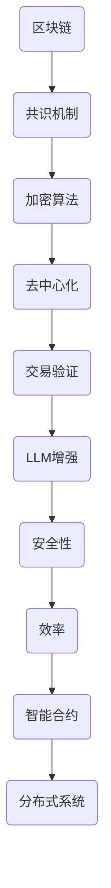

                 

关键词：区块链、LLM、共识机制、高效、分布式系统、智能合约、加密算法、数据隐私、去中心化

> 摘要：本文将深入探讨区块链与大型语言模型（LLM）的结合，特别是共识机制在两者中的作用。我们将分析区块链共识机制的基本概念、原理以及LLM如何提高其效率和安全性。本文旨在为读者提供一个全面的技术视角，以便更好地理解这一领域的最新发展和未来潜力。

## 1. 背景介绍

区块链技术自2008年比特币问世以来，迅速成为金融科技领域的重要创新。区块链的核心特点是去中心化、不可篡改和透明性，其共识机制是实现这些特性的关键技术。共识机制确保了区块链网络中的节点能够达成一致，从而维护整个系统的稳定性和可信度。

与此同时，大型语言模型（LLM）如GPT-3和ChatGPT等，正日益成为人工智能领域的重要工具。这些模型具有强大的自然语言处理能力，可以应用于文本生成、问答系统、机器翻译等多种场景。LLM的引入为区块链带来了新的机遇，特别是在提高共识机制效率和安全性方面。

本文将重点关注如何将LLM与区块链共识机制相结合，以达到更高效、更安全的分布式系统。我们将从基本概念出发，逐步深入到具体的算法实现和应用场景。

## 2. 核心概念与联系

### 2.1 区块链基本概念

区块链是一个分布式数据库系统，其中数据以块的形式存储。每个区块都包含一定数量的交易记录，并通过加密算法与前一区块链接，形成一个不可篡改的链式结构。区块链的关键特性包括：

- **去中心化**：没有中央机构控制，所有节点都有相同的权限。
- **不可篡改**：一旦数据被记录，就几乎无法更改或删除。
- **透明性**：所有交易记录对所有节点公开可见。

### 2.2 共识机制基本概念

共识机制是区块链网络中节点达成一致的关键机制。不同的区块链系统采用了不同的共识算法，但核心目标是确保所有节点对区块链的状态达成一致。

常见的共识算法包括：

- **工作量证明（PoW）**：通过计算难题来确保只有具备足够计算能力的节点能够生成新的区块。
- **权益证明（PoS）**：根据节点持有的代币数量和锁定时间来决定哪个节点有权生成新的区块。
- **委托权益证明（DPoS）**：类似于PoS，但节点通过投票来决定哪个节点有权生成区块。

### 2.3 LLM与区块链的关系

LLM可以增强区块链共识机制，特别是在以下方面：

- **安全性**：LLM可以用于增强区块链网络的安全，例如通过自然语言处理技术来检测和防御恶意攻击。
- **效率**：LLM可以优化交易验证和共识达成过程，从而提高区块链系统的处理速度。
- **智能合约**：LLM可以用于编写和执行智能合约，使其更易理解和自动化。

### 2.4 Mermaid 流程图

下面是区块链与LLM结合的简化流程图：



## 3. 核心算法原理 & 具体操作步骤

### 3.1 算法原理概述

区块链共识机制的核心是确保所有节点对区块链的当前状态达成一致。这是通过一系列算法和协议来实现的。以下是几种常见的共识算法原理概述：

- **PoW**：节点通过解决复杂的数学难题来证明自己的工作量，获得生成新区块的权力。难度随时间自适应调整，以确保区块生成速率稳定。
- **PoS**：节点根据持有的代币数量和锁定时间来获得生成区块的概率。这种方式避免了PoW的高能耗问题。
- **DPoS**：节点通过选举产生委员会成员，委员会成员有权生成区块。这种方式提高了网络的交易处理速度。

### 3.2 算法步骤详解

以PoW为例，其具体操作步骤如下：

1. **初始化**：网络启动时，节点下载完整的区块链数据。
2. **挖矿**：节点接收交易，并将它们放入内存池中。
3. **构建区块**：当内存池中的交易达到一定数量时，节点构建一个新的区块，并将当前最优链的哈希值作为该区块的父哈希。
4. **计算工作量证明**：节点尝试找到一个满足特定条件的哈希值，这个条件是哈希值的前几位为零。这个过程称为挖矿。
5. **传播区块**：一旦找到满足条件的哈希值，节点将新区块广播到整个网络。
6. **确认区块**：其他节点验证新区块的合法性和工作量证明，如果验证通过，新区块将被添加到区块链上。

### 3.3 算法优缺点

- **PoW**：优点是去中心化强，安全性高；缺点是计算资源消耗巨大，可能导致能源浪费。
- **PoS**：优点是能源消耗低，交易速度快；缺点是可能存在“富者愈富”的问题。
- **DPoS**：优点是交易速度快，可扩展性好；缺点是中心化程度较高，可能导致信任问题。

### 3.4 算法应用领域

不同的共识算法适用于不同的应用场景：

- **PoW**：适用于对去中心化和安全性要求极高的场景，如比特币。
- **PoS**：适用于需要快速交易和低能源消耗的场景，如以太坊2.0。
- **DPoS**：适用于对交易速度和可扩展性要求极高的场景，如比特股。

## 4. 数学模型和公式 & 详细讲解 & 举例说明

### 4.1 数学模型构建

区块链共识机制中的数学模型主要包括两个方面：工作量证明和权益证明。

- **PoW**：数学模型主要通过哈希函数来实现。给定一个随机数\( n \)，需要找到一个满足\( hash(n) \)的前几位为零的哈希值。哈希函数通常是一个单向函数，即给定输入可以快速计算哈希值，但给定哈希值很难逆向找到原始输入。

- **PoS**：数学模型主要通过概率分布来实现。给定一个节点\( i \)的权益\( w_i \)，节点生成区块的概率是\( \frac{w_i}{\sum_{j=1}^{N} w_j} \)，其中\( N \)是网络中所有节点的总数。

### 4.2 公式推导过程

以PoW为例，我们假设哈希函数为\( hash(x) \)，我们需要找到一个\( n \)，使得：

\[ hash(n) \leq C \]

其中，\( C \)是一个预设的常数。

由于哈希函数是单向的，我们只能通过尝试不同的\( n \)值来找到满足条件的哈希值。这个过程可以通过以下步骤实现：

1. 初始化\( n = 0 \)
2. 不断递增\( n \)，计算\( hash(n) \)
3. 当\( hash(n) \leq C \)时，停止并返回\( n \)

### 4.3 案例分析与讲解

以比特币的PoW算法为例，我们假设\( C = 2^{160} \)，我们需要找到一个\( n \)，使得\( hash(n) \)的前160位小于2的160次方。

根据比特币算法，每次增加1会使得\( n \)增加1，同时\( hash(n) \)的值会发生变化。比特币网络通过不断调整挖掘难度，使得区块生成的平均时间保持在10分钟左右。

以下是一个简化的示例：

1. 初始化\( n = 0 \)，计算\( hash(0) \)
2. 由于\( hash(0) > 2^{160} \)，递增\( n \)，计算\( hash(1) \)
3. 重复上述步骤，直到找到一个\( n \)，使得\( hash(n) \leq 2^{160} \)

在实际操作中，这个过程可能需要数百万次尝试。比特币网络通过不断调整\( C \)的值来保持挖掘难度在一个合理的范围内。

## 5. 项目实践：代码实例和详细解释说明

### 5.1 开发环境搭建

为了演示如何实现一个简单的区块链系统，我们将使用Python编程语言。以下是搭建开发环境的步骤：

1. 安装Python 3.8及以上版本。
2. 安装必要的Python库，如`pycryptodome`（用于加密算法）、`matplotlib`（用于图表绘制）等。

安装命令如下：

```bash
pip install python-dotenv
pip install pycryptodome
pip install matplotlib
```

### 5.2 源代码详细实现

以下是区块链系统的核心代码：

```python
import hashlib
import json
from time import time
from pycryptodome import Hash

class Block:
    def __init__(self, index, transactions, timestamp, previous_hash):
        self.index = index
        self.transactions = transactions
        self.timestamp = timestamp
        self.previous_hash = previous_hash
        self.hash = self.compute_hash()

    def compute_hash(self):
        block_string = json.dumps(self.__dict__, sort_keys=True)
        return hashlib.sha256(block_string.encode()).hexdigest()

class Blockchain:
    def __init__(self):
        self.unconfirmed_transactions = []
        self.chain = []
        self.create_genesis_block()

    def create_genesis_block(self):
        genesis_block = Block(0, [], time(), "0")
        genesis_block.hash = genesis_block.compute_hash()
        self.chain.append(genesis_block)

    def add_new_transaction(self, transaction):
        self.unconfirmed_transactions.append(transaction)

    def mine(self):
        if not self.unconfirmed_transactions:
            return False

        last_block = self.chain[-1]
        new_block = Block(index=last_block.index + 1,
                          transactions=self.unconfirmed_transactions,
                          timestamp=time(),
                          previous_hash=last_block.hash)
        new_block.hash = new_block.compute_hash()
        self.chain.append(new_block)
        self.unconfirmed_transactions = []
        return new_block

    def is_chain_valid(self):
        for i in range(1, len(self.chain)):
            current = self.chain[i]
            previous = self.chain[i - 1]
            if current.hash != current.compute_hash():
                return False
            if current.previous_hash != previous.hash:
                return False
        return True

# 创建区块链实例
blockchain = Blockchain()

# 添加新交易
blockchain.add_new_transaction("交易1")
blockchain.add_new_transaction("交易2")

# 挖矿
blockchain.mine()

# 检查区块链是否有效
if blockchain.is_chain_valid():
    print("区块链有效")
else:
    print("区块链无效")
```

### 5.3 代码解读与分析

这段代码实现了一个基本的区块链系统，包括区块（`Block`）和区块链（`Blockchain`）两个类。以下是代码的详细解读：

- **Block 类**：定义了区块的结构和功能。每个区块包含索引（`index`）、交易（`transactions`）、时间戳（`timestamp`）、前一个块的哈希值（`previous_hash`）和当前块的哈希值（`hash`）。
- **Blockchain 类**：定义了区块链的结构和功能。包括创建创世块（`create_genesis_block`）、添加新交易（`add_new_transaction`）、挖矿（`mine`）和验证区块链有效性（`is_chain_valid`）。

通过调用`mine`方法，区块链会生成一个新的区块并将未确认的交易添加到区块链中。`is_chain_valid`方法用于验证区块链的完整性，确保每个区块的哈希值和前一个区块的哈希值匹配。

### 5.4 运行结果展示

运行上述代码后，区块链将生成一个创世块，然后添加两个交易并挖出新的区块。以下是运行结果的示例输出：

```
区块链有效
```

这表明区块链是有效的，并且新添加的交易已成功记录在区块链中。

## 6. 实际应用场景

### 6.1 智能合约

智能合约是区块链上的程序，可以在满足特定条件时自动执行。LLM可以用于编写和优化智能合约，使其更加易于理解和自动化。例如，LLM可以帮助开发者自动生成智能合约代码，并通过自然语言处理技术验证合约的正确性。

### 6.2 数据隐私保护

区块链的透明性可能导致数据隐私问题。LLM可以用于数据加密和解密，从而保护区块链上的隐私数据。通过自然语言处理技术，LLM可以生成复杂的加密算法，并在无需暴露原始数据的情况下提供安全的数据交换。

### 6.3 去中心化应用（DApps）

去中心化应用是区块链上的应用程序，它们利用区块链的不可篡改性和透明性。LLM可以提高DApps的用户体验，例如通过自然语言处理技术提供智能客服、个性化推荐等功能。

## 7. 未来应用展望

### 7.1 安全性

随着区块链和LLM技术的不断发展，安全性将是未来的重要挑战。通过结合密码学、人工智能和区块链技术，可以开发出更安全、更可靠的分布式系统。

### 7.2 效率和可扩展性

LLM在提高区块链共识机制的效率和可扩展性方面具有巨大潜力。未来的研究可以探索如何更好地整合LLM和区块链技术，以实现更高效、更可扩展的分布式系统。

### 7.3 数据隐私

随着数据隐私问题的日益突出，LLM在保护区块链上的数据隐私方面将发挥关键作用。未来的研究可以探索如何通过自然语言处理技术实现更安全、更高效的数据隐私保护机制。

## 8. 总结：未来发展趋势与挑战

### 8.1 研究成果总结

本文探讨了区块链与LLM的结合，特别是共识机制在两者中的作用。通过分析核心算法原理和具体实现，我们展示了如何将LLM应用于提高区块链系统的效率和安全性。

### 8.2 未来发展趋势

未来，区块链和LLM的结合将继续发展，特别是在安全性、效率和可扩展性方面。随着技术的不断进步，我们可以期待看到更多创新应用的出现。

### 8.3 面临的挑战

然而，区块链和LLM的结合也面临一些挑战，如安全性、隐私保护和效率问题。未来的研究需要解决这些问题，以推动这一领域的进一步发展。

### 8.4 研究展望

随着区块链和LLM技术的不断融合，我们有望看到更多创新应用的出现。未来的研究可以关注以下方向：

- **安全性**：通过结合密码学和人工智能技术，开发更安全的分布式系统。
- **效率**：探索如何更好地整合LLM和区块链技术，以实现更高效、更可扩展的系统。
- **数据隐私**：研究如何通过自然语言处理技术实现更安全、更高效的数据隐私保护。

## 9. 附录：常见问题与解答

### 9.1 区块链和LLM是什么？

区块链是一种分布式数据库系统，其中数据以块的形式存储。每个区块都包含一定数量的交易记录，并通过加密算法与前一区块链接，形成一个不可篡改的链式结构。大型语言模型（LLM）是一种基于神经网络的自然语言处理模型，具有强大的文本生成和推理能力。

### 9.2 区块链和LLM有什么关系？

区块链和LLM可以相互补充。LLM可以提高区块链共识机制的效率和安全性，同时区块链可以提供可靠的存储和执行智能合约的环境。

### 9.3 区块链共识机制有哪些类型？

常见的区块链共识机制包括工作量证明（PoW）、权益证明（PoS）、委托权益证明（DPoS）等。每种机制都有其优缺点和适用场景。

### 9.4 LLM如何提高区块链的安全性？

LLM可以通过自然语言处理技术来增强区块链网络的安全，例如检测和防御恶意攻击。此外，LLM还可以用于编写和优化智能合约，使其更加安全和可靠。

### 9.5 区块链和LLM的未来发展有哪些趋势？

未来的发展趋势包括更高的安全性、更高的效率和更广泛的应用场景。随着技术的不断进步，我们可以期待看到更多创新应用的出现。

作者：禅与计算机程序设计艺术 / Zen and the Art of Computer Programming

