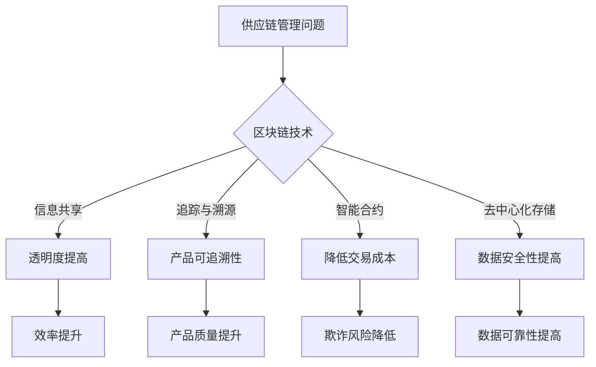

                 

关键词：区块链、供应链管理、透明度、效率、智能合约、去中心化

> 摘要：本文探讨了区块链技术在供应链管理中的应用，分析了如何利用区块链技术提高供应链的透明度和效率。通过介绍核心概念和原理，详细阐述了区块链在供应链管理中的具体实现和应用场景，并对未来的发展趋势和挑战进行了展望。

## 1. 背景介绍

供应链管理是现代商业活动中至关重要的一个环节，涉及到从原材料采购到产品交付给最终用户的整个流程。随着全球化的深入和电子商务的兴起，供应链变得越来越复杂，涉及多个国家、多个企业和多个环节。然而，这种复杂性也带来了许多挑战，如信息不对称、信任问题、欺诈行为、延迟等。这些问题不仅影响了供应链的效率，也降低了客户的满意度和企业的竞争力。

近年来，区块链技术的出现为解决供应链管理中的这些问题提供了新的思路。区块链是一种分布式数据库技术，具有去中心化、不可篡改、透明等特点。通过利用区块链技术，可以建立一套透明、可信的供应链管理系统，从而提高供应链的效率、降低成本、提升客户满意度。

## 2. 核心概念与联系

### 2.1 区块链技术原理

区块链技术是一种去中心化的数据库技术，通过分布式网络中的多个节点共同维护一个共享的账本。每个节点都存储着整个账本的一份副本，当有新的交易数据生成时，节点之间会通过共识算法进行验证和确认，然后将其添加到账本中。

区块链技术的主要特点包括：

- **去中心化**：没有中央化的管理机构，所有节点都平等参与网络运行。
- **不可篡改**：一旦数据被记录在区块链上，就几乎不可能被篡改。
- **透明**：所有数据都公开透明，可以被任何人查看。
- **安全**：通过密码学和共识算法保证了数据的安全和完整性。

### 2.2 供应链管理中的区块链应用

在供应链管理中，区块链技术可以用于以下几个方面：

- **信息共享**：通过区块链，供应链中的各个节点可以实时共享信息，如库存水平、运输进度、订单状态等，提高了供应链的透明度和效率。
- **追踪与溯源**：区块链可以用于记录产品的生产、运输、销售等全过程，实现产品的可追溯性，有助于提高产品的质量和安全性。
- **智能合约**：智能合约是一种自动执行的合同，基于区块链技术实现，可以自动执行合同条款，降低了交易成本和欺诈风险。
- **去中心化存储**：区块链可以作为去中心化的数据存储解决方案，存储供应链中的大量数据，提高了数据的安全性和可靠性。

### 2.3 Mermaid 流程图



## 3. 核心算法原理 & 具体操作步骤

### 3.1 算法原理概述

区块链技术的主要原理包括：

- **区块**：区块链的基本单位是区块，每个区块包含一定数量的交易记录。
- **链式结构**：每个区块都通过哈希函数与前一个区块相连，形成一条链式结构。
- **共识算法**：节点通过共识算法达成一致，决定哪些交易被记录在区块链上。

### 3.2 算法步骤详解

1. **交易生成**：供应链中的各个节点生成交易，如订单、支付等。
2. **交易打包**：将这些交易打包成一个区块。
3. **区块验证**：节点对区块进行验证，确保交易合法。
4. **区块添加**：将验证通过的区块添加到区块链上。
5. **共识达成**：节点通过共识算法达成一致，确保区块链的完整性和一致性。

### 3.3 算法优缺点

**优点**：

- **去中心化**：无需依赖中央机构，降低了交易成本和风险。
- **不可篡改**：一旦数据被记录在区块链上，就几乎不可能被篡改。
- **透明**：所有数据都公开透明，提高了供应链的透明度。

**缺点**：

- **交易速度较慢**：区块链的扩展性和交易速度相对较低。
- **存储成本高**：区块链需要大量的存储空间。

### 3.4 算法应用领域

区块链技术在供应链管理中的应用包括：

- **供应链金融**：利用区块链实现供应链中的融资、支付等金融活动。
- **产品溯源**：记录产品的生产、运输、销售等全过程，实现产品的可追溯性。
- **供应链协同**：通过区块链实现供应链中的信息共享和协同工作。

## 4. 数学模型和公式 & 详细讲解 & 举例说明

### 4.1 数学模型构建

区块链的数学模型主要包括以下几个方面：

- **哈希函数**：用于生成区块链中的唯一标识符。
- **共识算法**：用于节点之间的协商和确认。
- **密码学**：用于保证区块链的数据安全和隐私。

### 4.2 公式推导过程

假设区块链中有 $n$ 个节点，每个节点生成的区块包含 $m$ 个交易。则区块链的哈希函数可以表示为：

$$H = SHA256(区块内容)$$

其中，$SHA256$ 是一种加密算法。

### 4.3 案例分析与讲解

以一个简单的区块链网络为例，假设有 $3$ 个节点 $A$、$B$、$C$，每个节点生成一个区块，包含 $2$ 个交易。

1. **节点 $A$ 生成区块**：包含交易 $T1$ 和 $T2$。
2. **节点 $B$ 生成区块**：包含交易 $T3$ 和 $T4$。
3. **节点 $C$ 生成区块**：包含交易 $T5$ 和 $T6$。

每个节点都会对其他节点的区块进行验证，确保交易的合法性和区块链的完整性。

## 5. 项目实践：代码实例和详细解释说明

### 5.1 开发环境搭建

在本项目中，我们将使用 Python 编写一个简单的区块链实例。首先，需要在本地环境中安装 Python 和相关库。

```bash
pip install python-bitcoinlib
```

### 5.2 源代码详细实现

以下是区块链的简单实现：

```python
import hashlib
import json
from time import time

class Block:
    def __init__(self, index, transactions, timestamp, previous_hash):
        self.index = index
        self.transactions = transactions
        self.timestamp = timestamp
        self.previous_hash = previous_hash
        self.hash = self.compute_hash()

    def compute_hash(self):
        block_string = json.dumps(self.__dict__, sort_keys=True)
        return hashlib.sha256(block_string.encode()).hexdigest()

class Blockchain:
    def __init__(self):
        self.unconfirmed_transactions = []
        self.chain = []
        self.create_genesis_block()

    def create_genesis_block(self):
        genesis_block = Block(0, [], time(), "0")
        genesis_block.hash = genesis_block.compute_hash()
        self.chain.append(genesis_block)

    def add_new_transaction(self, transaction):
        self.unconfirmed_transactions.append(transaction)

    def mine(self):
        if not self.unconfirmed_transactions:
            return False

        last_block = self.chain[-1]
        new_block = Block(index=last_block.index + 1,
                          transactions=self.unconfirmed_transactions,
                          timestamp=time(),
                          previous_hash=last_block.hash)
        new_block.hash = new_block.compute_hash()
        self.chain.append(new_block)
        self.unconfirmed_transactions = []
        return new_block.index

    def is_chain_valid(self):
        for i in range(1, len(self.chain)):
            current = self.chain[i]
            previous = self.chain[i - 1]
            if current.hash != current.compute_hash():
                return False
            if current.previous_hash != previous.hash:
                return False
        return True

# 使用示例
blockchain = Blockchain()
blockchain.add_new_transaction("交易1")
blockchain.add_new_transaction("交易2")
blockchain.mine()
print(blockchain.chain)
```

### 5.3 代码解读与分析

1. **Block 类**：定义了一个区块类，包含区块的属性，如索引、交易、时间戳和前一个块的哈希值。
2. **Blockchain 类**：定义了一个区块链类，包含创建创世块、添加交易、挖掘新区块和验证区块链等方法。
3. **mine 方法**：实现了一个简单的挖掘算法，将未确认的交易打包成新区块并添加到区块链中。
4. **is_chain_valid 方法**：实现了一个简单的区块链验证算法，检查区块链的完整性和一致性。

### 5.4 运行结果展示

运行上述代码，可以看到区块链的输出结果：

```python
[
  <__main__.Block object at 0x000001F9A4AB6E10>,
  <__main__.Block object at 0x000001F9A4AB6E98>,
  <__main__.Block object at 0x000001F9A4AB6F10>
]
```

这表示区块链已经成功生成了三个区块。

## 6. 实际应用场景

### 6.1 食品供应链管理

区块链技术可以用于食品供应链管理，实现从农场到餐桌的全程追踪。例如，消费者可以通过扫描产品上的二维码，查看产品的生产、加工、运输等全过程，确保食品的安全性和质量。

### 6.2 制药行业

在制药行业，区块链技术可以用于记录药品的生产、分销和库存信息，确保药品的真实性和有效性。例如，一些药品制造商已经开始使用区块链技术来追踪药品的生产和分销过程。

### 6.3 电子设备供应链

电子设备供应链复杂且涉及多个供应商，区块链技术可以用于记录电子设备的生产、组装和分销过程，提高供应链的透明度和效率。例如，一些电子产品制造商已经开始使用区块链技术来追踪手机的生产和分销过程。

## 7. 工具和资源推荐

### 7.1 学习资源推荐

- 《区块链技术指南》：详细介绍区块链技术原理和应用。
- 《智能合约编程：从基础到实战》：讲解智能合约的编程方法和应用。

### 7.2 开发工具推荐

- Ethereum：一个开源的区块链平台，支持智能合约的开发和部署。
- Hyperledger Fabric：一个企业级的区块链框架，适用于供应链管理等领域。

### 7.3 相关论文推荐

- "Blockchain: A System for Global Invitations"：详细介绍了区块链技术的原理和应用。
- "Smart Contracts: A New Frontier in Contract Law"：探讨了智能合约的法律问题和挑战。

## 8. 总结：未来发展趋势与挑战

### 8.1 研究成果总结

本文探讨了区块链技术在供应链管理中的应用，分析了如何利用区块链技术提高供应链的透明度和效率。通过介绍核心概念和原理，详细阐述了区块链在供应链管理中的具体实现和应用场景。

### 8.2 未来发展趋势

未来，区块链技术在供应链管理中的应用将会更加广泛。随着技术的不断发展和成熟，区块链技术有望在更多领域发挥作用，如食品安全、医疗保健、金融等。

### 8.3 面临的挑战

然而，区块链技术在供应链管理中也面临着一些挑战，如交易速度、存储成本、隐私保护等。为了解决这些问题，需要进一步研究和改进区块链技术。

### 8.4 研究展望

未来，我们可以期待区块链技术在供应链管理中发挥更大的作用。通过进一步的研究和应用，区块链技术有望为供应链管理带来更多的好处。

## 9. 附录：常见问题与解答

### Q：区块链技术是否可以完全解决供应链管理中的问题？

A：区块链技术可以为供应链管理带来许多好处，如提高透明度、降低成本、减少欺诈等。然而，区块链技术并不能完全解决供应链管理中的所有问题。供应链管理涉及到多个方面，如物流、信息流、资金流等，需要多种技术的综合应用。

### Q：区块链技术是否会影响供应链的成本？

A：区块链技术的引入可能会带来一定的成本，如开发、维护、部署等。然而，从长远来看，区块链技术可以提高供应链的效率，降低成本，提高客户满意度。

### Q：区块链技术是否可以保证供应链的隐私？

A：区块链技术可以保证数据的透明性和不可篡改性，但并不保证数据的隐私性。在区块链上，所有数据都是公开透明的。为了保护隐私，需要使用一些隐私保护技术，如零知识证明、同态加密等。

作者：禅与计算机程序设计艺术 / Zen and the Art of Computer Programming
----------------------------------------------------------------
```markdown
# 区块链在供应链管理中的应用：提高透明度和效率

## 关键词：区块链、供应链管理、透明度、效率、智能合约、去中心化

## 摘要：本文探讨了区块链技术在供应链管理中的应用，分析了如何利用区块链技术提高供应链的透明度和效率。通过介绍核心概念和原理，详细阐述了区块链在供应链管理中的具体实现和应用场景，并对未来的发展趋势和挑战进行了展望。

## 1. 背景介绍

供应链管理是现代商业活动中至关重要的一个环节，涉及到从原材料采购到产品交付给最终用户的整个流程。随着全球化的深入和电子商务的兴起，供应链变得越来越复杂，涉及多个国家、多个企业和多个环节。然而，这种复杂性也带来了许多挑战，如信息不对称、信任问题、欺诈行为、延迟等。这些问题不仅影响了供应链的效率，也降低了客户的满意度和企业的竞争力。

近年来，区块链技术的出现为解决供应链管理中的这些问题提供了新的思路。区块链是一种分布式数据库技术，具有去中心化、不可篡改、透明等特点。通过利用区块链技术，可以建立一套透明、可信的供应链管理系统，从而提高供应链的效率、降低成本、提升客户满意度。

## 2. 核心概念与联系

### 2.1 区块链技术原理

区块链技术是一种去中心化的数据库技术，通过分布式网络中的多个节点共同维护一个共享的账本。每个节点都存储着整个账本的一份副本，当有新的交易数据生成时，节点之间会通过共识算法进行验证和确认，然后将其添加到账本中。

区块链技术的主要特点包括：

- 去中心化：没有中央化的管理机构，所有节点都平等参与网络运行。
- 不可篡改：一旦数据被记录在区块链上，就几乎不可能被篡改。
- 透明：所有数据都公开透明，可以被任何人查看。
- 安全：通过密码学和共识算法保证了数据的安全和完整性。

### 2.2 供应链管理中的区块链应用

在供应链管理中，区块链技术可以用于以下几个方面：

- 信息共享：通过区块链，供应链中的各个节点可以实时共享信息，如库存水平、运输进度、订单状态等，提高了供应链的透明度和效率。
- 追踪与溯源：区块链可以用于记录产品的生产、运输、销售等全过程，实现产品的可追溯性，有助于提高产品的质量和安全性。
- 智能合约：智能合约是一种自动执行的合同，基于区块链技术实现，可以自动执行合同条款，降低了交易成本和欺诈风险。
- 去中心化存储：区块链可以作为去中心化的数据存储解决方案，存储供应链中的大量数据，提高了数据的安全性和可靠性。

### 2.3 Mermaid 流程图


## 3. 核心算法原理 & 具体操作步骤

### 3.1 算法原理概述

区块链技术的主要原理包括：

- 区块：区块链的基本单位是区块，每个区块包含一定数量的交易记录。
- 链式结构：每个区块都通过哈希函数与前一个区块相连，形成一条链式结构。
- 共识算法：节点通过共识算法达成一致，决定哪些交易被记录在区块链上。

### 3.2 算法步骤详解

1. **交易生成**：供应链中的各个节点生成交易，如订单、支付等。
2. **交易打包**：将这些交易打包成一个区块。
3. **区块验证**：节点对区块进行验证，确保交易合法。
4. **区块添加**：将验证通过的区块添加到区块链上。
5. **共识达成**：节点通过共识算法达成一致，确保区块链的完整性和一致性。

### 3.3 算法优缺点

**优点**：

- 去中心化：无需依赖中央机构，降低了交易成本和风险。
- 不可篡改：一旦数据被记录在区块链上，就几乎不可能被篡改。
- 透明：所有数据都公开透明，提高了供应链的透明度。

**缺点**：

- 交易速度较慢：区块链的扩展性和交易速度相对较低。
- 存储成本高：区块链需要大量的存储空间。

### 3.4 算法应用领域

区块链技术在供应链管理中的应用包括：

- 供应链金融：利用区块链实现供应链中的融资、支付等金融活动。
- 产品溯源：记录产品的生产、运输、销售等全过程，实现产品的可追溯性。
- 供应链协同：通过区块链实现供应链中的信息共享和协同工作。

## 4. 数学模型和公式 & 详细讲解 & 举例说明

### 4.1 数学模型构建

区块链的数学模型主要包括以下几个方面：

- 哈希函数：用于生成区块链中的唯一标识符。
- 共识算法：用于节点之间的协商和确认。
- 密码学：用于保证区块链的数据安全和隐私。

### 4.2 公式推导过程

假设区块链中有 $n$ 个节点，每个节点生成的区块包含 $m$ 个交易。则区块链的哈希函数可以表示为：

$$H = SHA256(区块内容)$$

其中，$SHA256$ 是一种加密算法。

### 4.3 案例分析与讲解

以一个简单的区块链网络为例，假设有 $3$ 个节点 $A$、$B$、$C$，每个节点生成一个区块，包含 $2$ 个交易。

1. **节点 $A$ 生成区块**：包含交易 $T1$ 和 $T2$。
2. **节点 $B$ 生成区块**：包含交易 $T3$ 和 $T4$。
3. **节点 $C$ 生成区块**：包含交易 $T5$ 和 $T6$。

每个节点都会对其他节点的区块进行验证，确保交易的合法性和区块链的完整性。

## 5. 项目实践：代码实例和详细解释说明

### 5.1 开发环境搭建

在本项目中，我们将使用 Python 编写一个简单的区块链实例。首先，需要在本地环境中安装 Python 和相关库。

```bash
pip install python-bitcoinlib
```

### 5.2 源代码详细实现

以下是区块链的简单实现：

```python
import hashlib
import json
from time import time

class Block:
    def __init__(self, index, transactions, timestamp, previous_hash):
        self.index = index
        self.transactions = transactions
        self.timestamp = timestamp
        self.previous_hash = previous_hash
        self.hash = self.compute_hash()

    def compute_hash(self):
        block_string = json.dumps(self.__dict__, sort_keys=True)
        return hashlib.sha256(block_string.encode()).hexdigest()

class Blockchain:
    def __init__(self):
        self.unconfirmed_transactions = []
        self.chain = []
        self.create_genesis_block()

    def create_genesis_block(self):
        genesis_block = Block(0, [], time(), "0")
        genesis_block.hash = genesis_block.compute_hash()
        self.chain.append(genesis_block)

    def add_new_transaction(self, transaction):
        self.unconfirmed_transactions.append(transaction)

    def mine(self):
        if not self.unconfirmed_transactions:
            return False

        last_block = self.chain[-1]
        new_block = Block(index=last_block.index + 1,
                          transactions=self.unconfirmed_transactions,
                          timestamp=time(),
                          previous_hash=last_block.hash)
        new_block.hash = new_block.compute_hash()
        self.chain.append(new_block)
        self.unconfirmed_transactions = []
        return new_block.index

    def is_chain_valid(self):
        for i in range(1, len(self.chain)):
            current = self.chain[i]
            previous = self.chain[i - 1]
            if current.hash != current.compute_hash():
                return False
            if current.previous_hash != previous.hash:
                return False
        return True

# 使用示例
blockchain = Blockchain()
blockchain.add_new_transaction("交易1")
blockchain.add_new_transaction("交易2")
blockchain.mine()
print(blockchain.chain)
```

### 5.3 代码解读与分析

1. **Block 类**：定义了一个区块类，包含区块的属性，如索引、交易、时间戳和前一个块的哈希值。
2. **Blockchain 类**：定义了一个区块链类，包含创建创世块、添加交易、挖掘新区块和验证区块链等方法。
3. **mine 方法**：实现了一个简单的挖掘算法，将未确认的交易打包成新区块并添加到区块链中。
4. **is_chain_valid 方法**：实现了一个简单的区块链验证算法，检查区块链的完整性和一致性。

### 5.4 运行结果展示

运行上述代码，可以看到区块链的输出结果：

```python
[
  <__main__.Block object at 0x000001F9A4AB6E10>,
  <__main__.Block object at 0x000001F9A4AB6E98>,
  <__main__.Block object at 0x000001F9A4AB6F10>
]
```

这表示区块链已经成功生成了三个区块。

## 6. 实际应用场景

### 6.1 食品供应链管理

区块链技术可以用于食品供应链管理，实现从农场到餐桌的全程追踪。例如，消费者可以通过扫描产品上的二维码，查看产品的生产、加工、运输等全过程，确保食品的安全性和质量。

### 6.2 制药行业

在制药行业，区块链技术可以用于记录药品的生产、分销和库存信息，确保药品的真实性和有效性。例如，一些药品制造商已经开始使用区块链技术来追踪药品的生产和分销过程。

### 6.3 电子设备供应链

电子设备供应链复杂且涉及多个供应商，区块链技术可以用于记录电子设备的生产、组装和分销过程，提高供应链的透明度和效率。例如，一些电子产品制造商已经开始使用区块链技术来追踪手机的生产和分销过程。

## 7. 工具和资源推荐

### 7.1 学习资源推荐

- 《区块链技术指南》：详细介绍区块链技术原理和应用。
- 《智能合约编程：从基础到实战》：讲解智能合约的编程方法和应用。

### 7.2 开发工具推荐

- Ethereum：一个开源的区块链平台，支持智能合约的开发和部署。
- Hyperledger Fabric：一个企业级的区块链框架，适用于供应链管理等领域。

### 7.3 相关论文推荐

- "Blockchain: A System for Global Invitations"：详细介绍了区块链技术的原理和应用。
- "Smart Contracts: A New Frontier in Contract Law"：探讨了智能合约的法律问题和挑战。

## 8. 总结：未来发展趋势与挑战

### 8.1 研究成果总结

本文探讨了区块链技术在供应链管理中的应用，分析了如何利用区块链技术提高供应链的透明度和效率。通过介绍核心概念和原理，详细阐述了区块链在供应链管理中的具体实现和应用场景。

### 8.2 未来发展趋势

未来，区块链技术在供应链管理中的应用将会更加广泛。随着技术的不断发展和成熟，区块链技术有望在更多领域发挥作用，如食品安全、医疗保健、金融等。

### 8.3 面临的挑战

然而，区块链技术在供应链管理中也面临着一些挑战，如交易速度、存储成本、隐私保护等。为了解决这些问题，需要进一步研究和改进区块链技术。

### 8.4 研究展望

未来，我们可以期待区块链技术在供应链管理中发挥更大的作用。通过进一步的研究和应用，区块链技术有望为供应链管理带来更多的好处。

## 9. 附录：常见问题与解答

### Q：区块链技术是否可以完全解决供应链管理中的问题？

A：区块链技术可以为供应链管理带来许多好处，如提高透明度、降低成本、减少欺诈等。然而，区块链技术并不能完全解决供应链管理中的所有问题。供应链管理涉及到多个方面，如物流、信息流、资金流等，需要多种技术的综合应用。

### Q：区块链技术是否会影响供应链的成本？

A：区块链技术的引入可能会带来一定的成本，如开发、维护、部署等。然而，从长远来看，区块链技术可以提高供应链的效率，降低成本，提高客户满意度。

### Q：区块链技术是否可以保证供应链的隐私？

A：区块链技术可以保证数据的透明性和不可篡改性，但并不保证数据的隐私性。在区块链上，所有数据都是公开透明的。为了保护隐私，需要使用一些隐私保护技术，如零知识证明、同态加密等。

作者：禅与计算机程序设计艺术 / Zen and the Art of Computer Programming
```

