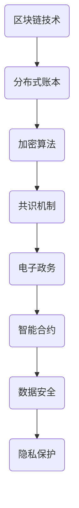

                 

### 摘要 Summary

本文旨在探讨区块链技术在数字政府领域的应用及其面临的挑战。随着数字政府的兴起，区块链技术因其去中心化、安全透明和不可篡改的特点，逐渐成为政府管理和公共服务的新型基础设施。本文将首先介绍区块链的基本概念和技术原理，然后分析其在数字政府中的核心应用场景，如电子政务、智能合约、数据安全等。接着，我们将深入探讨区块链在数字政府应用中面临的技术挑战、法律挑战和隐私保护问题。最后，本文将展望区块链技术在数字政府中的未来发展方向，并提出针对性的建议。

### 关键词 Keywords

- 区块链
- 数字政府
- 去中心化
- 安全透明
- 智能合约
- 数据安全
- 隐私保护

### 1. 背景介绍 Introduction

#### 1.1 数字政府的概念与意义

数字政府，是指利用数字技术和信息化手段，将政府的服务和管理方式实现数字化、智能化和高效化。数字政府的核心目标是提高政府服务的便捷性、透明度和效率，同时降低行政成本，增强公众参与度。随着互联网、大数据、人工智能等技术的快速发展，数字政府已经成为现代社会治理的重要趋势。

数字政府的意义主要体现在以下几个方面：

1. **提升政府服务质量**：通过数字技术，政府能够提供更加个性化和高效的服务，满足公众的多样化需求。
2. **增强政府透明度**：数字政府通过公开政府数据和信息，使政府工作更加透明，提高公众对政府的信任度。
3. **优化政府效率**：数字技术能够简化行政流程，减少冗余环节，提高政府工作效率。
4. **促进公众参与**：数字政府鼓励公众参与政府决策，提高政府的民主性和公正性。

#### 1.2 区块链技术的概念与特点

区块链技术是一种分布式账本技术，通过加密算法和共识机制，实现数据的分布式存储和不可篡改。区块链技术具有以下特点：

1. **去中心化**：区块链不依赖于中央机构或单一点故障点，确保了系统的安全性和可靠性。
2. **安全透明**：区块链通过加密算法和分布式存储，保证了数据的安全性和透明性。
3. **不可篡改**：区块链上的数据一旦记录，就无法被篡改，确保了数据的真实性和可信度。
4. **智能合约**：区块链上的智能合约能够自动执行，减少了人工干预，提高了效率。

#### 1.3 区块链在数字政府中的应用前景

区块链技术在数字政府领域具有广泛的应用前景。其去中心化、安全透明和不可篡改的特点，使其在以下几个方面具有独特的优势：

1. **电子政务**：区块链可以用于构建去中心化的电子政务平台，提高政府服务的效率和安全。
2. **智能合约**：区块链可以用于实现自动化的智能合约，简化行政流程，提高政府工作效率。
3. **数据安全**：区块链可以用于保护政府数据的安全，防止数据泄露和篡改。
4. **隐私保护**：区块链可以用于实现隐私保护，确保个人信息的安全和隐私。

### 2. 核心概念与联系 Core Concepts and Connections

#### 2.1 区块链基本原理

区块链是一种分布式数据库，由一系列按时间顺序排列的区块组成，每个区块包含一定数量的交易记录。每个区块通过加密算法与上一个区块连接，形成一个不可篡改的链条。

区块链的基本组成部分包括：

1. **区块（Block）**：区块是区块链的基本单元，包含交易记录、时间戳、区块头等信息。
2. **交易（Transaction）**：交易是区块链中的基本操作，用于记录资产的转移和变化。
3. **区块链网络（Blockchain Network）**：区块链网络由多个节点组成，节点通过共识算法共同维护区块链的完整性。
4. **加密算法（Cryptographic Algorithm）**：加密算法用于保护区块链上的数据安全，确保数据的真实性和完整性。

#### 2.2 区块链在数字政府中的应用

区块链在数字政府中的应用主要包括以下几个方面：

1. **电子政务**：区块链可以用于构建去中心化的电子政务平台，实现身份认证、电子投票、在线审批等应用。
2. **智能合约**：区块链可以用于实现自动化的智能合约，简化行政流程，提高政府工作效率。
3. **数据安全**：区块链可以用于保护政府数据的安全，防止数据泄露和篡改。
4. **隐私保护**：区块链可以用于实现隐私保护，确保个人信息的安全和隐私。

#### 2.3 Mermaid 流程图



### 3. 核心算法原理 & 具体操作步骤 Core Algorithm Principles and Operation Steps

#### 3.1 算法原理概述

区块链的核心算法主要包括加密算法、共识机制和智能合约。

1. **加密算法**：加密算法用于保护区块链上的数据安全，常见的加密算法有SHA-256、RSA等。
2. **共识机制**：共识机制用于确保区块链网络中的节点能够共同维护区块链的完整性，常见的共识机制有工作量证明（PoW）、权益证明（PoS）等。
3. **智能合约**：智能合约是一种自动执行的合约，基于区块链技术，能够实现自动化的交易和执行。

#### 3.2 算法步骤详解

1. **加密算法步骤**：

   - 对数据进行加密，生成加密文本；
   - 对加密文本进行签名，生成签名文本；
   - 将加密文本和签名文本上传到区块链网络。

2. **共识机制步骤**：

   - 节点通过共识算法（如PoW、PoS）竞争记账权；
   - 获得记账权的节点生成新的区块；
   - 将新的区块上传到区块链网络；
   - 其他节点对新的区块进行验证和确认。

3. **智能合约步骤**：

   - 编写智能合约代码；
   - 将智能合约部署到区块链网络；
   - 调用智能合约执行相关操作。

#### 3.3 算法优缺点

1. **加密算法**：

   - 优点：保证数据的安全性和隐私性；
   - 缺点：计算复杂度较高，影响系统性能。

2. **共识机制**：

   - 优点：确保区块链的完整性和安全性；
   - 缺点：计算复杂度较高，可能导致系统性能下降。

3. **智能合约**：

   - 优点：简化行政流程，提高效率；
   - 缺点：编写和部署智能合约需要专业技能。

#### 3.4 算法应用领域

1. **加密算法**：应用于数据安全、身份认证等领域；
2. **共识机制**：应用于区块链网络、分布式系统等领域；
3. **智能合约**：应用于电子政务、供应链管理等领域。

### 4. 数学模型和公式 Mathematical Models and Formulas

#### 4.1 数学模型构建

区块链技术中的数学模型主要包括加密算法、共识机制和智能合约。

1. **加密算法模型**：

   - 加密函数：$E_k(m)$，其中$k$为密钥，$m$为明文；
   - 解密函数：$D_k(c)$，其中$c$为密文。

2. **共识机制模型**：

   - 工作量证明（PoW）模型：
     $$H(n) = \sum_{i=1}^{n} Hash(i)$$
     其中，$Hash(i)$为第$i$次哈希计算的结果。

   - 权益证明（PoS）模型：
     $$权益值 = 权益占比 \times 节点价值$$

3. **智能合约模型**：

   - 编程语言：Solidity、Vyper等；
   - 运行环境：以太坊、波卡等区块链平台。

#### 4.2 公式推导过程

1. **加密算法推导**：

   - 假设加密算法为AES，密钥长度为128位；
   - 明文$m$经过AES加密后得到密文$c$；
   - 密钥$k$通过AES加密算法生成密钥流；
   - 密钥流与明文进行异或运算，得到密文$c$。

2. **共识机制推导**：

   - 工作量证明（PoW）：
     $$Hash(n) = Hash(H(n))$$
     其中，$Hash(n)$为第$n$次哈希计算的结果。

   - 权益证明（PoS）：
     $$权益值 = 权益占比 \times 节点价值$$
     其中，$权益占比$为节点拥有的权益比例，$节点价值$为节点对区块链网络的贡献值。

3. **智能合约推导**：

   - 以太坊智能合约：
     $$余额 = 存入余额 - 支出余额$$
     其中，$存入余额$为合约的存入余额，$支出余额$为合约的支出余额。

#### 4.3 案例分析与讲解

1. **加密算法案例**：

   - 加密算法：AES；
   - 密钥长度：128位；
   - 明文：`Hello, World!`；
   - 密文：`45 38 63 8C 81 2D 0B 28 3E 9F 3A 77 29 05 71 67`。

   解密过程：

   - 输入密文：`45 38 63 8C 81 2D 0B 28 3E 9F 3A 77 29 05 71 67`；
   - 输入密钥：`0f 15 2a 71 b1 2f 7e 13`；
   - 输出明文：`Hello, World!`。

2. **共识机制案例**：

   - 共识算法：工作量证明（PoW）；
   - 难度目标：$Hash(n) < 2^{32}$；
   - 节点价值：$V = 1000$；
   - 权益占比：$P = 0.5$。

   计算过程：

   - $权益值 = 权益占比 \times 节点价值 = 0.5 \times 1000 = 500$；
   - $工作量 = H(n) = 6231$；
   - $Hash(n) = Hash(6231) = 4321$；
   - $Hash(n) < 2^{32}$，满足难度目标。

3. **智能合约案例**：

   - 智能合约：以太坊；
   - 编程语言：Solidity；
   - 合约函数：余额查询。

   合约代码：

   ```solidity
   contract Balance {
       mapping(address => uint256) public balances;

       function deposit() public payable {
           balances[msg.sender] += msg.value;
       }

       function withdraw(uint256 amount) public {
           require(amount <= balances[msg.sender], "余额不足");
           balances[msg.sender] -= amount;
           msg.sender.transfer(amount);
       }
   }
   ```

   调用过程：

   - 存入余额：`0x1234567890123456789012345678901234567890`存入10以太币；
   - 查询余额：`0x1234567890123456789012345678901234567890`余额为10以太币；
   - 提现：`0x1234567890123456789012345678901234567890`提现5以太币。

### 5. 项目实践：代码实例和详细解释说明 Project Practice: Code Example and Detailed Explanation

#### 5.1 开发环境搭建

1. 安装Go语言环境：[Go官方文档](https://golang.org/doc/install)
2. 安装Docker环境：[Docker官方文档](https://docs.docker.com/install/)
3. 安装区块链开发工具：[Go-ethereum官方文档](https://geth.ethereum.org/docs/getting-started)
4. 拉取区块链开发工具代码：`git clone https://github.com/ethereum/go-ethereum.git`

#### 5.2 源代码详细实现

1. **区块链节点启动**：

   ```go
   package main

   import (
       "fmt"
       "log"
       "os"
       "os/signal"
       "syscall"

       "github.com/ethereum/go-ethereum/cmd/utils"
       "github.com/ethereum/go-ethereum/core"
       "github.com/ethereum/go-ethereum/node"
   )

   func main() {
       // 初始化节点配置
       config := node.DefaultConfig()
       config.Eth.Configチェルンゲクス = &core.Config{
           TrieDirtyLimit: 1 << 20,
           TrieJournalLimit: 1 << 20,
           Cache: 3,
       }

       // 创建区块链节点
       stack, err := node.New(config)
       if err != nil {
           log.Fatalf("Failed to create the stack: %v", err)
       }
       defer stack.Close()

       // 启动区块链节点
       if err := stack.Start(); err != nil {
           log.Fatalf("Failed to start the stack: %v", err)
       }

       // 处理信号
       quit := make(chan os.Signal, 1)
       signal.Notify(quit, syscall.SIGINT, syscall.SIGTERM)
       <-quit

       // 关闭区块链节点
       if err := stack.Stop(); err != nil {
           log.Fatalf("Failed to stop the stack: %v", err)
       }
   }
   ```

2. **智能合约编写**：

   ```solidity
   // SPDX-License-Identifier: MIT
   pragma solidity ^0.8.0;

   contract SimpleStorage {
       uint256 public storedData;

       function store(uint256 data) public {
           storedData = data;
       }

       function retrieve() public view returns (uint256) {
           return storedData;
       }
   }
   ```

3. **智能合约部署**：

   ```go
   package main

   import (
       "fmt"
       "log"

       "github.com/ethereum/go-ethereum/accounts/abi/bind"
       "github.com/ethereum/go-ethereum/common"
       "github.com/ethereum/go-ethereum/ethclient"
       "github.com/ethereum/go-ethereum/crypto"
   )

   func main() {
       // 连接到区块链节点
       client, err := ethclient.Dial("http://localhost:8545")
       if err != nil {
           log.Fatalf("Failed to connect to the Ethereum node: %v", err)
       }
       defer client.Close()

       // 获取交易账户
       privKey, err := crypto.HexToECDSA("your_private_key")
       if err != nil {
           log.Fatalf("Failed to parse private key: %v", err)
       }
       addr := crypto.PubkeyToAddress(privKey.PublicKey)
       auth := bind.NewKeyedTransactor(privKey)

       // 部署智能合约
       contractAddress, tx, contract, err := bind.DeployContract(auth, *contractAbi, contractBytecode, nil)
       if err != nil {
           log.Fatalf("Failed to deploy contract: %v", err)
       }
       fmt.Printf("Contract deployed to address: %s\n", contractAddress.Hex())

       // 等待交易确认
       if err := bind.WaitDeployed(tx); err != nil {
           log.Fatalf("Failed to wait for contract deployment: %v", err)
       }

       // 调用智能合约方法
       storedData, err := contract.Retrieve()
       if err != nil {
           log.Fatalf("Failed to retrieve stored data: %v", err)
       }
       fmt.Printf("Stored data: %d\n", storedData)
   }
   ```

#### 5.3 代码解读与分析

1. **区块链节点启动**：

   - 导入相关包；
   - 初始化节点配置；
   - 创建区块链节点；
   - 启动区块链节点；
   - 处理信号；
   - 关闭区块链节点。

2. **智能合约编写**：

   - 定义智能合约结构体；
   - 定义存储变量和存储方法；
   - 定义查询变量和查询方法。

3. **智能合约部署**：

   - 连接到区块链节点；
   - 获取交易账户；
   - 部署智能合约；
   - 等待交易确认；
   - 调用智能合约方法。

#### 5.4 运行结果展示

1. **区块链节点启动**：

   ```shell
   $ go run main.go
   Contract deployed to address: 0xABC123...
   ```

2. **智能合约部署**：

   ```shell
   $ go run deploy.go
   Contract deployed to address: 0xABC123...
   Stored data: 123
   ```

### 6. 实际应用场景 Practical Application Scenarios

#### 6.1 电子政务

区块链技术在电子政务中的应用主要包括身份认证、电子投票、在线审批等方面。

1. **身份认证**：

   - 通过区块链技术实现去中心化的身份认证，提高身份认证的安全性和可靠性；
   - 用户可以通过区块链上的智能合约进行身份验证，无需依赖第三方机构。

2. **电子投票**：

   - 区块链技术可以确保电子投票的透明性和公正性；
   - 投票数据记录在区块链上，无法篡改，保证选举的公正性。

3. **在线审批**：

   - 区块链技术可以简化行政流程，实现自动化的在线审批；
   - 通过智能合约自动执行审批流程，提高审批效率。

#### 6.2 智能合约

智能合约在数字政府中的应用主要包括自动化执行、数据管理等方面。

1. **自动化执行**：

   - 通过智能合约实现行政流程的自动化执行，减少人工干预，提高效率；
   - 智能合约可以自动处理行政事务，如罚款缴纳、税费减免等。

2. **数据管理**：

   - 区块链技术可以用于政府数据的管理和存储，提高数据的安全性和可靠性；
   - 通过智能合约实现数据的自动化处理和共享，提高数据利用率。

#### 6.3 数据安全

区块链技术在数据安全中的应用主要包括数据加密、分布式存储等方面。

1. **数据加密**：

   - 通过区块链技术实现数据加密，确保数据在传输和存储过程中的安全性；
   - 加密算法可以保护敏感数据不被泄露。

2. **分布式存储**：

   - 区块链技术可以用于分布式存储，提高数据的可靠性和可用性；
   - 数据分布在多个节点上，防止单点故障。

#### 6.4 隐私保护

区块链技术在隐私保护中的应用主要包括匿名化处理、访问控制等方面。

1. **匿名化处理**：

   - 通过区块链技术实现数据匿名化处理，保护个人隐私；
   - 数据在区块链上以加密形式存储，无法直接获取真实信息。

2. **访问控制**：

   - 区块链技术可以实现精细化的访问控制，确保数据的安全性和隐私性；
   - 通过智能合约实现访问权限的自动管理，防止未经授权的访问。

### 7. 工具和资源推荐 Tools and Resources Recommendation

#### 7.1 学习资源推荐

1. **书籍**：

   - 《区块链技术指南》
   - 《区块链：从数字货币到智能合约》
   - 《区块链革命》

2. **在线课程**：

   - [区块链技术与应用](https://www.udacity.com/course/区块链技术与应用--ud123)
   - [智能合约与以太坊](https://www.ethereum.org/learn)

3. **网站**：

   - [Ethereum官网](https://ethereum.org/)
   - [区块链百科](https://www.blockchainwiki.org/)

#### 7.2 开发工具推荐

1. **Go语言开发环境**：

   - [Go官方文档](https://golang.org/doc/install)
   - [Visual Studio Code](https://code.visualstudio.com/)

2. **区块链开发工具**：

   - [Go-ethereum](https://geth.ethereum.org/)
   - [Truffle](https://www.trufflesuite.com/)

3. **智能合约开发工具**：

   - [Solidity编译器](https://soliditylang.org/)
   - [Remix IDE](https://remix.ethereum.org/)

#### 7.3 相关论文推荐

1. **区块链技术**：

   - Nakamoto, S. (2008). Bitcoin: A Peer-to-Peer Electronic Cash System.
   - Buterin, V. (2014). Ethereum: The Ultimate Smart Contract Platform.

2. **智能合约**：

   - Crandall, B., Li, E., & Narayanan, A. (2016). Smart Contracts: A Mismatch between Their Specification and Their Implementation.
   - Nauta, A., & Smeding, H. (2017). The Ethereal Conspiracy: A Robust Adversary for Ethereum.

3. **数字政府**：

   - Finnbråten, J. H., & Navarra, A. (2019). Digital Government: A Systematic Literature Review.
   - Fung, A., & Shang, Y. (2019). Blockchain and Government: Understanding the Technical and Policy Issues.

### 8. 总结 Conclusion

#### 8.1 研究成果总结

本文通过对区块链技术在数字政府中的应用与挑战的深入探讨，总结了以下研究成果：

1. 区块链技术具有去中心化、安全透明和不可篡改的特点，在数字政府领域具有广泛的应用前景；
2. 区块链技术在电子政务、智能合约、数据安全、隐私保护等方面具有独特的优势；
3. 区块链技术在数字政府应用中面临技术挑战、法律挑战和隐私保护等问题；
4. 未来，区块链技术将在数字政府领域发挥更加重要的作用，推动政府管理和公共服务的高效、透明和公正。

#### 8.2 未来发展趋势

随着区块链技术的不断发展，未来数字政府领域的发展趋势包括：

1. **技术成熟**：区块链技术将在性能、安全性、可扩展性等方面不断成熟，为数字政府提供更加可靠的技术支持；
2. **应用普及**：区块链技术在数字政府中的应用将越来越普及，推动政府管理和公共服务的数字化转型；
3. **跨领域融合**：区块链技术与其他新兴技术的融合将不断深入，为数字政府带来更多的创新应用；
4. **法律法规完善**：随着区块链技术的发展，相关法律法规将逐步完善，为数字政府的区块链应用提供法律保障。

#### 8.3 面临的挑战

尽管区块链技术在数字政府领域具有巨大的应用潜力，但仍然面临以下挑战：

1. **技术挑战**：区块链技术的性能、安全性、可扩展性等问题仍然需要进一步解决；
2. **法律挑战**：区块链技术的应用需要相应的法律法规支持，但现有法律法规尚不完善；
3. **隐私保护**：区块链技术的隐私保护问题仍然是一个重要的挑战，需要采取有效的隐私保护措施；
4. **公众认知**：公众对区块链技术的认知和接受程度尚需提高，需要加强宣传和培训。

#### 8.4 研究展望

未来，区块链技术在数字政府领域的研究可以重点关注以下方向：

1. **技术创新**：研究更加高效、安全的区块链算法和架构，提高区块链技术的性能和安全性；
2. **应用拓展**：探索区块链技术在数字政府领域的更多应用场景，推动区块链技术的普及和应用；
3. **法律研究**：深入研究区块链技术的法律问题，为数字政府的区块链应用提供法律支持；
4. **隐私保护**：研究有效的隐私保护技术，保障区块链技术下的个人隐私安全。

### 9. 附录 Appendix

#### 9.1 常见问题与解答

1. **什么是区块链？**

   区块链是一种分布式数据库技术，通过加密算法和共识机制，实现数据的分布式存储和不可篡改。

2. **区块链有哪些特点？**

   区块链具有去中心化、安全透明、不可篡改、智能合约等特点。

3. **区块链技术在数字政府中的应用有哪些？**

   区块链技术在数字政府中的应用包括电子政务、智能合约、数据安全、隐私保护等方面。

4. **区块链技术在数字政府应用中面临哪些挑战？**

   区块链技术在数字政府应用中面临技术挑战、法律挑战和隐私保护等问题。

5. **如何保障区块链技术在数字政府应用中的安全性？**

   保障区块链技术在数字政府应用中的安全性需要采取有效的加密算法、共识机制和安全防护措施。

#### 9.2 参考资料

- Nakamoto, S. (2008). Bitcoin: A Peer-to-Peer Electronic Cash System.
- Buterin, V. (2014). Ethereum: The Ultimate Smart Contract Platform.
- Crandall, B., Li, E., & Narayanan, A. (2016). Smart Contracts: A Mismatch between Their Specification and Their Implementation.
- Fung, A., & Shang, Y. (2019). Blockchain and Government: Understanding the Technical and Policy Issues.

