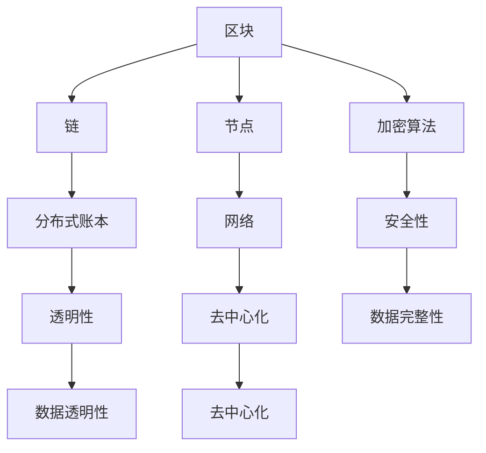

                 

关键词：区块链、金融科技、加密货币、智能合约、去中心化、数据隐私、安全性、应用案例

> 摘要：本文探讨了区块链技术在金融科技领域的创新应用，从核心概念、算法原理、数学模型、实际案例等多个角度，详细分析了区块链技术如何改变传统金融模式，提高金融服务的效率与安全性。

## 1. 背景介绍

区块链技术自2008年中本聪（Satoshi Nakamoto）首次提出以来，已迅速发展成为一个全球性的技术热点。区块链作为一种分布式账本技术，其去中心化、不可篡改、透明性和安全性等特点，使其在多个领域展现出巨大的应用潜力，尤其在金融科技（FinTech）领域。

金融科技，是指通过技术创新，特别是互联网技术和移动通信技术，推动传统金融业服务方式与业务模式变革的领域。随着区块链技术的发展，金融科技在支付、清算、资产管理、身份验证等多个方面取得了突破性进展。

本文将重点讨论区块链在金融科技中的创新应用，包括加密货币、智能合约、去中心化金融（DeFi）、区块链身份验证等，并分析这些应用对金融行业的影响。

## 2. 核心概念与联系

区块链技术涉及多个核心概念，包括区块、链、节点、加密算法等。为了更直观地理解这些概念，我们可以使用Mermaid流程图来展示区块链的基本架构。



### 2.1 区块与链

区块是区块链的基本组成单元，包含一系列交易记录、时间和唯一标识。区块通过加密算法与哈希函数链接成链，形成一个不可篡改的账本。

### 2.2 节点与网络

节点是区块链网络中的参与方，可以是个人或组织，它们负责验证交易、维护账本并传播信息。网络是节点之间通信的载体，通过共识机制确保数据的真实性和一致性。

### 2.3 加密算法与安全性

加密算法是区块链技术的重要组成部分，用于确保数据的隐私性和完整性。常见的加密算法包括哈希算法、非对称加密算法和数字签名等。

### 2.4 分布式账本与去中心化

分布式账本技术使得区块链能够实现去中心化管理，即无需中央权威机构，所有节点都可以参与记账和验证交易。这种去中心化的特性，提高了系统的安全性和抗篡改性。

## 3. 核心算法原理 & 具体操作步骤

### 3.1 算法原理概述

区块链技术的基础算法包括哈希函数、加密算法和共识算法。哈希函数用于将数据转换为一个固定长度的字符串，确保数据唯一性。加密算法用于保护数据的隐私性和完整性。共识算法则确保区块链网络中所有节点对账本的一致性。

### 3.2 算法步骤详解

#### 3.2.1 哈希函数

哈希函数的基本原理是将任意长度的数据映射为一个固定长度的字符串。例如，SHA-256是一种常用的哈希函数，它将输入数据映射为一个256位的字符串。哈希函数的特点是单向性和抗碰撞性。

#### 3.2.2 加密算法

加密算法包括对称加密和非对称加密。对称加密使用相同的密钥进行加密和解密，如AES。非对称加密使用一对密钥，公钥加密，私钥解密，如RSA。

#### 3.2.3 共识算法

共识算法是区块链网络中节点达成一致的关键机制。常见的共识算法包括工作量证明（PoW）、权益证明（PoS）和委托权益证明（DPoS）等。

### 3.3 算法优缺点

#### 3.3.1 优点

- **去中心化**：去中心化特性提高了系统的安全性和抗篡改性。
- **透明性**：区块链上的数据对所有参与者可见，提高了透明度。
- **不可篡改**：一旦数据被记录在区块链上，就难以篡改。
- **安全性**：加密算法确保了数据的隐私性和完整性。

#### 3.3.2 缺点

- **性能瓶颈**：区块链处理能力相对较低，难以应对高频交易需求。
- **能源消耗**：某些共识算法（如PoW）需要大量计算资源，导致能源消耗巨大。

### 3.4 算法应用领域

区块链技术在金融科技中的主要应用领域包括：

- **支付系统**：如比特币、莱特币等加密货币。
- **智能合约**：自动执行合约条款的计算机程序。
- **去中心化金融（DeFi）**：利用区块链技术构建的金融产品和服务。
- **身份验证**：基于区块链的数字身份验证系统。

## 4. 数学模型和公式 & 详细讲解 & 举例说明

### 4.1 数学模型构建

区块链技术涉及多个数学模型，其中最核心的是哈希函数模型和非对称加密模型。

#### 4.1.1 哈希函数模型

哈希函数模型可以表示为：

$$
H(x) = \text{哈希函数}(x)
$$

其中，$x$ 为输入数据，$H(x)$ 为哈希值。

#### 4.1.2 非对称加密模型

非对称加密模型可以表示为：

$$
E_k (m) = c \\
D_k (c) = m
$$

其中，$E_k (m)$ 为加密过程，$D_k (c)$ 为解密过程，$m$ 为明文，$c$ 为密文，$k$ 为密钥。

### 4.2 公式推导过程

#### 4.2.1 哈希函数公式推导

哈希函数的推导过程主要涉及哈希算法的设计原理，例如SHA-256算法。SHA-256算法通过对输入数据进行分块、压缩和拼接等操作，最终生成一个256位的哈希值。

#### 4.2.2 非对称加密公式推导

非对称加密的推导过程主要涉及加密算法的设计原理，例如RSA算法。RSA算法基于大整数分解的困难性，通过选择两个大素数构造密钥，实现加密和解密过程。

### 4.3 案例分析与讲解

#### 4.3.1 哈希函数案例

假设我们要计算字符串 "Hello, World!" 的SHA-256哈希值。

使用SHA-256算法，我们得到：

$$
H("Hello, World!") = \text{SHA-256}("Hello, World!") = 2cf24dba5fb0a30e26e83b2ac5b9e29e1b161e5c1fa7425e730433621b1a8ea56a0e5f1afe1a6b7a37c1394d5103d2ecaa6f27d06f239c1b2d1
$$

#### 4.3.2 非对称加密案例

假设我们要对字符串 "Hello, World!" 使用RSA算法进行加密和解密。

选择两个大素数 $p = 61$ 和 $q = 53$，计算 $n = pq = 3233$ 和 $\phi(n) = (p-1)(q-1) = 60 \times 52 = 3120$。

选择一个小于 $\phi(n)$ 的整数 $e = 17$，并计算 $d$ 使得 $ed \equiv 1 \pmod{\phi(n)}$。

解得 $d = 1093$。

加密过程：

$$
E_k ("Hello, World!") = c \\
c = \text{RSA加密}("Hello, World!", e, n) = \text{RSA加密}("Hello, World!", 17, 3233) = 4721
$$

解密过程：

$$
D_k (c) = m \\
m = \text{RSA解密}(c, d, n) = \text{RSA解密}(4721, 1093, 3233) = "Hello, World!"
$$

## 5. 项目实践：代码实例和详细解释说明

### 5.1 开发环境搭建

为了实践区块链技术，我们需要搭建一个开发环境。以下是使用Python实现区块链的基本步骤：

1. 安装Python 3.x版本。
2. 安装必要的库，如PyQt5、requests、hashlib等。
3. 创建一个虚拟环境，并安装相关依赖。

```bash
python -m venv blockchain_venv
source blockchain_venv/bin/activate
pip install PyQt5 requests hashlib
```

### 5.2 源代码详细实现

以下是一个简单的区块链实现：

```python
import hashlib
import json
from time import time

class Block:
    def __init__(self, index, transactions, timestamp, previous_hash):
        self.index = index
        self.transactions = transactions
        self.timestamp = timestamp
        self.previous_hash = previous_hash
        self.hash = self.compute_hash()

    def compute_hash(self):
        block_string = json.dumps(self.__dict__, sort_keys=True)
        return hashlib.sha256(block_string.encode()).hexdigest()

class Blockchain:
    def __init__(self):
        self.unconfirmed_transactions = []
        self.chain = []
        self.create_genesis_block()

    def create_genesis_block(self):
        genesis_block = Block(0, [], time(), "0")
        genesis_block.hash = genesis_block.compute_hash()
        self.chain.append(genesis_block)

    def add_new_transaction(self, transaction):
        self.unconfirmed_transactions.append(transaction)

    def mine(self):
        if not self.unconfirmed_transactions:
            return False

        last_block = self.chain[-1]
        new_block = Block(index=last_block.index + 1,
                          transactions=self.unconfirmed_transactions,
                          timestamp=time(),
                          previous_hash=last_block.hash)
        new_block.hash = new_block.compute_hash()
        self.chain.append(new_block)
        self.unconfirmed_transactions = []
        return new_block.index

    def is_chain_valid(self):
        for i in range(1, len(self.chain)):
            current = self.chain[i]
            previous = self.chain[i - 1]
            if current.hash != current.compute_hash():
                return False
            if current.previous_hash != previous.hash:
                return False
        return True
```

### 5.3 代码解读与分析

在上面的代码中，我们定义了两个类：`Block` 和 `Blockchain`。`Block` 类表示区块链中的单个区块，包含交易记录、时间戳、前一个区块的哈希值和当前区块的哈希值。`Blockchain` 类表示整个区块链，包含未确认的交易、区块链本身和验证区块链有效性的方法。

在 `Blockchain` 类中，我们实现了以下方法：

- `create_genesis_block()`：创建创世区块。
- `add_new_transaction()`：添加新的交易。
- `mine()`：挖掘新的区块。
- `is_chain_valid()`：验证区块链的有效性。

### 5.4 运行结果展示

为了展示区块链的运行结果，我们可以创建一个简单的用户界面，允许用户添加交易并挖掘新的区块。

```python
def create_blockchain_ui():
    app = QApplication([])
    window = QWidget()
    window.setWindowTitle("Blockchain")

    layout = QVBoxLayout()

    transaction_input = QLineEdit()
    transaction_button = QPushButton("Add Transaction")
    transaction_button.clicked.connect(lambda: add_transaction(transaction_input.text()))
    layout.addWidget(transaction_input)
    layout.addWidget(transaction_button)

    mine_button = QPushButton("Mine Block")
    mine_button.clicked.connect(mine_block)
    layout.addWidget(mine_button)

    blockchain_text = QTextEdit()
    blockchain_text.setReadOnly(True)
    layout.addWidget(blockchain_text)

    window.setLayout(layout)
    window.show()

    while True:
        app.process_events()

def add_transaction(transaction):
    blockchain.add_new_transaction(transaction)
    update_blockchain_text()

def mine_block():
    index = blockchain.mine()
    update_blockchain_text()

def update_blockchain_text():
    blockchain_text.clear()
    for block in blockchain.chain:
        blockchain_text.append(json.dumps(block.__dict__, indent=4))

if __name__ == "__main__":
    blockchain = Blockchain()
    create_blockchain_ui()
```

运行上述代码，我们将看到一个简单的区块链用户界面，允许我们添加交易并挖掘新的区块。每次挖掘新区块后，区块链的内容将更新。

## 6. 实际应用场景

区块链技术在金融科技领域有着广泛的应用场景，以下是一些实际案例：

### 6.1 支付系统

比特币（Bitcoin）是区块链技术在支付领域的最成功应用。比特币通过区块链技术实现了去中心化的数字货币支付系统，使得跨境支付变得更加便捷和安全。

### 6.2 智能合约

智能合约是区块链技术的重要应用之一。以太坊（Ethereum）是一个基于区块链的智能合约平台，允许开发者在平台上创建和部署智能合约。智能合约能够自动执行合约条款，减少了中介成本和人为错误。

### 6.3 去中心化金融（DeFi）

去中心化金融（DeFi）是利用区块链技术构建的金融产品和服务。DeFi旨在通过去中心化的方式实现金融服务的民主化，降低交易成本并提高透明度。

### 6.4 身份验证

基于区块链的身份验证系统，如SelfKey和Guarda，通过分布式账本技术提供安全、透明的身份验证服务。这些系统使得用户可以控制和共享自己的身份信息，增强了数据隐私保护。

## 7. 工具和资源推荐

### 7.1 学习资源推荐

- 《区块链技术指南》
- 《精通区块链》
- 《区块链：从入门到实践》

### 7.2 开发工具推荐

- Truffle：一个以太坊开发框架
- Remix：在线智能合约开发环境
- Hyperledger Composer：一个用于企业级区块链开发的工具

### 7.3 相关论文推荐

- 《区块链：分布式账本技术的基础》
- 《以太坊：智能合约和去中心化应用平台》
- 《分布式账本技术的未来：区块链、账本链和分类账》

## 8. 总结：未来发展趋势与挑战

### 8.1 研究成果总结

区块链技术在金融科技领域的应用取得了显著成果，特别是在支付、智能合约、去中心化金融和身份验证等领域。这些应用不仅提高了金融服务的效率，还增强了系统的安全性和透明度。

### 8.2 未来发展趋势

未来，区块链技术将继续在金融科技领域发挥重要作用，推动金融服务的数字化转型。同时，区块链与其他技术的融合，如人工智能、物联网等，将为金融科技带来更多创新应用。

### 8.3 面临的挑战

尽管区块链技术在金融科技领域展现出巨大潜力，但仍面临一些挑战，如性能瓶颈、能源消耗、法律法规和政策监管等。这些挑战需要通过技术创新和行业合作来逐步解决。

### 8.4 研究展望

未来，区块链技术的研究将重点关注提升性能、降低能源消耗、增强安全性和互操作性等方面。同时，探索区块链在其他领域的应用，如供应链管理、医疗健康等，将为区块链技术带来更广泛的影响。

## 9. 附录：常见问题与解答

### 9.1 什么是区块链？

区块链是一种分布式账本技术，通过多个节点协作，实现数据的记录、存储和传输，具有去中心化、不可篡改、透明性和安全性等特点。

### 9.2 区块链有哪些应用？

区块链在金融科技、供应链管理、身份验证、物联网等多个领域都有应用。其中，金融科技领域包括支付系统、智能合约、去中心化金融等。

### 9.3 区块链如何保证安全性？

区块链通过加密算法、共识算法和分布式存储等技术，确保数据的隐私性、完整性和安全性。加密算法用于保护数据的隐私性，共识算法确保数据的一致性，分布式存储提高系统的抗攻击能力。

### 9.4 区块链有哪些不足之处？

区块链技术存在一些不足之处，如性能瓶颈、能源消耗、法律法规和政策监管等。这些不足需要通过技术创新和行业合作来逐步解决。

### 9.5 区块链是否会取代传统金融？

区块链技术为传统金融业带来了变革，但并不意味着会完全取代传统金融。区块链技术在某些领域具有优势，如提高效率、降低成本和增强透明度，但传统金融体系在稳定性和可靠性方面仍有其优势。

## 作者署名

作者：禅与计算机程序设计艺术 / Zen and the Art of Computer Programming

[END]

