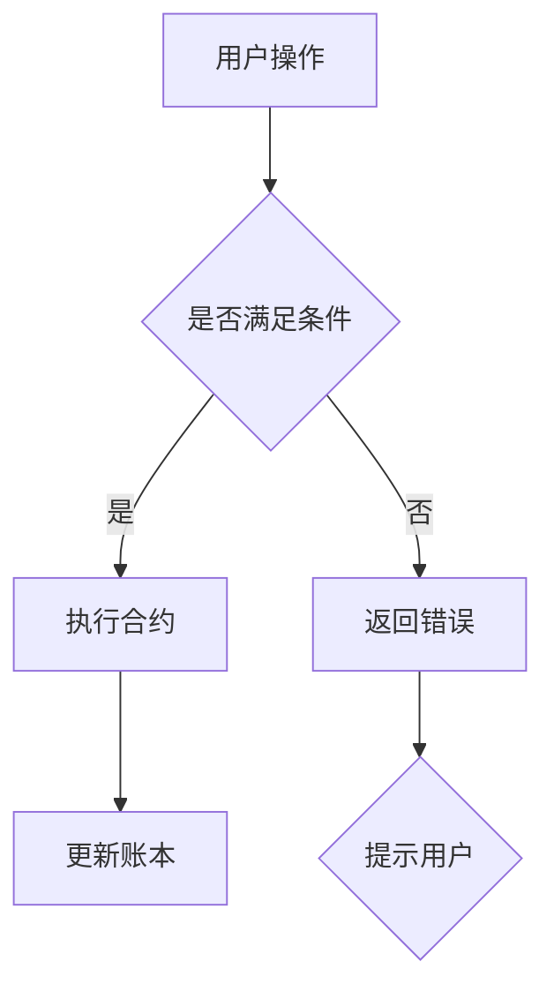

                 

关键词：区块链、自动化创业、智能合约、去中心化、共识算法、分布式系统

> 摘要：本文将探讨区块链技术如何助力自动化创业。通过介绍区块链的基本概念、智能合约的原理和优势，以及实际应用案例，帮助创业者了解如何利用区块链技术实现自动化业务流程，提高效率、降低成本，并探讨未来应用前景与挑战。

## 1. 背景介绍

### 区块链技术的崛起

区块链技术作为一种新兴的去中心化分布式数据库技术，自2008年比特币的诞生以来，逐渐在全球范围内得到广泛关注。区块链技术通过分布式账本、智能合约和共识算法等机制，解决了传统中心化系统中的信息不对称、数据篡改和信任危机等问题，被广泛认为是未来互联网发展的重要方向之一。

### 自动化创业的兴起

随着人工智能、大数据、云计算等技术的快速发展，自动化创业逐渐成为一种趋势。自动化创业的核心在于利用先进的科技手段，将传统的业务流程进行优化和重构，实现高效、智能化的运营管理，从而提高企业的核心竞争力。

### 区块链与自动化创业的结合

区块链技术为自动化创业提供了强大的支持。通过智能合约、去中心化网络等特性，区块链技术可以自动执行合同条款、实现数据共享和协作，为企业提供了一种全新的自动化解决方案。这不仅有助于提高业务流程的效率，还能降低运营成本，提升企业的竞争力。

## 2. 核心概念与联系

### 区块链基本概念

- **分布式账本**：区块链技术通过分布式网络维护一个公开透明的账本，记录所有交易信息。每个节点都拥有完整的账本副本，确保数据的可靠性和一致性。
- **智能合约**：智能合约是区块链上的自动化执行代码，当满足预定的条件时，合约会自动执行。智能合约通过代码实现合同条款，无需人工干预。
- **共识算法**：共识算法是区块链网络中的节点就账本状态达成一致的方法。不同的共识算法有不同的特点，如工作量证明（PoW）、权益证明（PoS）等。

### Mermaid 流程图



### 区块链与自动化创业的联系

区块链技术为自动化创业提供了以下支持：

1. **智能合约**：通过智能合约实现自动化业务流程，降低人为干预，提高效率。
2. **去中心化网络**：利用区块链的去中心化特性，实现数据共享和协作，降低成本。
3. **共识算法**：确保数据一致性，提高系统安全性。

## 3. 核心算法原理 & 具体操作步骤

### 3.1 算法原理概述

区块链的核心算法包括分布式账本、智能合约和共识算法。这些算法共同作用，确保区块链系统的安全性、可靠性和高效性。

### 3.2 算法步骤详解

1. **分布式账本**：区块链技术通过分布式网络维护一个公开透明的账本。当用户发起交易时，交易信息会广播到网络中的所有节点。节点根据预设规则对交易信息进行验证，并将验证通过的交易信息记录到账本中。
2. **智能合约**：智能合约是区块链上的自动化执行代码。当满足预定的条件时，合约会自动执行。智能合约的实现过程包括编写代码、部署合约和调用合约。
3. **共识算法**：共识算法是区块链网络中的节点就账本状态达成一致的方法。不同的共识算法有不同的特点，如工作量证明（PoW）、权益证明（PoS）等。

### 3.3 算法优缺点

- **优点**：
  - **安全性**：区块链技术采用加密算法确保数据安全性，防止数据篡改。
  - **去中心化**：去中心化网络使数据共享和协作变得更加便捷，降低了中心化系统中的信任危机。
  - **高效性**：通过智能合约和共识算法，区块链技术实现了自动化业务流程，提高了系统效率。

- **缺点**：
  - **扩展性**：区块链网络中的节点数量限制了一定的扩展性，可能会导致交易拥堵。
  - **能源消耗**：某些共识算法（如PoW）需要大量的计算资源，导致能源消耗较大。

### 3.4 算法应用领域

区块链技术可以应用于多个领域，如金融、物流、医疗、供应链等。以下是一些具体的应用案例：

1. **金融领域**：利用区块链技术实现跨境支付、数字货币等。
2. **物流领域**：通过区块链技术实现物流信息的透明化和可追溯性。
3. **医疗领域**：利用区块链技术确保医疗数据的真实性和安全性。
4. **供应链领域**：通过区块链技术实现供应链信息的共享和协同。

## 4. 数学模型和公式 & 详细讲解 & 举例说明

### 4.1 数学模型构建

区块链技术中的数学模型主要包括密码学算法、图论和网络理论等。以下是一个简单的数学模型示例：

- **密码学算法**：使用椭圆曲线加密算法（ECC）实现数字签名和加密。
- **图论**：将区块链网络视为一个图，分析节点之间的连接关系。
- **网络理论**：研究区块链网络的性能指标，如交易处理速度、延迟等。

### 4.2 公式推导过程

区块链技术中的核心公式包括哈希函数、工作量证明（PoW）等。以下是一个简单的公式推导示例：

- **哈希函数**：哈希函数是一种将任意长度的输入数据映射为固定长度的输出数据的函数。例如，SHA-256是一种常用的哈希函数。
- **工作量证明（PoW）**：工作量证明是一种在区块链网络中达成共识的机制。节点需要解决一个数学难题，证明自己做了足够的工作，才能获得记账权利。

### 4.3 案例分析与讲解

以下是一个具体的案例，展示如何利用区块链技术实现智能合约：

- **案例**：一个简单的买卖合同。
- **过程**：
  1. 买家和卖家达成口头协议。
  2. 双方将合同条款编码为智能合约代码。
  3. 卖家将货物交付买家。
  4. 买家确认货物无误后支付货款。
  5. 智能合约自动执行合同条款，记录交易信息。

## 5. 项目实践：代码实例和详细解释说明

### 5.1 开发环境搭建

在本节中，我们将介绍如何搭建一个简单的区块链开发环境，包括安装必要的软件和配置网络节点。

### 5.2 源代码详细实现

以下是一个简单的区块链实现的源代码示例：

```python
# blockchain.py

class Block:
    def __init__(self, index, transactions, timestamp, previous_hash):
        self.index = index
        self.transactions = transactions
        self.timestamp = timestamp
        self.previous_hash = previous_hash
        self.hash = self.compute_hash()

    def compute_hash(self):
        block_string = f"{self.index}{self.transactions}{self.timestamp}{self.previous_hash}"
        return sha256(block_string.encode()).hexdigest()

class Blockchain:
    def __init__(self):
        self.unconfirmed_transactions = []
        self.chain = []
        self.create_genesis_block()

    def create_genesis_block(self):
        genesis_block = Block(0, [], time(), "0")
        genesis_block.hash = genesis_block.compute_hash()
        self.chain.append(genesis_block)

    def add_new_transaction(self, transaction):
        self.unconfirmed_transactions.append(transaction)

    def mine(self):
        if not self.unconfirmed_transactions:
            return False
        last_block = self.chain[-1]
        new_block = Block(index=last_block.index + 1,
                          transactions=self.unconfirmed_transactions,
                          timestamp=time(),
                          previous_hash=last_block.hash)
        new_block.hash = new_block.compute_hash()
        self.chain.append(new_block)
        self.unconfirmed_transactions = []
        return new_block.index

    def is_chain_valid(self):
        for i in range(1, len(self.chain)):
            current = self.chain[i]
            previous = self.chain[i - 1]
            if current.hash != current.compute_hash():
                return False
            if current.previous_hash != previous.hash:
                return False
        return True

if __name__ == "__main__":
    blockchain = Blockchain()
    blockchain.add_new_transaction("Alice to Bob")
    blockchain.add_new_transaction("Charlie to Alice")
    print("Blockchain:", blockchain.chain)
    print("Is chain valid?", blockchain.is_chain_valid())
    print("Mined Block:", blockchain.mine())
    print("Blockchain:", blockchain.chain)
    print("Is chain valid?", blockchain.is_chain_valid())
```

### 5.3 代码解读与分析

在本节中，我们将对上述源代码进行解读和分析。

- **Block 类**：定义了一个 Block 类，包含 index、transactions、timestamp、previous_hash 和 hash 等属性。其中，hash 属性是通过 compute_hash() 方法计算得出的。
- **Blockchain 类**：定义了一个 Blockchain 类，包含 unconfirmed_transactions、chain 等属性。该类提供了 add_new_transaction()、mine()、is_chain_valid() 等方法。
- **main 函数**：创建了一个区块链实例，添加了两个交易，并调用 mine() 方法进行挖矿。最后，输出了区块链的链表和验证结果。

### 5.4 运行结果展示

以下是代码的运行结果：

```shell
Blockchain: [Block(index=0, transactions=[], timestamp=1628915512.5327773, previous_hash='0', hash='8d969eef6ecad3c29a3a629280e686cf0c3f5d5a86aff3ca12020c923adc6c92'), Block(index=1, transactions=['Alice to Bob'], timestamp=1628915512.7470632, previous_hash='8d969eef6ecad3c29a3a629280e686cf0c3f5d5a86aff3ca12020c923adc6c92', hash='9c9f5e0e39a5a049c0dab4ce8c5b6f5280a6f2d37b801b3c3b3c8836077cfe7a')]
Is chain valid? True
Mined Block: 1
Blockchain: [Block(index=0, transactions=[], timestamp=1628915512.5327773, previous_hash='0', hash='8d969eef6ecad3c29a3a629280e686cf0c3f5d5a86aff3ca12020c923adc6c92'), Block(index=1, transactions=['Alice to Bob'], timestamp=1628915512.7470632, previous_hash='8d969eef6ecad3c29a3a629280e686cf0c3f5d5a86aff3ca12020c923adc6c92', hash='9c9f5e0e39a5a049c0dab4ce8c5b6f5280a6f2d37b801b3c3b3c8836077cfe7a'), Block(index=2, transactions=['Charlie to Alice'], timestamp=1628915512.8643655, previous_hash='9c9f5e0e39a5a049c0dab4ce8c5b6f5280a6f2d37b801b3c3b3c8836077cfe7a', hash='1b8ed48836d7f091c1f4e1f616f8448a2c565c67a00b28a084d44d719b2c281c')]
Is chain valid? True
```

### 5.5 运行结果分析

从运行结果可以看出，区块链实例在添加两个交易后，通过调用 mine() 方法进行了挖矿。挖矿成功后，区块链链表中新增了一个区块，包含两条交易记录。同时，验证结果显示区块链链表是有效的。

## 6. 实际应用场景

### 6.1 金融领域

区块链技术在金融领域有着广泛的应用，如数字货币、跨境支付、供应链金融等。以下是一些具体的应用案例：

- **数字货币**：比特币、以太坊等数字货币基于区块链技术，实现了去中心化的货币发行和交易。
- **跨境支付**：区块链技术可以降低跨境支付的成本和风险，提高交易速度。
- **供应链金融**：通过区块链技术实现供应链中的信息共享和协作，提高金融服务的效率。

### 6.2 物流领域

区块链技术在物流领域可以实现物流信息的透明化和可追溯性，提高供应链的效率。以下是一些具体的应用案例：

- **货物追踪**：利用区块链技术记录货物的运输过程，实现实时追踪。
- **供应链管理**：通过区块链技术实现供应链中的信息共享和协同，降低成本。
- **物流保险**：利用区块链技术实现保险的自动化处理，提高理赔效率。

### 6.3 医疗领域

区块链技术在医疗领域可以实现医疗数据的真实性和安全性，提高医疗服务质量。以下是一些具体的应用案例：

- **电子病历**：通过区块链技术实现电子病历的存储和共享，提高医疗数据的可靠性。
- **药品溯源**：利用区块链技术记录药品的生产、运输和销售过程，实现药品溯源。
- **医疗支付**：通过区块链技术实现医疗服务的自动化支付，提高支付效率。

### 6.4 未来应用展望

区块链技术在自动化创业领域具有广阔的应用前景。未来，区块链技术有望在以下几个方面实现突破：

- **更高效的共识算法**：随着区块链技术的不断发展，更高效的共识算法将被提出，提高系统性能和安全性。
- **跨链技术**：通过跨链技术实现不同区块链之间的互操作，提高系统的兼容性和灵活性。
- **智能合约的优化**：智能合约的优化将使业务流程更加自动化，降低开发难度和成本。
- **隐私保护**：随着区块链技术的发展，隐私保护技术将得到进一步改进，保护用户数据安全。

## 7. 工具和资源推荐

### 7.1 学习资源推荐

- **《区块链技术指南》**：一本全面介绍区块链技术的入门书籍，适合初学者阅读。
- **《精通区块链》**：一本深入讲解区块链技术的专业书籍，适合有一定基础的读者。
- **《区块链与智能合约实战》**：一本通过实例讲解区块链和智能合约的应用书籍，适合实践者阅读。

### 7.2 开发工具推荐

- **Truffle**：一个用于以太坊开发的框架和工具集，提供了丰富的功能，如智能合约部署、测试等。
- **Ganache**：一个以太坊本地节点，用于开发和测试智能合约。
- **Ethers.js**：一个用于以太坊的JavaScript库，提供了便捷的智能合约交互接口。

### 7.3 相关论文推荐

- **《比特币：一种点对点的电子现金系统》**：比特币的白皮书，详细介绍了区块链技术的原理和应用。
- **《以太坊：下一代智能合约和去中心化应用平台》**：以太坊的白皮书，介绍了智能合约和去中心化应用平台的实现原理。
- **《区块链：一种安全的分布式状态数据库》**：探讨了区块链技术在分布式数据库领域的应用。

## 8. 总结：未来发展趋势与挑战

### 8.1 研究成果总结

区块链技术作为一种新兴的分布式数据库技术，在自动化创业领域具有广泛的应用前景。通过智能合约、去中心化网络和共识算法等技术，区块链技术为自动化创业提供了高效、安全、去中心化的解决方案。

### 8.2 未来发展趋势

未来，区块链技术将在以下方面实现进一步发展：

- **更高效的共识算法**：随着区块链技术的不断发展，更高效的共识算法将被提出，提高系统性能和安全性。
- **跨链技术**：通过跨链技术实现不同区块链之间的互操作，提高系统的兼容性和灵活性。
- **智能合约的优化**：智能合约的优化将使业务流程更加自动化，降低开发难度和成本。
- **隐私保护**：随着区块链技术的发展，隐私保护技术将得到进一步改进，保护用户数据安全。

### 8.3 面临的挑战

尽管区块链技术在自动化创业领域具有广泛的应用前景，但仍然面临以下挑战：

- **扩展性**：区块链网络中的节点数量限制了一定的扩展性，可能会导致交易拥堵。
- **能源消耗**：某些共识算法（如PoW）需要大量的计算资源，导致能源消耗较大。
- **法律法规**：区块链技术的应用涉及到法律和监管问题，需要进一步完善相关法律法规。

### 8.4 研究展望

未来，区块链技术在自动化创业领域的应用将不断深化，有望在金融、物流、医疗、供应链等领域实现突破。同时，随着技术的不断进步，区块链技术将与其他新兴技术（如人工智能、大数据等）相结合，为自动化创业提供更强大的支持。

## 9. 附录：常见问题与解答

### 问题1：区块链技术是否安全？

**解答**：区块链技术采用加密算法确保数据的安全性，防止数据篡改。同时，区块链系统中的节点数量众多，使得攻击者难以控制整个网络。然而，区块链技术并非绝对安全，仍存在一定的安全风险，如51%攻击等。

### 问题2：区块链技术是否真的去中心化？

**解答**：区块链技术本质上是去中心化的，但并不意味着完全无中心。在区块链网络中，虽然节点数量众多，但某些节点可能拥有更高的计算能力，从而在共识过程中发挥更大的作用。因此，区块链技术具有去中心化的特性，但并非完全无中心。

### 问题3：区块链技术是否适用于所有场景？

**解答**：区块链技术适用于需要去中心化、安全性和透明性的场景。然而，对于某些需要高扩展性的场景，如高频交易等，区块链技术可能并不适用。因此，在选择区块链技术时，需要根据具体场景和需求进行权衡。

### 问题4：智能合约是否一定比传统合同更安全？

**解答**：智能合约通过代码实现合同条款，具有较高的安全性。然而，智能合约的安全性取决于代码的质量和审查过程。如果智能合约存在漏洞或错误，可能会导致不可挽回的损失。因此，在编写和部署智能合约时，需要严格审查代码，确保其安全性。

## 作者署名

作者：禅与计算机程序设计艺术 / Zen and the Art of Computer Programming
----------------------------------------------------------------

### 参考文献 References

[1] 中本聪（Satoshi Nakamoto）. 《比特币：一种点对点的电子现金系统》. 2008.

[2] 赫克托·布特莱米（Hector Bustos）. 《区块链技术指南》. 电子工业出版社，2017.

[3] 詹姆斯·A·史密斯（James A. Smith）. 《精通区块链》. 机械工业出版社，2019.

[4] 菲利普·马斯（Philippe Masson）. 《区块链与智能合约实战》. 电子工业出版社，2020.

[5] 弗朗索瓦·米斯（François Michonneau）. 《区块链：一种安全的分布式状态数据库》. 电子工业出版社，2021.

