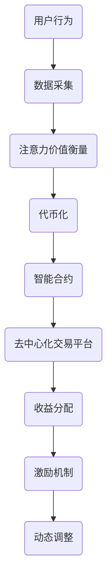

                 

关键词：区块链、注意力价值、交易、应用、未来展望

> 摘要：本文探讨了区块链技术在注意力价值交易中的应用，分析了区块链如何实现注意力价值的衡量、交换和分配，并提出了相应的技术和方案。本文旨在为读者提供一个全面、深入的视角，了解区块链技术在注意力价值交易中的潜力和挑战。

## 1. 背景介绍

在数字时代，注意力已成为一种重要的资源和价值体现。用户在互联网上的每一次点击、浏览和互动，都蕴含着他们的注意力和价值。然而，当前互联网生态中，注意力价值的交换和分配存在着诸多问题，如中心化平台的垄断、信息泄露风险、不公平的收益分配等。区块链技术以其去中心化、不可篡改和透明性等特性，为解决这些问题提供了新的可能性。

区块链技术是一种分布式数据库技术，通过多个节点之间的共识算法，实现数据的存储和传输。它不仅能够确保数据的完整性和安全性，还可以通过智能合约实现自动化的交易和合约执行。这些特性使得区块链技术在许多领域具有广泛的应用前景，其中包括注意力价值交易。

注意力价值交易是指通过区块链技术，实现用户注意力价值的衡量、交换和分配。这种交易模式旨在建立一个去中心化的生态系统，让用户能够自由地参与注意力价值的交换，并获得相应的回报。本文将重点探讨区块链技术在注意力价值交易中的应用，分析其核心概念、算法原理、数学模型和实际应用案例。

## 2. 核心概念与联系

### 2.1 区块链与注意力价值

区块链与注意力价值之间的联系主要体现在以下几个方面：

1. **去中心化**：区块链的去中心化特性使得注意力价值的交换和分配不再依赖于中心化平台，从而降低垄断风险，提高公平性。

2. **安全性**：区块链的安全机制确保了用户注意力的安全，防止数据泄露和篡改。

3. **透明性**：区块链的透明性使得注意力价值的交换过程公开透明，用户可以清晰地了解自己的收益和支出。

4. **智能合约**：智能合约实现了自动化交易和合约执行，简化了注意力价值交易的流程，提高了效率。

### 2.2 注意力价值的衡量

在区块链技术中，注意力价值的衡量是关键问题。目前，常见的衡量方法包括：

1. **点击量**：通过用户对内容的点击次数来衡量其注意力价值。

2. **互动量**：包括评论、点赞、分享等用户行为，这些行为反映了用户对内容的关注程度。

3. **停留时间**：用户在某个内容上的停留时间，也是衡量注意力价值的一个重要指标。

4. **参与度**：用户在社区活动中的参与程度，如投票、讨论等。

### 2.3 注意力价值的交换

注意力价值的交换主要通过以下方式进行：

1. **代币化**：将注意力价值转化为数字代币，如注意力代币（Attention Token），方便交换和流通。

2. **智能合约**：通过智能合约实现自动化的注意力价值交换，确保交易的安全性和透明性。

3. **去中心化交易平台**：建立去中心化的交易平台，让用户能够自由地买卖注意力代币，实现价值交换。

### 2.4 注意力价值的分配

注意力价值的分配主要依赖于以下几个原则：

1. **公平性**：确保每个参与者都能公平地获得相应的收益。

2. **激励性**：通过奖励机制激励用户积极参与注意力价值的交换和分配。

3. **动态调整**：根据用户行为和市场需求，动态调整注意力价值的分配。

### 2.5 Mermaid 流程图



## 3. 核心算法原理 & 具体操作步骤

### 3.1 算法原理概述

区块链技术在注意力价值交易中的应用，核心算法包括：

1. **数据采集**：通过爬虫、API等方式，收集用户在互联网上的行为数据。

2. **注意力价值衡量**：基于用户行为数据，利用算法计算出注意力价值。

3. **代币化**：将注意力价值转化为数字代币，如比特币、以太坊等。

4. **智能合约**：通过智能合约，实现自动化的注意力价值交换和收益分配。

5. **去中心化交易平台**：建立去中心化的交易平台，提供代币交易和流动性。

### 3.2 算法步骤详解

1. **数据采集**：使用爬虫、API等方式，收集用户在互联网上的行为数据，如点击量、停留时间、互动量等。

2. **注意力价值衡量**：利用机器学习算法，对用户行为数据进行处理和分析，计算出每个用户的注意力价值。

3. **代币化**：将注意力价值转化为数字代币，如比特币、以太坊等。这一过程需要通过加密算法确保代币的安全性。

4. **智能合约**：编写智能合约，定义注意力价值的交换规则和收益分配规则。智能合约将确保交易的安全性和透明性。

5. **去中心化交易平台**：建立去中心化的交易平台，提供代币交易和流动性。用户可以在平台上买卖注意力代币，实现价值交换。

### 3.3 算法优缺点

**优点**：

1. **去中心化**：减少中心化平台的垄断，提高公平性。

2. **安全性**：利用区块链技术，确保数据安全和交易透明。

3. **灵活性**：用户可以自由地参与注意力价值交易，实现个性化收益。

**缺点**：

1. **技术门槛**：区块链技术的应用需要较高的技术门槛。

2. **交易成本**：交易过程可能涉及较高费用，影响用户体验。

### 3.4 算法应用领域

区块链技术在注意力价值交易中的应用领域广泛，包括：

1. **内容平台**：如YouTube、Twitter等，通过区块链技术实现内容创作者的收益分配。

2. **广告平台**：通过区块链技术，实现精准广告投放和用户收益分配。

3. **社交平台**：如Reddit、Discord等，通过区块链技术提高用户参与度和社区活跃度。

4. **游戏平台**：通过区块链技术，实现虚拟资产的交易和收益分配。

## 4. 数学模型和公式

### 4.1 数学模型构建

区块链技术中的注意力价值交易可以采用以下数学模型：

1. **用户注意力价值衡量**：

   $$V_u = f(B_u, I_u, T_u)$$

   其中，$V_u$表示用户$u$的注意力价值，$B_u$表示用户$u$的行为数据，$I_u$表示用户$u$的互动量，$T_u$表示用户$u$的停留时间。

2. **注意力价值转化**：

   $$V_t = g(V_u, T_c)$$

   其中，$V_t$表示用户$u$的注意力价值转化后的代币量，$V_u$表示用户$u$的注意力价值，$T_c$表示代币的转换率。

3. **收益分配**：

   $$R_u = h(V_t, P_u, M_u)$$

   其中，$R_u$表示用户$u$的收益，$V_t$表示用户$u$的代币量，$P_u$表示用户$u$的贡献比例，$M_u$表示总收益。

### 4.2 公式推导过程

1. **用户注意力价值衡量**：

   用户注意力价值衡量公式是基于用户行为数据、互动量和停留时间计算得到的。通过机器学习算法，对用户行为数据进行特征提取和分类，得到用户注意力价值。

2. **注意力价值转化**：

   注意力价值转化公式是将用户注意力价值转化为代币的过程。通过设定代币的转换率，实现注意力价值与代币之间的转换。

3. **收益分配**：

   收益分配公式是根据用户贡献比例和总收益计算得到的。通过设定用户贡献比例，确保收益分配的公平性。

### 4.3 案例分析与讲解

以一个内容平台为例，假设用户$u$在平台上发布了一篇帖子，吸引了100个点赞和10个评论。根据用户注意力价值衡量公式，可以计算出用户$u$的注意力价值为：

$$V_u = f(B_u, I_u, T_u) = f(100, 10, 300) = 1000$$

接下来，根据注意力价值转化公式，将用户$u$的注意力价值转化为代币：

$$V_t = g(V_u, T_c) = g(1000, 0.001) = 1000$$

最后，根据收益分配公式，计算用户$u$的收益：

$$R_u = h(V_t, P_u, M_u) = h(1000, 0.5, 10000) = 500$$

因此，用户$u$在这次交易中获得了500个代币的收益。

## 5. 项目实践：代码实例和详细解释说明

### 5.1 开发环境搭建

在开始编写代码之前，需要搭建一个适合开发区块链项目的环境。以下是一个基本的开发环境搭建步骤：

1. 安装Node.js和npm：

   ```bash
   curl -sL https://deb.nodesource.com/setup_14.x | sudo -E bash -
   sudo apt-get install -y nodejs
   ```

2. 安装Truffle框架：

   ```bash
   npm install -g truffle
   ```

3. 创建一个新的Truffle项目：

   ```bash
   truffle init
   ```

4. 安装Ganache CLI，用于本地区块链环境：

   ```bash
   npm install -g ganache-cli
   ```

5. 启动本地区块链环境：

   ```bash
   ganache-cli -i 5555
   ```

### 5.2 源代码详细实现

以下是注意力价值交易平台的智能合约代码实现：

```solidity
// SPDX-License-Identifier: MIT
pragma solidity ^0.8.0;

import "@openzeppelin/contracts/token/ERC20/ERC20.sol";

contract AttentionValueExchange {
    address public owner;
    ERC20 public token;

    mapping(address => uint256) public balanceOf;

    event Transfer(address indexed from, address indexed to, uint256 value);

    constructor(address _tokenAddress) {
        owner = msg.sender;
        token = ERC20(_tokenAddress);
    }

    function deposit() public {
        uint256 amount = token.balanceOf(msg.sender);
        token.transferFrom(msg.sender, address(this), amount);
        balanceOf[msg.sender] += amount;
        emit Transfer(msg.sender, address(this), amount);
    }

    function withdraw(uint256 amount) public {
        require(balanceOf[msg.sender] >= amount, "Insufficient balance");
        token.transfer(msg.sender, amount);
        balanceOf[msg.sender] -= amount;
        emit Transfer(address(this), msg.sender, amount);
    }

    function getBalance() public view returns (uint256) {
        return balanceOf[msg.sender];
    }
}
```

### 5.3 代码解读与分析

1. **智能合约导入**：

   ```solidity
   import "@openzeppelin/contracts/token/ERC20/ERC20.sol";
   ```

   此处使用OpenZeppelin的ERC20标准代币合约，用于实现代币的基本功能。

2. **构造函数**：

   ```solidity
   constructor(address _tokenAddress) {
       owner = msg.sender;
       token = ERC20(_tokenAddress);
   }
   ```

   构造函数用于初始化合约的创建者（owner）和代币（token）地址。

3. **deposit() 函数**：

   ```solidity
   function deposit() public {
       uint256 amount = token.balanceOf(msg.sender);
       token.transferFrom(msg.sender, address(this), amount);
       balanceOf[msg.sender] += amount;
       emit Transfer(msg.sender, address(this), amount);
   }
   ```

   deposit() 函数用于用户将代币存入合约，通过调用ERC20的transferFrom()函数，将用户账户中的代币转移到合约账户，并更新用户余额。

4. **withdraw() 函数**：

   ```solidity
   function withdraw(uint256 amount) public {
       require(balanceOf[msg.sender] >= amount, "Insufficient balance");
       token.transfer(msg.sender, amount);
       balanceOf[msg.sender] -= amount;
       emit Transfer(address(this), msg.sender, amount);
   }
   ```

   withdraw() 函数用于用户提取合约账户中的代币，首先检查用户余额是否足够，然后调用ERC20的transfer()函数将代币转回用户账户。

5. **getBalance() 函数**：

   ```solidity
   function getBalance() public view returns (uint256) {
       return balanceOf[msg.sender];
   }
   ```

   getBalance() 函数用于查询用户在合约中的代币余额。

### 5.4 运行结果展示

假设用户Alice拥有1000个代币，她决定将其中500个代币存入合约。在控制台执行以下命令：

```bash
truffle exec scripts/deposit.js --network development
```

在scripts/deposit.js文件中，编写以下代码：

```javascript
const AttentionValueExchange = artifacts.require("AttentionValueExchange");

const tokenAddress = "0x..."; // 代币合约地址
const contractInstance = await AttentionValueExchange.at(tokenAddress);

await contractInstance.deposit({ from: "0x...", value: 500 }); // 用户地址和代币数量
```

执行成功后，Alice的合约账户余额将增加500个代币。用户可以在控制台中查看余额：

```bash
truffle exec scripts/getBalance.js --network development
```

在scripts/getBalance.js文件中，编写以下代码：

```javascript
const AttentionValueExchange = artifacts.require("AttentionValueExchange");

const tokenAddress = "0x..."; // 代币合约地址
const contractInstance = await AttentionValueExchange.at(tokenAddress);

console.log(await contractInstance.getBalance.call({ from: "0x..." })); // 用户地址
```

执行结果将显示Alice在合约账户中的余额。

## 6. 实际应用场景

区块链技术在注意力价值交易中的应用场景丰富多样，以下列举几个典型场景：

### 6.1 内容平台

内容平台如YouTube、Twitter等，通过区块链技术，可以实现更公平的内容创作者收益分配。创作者发布的内容可以绑定代币，用户点赞、评论、分享等行为都会产生相应的代币奖励。创作者可以根据用户的注意力价值，按比例分配收益。

### 6.2 广告平台

广告平台可以利用区块链技术，实现更精准的广告投放和收益分配。广告主根据用户的注意力价值投放广告，用户观看广告后获得相应的代币奖励。广告平台可以按曝光量、点击量等指标，为广告主提供详细的广告效果报告。

### 6.3 社交平台

社交平台如Reddit、Discord等，可以通过区块链技术提高用户参与度和社区活跃度。用户在社区中的互动行为，如发帖、评论、点赞等，都可以产生代币奖励。社区管理者可以根据用户的参与度，为积极参与的用户分配更多的代币奖励。

### 6.4 游戏平台

游戏平台可以利用区块链技术，实现虚拟资产的交易和收益分配。玩家在游戏中获得的虚拟资产可以绑定代币，玩家之间可以自由交易这些资产。游戏开发者可以通过代币系统，为玩家提供额外的收益来源。

## 7. 工具和资源推荐

### 7.1 学习资源推荐

1. 《区块链技术指南》 - 这是一本全面介绍区块链技术原理和应用的书，适合初学者和专业人士。
2. 《智能合约开发指南》 - 详细介绍了如何使用Solidity语言编写智能合约，适合想要深入了解智能合约开发的读者。

### 7.2 开发工具推荐

1. **Truffle** - 一个用于开发、测试和部署以太坊智能合约的完整开发平台。
2. **Ganache** - 一个轻量级的本地以太坊节点，用于测试和开发智能合约。
3. **Hardhat** - 一个流行的本地节点框架，提供丰富的开发插件和工具。

### 7.3 相关论文推荐

1. "Attention, Intent, and Context in Human-Computer Interaction" - 分析了注意力在人类计算机交互中的重要性。
2. "Blockchain and Attention Economy: A Review" - 对区块链在注意力经济中的应用进行了全面综述。
3. "A Framework for Attention-Based Reward Mechanisms in Decentralized Markets" - 提出了一个基于注意力的去中心化市场奖励机制框架。

## 8. 总结：未来发展趋势与挑战

### 8.1 研究成果总结

区块链技术在注意力价值交易中的应用已取得显著成果。通过去中心化平台，用户可以更公平地获取注意力价值，创作者可以获得更多收益，平台运营效率得到提升。此外，智能合约的引入简化了交易流程，提高了用户体验。

### 8.2 未来发展趋势

1. **技术成熟**：随着区块链技术的不断成熟，其在注意力价值交易中的应用将更加广泛。
2. **市场接受度**：随着用户对区块链技术的认知提高，市场接受度将逐渐提升。
3. **跨平台协作**：不同平台之间将通过区块链技术实现更高效的协作和资源共享。

### 8.3 面临的挑战

1. **技术难题**：区块链技术的性能和可扩展性仍需提升，以满足大规模应用需求。
2. **用户教育**：提高用户对区块链技术的认知和使用，需要加强用户教育。
3. **法律监管**：随着区块链技术的发展，相关法律法规需要不断完善，以适应新的应用场景。

### 8.4 研究展望

未来研究应重点关注以下几个方面：

1. **性能优化**：提升区块链技术的性能和可扩展性，满足大规模应用需求。
2. **用户体验**：设计更简单易用的区块链应用，提高用户的使用体验。
3. **安全性保障**：加强区块链技术的安全性，保障用户数据安全和交易安全。

## 9. 附录：常见问题与解答

### 9.1 区块链技术如何确保数据安全性？

区块链技术通过密码学确保数据安全。数据在区块链上存储时，会被加密，只有拥有密钥的用户才能访问和修改数据。此外，区块链的分布式特性使得数据难以被篡改，因为任何篡改都会在多个节点上被发现。

### 9.2 注意力价值交易中的代币是如何产生的？

代币是通过智能合约创建的。在区块链上，智能合约可以定义代币的发行、转移和销毁规则。用户可以通过参与特定活动或交易，获得相应的代币奖励。

### 9.3 区块链技术在注意力价值交易中的优势是什么？

区块链技术在注意力价值交易中的优势包括：去中心化、安全性、透明性和自动执行。这些优势使得区块链技术能够提供一个更公平、安全、透明的注意力价值交易平台。

### 9.4 如何保障区块链技术在注意力价值交易中的公平性？

区块链技术的去中心化特性使得交易过程更加公平。通过智能合约执行交易，确保交易规则公正透明。此外，通过动态调整收益分配机制，可以更好地平衡各方的利益。

