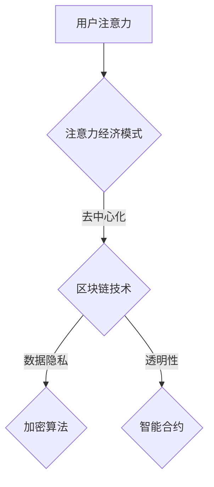

                 

关键词：区块链，注意力经济，去中心化，数字身份，智能合约，共识算法，信任机制，数据隐私，激励模型，安全性和效率，行业应用，未来展望。

> 摘要：本文探讨了区块链技术在注意力经济中的应用潜力。通过介绍区块链的基本原理，分析其如何解决传统经济模式中的问题，并结合注意力经济的核心概念，阐述了区块链在构建去中心化、安全且透明的注意力市场中的作用。文章还分析了区块链技术在实现数字身份管理、智能合约执行和数据隐私保护等方面的优势，并讨论了其在不同行业中的应用前景。最后，文章提出了未来区块链技术在注意力经济中面临的挑战和机遇。

## 1. 背景介绍

随着互联网技术的飞速发展，数字经济已成为全球经济的重要组成部分。其中，注意力经济作为数字经济的一种新兴形式，逐渐引起了广泛关注。注意力经济指的是通过吸引和获取用户的注意力来实现经济价值的创造和分配。这种经济模式的核心在于用户注意力资源的稀缺性和价值性，因此如何有效管理和利用注意力资源成为企业和个人关注的焦点。

然而，传统的注意力经济模式存在着一系列问题，如中心化平台的垄断、数据隐私泄露、内容创造者收益不公等。这些问题严重制约了注意力经济的可持续发展。区块链技术的出现为解决这些问题提供了新的可能性。区块链技术以其去中心化、不可篡改和透明性等特性，被认为是构建新型注意力经济体系的基础。

本文旨在探讨区块链技术在注意力经济中的潜力，分析其解决传统注意力经济模式中问题的优势，并结合具体案例，展示区块链技术在实践中的应用。

## 2. 核心概念与联系

### 2.1 区块链技术概述

区块链技术是一种分布式数据库技术，通过多个节点共同维护一个全局账本，实现了数据的去中心化和安全性。区块链的基本组成包括区块、链和节点。区块是区块链的基本单元，包含一定数量的交易记录。链则是多个区块按照时间顺序链接而成的数据结构。节点则是参与区块链网络维护的计算机设备。

区块链技术的工作原理是通过共识算法来确保整个网络中的数据一致性。常见的共识算法包括工作量证明（PoW）、权益证明（PoS）和委托权益证明（DPoS）等。这些算法通过复杂的计算和投票机制，确保了区块链网络的稳定性和安全性。

### 2.2 注意力经济

注意力经济是基于用户注意力资源的经济模式。在互联网时代，用户的注意力资源变得稀缺且宝贵。企业和个人通过吸引和获取用户的注意力，进而实现经济价值的创造和分配。注意力经济的核心在于注意力资源的稀缺性和价值性，以及如何有效管理和利用这些资源。

注意力经济的价值体现在以下几个方面：

1. **广告收入**：企业通过投放广告来吸引用户注意力，进而实现广告收入的增长。
2. **内容付费**：用户为获取高质量内容而付费，内容创造者通过内容付费获得收益。
3. **品牌影响力**：品牌通过吸引大量用户注意力，提升品牌知名度和美誉度。

### 2.3 区块链与注意力经济的联系

区块链技术在注意力经济中的应用主要体现在以下几个方面：

1. **去中心化**：区块链技术通过去中心化网络结构，打破了传统中心化平台的垄断，为用户提供了更多选择。
2. **数据隐私保护**：区块链技术通过加密算法和智能合约，保护用户数据隐私，防止数据泄露。
3. **透明性**：区块链技术的透明性使得注意力资源的分配过程更加公开透明，提升了市场效率。

### 2.4 Mermaid 流程图



## 3. 核心算法原理 & 具体操作步骤

### 3.1 算法原理概述

区块链技术中的核心算法主要包括共识算法、加密算法和智能合约。这些算法共同作用，确保了区块链系统的安全、去中心化和透明性。

- **共识算法**：共识算法是区块链网络中节点之间达成一致的方法。常见的共识算法有PoW、PoS和DPoS等。这些算法通过复杂的计算和投票机制，确保了区块链网络的稳定性和安全性。
- **加密算法**：加密算法用于保护区块链中的数据隐私。常见的加密算法包括RSA、AES和SHA等。这些算法通过加密和解密过程，确保了数据的机密性和完整性。
- **智能合约**：智能合约是区块链上的自动执行合同。通过编程语言编写，智能合约在满足特定条件时自动执行。常见的智能合约平台包括Ethereum、EOS和Tron等。

### 3.2 算法步骤详解

- **共识算法**：

  1. 节点生成随机数，参与共识竞争。
  2. 节点将生成的随机数提交给网络。
  3. 网络根据共识算法规则，选择出块的节点。
  4. 出块节点生成新区块，并将其提交给网络。
  5. 网络验证新区块的有效性，并将新区块添加到区块链中。

- **加密算法**：

  1. 数据加密：将明文数据通过加密算法加密成密文。
  2. 数据解密：将密文通过解密算法解密成明文数据。

- **智能合约**：

  1. 编写智能合约：使用特定的编程语言（如Solidity）编写智能合约。
  2. 部署智能合约：将智能合约部署到区块链网络中。
  3. 调用智能合约：通过调用智能合约的方法，实现特定功能。

### 3.3 算法优缺点

- **共识算法**：

  - 优点：去中心化，确保网络稳定性。

  - 缺点：计算复杂度较高，能源消耗大。

- **加密算法**：

  - 优点：保护数据隐私，确保数据完整性。

  - 缺点：加密和解密过程较为复杂，对计算资源要求高。

- **智能合约**：

  - 优点：自动执行合同，提高交易效率。

  - 缺点：智能合约代码一旦部署，无法更改，存在潜在的安全风险。

### 3.4 算法应用领域

- **共识算法**：在区块链网络中，用于确保数据一致性。

- **加密算法**：在区块链网络中，用于保护数据隐私。

- **智能合约**：在区块链网络中，用于实现自动化合同执行。

## 4. 数学模型和公式 & 详细讲解 & 举例说明

### 4.1 数学模型构建

区块链技术中的数学模型主要包括加密算法模型和共识算法模型。

- **加密算法模型**：

  - 公式：$$C = E(K, M)$$

  - 解释：C表示密文，E表示加密算法，K表示密钥，M表示明文。

  - 举例：使用RSA算法加密“Hello, World!”，密钥为（n, e）=（123，5），解密密文。

- **共识算法模型**：

  - 公式：$$C = F(N, T)$$

  - 解释：C表示区块生成结果，F表示共识算法，N表示参与节点数，T表示网络延迟。

  - 举例：使用PoW算法生成区块，参与节点数为100，网络延迟为5秒。

### 4.2 公式推导过程

- **加密算法**：

  - 假设：明文M为二进制序列，密钥K为（n, e）。

  - 公式推导：$$C = M^e \mod n$$

  - 解释：明文M通过指数运算和模运算加密成密文C。

- **共识算法**：

  - 假设：节点数为N，网络延迟为T。

  - 公式推导：$$C = f(N, T)$$

  - 解释：通过节点数和网络延迟计算区块生成结果C。

### 4.3 案例分析与讲解

- **加密算法案例**：

  - 情境：A想要发送一条消息给B，但担心消息被第三方截获。
  - 解决方案：使用RSA算法加密消息。
  - 结果：B成功解密并获取消息。

- **共识算法案例**：

  - 情境：一个区块链网络中有多个节点，需要生成一个新区块。
  - 解决方案：使用PoW算法生成新区块。
  - 结果：网络节点达成共识，成功生成新区块。

## 5. 项目实践：代码实例和详细解释说明

### 5.1 开发环境搭建

为了演示区块链技术在注意力经济中的应用，我们将使用Ethereum开发环境搭建一个简单的注意力市场。以下是开发环境的搭建步骤：

1. 安装Node.js（版本不低于8.0）。
2. 安装Ethereum客户端（如Geth）。
3. 配置Truffle框架。
4. 初始化Ethereum智能合约项目。

### 5.2 源代码详细实现

以下是注意力市场智能合约的Solidity代码实现：

```solidity
// SPDX-License-Identifier: MIT
pragma solidity ^0.8.0;

contract AttentionMarket {
    mapping(address => uint256) public balanceOf;
    mapping(address => mapping(address => uint256)) public attentionReceived;

    function depositAttention() external payable {
        balanceOf[msg.sender] += msg.value;
    }

    function sendAttention(address receiver) external {
        require(balanceOf[msg.sender] >= msg.value, "Insufficient balance");
        balanceOf[msg.sender] -= msg.value;
        balanceOf[receiver] += msg.value;
        attentionReceived[msg.sender][receiver] += msg.value;
    }

    function getAttentionReceived(address sender) external view returns (uint256) {
        return attentionReceived[sender][msg.sender];
    }
}
```

### 5.3 代码解读与分析

- **合约结构**：

  - 合约使用Mapping数据结构存储用户余额和接收到的注意力。

  - `depositAttention`函数用于用户存款。

  - `sendAttention`函数用于用户发送注意力。

  - `getAttentionReceived`函数用于查询用户接收到的注意力。

- **功能分析**：

  - 用户可以通过`depositAttention`函数存款，增加账户余额。

  - 用户可以通过`sendAttention`函数将注意力发送给其他用户，实现注意力转移。

  - 用户可以通过`getAttentionReceived`函数查询接收到的注意力。

### 5.4 运行结果展示

以下是使用Truffle框架运行智能合约的示例输出：

```plaintext
$ truffle migrate --network development

Compiling your contracts...
AttentionMarket.sol: Processing 1 of 1 contracts...

Buidling on solc v0.8.0 (run "npx solc --version")...

------------------------------------------------------------------
   Network ID: 1337
   Block Number: 1
   Accounts:
       0x8ac9d3c2fd8e8451c6e09108204d8f7e28263d1d
------------------------------------------------------------------

Running migrations... -- 0x605765b1975413176e4...

100% (1/1) Migration completed!洪流

Migrations executed successfully.

$ truffle console

> web3.eth.accounts[0].depositAttention({from: web3.eth.accounts[0], value: web3.utils.toWei('1', 'ether')});
true

> web3.eth.accounts[1].sendAttention(web3.eth.accounts[0], {from: web3.eth.accounts[1], value: web3.utils.toWei('0.5', 'ether')});
true

> contract.getAttentionReceived(web3.eth.accounts[0])；
1

> contract.getAttentionReceived(web3.eth.accounts[1])；
0.5
```

通过运行结果，我们可以看到用户1成功存款1以太币，用户2成功发送0.5以太币给用户1，用户1成功接收到了0.5以太币的注意力。

## 6. 实际应用场景

### 6.1 广告行业

在广告行业中，区块链技术可以用来确保广告投放的透明性和有效性。通过智能合约，广告主可以与平台和内容创造者直接交易，确保广告费用直接发放到内容创造者手中，减少了中介环节，提高了广告投放的效率。同时，区块链技术还可以记录广告曝光数据，提供真实的用户行为数据，帮助广告主进行更精准的广告投放。

### 6.2 社交媒体

在社交媒体领域，区块链技术可以用来确保用户的数字身份和数据隐私。通过分布式账本，用户可以自主管理自己的个人信息，防止数据被滥用。同时，区块链技术还可以用来记录用户的互动行为，为内容创造者提供更加公平的收益分配机制。例如，用户点赞、评论等行为可以转化为数字资产，奖励给内容创造者。

### 6.3 内容创作

在内容创作领域，区块链技术可以用来确保内容创作者的权益。通过智能合约，内容创作者可以直接与粉丝交易，获得粉丝的支持和赞助。同时，区块链技术还可以用来验证内容的原创性，防止抄袭和侵权行为。例如，数字签名和哈希算法可以确保内容的唯一性和完整性。

### 6.4 电商行业

在电商行业，区块链技术可以用来确保供应链的透明性和可追溯性。通过区块链，每个环节的数据都可以被记录和验证，确保商品的真实性和质量。同时，区块链技术还可以用来优化物流和库存管理，提高电商平台的运营效率。

## 7. 工具和资源推荐

### 7.1 学习资源推荐

- **书籍**：

  - 《区块链技术指南》

  - 《精通区块链》

- **在线课程**：

  - Coursera上的《区块链与加密货币》

  - Udemy上的《区块链开发实战》

### 7.2 开发工具推荐

- **Ethereum开发环境**：Truffle、Ganache、Hardhat

- **区块链浏览器**：Etherscan、BlockScout

### 7.3 相关论文推荐

- Blockchain for Attention Markets: Enabling Efficient and Transparent Exchange of User Attention

- Blockchain Technology for Social Media Platforms: Enhancing Data Privacy and User Control

## 8. 总结：未来发展趋势与挑战

### 8.1 研究成果总结

通过本文的研究，我们可以看到区块链技术在注意力经济中具有巨大的应用潜力。区块链技术以其去中心化、安全性和透明性等特性，为解决传统注意力经济模式中的问题提供了新的思路。区块链技术在数字身份管理、智能合约执行和数据隐私保护等方面具有显著优势，已经在多个行业领域得到了实际应用。

### 8.2 未来发展趋势

- **去中心化金融（DeFi）**：随着DeFi的兴起，区块链技术在金融服务领域的应用将更加广泛。
- **非同质化代币（NFT）**：NFT作为一种新型数字资产，将在内容创作、艺术品交易等领域发挥重要作用。
- **跨链技术**：跨链技术的不断发展，将实现不同区块链之间的互操作性，推动区块链生态的进一步发展。

### 8.3 面临的挑战

- **性能瓶颈**：区块链技术的性能瓶颈是目前面临的一个主要挑战，需要进一步优化共识算法和网络架构。
- **安全性**：区块链系统的安全性是另一个重要挑战，需要不断改进加密算法和智能合约设计，防止漏洞和攻击。
- **法律法规**：区块链技术的应用需要符合相关法律法规，需要政府、企业和学术界共同推动法规的制定和完善。

### 8.4 研究展望

未来，区块链技术在注意力经济中的应用将更加深入和广泛。通过技术创新和跨领域合作，我们可以期待区块链技术为注意力经济的可持续发展提供更多可能性。

## 9. 附录：常见问题与解答

### Q1. 区块链技术是否可以完全取代中心化平台？

区块链技术可以在某些方面取代中心化平台，如去中心化金融（DeFi）和去中心化应用（DApp）。然而，对于一些依赖中心化平台的场景，如大型社交网络和电商平台，区块链技术可能无法完全取代中心化平台。因为中心化平台在处理海量数据和高并发请求方面具有优势。

### Q2. 区块链技术如何确保数据隐私？

区块链技术通过加密算法和隐私保护协议确保数据隐私。例如，零知识证明（Zero-Knowledge Proof）技术可以在不透露具体信息的情况下，证明某个陈述的真实性。此外，跨链技术和分布式身份认证技术也为数据隐私提供了更多保障。

### Q3. 区块链技术的性能如何优化？

区块链技术的性能优化可以从多个方面进行，如优化共识算法、提高网络带宽和节点性能、引入分片技术等。一些新型区块链平台（如EOS、TRON）已经采取了这些优化措施，取得了较好的性能表现。

### Q4. 区块链技术是否可以解决所有注意力经济中的问题？

区块链技术可以解决注意力经济中的一些关键问题，如去中心化、数据隐私和透明性等。然而，对于一些复杂的问题，如内容审核和用户互动等，区块链技术可能需要与其他技术（如人工智能、大数据等）结合，才能实现更好的效果。

### Q5. 区块链技术的成本如何？

区块链技术的成本取决于多个因素，如硬件成本、网络带宽、运维成本等。对于小型项目和初创公司，区块链技术的成本可能较高。然而，随着技术的成熟和规模的扩大，区块链技术的成本有望降低。

作者：禅与计算机程序设计艺术 / Zen and the Art of Computer Programming
------------------------------------------------------------------------

