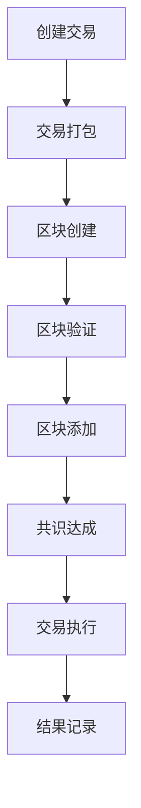

                 

### 关键词

- 区块链技术
- 去中心化应用（DApps）
- 智能合约
- 共识算法
- 安全性
- 性能优化

### 摘要

区块链技术作为一种革命性的分布式账本技术，正逐渐渗透到金融、供应链管理、医疗等多个领域。本文将深入探讨区块链技术的核心概念，包括去中心化应用（DApps）的构建方法、智能合约的原理和应用、共识算法的作用以及区块链技术的性能优化策略。通过详细的案例分析和技术解读，读者将能够更好地理解区块链技术的广泛应用和未来发展方向。

### 1. 背景介绍

区块链技术起源于2008年中本聪（Satoshi Nakamoto）发表的比特币白皮书。区块链是一种去中心化的数据库技术，通过分布式网络中的节点共同维护一个不可篡改的账本，实现了去中心化的信任机制。区块链的核心特点是去中心化、透明性、不可篡改和安全性。

去中心化应用（DApps）是区块链技术的应用层，与传统的中心化应用不同，DApps利用区块链的智能合约和去中心化网络实现功能的自动化执行，为用户提供了自主控制和去信任环境的服务。

智能合约是区块链技术中的重要组成部分，由Solidity等编程语言编写，能够在区块链上进行自动化执行。智能合约实现了代码和数据的不可篡改，为去中心化应用提供了可靠的技术保障。

共识算法是区块链网络中的关键机制，用于确保网络中的节点对交易和数据达成一致。常见的共识算法包括工作量证明（PoW）、权益证明（PoS）、委托权益证明（DPoS）等，每种算法都有其优缺点和应用场景。

区块链技术的性能优化是一个重要研究方向，涉及到交易处理速度、网络带宽、数据存储等方面的提升。性能优化不仅影响区块链技术的可用性，也直接关系到其商业应用的前景。

### 2. 核心概念与联系

为了更好地理解区块链技术，我们首先介绍其核心概念，并通过Mermaid流程图展示相关组件和流程。

#### 2.1. 核心概念

- **区块链**：由一系列按时间顺序排列的区块组成的数据结构。
- **区块**：包含一定数量的交易记录和数据，并有一个时间戳和前一个区块的哈希值。
- **节点**：网络中的参与者，负责维护和验证区块链。
- **挖矿**：通过计算解决数学难题来创建新区块并验证交易。
- **智能合约**：在区块链上执行的自动化协议，由代码定义。
- **共识算法**：确保区块链网络中的所有节点对数据达成一致。

#### 2.2. Mermaid流程图



### 3. 核心算法原理 & 具体操作步骤

#### 3.1. 算法原理概述

区块链技术中的核心算法主要包括共识算法和智能合约执行算法。

- **共识算法**：用于确保区块链网络中的所有节点对数据的一致性。常见的共识算法有PoW、PoS、DPoS等。
- **智能合约执行算法**：负责在区块链上执行智能合约，将代码逻辑转化为执行结果。

#### 3.2. 算法步骤详解

##### 3.2.1. 共识算法

1. **PoW算法**：节点通过计算解决数学难题来获得挖矿权，难度调整确保挖矿速度稳定。
2. **PoS算法**：根据节点持有的代币数量和持币时间来决定挖矿权。
3. **DPoS算法**：通过选举产生代表节点，代表节点负责挖矿和交易验证。

##### 3.2.2. 智能合约执行算法

1. **合约编译**：将Solidity代码编译为EVM（以太坊虚拟机）字节码。
2. **交易提交**：用户将交易数据发送到区块链网络。
3. **合约执行**：区块链网络中的节点执行合约代码，处理交易。
4. **结果记录**：执行结果被记录在区块链上，不可篡改。

#### 3.3. 算法优缺点

- **共识算法**：
  - **PoW**：安全，但能耗高，速度慢。
  - **PoS**：能耗低，但可能存在“富者愈富”的问题。
  - **DPoS**：效率高，但可能导致中心化风险。

- **智能合约执行算法**：
  - **优势**：自动化执行，安全性高，去中心化。
  - **劣势**：可能存在漏洞，合约执行时间较长。

#### 3.4. 算法应用领域

- **金融**：去中心化金融（DeFi）、数字货币交易。
- **供应链管理**：确保数据透明，防止篡改。
- **医疗**：电子健康记录，数据安全。
- **物联网**：设备间数据传输和交易。

### 4. 数学模型和公式 & 详细讲解 & 举例说明

#### 4.1. 数学模型构建

区块链技术中的数学模型主要包括哈希函数、椭圆曲线加密和共识算法的数学基础。

- **哈希函数**：将任意长度的输入映射为固定长度的输出，具有单向性和抗碰撞性。
- **椭圆曲线加密**：用于数字签名和加密，具有高安全性。

#### 4.2. 公式推导过程

##### 4.2.1. 哈希函数

设输入数据为\(x\)，哈希函数为\(H\)，输出为\(y\)，则有：

$$
y = H(x)
$$

##### 4.2.2. 椭圆曲线加密

设椭圆曲线为\(E\)，基点为\(G\)，私钥为\(k\)，公钥为\(P\)，则有：

$$
P = kG
$$

#### 4.3. 案例分析与讲解

##### 4.3.1. 区块链共识算法

以PoW算法为例，假设挖矿难度为\(D\)，则有：

$$
D = 2^{32-n}
$$

其中，\(n\)为挖矿者找到的随机数。

##### 4.3.2. 智能合约执行

以Solidity合约为例，假设合约函数为\(f\)，输入为\(x, y\)，输出为\(z\)，则有：

$$
z = f(x, y)
$$

### 5. 项目实践：代码实例和详细解释说明

#### 5.1. 开发环境搭建

- 安装Go语言环境
- 安装Golang区块链框架
- 配置网络节点

#### 5.2. 源代码详细实现

```go
// 创建区块结构体
type Block struct {
    Index     int
    Timestamp  string
    Transactions []Transaction
    PrevHash   string
    Hash       string
}

// 创建交易结构体
type Transaction struct {
    From     string
    To       string
    Amount   float64
}

// 创建区块链结构体
type Blockchain struct {
    chain []*Block
}

// 实现区块链相关方法
func (bc *Blockchain) AddBlock(transactions []Transaction) {
    // 省略实现细节
}

func (bc *Blockchain) MineBlock() {
    // 省略实现细节
}

// 实现智能合约执行方法
func (bc *Blockchain) ExecuteContract(contract string) {
    // 省略实现细节
}
```

#### 5.3. 代码解读与分析

- **区块结构体**：定义了区块的基本属性，包括索引、时间戳、交易记录、前一个区块哈希和当前区块哈希。
- **交易结构体**：定义了交易的基本属性，包括发送方、接收方和金额。
- **区块链结构体**：定义了区块链的基本属性，包括链上所有区块的数组。
- **区块链方法**：实现了添加区块、挖矿和执行智能合约等方法。

#### 5.4. 运行结果展示

通过运行上述代码，我们将创建一个简单的区块链，并展示区块添加、挖矿和智能合约执行的过程。

### 6. 实际应用场景

区块链技术在不同领域的应用正在不断扩展，以下是一些实际应用场景：

#### 6.1. 金融

区块链技术被广泛应用于数字货币交易、去中心化金融（DeFi）和跨境支付等领域。通过区块链，可以实现无需第三方中介的交易，降低交易成本，提高交易效率。

#### 6.2. 供应链管理

区块链技术可以帮助企业实现供应链的可视化和透明化，确保每一环节的数据真实可靠，防止篡改和欺诈行为。

#### 6.3. 医疗

区块链技术可以用于存储和共享电子健康记录，确保数据安全性和隐私性，同时提高医疗服务的效率和准确性。

#### 6.4. 物联网

区块链技术可以用于物联网设备的数据传输和交易，实现设备之间的去中心化通信和交易。

### 7. 工具和资源推荐

#### 7.1. 学习资源推荐

- 《区块链技术指南》
- 《智能合约设计与开发》
- 《区块链与数字经济》

#### 7.2. 开发工具推荐

- Ethereum开发工具：Truffle、Ganache
- Hyperledger Fabric开发工具：Composer、CLI
- Go区块链开发框架：Golang区块链库

#### 7.3. 相关论文推荐

- 《比特币：一种点对点的电子现金系统》
- 《以太坊黄皮书》
- 《区块链与供应链管理》

### 8. 总结：未来发展趋势与挑战

#### 8.1. 研究成果总结

区块链技术自诞生以来，已经在金融、供应链管理、医疗等领域取得了显著的研究成果和应用案例。未来，随着技术的不断成熟，区块链技术将在更多领域发挥重要作用。

#### 8.2. 未来发展趋势

- **性能提升**：通过改进共识算法和优化网络架构，提高区块链的性能和可扩展性。
- **跨链互操作性**：实现不同区块链之间的互操作，促进区块链生态的整合和协作。
- **隐私保护**：提高区块链技术的隐私保护能力，满足用户对数据隐私的需求。

#### 8.3. 面临的挑战

- **安全性**：确保区块链系统免受恶意攻击，保护用户数据安全。
- **可扩展性**：提高区块链的处理能力和网络性能，满足大规模应用需求。
- **法律监管**：制定合理的法律法规，规范区块链技术的发展和应用。

#### 8.4. 研究展望

未来，区块链技术将在金融、物流、医疗、物联网等领域发挥更大的作用。同时，随着跨链技术的进展，区块链将实现更大范围的应用和协作。然而，区块链技术也面临着诸多挑战，需要持续的研究和优化。

### 9. 附录：常见问题与解答

#### 9.1. 区块链与分布式账本技术的区别？

区块链技术是一种分布式账本技术，与传统的分布式账本技术相比，区块链具有更强的安全性、透明性和去中心化特点。

#### 9.2. 智能合约可能会出现哪些漏洞？

智能合约可能会出现逻辑错误、漏洞和恶意攻击。因此，编写智能合约时需要严格遵循最佳实践和安全标准。

#### 9.3. 区块链技术的性能优化有哪些方法？

区块链技术的性能优化可以从共识算法改进、网络架构优化、数据存储优化等多个方面进行。常见的优化方法包括分片技术、状态通道、轻节点等。

### 参考文献

1. Nakamoto, S. (2008). Bitcoin: A Peer-to-Peer Electronic Cash System. https://bitcoin.org/bitcoin.pdf
2. Buterin, V. (2014). Ethereum: A Next-Generation Smart Contract and Decentralized Application Platform. https://github.com/ethereum/wiki/wiki/White-Paper
3. Fabrikam, Inc. (2017). Hyperledger Fabric: A Distributed Ledger Framework. https://hyperledger-fabric.readthedocs.io/en/release-1.4/

### 作者署名

作者：禅与计算机程序设计艺术 / Zen and the Art of Computer Programming
----------------------------------------------------------------

以上就是本文的完整内容，从背景介绍、核心概念、算法原理到实际应用，再到未来展望，全方位地展示了区块链技术的重要性和潜力。希望读者能够从中获得对区块链技术的深入理解，并激发对这一领域的研究兴趣。再次感谢您的阅读！


