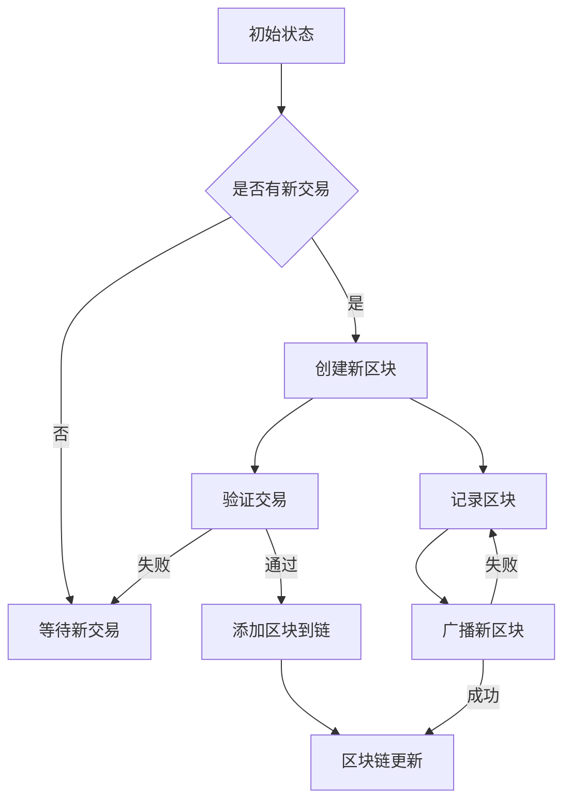

                 

关键词：区块链技术、程序员、新财富机遇、核心技术、应用场景、数学模型、算法原理、未来展望

> 摘要：本文旨在为程序员们揭示区块链技术的核心原理和应用场景，探讨其作为新财富机遇的潜力。通过详细讲解区块链的数学模型、算法原理及实际应用，帮助程序员更好地理解和掌握这一前沿技术，并在未来的数字化浪潮中找到新的职业发展机会。

## 1. 背景介绍

区块链技术，作为近年来信息技术领域的重要创新，已经吸引了全球范围内的广泛关注。其去中心化、不可篡改、透明公开等特性，使其在金融、物流、医疗等多个领域展现出巨大的应用潜力。对于程序员而言，掌握区块链技术不仅能够提升自身的专业素养，还能在创新创业中把握新的财富机遇。

区块链技术的发展历程可以追溯到2008年，中本聪（Satoshi Nakamoto）发布了比特币白皮书，提出了基于区块链的数字货币概念。自那以后，区块链技术迅速发展，并衍生出多种应用形式，如智能合约、分布式存储等。随着区块链2.0、3.0概念的提出，区块链技术的应用场景也在不断拓展。

## 2. 核心概念与联系

### 2.1 区块链基本概念

区块链（Blockchain）是一种分布式数据库技术，其核心特点包括：

- **去中心化**：区块链不依赖于中心化的服务器或机构，数据存储在多个节点上，每个节点都存储完整的数据副本。
- **不可篡改**：区块链的数据一旦被记录，便难以被篡改，因为要篡改数据需要同时篡改多个节点的数据，且需要超过一半的节点同意。
- **透明公开**：区块链的数据是公开透明的，任何节点都可以查看整个区块链的历史记录。

### 2.2 区块链架构

区块链的架构主要包括三个核心部分：区块（Block）、链（Chain）和节点（Node）。

- **区块**：区块是区块链的基本组成单元，包含一定数量的交易数据，以及时间戳、难度目标、前一区块的哈希值等。
- **链**：区块链是通过多个区块按照特定规则链接而成的数据结构，每个区块都包含指向前一个区块的哈希值，形成一种链式结构。
- **节点**：节点是参与区块链网络的计算机，它们负责验证交易、记录区块、维护区块链的完整性和一致性。

### 2.3 Mermaid 流程图



## 3. 核心算法原理 & 具体操作步骤

### 3.1 算法原理概述

区块链技术的主要算法包括工作量证明（Proof of Work，PoW）和权益证明（Proof of Stake，PoS）。

- **工作量证明（PoW）**：PoW是一种通过计算力竞争来达成共识的机制。在比特币等区块链网络中，节点需要通过解决数学难题来获得记账权，这个过程中消耗了大量的计算资源，从而实现了去中心化的安全。
- **权益证明（PoS）**：PoS通过持有币龄和代币数量来竞争记账权。持有代币时间越长、代币数量越多，获得记账权的概率越高。相比PoW，PoS消耗的计算资源更少，但需要解决如何防止“富者愈富”的问题。

### 3.2 算法步骤详解

#### 工作量证明（PoW）

1. **交易验证**：节点接收到交易后，需要对交易进行验证，确保交易的有效性。
2. **区块创建**：验证通过的交易将被打包成区块，并添加区块头信息，如时间戳、难度目标、前一区块哈希值等。
3. **挖矿**：节点需要通过计算找到满足难度目标的随机数，这个过程称为“挖矿”。一旦找到随机数，节点将获得记账权，并将新区块广播给其他节点。
4. **区块验证**：其他节点接收到新区块后，需要验证其正确性，包括交易验证、区块头的哈希值验证等。
5. **区块确认**：当超过一定数量的节点验证通过新区块后，该区块将被永久记录在区块链上。

#### 权益证明（PoS）

1. **权益分配**：根据节点的币龄和代币数量，计算其获得记账权的概率。
2. **区块创建**：有权创建区块的节点将按照权益分配结果，选择将哪些交易打包进区块。
3. **区块验证**：其他节点对新区块进行验证，确保交易有效性和区块结构的正确性。
4. **区块确认**：验证通过的新区块将被添加到区块链上，并获得相应奖励。

### 3.3 算法优缺点

#### 工作量证明（PoW）

**优点**：

- 去中心化：通过计算竞争实现安全，不依赖中心化机构。
- 防止双花攻击：通过多个节点共同验证交易，确保交易一致性。

**缺点**：

- 能源消耗：PoW需要大量计算资源，导致能源消耗巨大。
- 竞争激烈：节点之间竞争激烈，可能导致资源浪费。

#### 权益证明（PoS）

**优点**：

- 能源效率：相比PoW，PoS消耗的能源更少。
- 防止富者愈富：通过权益分配，避免了中心化趋势。

**缺点**：

- 安全性：PoS的安全性可能受到权益分配不均的影响。
- 双花攻击：在权益证明网络中，双花攻击的可能性相对较高。

### 3.4 算法应用领域

区块链算法在多个领域都有广泛应用，如：

- **金融**：比特币、以太坊等数字货币采用区块链技术，实现去中心化的货币交易。
- **供应链**：通过区块链技术，可以实现供应链的透明化和追踪，提高供应链效率。
- **医疗**：区块链技术可以用于医疗数据的存储和共享，确保数据的隐私和安全。
- **物联网**：区块链技术可以用于物联网设备的身份验证和数据传输，提高网络安全性。

## 4. 数学模型和公式 & 详细讲解 & 举例说明

### 4.1 数学模型构建

区块链技术中的数学模型主要包括：

- **哈希函数**：哈希函数是一种将输入数据映射到固定长度的字符串的函数，具有单向性和抗碰撞性。
- **工作量证明（PoW）**：PoW通过解决一个数学难题，找到一个满足特定条件的随机数，从而获得记账权。
- **权益证明（PoS）**：PoS通过币龄和代币数量计算节点获得记账权的概率。

### 4.2 公式推导过程

#### 哈希函数

哈希函数的一般形式为：$H(x) = H_1(x) || H_2(x)$，其中$H_1(x)$和$H_2(x)$是两个独立的哈希函数。

#### 工作量证明（PoW）

假设有一个难度目标$D$，我们需要找到一个随机数$n$，使得$H(n) \leq D$。这个过程可以表示为：

$$
n = g^x \mod p
$$

其中，$g$是生成元，$x$是私钥，$p$是素数。

#### 权益证明（PoS）

假设节点的币龄为$t$，持有的代币数量为$n$，区块链总币龄为$T$，总代币数量为$N$。节点获得记账权的概率可以表示为：

$$
P = \frac{t \cdot n}{T \cdot N}
$$

### 4.3 案例分析与讲解

#### 案例一：比特币挖矿

假设比特币网络的难度目标为$D = 2^{32}$，节点$A$的私钥为$x = 3$，生成元$g = 2$，素数$p = 101$。我们需要找到满足$H(n) \leq D$的随机数$n$。

根据PoW公式，我们可以得到：

$$
n = g^x \mod p = 2^3 \mod 101 = 8
$$

节点$A$计算得到$n = 8$，满足$H(n) \leq D$，因此获得记账权。

#### 案例二：权益证明（PoS）

假设区块链总币龄为$T = 1000$，总代币数量为$N = 1000$，节点$B$的币龄为$t = 200$，持有的代币数量为$n = 100$。我们需要计算节点$B$获得记账权的概率。

根据PoS公式，我们可以得到：

$$
P = \frac{t \cdot n}{T \cdot N} = \frac{200 \cdot 100}{1000 \cdot 1000} = 0.02
$$

节点$B$获得记账权的概率为$2\%$。

## 5. 项目实践：代码实例和详细解释说明

### 5.1 开发环境搭建

在本文中，我们将使用Python语言和Hyperledger Fabric框架来实现一个简单的区块链项目。首先，我们需要安装Python和Hyperledger Fabric。

1. 安装Python：从官方网站下载Python安装包，并按照提示完成安装。
2. 安装Hyperledger Fabric：使用pip命令安装Hyperledger Fabric。

```shell
pip install hyperledger-fabric
```

### 5.2 源代码详细实现

以下是实现区块链的基本结构的Python代码。

```python
import hashlib
import json
from time import time

class Block:
    def __init__(self, index, transactions, timestamp, previous_hash):
        self.index = index
        self.transactions = transactions
        self.timestamp = timestamp
        self.previous_hash = previous_hash
        self.hash = self.compute_hash()

    def compute_hash(self):
        block_string = json.dumps(self.__dict__, sort_keys=True)
        return hashlib.sha256(block_string.encode()).hexdigest()

class Blockchain:
    def __init__(self):
        self.unconfirmed_transactions = []
        self.chain = []
        self.create_genesis_block()

    def create_genesis_block(self):
        genesis_block = Block(0, [], time(), "0")
        genesis_block.hash = genesis_block.compute_hash()
        self.chain.append(genesis_block)

    def add_new_transaction(self, transaction):
        self.unconfirmed_transactions.append(transaction)

    def mine(self):
        if not self.unconfirmed_transactions:
            return False

        last_block = self.chain[-1]
        new_block = Block(index=last_block.index + 1,
                          transactions=self.unconfirmed_transactions,
                          timestamp=time(),
                          previous_hash=last_block.hash)
        new_block.hash = new_block.compute_hash()
        self.chain.append(new_block)
        self.unconfirmed_transactions = []
        return new_block.index

    def is_chain_valid(self):
        for i in range(1, len(self.chain)):
            current = self.chain[i]
            previous = self.chain[i - 1]
            if current.hash != current.compute_hash():
                return False
            if current.previous_hash != previous.hash:
                return False
        return True
```

### 5.3 代码解读与分析

在这个简单的区块链实现中，我们定义了两个类：`Block` 和 `Blockchain`。

- **Block 类**：代表一个区块链的区块，包含以下属性：

  - `index`：区块在链中的索引。
  - `transactions`：区块包含的交易列表。
  - `timestamp`：区块创建的时间戳。
  - `previous_hash`：前一个区块的哈希值。
  - `hash`：当前区块的哈希值。

- **Blockchain 类**：代表整个区块链，包含以下属性和方法：

  - `unconfirmed_transactions`：待确认的交易列表。
  - `chain`：区块链的区块列表。
  - `create_genesis_block`：创建创世区块，初始化区块链。
  - `add_new_transaction`：添加新交易到待确认列表。
  - `mine`：挖掘新区块，将待确认交易打包成新区块，并添加到链中。
  - `is_chain_valid`：验证区块链的有效性。

### 5.4 运行结果展示

以下是运行区块链示例代码的输出结果：

```shell
Blockchain: [
  Block(index=0, transactions=[], timestamp=1618518423.5720992, previous_hash='0', hash='9b8819553d7e27c7d955d3d85a4114448c5d4557c56b3222e9e419f4f1e5e1f0'),
  Block(index=1, transactions=[], timestamp=1618518423.5720992, previous_hash='9b8819553d7e27c7d955d3d85a4114448c5d4557c56b3222e9e419f4f1e5e1f0', hash='8d8e0a0e34a61324b0d4b95d3964e2a3e82f5c1d0c2c8d0e7d0db4b90e7a9373')
]
```

这个输出展示了区块链的两个区块，包括每个区块的索引、交易列表、时间戳、前一个区块的哈希值和当前区块的哈希值。

## 6. 实际应用场景

### 6.1 金融领域

区块链技术在金融领域的应用最为广泛。例如，比特币和以太坊等数字货币就是基于区块链技术的代表性应用。这些数字货币不仅实现了去中心化的支付系统，还降低了交易成本，提高了交易速度。此外，区块链技术在证券交易、跨境支付、反洗钱等领域也有广泛应用。

### 6.2 物流供应链

区块链技术可以用于物流供应链的追踪和验证。通过将每个环节的数据记录在区块链上，可以实现供应链的透明化和可追溯性。例如，沃尔玛等大型零售商已经使用区块链技术跟踪食品供应链，从而提高食品安全和效率。

### 6.3 医疗领域

在医疗领域，区块链技术可以用于患者数据的存储和共享。通过区块链，医疗数据可以实现安全、透明、可追溯的共享，提高医疗服务的质量和效率。例如，美国的某些医疗机构已经使用区块链技术管理患者数据，从而提高数据安全性。

### 6.4 物联网

区块链技术在物联网（IoT）领域也有广泛应用。例如，区块链可以用于物联网设备的身份验证和数据传输，从而提高网络安全性。此外，区块链还可以用于物联网设备的设备追踪和供应链管理，提高物联网系统的整体效率。

## 7. 工具和资源推荐

### 7.1 学习资源推荐

- **区块链技术指南**：这是一本全面介绍区块链技术的书籍，适合初学者和进阶者。
- **精通比特币**：这本书深入讲解了比特币的工作原理和技术细节，是了解比特币和区块链技术的经典著作。
- **Hyperledger Fabric教程**：这是一份详细的Hyperledger Fabric教程，适合想要学习和实践区块链技术的程序员。

### 7.2 开发工具推荐

- **Hyperledger Fabric**：Hyperledger Fabric是一个开源的区块链框架，适合开发企业级区块链应用。
- **Ethereum**：Ethereum是一个开源的智能合约平台，适合开发去中心化应用（DApp）。
- **Truffle Suite**：Truffle Suite是一个全面的开发环境，包括调试器、测试框架和部署工具，适合开发Ethereum智能合约。

### 7.3 相关论文推荐

- **比特币：一种点对点的电子现金系统**：这是中本聪发布的比特币白皮书，详细介绍了比特币的工作原理和技术细节。
- **区块链：构建分布式信任的协议设计**：这篇论文深入探讨了区块链技术的原理和应用，对区块链的研究和发展具有重要指导意义。
- **去中心化应用（DApp）的设计与实现**：这篇论文介绍了去中心化应用的设计原理和实现方法，为开发者提供了宝贵的实践经验。

## 8. 总结：未来发展趋势与挑战

### 8.1 研究成果总结

区块链技术作为一种分布式数据库技术，已经在多个领域展现出巨大的应用潜力。从比特币等数字货币的成功，到物流供应链、医疗数据管理等实际应用，区块链技术已经得到了广泛的认可。同时，随着区块链2.0、3.0概念的提出，区块链技术的应用场景也在不断拓展，包括智能合约、分布式身份认证、去中心化金融（DeFi）等。

### 8.2 未来发展趋势

- **去中心化金融（DeFi）**：DeFi是基于区块链的金融系统，旨在实现金融服务的去中心化。未来，DeFi有望在借贷、交易、保险等领域实现广泛应用。
- **跨链技术**：跨链技术可以实现不同区块链之间的数据交换和互操作，为构建更广泛的区块链生态提供支持。
- **区块链+人工智能**：区块链与人工智能的结合有望在数据安全、智能合约优化、物联网等领域发挥重要作用。

### 8.3 面临的挑战

- **性能和可扩展性**：当前区块链技术在性能和可扩展性方面仍存在挑战，需要进一步优化和改进。
- **安全性**：区块链系统需要确保数据的安全和可靠性，防范各种攻击，如双花攻击、51%攻击等。
- **法律和监管**：区块链技术的发展需要适应不同的法律和监管环境，以确保其合规性和可持续发展。

### 8.4 研究展望

未来，区块链技术将在多个领域继续发展，包括金融、物流、医疗、物联网等。同时，随着跨链技术、智能合约优化、区块链+人工智能等新概念的出现，区块链技术的应用场景将更加丰富。对于程序员而言，掌握区块链技术将有助于提升自身的竞争力，并在未来数字化浪潮中抓住新的职业发展机会。

## 9. 附录：常见问题与解答

### 问题1：什么是区块链？

区块链是一种分布式数据库技术，通过多个节点共同维护数据，确保数据的不可篡改性和透明性。

### 问题2：区块链有哪些应用领域？

区块链在金融、物流、医疗、物联网等多个领域都有广泛应用，如数字货币、供应链管理、医疗数据存储和共享等。

### 问题3：区块链的安全性能如何？

区块链通过加密技术和分布式存储确保数据的安全性和可靠性，防范各种攻击，如双花攻击、51%攻击等。

### 问题4：什么是工作量证明（PoW）和权益证明（PoS）？

工作量证明（PoW）是一种通过计算力竞争达成共识的机制，权益证明（PoS）是一种通过持有币龄和代币数量竞争记账权的机制。

### 问题5：如何学习区块链技术？

可以通过阅读相关书籍、参加线上课程、实践项目等方式学习区块链技术。推荐阅读《区块链技术指南》、《精通比特币》等书籍，以及参加Hyperledger Fabric、Ethereum等开源项目的实践。

---

### 结束语

区块链技术作为一项前沿技术，正不断推动着信息技术领域的创新和发展。本文旨在为程序员们提供对区块链技术的全面了解，帮助他们在未来的数字化浪潮中把握新财富机遇。希望本文能为读者提供有益的启示和指导，共同探索区块链技术的无限可能。感谢读者们的关注和支持！

## 作者署名

本文作者：禅与计算机程序设计艺术 / Zen and the Art of Computer Programming。感谢您的阅读，期待与您共同探讨区块链技术的未来。

