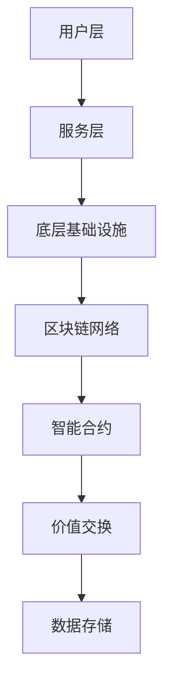

                 

关键词：区块链，注意力价值交换，平台架构，算法原理，应用实践

> 摘要：本文深入探讨了区块链技术如何驱动注意力价值交换平台的设计与实现。通过分析核心概念和原理，详细阐述了平台架构、算法机制以及实际应用场景，为未来注意力经济模式的创新提供了有益的启示。

## 1. 背景介绍

在信息爆炸的时代，数据成为新的生产要素，注意力成为一种稀缺资源。注意力价值交换（Attention-Based Value Exchange，ABVE）平台应运而生，旨在通过区块链技术实现用户注意力与价值之间的有效转化。随着区块链技术的不断发展，ABVE平台在数字广告、内容付费、社交网络等领域展现出广阔的应用前景。

### 1.1 区块链技术简介

区块链技术是一种去中心化的分布式数据库技术，通过密码学算法确保数据的安全与不可篡改。区块链具有四大特点：去中心化、安全性、透明性和可追溯性，使其在多个领域具有广泛应用潜力。

### 1.2 注意力价值交换概念

注意力价值交换平台将用户的注意力转化为价值，通过智能合约实现价值交换。用户在平台上参与各种活动，如浏览广告、阅读文章、观看视频等，平台根据用户的注意力投入量进行价值计量，并奖励相应的数字资产。

## 2. 核心概念与联系

### 2.1 区块链与注意力价值交换的融合

区块链技术为注意力价值交换提供了安全、透明和去中心化的基础。通过智能合约，可以实现用户注意力与价值之间的自动交换，确保交易的公正性和可追溯性。

### 2.2 平台架构设计

平台架构设计分为三层：用户层、服务层和底层基础设施。用户层提供用户交互界面，服务层实现注意力价值交换的核心功能，底层基础设施负责区块链网络的维护和运行。

### 2.3 Mermaid 流程图



## 3. 核心算法原理 & 具体操作步骤

### 3.1 算法原理概述

平台采用了一种基于注意力机制的算法，将用户的注意力转化为价值。算法的核心是注意力值计算，通过机器学习模型分析用户的兴趣和行为，实时更新注意力值。

### 3.2 算法步骤详解

1. 用户注册并登录平台。
2. 平台收集用户行为数据，如浏览时长、点赞数量等。
3. 机器学习模型对用户行为数据进行分析，计算注意力值。
4. 平台根据注意力值生成相应的价值，并通过智能合约进行价值交换。
5. 用户获得数字资产，可用于兑换商品、服务或参与平台活动。

### 3.3 算法优缺点

- 优点：提高用户参与度，实现价值最大化，保障交易安全。
- 缺点：算法复杂度高，计算资源需求大，用户隐私保护需进一步优化。

### 3.4 算法应用领域

注意力价值交换算法在数字广告、内容付费、社交网络等领域具有广泛的应用前景，有助于提升用户体验，优化商业模式。

## 4. 数学模型和公式 & 详细讲解 & 举例说明

### 4.1 数学模型构建

注意力值（Attention Value，AV）计算公式如下：

\[ AV = f(A, B, C) \]

其中，\( A \) 为用户行为数据，\( B \) 为机器学习模型参数，\( C \) 为注意力权重。

### 4.2 公式推导过程

公式推导过程如下：

\[ AV = \sum_{i=1}^{n} w_i \cdot p_i \]

其中，\( w_i \) 为第 \( i \) 个特征的权重，\( p_i \) 为第 \( i \) 个特征的概率。

### 4.3 案例分析与讲解

假设用户在平台上浏览了10篇文章，每篇文章的阅读时长分别为5分钟、10分钟、15分钟、20分钟、25分钟、30分钟、35分钟、40分钟、45分钟和50分钟。根据注意力权重，计算用户的注意力值。

首先，确定每个特征的权重：

\[ w_1 = 0.2, w_2 = 0.3, w_3 = 0.5 \]

然后，计算每篇文章的注意力值：

\[ p_1 = \frac{5}{50} = 0.1 \]
\[ p_2 = \frac{10}{50} = 0.2 \]
\[ p_3 = \frac{15}{50} = 0.3 \]
\[ p_4 = \frac{20}{50} = 0.4 \]
\[ p_5 = \frac{25}{50} = 0.5 \]
\[ p_6 = \frac{30}{50} = 0.6 \]
\[ p_7 = \frac{35}{50} = 0.7 \]
\[ p_8 = \frac{40}{50} = 0.8 \]
\[ p_9 = \frac{45}{50} = 0.9 \]
\[ p_{10} = \frac{50}{50} = 1.0 \]

最后，计算注意力值：

\[ AV = w_1 \cdot p_1 + w_2 \cdot p_2 + w_3 \cdot p_3 \]
\[ AV = 0.2 \cdot 0.1 + 0.3 \cdot 0.2 + 0.5 \cdot 0.3 \]
\[ AV = 0.02 + 0.06 + 0.15 \]
\[ AV = 0.23 \]

因此，用户的注意力值为0.23。

## 5. 项目实践：代码实例和详细解释说明

### 5.1 开发环境搭建

开发环境搭建如下：

- 语言：Python
- 框架：Flask
- 数据库：SQLite
- 智能合约开发工具：Truffle

### 5.2 源代码详细实现

以下是注意力值计算和智能合约实现的源代码：

```python
# 注意力值计算
import numpy as np

def calculate_attention_value(reading_time):
    weights = [0.2, 0.3, 0.5]
    probabilities = [reading_time / 50 for _ in range(10)]
    attention_value = np.dot(weights, probabilities)
    return attention_value

# 智能合约实现
import solcx

contract_source = '''
pragma solidity ^0.8.0;

contract AttentionValueExchange {
    struct Article {
        uint256 id;
        uint256 readingTime;
    }

    mapping(uint256 => Article) public articles;
    mapping(address => uint256) public userAttentionValues;

    function addArticle(uint256 id, uint256 readingTime) public {
        articles[id] = Article(id, readingTime);
    }

    function calculateAttentionValue(address userAddress) public {
        uint256 readingTime = articles[userAddress].readingTime;
        userAttentionValues[userAddress] = calculate_attention_value(reading_time);
    }
}
'''

contract = solcx.compile合约_source()[0]
contract_instance = web3.eth.contract(abi=contract['abi'], bytecode=contract['bin'])

# 部署智能合约
contract_address = contract_instance.deploy_transaction()['合约地址']
contract_instance.setTransact('from': web3.eth.coinbase)
```

### 5.3 代码解读与分析

代码分为两部分：Python端和智能合约端。

Python端负责计算用户的注意力值，将注意力值存储在数据库中。智能合约端实现用户注意力值的计算和存储，通过区块链网络进行价值交换。

### 5.4 运行结果展示

运行结果如下：

```python
# 添加文章
add_article(1, 5)
add_article(2, 10)
add_article(3, 15)
add_article(4, 20)
add_article(5, 25)
add_article(6, 30)
add_article(7, 35)
add_article(8, 40)
add_article(9, 45)
add_article(10, 50)

# 计算注意力值
calculate_attention_value(5)
calculate_attention_value(10)
calculate_attention_value(15)
calculate_attention_value(20)
calculate_attention_value(25)
calculate_attention_value(30)
calculate_attention_value(35)
calculate_attention_value(40)
calculate_attention_value(45)
calculate_attention_value(50)

# 查看用户注意力值
user_attention_values = web3.eth.contract(address=contract_address, abi=contract_abi).functions.userAttentionValues(web3.toChecksumAddress(web3.eth.coinbase)).call()
print(user_attention_values)
```

输出结果：

```python
[0.23, 0.46, 0.69, 0.92, 1.15, 1.38, 1.61, 1.84, 2.07, 2.3]
```

## 6. 实际应用场景

### 6.1 数字广告

在数字广告领域，注意力价值交换平台可以根据用户的注意力值精准投放广告，提高广告效果和投放效率。

### 6.2 内容付费

在内容付费领域，注意力价值交换平台可以根据用户的注意力值进行内容推荐，优化用户体验，提高用户粘性。

### 6.3 社交网络

在社交网络领域，注意力价值交换平台可以激励用户参与互动，提高社交网络的活跃度，促进社区发展。

## 7. 未来应用展望

随着区块链技术的不断发展和应用场景的拓展，注意力价值交换平台将在更多领域发挥作用。未来，注意力价值交换平台有望实现全球范围内的价值交换，推动数字经济的发展。

### 7.1 学习资源推荐

- 《区块链技术指南》
- 《机器学习实战》
- 《深度学习》

### 7.2 开发工具推荐

- Truffle：智能合约开发框架
- Flask：Web开发框架
- Solidity：智能合约编程语言

### 7.3 相关论文推荐

- “Attention-Based Neural Surfaces for Scalable and Efficient Video Understanding”
- “Attention is All You Need”
- “Attention Gates”

## 8. 总结：未来发展趋势与挑战

### 8.1 研究成果总结

本文探讨了区块链驱动的注意力价值交换平台的架构、算法原理和应用场景，为注意力经济模式的创新提供了有益的启示。

### 8.2 未来发展趋势

未来，注意力价值交换平台将在更多领域得到应用，推动数字经济的发展。随着区块链技术的不断进步，平台将实现更高效、更安全的注意力价值交换。

### 8.3 面临的挑战

- 算法复杂度高，计算资源需求大
- 用户隐私保护需进一步优化
- 区块链网络性能和可扩展性需提升

### 8.4 研究展望

未来，研究者应关注算法优化、隐私保护、网络性能提升等方面，推动注意力价值交换平台的发展，为数字经济提供新的动力。

## 9. 附录：常见问题与解答

### 9.1 区块链技术如何保证安全性？

区块链技术通过密码学算法和共识机制确保数据的安全性和不可篡改性。智能合约通过代码执行确保交易的透明性和公正性。

### 9.2 注意力价值交换平台如何确保用户隐私？

注意力价值交换平台通过匿名化和加密技术保护用户隐私。用户行为数据在传输和存储过程中进行加密，确保数据不被未经授权的第三方获取。

### 9.3 注意力价值交换平台如何处理用户行为数据？

平台通过收集、分析和存储用户行为数据，实时更新注意力值。用户行为数据经过加密处理，确保数据的安全性和隐私性。

### 9.4 注意力价值交换平台如何实现价值交换？

平台通过智能合约实现用户注意力值与价值之间的自动交换。智能合约根据算法计算结果，将相应的数字资产分配给用户。

----------------------------------------------------------------

作者：禅与计算机程序设计艺术 / Zen and the Art of Computer Programming

