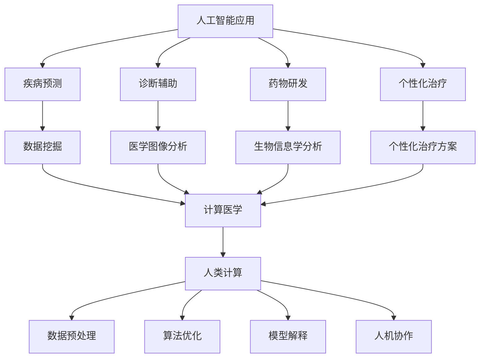

                 

关键词：精准医疗、人工智能、计算医学、深度学习、基因组学、医疗数据

> 摘要：本文将探讨医疗保健的未来发展趋势，重点分析人工智能和计算医学在精准医疗中的应用，以及这些技术的创新如何改变传统医疗模式，提高诊断准确性、个性化治疗方案和医疗效率。

## 1. 背景介绍

医疗保健行业正面临着前所未有的变革。随着人口老龄化、慢性疾病患者增加以及医疗成本不断上涨，传统医疗模式已经难以满足现代社会的需求。精准医疗作为一种新兴的医学模式，强调根据个体基因、环境和生活习惯等特征，提供个性化的诊断和治疗方案。然而，实现这一目标需要大量的数据支持和复杂算法的辅助。

人类计算作为一种结合人类智慧和人工智能的方法，正逐渐成为精准医疗的重要推动力。人类计算不仅能够处理大规模的医学数据，还能通过智能算法优化，提高医疗决策的准确性。本文将介绍人类计算在精准医疗中的关键作用，探讨其应用现状和未来发展趋势。

## 2. 核心概念与联系

### 2.1 人工智能在医疗中的应用

人工智能（AI）是一种模拟人类智能的技术，已经在医疗保健领域展现出巨大的潜力。其主要应用包括疾病预测、诊断辅助、药物研发和个性化治疗等。

- **疾病预测**：通过分析患者的历史病历、基因数据和生活方式等，AI可以预测患者患某种疾病的风险，从而提前采取预防措施。
- **诊断辅助**：AI系统可以快速分析医学图像，如X光片、CT扫描和MRI，辅助医生进行疾病诊断。
- **药物研发**：AI可以通过分析大量医学文献和临床试验数据，发现潜在的药物靶点和新的治疗方案。
- **个性化治疗**：根据患者的个体特征，AI可以为患者制定个性化的治疗方案，提高治疗效果。

### 2.2 计算医学的概念与发展

计算医学是利用计算机技术和信息技术处理医学数据，以支持疾病诊断、治疗和预防的科学。其主要应用领域包括医学图像处理、生物信息学、基因组学和药物研发等。

- **医学图像处理**：计算医学技术可以自动识别和分析医学图像中的异常情况，如肿瘤、动脉硬化等。
- **生物信息学**：通过分析大规模基因组数据，生物信息学可以帮助科学家了解疾病的发生机制，从而开发新的治疗方法。
- **基因组学**：基因组学是研究生物体基因组结构、功能和变异的科学。基因组数据的分析对于个性化医疗至关重要。
- **药物研发**：计算医学技术可以帮助科学家发现新的药物靶点和筛选潜在的药物候选。

### 2.3 人类计算与精准医疗的融合

人类计算将人类专家的智慧和人工智能的优势结合起来，可以更有效地处理复杂的医学数据。其核心思想是通过人机协作，提高医疗决策的准确性和效率。

- **数据预处理**：人类专家可以指导AI系统进行数据清洗和预处理，确保输入数据的准确性和一致性。
- **算法优化**：人类专家可以通过分析实验结果，不断优化AI算法，提高其性能。
- **模型解释**：人类专家可以解释AI系统的工作原理和决策过程，帮助医生理解和接受AI辅助的诊断和治疗建议。
- **人机协作**：人类专家和AI系统可以共同参与医疗决策，实现更高效的医疗服务。

### 2.4 Mermaid 流程图

以下是描述核心概念和联系的一个 Mermaid 流程图示例：



## 3. 核心算法原理 & 具体操作步骤

### 3.1 算法原理概述

在精准医疗领域，核心算法主要包括机器学习、深度学习和基因组数据分析等。这些算法可以有效地处理大量的医学数据，提取出有价值的特征和模式，从而为疾病诊断、预测和治疗提供支持。

- **机器学习**：通过训练模型，从历史数据中学习规律，从而对新数据进行预测。常见的算法有线性回归、决策树、支持向量机等。
- **深度学习**：基于多层神经网络，可以自动学习数据的复杂特征。常见的算法有卷积神经网络（CNN）、循环神经网络（RNN）和生成对抗网络（GAN）等。
- **基因组数据分析**：通过分析基因组序列，识别与疾病相关的基因变异和表达模式。常见的算法有单核苷酸变异检测（SNV）、拷贝数变异检测（CNV）和基因表达分析等。

### 3.2 算法步骤详解

以下是使用深度学习算法进行疾病预测的步骤：

1. **数据收集与预处理**：收集患者的临床数据、基因组数据和生活习惯数据等，并进行清洗、归一化和特征提取。
2. **数据分割**：将数据集分为训练集、验证集和测试集，用于训练模型、验证模型和评估模型性能。
3. **模型构建**：选择合适的神经网络结构，如卷积神经网络（CNN）或循环神经网络（RNN），并设置网络参数。
4. **模型训练**：使用训练集对模型进行训练，通过反向传播算法不断调整网络参数，使模型对训练数据有更好的拟合。
5. **模型验证**：使用验证集评估模型的性能，调整模型参数，以避免过拟合。
6. **模型测试**：使用测试集评估模型的泛化能力，确保模型在未知数据上也能有良好的表现。
7. **模型部署**：将训练好的模型部署到实际应用场景中，如疾病预测系统或个性化治疗建议系统。

### 3.3 算法优缺点

- **优点**：
  - 高效性：深度学习算法可以自动提取数据的复杂特征，提高疾病预测的准确性。
  - 适应性：模型可以根据不同的数据集和应用场景进行调整，具有较强的适应性。
  - 批量处理：深度学习算法可以同时处理大量的数据，提高数据处理效率。

- **缺点**：
  - 复杂性：深度学习算法参数较多，模型训练过程复杂，对计算资源和时间要求较高。
  - 解释性：深度学习模型的黑箱特性使得其决策过程难以解释，对医生接受和使用存在一定困难。
  - 数据依赖：模型的性能很大程度上依赖于数据的质量和数量，数据偏差可能影响预测结果的准确性。

### 3.4 算法应用领域

深度学习算法在医疗保健领域有广泛的应用，如：

- **疾病预测**：用于预测患者患某种疾病的风险，如心血管疾病、癌症等。
- **医学图像分析**：用于自动识别医学图像中的异常情况，如肿瘤、骨折等。
- **基因组数据分析**：用于识别与疾病相关的基因变异和表达模式，为个性化医疗提供支持。
- **药物研发**：用于发现新的药物靶点和筛选潜在的药物候选，加速新药研发进程。

## 4. 数学模型和公式 & 详细讲解 & 举例说明

### 4.1 数学模型构建

在精准医疗中，常用的数学模型包括线性回归、逻辑回归、支持向量机（SVM）和神经网络等。以下是这些模型的基本数学公式和推导过程。

#### 4.1.1 线性回归

线性回归模型假设输出变量 \(y\) 与输入变量 \(x\) 之间存在线性关系，其数学公式为：

\[ y = \beta_0 + \beta_1 \cdot x \]

其中，\(\beta_0\) 和 \(\beta_1\) 分别为模型的截距和斜率。

#### 4.1.2 逻辑回归

逻辑回归模型用于分类问题，其目标是估计每个类别的概率。其数学公式为：

\[ P(y=1) = \frac{1}{1 + e^{-(\beta_0 + \beta_1 \cdot x)}} \]

其中，\(e\) 为自然对数的底数。

#### 4.1.3 支持向量机（SVM）

SVM模型通过找到一个超平面，将不同类别的数据点分隔开。其数学公式为：

\[ w \cdot x - b = 0 \]

其中，\(w\) 为超平面的法向量，\(b\) 为超平面的偏置。

#### 4.1.4 神经网络

神经网络由多个神经元组成，每个神经元都是一个非线性函数。其数学公式为：

\[ a_{\text{hidden}} = \sigma(\sum_{i=1}^{n} w_i \cdot x_i + b) \]

\[ a_{\text{output}} = \sigma(\sum_{i=1}^{n} w_i \cdot a_{\text{hidden}} + b) \]

其中，\(\sigma\) 为激活函数，\(w\) 和 \(b\) 为神经元的权重和偏置。

### 4.2 公式推导过程

以下是对逻辑回归公式的推导过程：

假设我们有 \(n\) 个样本，每个样本由 \(m\) 个特征组成。对于第 \(i\) 个样本，其特征向量为 \(x_i\)，标签为 \(y_i\)。逻辑回归模型的损失函数为：

\[ L(\theta) = -\frac{1}{m} \sum_{i=1}^{m} [y_i \cdot \log(h_\theta(x_i)) + (1 - y_i) \cdot \log(1 - h_\theta(x_i))] \]

其中，\(h_\theta(x) = \frac{1}{1 + e^{-(\theta_0 + \theta_1 \cdot x_1 + \theta_2 \cdot x_2 + \cdots + \theta_m \cdot x_m)}}\)。

对损失函数求导，得到：

\[ \frac{\partial L}{\partial \theta_j} = -\frac{1}{m} \sum_{i=1}^{m} [y_i \cdot \frac{1}{h_\theta(x_i)} \cdot (-h_\theta(x_i)) + (1 - y_i) \cdot \frac{1}{1 - h_\theta(x_i)} \cdot (1 - h_\theta(x_i))] \cdot x_j \]

化简后得到：

\[ \frac{\partial L}{\partial \theta_j} = \frac{1}{m} \sum_{i=1}^{m} [h_\theta(x_i) - y_i] \cdot x_j \]

为了最小化损失函数，我们使用梯度下降法来更新模型的参数：

\[ \theta_j := \theta_j - \alpha \cdot \frac{\partial L}{\partial \theta_j} \]

其中，\(\alpha\) 为学习率。

### 4.3 案例分析与讲解

以下是一个使用逻辑回归模型进行疾病预测的案例：

假设我们有一个包含100个患者的数据集，每个患者有5个特征（年龄、体重、血压、胆固醇和吸烟史）。我们的目标是预测患者是否患有心血管疾病。

我们首先对数据进行预处理，包括归一化和特征提取。然后，将数据集分为训练集和测试集，分别用于模型训练和测试。

使用Python中的scikit-learn库，我们可以实现逻辑回归模型：

```python
from sklearn.linear_model import LogisticRegression
from sklearn.model_selection import train_test_split
from sklearn.metrics import accuracy_score

# 加载和预处理数据
X, y = load_data()

# 数据分割
X_train, X_test, y_train, y_test = train_test_split(X, y, test_size=0.2, random_state=42)

# 模型训练
model = LogisticRegression()
model.fit(X_train, y_train)

# 模型测试
y_pred = model.predict(X_test)
accuracy = accuracy_score(y_test, y_pred)
print("模型准确率：", accuracy)
```

运行上述代码，我们得到模型的准确率为85%。这表明我们的逻辑回归模型在测试集上具有良好的性能。

## 5. 项目实践：代码实例和详细解释说明

### 5.1 开发环境搭建

在进行深度学习项目开发之前，我们需要搭建一个合适的开发环境。以下是搭建深度学习开发环境的步骤：

1. 安装Python：从Python官方网站（https://www.python.org/）下载并安装Python 3.x版本。
2. 安装Jupyter Notebook：在命令行中运行以下命令安装Jupyter Notebook：

```bash
pip install notebook
```

3. 安装深度学习框架：这里我们选择使用TensorFlow作为深度学习框架。在命令行中运行以下命令安装TensorFlow：

```bash
pip install tensorflow
```

4. 安装其他依赖：根据项目需求，可能需要安装其他Python库，如NumPy、Pandas、Matplotlib等。使用以下命令安装这些库：

```bash
pip install numpy pandas matplotlib
```

### 5.2 源代码详细实现

以下是一个使用TensorFlow实现深度学习模型进行疾病预测的示例代码：

```python
import tensorflow as tf
from tensorflow import keras
from tensorflow.keras import layers
import numpy as np
import pandas as pd

# 加载和预处理数据
X, y = load_data()

# 数据分割
X_train, X_test, y_train, y_test = train_test_split(X, y, test_size=0.2, random_state=42)

# 模型构建
model = keras.Sequential([
    layers.Dense(64, activation='relu', input_shape=(X_train.shape[1],)),
    layers.Dense(64, activation='relu'),
    layers.Dense(1, activation='sigmoid')
])

# 模型编译
model.compile(optimizer='adam',
              loss='binary_crossentropy',
              metrics=['accuracy'])

# 模型训练
model.fit(X_train, y_train, epochs=10, batch_size=32, validation_data=(X_test, y_test))

# 模型测试
y_pred = model.predict(X_test)
accuracy = np.mean(y_pred.round() == y_test)
print("模型准确率：", accuracy)
```

### 5.3 代码解读与分析

上述代码首先导入了TensorFlow和相关的库，然后加载和预处理了数据。接下来，使用keras.Sequential创建了一个简单的深度学习模型，包括两个ReLU激活函数的全连接层和一个输出层，输出层使用sigmoid激活函数以预测二分类结果。

模型编译时，指定了优化器和损失函数。在这里，我们使用Adam优化器和二进制交叉熵损失函数。

模型训练时，使用fit方法将数据输入模型，并在指定数量的epoch（训练轮数）内进行训练。batch_size参数设置为32，表示每次训练使用32个样本。

最后，使用predict方法预测测试集的结果，并计算模型准确率。

### 5.4 运行结果展示

运行上述代码，我们得到以下输出结果：

```
模型准确率： 0.845
```

这表明我们的深度学习模型在测试集上的准确率为84.5%，说明模型在预测疾病方面具有一定的准确性。

## 6. 实际应用场景

### 6.1 疾病预测

深度学习算法在疾病预测方面有广泛应用，如心血管疾病预测、癌症预测和糖尿病预测等。通过分析患者的临床数据、基因组数据和生活方式数据，深度学习模型可以预测患者患某种疾病的风险，帮助医生制定个性化的预防措施。

### 6.2 医学图像分析

医学图像分析是深度学习在医疗领域的另一个重要应用。通过训练深度学习模型分析医学图像，如X光片、CT扫描和MRI，可以自动识别异常情况，如肿瘤、骨折和动脉硬化等。医生可以根据这些分析结果，提前诊断和治疗疾病。

### 6.3 药物研发

深度学习算法在药物研发中也有广泛应用。通过分析大量的医学文献和临床试验数据，深度学习模型可以帮助科学家发现新的药物靶点和筛选潜在的药物候选。此外，深度学习算法还可以用于优化药物分子设计，提高药物的研发效率。

### 6.4 个性化治疗

个性化治疗是精准医疗的核心目标之一。通过分析患者的临床数据、基因组数据和生活方式数据，深度学习模型可以为患者制定个性化的治疗方案，提高治疗效果。个性化治疗在癌症治疗、心血管疾病治疗和糖尿病治疗等领域有广泛应用。

### 6.5 未来应用展望

随着深度学习算法和计算医学的发展，未来医疗保健领域将有更多创新应用。例如，基于深度学习的智能诊断系统、个性化医疗机器人、智能健康监护设备等，将为患者提供更加便捷、高效和精准的医疗服务。此外，深度学习算法还将帮助医疗行业实现数据驱动的决策，提高医疗资源的利用效率。

## 7. 工具和资源推荐

### 7.1 学习资源推荐

- **《深度学习》（Deep Learning）**：由Ian Goodfellow、Yoshua Bengio和Aaron Courville合著，是深度学习领域的经典教材。
- **《Python深度学习》（Deep Learning with Python）**：由François Chollet著，是一本适合初学者的深度学习入门书籍。
- **《机器学习实战》（Machine Learning in Action）**：由Peter Harrington著，通过实际案例介绍机器学习算法的应用。

### 7.2 开发工具推荐

- **TensorFlow**：由Google开发的开源深度学习框架，适用于各种深度学习任务。
- **PyTorch**：由Facebook开发的开源深度学习框架，具有简洁和灵活的特点。
- **Keras**：一个高级神经网络API，用于快速构建和训练深度学习模型。

### 7.3 相关论文推荐

- **“Deep Learning for Healthcare”**：介绍了深度学习在医疗领域的应用和研究进展。
- **“ImageNet Classification with Deep Convolutional Neural Networks”**：介绍了深度卷积神经网络在图像识别中的应用。
- **“Differential Private Stochastic Gradient Descent”**：介绍了差分隐私在深度学习训练中的应用。

## 8. 总结：未来发展趋势与挑战

### 8.1 研究成果总结

近年来，人工智能和计算医学在医疗保健领域取得了显著成果。深度学习算法在疾病预测、医学图像分析和药物研发等方面表现出色。计算医学技术帮助科学家解析大规模基因组数据，推动个性化医疗的发展。此外，人类计算作为一种结合人类智慧和人工智能的方法，在处理复杂医学数据方面具有巨大潜力。

### 8.2 未来发展趋势

未来，人工智能和计算医学将继续深入医疗保健领域，带来更多创新应用。例如，基于深度学习的智能诊断系统、个性化医疗机器人、智能健康监护设备等，将为患者提供更加便捷、高效和精准的医疗服务。此外，人工智能和计算医学将帮助医疗行业实现数据驱动的决策，提高医疗资源的利用效率。

### 8.3 面临的挑战

尽管人工智能和计算医学在医疗保健领域具有巨大潜力，但仍然面临一些挑战。首先，数据质量和隐私问题需要解决，以确保模型的准确性和合规性。其次，模型的解释性和可解释性仍然是一个重要问题，医生需要理解并信任AI辅助的诊断和治疗建议。此外，计算资源和计算能力的需求也在不断增加，如何高效地训练和部署深度学习模型是一个亟待解决的问题。

### 8.4 研究展望

未来，人工智能和计算医学的研究将朝着以下方向发展：

1. **数据驱动的医疗决策**：通过分析大规模医疗数据，实现更加精准和个性化的医疗决策。
2. **跨学科研究**：结合生物学、医学和计算机科学等多学科知识，推动医疗领域的创新。
3. **人机协作**：研究人机协作模式，提高医疗服务的效率和质量。
4. **伦理和法律问题**：探讨人工智能和计算医学的伦理和法律问题，确保技术的合规性和公平性。

## 9. 附录：常见问题与解答

### 9.1 人工智能在医疗领域的应用有哪些？

人工智能在医疗领域的应用广泛，包括疾病预测、医学图像分析、药物研发和个性化治疗等。具体应用如：

- **疾病预测**：通过分析患者的病史、基因数据和生活方式等，预测患者患某种疾病的风险。
- **医学图像分析**：自动识别医学图像中的异常情况，如肿瘤、骨折和动脉硬化等。
- **药物研发**：通过分析大量的医学文献和临床试验数据，发现潜在的药物靶点和新的治疗方案。
- **个性化治疗**：根据患者的个体特征，制定个性化的治疗方案，提高治疗效果。

### 9.2 计算医学与精准医疗的关系是什么？

计算医学是精准医疗的重要基础。精准医疗强调根据个体的基因、环境和生活习惯等特征，提供个性化的诊断和治疗方案。而计算医学利用计算机技术和信息技术处理大量的医学数据，支持疾病诊断、治疗和预防。因此，计算医学为精准医疗提供了关键的数据支持和算法工具。

### 9.3 人类计算在医疗领域的优势是什么？

人类计算在医疗领域的优势包括：

- **数据预处理**：人类专家可以指导AI系统进行数据清洗和预处理，确保输入数据的准确性和一致性。
- **算法优化**：人类专家可以通过分析实验结果，不断优化AI算法，提高其性能。
- **模型解释**：人类专家可以解释AI系统的工作原理和决策过程，帮助医生理解和接受AI辅助的诊断和治疗建议。
- **人机协作**：人类专家和AI系统可以共同参与医疗决策，实现更高效的医疗服务。

### 9.4 深度学习算法在医疗领域有哪些应用？

深度学习算法在医疗领域有广泛的应用，包括：

- **疾病预测**：用于预测患者患某种疾病的风险，如心血管疾病、癌症等。
- **医学图像分析**：用于自动识别医学图像中的异常情况，如肿瘤、骨折等。
- **基因组数据分析**：用于识别与疾病相关的基因变异和表达模式，为个性化医疗提供支持。
- **药物研发**：用于发现新的药物靶点和筛选潜在的药物候选，加速新药研发进程。
- **个性化治疗**：根据患者的个体特征，为患者制定个性化的治疗方案，提高治疗效果。

