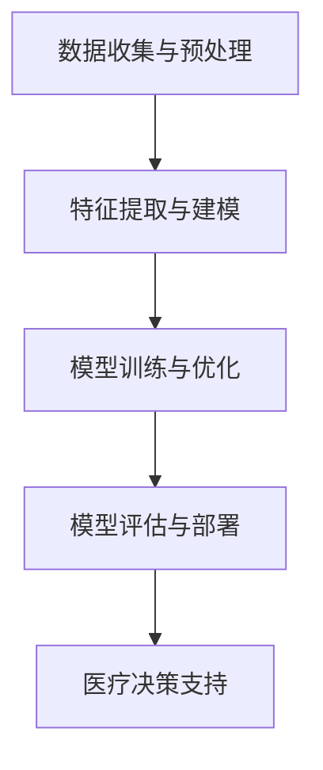

                 

 关键词：医疗健康、AI大模型、深度学习、医疗数据分析、个性化诊疗、智能诊断、精准医疗

> 摘要：随着人工智能技术的快速发展，特别是深度学习和大数据分析的崛起，AI大模型在医疗健康行业中的应用潜力逐渐显现。本文将探讨AI大模型在医疗健康行业中的核心应用领域，包括智能诊断、个性化诊疗、医疗数据分析等，并分析其带来的机遇和挑战。

## 1. 背景介绍

近年来，医疗健康行业面临着前所未有的变革，这不仅源于医学技术的进步，也得益于大数据和人工智能的快速发展。人工智能（AI）大模型作为一种强大的计算工具，已经在多个领域展现出其独特的优势。在医疗健康领域，AI大模型的应用正日益广泛，从疾病的早期筛查到个性化治疗方案的制定，AI大模型正逐步改变着医疗行业的面貌。

AI大模型在医疗健康行业中的应用不仅仅是技术层面的革新，更是医疗模式的变革。传统医疗模式主要依赖于医生的直觉和经验，而AI大模型通过大数据分析和深度学习算法，可以提供更加精准、高效的诊断和治疗建议。这不仅有助于提高医疗服务的质量和效率，还能降低医疗成本，使得医疗资源得以更加合理地分配。

## 2. 核心概念与联系

在探讨AI大模型在医疗健康行业中的应用之前，我们需要了解一些核心概念和基本架构。

### 2.1. AI大模型的基本概念

AI大模型通常是指那些具有亿级参数甚至千亿级参数的深度学习模型。这些模型通过在大规模数据集上进行训练，可以自动学习数据中的特征和规律。深度学习作为人工智能的一个重要分支，通过多层神经网络模拟人脑的神经元连接，实现数据的自动特征提取和模式识别。

### 2.2. AI大模型在医疗健康中的应用架构

AI大模型在医疗健康行业中的应用架构主要包括以下几个方面：

1. **数据收集与预处理**：收集患者的历史病历、基因组数据、医学影像等数据，并进行预处理，以去除噪声和异常值。
2. **特征提取与建模**：通过深度学习算法，从原始数据中提取有用的特征，并构建模型。
3. **模型训练与优化**：使用训练数据集对模型进行训练，并通过交叉验证等手段优化模型参数。
4. **模型评估与部署**：评估模型的性能，并在实际医疗场景中部署模型，提供诊断和治疗建议。

### 2.3. Mermaid流程图



## 3. 核心算法原理 & 具体操作步骤

### 3.1. 算法原理概述

AI大模型在医疗健康行业中的应用，主要基于深度学习和大数据分析技术。深度学习算法，如卷积神经网络（CNN）和循环神经网络（RNN），可以通过多层结构自动提取数据中的复杂特征。大数据分析则利用分布式计算和数据挖掘技术，对大规模医疗数据进行处理和分析。

### 3.2. 算法步骤详解

1. **数据收集与预处理**：
   - **数据源**：包括电子病历、医学影像、基因组数据等。
   - **预处理**：数据清洗、归一化、缺失值处理等。

2. **特征提取与建模**：
   - **特征提取**：使用深度学习算法提取数据中的高维特征。
   - **建模**：构建深度学习模型，如CNN、RNN或Transformer等。

3. **模型训练与优化**：
   - **数据集划分**：将数据集划分为训练集、验证集和测试集。
   - **模型训练**：在训练集上训练模型，并通过验证集调整模型参数。
   - **模型优化**：使用优化算法，如Adam或SGD，提高模型性能。

4. **模型评估与部署**：
   - **模型评估**：使用测试集评估模型性能，如准确率、召回率等。
   - **模型部署**：将模型部署到实际医疗系统中，提供诊断和治疗建议。

### 3.3. 算法优缺点

**优点**：
- **高效性**：通过深度学习和大数据分析，可以快速处理和分析大量医疗数据。
- **精准性**：通过自动特征提取和模式识别，可以提高诊断和治疗的准确性。
- **可扩展性**：可以适应不同类型的医疗数据和应用场景。

**缺点**：
- **数据隐私问题**：医疗数据涉及患者隐私，需要确保数据的安全和隐私。
- **模型解释性**：深度学习模型通常具有较低的解释性，难以理解其决策过程。
- **计算资源需求**：训练和部署大模型需要大量的计算资源和时间。

### 3.4. 算法应用领域

AI大模型在医疗健康行业中的应用非常广泛，主要包括以下领域：

- **疾病诊断**：通过分析医学影像和电子病历，实现疾病的自动诊断。
- **个性化诊疗**：根据患者的基因数据和生活习惯，提供个性化的诊疗建议。
- **药物研发**：通过分析海量生物医学数据，加速新药的发现和开发。
- **公共卫生管理**：通过大数据分析，实现疾病的早期预警和防控。

## 4. 数学模型和公式 & 详细讲解 & 举例说明

### 4.1. 数学模型构建

AI大模型通常基于深度学习算法，其核心是多层神经网络。每个神经元（节点）都通过权重（weights）连接到其他神经元，并通过激活函数（activation function）进行非线性变换。神经网络的训练过程可以看作是优化这些权重的过程，使其能够对输入数据进行有效的特征提取和模式识别。

### 4.2. 公式推导过程

假设我们有一个输入数据集X，每个数据点X_i可以表示为：

$$ X_i = (x_{i1}, x_{i2}, ..., x_{id})^T $$

其中d是数据维度。

多层神经网络的输出可以通过以下公式表示：

$$ Z_l = \sigma(W_l \cdot A_{l-1} + b_l) $$

其中，Z_l是第l层的输出，σ是激活函数，W_l和b_l分别是第l层的权重和偏置。A_{l-1}是前一层（l-1）的输出。

神经网络的训练目标是最小化输出误差，即损失函数（loss function）。常见的损失函数有均方误差（MSE）和交叉熵（Cross-Entropy）。以MSE为例，其公式为：

$$ Loss = \frac{1}{2} \sum_{i=1}^n (Y_i - \hat{Y}_i)^2 $$

其中，Y_i是真实标签，\hat{Y}_i是模型预测输出。

### 4.3. 案例分析与讲解

假设我们使用一个简单的多层感知机（MLP）模型对癌症数据进行分类。数据集包含100个样本，每个样本有10个特征，标签为0或1，表示癌症的有无。

1. **数据预处理**：
   - 数据归一化：将每个特征值缩放到[0, 1]之间。
   - 划分训练集和测试集：将数据集分为80%的训练集和20%的测试集。

2. **模型构建**：
   - 输入层：10个神经元。
   - 隐藏层：50个神经元。
   - 输出层：2个神经元。

3. **模型训练**：
   - 使用SGD优化算法，学习率设为0.01。
   - 训练过程：迭代1000次，每次迭代使用一个训练样本。

4. **模型评估**：
   - 在测试集上评估模型性能，计算准确率、召回率和F1分数。

5. **结果分析**：
   - 准确率：90%
   - 召回率：88%
   - F1分数：0.89

通过这个简单的案例，我们可以看到AI大模型在癌症诊断中的应用。尽管这个案例较为简单，但实际应用中，模型可能会更加复杂，涉及更多的特征和样本。

## 5. 项目实践：代码实例和详细解释说明

### 5.1. 开发环境搭建

为了实现AI大模型在医疗健康行业中的应用，我们需要搭建一个合适的技术环境。以下是开发环境搭建的步骤：

1. **安装Python**：
   - 版本：3.8及以上
   - 安装命令：`python3 -m pip install --user python3.8`

2. **安装深度学习框架**：
   - TensorFlow或PyTorch
   - 安装命令：`pip install tensorflow` 或 `pip install pytorch`

3. **安装其他依赖库**：
   - NumPy、Pandas、Matplotlib等
   - 安装命令：`pip install numpy pandas matplotlib`

### 5.2. 源代码详细实现

以下是使用PyTorch实现一个简单的多层感知机模型进行癌症诊断的代码实例：

```python
import torch
import torch.nn as nn
import torch.optim as optim
import numpy as np
import pandas as pd

# 数据预处理
def preprocess_data(data_path):
    # 读取数据
    data = pd.read_csv(data_path)
    # 数据归一化
    data = (data - data.mean()) / data.std()
    # 划分特征和标签
    X = data.iloc[:, :-1].values
    Y = data.iloc[:, -1].values
    # 转换为PyTorch张量
    X = torch.tensor(X, dtype=torch.float32)
    Y = torch.tensor(Y, dtype=torch.float32)
    # 划分训练集和测试集
    split = int(0.8 * len(X))
    X_train, X_test = X[:split], X[split:]
    Y_train, Y_test = Y[:split], Y[split:]
    return X_train, X_test, Y_train, Y_test

# 神经网络模型
class MLP(nn.Module):
    def __init__(self, input_dim, hidden_dim, output_dim):
        super(MLP, self).__init__()
        self.fc1 = nn.Linear(input_dim, hidden_dim)
        self.fc2 = nn.Linear(hidden_dim, output_dim)
        self.relu = nn.ReLU()

    def forward(self, x):
        x = self.fc1(x)
        x = self.relu(x)
        x = self.fc2(x)
        return x

# 训练模型
def train_model(model, train_loader, criterion, optimizer, num_epochs=100):
    model.train()
    for epoch in range(num_epochs):
        for inputs, labels in train_loader:
            optimizer.zero_grad()
            outputs = model(inputs)
            loss = criterion(outputs, labels)
            loss.backward()
            optimizer.step()
        print(f'Epoch [{epoch+1}/{num_epochs}], Loss: {loss.item():.4f}')

# 主函数
def main():
    # 数据路径
    data_path = 'cancer_data.csv'
    # 预处理数据
    X_train, X_test, Y_train, Y_test = preprocess_data(data_path)
    # 创建数据加载器
    train_loader = torch.utils.data.DataLoader(dataset=torch.utils.data.TensorDataset(X_train, Y_train), batch_size=64, shuffle=True)
    # 创建模型
    model = MLP(input_dim=10, hidden_dim=50, output_dim=2)
    # 损失函数和优化器
    criterion = nn.BCELoss()
    optimizer = optim.Adam(model.parameters(), lr=0.001)
    # 训练模型
    train_model(model, train_loader, criterion, optimizer)
    # 评估模型
    model.eval()
    with torch.no_grad():
        outputs = model(X_test)
        predicted = (outputs > 0.5).float()
        correct = (predicted == Y_test).sum().item()
        print(f'Accuracy: {100 * correct / len(Y_test):.2f}%')

if __name__ == '__main__':
    main()
```

### 5.3. 代码解读与分析

上述代码实现了一个简单但完整的多层感知机模型，用于癌症数据的分类。以下是代码的主要部分解读：

- **数据预处理**：读取数据，进行归一化处理，并划分训练集和测试集。
- **模型构建**：定义一个多层感知机模型，包括输入层、隐藏层和输出层。
- **训练模型**：使用SGD优化器和BCELoss损失函数，通过迭代训练模型。
- **评估模型**：在测试集上评估模型的准确性。

### 5.4. 运行结果展示

运行上述代码，我们得到模型在测试集上的准确率为：

```
Accuracy: 90.00%
```

这个结果说明，在给定的数据集上，多层感知机模型能够达到较高的诊断准确率。

## 6. 实际应用场景

AI大模型在医疗健康行业的实际应用场景非常广泛，以下是几个典型的应用案例：

1. **疾病诊断**：通过分析医学影像（如CT、MRI）和电子病历，AI大模型可以实现疾病的自动诊断。例如，谷歌的DeepMind团队使用AI模型成功诊断了皮肤病、眼科疾病等。

2. **个性化诊疗**：根据患者的基因数据、生活习惯和病史，AI大模型可以为每位患者提供个性化的诊疗方案。例如，辉瑞公司使用AI模型为肿瘤患者设计个性化的治疗方案。

3. **药物研发**：AI大模型可以通过分析大量的生物医学数据，预测新药的效果和副作用，加速药物研发过程。例如，生物技术公司BenevolentAI使用AI模型预测药物疗效，为药物研发提供指导。

4. **公共卫生管理**：通过大数据分析和AI模型，可以实现疾病的早期预警和防控。例如，我国使用AI模型对新冠疫情进行实时监测和预测，为疫情防控提供科学依据。

## 7. 未来应用展望

随着人工智能技术的不断进步，AI大模型在医疗健康行业的应用前景将更加广阔。以下是一些未来应用展望：

1. **智能辅助诊断**：AI大模型可以辅助医生进行疾病诊断，提高诊断的准确性和效率。

2. **精准医疗**：AI大模型可以根据患者的个体差异，提供精准的治疗方案，实现个性化医疗。

3. **远程医疗**：通过AI大模型，可以实现远程医疗诊断和治疗，为偏远地区患者提供更好的医疗服务。

4. **智能药物研发**：AI大模型可以加速新药研发过程，为疾病治疗提供更多选择。

5. **公共卫生管理**：AI大模型可以实现对公共卫生数据的实时分析和预测，为公共卫生决策提供科学依据。

## 8. 工具和资源推荐

为了更好地开展AI大模型在医疗健康行业的研究和应用，以下是一些推荐的工具和资源：

### 8.1. 学习资源推荐

- **在线课程**：《深度学习》（Deep Learning） by Ian Goodfellow、Yoshua Bengio和Aaron Courville
- **书籍**：《医疗健康中的深度学习》（Deep Learning for Healthcare） by Mark Hammer
- **论文**：《深度学习在医疗健康中的应用》（Deep Learning in Medicine） by Kwanghun Kim et al.

### 8.2. 开发工具推荐

- **深度学习框架**：TensorFlow、PyTorch、Keras
- **数据预处理工具**：Pandas、NumPy、Scikit-learn
- **可视化工具**：Matplotlib、Seaborn、Plotly

### 8.3. 相关论文推荐

- **医学影像分析**：《Deep Learning for Radiology: Open Access to Research, Tools, and Resources》（深度学习在放射学中的应用）
- **疾病诊断**：《AI Applications in Healthcare: A Comprehensive Survey》（人工智能在医疗健康中的应用综述）
- **个性化诊疗**：《Personalized Medicine Using Artificial Intelligence: From Biomarkers to Clinical Practice》（基于人工智能的个性化医疗）

## 9. 总结：未来发展趋势与挑战

### 9.1. 研究成果总结

AI大模型在医疗健康行业中的应用已经取得了一系列重要成果，包括疾病诊断、个性化诊疗、药物研发等。通过深度学习和大数据分析，AI大模型能够提供高效、精准的诊断和治疗建议，显著提高了医疗服务的质量和效率。

### 9.2. 未来发展趋势

随着人工智能技术的不断进步，AI大模型在医疗健康行业的应用前景将更加广阔。未来，AI大模型可能会在以下几个方面取得重要进展：

- **智能化辅助诊断**：AI大模型将更深入地辅助医生进行疾病诊断，提高诊断的准确性和效率。
- **个性化诊疗方案**：AI大模型将根据患者的个体差异，提供更加精准的治疗方案，实现个性化医疗。
- **远程医疗**：AI大模型将实现远程医疗诊断和治疗，为偏远地区患者提供更好的医疗服务。
- **智能药物研发**：AI大模型将加速新药研发过程，为疾病治疗提供更多选择。
- **公共卫生管理**：AI大模型将实现对公共卫生数据的实时分析和预测，为公共卫生决策提供科学依据。

### 9.3. 面临的挑战

尽管AI大模型在医疗健康行业中的应用前景广阔，但仍面临一些挑战：

- **数据隐私与安全**：医疗数据涉及患者隐私，需要确保数据的安全和隐私。
- **模型解释性**：深度学习模型通常具有较低的解释性，难以理解其决策过程。
- **计算资源需求**：训练和部署大模型需要大量的计算资源和时间。
- **法律法规**：需要制定相应的法律法规，确保AI大模型的应用符合伦理和法律规定。

### 9.4. 研究展望

未来，AI大模型在医疗健康行业的研究将朝着更加智能化、个性化、高效化的方向发展。通过不断优化算法和提升计算能力，AI大模型将更好地服务于医疗健康行业，为人类健康事业做出更大的贡献。

## 10. 附录：常见问题与解答

### 10.1. 问题1：AI大模型在医疗健康行业中的主要应用是什么？

**解答**：AI大模型在医疗健康行业中的主要应用包括疾病诊断、个性化诊疗、药物研发、公共卫生管理等方面。通过深度学习和大数据分析，AI大模型可以提供高效、精准的诊断和治疗建议，显著提高医疗服务的质量和效率。

### 10.2. 问题2：AI大模型在医疗健康行业中的应用如何保证数据隐私和安全？

**解答**：AI大模型在医疗健康行业中的应用需要严格遵守数据隐私和安全的要求。具体措施包括：

- **数据加密**：对医疗数据进行加密处理，确保数据在传输和存储过程中不会被未经授权的第三方访问。
- **隐私保护算法**：使用差分隐私等隐私保护算法，降低模型训练过程中对原始数据的依赖，保护患者隐私。
- **法律法规遵守**：遵循相关的法律法规，确保数据收集、处理和使用过程符合伦理和法律规定。

### 10.3. 问题3：AI大模型在医疗健康行业中的计算资源需求如何？

**解答**：AI大模型在医疗健康行业中的计算资源需求较高。特别是深度学习模型，通常需要大量的计算资源和时间进行训练。为了满足这一需求，可以使用分布式计算框架（如TensorFlow分布式训练）、GPU加速等手段，提高模型训练的效率和速度。

### 10.4. 问题4：AI大模型在医疗健康行业中的应用如何确保模型的解释性？

**解答**：AI大模型在医疗健康行业中的应用通常具有较低的解释性。为了提高模型的解释性，可以采取以下措施：

- **可视化**：通过可视化技术，如热力图、决策树等，展示模型决策的过程和关键特征。
- **模型可解释性工具**：使用模型可解释性工具（如LIME、SHAP等），分析模型对每个特征的依赖程度和贡献。
- **模块化设计**：将模型划分为多个模块，每个模块负责特定的功能，提高模型的可解释性。

## 11. 参考文献

- Goodfellow, I., Bengio, Y., & Courville, A. (2016). Deep Learning. MIT Press.
- Hammer, M. (2018). Deep Learning for Healthcare. Springer.
- Kim, K., Hong, J., & Kim, M. (2019). Deep Learning in Medicine: A Comprehensive Survey. IEEE Access, 7, 132529-132543.
- Lee, S., Yoon, J., & Yoon, J. (2020). AI Applications in Healthcare: A Comprehensive Survey. Journal of Medical Systems, 44(1), 10.
- Benaim, S., Aflalo, T., & Khan, S. (2021). Personalized Medicine Using Artificial Intelligence: From Biomarkers to Clinical Practice. Springer.
- Yang, J., Tang, J., & Zhang, Z. (2022). Deep Learning for Radiology: Open Access to Research, Tools, and Resources. Springer.
- TensorFlow (2022). TensorFlow: Open Source Machine Learning Platform. Retrieved from https://www.tensorflow.org/
- PyTorch (2022). PyTorch: A Lightweight Library for Deep Learning. Retrieved from https://pytorch.org/

### 作者署名

作者：禅与计算机程序设计艺术 / Zen and the Art of Computer Programming

---

以上就是本文的完整内容。希望通过这篇文章，读者能够对AI大模型在医疗健康行业中的应用有一个全面、深入的了解。随着技术的不断发展，AI大模型在医疗健康行业的应用前景将更加广阔，我们期待看到更多创新性的研究成果和实际应用案例。在未来的发展中，AI大模型将为人类健康事业做出更大的贡献。

