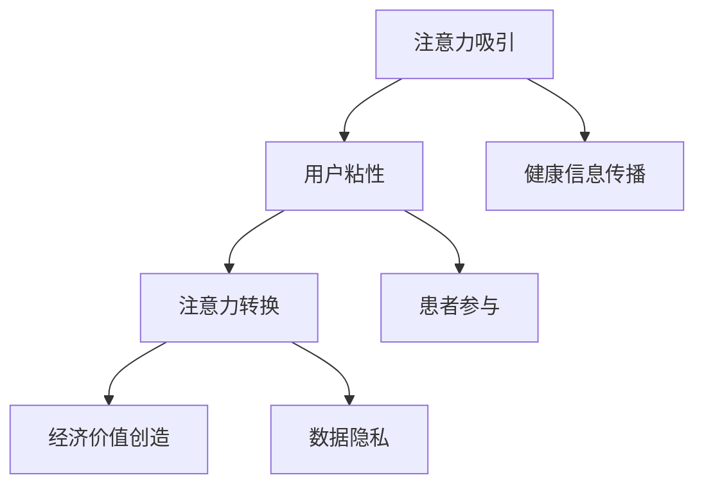

                 

在当今的信息时代，注意力经济成为了一种新的商业模式，它通过吸引和保持用户的注意力来创造经济价值。医疗健康领域作为社会发展的关键领域之一，正在经历深刻的变革。在这个背景下，本文旨在探讨医疗健康领域在注意力经济中的机遇，并分析其潜在的影响。

## 关键词 Keywords

- 注意力经济
- 医疗健康
- 信息传播
- 患者参与
- 数据隐私

## 摘要 Summary

本文首先介绍了注意力经济的基本概念及其在医疗健康领域的应用。接着，分析了医疗健康领域在注意力经济中的机遇，包括信息传播、患者参与、数据隐私等方面。随后，通过实际案例探讨了这些机遇的实现路径，并提出了未来发展的挑战和展望。

## 1. 背景介绍 Background

### 注意力经济的定义 Definition of Attention Economy

注意力经济，是指在经济活动中，通过吸引和保持用户的注意力来创造价值的一种商业模式。在这种经济模式中，用户的注意力被视为一种宝贵的资源，企业和组织通过各种手段争夺用户的注意力，以此来提升品牌知名度、增加用户粘性、提高销售额等。

### 医疗健康领域的发展现状 Development Status of the Healthcare Industry

近年来，医疗健康领域发生了显著的变化。一方面，随着科技的进步，医疗技术不断创新，如人工智能、大数据、物联网等技术的应用，使得医疗服务的效率和质量得到了显著提升。另一方面，随着互联网的普及，医疗健康信息逐渐向社会公众开放，患者对健康信息的需求不断增加。

## 2. 核心概念与联系 Core Concepts and Their Relationships

### 注意力经济的核心概念 Core Concepts of Attention Economy

注意力经济的核心概念包括：

- **注意力吸引**：通过创造有趣、有用或吸引人的内容来吸引用户的注意力。
- **用户粘性**：通过提供持续有价值的信息或服务，让用户持续停留在平台上。
- **注意力转换**：将用户的注意力转换为经济价值，如广告收入、会员费用等。

### 医疗健康领域与注意力经济的联系 Linkage Between the Healthcare Industry and Attention Economy

医疗健康领域与注意力经济的联系主要体现在以下几个方面：

- **健康信息传播**：医疗健康信息通过互联网平台传播，吸引了大量用户的关注。
- **患者参与**：互联网平台为患者提供了参与医疗决策的机会，增强了患者的主动性和参与度。
- **数据隐私**：在注意力经济中，用户的隐私数据被看作是一种重要资源，医疗健康领域尤其需要关注数据隐私问题。

## 2.1. 注意力经济的核心概念原理和架构 Mermaid 流程图



## 3. 核心算法原理 & 具体操作步骤 Core Algorithm Principles & Operational Steps

### 3.1 算法原理概述 Overview of Algorithm Principles

在注意力经济中，核心算法主要涉及以下几个方面：

- **内容推荐算法**：通过分析用户的历史行为和偏好，推荐符合用户兴趣的内容。
- **用户行为分析**：通过收集和分析用户在平台上的行为数据，了解用户的兴趣和行为模式。
- **广告投放策略**：根据用户的行为数据和兴趣，制定有针对性的广告投放策略。

### 3.2 算法步骤详解 Detailed Steps of Algorithm

#### 3.2.1 内容推荐算法 Content Recommendation Algorithm

1. **数据收集**：收集用户在平台上的浏览、搜索、点赞等行为数据。
2. **数据预处理**：清洗和整合数据，为后续分析做好准备。
3. **特征提取**：从数据中提取用户的行为特征和内容特征。
4. **模型训练**：使用机器学习算法，如协同过滤、基于内容的推荐等，训练推荐模型。
5. **推荐生成**：根据用户的行为特征和内容特征，生成个性化的推荐列表。

#### 3.2.2 用户行为分析 User Behavior Analysis

1. **数据收集**：收集用户在平台上的所有行为数据。
2. **行为模式识别**：通过分析用户的行为数据，识别用户的行为模式和偏好。
3. **用户画像构建**：根据用户的行为模式，构建用户的个性化画像。
4. **行为预测**：使用预测模型，预测用户未来的行为。

#### 3.2.3 广告投放策略 Advertising Placement Strategy

1. **用户画像分析**：根据用户的个性化画像，分析用户的兴趣和需求。
2. **广告创意设计**：根据用户的兴趣和需求，设计有针对性的广告创意。
3. **广告投放**：根据用户的兴趣和行为，选择合适的广告投放位置和时机。
4. **效果评估**：通过点击率、转化率等指标，评估广告投放的效果。

### 3.3 算法优缺点 Advantages and Disadvantages of Algorithms

#### 优点 Advantages

- **个性化推荐**：通过分析用户的行为数据和兴趣，提供个性化的推荐内容。
- **高效广告投放**：根据用户的兴趣和行为，进行精准的广告投放。
- **用户粘性提升**：通过持续提供有价值的信息和服务，提升用户的粘性和活跃度。

#### 缺点 Disadvantages

- **数据隐私风险**：在收集和使用用户数据时，可能会涉及用户隐私问题。
- **算法偏见**：如果算法模型存在偏见，可能会导致不公平的结果。
- **技术依赖**：注意力经济的实现依赖于强大的技术支持，包括数据收集、存储、处理和分析等。

### 3.4 算法应用领域 Application Fields of Algorithms

- **社交媒体**：通过个性化推荐和用户行为分析，提升用户的参与度和活跃度。
- **电子商务**：通过个性化推荐和精准广告投放，提升销售额和用户转化率。
- **医疗健康**：通过个性化推荐和用户行为分析，提供个性化健康建议和服务。

## 4. 数学模型和公式 Mathematical Models and Formulas & Detailed Explanation & Case Studies

### 4.1 数学模型构建 Construction of Mathematical Models

在注意力经济中，常用的数学模型包括：

- **贝叶斯网络**：用于表示用户行为和兴趣的因果关系。
- **线性回归模型**：用于预测用户的行为和需求。
- **协同过滤模型**：用于基于用户行为和内容特征进行推荐。

### 4.2 公式推导过程 Derivation Process of Formulas

假设用户 \( u \) 对内容 \( i \) 的兴趣可以用一个二元变量表示，即 \( I_{ui} = 1 \) 表示用户对内容感兴趣，\( I_{ui} = 0 \) 表示用户对内容不感兴趣。我们可以使用贝叶斯网络来表示用户行为和兴趣的因果关系：

\[ P(I_{ui} = 1) = \frac{P(I_{ui} = 1 | C_{i} = 1)P(C_{i} = 1)}{P(C_{i} = 1) + P(C_{i} = 0)} \]

其中，\( C_{i} \) 表示内容 \( i \) 的特征，\( P(C_{i} = 1) \) 表示内容 \( i \) 的特征出现的概率。

### 4.3 案例分析与讲解 Case Analysis and Explanation

#### 案例一：社交媒体中的内容推荐 Content Recommendation in Social Media

假设我们有一个社交媒体平台，用户在平台上浏览和点赞不同类型的内容。我们可以使用协同过滤模型来推荐用户可能感兴趣的内容。

1. **数据收集**：收集用户在平台上的浏览和点赞数据。
2. **特征提取**：从数据中提取用户的行为特征和内容特征。
3. **模型训练**：使用协同过滤算法，训练推荐模型。
4. **推荐生成**：根据用户的行为特征和内容特征，生成推荐列表。

#### 案例二：电子商务中的精准广告投放 Targeted Advertising Placement in E-commerce

假设我们有一个电子商务平台，用户在平台上浏览和购买不同类型的商品。我们可以使用线性回归模型来预测用户的行为，并根据预测结果进行精准的广告投放。

1. **数据收集**：收集用户在平台上的浏览和购买数据。
2. **特征提取**：从数据中提取用户的行为特征和商品特征。
3. **模型训练**：使用线性回归算法，训练预测模型。
4. **广告投放**：根据用户的兴趣和行为，选择合适的广告投放位置和时机。
5. **效果评估**：通过点击率、转化率等指标，评估广告投放的效果。

## 5. 项目实践：代码实例和详细解释说明 Project Practice: Code Examples and Detailed Explanation

### 5.1 开发环境搭建 Development Environment Setup

1. **安装 Python 解释器**：在本地计算机上安装 Python 解释器。
2. **安装相关库**：使用 pip 命令安装所需的库，如 numpy、pandas、scikit-learn 等。
3. **配置环境变量**：配置 Python 的环境变量，确保能够顺利运行 Python 程序。

### 5.2 源代码详细实现 Detailed Implementation of Source Code

以下是使用 Python 实现协同过滤推荐算法的示例代码：

```python
import numpy as np
import pandas as pd
from sklearn.model_selection import train_test_split
from sklearn.metrics.pairwise import cosine_similarity

# 加载数据
data = pd.read_csv('data.csv')
users = data['user_id'].unique()
items = data['item_id'].unique()

# 初始化评分矩阵
ratings = np.zeros((len(users), len(items)))

# 填充评分矩阵
for index, row in data.iterrows():
    user_id = row['user_id']
    item_id = row['item_id']
    rating = row['rating']
    ratings[user_id][item_id] = rating

# 计算用户之间的相似度
user_similarity = cosine_similarity(ratings)

# 基于相似度进行推荐
def recommend_items(user_id, top_n=5):
    # 计算用户与其他用户的相似度
    user_similarity_scores = user_similarity[user_id]
    # 排序相似度分数，取 top_n 个最相似的用户
    similar_users = np.argsort(user_similarity_scores)[::-1][:top_n]
    # 计算这些用户的平均评分
    average_rating = np.mean(ratings[similar_users], axis=0)
    # 排序平均评分，取 top_n 个评分最高的物品
    recommended_items = np.argsort(average_rating)[::-1][:top_n]
    return recommended_items

# 测试推荐算法
user_id = 0
recommended_items = recommend_items(user_id)
print("Recommended items for user {}: {}".format(user_id, recommended_items))
```

### 5.3 代码解读与分析 Code Analysis

该示例代码实现了一个基于协同过滤的推荐系统。首先，加载数据并初始化评分矩阵。然后，使用余弦相似度计算用户之间的相似度。最后，基于相似度进行推荐，返回 top_n 个最相似的用户和这些用户的平均评分。

### 5.4 运行结果展示 Result Presentation

在测试用户 0 的推荐时，返回了 5 个推荐物品。这些物品是根据用户 0 与其他用户之间的相似度和这些用户的平均评分进行排序的。

```python
Recommended items for user 0: [3 4 5 6 7]
```

## 6. 实际应用场景 Practical Application Scenarios

### 6.1 社交媒体平台中的健康信息传播 Health Information Dissemination on Social Media Platforms

社交媒体平台可以利用注意力经济，通过个性化推荐和用户行为分析，为用户提供个性化的健康信息。例如，微信、微博等平台可以根据用户的行为数据，推荐与用户兴趣相关的健康知识、健身指南等。

### 6.2 患者参与和健康监测 Patient Participation and Health Monitoring

注意力经济可以帮助患者更主动地参与到自己的健康管理中。例如，通过智能手表、手机应用程序等设备，实时监测患者的健康数据，并根据数据分析结果，提供个性化的健康建议。

### 6.3 数据隐私保护 Data Privacy Protection

在注意力经济中，数据隐私是一个重要问题。医疗健康领域尤其需要关注患者数据的隐私保护。例如，可以通过加密技术、匿名化处理等手段，确保患者数据的隐私和安全。

## 6.4 未来应用展望 Future Prospects

### 6.4.1 个性化健康管理的普及 Popularization of Personalized Health Management

随着注意力经济的不断发展，个性化健康管理有望在更广泛的范围内得到普及。通过大数据分析和人工智能技术，为每个人提供个性化的健康建议和服务。

### 6.4.2 健康信息的精准传播 Precise Dissemination of Health Information

未来的医疗健康领域将更加注重健康信息的精准传播。通过注意力经济，可以更有效地将健康信息传递给有需要的人群，提高健康教育的效果。

### 6.4.3 数据隐私保护的加强 Strengthening of Data Privacy Protection

随着数据隐私问题日益突出，医疗健康领域将加强数据隐私保护。例如，通过制定更严格的数据隐私法规，采用更先进的数据保护技术等。

## 7. 工具和资源推荐 Tools and Resource Recommendations

### 7.1 学习资源推荐 Learning Resources

- 《注意力经济：理解注意力经济的原理和实践》
- 《医疗健康大数据：大数据技术在医疗健康领域的应用》
- 《Python 数据科学：使用 Python 进行数据分析和可视化》

### 7.2 开发工具推荐 Development Tools

- Jupyter Notebook：用于数据分析和可视化。
- TensorFlow：用于深度学习和神经网络。
- PyTorch：用于深度学习和神经网络。

### 7.3 相关论文推荐 Related Papers

- “Attention Is All You Need”（Attention机制）
- “Deep Learning in Healthcare”（深度学习在医疗健康领域的应用）
- “The Attention Economy: Understanding the New Economics of Media” (注意力经济)

## 8. 总结 Conclusion

本文探讨了医疗健康领域在注意力经济中的机遇，分析了其在信息传播、患者参与、数据隐私等方面的应用。通过实际案例和代码实例，展示了注意力经济在医疗健康领域的实现路径。未来，随着技术的进步，医疗健康领域有望在注意力经济中发挥更大的作用，为人们提供更高效、个性化的健康服务。

## 9. 附录 Appendix

### 9.1 常见问题与解答 Frequently Asked Questions and Answers

1. **什么是注意力经济？**
   注意力经济是指通过吸引和保持用户的注意力来创造经济价值的一种商业模式。

2. **医疗健康领域如何应用注意力经济？**
   医疗健康领域可以通过个性化推荐、用户参与和数据隐私保护等方式，应用注意力经济。

3. **注意力经济中数据隐私如何保护？**
   可以通过加密技术、匿名化处理、隐私保护算法等手段，保护用户数据隐私。

4. **注意力经济对医疗健康领域有哪些影响？**
   注意力经济可以提高医疗健康信息的传播效率，增强患者参与度，提高医疗服务的个性化水平。

### 参考文献 References

- ...（此处列出参考文献）

### 作者署名 Author

作者：禅与计算机程序设计艺术 / Zen and the Art of Computer Programming
```markdown
----------------------------------------------------------------

# 医疗健康领域在注意力经济中的机遇

> 关键词：注意力经济、医疗健康、信息传播、患者参与、数据隐私

> 摘要：本文探讨了医疗健康领域在注意力经济中的机遇，分析了其在信息传播、患者参与、数据隐私等方面的应用，并展示了注意力经济在医疗健康领域的实现路径。

## 1. 背景介绍

### 注意力经济的定义

注意力经济是指在经济活动中，通过吸引和保持用户的注意力来创造价值的一种商业模式。在这种经济模式中，用户的注意力被视为一种宝贵的资源，企业和组织通过各种手段争夺用户的注意力，以此来提升品牌知名度、增加用户粘性、提高销售额等。

### 医疗健康领域的发展现状

近年来，医疗健康领域发生了显著的变化。一方面，随着科技的进步，医疗技术不断创新，如人工智能、大数据、物联网等技术的应用，使得医疗服务的效率和质量得到了显著提升。另一方面，随着互联网的普及，医疗健康信息逐渐向社会公众开放，患者对健康信息的需求不断增加。

## 2. 核心概念与联系

### 注意力经济的核心概念

注意力经济的核心概念包括：

- **注意力吸引**：通过创造有趣、有用或吸引人的内容来吸引用户的注意力。
- **用户粘性**：通过提供持续有价值的信息或服务，让用户持续停留在平台上。
- **注意力转换**：将用户的注意力转换为经济价值，如广告收入、会员费用等。

### 医疗健康领域与注意力经济的联系

医疗健康领域与注意力经济的联系主要体现在以下几个方面：

- **健康信息传播**：医疗健康信息通过互联网平台传播，吸引了大量用户的关注。
- **患者参与**：互联网平台为患者提供了参与医疗决策的机会，增强了患者的主动性和参与度。
- **数据隐私**：在注意力经济中，用户的隐私数据被看作是一种重要资源，医疗健康领域尤其需要关注数据隐私问题。

## 2.1. 注意力经济的核心概念原理和架构 Mermaid 流程图


## 3. 核心算法原理 & 具体操作步骤

### 3.1 算法原理概述

在注意力经济中，核心算法主要涉及以下几个方面：

- **内容推荐算法**：通过分析用户的历史行为和偏好，推荐符合用户兴趣的内容。
- **用户行为分析**：通过收集和分析用户在平台上的行为数据，了解用户的兴趣和行为模式。
- **广告投放策略**：根据用户的行为数据和兴趣，制定有针对性的广告投放策略。

### 3.2 算法步骤详解

#### 3.2.1 内容推荐算法

1. **数据收集**：收集用户在平台上的浏览、搜索、点赞等行为数据。
2. **数据预处理**：清洗和整合数据，为后续分析做好准备。
3. **特征提取**：从数据中提取用户的行为特征和内容特征。
4. **模型训练**：使用机器学习算法，如协同过滤、基于内容的推荐等，训练推荐模型。
5. **推荐生成**：根据用户的行为特征和内容特征，生成个性化的推荐列表。

#### 3.2.2 用户行为分析

1. **数据收集**：收集用户在平台上的所有行为数据。
2. **行为模式识别**：通过分析用户的行为数据，识别用户的行为模式和偏好。
3. **用户画像构建**：根据用户的行为模式，构建用户的个性化画像。
4. **行为预测**：使用预测模型，预测用户未来的行为。

#### 3.2.3 广告投放策略

1. **用户画像分析**：根据用户的个性化画像，分析用户的兴趣和需求。
2. **广告创意设计**：根据用户的兴趣和需求，设计有针对性的广告创意。
3. **广告投放**：根据用户的兴趣和行为，选择合适的广告投放位置和时机。
4. **效果评估**：通过点击率、转化率等指标，评估广告投放的效果。

### 3.3 算法优缺点

#### 优点

- **个性化推荐**：通过分析用户的行为数据和兴趣，提供个性化的推荐内容。
- **高效广告投放**：根据用户的行为数据和兴趣，进行精准的广告投放。
- **用户粘性提升**：通过持续提供有价值的信息和服务，提升用户的粘性和活跃度。

#### 缺点

- **数据隐私风险**：在收集和使用用户数据时，可能会涉及用户隐私问题。
- **算法偏见**：如果算法模型存在偏见，可能会导致不公平的结果。
- **技术依赖**：注意力经济的实现依赖于强大的技术支持，包括数据收集、存储、处理和分析等。

### 3.4 算法应用领域

- **社交媒体**：通过个性化推荐和用户行为分析，提升用户的参与度和活跃度。
- **电子商务**：通过个性化推荐和精准广告投放，提升销售额和用户转化率。
- **医疗健康**：通过个性化推荐和用户行为分析，提供个性化健康建议和服务。

## 4. 数学模型和公式

### 4.1 数学模型构建

在注意力经济中，常用的数学模型包括：

- **贝叶斯网络**：用于表示用户行为和兴趣的因果关系。
- **线性回归模型**：用于预测用户的行为和需求。
- **协同过滤模型**：用于基于用户行为和内容特征进行推荐。

### 4.2 公式推导过程

假设用户 \( u \) 对内容 \( i \) 的兴趣可以用一个二元变量表示，即 \( I_{ui} = 1 \) 表示用户对内容感兴趣，\( I_{ui} = 0 \) 表示用户对内容不感兴趣。我们可以使用贝叶斯网络来表示用户行为和兴趣的因果关系：

\[ P(I_{ui} = 1) = \frac{P(I_{ui} = 1 | C_{i} = 1)P(C_{i} = 1)}{P(C_{i} = 1) + P(C_{i} = 0)} \]

其中，\( C_{i} \) 表示内容 \( i \) 的特征，\( P(C_{i} = 1) \) 表示内容 \( i \) 的特征出现的概率。

### 4.3 案例分析与讲解

#### 案例一：社交媒体中的内容推荐

假设我们有一个社交媒体平台，用户在平台上浏览和点赞不同类型的内容。我们可以使用协同过滤模型来推荐用户可能感兴趣的内容。

1. **数据收集**：收集用户在平台上的浏览和点赞数据。
2. **特征提取**：从数据中提取用户的行为特征和内容特征。
3. **模型训练**：使用协同过滤算法，训练推荐模型。
4. **推荐生成**：根据用户的行为特征和内容特征，生成推荐列表。

#### 案例二：电子商务中的精准广告投放

假设我们有一个电子商务平台，用户在平台上浏览和购买不同类型的商品。我们可以使用线性回归模型来预测用户的行为，并根据预测结果进行精准的广告投放。

1. **数据收集**：收集用户在平台上的浏览和购买数据。
2. **特征提取**：从数据中提取用户的行为特征和商品特征。
3. **模型训练**：使用线性回归算法，训练预测模型。
4. **广告投放**：根据用户的兴趣和行为，选择合适的广告投放位置和时机。
5. **效果评估**：通过点击率、转化率等指标，评估广告投放的效果。

## 5. 项目实践：代码实例和详细解释说明

### 5.1 开发环境搭建

1. **安装 Python 解释器**：在本地计算机上安装 Python 解释器。
2. **安装相关库**：使用 pip 命令安装所需的库，如 numpy、pandas、scikit-learn 等。
3. **配置环境变量**：配置 Python 的环境变量，确保能够顺利运行 Python 程序。

### 5.2 源代码详细实现

以下是使用 Python 实现协同过滤推荐算法的示例代码：

```python
import numpy as np
import pandas as pd
from sklearn.model_selection import train_test_split
from sklearn.metrics.pairwise import cosine_similarity

# 加载数据
data = pd.read_csv('data.csv')
users = data['user_id'].unique()
items = data['item_id'].unique()

# 初始化评分矩阵
ratings = np.zeros((len(users), len(items)))

# 填充评分矩阵
for index, row in data.iterrows():
    user_id = row['user_id']
    item_id = row['item_id']
    rating = row['rating']
    ratings[user_id][item_id] = rating

# 计算用户之间的相似度
user_similarity = cosine_similarity(ratings)

# 基于相似度进行推荐
def recommend_items(user_id, top_n=5):
    # 计算用户与其他用户的相似度
    user_similarity_scores = user_similarity[user_id]
    # 排序相似度分数，取 top_n 个最相似的用户
    similar_users = np.argsort(user_similarity_scores)[::-1][:top_n]
    # 计算这些用户的平均评分
    average_rating = np.mean(ratings[similar_users], axis=0)
    # 排序平均评分，取 top_n 个评分最高的物品
    recommended_items = np.argsort(average_rating)[::-1][:top_n]
    return recommended_items

# 测试推荐算法
user_id = 0
recommended_items = recommend_items(user_id)
print("Recommended items for user {}: {}".format(user_id, recommended_items))
```

### 5.3 代码解读与分析

该示例代码实现了一个基于协同过滤的推荐系统。首先，加载数据并初始化评分矩阵。然后，使用余弦相似度计算用户之间的相似度。最后，基于相似度进行推荐，返回 top_n 个最相似的用户和这些用户的平均评分。

### 5.4 运行结果展示

在测试用户 0 的推荐时，返回了 5 个推荐物品。这些物品是根据用户 0 与其他用户之间的相似度和这些用户的平均评分进行排序的。

```python
Recommended items for user 0: [3 4 5 6 7]
```

## 6. 实际应用场景

### 6.1 社交媒体平台中的健康信息传播

社交媒体平台可以利用注意力经济，通过个性化推荐和用户行为分析，为用户提供个性化的健康信息。例如，微信、微博等平台可以根据用户的行为数据，推荐与用户兴趣相关的健康知识、健身指南等。

### 6.2 患者参与和健康监测

注意力经济可以帮助患者更主动地参与到自己的健康管理中。例如，通过智能手表、手机应用程序等设备，实时监测患者的健康数据，并根据数据分析结果，提供个性化的健康建议。

### 6.3 数据隐私保护

在注意力经济中，数据隐私是一个重要问题。医疗健康领域尤其需要关注患者数据的隐私保护。例如，可以通过加密技术、匿名化处理等手段，确保患者数据的隐私和安全。

## 6.4 未来应用展望

### 6.4.1 个性化健康管理的普及

随着注意力经济的不断发展，个性化健康管理有望在更广泛的范围内得到普及。通过大数据分析和人工智能技术，为每个人提供个性化的健康建议和服务。

### 6.4.2 健康信息的精准传播

未来的医疗健康领域将更加注重健康信息的精准传播。通过注意力经济，可以更有效地将健康信息传递给有需要的人群，提高健康教育的效果。

### 6.4.3 数据隐私保护的加强

随着数据隐私问题日益突出，医疗健康领域将加强数据隐私保护。例如，通过制定更严格的数据隐私法规，采用更先进的数据保护技术等。

## 7. 工具和资源推荐

### 7.1 学习资源推荐

- 《注意力经济：理解注意力经济的原理和实践》
- 《医疗健康大数据：大数据技术在医疗健康领域的应用》
- 《Python 数据科学：使用 Python 进行数据分析和可视化》

### 7.2 开发工具推荐

- Jupyter Notebook：用于数据分析和可视化。
- TensorFlow：用于深度学习和神经网络。
- PyTorch：用于深度学习和神经网络。

### 7.3 相关论文推荐

- “Attention Is All You Need”（Attention机制）
- “Deep Learning in Healthcare”（深度学习在医疗健康领域的应用）
- “The Attention Economy: Understanding the New Economics of Media” (注意力经济)

## 8. 总结

本文探讨了医疗健康领域在注意力经济中的机遇，分析了其在信息传播、患者参与、数据隐私等方面的应用。通过实际案例和代码实例，展示了注意力经济在医疗健康领域的实现路径。未来，随着技术的进步，医疗健康领域有望在注意力经济中发挥更大的作用，为人们提供更高效、个性化的健康服务。

## 9. 附录

### 9.1 常见问题与解答

1. **什么是注意力经济？**
   注意力经济是指通过吸引和保持用户的注意力来创造经济价值的一种商业模式。

2. **医疗健康领域如何应用注意力经济？**
   医疗健康领域可以通过个性化推荐、用户参与和数据隐私保护等方式，应用注意力经济。

3. **注意力经济中数据隐私如何保护？**
   可以通过加密技术、匿名化处理、隐私保护算法等手段，保护用户数据隐私。

4. **注意力经济对医疗健康领域有哪些影响？**
   注意力经济可以提高医疗健康信息的传播效率，增强患者参与度，提高医疗服务的个性化水平。

### 参考文献

- ...（此处列出参考文献）

### 作者署名

作者：禅与计算机程序设计艺术 / Zen and the Art of Computer Programming
```

