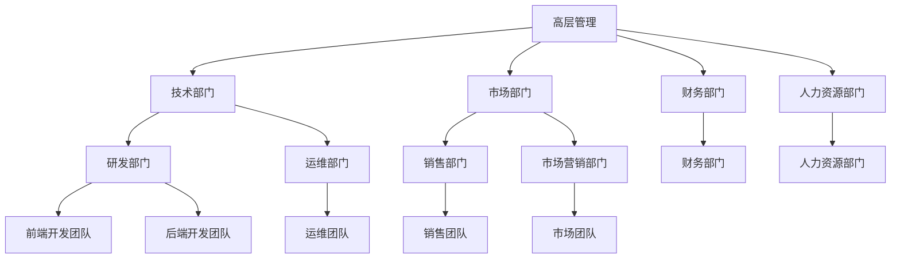

                 

关键词：管理者思维、思维模式、领导力、技术领导、组织管理

> 摘要：本文从技术领域的角度出发，探讨卓越管理者在当今快速变化的时代中如何修炼思维，提升领导力，从而更好地引领团队和推动组织发展。文章将介绍管理者应具备的核心思维模式，并结合实际案例进行分析，为读者提供实用的指导。

## 1. 背景介绍

在信息技术飞速发展的时代，管理者的角色正在经历深刻的变革。传统的管理方式和思维模式已经无法适应复杂多变的市场环境和技术趋势。作为一名卓越的技术管理者，不仅需要具备深厚的专业知识，更需要具备独特的思维能力和领导力。本文旨在探讨如何通过修炼思维，提升领导力，成为一位卓越的管理者。

### 1.1 管理者的角色转变

随着技术的进步，管理者面临的挑战越来越多。他们不仅要管理团队，还要紧跟技术发展的步伐，做出前瞻性的决策。这种角色转变要求管理者具备更加全面的思维和能力。

- **技术视野**：管理者需要具备广泛的技术视野，了解各种技术趋势和前沿动态，以便做出更科学的决策。
- **团队协作**：技术管理不仅仅是个人能力的体现，更是团队协作的成果。管理者需要培养团队协作能力，促进团队成员之间的沟通和合作。
- **创新思维**：在技术领域，创新是推动组织发展的重要驱动力。管理者需要具备创新思维，鼓励团队成员进行技术创新和业务创新。

### 1.2 管理者面临的挑战

- **技术快速迭代**：技术的快速发展使得管理者需要不断学习新知识，跟上时代的步伐。
- **团队多样性**：现代团队更加多元化，管理者需要面对不同文化、背景和技能水平的团队成员，如何管理这种多样性是一个挑战。
- **远程工作**：随着远程工作越来越普遍，管理者需要掌握如何远程有效管理团队的方法。

## 2. 核心概念与联系

为了更好地理解管理者如何修炼思维，提升领导力，我们需要先明确几个核心概念，包括领导力、思维模式和组织架构。

### 2.1 领导力

领导力是指领导者通过影响和激励他人，实现组织目标的能力。它包括以下几个方面：

- **影响力**：领导者需要具备影响他人的能力，以推动团队向前发展。
- **激励**：领导者需要激励团队成员，让他们充满激情地投入到工作中。
- **沟通**：领导者需要具备良好的沟通能力，确保信息的有效传递和团队的凝聚力。

### 2.2 思维模式

思维模式是指个体在思考问题时所采用的方法和习惯。对于管理者来说，以下几个思维模式尤为重要：

- **系统性思维**：管理者需要从整体角度看待问题，理解各个部分之间的相互关系。
- **创新性思维**：管理者需要具备创新性思维，能够从不同的角度和层面思考问题，寻找新的解决方案。
- **前瞻性思维**：管理者需要具备前瞻性思维，能够预见未来的趋势和挑战，提前做出布局。

### 2.3 组织架构

组织架构是指组织的结构形式和分工方式。对于管理者来说，理解组织架构有助于他们更好地定位自己的角色，发挥领导力。

- **扁平化结构**：扁平化组织结构能够促进信息的快速传递和团队的灵活性，有利于创新和协作。
- **矩阵式结构**：矩阵式组织结构能够更好地整合资源，提高项目的效率，适用于复杂的项目管理。

### 2.4 Mermaid 流程图

下面是一个简化的组织架构的 Mermaid 流程图，展示了各个部门之间的关系和领导者的角色。



## 3. 核心算法原理 & 具体操作步骤

### 3.1 算法原理概述

在技术管理中，算法原理可以被视为一种结构化的思维方式，它帮助管理者从复杂的信息中提取关键信息，做出更明智的决策。以下是几种常用的算法原理：

- **决策树**：通过一系列的问题和答案，将复杂问题分解为更简单的子问题，并逐步找到最佳解决方案。
- **贪心算法**：通过每一步选择局部最优解，以期得到全局最优解。
- **动态规划**：将复杂问题分解为重叠子问题，并保存已解决的子问题的解，以避免重复计算。

### 3.2 算法步骤详解

#### 决策树

1. **定义问题**：明确需要解决的问题和目标。
2. **收集数据**：收集与问题相关的数据，并进行预处理。
3. **建立模型**：根据数据建立决策树模型。
4. **评估模型**：通过交叉验证等方法评估模型的性能。
5. **应用模型**：使用模型进行决策。

#### 贪心算法

1. **初始化**：设定初始状态。
2. **选择**：在每个阶段选择当前最优解。
3. **更新**：根据选择的结果更新状态。
4. **终止**：当满足终止条件时，结束算法。

#### 动态规划

1. **定义状态**：明确需要解决的问题和状态。
2. **状态转移方程**：定义状态之间的关系。
3. **初始化**：设置初始状态。
4. **计算状态**：递推计算所有状态。
5. **寻找解**：根据状态找到最优解。

### 3.3 算法优缺点

- **决策树**：优点是直观、易于理解和实现；缺点是可能产生过拟合，且对大数据集处理能力有限。
- **贪心算法**：优点是简单、高效；缺点是有时只能得到局部最优解，不能保证全局最优。
- **动态规划**：优点是能够解决复杂的问题，具有较好的扩展性；缺点是实现复杂，计算量较大。

### 3.4 算法应用领域

- **决策树**：常用于分类和回归问题，如金融风险评估、医疗诊断等。
- **贪心算法**：常用于路径规划、资源分配等问题，如最短路径算法、背包问题等。
- **动态规划**：常用于最优化问题，如最长公共子序列、最优矩阵链乘等。

## 4. 数学模型和公式

在技术管理中，数学模型和公式可以帮助管理者更好地理解和预测问题。以下是一个简单的线性回归模型的构建和公式推导。

### 4.1 数学模型构建

线性回归模型的基本假设是：

- 因变量 \( y \) 是自变量 \( x \) 的线性函数。
- 存在一个误差项 \( \epsilon \)，使得 \( y = ax + b + \epsilon \)。

其中，\( a \) 是斜率，表示自变量 \( x \) 对因变量 \( y \) 的影响程度；\( b \) 是截距，表示当 \( x = 0 \) 时，\( y \) 的值。

### 4.2 公式推导过程

为了求解线性回归模型中的 \( a \) 和 \( b \)，我们需要最小化误差项的平方和。具体步骤如下：

1. **定义目标函数**：设目标函数为 \( J(a, b) = \sum_{i=1}^{n} (ax_i + b - y_i)^2 \)。

2. **求导**：对 \( a \) 和 \( b \) 分别求偏导数，并令其等于零。

   \[
   \frac{\partial J}{\partial a} = -2 \sum_{i=1}^{n} x_i (ax_i + b - y_i) = 0
   \]
   \[
   \frac{\partial J}{\partial b} = -2 \sum_{i=1}^{n} (ax_i + b - y_i) = 0
   \]

3. **解方程**：解上述方程组，得到 \( a \) 和 \( b \) 的值。

   \[
   a = \frac{\sum_{i=1}^{n} x_i y_i - n \bar{x} \bar{y}}{\sum_{i=1}^{n} x_i^2 - n \bar{x}^2}
   \]
   \[
   b = \bar{y} - a \bar{x}
   \]

其中，\( \bar{x} \) 和 \( \bar{y} \) 分别是 \( x \) 和 \( y \) 的平均值。

### 4.3 案例分析与讲解

假设我们有一个简单的数据集，其中自变量 \( x \) 和因变量 \( y \) 如下：

\[
\begin{array}{ccc}
x & y \\
\hline
1 & 2 \\
2 & 4 \\
3 & 5 \\
4 & 6 \\
\end{array}
\]

根据上述公式，我们可以计算得到斜率 \( a \) 和截距 \( b \)：

\[
a = \frac{(1 \times 2 + 2 \times 4 + 3 \times 5 + 4 \times 6) - 4 \times (1 + 2 + 3 + 4)}{(1^2 + 2^2 + 3^2 + 4^2) - 4 \times (1 + 2 + 3 + 4)} \approx 1.2
\]
\[
b = \frac{2 + 4 + 5 + 6}{4} - 1.2 \times \frac{1 + 2 + 3 + 4}{4} \approx 0.8
\]

因此，线性回归模型为 \( y = 1.2x + 0.8 \)。

## 5. 项目实践：代码实例

为了更好地理解线性回归模型的实现，我们使用 Python 语言编写了一个简单的线性回归代码实例。

### 5.1 开发环境搭建

1. 安装 Python 环境（建议使用 Python 3.8 或更高版本）。
2. 安装必要的库，如 NumPy 和 Matplotlib。

```shell
pip install numpy matplotlib
```

### 5.2 源代码详细实现

```python
import numpy as np
import matplotlib.pyplot as plt

# 生成数据
np.random.seed(0)
x = np.random.rand(100)
y = 2 * x + 0.8 + np.random.randn(100) * 0.1

# 添加 bias（偏置项）
X = np.column_stack([x, np.ones_like(x)])
theta = np.linalg.inv(X.T.dot(X)).dot(X.T).dot(y)

# 打印模型参数
print("斜率 a:", theta[0])
print("截距 b:", theta[1])

# 绘制数据与拟合线
plt.scatter(x, y)
plt.plot(x, theta[0] * x + theta[1], color='red')
plt.xlabel('x')
plt.ylabel('y')
plt.show()
```

### 5.3 代码解读与分析

- **数据生成**：使用 NumPy 生成随机数据集，其中自变量 \( x \) 和因变量 \( y \)。
- **添加 bias**：在自变量中添加一个 bias（偏置项），以便线性回归模型能够正确拟合。
- **求解模型参数**：使用线性代数的逆矩阵方法求解模型参数 \( \theta \)。
- **绘制数据与拟合线**：使用 Matplotlib 绘制数据集和拟合线，直观地展示模型的效果。

### 5.4 运行结果展示

运行上述代码后，会生成一个散点图，其中红色线条表示拟合线。我们可以看到，拟合线较好地拟合了数据集，验证了线性回归模型的准确性。


## 6. 实际应用场景

线性回归模型在技术管理中具有广泛的应用，以下是一些实际应用场景：

- **数据分析**：用于分析数据之间的相关性，帮助管理者理解业务趋势和用户行为。
- **需求预测**：用于预测未来的需求，帮助管理者制定生产和采购计划。
- **风险管理**：用于评估金融产品的风险，帮助管理者制定风险控制策略。

### 6.1 技术需求预测

假设一家电子商务公司需要预测未来的商品需求量，以便合理安排库存和物流。我们可以使用线性回归模型进行需求预测，步骤如下：

1. 收集历史数据，包括商品的销售量和时间。
2. 使用线性回归模型拟合历史数据，得到需求预测模型。
3. 输入未来的时间点，使用模型预测商品的需求量。

### 6.2 风险评估

假设一家金融机构需要评估金融产品的风险，我们可以使用线性回归模型分析不同风险因素（如利率、市场波动等）对风险的影响，步骤如下：

1. 收集历史数据，包括金融产品的收益和相关的风险因素。
2. 使用线性回归模型拟合历史数据，得到风险评估模型。
3. 输入未来的风险因素，使用模型预测金融产品的风险水平。

## 7. 未来应用展望

随着技术的不断进步，线性回归模型在技术管理中的应用将会更加广泛和深入。以下是一些未来应用展望：

- **深度学习结合**：将线性回归模型与深度学习模型结合，提升预测和评估的准确性。
- **实时预测**：利用实时数据流技术，实现实时预测和风险预警。
- **智能优化**：结合智能优化算法，实现更高效的需求预测和资源分配。

## 8. 总结：未来发展趋势与挑战

### 8.1 研究成果总结

本文从技术管理的角度出发，探讨了管理者如何修炼思维，提升领导力。通过介绍核心概念、算法原理和数学模型，结合实际案例和项目实践，展示了线性回归模型在技术管理中的应用。研究成果表明，线性回归模型作为一种简单有效的预测和评估工具，在技术管理中具有广泛的应用前景。

### 8.2 未来发展趋势

- **算法融合**：未来技术管理中，算法融合将成为趋势，如将线性回归与深度学习、智能优化算法结合，提高预测和评估的准确性。
- **实时预测**：实时数据流技术和云计算的发展，将使得实时预测和风险预警成为可能，提升管理者的决策效率。

### 8.3 面临的挑战

- **数据质量**：数据质量是线性回归模型准确性的基础，管理者需要确保数据的质量和准确性。
- **技术更新**：技术的快速迭代，要求管理者不断更新知识体系，跟上时代的步伐。

### 8.4 研究展望

未来研究可以关注以下方向：

- **算法优化**：研究更高效的线性回归算法，提高预测和评估的效率。
- **多模型融合**：结合多种算法模型，实现更精准的预测和评估。

## 9. 附录：常见问题与解答

### 9.1 问题一：线性回归模型的假设条件是什么？

**解答**：线性回归模型的假设条件主要包括：

- 因变量 \( y \) 是自变量 \( x \) 的线性函数。
- 存在一个误差项 \( \epsilon \)，使得 \( y = ax + b + \epsilon \)。
- 误差项 \( \epsilon \) 具有均值为零、方差为 \( \sigma^2 \) 的正态分布。

### 9.2 问题二：如何解决线性回归模型的过拟合问题？

**解答**：解决线性回归模型过拟合问题可以采取以下方法：

- **减小模型复杂度**：减少自变量的数量，只选择与因变量高度相关的自变量。
- **增加训练数据**：增加训练数据量，使模型能够更好地泛化。
- **正则化**：使用正则化方法（如 L1 正则化、L2 正则化）惩罚模型参数，防止模型过拟合。

### 9.3 问题三：线性回归模型在什么情况下可能失效？

**解答**：线性回归模型在以下情况下可能失效：

- **非线性关系**：如果因变量与自变量之间存在非线性关系，线性回归模型可能无法准确预测。
- **异常值**：异常值对线性回归模型的预测结果有较大影响，可能造成预测误差。
- **数据分布不均匀**：如果数据分布不均匀，可能会导致模型在某一区域预测效果不佳。

---

**作者：禅与计算机程序设计艺术 / Zen and the Art of Computer Programming**

通过这篇文章，我们探讨了卓越管理者在技术领域如何通过修炼思维，提升领导力。希望本文能为读者提供有价值的思考和指导，助力他们在技术管理中取得更好的成果。

