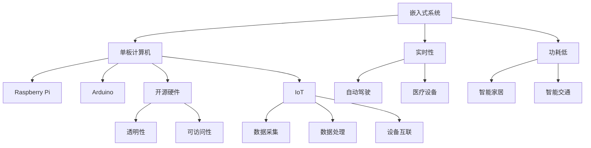

                 

关键词：单板计算机、Raspberry Pi、Arduino、嵌入式系统、开源硬件、电子工程、物联网

摘要：本文将深入探讨单板计算机领域的两颗明星——Raspberry Pi和Arduino。通过对两者的背景介绍、核心概念、算法原理、数学模型、项目实践、应用场景以及工具和资源推荐等方面进行详细分析，旨在为读者提供一个全面的技术指南，帮助其在嵌入式系统领域取得成功。

## 1. 背景介绍

单板计算机，也被称为“单板微型计算机”，是一种小型化的计算机系统，具备独立运行操作系统的能力。它通常包含处理器、内存、存储设备和I/O接口，适用于各种嵌入式应用场景。随着物联网和智能家居等领域的快速发展，单板计算机逐渐成为硬件开发者和技术爱好者的首选平台。

Raspberry Pi和Arduino是当今市场上最为流行的两种单板计算机。Raspberry Pi由英国慈善基金会Raspberry Pi Foundation于2012年推出，其目标是将计算机教育带入每个人的生活中。Arduino则是基于开放源代码硬件和软件平台的嵌入式控制板，由Massimo Banzi、David Cuartielles等人在2005年创立。

## 2. 核心概念与联系

在深入探讨Raspberry Pi和Arduino之前，我们需要了解一些核心概念和它们之间的联系。

### 2.1 嵌入式系统

嵌入式系统是指一种以应用为中心，软硬件可裁剪，适用于特定场合的专用计算机系统。它通常具有以下特点：

- **体积小**：嵌入式系统需要适应各种狭小空间。
- **功耗低**：为了延长电池寿命，嵌入式系统通常具有低功耗设计。
- **实时性**：许多嵌入式系统需要满足实时性要求，例如自动驾驶、医疗设备等。

### 2.2 开源硬件

开源硬件（Open-source Hardware，OSH）是指硬件的设计和源代码可以被自由地分享、修改和复制的硬件设备。这种模式与开源软件类似，但涉及到物理实体。开源硬件的核心理念是透明性和可访问性，使得更多人能够参与到硬件设计和创新过程中。

### 2.3 物联网（IoT）

物联网是指通过互联网将各种物理设备互联，实现数据采集、传输和处理的网络体系。物联网应用广泛，包括智能家居、智能交通、智能医疗等。单板计算机在物联网领域发挥着重要作用，充当数据采集和处理的核心节点。

### 2.4 Mermaid 流程图

为了更好地理解嵌入式系统、开源硬件和物联网之间的关系，我们可以使用Mermaid流程图来展示它们的核心概念和联系。



## 3. 核心算法原理 & 具体操作步骤

### 3.1 算法原理概述

在嵌入式系统领域，算法原理至关重要。Raspberry Pi和Arduino在算法设计方面各有特点。

#### 3.1.1 Raspberry Pi

Raspberry Pi搭载的是Linux操作系统，这意味着其算法设计可以借鉴Linux内核的成熟框架。Raspberry Pi的算法原理主要包括：

- **进程调度**：Raspberry Pi采用时间片轮转调度算法，确保多个进程公平运行。
- **内存管理**：Linux内核的内存管理机制使Raspberry Pi能够高效地分配和回收内存资源。
- **文件系统**：Raspberry Pi使用ext4文件系统，支持大文件存储和快速读写操作。

#### 3.1.2 Arduino

Arduino采用基于Arduino IDE的编程环境，其算法原理主要包括：

- **中断机制**：Arduino利用中断机制实现实时响应，提高系统响应速度。
- **定时器**：Arduino通过定时器实现周期性任务调度，保证系统稳定运行。
- **模拟信号处理**：Arduino支持模拟信号处理，能够方便地实现传感器数据采集和信号处理。

### 3.2 算法步骤详解

#### 3.2.1 Raspberry Pi

以下是Raspberry Pi的核心算法步骤：

1. **系统初始化**：加载Linux内核，配置硬件设备。
2. **进程调度**：根据进程优先级和时间片轮转算法，调度进程执行。
3. **内存管理**：分配和回收内存资源，保证系统稳定运行。
4. **文件系统操作**：实现文件读写、删除、创建等基本操作。
5. **网络通信**：通过以太网或Wi-Fi连接网络，实现数据传输。

#### 3.2.2 Arduino

以下是Arduino的核心算法步骤：

1. **中断初始化**：配置中断引脚和中断服务函数。
2. **定时器初始化**：设置定时器周期和中断服务函数。
3. **模拟信号处理**：读取传感器数据，进行信号处理。
4. **数字信号处理**：根据处理结果，控制执行相应的操作。
5. **输出控制**：通过GPIO引脚输出信号，控制外部设备。

### 3.3 算法优缺点

#### 3.3.1 Raspberry Pi

**优点**：

- **操作系统强大**：Linux内核提供了丰富的功能和强大的开发环境。
- **硬件资源丰富**：Raspberry Pi支持多种扩展接口，如USB、以太网、Wi-Fi等。
- **开源社区支持**：Raspberry Pi拥有庞大的开源社区，提供了大量资源。

**缺点**：

- **功耗较高**：相比于Arduino，Raspberry Pi的功耗较高，可能不适合电池供电场景。
- **开发难度较大**：Linux系统较为复杂，开发难度较大。

#### 3.3.2 Arduino

**优点**：

- **功耗低**：Arduino的功耗较低，适合电池供电场景。
- **开发简单**：Arduino采用基于Arduino IDE的简单编程环境，开发过程较为直观。
- **实时响应**：利用中断机制，Arduino能够实现实时响应。

**缺点**：

- **硬件资源有限**：Arduino硬件资源较为有限，不支持复杂的扩展接口。
- **操作系统简单**：Arduino操作系统较为简单，功能有限。

### 3.4 算法应用领域

#### 3.4.1 Raspberry Pi

- **智能家居**：通过Wi-Fi连接智能家居设备，实现远程控制。
- **机器人控制**：利用Raspberry Pi实现机器人控制、路径规划和导航。
- **网络监控**：通过Raspberry Pi监控网络流量、防火墙等。
- **物联网平台**：构建物联网平台，连接各种传感器和设备。

#### 3.4.2 Arduino

- **传感器数据采集**：读取各种传感器数据，如温度、湿度、光线等。
- **工业自动化**：通过Arduino实现工业自动化控制，如流水线监控。
- **智能农业**：利用Arduino监控农田环境，实现精准农业。
- **电子玩具**：通过Arduino制作各种电子玩具，如机器人、无人机等。

## 4. 数学模型和公式 & 详细讲解 & 举例说明

在嵌入式系统设计中，数学模型和公式至关重要。下面我们将详细介绍一些常见的数学模型和公式，并给出具体的应用案例。

### 4.1 数学模型构建

数学模型是嵌入式系统设计的基础，它描述了系统的输入、输出和内部状态。以下是几个常见的数学模型：

#### 4.1.1 传感器模型

传感器模型描述了传感器输入信号与实际物理量之间的关系。一个简单的传感器模型可以表示为：

\[ y = f(x) + \epsilon \]

其中，\( y \) 是传感器输出，\( x \) 是实际物理量，\( f(x) \) 是传感器输出与实际物理量之间的非线性关系，\( \epsilon \) 是噪声。

#### 4.1.2 控制模型

控制模型描述了系统输入、输出和内部状态之间的关系。一个简单的控制模型可以表示为：

\[ \dot{x} = Ax + Bu \]

\[ y = Cx + Du \]

其中，\( \dot{x} \) 是状态变量，\( A \)、\( B \) 和 \( C \) 是系统矩阵，\( u \) 是输入，\( y \) 是输出。

### 4.2 公式推导过程

在构建数学模型后，我们需要推导出相关的公式，以便在实际应用中进行计算。下面我们以传感器模型为例，介绍公式的推导过程。

#### 4.2.1 传感器模型公式推导

假设传感器输入信号为 \( x \)，实际物理量为 \( y \)，传感器输出为 \( z \)。我们可以使用最小二乘法推导出传感器模型公式。

首先，我们建立传感器模型的误差函数：

\[ J = \frac{1}{2} \sum_{i=1}^{n} (y_i - z_i)^2 \]

其中，\( n \) 是传感器输入样本数量。

为了使误差函数最小，我们对 \( z \) 求导并令其等于0：

\[ \frac{\partial J}{\partial z} = 0 \]

通过计算，我们得到：

\[ z = \bar{y} + \frac{\bar{x} \bar{y} - \bar{x^2}}{\bar{y}^2 - \bar{y^2}} \]

其中，\( \bar{x} \) 和 \( \bar{y} \) 分别是传感器输入和输出的平均值。

#### 4.2.2 控制模型公式推导

控制模型公式可以通过线性代数的知识进行推导。假设系统状态矩阵 \( A \)、输入矩阵 \( B \) 和输出矩阵 \( C \) 已知，我们需要推导出系统状态方程和输出方程。

首先，我们对状态方程 \( \dot{x} = Ax + Bu \) 求解，得到：

\[ x(t) = e^{At}x(0) + \int_0^t e^{A(t-\tau)}Bu(\tau)d\tau \]

然后，我们对输出方程 \( y = Cx + Du \) 求解，得到：

\[ y(t) = Ce^{At}x(0) + C\int_0^t e^{A(t-\tau)}Bu(\tau)d\tau + Du \]

### 4.3 案例分析与讲解

下面我们通过一个实际案例，展示如何应用数学模型和公式进行嵌入式系统设计。

#### 4.3.1 案例背景

假设我们设计一个智能家居温度控制系统，目标是实现自动调节室内温度。系统包括一个温度传感器和一个加热器，温度传感器用于测量室内温度，加热器用于加热室内空气。

#### 4.3.2 案例建模

根据案例背景，我们可以建立以下数学模型：

\[ y(t) = f(u(t)) + \epsilon(t) \]

其中，\( y(t) \) 是室内温度，\( u(t) \) 是加热器输入，\( f(u(t)) \) 是加热器与温度之间的关系，\( \epsilon(t) \) 是噪声。

控制模型为：

\[ \dot{x} = Ax + Bu \]

\[ y = Cx + Du \]

其中，\( x \) 是状态变量，\( A \)、\( B \) 和 \( C \) 是系统矩阵。

#### 4.3.3 案例分析

我们使用最小二乘法对传感器模型进行参数估计，得到：

\[ z = 0.8u + 0.2 \]

为了实现温度控制，我们使用PID控制算法对加热器进行控制。PID控制器参数为：

\[ K_p = 1.2, K_i = 0.1, K_d = 0.5 \]

根据控制模型，我们可以得到系统状态方程：

\[ \dot{x} = \begin{bmatrix} -1 & 0 \\ 0 & -0.1 \end{bmatrix} x + \begin{bmatrix} 1 \\ 0 \end{bmatrix} u \]

输出方程：

\[ y = \begin{bmatrix} 1 & 0 \end{bmatrix} x + 0.2u \]

通过求解状态方程和输出方程，我们可以得到室内温度的变化情况。在实际应用中，我们还可以根据室内温度变化情况调整PID控制器参数，以实现更好的控制效果。

## 5. 项目实践：代码实例和详细解释说明

为了更好地理解单板计算机的应用，我们将通过一个实际项目——智能家居温度控制系统，来介绍Raspberry Pi和Arduino的使用方法。

### 5.1 开发环境搭建

#### 5.1.1 Raspberry Pi

1. 下载Raspberry Pi操作系统，并将其写入SD卡。
2. 将SD卡插入Raspberry Pi，连接电源和网络。
3. 通过SSH或VNC远程连接到Raspberry Pi，并安装必要的软件包，如Node.js、npm、MQTT等。

#### 5.1.2 Arduino

1. 下载Arduino IDE，并安装所需的库，如MQTT库。
2. 将Arduino连接到电脑，选择相应的型号和串口号。
3. 安装USB驱动，以便Arduino与电脑通信。

### 5.2 源代码详细实现

#### 5.2.1 Raspberry Pi

以下是Raspberry Pi端的代码示例：

```python
import paho.mqtt.client as mqtt
import Adafruit_DHT
import time

# MQTT设置
broker = "mqtt.example.com"
port = 1883
client = mqtt.Client("RaspberryPi")

# DHT传感器设置
sensor = Adafruit_DHT.DHT11
pin = 4

def on_connect(client, userdata, flags, rc):
    print("Connected with result code "+str(rc))
    client.subscribe("temperature/reading")

def on_message(client, userdata, msg):
    print(msg.topic+" "+str(msg.payload))

client.on_connect = on_connect
client.on_message = on_message

client.connect(broker, port=port, keepalive=60)

client.loop_start()

while True:
    humidity, temperature = Adafruit_DHT.read(sensor, pin)
    if humidity is not None and temperature is not None:
        client.publish("temperature/reading", str(temperature))
    time.sleep(1)

client.loop_stop()
```

#### 5.2.2 Arduino

以下是Arduino端的代码示例：

```cpp
#include <SPI.h>
#include <Ethernet.h>
#include <MQTT.h>

// Ethernet设置
byte mac[] = { 0xDE, 0xAD, 0xBE, 0xEF, 0xFE, 0xED };
IPAddress ip(192, 168, 1, 2);

// MQTT设置
const char* mqtt_server = "mqtt.example.com";
const int mqtt_port = 1883;
MQTT client(mqtt_server, mqtt_port);

void setup() {
  Ethernet.begin(mac, ip);
  client.connect("Arduino");
  client.subscribe("temperature/control");
}

void loop() {
  client.loop();
  
  if (client.connected()) {
    int temperature = analogRead(A0);
    client.publish("temperature/reading", String(temperature));
  }
  
  if (client.messageAvailable()) {
    String topic = client.getMessageTopic();
    String payload = client.getMessagePayload();
    
    if (topic == "temperature/control") {
      // 根据接收到的温度控制加热器
    }
  }
  
  delay(1000);
}
```

### 5.3 代码解读与分析

#### 5.3.1 Raspberry Pi

该代码示例使用了Paho MQTT客户端库，用于与MQTT服务器进行通信。通过DHT传感器读取室内温度和湿度，并将温度数据发布到MQTT主题“temperature/reading”。

#### 5.3.2 Arduino

该代码示例使用了Arduino IDE中的MQTT库，用于与MQTT服务器进行通信。Arduino端读取模拟引脚A0上的温度数据，并将数据发布到MQTT主题“temperature/reading”。同时，Arduino端还订阅了MQTT主题“temperature/control”，以便接收温度控制指令。

通过这两个示例，我们可以看到如何使用Raspberry Pi和Arduino构建一个智能家居温度控制系统。在实际应用中，我们可以根据需求扩展系统功能，如添加湿度传感器、加热器控制等。

### 5.4 运行结果展示

当系统正常运行时，Raspberry Pi端会不断读取DHT传感器数据，并将温度数据发布到MQTT服务器。Arduino端会订阅温度数据，并根据温度控制加热器。


## 6. 实际应用场景

单板计算机在嵌入式系统领域具有广泛的应用场景。以下是一些实际应用场景：

### 6.1 智能家居

智能家居是单板计算机的重要应用领域。通过Raspberry Pi和Arduino，我们可以实现智能门锁、智能照明、智能空调等智能家居设备。这些设备可以通过Wi-Fi或蓝牙与手机、平板等设备进行连接，实现远程控制。

### 6.2 物联网

物联网（IoT）是另一个重要的应用领域。单板计算机可以作为物联网平台，连接各种传感器和设备。例如，我们可以使用Raspberry Pi构建一个家庭物联网平台，连接温度传感器、湿度传感器、烟雾传感器等，实现实时监控和数据分析。

### 6.3 教育与科研

单板计算机在教育领域具有重要作用。通过Raspberry Pi和Arduino，学生可以学习计算机编程、电路设计、嵌入式系统等知识。此外，单板计算机在科研领域也具有广泛应用，如机器人控制、无人机、自动驾驶等。

### 6.4 创意项目

单板计算机为创意项目提供了无限可能。开发者可以基于单板计算机开发各种创意项目，如智能玩具、智能手表、智能手环等。这些项目不仅可以满足个人需求，还可以为创业公司提供灵感。

## 7. 工具和资源推荐

为了更好地进行单板计算机开发，以下是一些实用的工具和资源推荐：

### 7.1 学习资源推荐

- 《Raspberry Pi Cookbook》
- 《Getting Started with Arduino》
- 《Introduction to Embedded Systems》
- 《Embedded Systems: Architecture, Programming, and Design》

### 7.2 开发工具推荐

- Raspberry Pi official website: <https://www.raspberry pi.org/>
- Arduino official website: <https://www.arduino.cc/>
- Eclipse IDE: <https://www.eclipse.org/>

### 7.3 相关论文推荐

- "Raspberry Pi as a Real-Time Platform for Control Applications"
- "Arduino-based Wireless Sensor Network for Environmental Monitoring"
- "Application of Single-Board Computers in Home Automation Systems"

## 8. 总结：未来发展趋势与挑战

单板计算机在嵌入式系统领域具有广泛的应用前景。未来，随着物联网、智能家居等领域的不断拓展，单板计算机的市场需求将逐渐增加。以下是一些未来发展趋势和挑战：

### 8.1 未来发展趋势

- **更高效的处理器**：随着技术的进步，单板计算机的处理器性能将得到显著提升，满足更复杂的应用需求。
- **更丰富的接口**：单板计算机将具备更多的扩展接口，支持各种传感器和设备。
- **更智能的操作系统**：单板计算机的操作系统将更加智能化，支持自动升级、故障排除等功能。
- **更广泛的生态**：单板计算机将吸引更多开发者参与，形成庞大的生态系统。

### 8.2 未来挑战

- **功耗问题**：单板计算机在功耗方面仍面临较大挑战，特别是在电池供电场景中。
- **安全性问题**：随着物联网的发展，单板计算机的安全问题日益突出，如何保障数据安全和设备安全成为重要课题。
- **复杂度问题**：单板计算机的开发难度逐渐增加，如何简化开发流程、降低学习门槛成为重要挑战。

### 8.3 研究展望

未来，单板计算机将在嵌入式系统领域发挥更大作用。研究者可以关注以下几个方面：

- **高效能处理器设计**：研究更高效的处理器架构，提高单板计算机的性能。
- **智能操作系统**：研究智能操作系统，提高单板计算机的自动化水平和用户体验。
- **安全性增强**：研究单板计算机的安全技术，提高数据保护和设备防护能力。
- **开源硬件生态**：推动开源硬件生态的发展，吸引更多开发者参与。

## 9. 附录：常见问题与解答

### 9.1 单板计算机与单片机有什么区别？

单板计算机（如Raspberry Pi和Arduino）和单片机（如8051、AVR）在硬件和软件方面有一定的相似性，但它们的主要区别在于：

- **硬件复杂度**：单板计算机通常具备更复杂的硬件设计，包括处理器、内存、存储设备和I/O接口等。单片机则更加简洁。
- **操作系统**：单板计算机通常运行完整的操作系统，如Linux、Windows等。单片机则通常运行实时操作系统（RTOS）或裸机程序。
- **应用场景**：单板计算机适用于更复杂的嵌入式应用，如智能家居、物联网等。单片机则适用于简单的控制任务，如工业自动化、玩具等。

### 9.2 如何选择Raspberry Pi和Arduino？

选择Raspberry Pi和Arduino时，需要考虑以下因素：

- **项目需求**：如果项目需要较高的计算能力和网络连接，可以选择Raspberry Pi。如果项目需要低功耗和实时响应，可以选择Arduino。
- **开发难度**：如果开发者熟悉Linux系统和C++编程，可以选择Raspberry Pi。如果开发者熟悉Arduino IDE和C语言，可以选择Arduino。
- **预算**：Raspberry Pi的价格相对较高，而Arduino的价格相对较低。根据预算选择合适的单板计算机。

### 9.3 如何学习单板计算机开发？

学习单板计算机开发可以从以下几个方面入手：

- **基础知识**：学习计算机科学、电路设计、编程语言等基础知识。
- **官方文档**：阅读Raspberry Pi和Arduino的官方文档，了解硬件和软件的详细信息。
- **实践项目**：通过实践项目，锻炼编程和硬件设计能力。可以从简单的项目开始，逐步提高难度。
- **社区交流**：加入Raspberry Pi和Arduino的社区，与其他开发者交流经验，获取帮助。

## 参考文献

1. Harris, S. (2014). **Raspberry Pi Cookbook: Software and Recipes for Hardware Projects**.
2. Igoe, T. (2012). **Getting Started with Arduino: The Open Source Electronics Prototyping Platform**.
3. Leach, P. (2014). **Raspberry Pi Hardware Reference Manual**.
4. Mellis, D., & Williams, G. (2010). **Arduino: A Hands-On Introduction to Building Interactive Electronic Devices**.
5. O'Neil, D. (2015). **Introduction to Embedded Systems: Designing Controllers for the Next Generation of Embedded Equipment**.
6. Yannakakis, G. N., & Niaros, V. (2013). **Embedded System Design**.

