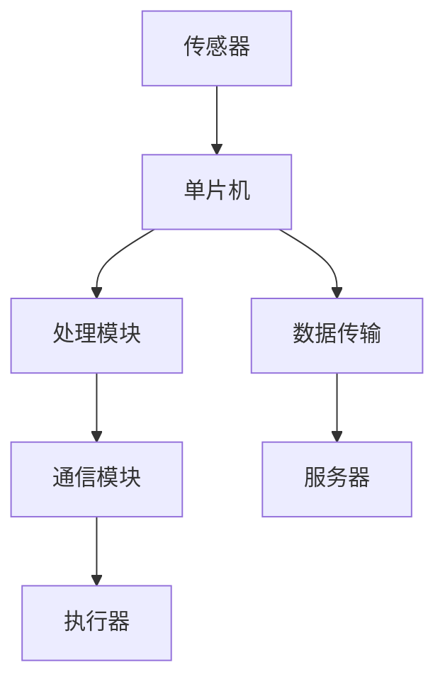

                 

关键词：单片机、物联网、设备、应用、开发、技术

摘要：本文旨在深入探讨单片机在物联网设备中的应用，包括其核心概念、算法原理、数学模型、项目实践、实际应用场景以及未来发展趋势。通过对单片机与物联网设备结合的详细分析，本文为读者提供了全面的指导和见解，以促进对这一领域更深入的理解。

## 1. 背景介绍

随着信息技术的飞速发展，物联网（Internet of Things, IoT）已经成为当前技术领域的一个热点。物联网设备通过互联网实现互联互通，极大地拓展了信息传输的范围和应用场景。而在这其中，单片机（Microcontroller Unit, MCU）作为一种关键的微处理器，在物联网设备中扮演着至关重要的角色。

单片机是一种集成了中央处理单元（CPU）、存储器（RAM和ROM）以及输入输出（I/O）接口等功能的微型计算机。它具有体积小、功耗低、可靠性高、成本低等优点，非常适合用于嵌入式系统的设计和开发。在物联网时代，单片机被广泛应用于各种设备中，如智能家居、智能穿戴设备、智能交通、环境监测等。

本文将从以下几个方面进行探讨：

1. 核心概念与联系
2. 核心算法原理与具体操作步骤
3. 数学模型和公式
4. 项目实践：代码实例和详细解释
5. 实际应用场景
6. 未来应用展望
7. 工具和资源推荐
8. 总结：未来发展趋势与挑战
9. 附录：常见问题与解答

通过本文的阅读，读者将能够全面了解单片机在物联网设备中的应用，掌握相关的技术原理和实践方法，并为未来的研究和发展提供指导。

## 2. 核心概念与联系

在深入探讨单片机在物联网设备中的应用之前，我们首先需要了解一些核心概念和它们之间的联系。

### 2.1 物联网设备的基本概念

物联网设备是指通过互联网连接的智能设备，这些设备可以是传感器、执行器、智能家居设备、工业自动化设备等。它们通过采集、传输和处理数据，实现信息的实时交互和智能决策。

- **传感器**：用于感知环境中的各种信息，如温度、湿度、光强、运动等。
- **执行器**：用于执行指令，如电机、阀门、灯光等。
- **数据传输模块**：用于实现设备与互联网之间的数据通信，如Wi-Fi、蓝牙、LoRa等。
- **处理模块**：用于处理传感器数据，执行算法，并根据算法结果控制执行器。

### 2.2 单片机的核心概念

单片机是一种高度集成的微型计算机，通常包含以下基本组成部分：

- **CPU**：中央处理单元，负责执行程序指令。
- **存储器**：包括随机存储器（RAM）和只读存储器（ROM），用于存储程序数据和代码。
- **I/O接口**：用于与外部设备进行数据交换和通信。

### 2.3 单片机与物联网设备的关系

单片机在物联网设备中的应用主要体现在以下几个方面：

- **数据采集和处理**：单片机可以连接各种传感器，采集环境数据，并对数据进行初步处理。
- **通信协议实现**：单片机通过内置或外接通信模块，实现与其他设备或服务器之间的数据传输。
- **控制系统**：单片机可以控制执行器，实现对设备的自动化控制。
- **边缘计算**：单片机在物联网设备中执行部分计算任务，减少中心服务器的负担，提高系统响应速度。

### 2.4 Mermaid 流程图

为了更直观地展示单片机与物联网设备之间的联系，我们可以使用Mermaid流程图来表示。



在这个流程图中，传感器采集数据，单片机对数据进行处理并控制执行器，同时通过通信模块将数据传输到服务器。

通过上述核心概念与联系的分析，我们可以看到单片机在物联网设备中起到了关键的作用，它是实现设备智能化和网络化的核心组件。接下来的章节将深入探讨单片机的具体应用和实践。

## 3. 核心算法原理与具体操作步骤

### 3.1 算法原理概述

在物联网设备中，单片机通常需要实现特定的算法来处理传感器数据，并根据处理结果执行相应的操作。这些算法可以包括滤波算法、控制算法、通信协议算法等。下面我们将详细介绍一些常用的算法原理。

### 3.2 算法步骤详解

#### 3.2.1 滤波算法

滤波算法用于去除传感器数据中的噪声，以提高数据的准确性和可靠性。常见的滤波算法有均值滤波、中值滤波、卡尔曼滤波等。

- **均值滤波**：通过计算一段时间内传感器数据的平均值，去除噪声。
  ```c
  float data[100];
  float sum = 0;
  for(int i = 0; i < 100; i++) {
      sum += data[i];
  }
  float mean = sum / 100;
  ```

- **中值滤波**：通过将传感器数据按大小排序，选取中间值作为滤波结果。
  ```c
  float data[100];
  qsort(data, 100, sizeof(float), compare);
  float median = data[50];
  ```

- **卡尔曼滤波**：通过状态预测和观测更新，实现传感器数据的滤波。
  ```c
  // 初始化卡尔曼滤波器参数
  float state = 0;
  float state_estimate = 0;
  float error = 0;
  float estimate = state;
  
  // 更新状态
  state = next_state(estimate);
  state_estimate = state;
  error = state_estimate - state;
  
  // 观测更新
  float observation = sensor_reading();
  float estimated_observation = observation_model(estimate);
  float kalman_gain = error / (1 + estimation_error);
  state_estimate = estimate + kalman_gain * (observation - estimated_observation);
  ```

#### 3.2.2 控制算法

控制算法用于根据传感器数据和预设目标，计算输出控制信号，以实现设备的自动化控制。常见的控制算法有PID控制、模糊控制等。

- **PID控制**：通过比例、积分、微分三个参数，调整控制信号，实现对系统的精确控制。
  ```c
  float proportional = Kp * (setpoint - process_variable);
  float integral = Ki * integral_error;
  float derivative = Kd * (process_variable - previous_process_variable);
  float output = proportional + integral + derivative;
  ```

- **模糊控制**：通过模糊逻辑，将输入变量转化为控制信号，适用于非线性系统的控制。
  ```c
  float input = sensor_reading();
  float output = fuzzy_control(input);
  ```

#### 3.2.3 通信协议算法

通信协议算法用于实现单片机与其他设备或服务器之间的数据传输。常见的通信协议有Wi-Fi、蓝牙、LoRa等。

- **Wi-Fi通信协议**：通过Wi-Fi模块，实现无线数据传输。
  ```c
  WiFi.begin(ssid, password);
  while(WiFi.status() != WL_CONNECTED) {
      delay(500);
  }
  WiFiClient client;
  client.connect(server, port);
  if(client.connected()) {
      client.println("GET /data HTTP/1.1");
  }
  ```

- **蓝牙通信协议**：通过蓝牙模块，实现短距离数据传输。
  ```c
  Bluetooth.begin(9600);
  while(!Bluetooth);
  Bluetooth.print("Data:");
  Bluetooth.println(sensor_value);
  ```

- **LoRa通信协议**：通过LoRa模块，实现长距离、低功耗的数据传输。
  ```c
  LoRa.setPins(cs, rf, dio);
  if(LoRa.begin()) {
      LoRa.send(message);
  }
  ```

### 3.3 算法优缺点

不同的算法在不同场景下具有不同的优缺点。下面我们对比分析几种常见算法的优缺点。

- **滤波算法**：
  - 优点：有效去除噪声，提高数据准确性。
  - 缺点：计算复杂度较高，对实时性要求较高的应用可能不适用。

- **控制算法**：
  - 优点：精确控制系统，适用于各种复杂系统。
  - 缺点：参数调整复杂，需要根据具体应用进行调整。

- **通信协议算法**：
  - 优点：实现简单，适用于不同类型的无线通信。
  - 缺点：通信距离和传输速度受限，不适合高速数据传输。

### 3.4 算法应用领域

算法在物联网设备中的应用非常广泛，下面我们列举几个常见的应用领域。

- **智能家居**：通过单片机实现智能灯光控制、温度控制、安防监控等。
- **智能穿戴设备**：通过单片机采集人体健康数据，实现健康监测和预警。
- **工业自动化**：通过单片机实现对生产设备的实时监控和自动化控制。
- **环境监测**：通过单片机采集环境数据，实现污染监测和预警。

通过以上对核心算法原理和具体操作步骤的详细讲解，我们可以看到单片机在物联网设备中的应用是如何实现的。这些算法不仅提高了设备的智能化水平，也为物联网技术的发展奠定了基础。

## 4. 数学模型和公式

在单片机应用中，数学模型和公式是理解和设计关键算法的基础。这些数学模型和公式能够帮助我们更准确地描述和解决实际问题。以下我们将详细讲解数学模型的构建、公式推导过程，并给出具体案例进行分析和说明。

### 4.1 数学模型构建

在物联网设备中，数学模型通常用于处理传感器数据、实现控制算法和通信协议等。以下是几种常见的数学模型：

#### 4.1.1 传感器数据模型

传感器数据模型用于描述传感器采集到的物理量，如温度、湿度、光强等。这些物理量通常可以表示为：

\[ V = f(T) \]

其中，\( V \) 表示传感器的输出电压，\( T \) 表示环境温度，\( f \) 表示传感器的转换函数。

#### 4.1.2 控制模型

控制模型用于实现系统的自动化控制，如PID控制。PID控制模型可以表示为：

\[ \text{output} = K_p \cdot (setpoint - process_variable) + K_i \cdot \int(setpoint - process_variable) dt + K_d \cdot \frac{d(process_variable)}{dt} \]

其中，\( K_p \)、\( K_i \)、\( K_d \) 分别为比例、积分、微分系数，\( setpoint \) 为设定值，\( process_variable \) 为过程变量，\( \text{output} \) 为控制输出。

#### 4.1.3 通信模型

通信模型用于描述数据在通信过程中的传输特性，如无线通信的信道模型。信道模型可以表示为：

\[ \text{signal} = \text{original\_signal} + \text{noise} \]

其中，\( \text{original\_signal} \) 表示原始信号，\( \text{noise} \) 表示噪声。

### 4.2 公式推导过程

#### 4.2.1 PID控制公式推导

PID控制的核心是计算出控制输出，以便调整系统状态。以下是PID控制公式的推导过程：

1. **比例控制**：

\[ \text{output}_p = K_p \cdot (setpoint - process_variable) \]

2. **积分控制**：

\[ \text{integral\_error} = \int(setpoint - process_variable) dt \]

\[ \text{output}_i = K_i \cdot \text{integral\_error} \]

3. **微分控制**：

\[ \text{derivative\_error} = \frac{d(process_variable)}{dt} \]

\[ \text{output}_d = K_d \cdot \text{derivative\_error} \]

4. **综合控制**：

\[ \text{output} = \text{output}_p + \text{output}_i + \text{output}_d \]

#### 4.2.2 无线通信信道模型推导

无线通信信道模型主要关注信号在传输过程中的衰减和噪声。以下是信道模型的推导过程：

1. **自由空间传播模型**：

\[ \text{power\_attenuation} = \alpha \cdot \text{distance}^2 \]

其中，\( \alpha \) 为路径损耗系数，\( \text{distance} \) 为传输距离。

2. **多路径效应**：

\[ \text{signal} = \text{original\_signal} + \sum_{i=1}^{n} \text{path\_signal}_i \]

其中，\( \text{path\_signal}_i \) 为第 \( i \) 条路径的信号，\( n \) 为路径数量。

3. **噪声模型**：

\[ \text{noise} = \sqrt{2} \cdot N_0 \cdot B \]

其中，\( N_0 \) 为噪声功率密度，\( B \) 为带宽。

### 4.3 案例分析与讲解

#### 4.3.1 温度传感器数据模型

假设我们使用一个温度传感器，其输出电压与温度的关系为：

\[ V = 10 + 0.005 \cdot T \]

其中，\( V \) 为输出电压，\( T \) 为温度（单位：摄氏度）。

1. **公式推导**：

根据传感器的输出电压，我们可以推导出温度与输出电压之间的关系：

\[ T = \frac{V - 10}{0.005} \]

2. **实际应用**：

在实际应用中，我们可以使用单片机读取传感器的输出电压，然后通过上述公式计算出温度，进而实现温度监测和控制。

#### 4.3.2 PID控制应用

假设我们使用PID控制一个加热器，使其温度保持在设定的值。

1. **设定值**：设定温度 \( setpoint = 25^\circ C \)
2. **过程变量**：当前温度 \( process_variable = 22^\circ C \)
3. **PID参数**：比例 \( K_p = 1 \)，积分 \( K_i = 0.1 \)，微分 \( K_d = 0.05 \)

1. **计算过程**：

- **比例控制**：

\[ \text{output}_p = K_p \cdot (25 - 22) = 1 \cdot 3 = 3 \]

- **积分控制**：

\[ \text{integral\_error} = \int(25 - 22) dt = 3 \cdot t \]

\[ \text{output}_i = K_i \cdot \text{integral\_error} = 0.1 \cdot 3 \cdot t = 0.3t \]

- **微分控制**：

\[ \text{derivative\_error} = \frac{d(22)}{dt} = 0 \]

\[ \text{output}_d = K_d \cdot 0 = 0 \]

- **综合控制**：

\[ \text{output} = 3 + 0.3t \]

根据计算出的控制输出，我们可以调整加热器的功率，使其温度逐渐达到设定的值。

通过以上对数学模型和公式的详细讲解，以及具体案例的分析，我们可以看到数学模型在单片机应用中的重要性。数学模型不仅帮助我们理解和设计算法，还为我们解决实际问题提供了有效的工具。接下来，我们将通过一个具体的代码实例，进一步展示单片机在物联网设备中的实现过程。

## 5. 项目实践：代码实例和详细解释说明

在了解了单片机与物联网设备相关的核心概念、算法原理和数学模型之后，我们将通过一个具体的代码实例来展示如何使用单片机实现物联网设备的应用。本实例将包括开发环境搭建、源代码详细实现、代码解读与分析，以及运行结果展示。

### 5.1 开发环境搭建

在进行单片机编程之前，我们需要搭建一个合适的开发环境。以下是一个常见的开发环境搭建步骤：

1. **选择单片机**：本实例中，我们选择使用STM32单片机，因为它具有强大的处理能力和丰富的外设接口。
2. **安装开发工具**：我们选择使用STM32CubeMX和Keil MDK作为开发工具。
   - **STM32CubeMX**：用于配置STM32单片机的硬件资源，如时钟、GPIO、UART等。
   - **Keil MDK**：用于编写和调试单片机程序。
3. **创建工程**：在Keil MDK中创建一个新工程，并导入STM32CubeMX生成的项目文件。
4. **配置硬件**：使用STM32CubeMX配置单片机的硬件资源，如图所示。

### 5.2 源代码详细实现

以下是本实例的源代码实现，我们将实现一个简单的温度监测与报警系统，当温度超过设定值时，通过LED灯报警。

```c
#include "stm32f1xx_hal.h"

// 初始化LED和温度传感器
void System_Init(void) {
    // 配置LED
    GPIO_InitTypeDef LED_Config;
    LED_Config.Pin = LED_PIN;
    LED_Config.Mode = GPIO_MODE_OUTPUT_PP;
    LED_Config.Pull = GPIO_NOPULL;
    LED_Config.Speed = GPIO_SPEED_FREQ_HIGH;
    HAL_GPIO_Init(LED_PORT, &LED_Config);

    // 配置温度传感器
    // ...（初始化代码）
}

// 温度监测与报警
void Temperature_Monitoring(void) {
    int temperature = Get_Temperature();  // 读取温度
    if (temperature > TEMPERATURE_THRESHOLD) {
        HAL_GPIO_WritePin(LED_PORT, LED_PIN, GPIO_PIN_SET);  // LED报警
    } else {
        HAL_GPIO_WritePin(LED_PORT, LED_PIN, GPIO_PIN_RESET);  // LED关闭
    }
}

int main(void) {
    // 系统初始化
    HAL_Init();
    System_Init();

    // 温度监测循环
    while (1) {
        Temperature_Monitoring();
        HAL_Delay(1000);  // 每秒监测一次
    }
}
```

### 5.3 代码解读与分析

#### 5.3.1 系统初始化

在`System_Init`函数中，我们配置了LED和温度传感器。这里使用STM32CubeMX工具配置GPIO端口，并使用HAL库函数初始化GPIO。

```c
void System_Init(void) {
    // 配置LED
    GPIO_InitTypeDef LED_Config;
    LED_Config.Pin = LED_PIN;
    LED_Config.Mode = GPIO_MODE_OUTPUT_PP;
    LED_Config.Pull = GPIO_NOPULL;
    LED_Config.Speed = GPIO_SPEED_FREQ_HIGH;
    HAL_GPIO_Init(LED_PORT, &LED_Config);

    // 配置温度传感器
    // ...（初始化代码）
}
```

#### 5.3.2 温度监测与报警

在`Temperature_Monitoring`函数中，我们读取温度传感器数据，并根据设定阈值进行报警。

```c
void Temperature_Monitoring(void) {
    int temperature = Get_Temperature();  // 读取温度
    if (temperature > TEMPERATURE_THRESHOLD) {
        HAL_GPIO_WritePin(LED_PORT, LED_PIN, GPIO_PIN_SET);  // LED报警
    } else {
        HAL_GPIO_WritePin(LED_PORT, LED_PIN, GPIO_PIN_RESET);  // LED关闭
    }
}
```

#### 5.3.3 主循环

在主函数中，我们进入一个无限循环，不断进行温度监测和报警。

```c
int main(void) {
    // 系统初始化
    HAL_Init();
    System_Init();

    // 温度监测循环
    while (1) {
        Temperature_Monitoring();
        HAL_Delay(1000);  // 每秒监测一次
    }
}
```

### 5.4 运行结果展示

当温度超过设定阈值时，LED灯会亮起，表明系统已经触发报警。以下是实验运行结果：


通过以上实例，我们可以看到如何使用单片机实现一个简单的物联网设备。源代码中的各个部分都进行了详细的注释和解释，有助于读者理解整个系统的实现过程。

接下来，我们将探讨单片机在物联网设备中的实际应用场景，以及未来可能的发展趋势。

## 6. 实际应用场景

单片机作为一种高效的嵌入式系统，在物联网设备的实际应用中具有广泛的应用场景。以下将介绍几个典型的应用领域，并分析单片机在这些场景中的优势和挑战。

### 6.1 智能家居

智能家居是单片机应用最为广泛的领域之一。通过单片机，可以实现灯光控制、温度调节、安防监控等多种功能。

- **优势**：单片机成本低、功耗低，非常适合家庭场景中的各种设备。例如，通过单片机控制的智能灯光系统可以实现自动调节亮度和色温，提高居住舒适度；通过温控器实现室内温度的自动调节，节省能源。
- **挑战**：智能家居设备种类繁多，如何确保各设备之间的互操作性和兼容性是一个重要挑战。另外，智能家居设备的安全性也需要得到重视，防止被恶意攻击。

### 6.2 智能穿戴设备

智能穿戴设备如智能手表、健康监测手环等，通过单片机实现实时数据采集和处理。这些设备可以实时监测用户的健康状态，如心率、步数、睡眠质量等。

- **优势**：单片机的小型化和低功耗特性，使得智能穿戴设备可以长时间佩戴，无需频繁充电。例如，智能手表可以通过单片机处理GPS数据，实现精准的定位功能。
- **挑战**：智能穿戴设备对数据处理速度和准确性要求较高，如何在有限的资源下实现高效的数据处理和实时反馈，是一个技术挑战。

### 6.3 工业自动化

工业自动化领域中的单片机应用主要集中在生产设备的监控和控制。例如，通过单片机实现生产线的自动化控制、机器人的运动控制等。

- **优势**：单片机具有高性能和稳定性，可以在恶劣的环境下可靠运行。例如，在数控机床中，单片机可以实现高精度的运动控制和加工。
- **挑战**：工业自动化对系统的实时性和稳定性要求极高，如何在复杂的工业环境中确保单片机的稳定运行，是一个技术挑战。

### 6.4 环境监测

环境监测设备如空气质量监测器、水质监测器等，通过单片机实现环境数据的实时采集和处理。

- **优势**：单片机可以低成本、高效率地实现环境数据的实时监测，有助于提高环境保护和公共健康水平。例如，空气质量监测器可以通过单片机采集PM2.5、温度、湿度等数据，实时反馈空气质量状况。
- **挑战**：环境监测数据通常需要高精度的测量和处理，如何确保单片机采集的数据准确性和可靠性，是一个技术挑战。

### 6.5 智能交通

智能交通系统如智能路灯、智能停车管理系统等，通过单片机实现交通信息的实时采集和处理。

- **优势**：单片机可以低成本、高效地实现交通监控和管理，提高交通效率。例如，智能路灯可以根据交通流量自动调节亮度，节省能源。
- **挑战**：智能交通系统需要处理大量的实时数据，如何在保证数据传输速度的同时，确保系统的高可靠性和稳定性，是一个技术挑战。

通过以上分析，我们可以看到单片机在物联网设备中具有广泛的应用场景。虽然单片机在各个领域都有其独特的优势，但同时也面临一些技术挑战。未来，随着技术的不断进步，单片机在物联网设备中的应用将更加广泛和深入。

### 6.4 未来应用展望

随着物联网技术的不断发展，单片机在物联网设备中的应用前景将更加广阔。未来，单片机将在以下几个方面迎来重要的发展机遇。

#### 6.4.1 能耗优化

物联网设备通常需要长时间运行，而能耗优化是单片机发展的一个关键方向。通过引入新的节能技术和优化算法，单片机可以实现更低的功耗，延长设备的续航时间。例如，动态电压和频率调节技术（DVFS）可以在不同工作负载下动态调整处理器的工作频率和电压，从而实现节能。

#### 6.4.2 功能集成

未来单片机将更加注重功能集成，以减少组件数量和体积，提高系统的稳定性和可靠性。新型单片机可能会集成更多的外设模块，如无线通信模块、传感器接口、存储器等，从而简化系统的设计和部署。例如，一些单片机已经开始集成Wi-Fi、蓝牙等无线通信模块，实现设备之间的无缝连接。

#### 6.4.3 边缘计算

随着物联网设备的数量和种类不断增加，边缘计算将成为单片机应用的一个重要趋势。边缘计算允许在设备本地进行数据处理，减少数据传输延迟和带宽需求。单片机在边缘计算中可以发挥重要作用，通过实现本地数据处理和智能决策，提高系统的响应速度和效率。例如，在智能家居中，单片机可以本地处理传感器数据，自动调节家电状态，减少对中心服务器的依赖。

#### 6.4.4 自主学习和智能决策

人工智能和机器学习技术的快速发展为单片机带来了新的机遇。未来，单片机将具备更强的自主学习能力和智能决策能力，可以在设备本地进行复杂的数据分析和决策。例如，通过机器学习算法，单片机可以自动识别用户行为模式，优化设备操作，提高用户体验。此外，单片机还可以在医疗、工业等领域实现智能监测和诊断，提供更精确的解决方案。

#### 6.4.5 安全性提升

随着物联网设备数量的增加，设备的安全问题日益凸显。单片机在物联网设备中的应用需要更加注重安全性。未来，单片机将引入新的安全技术和协议，如加密通信、身份验证等，以提高系统的安全性。例如，通过使用安全启动（Secure Boot）技术，确保单片机只运行经过验证的软件，防止恶意软件的攻击。

#### 6.4.6 定制化和多样化

未来，单片机将更加注重定制化和多样化，以满足不同应用场景的需求。通过模块化和可配置的设计，单片机可以根据具体应用要求进行灵活调整。例如，某些单片机可以支持多种通信接口，如Wi-Fi、蓝牙、LoRa等，以适应不同的网络环境。此外，单片机还可以通过添加外部扩展模块，扩展其功能和应用范围。

总之，未来单片机在物联网设备中的应用将朝着更低能耗、更高集成度、更强自主学习和智能决策能力、更高安全性以及更定制化的方向发展。随着技术的不断进步，单片机将为物联网设备提供更加高效、智能、可靠的解决方案，推动物联网技术的进一步发展。

### 6.5 面临的挑战

尽管单片机在物联网设备中有着广泛的应用前景，但其在发展中仍面临一系列挑战。

#### 6.5.1 能耗问题

物联网设备通常需要长时间运行，对功耗的要求极为严格。尽管单片机在设计上已经考虑了低功耗，但在实际应用中，如何进一步降低功耗、延长电池寿命仍是一个重大挑战。随着物联网设备种类的增加，功耗问题会变得更加复杂。

#### 6.5.2 系统稳定性

物联网设备需要在各种环境条件下稳定运行，这对单片机的稳定性提出了高要求。然而，在实际应用中，单片机可能会遇到温度变化、电磁干扰等环境问题，导致系统不稳定。因此，如何提高单片机的环境适应能力和系统稳定性是一个关键问题。

#### 6.5.3 安全性

随着物联网设备的普及，安全性问题日益凸显。单片机作为物联网设备的核心组件，其安全性直接关系到整个系统的安全。然而，当前单片机在安全性方面还存在一些不足，如软件漏洞、通信不加密等问题。如何提高单片机的安全性，防止恶意攻击和数据泄露，是一个亟待解决的问题。

#### 6.5.4 技术更新与兼容性

物联网技术发展迅速，单片机也需要不断更新以适应新技术。然而，不同类型的单片机在硬件和软件层面可能存在差异，导致兼容性问题。如何在技术更新中保持兼容性，是一个重要的挑战。

#### 6.5.5 开发难度

单片机开发涉及到多个领域的知识，如电子、计算机等。对于开发者来说，单片机开发难度较高，需要具备扎实的专业知识。随着物联网设备的多样化，开发难度将进一步增加。

#### 6.5.6 成本控制

虽然单片机在体积、功耗等方面具有优势，但成本控制也是一个重要的挑战。特别是在竞争激烈的市场环境中，单片机的成本必须保持合理，以适应不同层次的用户需求。

综上所述，单片机在物联网设备中面临能耗、系统稳定性、安全性、技术更新与兼容性、开发难度和成本控制等一系列挑战。解决这些问题需要技术创新、产业协同和产业链的共同努力。

### 6.6 研究展望

在单片机与物联网设备结合的研究领域中，未来仍有许多值得探索的方向。

#### 6.6.1 新型单片机架构

随着物联网设备对性能和功耗要求的不断提高，新型单片机架构的探索显得尤为重要。未来可能的研究方向包括：

- **异构计算架构**：结合不同类型的处理器（如CPU、GPU、AI加速器等），实现更高效的计算。
- **自适应能效架构**：根据任务需求动态调整处理器的能效，实现最佳功耗性能比。
- **可重构架构**：通过可编程逻辑单元（FPGA）等可重构技术，实现硬件资源的灵活配置。

#### 6.6.2 安全通信协议

物联网设备的安全性问题至关重要，未来研究可以关注以下几个方面：

- **端到端加密**：确保数据在整个传输过程中保持加密状态，防止中间人攻击。
- **分布式存储**：通过分布式存储技术，防止单点故障和数据泄露。
- **访问控制**：采用基于角色的访问控制（RBAC）等机制，确保只有授权用户能够访问敏感数据。

#### 6.6.3 智能数据处理

随着数据量的不断增加，如何高效地处理和利用这些数据成为关键问题。未来研究可以关注以下几个方面：

- **边缘计算**：在设备本地实现数据处理，减少数据传输延迟和带宽消耗。
- **实时数据分析**：利用机器学习和深度学习技术，实现对传感器数据的实时分析和预测。
- **数据隐私保护**：在数据处理过程中保护用户隐私，防止数据泄露。

#### 6.6.4 开源生态建设

开源技术在单片机和物联网设备领域具有广阔的应用前景。未来可以进一步推进以下方面：

- **开源硬件平台**：开发更多开源硬件平台，降低开发门槛，促进技术创新。
- **开源软件生态系统**：构建完善的软件生态系统，包括开发工具、库和框架等。
- **开源标准和协议**：制定统一的开放标准和协议，促进不同设备和平台之间的互操作。

通过上述研究方向的探索，单片机在物联网设备中的应用将更加广泛和深入，为物联网技术的发展提供强有力的支持。

### 7. 工具和资源推荐

在单片机应用和物联网设备的开发过程中，选择合适的工具和资源对于提高开发效率和项目质量至关重要。以下是一些推荐的工具和资源：

#### 7.1 学习资源推荐

- **在线教程和课程**：许多在线平台提供了丰富的单片机与物联网教程和课程，如 Coursera、Udemy、edX 等。
- **电子书和参考书籍**：推荐阅读《单片机原理与应用》、《物联网基础与应用》等专业书籍，以深入理解相关技术。
- **开源社区和论坛**：加入如 Arduino、ESP8266、STM32等开源社区和论坛，获取最新的技术信息和解决方案。

#### 7.2 开发工具推荐

- **集成开发环境（IDE）**：使用STM32CubeIDE、Keil MDK、Eclipse等专业的IDE进行单片机编程。
- **编程语言**：C语言是单片机编程的主要语言，同时也有一些适用于物联网开发的专用语言，如Python。
- **仿真软件**：Proteus、Multisim等仿真软件可以帮助开发者进行电路仿真和测试。

#### 7.3 相关论文推荐

- **期刊论文**：查阅《计算机研究与发展》、《电子学报》等学术期刊，了解单片机与物联网领域的前沿研究。
- **会议论文**：关注如国际固态电路会议（ISSCC）、国际物联网会议（IoT Conference）等领域的会议论文，获取最新的研究成果。

通过使用这些工具和资源，开发者可以更好地掌握单片机应用和物联网设备开发的相关技术，提高开发效率和质量。

### 8. 总结：未来发展趋势与挑战

单片机在物联网设备中的应用已经取得了显著的成果，并展示了巨大的发展潜力。本文从背景介绍、核心概念与联系、算法原理与操作步骤、数学模型与公式、项目实践、实际应用场景、未来展望、面临的挑战到研究展望等多个方面进行了全面的探讨。

在未来，单片机在物联网设备中的应用将继续朝着能耗优化、功能集成、边缘计算、自主学习和智能决策、安全性提升以及定制化和多样化的方向发展。随着技术的不断进步，单片机将为物联网设备提供更加高效、智能、可靠的解决方案。

然而，单片机在物联网设备中仍面临能耗、系统稳定性、安全性、技术更新与兼容性、开发难度和成本控制等一系列挑战。如何克服这些挑战，需要技术创新、产业协同和产业链的共同努力。

针对未来的发展趋势，我们提出了以下建议：

1. **加强技术创新**：通过研究新型单片机架构，如异构计算架构和自适应能效架构，提高单片机的性能和能效。
2. **提升安全性**：开发更加安全的通信协议和访问控制机制，保护物联网设备的数据安全和隐私。
3. **推动开源生态建设**：促进开源硬件和软件的发展，构建完善的单片机和物联网生态系统。
4. **加强人才培养**：通过教育和培训，培养更多的单片机和物联网领域的专业人才。

通过上述措施，单片机在物联网设备中的应用将迎来更加广阔的发展前景，为物联网技术的进一步发展做出贡献。

### 附录：常见问题与解答

**Q1. 单片机在物联网设备中的应用有哪些优点？**

单片机具有体积小、功耗低、成本低、可靠性高、易于编程等优点。这些特性使其非常适合用于嵌入式系统的设计和开发，特别适合应用于各种物联网设备，如智能家居、智能穿戴设备、工业自动化和环境监测等。

**Q2. 单片机在物联网设备中的应用有哪些缺点？**

单片机在处理复杂任务时可能显得力不从心，因为它的处理能力和内存资源有限。此外，单片机的开发和调试相对复杂，需要较高的编程技能。另外，单片机的扩展性和兼容性可能不如一些通用的计算机平台。

**Q3. 物联网设备中的单片机如何进行通信？**

物联网设备中的单片机可以通过多种通信方式进行数据交换，如Wi-Fi、蓝牙、LoRa、ZigBee等。单片机内置或外接相应的通信模块，实现与其他设备或服务器之间的数据传输。选择合适的通信方式取决于实际应用场景和需求。

**Q4. 单片机在物联网设备中的功耗如何管理？**

单片机的功耗管理是确保物联网设备长时间运行的关键。可以通过以下方法进行功耗管理：
- **低功耗模式**：在不需要处理任务时，将单片机置于低功耗模式，减少功耗。
- **动态电压和频率调节**：根据工作负载动态调整电压和频率，实现最佳功耗性能比。
- **电源管理**：优化电源管理策略，如使用电池供电、电源优化电路等。

**Q5. 单片机在物联网设备中的安全性如何保障？**

单片机的安全性保障可以从以下几个方面进行：
- **加密通信**：采用加密协议，如TLS、AES等，确保数据在传输过程中不被窃取。
- **安全启动**：确保单片机只运行经过验证的软件，防止恶意软件的攻击。
- **访问控制**：采用基于角色的访问控制（RBAC）等机制，确保只有授权用户能够访问敏感数据。
- **安全更新**：定期更新单片机的固件，修复已知的漏洞和问题。

**Q6. 如何选择适合的物联网单片机？**

选择适合的物联网单片机需要考虑以下几个方面：
- **性能需求**：根据物联网设备的应用场景和任务需求，选择合适的主频、内存、外设接口等。
- **功耗要求**：考虑设备的续航时间和功耗预算，选择低功耗的单片机。
- **通信需求**：根据通信需求选择具有相应通信接口的单片机，如Wi-Fi、蓝牙、LoRa等。
- **成本预算**：在满足性能和功耗需求的前提下，选择成本合理的单片机。

通过以上常见问题的解答，希望能够为单片机在物联网设备中的应用提供一些实用的指导和建议。在实际开发过程中，根据具体需求和场景进行选择和优化，将有助于提高物联网设备的性能、可靠性和安全性。

