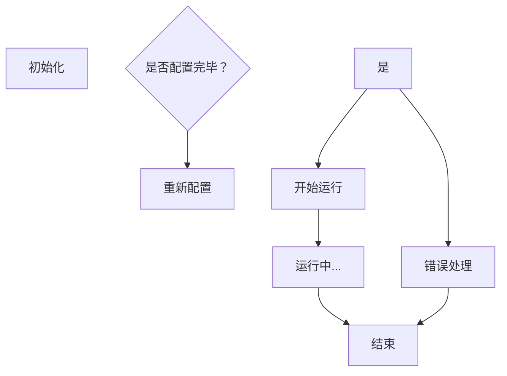

                 

关键词：单片机编程、嵌入式系统、嵌入式开发、编程语言、编程实践、硬件设计

> 摘要：本文旨在深入探讨单片机编程的原理、技术与实践。单片机作为嵌入式系统的基础构件，具有广泛的应用前景。本文将详细介绍单片机编程的核心概念、算法原理、数学模型以及实际应用案例，旨在为嵌入式开发者提供实用的编程技巧和理论基础。

## 1. 背景介绍

单片机（Microcontroller Unit，MCU）是集成了处理器、存储器、输入输出接口和时钟等功能的微型计算机系统。由于其体积小、成本低、控制功能强大，单片机在嵌入式系统中得到了广泛应用。从简单的电子玩具到复杂的工业控制系统，单片机都扮演着至关重要的角色。

嵌入式系统（Embedded System）是一种嵌入在其他设备中的计算机系统，它们通常执行特定的功能，而不提供通用计算服务。嵌入式系统与普通计算机系统的主要区别在于，它们通常运行在资源受限的环境中，且需要高度的可靠性和实时性。

### 1.1 嵌入式系统的定义与特点

嵌入式系统具有以下几个主要特点：

- **专用性**：嵌入式系统通常为特定应用设计，不具备通用性。
- **资源受限**：嵌入式系统通常运行在有限的处理器、存储器和能量资源下。
- **实时性**：许多嵌入式系统需要处理实时数据，确保系统能够在规定时间内完成特定任务。
- **低功耗**：嵌入式系统通常要求低功耗，以延长设备的使用寿命。

### 1.2 单片机在嵌入式系统中的应用

单片机在嵌入式系统中的应用非常广泛，主要包括以下几个方面：

- **消费电子**：如智能手表、智能家居设备、电子游戏等。
- **工业控制**：如自动化生产线、机器人、温度控制系统等。
- **医疗设备**：如医疗监测设备、手术辅助系统等。
- **汽车电子**：如车身控制系统、发动机管理系统、安全气囊系统等。

## 2. 核心概念与联系

### 2.1 单片机的核心组件

单片机的核心组件包括：

- **中央处理器（CPU）**：执行指令的核心。
- **存储器**：包括随机存取存储器（RAM）和只读存储器（ROM）。
- **输入输出接口（I/O）**：用于与外部设备通信。
- **时钟**：提供系统时钟信号。

### 2.2 嵌入式系统的架构

嵌入式系统的架构通常包括：

- **硬件层**：包括单片机、传感器、执行器等。
- **固件层**：包括操作系统、中间件等。
- **软件层**：包括应用程序、驱动程序等。

### 2.3 单片机编程语言

单片机编程主要使用以下几种语言：

- **汇编语言**：与硬件直接交互，执行效率高，但可读性差。
- **C语言**：具有更好的可读性和可维护性，但执行效率略低。
- **C++语言**：在C语言的基础上增加了面向对象编程的特性。

### 2.4 Mermaid 流程图

以下是一个简单的单片机编程流程的 Mermaid 流程图：



## 3. 核心算法原理 & 具体操作步骤

### 3.1 算法原理概述

单片机编程的核心算法主要包括：

- **定时器中断**：用于实现定时功能。
- **串口通信**：用于与其他设备进行数据交换。
- **GPIO控制**：用于管理输入输出端口。

### 3.2 算法步骤详解

以下是一个简单的定时器中断程序的实现步骤：

1. 初始化定时器。
2. 设置定时器中断。
3. 在中断服务程序中实现定时功能。

### 3.3 算法优缺点

- **定时器中断**：优点是精确控制时间，缺点是占用资源较多。
- **串口通信**：优点是数据传输速度快，缺点是实时性较差。
- **GPIO控制**：优点是简单易用，缺点是占用端口较多。

### 3.4 算法应用领域

这些算法在嵌入式系统中得到了广泛应用，如定时任务调度、数据采集和传输、外设控制等。

## 4. 数学模型和公式 & 详细讲解 & 举例说明

### 4.1 数学模型构建

单片机编程中的数学模型主要包括：

- **定时器计算公式**：$ T = (N \times T_{clk}) - 1 $
- **串口波特率计算公式**：$ B = \frac{F_{clk}}{16 \times (SC + 1)} $

### 4.2 公式推导过程

以定时器计算公式为例，其推导过程如下：

1. 定时器计数器N的值。
2. 系统时钟频率F\_clk。
3. 定时时间T。

### 4.3 案例分析与讲解

假设系统时钟频率为100MHz，要实现1秒的定时，则定时器计数器N的值为：

$$
N = \left(\frac{100,000,000 \times 1}{100,000,000 - 1}\right) - 1 = 99,999
$$

## 5. 项目实践：代码实例和详细解释说明

### 5.1 开发环境搭建

搭建单片机编程的开发环境主要包括：

- **编译器**：如IAR、Keil等。
- **调试器**：如JTAG调试器、USB调试器等。
- **硬件平台**：如STM32开发板、Arduino等。

### 5.2 源代码详细实现

以下是一个简单的STM32定时器中断程序的源代码：

```c
#include "stm32f10x.h"

void TIM2_IRQHandler(void) {
    if (TIM_GetITStatus(TIM2, TIM_IT_Update) != RESET) {
        // 定时器中断服务程序
        TIM_ClearITPendingBit(TIM2, TIM_IT_Update);
        // 实现定时功能
    }
}

void TIM2_Config(void) {
    // 定时器初始化
    TIM_TimeBaseInitTypeDef TIM_TimeBaseInitStruct;
    TIM_TimeBaseInitStruct.TIM_Prescaler = 72 - 1;
    TIM_TimeBaseInitStruct.TIM_CounterMode = TIM_CounterMode_Up;
    TIM_TimeBaseInitStruct.TIM_Period = 1000 - 1;
    TIM_TimeBaseInitStruct.TIM_ClockDivision = TIM_ClockDivision_DIV1;
    TIM_TimeBaseInit(TIM2, &TIM_TimeBaseInitStruct);

    // 定时器中断使能
    NVIC_EnableIRQ(TIM2_IRQn);
}

int main(void) {
    // 系统初始化
    System_Init();

    // 定时器配置
    TIM2_Config();

    while (1) {
        // 主循环
    }
}
```

### 5.3 代码解读与分析

- **初始化定时器**：配置定时器的时钟分频、计数模式、周期值和时钟分频等参数。
- **设置定时器中断**：使能定时器中断并配置中断服务程序。
- **主循环**：实现主循环功能。

### 5.4 运行结果展示

运行该程序后，定时器每1秒触发一次中断，实现简单的定时功能。

## 6. 实际应用场景

### 6.1 消费电子

在消费电子领域，单片机被广泛应用于智能手表、智能家居设备、电子游戏等设备中，实现各种传感器数据采集、无线通信和用户交互等功能。

### 6.2 工业控制

在工业控制领域，单片机被用于自动化生产线、机器人、温度控制系统等设备中，实现实时数据采集、控制和监控等功能。

### 6.3 医疗设备

在医疗设备领域，单片机被用于医疗监测设备、手术辅助系统等设备中，实现实时数据采集、分析和处理等功能。

### 6.4 汽车电子

在汽车电子领域，单片机被用于车身控制系统、发动机管理系统、安全气囊系统等设备中，实现各种实时控制和监测功能。

## 7. 工具和资源推荐

### 7.1 学习资源推荐

- **《单片机原理与应用》**：详细介绍了单片机的工作原理、编程技术和应用案例。
- **《嵌入式系统设计》**：系统地讲解了嵌入式系统的设计方法、技术和实践。

### 7.2 开发工具推荐

- **IAR Embedded Workbench**：一款功能强大的嵌入式开发环境，支持多种单片机。
- **Keil MDK**：一款广泛使用的嵌入式开发环境，支持ARM架构的MCU。

### 7.3 相关论文推荐

- **"嵌入式系统中的实时性研究"**：探讨了嵌入式系统中实时性的重要性和实现方法。
- **"单片机在智能家居中的应用"**：分析了单片机在智能家居系统中的具体应用场景。

## 8. 总结：未来发展趋势与挑战

### 8.1 研究成果总结

随着物联网、人工智能等技术的发展，单片机在嵌入式系统中的应用越来越广泛。近年来，研究人员在单片机的性能优化、低功耗设计、实时性提升等方面取得了显著成果。

### 8.2 未来发展趋势

- **性能提升**：随着硬件技术的发展，单片机的性能将不断提高。
- **智能化**：单片机将更加智能化，实现更复杂的任务。
- **定制化**：单片机将更加个性化，满足不同应用场景的需求。

### 8.3 面临的挑战

- **功耗控制**：在资源受限的环境中，如何实现低功耗设计是一个重要挑战。
- **实时性保障**：在复杂的应用场景中，如何保障系统的实时性是一个关键问题。
- **安全性**：随着物联网的普及，单片机的安全性问题日益突出。

### 8.4 研究展望

未来，单片机在嵌入式系统中的应用将更加广泛，研究重点将集中在性能优化、智能化和安全性等方面。同时，随着人工智能、物联网等技术的发展，单片机将迎来新的发展机遇。

## 9. 附录：常见问题与解答

### 9.1 单片机编程入门推荐书籍

- 《单片机从入门到精通》
- 《单片机原理与应用教程》

### 9.2 常见编程问题及解决方法

- **定时器中断延迟**：检查中断优先级和中断服务程序执行时间。
- **串口通信异常**：检查串口配置和波特率设置是否正确。

### 9.3 常见硬件问题及解决方法

- **电源异常**：检查电源电压是否稳定。
- **传感器故障**：更换传感器或检查连接线路。

---

作者：禅与计算机程序设计艺术 / Zen and the Art of Computer Programming

