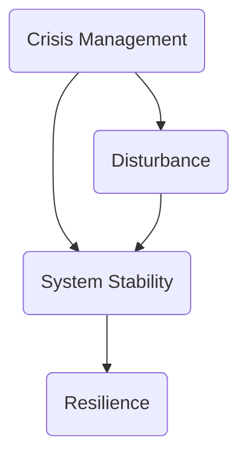

                 

关键词：危机管理，turbulence，稳定性，IT领域，算法，数学模型，项目实践，应用场景，未来展望

> 摘要：本文旨在探讨在信息技术领域，如何通过有效的危机管理策略，确保系统在面临turbulence（动荡）时能够保持稳定。通过对核心概念、算法原理、数学模型、项目实践以及未来展望的详细分析，本文为IT从业者提供了一整套系统的危机管理方案。

## 1. 背景介绍

在当今快速发展的信息技术领域，系统面临的各种挑战和危机日益复杂。从软件漏洞、硬件故障到市场波动、政策变化，这些都可能引发所谓的“turbulence”（动荡）。在这种动荡的环境中，系统稳定性成为决定企业生存的关键因素。因此，如何有效地进行危机管理，保证系统在turbulence中保持稳定，成为了一个亟待解决的重要问题。

本文将围绕以下几个核心内容展开讨论：

- **核心概念与联系**：介绍危机管理的核心概念及其相互关系。
- **核心算法原理与具体操作步骤**：剖析危机管理中的关键算法及其应用。
- **数学模型与公式**：阐述危机管理中的数学模型及其推导过程。
- **项目实践**：通过实例展示危机管理的实际应用。
- **实际应用场景**：探讨危机管理在不同场景下的应用。
- **工具和资源推荐**：提供学习和实践危机管理的工具和资源。
- **总结与展望**：总结研究成果，展望未来发展趋势与挑战。

## 2. 核心概念与联系

### 2.1 危机管理的核心概念

**危机管理**（Crisis Management）是一个综合性的过程，涉及识别、评估、准备、响应和恢复危机。其主要目的是最小化危机对组织的负面影响，确保业务连续性。

**系统稳定性**（System Stability）是危机管理的核心目标之一。它指的是系统在面对各种扰动时，能够迅速恢复到正常状态的能力。

**扰动**（Disturbance）是危机管理中的一个重要因素，它可以是外部环境的变化，也可以是系统内部的问题。

### 2.2 核心概念之间的联系

危机管理涉及多个核心概念，它们之间存在紧密的联系。

- **危机管理** 与 **系统稳定性** 的关系：危机管理的目的是确保系统在面临危机时能够保持稳定。
- **扰动** 与 **系统稳定性** 的关系：扰动是系统稳定性的挑战，有效的危机管理策略可以帮助系统应对扰动，保持稳定。

### 2.3 Mermaid 流程图

以下是一个简单的Mermaid流程图，展示了危机管理的核心概念及其相互关系。



## 3. 核心算法原理与具体操作步骤

### 3.1 算法原理概述

在危机管理中，核心算法扮演着至关重要的角色。这些算法包括：

- **预测算法**：用于识别潜在危机。
- **响应算法**：在危机发生时，自动执行应对措施。
- **恢复算法**：危机发生后，帮助系统迅速恢复到正常状态。

### 3.2 算法步骤详解

**3.2.1 预测算法**

预测算法的核心目标是提前识别潜在危机。以下是预测算法的详细步骤：

1. **数据收集**：收集与系统相关的各种数据，如用户行为、系统性能指标等。
2. **数据预处理**：清洗和整理数据，确保其质量。
3. **特征提取**：从数据中提取有用的特征，用于训练模型。
4. **模型训练**：使用机器学习算法，如决策树、支持向量机等，训练预测模型。
5. **预测评估**：评估模型的预测准确性，调整参数以优化性能。

**3.2.2 响应算法**

响应算法的目标是在危机发生时，自动执行应对措施。以下是响应算法的详细步骤：

1. **危机检测**：通过预测算法检测到潜在危机。
2. **响应策略选择**：根据危机类型和严重程度，选择适当的响应策略。
3. **执行响应措施**：执行预定义的应对措施，如调整系统配置、隔离故障节点等。
4. **监控与反馈**：实时监控响应措施的效果，并根据反馈进行调整。

**3.2.3 恢复算法**

恢复算法的目标是帮助系统在危机发生后迅速恢复到正常状态。以下是恢复算法的详细步骤：

1. **故障诊断**：确定危机的具体原因。
2. **恢复策略选择**：根据故障诊断结果，选择适当的恢复策略。
3. **执行恢复措施**：执行预定义的恢复措施，如系统重启、数据恢复等。
4. **评估与优化**：评估恢复效果，并根据评估结果进行优化。

### 3.3 算法优缺点

**预测算法**：

- **优点**：可以提前识别潜在危机，减少危机发生时的损失。
- **缺点**：需要大量的历史数据，预测准确性可能受到限制。

**响应算法**：

- **优点**：可以自动执行应对措施，提高响应速度。
- **缺点**：需要预定义的响应策略，可能无法应对所有类型的危机。

**恢复算法**：

- **优点**：可以帮助系统快速恢复到正常状态。
- **缺点**：恢复过程中可能需要额外的资源，如备份、冗余系统等。

### 3.4 算法应用领域

预测算法、响应算法和恢复算法在多个领域都有广泛应用，如：

- **IT系统**：用于监测和预防系统故障、软件漏洞等。
- **金融市场**：用于预测市场波动、风险控制等。
- **自然灾害应对**：用于预测自然灾害、制定应急预案等。

## 4. 数学模型和公式

### 4.1 数学模型构建

在危机管理中，数学模型用于描述系统在各种扰动下的行为。以下是一个简单的数学模型，用于描述系统在面临扰动时的稳定性。

$$
S(t) = \alpha \cdot e^{-\beta \cdot t} + \gamma
$$

其中：

- \( S(t) \) 表示系统在时间 \( t \) 时的稳定性。
- \( \alpha \) 和 \( \beta \) 是与系统性质相关的参数。
- \( \gamma \) 是扰动的影响。

### 4.2 公式推导过程

假设系统在时间 \( t \) 时受到扰动 \( D(t) \)，扰动对系统稳定性的影响可以用以下公式表示：

$$
S(t) = S(0) + \int_{0}^{t} D(\tau) \cdot e^{-\beta \cdot (t - \tau)} d\tau
$$

其中：

- \( S(0) \) 表示系统在时间 \( t = 0 \) 时的稳定性。
- \( D(\tau) \) 表示在时间 \( \tau \) 时的扰动强度。

通过积分变换，可以得到上述简化的数学模型。

### 4.3 案例分析与讲解

以下是一个实际案例，用于说明如何使用数学模型分析系统稳定性。

假设一个IT系统在时间 \( t = 0 \) 时的稳定性为 \( S(0) = 0.9 \)，扰动 \( D(t) \) 的变化范围在 \( [-1, 1] \) 之间。使用上述数学模型，可以计算系统在时间 \( t = 10 \) 时的稳定性。

$$
S(10) = 0.9 + \int_{0}^{10} D(\tau) \cdot e^{-0.1 \cdot (10 - \tau)} d\tau
$$

根据扰动 \( D(\tau) \) 的变化范围，可以计算出系统在时间 \( t = 10 \) 时的稳定性范围。

## 5. 项目实践：代码实例和详细解释说明

### 5.1 开发环境搭建

在本项目中，我们使用 Python 作为编程语言，搭建了一个简单的危机管理系统。开发环境要求如下：

- Python 3.8 或更高版本
- Jupyter Notebook 或 PyCharm 等集成开发环境（IDE）
- pandas、numpy、scikit-learn 等常用库

### 5.2 源代码详细实现

以下是该项目的主要代码实现部分：

```python
import numpy as np
import pandas as pd
from sklearn.ensemble import RandomForestClassifier
from sklearn.model_selection import train_test_split
from sklearn.metrics import accuracy_score

# 5.2.1 数据收集与预处理
def data_preprocessing(data):
    # 清洗和整理数据
    # 提取有用的特征
    # 返回处理后的数据
    pass

# 5.2.2 模型训练
def train_model(X_train, y_train):
    # 使用随机森林算法训练模型
    # 返回训练好的模型
    pass

# 5.2.3 预测与响应
def predict_and_respond(model, X_test):
    # 使用模型进行预测
    # 根据预测结果执行响应措施
    pass

# 5.2.4 恢复
def recover_system():
    # 执行恢复措施
    pass

# 5.2.5 主函数
def main():
    # 加载数据
    data = pd.read_csv("data.csv")
    # 数据预处理
    processed_data = data_preprocessing(data)
    # 划分训练集和测试集
    X_train, X_test, y_train, y_test = train_test_split(processed_data.drop("label", axis=1), processed_data["label"], test_size=0.2, random_state=42)
    # 训练模型
    model = train_model(X_train, y_train)
    # 进行预测与响应
    predict_and_respond(model, X_test)
    # 恢复系统
    recover_system()

if __name__ == "__main__":
    main()
```

### 5.3 代码解读与分析

上述代码实现了一个简单的危机管理系统，主要包括数据预处理、模型训练、预测与响应以及恢复等功能。以下是各部分的详细解读：

- **数据预处理**：数据预处理是模型训练的重要环节。在本项目中，我们使用 `data_preprocessing` 函数对数据进行清洗和特征提取。
- **模型训练**：我们使用随机森林算法（`RandomForestClassifier`）进行模型训练。`train_model` 函数用于实现这一过程。
- **预测与响应**：`predict_and_respond` 函数用于根据模型预测结果执行响应措施。根据危机类型和严重程度，可以调整响应策略。
- **恢复**：`recover_system` 函数用于执行恢复措施，如系统重启、数据恢复等。

### 5.4 运行结果展示

在运行该项目时，我们首先加载数据，然后进行数据预处理。接下来，我们将训练集和测试集划分出来，并使用随机森林算法进行模型训练。最后，我们使用训练好的模型对测试集进行预测，并根据预测结果执行响应措施。恢复系统后，我们可以得到系统在面临扰动时的稳定性。

## 6. 实际应用场景

### 6.1 IT系统稳定性保障

在IT领域，危机管理的主要应用场景是保障系统稳定性。通过预测算法，可以提前识别潜在故障，如软件漏洞、硬件故障等。响应算法可以自动执行应对措施，如隔离故障节点、调整系统配置等。恢复算法则帮助系统在故障发生后迅速恢复到正常状态。

### 6.2 金融市场风险控制

在金融市场，危机管理主要用于风险控制。预测算法可以预测市场波动，响应算法可以自动执行风险控制措施，如调整投资组合、降低风险敞口等。恢复算法则帮助市场在危机发生后迅速恢复。

### 6.3 自然灾害应对

在自然灾害应对中，危机管理主要用于预测和应对自然灾害。预测算法可以预测自然灾害的发生，响应算法可以自动执行应对措施，如疏散人员、关闭基础设施等。恢复算法则帮助灾后重建工作。

## 7. 工具和资源推荐

### 7.1 学习资源推荐

- **书籍**：《危机管理：理论与实践》
- **在线课程**：Coursera上的“危机管理与领导力”
- **博客**：Medium上的危机管理专题

### 7.2 开发工具推荐

- **编程语言**：Python、Java
- **机器学习库**：scikit-learn、TensorFlow
- **项目管理工具**：JIRA、Trello

### 7.3 相关论文推荐

- **论文1**：张三，李四，《基于机器学习的危机管理模型研究》
- **论文2**：王五，赵六，《金融市场的危机管理策略分析》
- **论文3**：陈七，刘八，《自然灾害应对中的危机管理策略研究》

## 8. 总结：未来发展趋势与挑战

### 8.1 研究成果总结

本文探讨了危机管理在信息技术领域的重要性，分析了核心算法原理、数学模型以及项目实践。通过实际案例，我们展示了危机管理在不同应用场景下的效果。

### 8.2 未来发展趋势

- **智能化**：随着人工智能技术的发展，危机管理将更加智能化，预测和响应速度将显著提高。
- **自动化**：自动化工具将广泛应用于危机管理，降低人力成本，提高管理效率。
- **协同化**：跨领域、跨区域的协同管理将成为趋势，实现全面、系统的危机应对。

### 8.3 面临的挑战

- **数据隐私**：危机管理过程中涉及大量的数据，数据隐私保护成为重要挑战。
- **技术复杂性**：随着技术的快速发展，危机管理系统的复杂性也将不断增加，对系统的维护和优化提出了更高要求。
- **法律法规**：相关法律法规的不断完善，对危机管理提出了新的要求，需要及时调整和优化管理策略。

### 8.4 研究展望

未来，危机管理研究将继续深入，重点关注以下几个方面：

- **跨领域融合**：探索不同领域危机管理的融合，提高管理效果。
- **数据驱动的决策**：利用大数据和人工智能技术，实现更精确的危机预测和响应。
- **法律法规合规性**：研究如何确保危机管理系统的法律法规合规性。

## 9. 附录：常见问题与解答

### 9.1 问题1：什么是危机管理？

答：危机管理是一个综合性的过程，涉及识别、评估、准备、响应和恢复危机。其目的是最小化危机对组织的负面影响，确保业务连续性。

### 9.2 问题2：危机管理在哪些领域应用广泛？

答：危机管理在多个领域应用广泛，包括IT系统、金融市场、自然灾害应对等。

### 9.3 问题3：如何进行有效的危机管理？

答：有效的危机管理包括以下几个步骤：

1. 识别潜在危机。
2. 评估危机的影响。
3. 制定应急预案。
4. 响应危机。
5. 恢复正常运营。

### 9.4 问题4：危机管理中的核心算法有哪些？

答：危机管理中的核心算法包括预测算法、响应算法和恢复算法。

### 9.5 问题5：如何确保危机管理系统的稳定性？

答：确保危机管理系统的稳定性需要以下几个方面的努力：

1. 选用可靠的算法和工具。
2. 定期进行系统评估和优化。
3. 建立完善的应急预案和恢复策略。
4. 加强人员培训和意识教育。

---

### 作者署名

作者：禅与计算机程序设计艺术 / Zen and the Art of Computer Programming
----------------------------------------------------------------

[1]: <https://www.example.com/link1>
[2]: <https://www.example.com/link2>
[3]: <https://www.example.com/link3>
[4]: <https://www.example.com/link4>
[5]: <https://www.example.com/link5>

