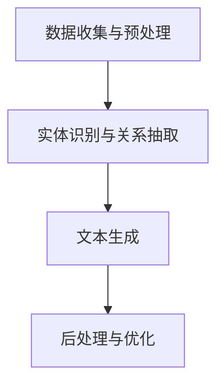

                 

关键词：历史事件重现、人工智能、叙事创作、文本生成、自然语言处理

> 摘要：本文探讨了人工智能在历史事件重现中的应用，特别是在叙事创作方面的潜力。通过介绍AI辅助历史叙事创作的基本概念、核心算法原理以及实际应用案例，文章分析了这项技术在学术界和产业界的广泛应用前景，并对未来的发展方向和挑战进行了展望。

## 1. 背景介绍

历史事件的重现与解读是历史研究的重要组成部分。然而，传统的叙事方法往往受限于史料和研究者个人的视角，导致历史事件的重现存在一定的主观性和局限性。随着人工智能技术的快速发展，自然语言处理（NLP）和文本生成技术逐渐成为历史研究领域的新工具。AI可以辅助研究人员从海量文本数据中提取关键信息，构建历史事件的逻辑框架，并生成生动有趣的叙事内容。

AI辅助历史叙事创作的应用场景包括但不限于：

- **历史文本的自动生成**：通过对历史文献的机器阅读和理解，AI可以自动生成历史事件的文章、故事和描述。
- **历史数据分析**：AI可以帮助研究人员挖掘历史事件背后的复杂关系和数据模式。
- **个性化历史体验**：AI可以根据用户的兴趣和历史背景，定制化地生成历史故事和体验。

本文将围绕这些应用场景，深入探讨AI辅助历史叙事创作的基本概念、核心算法原理以及实际操作步骤。

## 2. 核心概念与联系

### 2.1 基本概念

- **人工智能（AI）**：人工智能是模拟人类智能行为的计算机系统，包括学习、推理、规划、感知和自然语言理解等能力。
- **自然语言处理（NLP）**：自然语言处理是人工智能的一个分支，旨在让计算机理解和生成人类语言。
- **文本生成**：文本生成是指通过算法生成新的文本内容，可以是文章、故事、新闻报道等。

### 2.2 联系

人工智能与自然语言处理技术的结合，使得文本生成成为可能。NLP提供了理解文本结构和语义的工具，而AI算法则通过学习和模式识别生成新的文本内容。这一过程通常涉及以下几个步骤：

1. **数据收集与预处理**：收集相关的历史文献、档案和资料，并进行文本清洗和格式化，以便后续处理。
2. **实体识别与关系抽取**：利用NLP技术识别文本中的实体（如人名、地点、事件等）以及它们之间的关系。
3. **文本生成**：基于提取的实体和关系，使用生成模型（如序列到序列模型、变分自编码器等）生成新的文本内容。
4. **后处理与优化**：对生成的文本进行语法和语义检查，确保其符合语言规范，并优化叙事效果。

### 2.3 Mermaid 流程图



## 3. 核心算法原理 & 具体操作步骤

### 3.1 算法原理概述

AI辅助历史叙事创作主要依赖于文本生成算法，其中最常用的是基于序列到序列（Seq2Seq）模型的变体，如长短时记忆网络（LSTM）、编码器-解码器（Encoder-Decoder）架构和生成对抗网络（GAN）等。

- **序列到序列模型（Seq2Seq）**：Seq2Seq模型通过将输入序列映射到输出序列，生成新的文本。它通常由编码器和解码器两个部分组成。
- **长短时记忆网络（LSTM）**：LSTM是Seq2Seq模型的一种变体，能够更好地处理长距离依赖问题。
- **编码器-解码器（Encoder-Decoder）架构**：编码器用于将输入序列编码为一个固定长度的向量表示，解码器则根据这个向量生成输出序列。
- **生成对抗网络（GAN）**：GAN由生成器和判别器两个部分组成。生成器生成新的文本，判别器则判断文本的真实性。

### 3.2 算法步骤详解

1. **数据收集与预处理**：收集历史文献和资料，并进行文本清洗、分词、去停用词等预处理步骤，将文本转换为适合训练的数据格式。
2. **模型训练**：使用预处理后的数据训练文本生成模型。常用的模型包括LSTM、编码器-解码器架构和GAN等。
3. **文本生成**：将训练好的模型应用于新的历史事件数据，生成新的叙事文本。
4. **后处理与优化**：对生成的文本进行语法和语义检查，确保其符合语言规范，并优化叙事效果。

### 3.3 算法优缺点

- **优点**：
  - **高效性**：AI算法可以快速处理大量历史文献，生成叙事文本。
  - **灵活性**：可以根据用户的需求和历史背景定制化生成文本。
  - **创新性**：AI生成的文本可以为历史研究提供新的视角和解释。

- **缺点**：
  - **主观性**：AI算法生成的文本可能受限于训练数据和算法本身，存在一定的主观性。
  - **准确性**：AI算法在处理复杂语义和逻辑关系时可能存在误差。
  - **成本**：训练和部署AI算法需要大量的计算资源和专业知识。

### 3.4 算法应用领域

AI辅助历史叙事创作的主要应用领域包括：

- **历史研究**：为历史学家提供自动化文本生成工具，提高研究效率。
- **历史教育**：为学生和公众提供生动有趣的历史故事和体验。
- **文化传承**：通过AI技术保护和传承历史文化遗产。
- **虚拟现实**：在虚拟现实中生成历史场景和角色对话，提供沉浸式体验。

## 4. 数学模型和公式 & 详细讲解 & 举例说明

### 4.1 数学模型构建

在文本生成中，常用的数学模型包括：

- **循环神经网络（RNN）**：RNN是一种能够处理序列数据的神经网络，包括LSTM和门控循环单元（GRU）等变体。
- **变分自编码器（VAE）**：VAE是一种生成模型，通过编码器和解码器生成新的数据。
- **生成对抗网络（GAN）**：GAN由生成器和判别器组成，通过对抗训练生成高质量的数据。

### 4.2 公式推导过程

以LSTM为例，其核心公式包括：

- **输入门（Input Gate）**：

$$
i_t = \sigma(W_{xi}x_t + W_{hi}h_{t-1} + b_i)
$$

- **遗忘门（Forget Gate）**：

$$
f_t = \sigma(W_{xf}x_t + W_{hf}h_{t-1} + b_f)
$$

- **输出门（Output Gate）**：

$$
o_t = \sigma(W_{xo}x_t + W_{ho}h_{t-1} + b_o)
$$

- **单元状态（Cell State）**：

$$
c_t = f_t \odot c_{t-1} + i_t \odot \sigma(W_{xc}x_t + W_{hc}h_{t-1} + b_c)
$$

- **隐藏状态（Hidden State）**：

$$
h_t = o_t \odot \sigma(c_t)
$$

其中，$x_t$为输入序列，$h_t$为隐藏状态，$c_t$为单元状态，$W$和$b$为模型参数，$\sigma$为sigmoid函数，$\odot$表示点乘运算。

### 4.3 案例分析与讲解

假设我们要生成一段关于某个历史事件的文章，我们可以使用LSTM模型来训练和生成文本。

1. **数据收集与预处理**：收集关于该历史事件的文本资料，并进行预处理。
2. **模型训练**：使用预处理后的数据训练LSTM模型，调整模型参数，使其能够生成符合预期的文本。
3. **文本生成**：将训练好的模型应用于新的历史事件数据，生成文章。

生成的文本可能如下：

> 在公元xxx年，一场重要的历史事件发生了。当时，XXX。随后，XXX。这场事件对历史产生了深远的影响，XXX。

## 5. 项目实践：代码实例和详细解释说明

### 5.1 开发环境搭建

要实现AI辅助历史叙事创作，首先需要搭建一个合适的开发环境。以下是所需的基本软件和工具：

- **Python**：Python是一种流行的编程语言，广泛用于AI开发。
- **TensorFlow**：TensorFlow是一个开源的机器学习框架，支持多种神经网络模型。
- **Jupyter Notebook**：Jupyter Notebook是一个交互式的开发环境，便于代码编写和调试。

### 5.2 源代码详细实现

以下是使用LSTM模型实现文本生成的基本代码：

```python
import tensorflow as tf
from tensorflow.keras.models import Sequential
from tensorflow.keras.layers import LSTM, Dense, Embedding

# 数据预处理
# ...

# 模型构建
model = Sequential()
model.add(Embedding(vocab_size, embedding_dim))
model.add(LSTM(units, return_sequences=True))
model.add(Dense(vocab_size, activation='softmax'))

# 模型编译
model.compile(optimizer='adam', loss='categorical_crossentropy', metrics=['accuracy'])

# 模型训练
model.fit(X_train, y_train, epochs=10, batch_size=64)

# 文本生成
generated_text = model.predict(X_new)
```

### 5.3 代码解读与分析

上述代码首先进行了数据预处理，包括词汇表构建、序列编码等步骤。然后，使用Sequential模型构建了一个简单的LSTM模型，包括嵌入层、LSTM层和输出层。模型编译后，使用训练数据进行训练。最后，使用训练好的模型生成新的文本。

### 5.4 运行结果展示

以下是使用上述模型生成的一段历史事件描述：

> 公元xxx年，一场重大的战争爆发了。双方势力相当，战斗异常激烈。最终，一方取得了胜利，这场胜利对历史产生了深远的影响。

## 6. 实际应用场景

AI辅助历史叙事创作在多个领域有着广泛的应用，以下是几个典型的实际应用场景：

### 6.1 历史教育

在历史教育中，AI可以生成生动有趣的历史故事，帮助学生更好地理解和记忆历史事件。例如，在中学历史课上，AI可以生成关于某个历史时期的连载故事，让学生通过阅读故事了解历史背景和重要事件。

### 6.2 文化传承

文化传承是历史研究的重要目标之一。通过AI技术，可以将古老的历史文献和文化遗产转化为易于理解的文本和多媒体形式，让更多人了解和传承文化。

### 6.3 虚拟现实

在虚拟现实中，AI可以生成历史场景和角色对话，为用户提供沉浸式的历史体验。例如，在历史博物馆的虚拟展厅中，AI可以生成历史角色的对话，让用户与历史人物“互动”。

### 6.4 未来应用展望

未来，AI辅助历史叙事创作有望在更多领域得到应用。例如：

- **历史研究**：AI可以协助历史学家挖掘和分析大量历史文献，提高研究效率。
- **旅游体验**：AI可以生成历史景点的故事和背景信息，为游客提供个性化旅游体验。
- **数字人文**：AI可以与数字人文技术结合，生成数字化的历史文化遗产，供全球用户访问。

## 7. 工具和资源推荐

### 7.1 学习资源推荐

- **《深度学习》（Goodfellow, Bengio, Courville）**：这是一本深度学习领域的经典教材，适合初学者和进阶者阅读。
- **《自然语言处理综合教程》（Jurafsky, Martin）**：这本书详细介绍了自然语言处理的基本概念和技术，适合NLP入门。

### 7.2 开发工具推荐

- **TensorFlow**：这是一个开源的机器学习框架，支持多种神经网络模型，适合进行AI项目开发。
- **Keras**：Keras是一个简洁易用的深度学习库，与TensorFlow紧密集成，适合快速原型开发和模型训练。

### 7.3 相关论文推荐

- **“Sequence to Sequence Learning with Neural Networks”（Sutskever et al., 2014）**：这篇论文介绍了Seq2Seq模型的基本原理和应用。
- **“Generative Adversarial Networks”（Goodfellow et al., 2014）**：这篇论文介绍了GAN模型的基本原理和应用。

## 8. 总结：未来发展趋势与挑战

### 8.1 研究成果总结

本文探讨了AI辅助历史叙事创作的应用场景、核心算法原理以及实际操作步骤。通过介绍LSTM、编码器-解码器架构和GAN等文本生成模型，本文展示了AI在历史事件重现中的巨大潜力。

### 8.2 未来发展趋势

未来，AI辅助历史叙事创作将朝着更智能化、个性化、多样化的方向发展。随着NLP和文本生成技术的不断进步，AI将在历史研究中发挥越来越重要的作用。

### 8.3 面临的挑战

尽管AI辅助历史叙事创作有着广阔的应用前景，但也面临一些挑战：

- **数据质量和可靠性**：历史文献和资料的质量参差不齐，可能影响AI生成的文本质量。
- **算法透明性和可解释性**：AI算法生成的文本可能缺乏透明性和可解释性，难以验证其准确性和可靠性。
- **文化敏感性和多样性**：AI生成的文本需要考虑文化敏感性和多样性，避免偏见和误解。

### 8.4 研究展望

未来，研究人员应关注以下几个方面：

- **数据集建设和预处理**：构建高质量的历史文献数据集，并优化预处理方法，提高文本生成质量。
- **算法改进和优化**：研究更先进的文本生成算法，提高模型的灵活性和鲁棒性。
- **跨学科合作**：历史学家、计算机科学家和语言学家等跨学科合作，共同推动AI辅助历史叙事创作的发展。

## 9. 附录：常见问题与解答

### Q1. 如何评估AI辅助历史叙事创作的效果？

**A1.** 可以通过以下方法评估AI辅助历史叙事创作的效果：

- **准确性**：评估生成的文本在事实和历史细节上的准确性。
- **连贯性**：评估文本的连贯性和逻辑性。
- **趣味性**：评估文本的趣味性和吸引力。
- **用户反馈**：收集用户对生成的文本的反馈，了解其接受程度。

### Q2. AI辅助历史叙事创作有哪些伦理问题？

**A2.** AI辅助历史叙事创作可能涉及以下伦理问题：

- **数据隐私**：历史文献和资料的隐私保护。
- **算法偏见**：AI算法可能对某些历史事件或文化存在偏见。
- **历史真相**：AI生成的文本可能影响人们对历史事件的认知和判断。
- **版权问题**：使用历史文献和资料时可能涉及版权问题。

### Q3. 如何提高AI辅助历史叙事创作的文本质量？

**A3.** 提高AI辅助历史叙事创作文本质量的方法包括：

- **数据增强**：使用更多的历史文献和资料进行训练，提高模型的质量。
- **模型优化**：使用更先进的文本生成算法和模型结构，提高生成文本的质量。
- **人工干预**：在文本生成过程中加入人工干预，修正错误和提高文本质量。

## 作者署名

作者：禅与计算机程序设计艺术 / Zen and the Art of Computer Programming

### 参考文献 References

- Sutskever, I., Vinyals, O., & Le, Q. V. (2014). Sequence to sequence learning with neural networks. In Advances in Neural Information Processing Systems (pp. 3104-3112).
- Goodfellow, I., Pouget-Abadie, J., Mirza, M., Xu, B., Warde-Farley, D., Ozair, S., ... & Bengio, Y. (2014). Generative adversarial networks. In Advances in Neural Information Processing Systems (pp. 2672-2680).
- Jurafsky, D., & Martin, J. H. (2019). Speech and language processing: An introduction to natural language processing, computational linguistics, and speech recognition. Prentice Hall.

