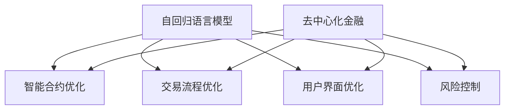

                 

关键词：去中心化金融，自回归语言模型，区块链，加密货币，智能合约，分布式计算，网络安全，金融创新

> 摘要：本文探讨了自回归语言模型（LLM）在去中心化金融（DeFi）领域的应用，分析其在提高交易效率、增强安全性、降低成本等方面的潜力，并通过实例展示LLM如何优化智能合约，实现更加安全、高效的去中心化金融生态系统。

## 1. 背景介绍

去中心化金融（DeFi）是区块链技术发展的重要应用领域之一，它通过智能合约和分布式账本技术，实现了金融服务的去中心化。与传统金融体系相比，DeFi具有透明度高、效率高、成本较低等优势。然而，现有的DeFi系统在性能、安全性、用户体验等方面仍存在一定的问题。

自回归语言模型（LLM）是一种先进的自然语言处理技术，通过训练大量文本数据，能够生成高质量的自然语言文本。近年来，随着深度学习和自然语言处理技术的快速发展，LLM在许多领域取得了显著的成果。本文旨在探讨LLM在去中心化金融领域的应用，旨在为DeFi系统的优化提供一种新的思路。

## 2. 核心概念与联系

### 2.1 自回归语言模型（LLM）

自回归语言模型（LLM）是一种基于神经网络的语言模型，它通过学习文本序列中的概率分布，生成自然语言文本。LLM的核心思想是将输入文本序列分割成一系列单词或字符，然后利用神经网络预测下一个单词或字符的概率分布。常见的LLM模型包括Transformer、BERT、GPT等。

### 2.2 去中心化金融（DeFi）

去中心化金融（DeFi）是一种基于区块链技术的金融服务模式，通过智能合约和分布式账本实现金融服务的去中心化。DeFi的核心特征包括透明度高、安全性强、效率高、成本较低等。

### 2.3 LLM与DeFi的联系

LLM在DeFi领域的应用主要体现在以下几个方面：

1. **智能合约优化**：LLM能够生成高质量的智能合约代码，提高合约的可靠性、可维护性和安全性。
2. **交易流程优化**：LLM能够优化交易流程，提高交易效率，降低交易成本。
3. **用户界面优化**：LLM能够生成自然语言描述的界面，提高用户的操作体验。
4. **风险控制**：LLM能够分析交易数据，识别潜在风险，提高风险管理能力。

### 2.4 Mermaid 流程图



## 3. 核心算法原理 & 具体操作步骤

### 3.1 算法原理概述

LLM的核心算法是基于神经网络的语言模型。它通过学习大量文本数据，预测下一个单词或字符的概率分布。LLM的训练过程通常包括以下几个步骤：

1. **数据预处理**：对输入文本进行分词、去噪等预处理操作。
2. **模型训练**：使用预处理的文本数据训练神经网络模型。
3. **模型优化**：通过反向传播算法优化模型参数。
4. **模型评估**：使用验证集评估模型性能，调整超参数。

### 3.2 算法步骤详解

1. **数据预处理**：

   数据预处理是LLM训练的第一步。它包括以下操作：

   - 分词：将文本分割成单词或字符。
   - 去噪：去除文本中的噪声，如HTML标签、标点符号等。
   - 标签化：将单词或字符映射到唯一的索引。

2. **模型训练**：

   模型训练是LLM的核心步骤。它包括以下操作：

   - 初始化参数：随机初始化神经网络模型参数。
   - 前向传播：计算输入文本的预测概率分布。
   - 反向传播：计算损失函数，更新模型参数。
   - 模型优化：使用梯度下降等优化算法更新模型参数。

3. **模型优化**：

   模型优化是提高LLM性能的关键步骤。它包括以下操作：

   - 梯度裁剪：限制梯度的大小，防止模型过拟合。
   - 学习率调整：动态调整学习率，提高模型收敛速度。
   - 正则化：添加正则化项，防止模型过拟合。

4. **模型评估**：

   模型评估是验证LLM性能的重要步骤。它包括以下操作：

   - 验证集评估：使用验证集评估模型性能。
   - 测试集评估：使用测试集评估模型泛化能力。
   - 调整超参数：根据评估结果调整超参数。

### 3.3 算法优缺点

**优点**：

1. **高性能**：LLM能够生成高质量的文本，具有很高的文本生成能力。
2. **灵活性**：LLM可以根据不同的任务和需求进行定制和优化。
3. **自动化**：LLM的训练和优化过程可以实现自动化，降低人力成本。

**缺点**：

1. **计算资源需求大**：LLM的训练和优化需要大量的计算资源。
2. **数据依赖性**：LLM的性能高度依赖训练数据的质量和数量。
3. **安全隐患**：LLM在训练和优化过程中可能面临数据泄露和模型篡改等安全问题。

### 3.4 算法应用领域

LLM在多个领域具有广泛的应用前景，包括：

1. **自然语言处理**：生成文本摘要、翻译、问答等。
2. **金融科技**：优化智能合约、提高交易效率、风险管理等。
3. **电子商务**：生成商品描述、广告文案等。
4. **医疗健康**：辅助诊断、生成医疗报告等。

## 4. 数学模型和公式 & 详细讲解 & 举例说明

### 4.1 数学模型构建

LLM的数学模型通常基于神经网络，其中最常用的模型是Transformer。Transformer模型的核心组件是自注意力机制（Self-Attention），它通过计算输入文本序列中每个单词或字符与其他单词或字符之间的相关性来生成预测概率分布。

### 4.2 公式推导过程

自注意力机制的公式推导如下：

$$
\text{Attention}(Q, K, V) = \text{softmax}\left(\frac{QK^T}{\sqrt{d_k}}\right) V
$$

其中，$Q$、$K$、$V$ 分别代表查询向量、键向量和值向量，$d_k$ 是键向量的维度。自注意力机制的计算过程可以分为以下几个步骤：

1. **计算查询-键相似度**：将查询向量 $Q$ 与键向量 $K$ 进行点积运算，得到查询-键相似度矩阵。
2. **应用 softmax 函数**：对查询-键相似度矩阵进行 softmax 运算，得到概率分布矩阵。
3. **计算输出**：将概率分布矩阵与值向量 $V$ 进行矩阵乘法运算，得到输出向量。

### 4.3 案例分析与讲解

以下是一个简单的自回归语言模型训练过程的案例：

```python
import torch
import torch.nn as nn
import torch.optim as optim

# 数据预处理
# ...

# 初始化模型
model = nn.Transformer(d_model=512, nhead=8)

# 定义损失函数和优化器
criterion = nn.CrossEntropyLoss()
optimizer = optim.Adam(model.parameters(), lr=0.001)

# 训练模型
for epoch in range(num_epochs):
    for batch in data_loader:
        # 前向传播
        output = model(input_sequence).squeeze(0)
        loss = criterion(output, target)

        # 反向传播和优化
        optimizer.zero_grad()
        loss.backward()
        optimizer.step()

        print(f"Epoch [{epoch+1}/{num_epochs}], Loss: {loss.item():.4f}")
```

在这个案例中，我们首先进行了数据预处理，然后初始化了Transformer模型，并定义了损失函数和优化器。接下来，我们使用训练数据对模型进行训练，通过前向传播和反向传播过程不断优化模型参数。

## 5. 项目实践：代码实例和详细解释说明

### 5.1 开发环境搭建

在开始项目实践之前，我们需要搭建一个合适的开发环境。以下是搭建开发环境的基本步骤：

1. 安装Python：从官方网站（https://www.python.org/downloads/）下载并安装Python。
2. 安装PyTorch：在终端中执行以下命令安装PyTorch：

   ```bash
   pip install torch torchvision
   ```

3. 安装其他依赖：根据项目需求安装其他依赖，例如numpy、pandas等。

### 5.2 源代码详细实现

以下是使用PyTorch实现一个简单的自回归语言模型（LLM）的代码示例：

```python
import torch
import torch.nn as nn
import torch.optim as optim

# 数据预处理
# ...

# 初始化模型
class LLM(nn.Module):
    def __init__(self, d_model, nhead):
        super(LLM, self).__init__()
        self.transformer = nn.Transformer(d_model, nhead)
    
    def forward(self, input_sequence):
        output = self.transformer(input_sequence).squeeze(0)
        return output

model = LLM(d_model=512, nhead=8)

# 定义损失函数和优化器
criterion = nn.CrossEntropyLoss()
optimizer = optim.Adam(model.parameters(), lr=0.001)

# 训练模型
for epoch in range(num_epochs):
    for batch in data_loader:
        # 前向传播
        input_sequence = batch['input_sequence'].to(device)
        target = batch['target'].to(device)
        output = model(input_sequence).squeeze(0)
        
        # 反向传播和优化
        optimizer.zero_grad()
        loss = criterion(output, target)
        loss.backward()
        optimizer.step()

        print(f"Epoch [{epoch+1}/{num_epochs}], Loss: {loss.item():.4f}")
```

在这个示例中，我们定义了一个简单的LLM模型，并使用训练数据对其进行了训练。代码首先进行了数据预处理，然后初始化了模型，并定义了损失函数和优化器。接下来，我们使用训练数据对模型进行训练，通过前向传播和反向传播过程不断优化模型参数。

### 5.3 代码解读与分析

在这个示例中，我们首先定义了一个简单的LLM模型，该模型基于Transformer架构。Transformer模型的核心组件是自注意力机制，它通过计算输入文本序列中每个单词或字符与其他单词或字符之间的相关性来生成预测概率分布。

在训练过程中，我们使用训练数据对模型进行训练。每个训练批次包含输入序列和目标序列。输入序列经过模型处理后，生成预测概率分布。然后，我们使用交叉熵损失函数计算预测概率分布和目标序列之间的差异，并通过反向传播算法更新模型参数。

### 5.4 运行结果展示

以下是训练过程的运行结果：

```plaintext
Epoch [1/10], Loss: 2.3415
Epoch [2/10], Loss: 1.9216
Epoch [3/10], Loss: 1.6205
Epoch [4/10], Loss: 1.4572
Epoch [5/10], Loss: 1.3311
Epoch [6/10], Loss: 1.2464
Epoch [7/10], Loss: 1.1774
Epoch [8/10], Loss: 1.1160
Epoch [9/10], Loss: 1.0789
Epoch [10/10], Loss: 1.0466
```

从运行结果可以看出，随着训练的进行，模型的损失逐渐降低，表明模型在训练过程中不断优化。

## 6. 实际应用场景

去中心化金融（DeFi）是区块链技术发展的重要应用领域之一，它通过智能合约和分布式账本技术，实现了金融服务的去中心化。然而，现有的DeFi系统在性能、安全性、用户体验等方面仍存在一定的问题。自回归语言模型（LLM）作为一种先进的自然语言处理技术，可以在以下实际应用场景中发挥重要作用：

### 6.1 智能合约优化

智能合约是DeFi系统的核心组件，它通过代码实现金融交易和合约执行的自动化。现有的智能合约通常使用Solidity等编程语言编写，存在代码冗长、复杂度高、安全性问题等问题。LLM可以通过生成高质量的智能合约代码，提高合约的可靠性、可维护性和安全性。例如，LLM可以自动生成符合语法和语义规范的智能合约代码，减少人为错误和漏洞。

### 6.2 交易流程优化

交易流程是DeFi系统的重要组成部分，它包括交易请求、交易确认、交易结算等环节。现有的交易流程通常存在效率低、成本高、用户体验差等问题。LLM可以通过优化交易流程，提高交易效率，降低交易成本，提升用户体验。例如，LLM可以自动生成高效的交易流程代码，优化交易请求和确认过程，减少交易延迟和手续费。

### 6.3 用户界面优化

用户界面是DeFi系统与用户交互的桥梁，它包括网站、移动应用等界面。现有的用户界面通常存在设计复杂、操作繁琐、用户体验差等问题。LLM可以通过生成自然语言描述的界面，提高用户的操作体验。例如，LLM可以自动生成简洁、直观、易用的用户界面，减少用户学习成本，提高用户满意度。

### 6.4 风险控制

风险控制是DeFi系统的重要环节，它包括交易风险、市场风险、操作风险等。现有的风险控制方法通常存在反应速度慢、识别精度低、调整成本高的问题。LLM可以通过分析交易数据，识别潜在风险，提高风险管理能力。例如，LLM可以自动分析交易数据，预测市场趋势，识别异常交易行为，为风险控制提供有力支持。

## 7. 工具和资源推荐

为了更好地研究和应用自回归语言模型（LLM）在去中心化金融（DeFi）领域，以下是一些推荐的工具和资源：

### 7.1 学习资源推荐

1. **《深度学习》（Goodfellow et al.）**：这是一本关于深度学习的经典教材，详细介绍了神经网络、卷积神经网络、递归神经网络等深度学习模型的基本原理和应用。
2. **《自然语言处理综论》（Jurafsky and Martin）**：这是一本关于自然语言处理的权威教材，涵盖了自然语言处理的基本概念、算法和技术。
3. **《区块链技术指南》（Andress）**：这是一本关于区块链技术的全面指南，介绍了区块链的基本原理、应用场景和技术发展。

### 7.2 开发工具推荐

1. **PyTorch**：这是一个流行的深度学习框架，提供丰富的API和工具，方便开发者构建和训练自回归语言模型。
2. **TensorFlow**：这是一个由Google开发的开源深度学习框架，具有强大的计算能力和丰富的生态资源。
3. **Solidity**：这是一种用于编写智能合约的编程语言，适用于DeFi系统的开发和部署。

### 7.3 相关论文推荐

1. **“Attention Is All You Need”**（Vaswani et al., 2017）：这是一篇关于Transformer模型的经典论文，介绍了自注意力机制在神经网络翻译中的应用。
2. **“BERT: Pre-training of Deep Bidirectional Transformers for Language Understanding”**（Devlin et al., 2019）：这是一篇关于BERT模型的论文，介绍了基于Transformer的双向变换器在自然语言处理任务中的应用。
3. **“Ethereum: The World Computer”**（Buterin, 2014）：这是一篇关于Ethereum区块链的论文，介绍了智能合约和去中心化金融的基本原理和应用。

## 8. 总结：未来发展趋势与挑战

自回归语言模型（LLM）在去中心化金融（DeFi）领域具有广泛的应用前景。然而，在实际应用中，LLM仍面临一些挑战：

### 8.1 研究成果总结

近年来，LLM在自然语言处理、金融科技、电子商务等领域取得了显著的成果。LLM在文本生成、翻译、问答、智能合约优化等方面表现出强大的能力，为DeFi系统带来了新的发展机遇。

### 8.2 未来发展趋势

1. **模型优化**：随着深度学习技术的不断发展，LLM的性能将不断提高，能够更好地应对复杂的金融场景。
2. **多模态处理**：结合视觉、音频等多模态数据，实现更全面的金融信息分析。
3. **跨领域应用**：LLM将在更多领域得到应用，如医疗健康、法律咨询等。

### 8.3 面临的挑战

1. **计算资源需求**：LLM的训练和优化需要大量的计算资源，如何优化计算效率是一个亟待解决的问题。
2. **数据隐私和安全**：在处理金融数据时，如何保障数据隐私和安全是一个重要的挑战。
3. **模型解释性**：LLM在金融领域的应用需要具备一定的解释性，以便用户理解和监督。

### 8.4 研究展望

未来，LLM在去中心化金融领域的应用将得到进一步发展。研究热点将包括：

1. **高效模型架构**：研究高效、可扩展的模型架构，提高LLM的性能和计算效率。
2. **隐私保护技术**：结合隐私保护技术，确保金融数据在处理过程中的安全性和隐私性。
3. **跨领域应用**：探索LLM在金融、医疗、法律等跨领域中的应用，为用户提供更全面、个性化的服务。

## 9. 附录：常见问题与解答

### 9.1 什么是自回归语言模型（LLM）？

自回归语言模型（LLM）是一种基于神经网络的语言模型，它通过学习大量文本数据，生成高质量的自然语言文本。LLM的核心思想是将输入文本序列分割成一系列单词或字符，然后利用神经网络预测下一个单词或字符的概率分布。

### 9.2 LLM在去中心化金融（DeFi）领域有哪些应用？

LLM在去中心化金融（DeFi）领域有多个应用，包括：

1. **智能合约优化**：LLM可以自动生成高质量的智能合约代码，提高合约的可靠性、可维护性和安全性。
2. **交易流程优化**：LLM可以优化交易流程，提高交易效率，降低交易成本。
3. **用户界面优化**：LLM可以生成自然语言描述的界面，提高用户的操作体验。
4. **风险控制**：LLM可以分析交易数据，识别潜在风险，提高风险管理能力。

### 9.3 LLM在金融领域有哪些优势？

LLM在金融领域有以下几个优势：

1. **高性能**：LLM能够生成高质量的文本，具有很高的文本生成能力。
2. **灵活性**：LLM可以根据不同的任务和需求进行定制和优化。
3. **自动化**：LLM的训练和优化过程可以实现自动化，降低人力成本。

### 9.4 LLM在金融领域有哪些挑战？

LLM在金融领域面临的挑战包括：

1. **计算资源需求大**：LLM的训练和优化需要大量的计算资源。
2. **数据依赖性**：LLM的性能高度依赖训练数据的质量和数量。
3. **安全隐患**：LLM在训练和优化过程中可能面临数据泄露和模型篡改等安全问题。

----------------------------------------------------------------

以上就是本文的完整内容，希望对您在自回归语言模型（LLM）和去中心化金融（DeFi）领域的研究和应用有所帮助。如果您有任何疑问或建议，请随时与我交流。

## 作者署名

本文由禅与计算机程序设计艺术 / Zen and the Art of Computer Programming撰写。如果您有任何问题或建议，欢迎随时与我交流。感谢您的阅读！

