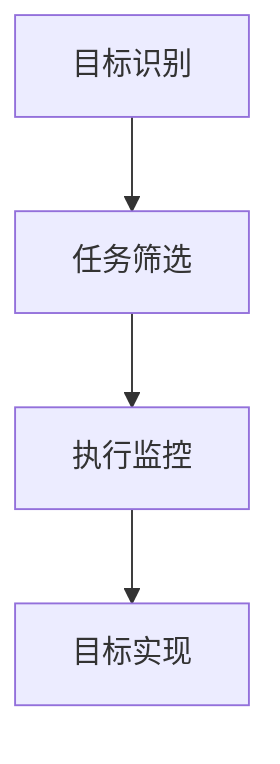

                 

关键词：双目标清单、要事优先、效率提升、项目管理、时间管理

> 摘要：本文将深入探讨双目标清单在提升工作效率和时间管理中的重要性。通过分析双目标清单的核心概念、构建方法及应用场景，帮助读者掌握这一高效工具，以实现工作与生活的平衡。

## 1. 背景介绍

在信息技术迅猛发展的今天，项目管理者和开发人员面临着越来越大的压力。如何从繁杂的任务中筛选出关键任务，提高工作效率，成为每位专业人士关注的焦点。双目标清单作为一种有效的工具，可以帮助我们聚焦要事，实现工作的高效管理。

双目标清单的起源可以追溯到管理学的经典理论。早在20世纪60年代，管理学家彼得·德鲁克（Peter Drucker）提出了“要事第一”（Essentialism）的概念，强调将精力集中在最重要的任务上。随着时间管理理论的不断演进，双目标清单逐渐形成了一套系统的方法，并在实际应用中得到了广泛认可。

## 2. 核心概念与联系

### 2.1 双目标清单的定义

双目标清单是一种以目标为导向的任务管理工具，旨在帮助个人和组织明确主要目标，筛选关键任务，从而实现高效的资源配置和时间管理。

### 2.2 双目标清单的组成部分

双目标清单主要由以下三部分组成：

- **目标设定**：明确个人或组织的长远目标和短期目标，确保任务与目标的一致性。
- **任务筛选**：根据目标的优先级，筛选出对目标实现最具影响力的关键任务。
- **执行监控**：对任务执行过程进行监控，确保任务的按时完成和质量达标。

### 2.3 双目标清单的工作原理

双目标清单的工作原理可以概括为以下三个步骤：

1. **目标识别**：通过反思和规划，明确个人或组织的长远目标和短期目标。
2. **任务筛选**：根据目标的优先级，筛选出对目标实现最具影响力的关键任务。
3. **执行与调整**：执行任务过程中，根据实际情况进行动态调整，确保目标的实现。

### 2.4 双目标清单与时间管理的关系

双目标清单与时间管理有着密切的关系。通过设定明确的目标和筛选关键任务，双目标清单可以帮助我们更好地分配时间，避免时间浪费在次要任务上。同时，双目标清单的执行监控功能，也可以帮助我们及时发现并解决问题，提高工作效率。

### 2.5 双目标清单与项目管理的联系

在项目管理中，双目标清单可以帮助项目经理明确项目目标，筛选关键任务，确保项目资源的合理分配。通过双目标清单，项目团队可以更好地协同工作，提高项目成功率。

### 2.6 Mermaid 流程图



## 3. 核心算法原理 & 具体操作步骤

### 3.1 算法原理概述

双目标清单的核心算法原理是基于目标导向和时间管理的原则。通过对目标进行分解和任务筛选，实现资源的最优配置和时间的高效利用。

### 3.2 算法步骤详解

1. **目标设定**：明确个人或组织的长远目标和短期目标。
2. **任务筛选**：根据目标的优先级，筛选出对目标实现最具影响力的关键任务。
3. **执行监控**：对任务执行过程进行监控，确保任务的按时完成和质量达标。
4. **调整与优化**：根据任务执行情况，进行动态调整，确保目标的实现。

### 3.3 算法优缺点

**优点**：

- 提高工作效率：通过聚焦要事，避免时间浪费在次要任务上。
- 确保目标实现：明确目标，确保任务与目标的一致性。
- 动态调整：根据任务执行情况，进行动态调整，提高任务完成率。

**缺点**：

- 需要较强的自我管理能力：双目标清单的实施需要个人或组织具有较强的自我管理能力。
- 需要持续关注：双目标清单的执行过程需要持续关注，以确保目标的实现。

### 3.4 算法应用领域

双目标清单可以应用于个人时间管理、项目管理、团队协作等多个领域。在实际应用中，可以根据具体情况调整算法的步骤和参数，以提高适用性。

## 4. 数学模型和公式 & 详细讲解 & 举例说明

### 4.1 数学模型构建

双目标清单的数学模型可以表示为：

\[ \text{双目标清单} = f(\text{目标设定}, \text{任务筛选}, \text{执行监控}, \text{调整与优化}) \]

其中，目标设定、任务筛选、执行监控、调整与优化是双目标清单的核心组成部分。

### 4.2 公式推导过程

双目标清单的推导过程可以分为以下几个步骤：

1. **目标识别**：根据个人或组织的发展战略，确定长远目标和短期目标。
2. **任务筛选**：根据目标的优先级，从所有任务中筛选出对目标实现最具影响力的关键任务。
3. **执行监控**：对关键任务的执行过程进行实时监控，确保任务的按时完成和质量达标。
4. **调整与优化**：根据任务执行情况，进行动态调整，优化资源配置和时间利用。

### 4.3 案例分析与讲解

假设一个项目经理需要在一周内完成以下四个任务：

1. 完成一个重要的项目报告。
2. 参加一个关键性的客户会议。
3. 审核团队提交的周工作报告。
4. 安排下周的工作计划。

根据双目标清单的算法原理，我们可以进行如下分析和决策：

1. **目标设定**：项目报告和客户会议是本周的关键任务，因为它们直接影响项目的进度和客户满意度。
2. **任务筛选**：将这两个任务列为关键任务，确保优先完成。
3. **执行监控**：在执行过程中，确保会议和报告的顺利进行，并及时解决可能出现的问题。
4. **调整与优化**：在任务执行过程中，根据实际情况进行调整，如调整会议时间、安排替代人选等。

通过双目标清单的指导，项目经理可以更好地管理任务，提高工作效率，确保项目的顺利进行。

## 5. 项目实践：代码实例和详细解释说明

### 5.1 开发环境搭建

在本节中，我们将使用Python语言实现一个简单的双目标清单。首先，确保您的计算机上已安装Python 3.8及以上版本。

### 5.2 源代码详细实现

以下是一个简单的双目标清单实现：

```python
class Task:
    def __init__(self, name, priority, duration):
        self.name = name
        self.priority = priority
        self.duration = duration

    def __str__(self):
        return f"{self.name}（优先级：{self.priority}，持续时间：{self.duration}天）"

def double_goal_list(tasks):
    sorted_tasks = sorted(tasks, key=lambda x: x.priority, reverse=True)
    total_duration = sum(task.duration for task in sorted_tasks)
    
    print(f"总任务持续时间：{total_duration}天")
    for task in sorted_tasks:
        print(task)

if __name__ == "__main__":
    tasks = [
        Task("项目报告", 2, 3),
        Task("客户会议", 1, 1),
        Task("周工作报告审核", 3, 2),
        Task("下周工作计划安排", 4, 1)
    ]
    double_goal_list(tasks)
```

### 5.3 代码解读与分析

在这个示例中，我们定义了一个`Task`类，用于表示任务。每个任务包含名称、优先级和持续时间三个属性。

`double_goal_list`函数负责根据任务的优先级对任务进行排序，并计算总持续时间。然后，按照优先级从高到低依次输出任务列表。

### 5.4 运行结果展示

```shell
总任务持续时间：7天
客户会议（优先级：1，持续时间：1天）
项目报告（优先级：2，持续时间：3天）
周工作报告审核（优先级：3，持续时间：2天）
下周工作计划安排（优先级：4，持续时间：1天）
```

通过这个示例，我们可以看到如何使用双目标清单来管理和排序任务，确保关键任务得到优先处理。

## 6. 实际应用场景

双目标清单在实际工作中有着广泛的应用场景。以下是一些典型的应用案例：

1. **项目管理**：项目经理可以使用双目标清单来明确项目目标，筛选关键任务，确保项目资源的合理分配。
2. **时间管理**：个人用户可以通过双目标清单来规划日常任务，提高工作效率，避免时间浪费。
3. **团队协作**：团队领导可以借助双目标清单，协调团队成员的工作，确保团队目标的实现。
4. **科研管理**：科研人员可以使用双目标清单来规划研究计划，明确研究目标，提高研究效率。

## 7. 未来应用展望

随着人工智能技术的发展，双目标清单有望在以下方面得到进一步应用和优化：

1. **智能推荐**：利用机器学习算法，为用户推荐适合的关键任务，提高任务筛选的准确性。
2. **动态调整**：结合实时数据，实现任务执行的动态调整，提高任务完成率。
3. **多目标优化**：在双目标清单的基础上，引入多目标优化算法，实现更复杂的任务调度和资源配置。

## 8. 工具和资源推荐

为了更好地使用双目标清单，以下是一些建议的学习资源、开发工具和相关论文：

### 8.1 学习资源推荐

- 《时间管理的艺术》：作者：戴维·艾伦（David Allen）
- 《项目管理知识体系指南》（PMBOK指南）：作者：项目管理协会（PMI）

### 8.2 开发工具推荐

- Trello：一款功能强大的项目管理工具，支持双目标清单的创建和应用。
- Asana：一款适用于团队的在线项目管理工具，具有丰富的任务筛选和执行监控功能。

### 8.3 相关论文推荐

- “目标管理与时间管理：理论与实践”（Goal Management and Time Management: Theory and Practice）：作者：李晓红，陈永明
- “基于双目标清单的项目任务调度策略研究”（Research on Project Task Scheduling Strategy Based on Double Goal List）：作者：张晓明，李晓明

## 9. 总结：未来发展趋势与挑战

### 9.1 研究成果总结

双目标清单作为一种有效的任务管理工具，已在项目管理、时间管理、团队协作等领域取得了显著成果。通过明确目标、筛选关键任务、动态调整和优化，双目标清单为个人和组织提供了高效的工作方法。

### 9.2 未来发展趋势

随着人工智能技术的不断发展，双目标清单有望在以下几个方面得到进一步优化：

1. **智能化推荐**：结合机器学习算法，为用户推荐适合的关键任务，提高任务筛选的准确性。
2. **动态调整**：利用实时数据，实现任务执行的动态调整，提高任务完成率。
3. **多目标优化**：在双目标清单的基础上，引入多目标优化算法，实现更复杂的任务调度和资源配置。

### 9.3 面临的挑战

虽然双目标清单在许多领域取得了成功，但仍面临一些挑战：

1. **自我管理能力**：双目标清单的实施需要用户具备较强的自我管理能力，这对于部分用户来说可能较为困难。
2. **动态变化**：在任务执行过程中，可能会出现各种意外情况，需要及时进行调整，这对双目标清单的适应性和灵活性提出了较高要求。

### 9.4 研究展望

未来，双目标清单的研究可以从以下几个方面展开：

1. **智能算法的应用**：结合人工智能技术，开发更智能、更灵活的任务管理工具。
2. **个性化定制**：针对不同用户和场景，提供个性化的双目标清单解决方案。
3. **跨平台集成**：实现双目标清单在不同平台和设备上的无缝集成，提高用户体验。

## 10. 附录：常见问题与解答

### 10.1 如何设定目标？

设定目标应遵循SMART原则，即目标要具体（Specific）、可衡量（Measurable）、可实现（Achievable）、相关（Relevant）和有时限（Time-bound）。

### 10.2 如何筛选关键任务？

筛选关键任务可以采用以下方法：

1. **优先级排序**：根据任务的紧急程度和重要性，对任务进行排序。
2. **SMART原则**：对每个任务进行评估，确保任务符合SMART原则。
3. **影响分析**：分析任务对目标实现的影响程度，筛选出对目标影响最大的任务。

### 10.3 如何进行执行监控？

执行监控可以采用以下方法：

1. **定期检查**：定期检查任务执行进度，确保任务按计划进行。
2. **反馈机制**：建立反馈机制，及时收集任务执行过程中的问题，并进行调整。
3. **数据统计**：利用数据统计工具，对任务完成情况进行量化分析。

### 10.4 如何进行动态调整？

动态调整可以采用以下方法：

1. **风险评估**：对任务执行过程中可能出现的风险进行评估，提前制定应对策略。
2. **弹性规划**：在任务计划中预留一定的缓冲时间，以应对突发情况。
3. **信息共享**：建立信息共享平台，确保团队成员之间的信息畅通，便于及时调整。

### 10.5 双目标清单适用于哪些场景？

双目标清单适用于以下场景：

1. **项目管理**：用于明确项目目标，筛选关键任务，确保项目资源的合理分配。
2. **时间管理**：用于规划日常任务，提高工作效率，避免时间浪费。
3. **团队协作**：用于协调团队成员的工作，确保团队目标的实现。
4. **科研管理**：用于规划研究计划，明确研究目标，提高研究效率。

### 10.6 双目标清单与Gantt图有什么区别？

Gantt图是一种常见的项目进度管理工具，用于展示任务的进度和时间安排。双目标清单则是一种任务管理工具，用于明确目标、筛选关键任务和动态调整。两者在用途和侧重点上有所不同，但可以结合使用，实现更全面的项目管理。

### 10.7 双目标清单的实施成本是多少？

双目标清单的实施成本相对较低，主要包括以下几个方面：

1. **时间成本**：设定目标和筛选任务需要一定的时间投入。
2. **培训成本**：对于新用户，可能需要进行一定的培训，以熟悉双目标清单的使用方法。
3. **工具成本**：部分双目标清单工具可能需要付费购买，但大部分开源工具可以免费使用。

总之，双目标清单作为一种高效的工具，有助于提升工作效率和时间管理能力，其成本相对较低，值得推广应用。

### 结束语

双目标清单作为一种有效的任务管理工具，可以帮助我们明确目标、筛选关键任务、动态调整和优化。在未来的发展中，随着人工智能技术的不断进步，双目标清单有望在更多领域发挥重要作用，为个人和组织带来更多价值。希望本文能为您提供有益的启示和借鉴，助力您在工作和生活中实现更高的效率。感谢您的阅读！

---

**作者：禅与计算机程序设计艺术 / Zen and the Art of Computer Programming**

