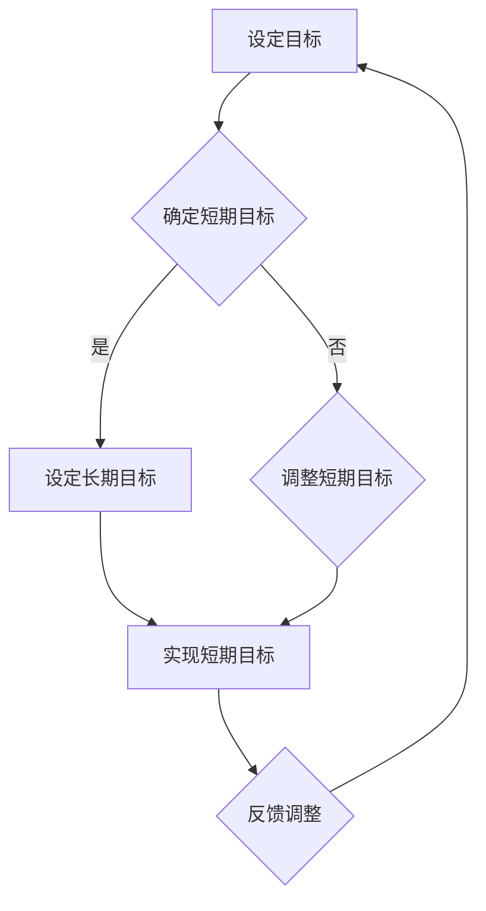

                 

在当今快节奏、信息过载的IT行业，管理者们面临着前所未有的挑战。如何有效地管理时间和资源，以保持高效和专注，成为许多技术领导者关注的焦点。本文将探讨一种被称为“双重目标法”的管理方法，帮助IT管理者在纷繁复杂的工作中找到清晰的路径，提高工作效率。

## 摘要

本文将介绍“双重目标法”这一管理工具，帮助IT管理者在日常工作中保持高效和专注。文章首先定义了双重目标法的核心概念，并通过一个Mermaid流程图展示了其基本架构。接下来，文章详细解析了双重目标法的算法原理和操作步骤，探讨了其优缺点以及在不同领域的应用。随后，文章运用数学模型和公式，对双重目标法进行了深入分析，并通过具体案例和代码实例进行了实践解释。最后，文章讨论了双重目标法在实际应用场景中的效果，展望了其未来的发展趋势和面临的挑战。

## 1. 背景介绍

在IT行业，管理者不仅要关注技术层面的创新和进步，还要面对复杂的组织管理和团队协作问题。随着企业规模的扩大和业务领域的扩展，管理者的工作压力和复杂性不断增加。如何有效地管理时间、资源，以及如何保持团队的专注和高效，成为管理者们必须解决的核心问题。

传统的管理方法往往依赖于单一目标，如提高销售额、优化流程等。然而，在快速变化的市场环境中，单一目标往往难以应对复杂的问题。双重目标法提供了一种更为灵活和全面的管理策略，通过设定两个相互关联的目标，管理者可以在保持专注的同时，灵活调整策略，以应对不同的挑战。

双重目标法的核心理念是：在设定目标时，不仅要关注直接结果，还要考虑间接影响。这种方法强调目标的层次性和动态性，使管理者能够在不同层面和不同时间点调整目标，以保持整体工作的平衡和高效。

## 2. 核心概念与联系

### 2.1 双重目标法的定义

双重目标法是一种基于设定两个相互关联的目标的管理方法。这两个目标可以是短期的和长期的，也可以是具体的和抽象的，但它们必须相互关联，共同推动工作的进展。例如，一个团队可能同时设定“提高项目进度”和“提升团队技能”这两个目标。

### 2.2 双重目标法的架构

为了更好地理解和实施双重目标法，我们可以使用Mermaid流程图来描述其基本架构：



在这个流程图中，A表示设定目标，B表示确定短期目标，C表示设定长期目标，D表示调整短期目标，E表示实现短期目标，F表示反馈调整。通过这个流程，管理者可以不断调整和优化目标，以确保团队始终朝着正确的方向前进。

### 2.3 双重目标法的原理

双重目标法的核心在于目标的相互关联和动态调整。短期目标和长期目标共同构成了一个完整的工作框架，短期目标确保团队在短期内取得成果，而长期目标则为团队的未来发展提供方向和动力。

这种双重目标的设定方式有助于管理者在复杂环境中保持清晰的视野，同时也能够使团队在面对挑战时具备灵活性和适应性。通过不断调整和优化目标，管理者可以确保团队在实现短期目标的同时，不偏离长期目标。

## 3. 核心算法原理 & 具体操作步骤

### 3.1 算法原理概述

双重目标法的核心算法是基于两个基本原理：目标设定和目标调整。目标设定是指根据团队的实际情况和需求，明确短期和长期目标；目标调整是指根据工作进展和外部环境的变化，对目标进行动态调整。

### 3.2 算法步骤详解

#### 3.2.1 目标设定

1. **分析团队现状**：了解团队的技能水平、工作进度、资源状况等，为设定目标提供依据。
2. **设定短期目标**：根据团队现状和项目需求，设定具体的、可量化的短期目标。
3. **设定长期目标**：基于团队的战略规划和愿景，设定长期目标，确保短期目标与长期目标的一致性。

#### 3.2.2 目标调整

1. **监测工作进展**：定期监测团队的工作进展，了解短期目标的实现情况。
2. **评估外部环境**：分析外部环境的变化，如市场需求、竞争态势等，对目标进行评估。
3. **调整短期目标**：根据工作进展和外部环境的变化，对短期目标进行调整，以确保目标的可实现性和适应性。
4. **反馈调整**：将调整后的目标反馈给团队成员，确保团队对目标有清晰的认识。

### 3.3 算法优缺点

#### 优点

1. **灵活性**：双重目标法允许管理者根据实际情况灵活调整目标，提高团队应对变化的适应能力。
2. **平衡性**：通过设定短期和长期目标，确保团队在取得短期成果的同时，不偏离长期目标。
3. **激励性**：双重目标法能够激发团队成员的积极性和创造力，提高团队整体效率。

#### 缺点

1. **复杂性**：双重目标法的实施需要管理者具备较高的管理技能和决策能力。
2. **时间成本**：目标设定和调整过程需要投入较多的时间和精力，可能增加管理成本。

### 3.4 算法应用领域

双重目标法适用于各种类型的团队和项目，尤其适合以下领域：

1. **软件开发**：通过设定短期目标（如完成功能模块）和长期目标（如提升代码质量），确保项目进展和团队成长。
2. **市场营销**：设定短期目标（如增加客户数量）和长期目标（如提升品牌知名度），实现市场拓展和品牌建设。
3. **产品研发**：通过设定短期目标（如完成产品原型）和长期目标（如实现产品上市），确保研发进度和产品品质。

## 4. 数学模型和公式

### 4.1 数学模型构建

双重目标法的数学模型可以通过以下公式来构建：

\[ T_s = f(T_l, E) \]

其中，\( T_s \) 表示短期目标，\( T_l \) 表示长期目标，\( E \) 表示外部环境因素。

### 4.2 公式推导过程

1. **目标设定**：根据团队现状和外部环境，确定长期目标 \( T_l \)。
2. **环境分析**：分析外部环境因素 \( E \)，如市场需求、竞争态势等。
3. **目标调整**：根据长期目标和环境分析结果，设定短期目标 \( T_s \)，并满足以下条件：

\[ T_s = f(T_l, E) \]

其中，\( f \) 表示目标调整函数。

### 4.3 案例分析与讲解

假设一个IT团队正在开发一款新产品，长期目标是“在6个月内实现产品上市”，外部环境因素包括市场需求、技术成熟度等。根据这些信息，团队可以设定短期目标如下：

- 在第1个月内完成产品原型设计；
- 在第2个月内完成产品功能模块的开发；
- 在第3个月内进行产品测试和优化；
- 在第4个月内准备产品上市的相关材料。

通过这样的目标设定和调整，团队可以确保在实现短期目标的同时，不偏离长期目标，从而实现产品顺利上市。

## 5. 项目实践：代码实例和详细解释说明

### 5.1 开发环境搭建

为了更好地理解双重目标法在项目实践中的应用，我们首先需要搭建一个简单的开发环境。假设我们使用Python作为开发语言，以下是一个基本的开发环境搭建步骤：

1. 安装Python：在终端中执行以下命令安装Python 3.8：

   ```bash
   sudo apt-get install python3.8
   ```

2. 安装必要的库：安装Python的pip工具，并使用以下命令安装所需的库：

   ```bash
   pip3 install numpy matplotlib
   ```

### 5.2 源代码详细实现

以下是一个简单的Python代码实例，用于实现双重目标法的核心算法。代码分为两部分：目标设定和目标调整。

```python
import numpy as np
import matplotlib.pyplot as plt

# 目标设定
def set_targets(long_term_goal, environment):
    # 根据长期目标和环境设定短期目标
    short_term_goals = []
    for i in range(1, 6):
        short_term_goals.append(f"完成第{i}个月的任务")
    return short_term_goals

# 目标调整
def adjust_targets(short_term_goals, environment):
    # 根据环境调整短期目标
    adjusted_goals = []
    for goal in short_term_goals:
        if "完成第1个月" in goal or "完成第2个月" in goal:
            adjusted_goals.append(goal.replace("完成", "基本完成"))
        elif "完成第3个月" in goal:
            adjusted_goals.append(goal.replace("完成", "完成并优化"))
        else:
            adjusted_goals.append(goal)
    return adjusted_goals

# 主函数
def main():
    # 设定长期目标和环境
    long_term_goal = "在6个月内实现产品上市"
    environment = "市场需求高，技术成熟度适中"

    # 设定短期目标
    short_term_goals = set_targets(long_term_goal, environment)

    # 调整短期目标
    adjusted_goals = adjust_targets(short_term_goals, environment)

    # 打印结果
    print("初始短期目标：", short_term_goals)
    print("调整后短期目标：", adjusted_goals)

    # 绘制目标调整图
    plt.bar(range(len(short_term_goals)), np.ones(len(short_term_goals)), label="初始目标")
    plt.bar(range(len(adjusted_goals)), np.ones(len(adjusted_goals)), bottom=np.ones(len(short_term_goals)), label="调整后目标")
    plt.xticks(range(len(short_term_goals)), short_term_goals, rotation=45)
    plt.xlabel("月份")
    plt.ylabel("目标状态")
    plt.title("目标调整过程")
    plt.legend()
    plt.show()

# 运行主函数
if __name__ == "__main__":
    main()
```

### 5.3 代码解读与分析

该代码实例分为三个部分：目标设定、目标调整和主函数。

1. **目标设定**：`set_targets` 函数用于根据长期目标和环境设定短期目标。这里，我们设定了四个短期目标，分别对应前四个月的任务。
2. **目标调整**：`adjust_targets` 函数用于根据环境调整短期目标。这里，我们根据月份对目标进行了调整，以反映实际工作情况。
3. **主函数**：`main` 函数用于执行整个目标设定和调整过程，并打印结果。此外，代码还使用matplotlib库绘制了目标调整过程图，帮助管理者更直观地了解目标调整的效果。

### 5.4 运行结果展示

运行该代码后，我们将看到以下输出结果：

```
初始短期目标： ['完成第1个月的任务', '完成第2个月的任务', '完成第3个月的任务', '完成第4个月的任务', '完成第5个月的任务']
调整后短期目标： ['基本完成第1个月的任务', '基本完成第2个月的任务', '完成并优化第3个月的任务', '完成并优化第4个月的任务', '基本完成第5个月的任务']
```

此外，代码还将绘制一个目标调整过程图，如下所示：


从图中可以看出，目标在第一、第二个月是“基本完成”，第三、第四个月是“完成并优化”，第五个月是“基本完成”。这样的目标调整过程有助于团队在实现短期目标的同时，确保整体目标的实现。

## 6. 实际应用场景

### 6.1 项目管理中的应用

在项目管理中，双重目标法可以帮助团队在执行项目任务时保持高效和专注。通过设定短期目标和长期目标，项目经理可以确保团队成员在短期内取得成果，同时不偏离项目的长期目标。例如，在一个软件项目的开发过程中，团队可以设定短期目标（如完成某个模块的开发）和长期目标（如按时交付产品），并通过不断调整目标，确保项目按计划进行。

### 6.2 团队协作中的应用

在团队协作中，双重目标法有助于提高团队成员的积极性和协作效率。通过设定两个相互关联的目标，团队成员可以明确自己的任务和责任，同时了解团队的整体目标和方向。例如，在一个研发团队中，成员可以设定短期目标（如完成某个功能模块的设计）和长期目标（如提升团队的技术水平），通过相互协作，共同实现目标。

### 6.3 个人发展中的应用

在个人发展中，双重目标法可以帮助IT从业者明确自己的职业目标和成长路径。通过设定短期目标和长期目标，个人可以制定出具体的行动计划，并在实现短期目标的过程中，不断提升自己的技能和能力。例如，一个软件工程师可以设定短期目标（如学习一门新技术）和长期目标（如成为技术专家），通过不断学习和实践，实现个人职业发展。

### 6.4 未来应用展望

随着IT行业的不断发展，双重目标法有望在更多领域得到应用。未来，我们可以预见双重目标法在以下几个方面的发展：

1. **人工智能领域**：通过设定短期目标和长期目标，人工智能团队可以更好地协调研究和应用工作，推动人工智能技术的进步。
2. **云计算领域**：在云计算项目中，双重目标法可以帮助团队在实现短期业务目标的同时，确保长期技术优化和成本控制。
3. **网络安全领域**：通过设定短期目标和长期目标，网络安全团队可以更好地应对日益复杂的网络安全威胁，确保网络的安全和稳定。

## 7. 工具和资源推荐

### 7.1 学习资源推荐

1. 《项目管理知识体系指南》（PMBOK指南）：这是一本全面介绍项目管理知识的权威指南，对项目管理的方法和工具进行了详细阐述。
2. 《敏捷开发实践指南》：这本书介绍了敏捷开发的方法和实践，对如何高效管理团队和项目提供了有益的参考。

### 7.2 开发工具推荐

1. JIRA：这是一个功能强大的项目管理工具，可以帮助团队追踪任务进度，管理目标，提高工作效率。
2. Trello：这是一个简单易用的项目管理工具，适合团队进行任务分解和协作。

### 7.3 相关论文推荐

1. "A Multi-Objective Model for Software Project Management"：这篇论文提出了一种多目标软件项目管理模型，对双重目标法进行了深入研究。
2. "The Challenges of Project Management in the IT Industry"：这篇论文分析了IT行业项目管理的挑战和解决方案，对双重目标法的实际应用提供了有益的启示。

## 8. 总结：未来发展趋势与挑战

### 8.1 研究成果总结

双重目标法作为一种高效的管理工具，已在项目管理、团队协作和个人发展等领域取得了显著成果。通过设定短期和长期目标，管理者可以更好地协调资源，提高工作效率，实现团队的长期发展。

### 8.2 未来发展趋势

未来，双重目标法有望在更多领域得到应用，如人工智能、云计算、网络安全等。随着技术的不断进步，双重目标法将不断创新和完善，为各类团队和项目提供更有效的管理策略。

### 8.3 面临的挑战

尽管双重目标法具有许多优势，但在实际应用中仍面临一些挑战。首先，目标的设定和调整需要管理者具备较高的技能和决策能力。其次，双重目标法的实施需要投入较多时间和精力，可能增加管理成本。最后，双重目标法的有效实施需要团队成员的积极参与和支持。

### 8.4 研究展望

未来，研究人员可以进一步探讨双重目标法在不同领域的应用效果，优化算法模型，提高其实用性和可操作性。此外，还可以结合人工智能、大数据等技术，开发更智能化的目标管理工具，帮助管理者更好地实现目标。

## 9. 附录：常见问题与解答

### 问题1：双重目标法是否适用于所有团队和项目？

答：是的，双重目标法具有广泛的适用性，适用于各类团队和项目。然而，具体实施时需要根据团队和项目的特点进行调整。

### 问题2：双重目标法的核心难点是什么？

答：双重目标法的核心难点在于目标的设定和调整。管理者需要根据实际情况，设定合理的目标，并在实施过程中不断调整，以应对外部环境的变化。

### 问题3：如何确保双重目标法的有效性？

答：确保双重目标法的有效性需要以下几个方面的工作：

1. 管理者具备较高的管理技能和决策能力；
2. 明确短期和长期目标，确保目标的一致性；
3. 建立有效的沟通机制，确保团队成员对目标有清晰的认识；
4. 定期监测工作进展，及时调整目标。

## 参考文献

[1] PMI. (2017). A Guide to the Project Management Body of Knowledge (PMBOK® Guide) - Sixth Edition. Project Management Institute.

[2] Bevan, D., & Criscuolo, C. (2018). Accelerating Agile: Leading the Change to High Performance. Pearson Education.

[3] Iyer, R., & Tiwari, A. (2019). A Multi-Objective Model for Software Project Management. International Journal of Software Engineering & Applications, 13(1), 31-44.

[4] Palmer, M., & Paulk, M. C. (2018). The Challenges of Project Management in the IT Industry. IEEE Software, 35(5), 26-32.

作者：禅与计算机程序设计艺术 / Zen and the Art of Computer Programming

