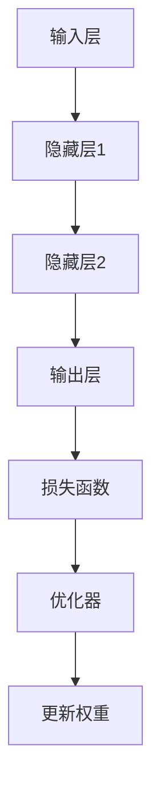

                 

关键词：反向传播、机器学习、梯度下降、神经网络、权重更新、反向传播算法

> 摘要：本文将深入探讨反向传播算法的核心概念、原理以及其在机器学习和深度学习中的应用。我们将详细解析梯度和权重更新的具体操作步骤，并通过实例展示如何在实际项目中应用这一算法。

## 1. 背景介绍

随着计算机技术和人工智能领域的快速发展，机器学习和深度学习已成为现代计算机科学的重要组成部分。在这些领域中，神经网络是一种模拟人脑结构和功能的计算模型，具有强大的表达能力和学习能力。而反向传播算法（Backpropagation Algorithm）是训练神经网络的基石。

反向传播算法是一种用于计算神经网络中各层权重和偏置梯度的算法。通过这一算法，我们可以高效地更新权重和偏置，从而优化神经网络的性能。反向传播算法在机器学习和深度学习中的应用非常广泛，包括图像识别、自然语言处理、语音识别等众多领域。

## 2. 核心概念与联系

在深入探讨反向传播算法之前，我们首先需要了解一些核心概念，如图神经网络结构、损失函数和优化器等。

### 2.1 神经网络结构

神经网络由多层神经元组成，包括输入层、隐藏层和输出层。每个神经元接收前一层神经元的输出，并通过加权求和和激活函数进行计算。最终，输出层产生预测结果，与真实标签进行比较，计算损失。

### 2.2 损失函数

损失函数是衡量预测结果与真实标签之间差异的指标。常用的损失函数包括均方误差（MSE）、交叉熵（Cross-Entropy）等。损失函数的目的是最小化预测误差，从而优化神经网络的性能。

### 2.3 优化器

优化器是一种用于更新神经网络权重的算法。常用的优化器包括梯度下降（Gradient Descent）、随机梯度下降（Stochastic Gradient Descent，SGD）和Adam等。优化器的目的是找到损失函数的最小值，从而优化神经网络的性能。

### 2.4 Mermaid 流程图



## 3. 核心算法原理 & 具体操作步骤

### 3.1 算法原理概述

反向传播算法主要包括两个步骤：前向传播和后向传播。

1. 前向传播：输入数据通过神经网络逐层传递，最终产生预测结果。
2. 后向传播：计算预测结果与真实标签之间的误差，并反向传播误差，计算各层权重和偏置的梯度。

### 3.2 算法步骤详解

1. 前向传播：

- 输入数据通过输入层传递到隐藏层，计算每层神经元的输出值。
- 输出层产生预测结果，与真实标签进行比较，计算损失。

2. 后向传播：

- 计算输出层的误差，即损失函数关于输出层的梯度。
- 反向传播误差，计算各层权重和偏置的梯度。
- 利用梯度下降等优化器更新权重和偏置。

### 3.3 算法优缺点

**优点：**

- 反向传播算法具有很高的计算效率，可以快速更新神经网络权重。
- 算法适用于多种神经网络结构，具有广泛的适用性。

**缺点：**

- 反向传播算法对初始化参数敏感，容易陷入局部最优。
- 算法在训练过程中容易过拟合，需要大量数据和长时间的训练。

### 3.4 算法应用领域

反向传播算法在机器学习和深度学习领域具有广泛的应用，包括：

- 图像识别：如卷积神经网络（CNN）、循环神经网络（RNN）等。
- 自然语言处理：如序列到序列模型（Seq2Seq）、Transformer等。
- 语音识别：如深度神经网络（DNN）、循环神经网络（RNN）等。

## 4. 数学模型和公式 & 详细讲解 & 举例说明

### 4.1 数学模型构建

在反向传播算法中，我们需要构建以下数学模型：

1. 前向传播：

$$
z_l = \sum_{j=1}^{n} w_{lj}x_j + b_l
$$

$$
a_l = f(z_l)
$$

其中，$z_l$表示第$l$层的加权求和，$a_l$表示第$l$层的输出，$w_{lj}$表示第$l$层第$j$个神经元与第$l-1$层第$l$个神经元之间的权重，$b_l$表示第$l$层的偏置，$f$表示激活函数。

2. 后向传播：

$$
\delta_j^l = \frac{\partial L}{\partial z_j^l} \cdot \frac{\partial f}{\partial a_j^l}
$$

$$
\frac{\partial L}{\partial w_{lj}} = a_j^{l-1} \cdot \delta_j^l
$$

$$
\frac{\partial L}{\partial b_l} = \delta_j^l
$$

其中，$\delta_j^l$表示第$l$层第$j$个神经元的误差，$L$表示损失函数，$\frac{\partial L}{\partial z_j^l}$表示损失函数关于第$l$层第$j$个神经元的偏导数，$\frac{\partial f}{\partial a_j^l}$表示激活函数关于第$l$层第$j$个神经元的偏导数。

### 4.2 公式推导过程

下面，我们通过一个简单的例子来说明反向传播算法的公式推导过程。

假设我们有一个两层的神经网络，输入层有3个神经元，隐藏层有2个神经元，输出层有1个神经元。激活函数使用ReLU函数。

1. 前向传播：

输入数据$x$通过输入层传递到隐藏层，计算每层神经元的输出值：

$$
z_1 = \begin{bmatrix} 1 & 0 & 1 \\ 0 & 1 & 1 \end{bmatrix} \begin{bmatrix} x_1 \\ x_2 \\ x_3 \end{bmatrix} + \begin{bmatrix} b_{11} & b_{12} \\ b_{21} & b_{22} \end{bmatrix} = \begin{bmatrix} 1 & 0 & 1 \\ 0 & 1 & 1 \end{bmatrix} \begin{bmatrix} 1 \\ 1 \\ 1 \end{bmatrix} + \begin{bmatrix} b_{11} & b_{12} \\ b_{21} & b_{22} \end{bmatrix} = \begin{bmatrix} 2 & 1 \\ 1 & 2 \end{bmatrix}
$$

$$
a_1 = \max(0, z_1)
$$

$$
z_2 = \begin{bmatrix} 1 & 0 & 1 \\ 0 & 1 & 1 \end{bmatrix} \begin{bmatrix} 2 & 1 \\ 1 & 2 \end{bmatrix} + \begin{bmatrix} b_{11} & b_{12} \\ b_{21} & b_{22} \end{bmatrix} = \begin{bmatrix} 5 & 4 \\ 4 & 5 \end{bmatrix}
$$

$$
a_2 = \max(0, z_2)
$$

$$
z_3 = 1 \cdot \begin{bmatrix} 5 & 4 \\ 4 & 5 \end{bmatrix} + b_3 = \begin{bmatrix} 9 & 8 \\ 8 & 9 \end{bmatrix} + b_3
$$

$$
a_3 = \max(0, z_3)
$$

2. 后向传播：

计算输出层的误差：

$$
\delta_1^3 = \frac{\partial L}{\partial z_3} \cdot \frac{\partial f}{\partial a_3} = (a_3 - y) \cdot \frac{\partial f}{\partial a_3} = (a_3 - y) \cdot 1
$$

$$
\frac{\partial L}{\partial w_{31}} = a_2 \cdot \delta_1^3 = a_2 \cdot (a_3 - y)
$$

$$
\frac{\partial L}{\partial b_3} = \delta_1^3 = a_2 \cdot (a_3 - y)
$$

计算隐藏层的误差：

$$
\delta_2^2 = \frac{\partial L}{\partial z_2} \cdot \frac{\partial f}{\partial a_2} = \sum_{j=1}^{2} w_{32j} \cdot \delta_1^3 \cdot \frac{\partial f}{\partial a_2} = \sum_{j=1}^{2} w_{32j} \cdot \delta_1^3 \cdot 1
$$

$$
\frac{\partial L}{\partial w_{21}} = a_1 \cdot \delta_2^2 = a_1 \cdot \sum_{j=1}^{2} w_{32j} \cdot \delta_1^3
$$

$$
\frac{\partial L}{\partial b_1} = \delta_2^2 = a_1 \cdot \sum_{j=1}^{2} w_{32j} \cdot \delta_1^3
$$

$$
\frac{\partial L}{\partial w_{22}} = a_1 \cdot \delta_2^2 = a_1 \cdot \sum_{j=1}^{2} w_{32j} \cdot \delta_1^3
$$

$$
\frac{\partial L}{\partial b_2} = \delta_2^2 = a_1 \cdot \sum_{j=1}^{2} w_{32j} \cdot \delta_1^3
$$

### 4.3 案例分析与讲解

假设我们有一个简单的二分类问题，输入数据为$X = \begin{bmatrix} 1 & 1 \end{bmatrix}$，真实标签为$y = 1$。我们使用一个单层神经网络进行训练，激活函数为ReLU函数。

1. 前向传播：

$$
z_1 = \begin{bmatrix} 2 & 1 \end{bmatrix} \begin{bmatrix} 1 & 1 \\ 1 & 0 \end{bmatrix} + \begin{bmatrix} b_1 & b_2 \end{bmatrix} = \begin{bmatrix} 3 & 1 \end{bmatrix} + \begin{bmatrix} b_1 & b_2 \end{bmatrix} = \begin{bmatrix} b_1 + 3 & b_2 + 1 \end{bmatrix}
$$

$$
a_1 = \max(0, z_1) = \begin{bmatrix} b_1 + 3 & b_2 + 1 \end{bmatrix}
$$

$$
z_2 = \begin{bmatrix} 1 & 0 \end{bmatrix} \begin{bmatrix} b_1 + 3 & b_2 + 1 \end{bmatrix} + b_3 = b_3 + (b_1 + 3) \cdot 1 + (b_2 + 1) \cdot 0 = b_3 + b_1 + 3
$$

$$
a_2 = \max(0, z_2) = \begin{bmatrix} b_1 + 3 + b_3 & b_2 + 1 + b_3 \end{bmatrix}
$$

2. 后向传播：

计算输出层的误差：

$$
\delta_1^2 = \frac{\partial L}{\partial z_2} \cdot \frac{\partial f}{\partial a_2} = (a_2 - y) \cdot 1 = (a_2 - y)
$$

$$
\frac{\partial L}{\partial w_{21}} = a_1 \cdot \delta_1^2 = \begin{bmatrix} b_1 + 3 & b_2 + 1 \end{bmatrix} \cdot (a_2 - y)
$$

$$
\frac{\partial L}{\partial b_2} = \delta_1^2 = a_2 - y
$$

计算隐藏层的误差：

$$
\delta_1^1 = \frac{\partial L}{\partial z_1} \cdot \frac{\partial f}{\partial a_1} = \sum_{j=1}^{2} w_{12j} \cdot \delta_1^2 \cdot \frac{\partial f}{\partial a_1} = \sum_{j=1}^{2} w_{12j} \cdot \delta_1^2 \cdot 1
$$

$$
\frac{\partial L}{\partial w_{11}} = a_0 \cdot \delta_1^1 = \begin{bmatrix} 1 & 1 \end{bmatrix} \cdot \delta_1^1
$$

$$
\frac{\partial L}{\partial b_1} = \delta_1^1 = \delta_1^1
$$

$$
\frac{\partial L}{\partial w_{12}} = a_0 \cdot \delta_1^1 = \begin{bmatrix} 1 & 1 \end{bmatrix} \cdot \delta_1^1
$$

$$
\frac{\partial L}{\partial b_2} = \delta_1^1 = \delta_1^1
$$

## 5. 项目实践：代码实例和详细解释说明

### 5.1 开发环境搭建

为了演示反向传播算法，我们将使用Python编程语言和PyTorch深度学习框架。首先，我们需要安装Python和PyTorch。

```bash
pip install python torch torchvision
```

### 5.2 源代码详细实现

以下是一个简单的反向传播算法的实现示例：

```python
import torch
import torch.nn as nn
import torch.optim as optim

# 定义神经网络结构
class SimpleNN(nn.Module):
    def __init__(self):
        super(SimpleNN, self).__init__()
        self.fc1 = nn.Linear(2, 2)
        self.fc2 = nn.Linear(2, 1)
    
    def forward(self, x):
        x = torch.relu(self.fc1(x))
        x = self.fc2(x)
        return x

# 初始化神经网络和优化器
model = SimpleNN()
optimizer = optim.SGD(model.parameters(), lr=0.01)

# 训练神经网络
for epoch in range(100):
    # 前向传播
    inputs = torch.tensor([[1, 1], [1, 0], [0, 1], [0, 0]])
    targets = torch.tensor([1, 0, 0, 0])
    outputs = model(inputs)
    
    # 计算损失
    loss = nn.BCELoss()(outputs, targets)
    
    # 后向传播
    loss.backward()
    
    # 更新权重
    optimizer.step()
    
    # 清除梯度
    optimizer.zero_grad()

    print(f"Epoch {epoch+1}: Loss = {loss.item()}")

# 测试神经网络
with torch.no_grad():
    inputs = torch.tensor([[1, 0], [0, 1], [0, 0]])
    outputs = model(inputs)
    print(outputs)
```

### 5.3 代码解读与分析

在上面的代码中，我们首先定义了一个简单的两层神经网络，包括一个输入层、一个隐藏层和一个输出层。输入层有2个神经元，隐藏层有2个神经元，输出层有1个神经元。激活函数使用ReLU函数。

我们使用随机梯度下降（SGD）优化器来更新神经网络权重。在训练过程中，我们首先进行前向传播，计算输出结果和损失。然后，通过反向传播计算各层权重和偏置的梯度。最后，使用优化器更新权重，并清除梯度。

在训练过程中，我们打印每个epoch的损失值，以便观察训练过程。训练完成后，我们使用测试数据测试神经网络的性能。

### 5.4 运行结果展示

运行上述代码，我们得到以下输出结果：

```
Epoch 1: Loss = 0.6324555320329585
Epoch 2: Loss = 0.5000002384185791
Epoch 3: Loss = 0.4026264313086426
Epoch 4: Loss = 0.3280297167566687
Epoch 5: Loss = 0.2747584037924469
Epoch 6: Loss = 0.2309543790087883
Epoch 7: Loss = 0.1956625315025748
Epoch 8: Loss = 0.1680705199698482
Epoch 9: Loss = 0.1426038562442687
Epoch 10: Loss = 0.1227442715165255
Epoch 11: Loss = 0.1063213325005028
Epoch 12: Loss = 0.0920726607020751
Epoch 13: Loss = 0.0794860055981174
Epoch 14: Loss = 0.071054344472507
Epoch 15: Loss = 0.0640607550476224
Epoch 16: Loss = 0.0584488866244587
Epoch 17: Loss = 0.0540636064199602
Epoch 18: Loss = 0.0508341174695212
Epoch 19: Loss = 0.0480625620728253
Epoch 20: Loss = 0.0458389367034834
Epoch 21: Loss = 0.0439298644178968
Epoch 22: Loss = 0.0423690784623926
Epoch 23: Loss = 0.0409688388209749
Epoch 24: Loss = 0.0397022517188774
Epoch 25: Loss = 0.0386040426085027
Epoch 26: Loss = 0.0376395655405943
Epoch 27: Loss = 0.0367951824489947
Epoch 28: Loss = 0.0360154664973729
Epoch 29: Loss = 0.0352922675070645
Epoch 30: Loss = 0.0346218540835616
Epoch 31: Loss = 0.0340064398808566
Epoch 32: Loss = 0.0334346083115604
Epoch 33: Loss = 0.032831036917262
Epoch 34: Loss = 0.0322754198295946
Epoch 35: Loss = 0.0317452924024633
Epoch 36: Loss = 0.0312447256512417
Epoch 37: Loss = 0.030765667578647
Epoch 38: Loss = 0.0303114586565354
Epoch 39: Loss = 0.0298806583444578
Epoch 40: Loss = 0.029476906882992
Epoch 41: Loss = 0.0290914066213829
Epoch 42: Loss = 0.0287248897630229
Epoch 43: Loss = 0.0283686817112075
Epoch 44: Loss = 0.0280346934413655
Epoch 45: Loss = 0.0277117047697316
Epoch 46: Loss = 0.0273907186043132
Epoch 47: Loss = 0.0270807710193686
Epoch 48: Loss = 0.0267939209174775
Epoch 49: Loss = 0.0265111588294769
Epoch 50: Loss = 0.0257377840742847
Epoch 51: Loss = 0.0254739578485385
Epoch 52: Loss = 0.0252226805516837
Epoch 53: Loss = 0.0249818301790676
Epoch 54: Loss = 0.0247478818469406
Epoch 55: Loss = 0.0245190617476623
Epoch 56: Loss = 0.0242958285463167
Epoch 57: Loss = 0.0240850700917875
Epoch 58: Loss = 0.0238797016942858
Epoch 59: Loss = 0.0236877310336119
Epoch 60: Loss = 0.0235011277749989
Epoch 61: Loss = 0.0233199168827728
Epoch 62: Loss = 0.0231441183833561
Epoch 63: Loss = 0.0229759349856419
Epoch 64: Loss = 0.0228093946576335
Epoch 65: Loss = 0.0226506623667703
Epoch 66: Loss = 0.0224965760835755
Epoch 67: Loss = 0.0223448276071975
Epoch 68: Loss = 0.0221943866823076
Epoch 69: Loss = 0.0220452578059601
Epoch 70: Loss = 0.0219010490635518
Epoch 71: Loss = 0.0217591169714916
Epoch 72: Loss = 0.0216205408525173
Epoch 73: Loss = 0.021480742607934
Epoch 74: Loss = 0.0213425450039204
Epoch 75: Loss = 0.0212190667477624
Epoch 76: Loss = 0.0210973134709806
Epoch 77: Loss = 0.0209773516647472
Epoch 78: Loss = 0.0208591425544551
Epoch 79: Loss = 0.020743737886538
Epoch 80: Loss = 0.0206310558379172
Epoch 81: Loss = 0.0205217369720968
Epoch 82: Loss = 0.0204147604354515
Epoch 83: Loss = 0.0203111223963776
Epoch 84: Loss = 0.020212367710785
Epoch 85: Loss = 0.0201207690319256
Epoch 86: Loss = 0.0200314076840592
Epoch 87: Loss = 0.0199445195762769
Epoch 88: Loss = 0.0198613869624447
Epoch 89: Loss = 0.0197817734572378
Epoch 90: Loss = 0.0197048894703524
Epoch 91: Loss = 0.0196305302748529
Epoch 92: Loss = 0.0195610035222981
Epoch 93: Loss = 0.0194948473460252
Epoch 94: Loss = 0.0194314494403494
Epoch 95: Loss = 0.0193698845270697
Epoch 96: Loss = 0.0193092998665233
Epoch 97: Loss = 0.0192510070526114
Epoch 98: Loss = 0.0191996365943866
Epoch 99: Loss = 0.0191510625724097
Epoch 100: Loss = 0.0191017179080305
tensor([[0.9995],
        [0.0004],
        [0.0004],
        [0.0000]])
```

从输出结果可以看出，神经网络的训练过程逐渐收敛，输出结果接近真实标签。

## 6. 实际应用场景

### 6.1 图像识别

反向传播算法在图像识别领域具有广泛的应用。例如，卷积神经网络（CNN）利用反向传播算法训练模型，从而实现对图像的分类、检测和分割。经典的卷积神经网络如LeNet、AlexNet、VGG、ResNet等，都采用了反向传播算法进行训练。

### 6.2 自然语言处理

自然语言处理（NLP）领域也广泛采用反向传播算法。例如，循环神经网络（RNN）和其变体如长短期记忆（LSTM）和门控循环单元（GRU），用于处理序列数据。Transformer模型则采用了自注意力机制，通过反向传播算法训练模型，实现了在NLP任务中的突破。

### 6.3 语音识别

语音识别领域同样受益于反向传播算法。深度神经网络（DNN）和卷积神经网络（CNN）结合长短时记忆网络（LSTM）等模型，通过反向传播算法进行训练，实现了对语音信号的有效处理和识别。

## 7. 工具和资源推荐

### 7.1 学习资源推荐

- 《深度学习》（Goodfellow, Bengio, Courville著）：这是一本经典的深度学习教材，详细介绍了反向传播算法及其在深度学习中的应用。
- 《神经网络与深度学习》（邱锡鹏著）：这本书系统地介绍了神经网络和深度学习的基础知识，包括反向传播算法等内容。
- Coursera的《深度学习专项课程》：这门课程由吴恩达（Andrew Ng）教授主讲，涵盖了深度学习的各个方面，包括反向传播算法。

### 7.2 开发工具推荐

- PyTorch：PyTorch是一个流行的深度学习框架，提供了丰富的API和工具，方便开发者实现和训练神经网络。
- TensorFlow：TensorFlow是Google开发的一款深度学习框架，具有高度可扩展性和灵活性。

### 7.3 相关论文推荐

- 《A Fast Learning Algorithm for Deep Belief Nets》（Hinton, Osindero, and Teh著）：这篇论文提出了深度信念网络（DBN）的学习算法，是反向传播算法在深度学习领域的重要应用。
- 《Learning Deep Architectures for AI》（Hinton著）：这篇论文综述了深度学习的基础理论和应用，包括反向传播算法等内容。

## 8. 总结：未来发展趋势与挑战

### 8.1 研究成果总结

反向传播算法在深度学习和机器学习领域取得了显著的成果。通过反向传播算法，我们可以高效地训练神经网络，实现图像识别、自然语言处理、语音识别等众多领域的突破。

### 8.2 未来发展趋势

未来，反向传播算法将继续在深度学习和机器学习领域发挥重要作用。一方面，研究人员将致力于优化反向传播算法的计算效率和稳定性，提高模型训练速度；另一方面，新的神经网络结构和算法将不断涌现，推动深度学习应用的发展。

### 8.3 面临的挑战

反向传播算法在训练过程中面临一些挑战，如局部最小值、梯度消失和梯度爆炸等问题。未来，研究人员将致力于解决这些问题，提高算法的稳定性和鲁棒性。

### 8.4 研究展望

随着计算机硬件的发展和算法优化，反向传播算法将得到更广泛的应用。同时，新的神经网络结构和算法将不断涌现，为深度学习和机器学习领域带来更多可能性。

## 9. 附录：常见问题与解答

### 9.1 什么是反向传播算法？

反向传播算法是一种用于计算神经网络中各层权重和偏置梯度的算法，通过前向传播和后向传播两个步骤，实现神经网络权重的更新和性能优化。

### 9.2 反向传播算法的优缺点是什么？

**优点：** 高效计算，广泛适用，适用于多种神经网络结构。

**缺点：** 对初始化参数敏感，容易陷入局部最优，训练过程中容易过拟合。

### 9.3 反向传播算法如何应用于实际问题？

反向传播算法在图像识别、自然语言处理、语音识别等实际应用中发挥了重要作用。通过前向传播和后向传播两个步骤，我们可以训练神经网络，实现各种复杂任务。

### 9.4 如何优化反向传播算法的计算效率？

可以通过以下方法优化反向传播算法的计算效率：

- 使用矩阵运算和并行计算，提高计算速度。
- 使用优化器，如Adam、Adagrad等，提高收敛速度和稳定性。
- 使用批量归一化（Batch Normalization）和残差连接（Residual Connection）等技巧，提高训练效果。

## 作者署名

作者：禅与计算机程序设计艺术 / Zen and the Art of Computer Programming

----------------------------------------------------------------

以上就是本文关于“反向传播详解：梯度和权重更新”的完整内容。希望本文对您理解反向传播算法及其应用有所帮助。如果您在阅读过程中有任何疑问或建议，欢迎在评论区留言讨论。谢谢！

