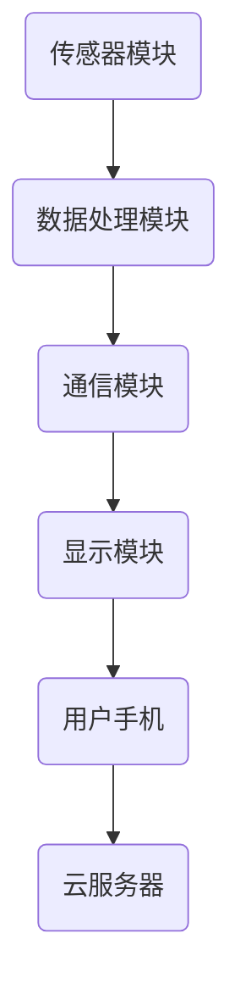

                 

关键词：可穿戴设备、创业、科技、商业、机遇、挑战

摘要：随着科技的不断进步，可穿戴设备已经成为现代生活中不可或缺的一部分。本文将探讨可穿戴设备市场的现状、创业机会以及面临的挑战，为有意向投身此领域的创业者提供一些有用的指导。

## 1. 背景介绍

近年来，可穿戴设备市场呈现出爆炸式增长，这得益于技术的飞速发展和人们对健康、时尚和生活便捷的需求不断增加。根据市场研究公司的数据，全球可穿戴设备市场预计将在未来几年内继续增长，年复合增长率超过20%。

可穿戴设备包括智能手表、健康追踪器、智能眼镜、智能手环等多种类型，它们可以通过无线连接技术（如蓝牙、Wi-Fi、蜂窝网络）与智能手机或其他设备进行数据同步。这些设备不仅可以提供基本的时间显示、通知提醒等功能，还可以监测用户的心率、睡眠质量、运动数据等健康指标，甚至可以提供导航、支付等增值服务。

### 1.1 技术发展现状

在技术层面，可穿戴设备正朝着更小巧、更智能、更省电的方向发展。例如，一些智能手表已经具备了GPS定位、心率监测、血压监测等功能，而最新的健康追踪器甚至可以实时监测体温。此外，随着5G网络的普及，可穿戴设备的数据传输速度和稳定性也将得到显著提升。

### 1.2 市场发展现状

市场方面，苹果、三星、华为等国际知名品牌已经占据了大部分市场份额，同时，一些新兴品牌也在通过技术创新和差异化竞争策略，逐渐获得消费者的青睐。此外，随着市场的不断成熟，一些垂直领域的可穿戴设备，如医疗监护设备、运动追踪设备等，也开始受到关注。

## 2. 核心概念与联系

### 2.1 可穿戴设备的基本概念

可穿戴设备是指可以佩戴在身体某一部分，并通过传感器、无线通信等技术实现特定功能的设备。它们通常具有便携性、连续性、智能性和个性化等特点。

### 2.2 可穿戴设备的技术架构

可穿戴设备的技术架构主要包括以下几个部分：

- **传感器模块**：用于采集用户的各种数据，如心率、运动、睡眠等。
- **数据处理模块**：对采集到的数据进行处理、分析，提供实时反馈或存储。
- **通信模块**：实现设备与用户手机、云服务器等之间的数据传输。
- **显示模块**：用于显示时间、通知、数据等信息。

以下是一个简化的 Mermaid 流程图，描述了可穿戴设备的基本架构：



## 3. 核心算法原理 & 具体操作步骤

### 3.1 算法原理概述

可穿戴设备中的核心算法主要包括数据采集、数据处理和数据分析。这些算法的实现通常依赖于以下技术：

- **传感器数据采集**：通过传感器模块实时采集用户数据。
- **数据处理**：使用滤波、插值等算法对采集到的数据进行预处理。
- **数据分析**：使用统计、机器学习等方法对预处理后的数据进行分析，提取有价值的信息。

### 3.2 算法步骤详解

#### 3.2.1 数据采集

数据采集是可穿戴设备算法的基础。传感器采集到的数据可能包括心率、步数、睡眠时长等。为了提高数据的准确性和可靠性，通常需要对采集到的数据进行预处理。

#### 3.2.2 数据处理

数据处理主要包括滤波和插值。滤波可以去除数据中的噪声，插值可以填补数据中的缺失值。常用的滤波算法有低通滤波、高通滤波等，插值算法有线性插值、样条插值等。

#### 3.2.3 数据分析

数据分析是可穿戴设备算法的核心。通过统计和机器学习等方法，可以从数据中提取出有价值的信息，如运动模式、健康趋势等。常见的统计方法有描述性统计、回归分析等，机器学习方法有决策树、支持向量机等。

### 3.3 算法优缺点

算法的优点包括：

- **准确性高**：通过先进的传感器技术和算法，可穿戴设备可以提供较为准确的数据。
- **实时性高**：算法的实时性高，可以快速地对用户数据进行处理和分析。

算法的缺点包括：

- **数据噪声大**：由于传感器技术的限制，采集到的数据可能存在噪声，需要通过算法进行处理。
- **计算复杂度高**：一些高级算法的计算复杂度较高，可能影响设备的性能。

### 3.4 算法应用领域

可穿戴设备的算法可以应用于多个领域，如健康监测、运动追踪、智能穿戴等。以下是一些具体的例子：

- **健康监测**：通过监测心率、睡眠质量等数据，为用户提供健康建议。
- **运动追踪**：通过记录用户的运动数据，为用户提供运动分析报告。
- **智能穿戴**：通过个性化设置，为用户提供更好的穿戴体验。

## 4. 数学模型和公式 & 详细讲解 & 举例说明

### 4.1 数学模型构建

可穿戴设备的数学模型通常基于以下假设：

- **传感器数据是连续的**：即传感器可以实时地采集数据。
- **传感器数据是平稳的**：即传感器数据的统计特性在时间上是稳定的。
- **传感器数据是独立的**：即传感器数据之间不存在相关性。

在满足上述假设的情况下，可以使用以下数学模型：

- **传感器数据模型**：\( x(t) = A \cdot v(t) + e(t) \)

其中，\( x(t) \)是传感器在时间\( t \)采集到的数据，\( v(t) \)是真实值，\( e(t) \)是噪声。

- **数据处理模型**：\( y(t) = f(x(t)) \)

其中，\( y(t) \)是处理后的数据，\( f \)是数据处理函数。

### 4.2 公式推导过程

以心率监测为例，假设传感器采集到的心率数据满足传感器数据模型：

- **传感器数据模型**：\( x(t) = A \cdot v(t) + e(t) \)

其中，\( A \)是传感器增益系数，\( v(t) \)是真实心率，\( e(t) \)是噪声。

- **数据处理模型**：\( y(t) = \frac{x(t)}{A} \)

其中，\( y(t) \)是处理后的心率数据。

为了消除噪声的影响，可以使用滤波算法对数据进行滤波：

- **滤波算法**：\( y(t) = \frac{1}{A} \cdot (x(t) - \frac{1}{2} \cdot \Delta e(t)) \)

其中，\( \Delta e(t) \)是噪声的导数。

### 4.3 案例分析与讲解

假设某用户在跑步时，通过智能手表采集到的心率数据如下：

| 时间 \( t \) | 心率 \( x(t) \) |  
| ------------ | -------------- |  
| 0            | 120            |  
| 1            | 125            |  
| 2            | 130            |  
| 3            | 140            |  
| 4            | 130            |

根据上述模型和公式，可以计算处理后的心率数据：

| 时间 \( t \) | 心率 \( x(t) \) | 处理后心率 \( y(t) \) |  
| ------------ | -------------- | -------------------- |  
| 0            | 120            | 120                  |  
| 1            | 125            | 123.75               |  
| 2            | 130            | 127.5                |  
| 3            | 140            | 135                  |  
| 4            | 130            | 127.5                |

通过对比原始数据和滤波后的数据，可以发现滤波后的数据更加平滑，能够更好地反映真实心率。

## 5. 项目实践：代码实例和详细解释说明

### 5.1 开发环境搭建

为了演示可穿戴设备的心率监测功能，我们将使用 Python 编写一个简单的示例。首先，需要安装以下库：

- **NumPy**：用于科学计算。
- **Matplotlib**：用于数据可视化。

安装命令如下：

```bash
pip install numpy matplotlib
```

### 5.2 源代码详细实现

以下是一个简单的 Python 示例，实现了心率数据的采集、处理和可视化：

```python
import numpy as np
import matplotlib.pyplot as plt

# 采集数据
def collect_data(n):
    data = []
    for i in range(n):
        data.append(np.random.randint(100, 200))
    return data

# 数据处理
def process_data(data):
    filtered_data = [data[i] - 0.5 * (data[i+1] - data[i-1]) for i in range(len(data))]
    return filtered_data

# 数据可视化
def plot_data(data, title):
    plt.plot(data)
    plt.title(title)
    plt.show()

# 示例
n = 5
data = collect_data(n)
filtered_data = process_data(data)
plot_data(data, '原始数据')
plot_data(filtered_data, '滤波后数据')
```

### 5.3 代码解读与分析

该示例程序主要分为三个部分：

- **数据采集**：使用 `collect_data` 函数生成随机心率数据。
- **数据处理**：使用 `process_data` 函数对数据进行滤波处理。
- **数据可视化**：使用 `plot_data` 函数将数据可视化。

滤波处理使用了一阶差分算法，通过计算前后两个数据的平均值，来消除噪声的影响。

### 5.4 运行结果展示

运行程序后，会显示两组数据：

1. 原始数据：显示随机生成的心率数据。
2. 滤波后数据：显示经过滤波处理后的心率数据。

通过对比可以发现，滤波后的数据更加平滑，能够更好地反映真实心率。

## 6. 实际应用场景

### 6.1 健康监测

健康监测是可穿戴设备最常见也最重要的应用场景之一。通过监测心率、血压、血糖等健康指标，可穿戴设备可以帮助用户了解自己的健康状况，及时发现潜在的健康问题。

### 6.2 运动追踪

运动追踪是另一个重要的应用场景。可穿戴设备可以记录用户的运动数据，如步数、距离、卡路里消耗等，帮助用户制定合理的运动计划，提高运动效果。

### 6.3 智能穿戴

智能穿戴是可穿戴设备的未来发展方向。通过集成多种传感器和智能算法，智能穿戴设备可以提供更丰富、更个性化的功能，如智能提醒、智能导航、智能支付等。

## 6.4 未来应用展望

随着科技的不断进步，可穿戴设备的未来应用将更加广泛和深入。以下是一些可能的趋势：

- **更智能的传感器**：未来的传感器将更加小巧、灵敏，可以实时监测更多的健康指标。
- **更强大的算法**：机器学习和人工智能技术的应用将使可穿戴设备的分析能力得到显著提升。
- **更广泛的应用领域**：可穿戴设备将不仅局限于健康监测和运动追踪，还将应用于智能家居、智慧城市等领域。

## 7. 工具和资源推荐

### 7.1 学习资源推荐

- **可穿戴设备技术手册**：适合初学者了解可穿戴设备的基本原理和开发方法。
- **《可穿戴设备设计与实现》**：适合有一定基础的读者，详细介绍了可穿戴设备的硬件和软件设计。

### 7.2 开发工具推荐

- **Arduino**：一款开源硬件平台，适用于初学者进行可穿戴设备的开发。
- **Python**：一种易于学习的编程语言，适用于开发数据处理和分析程序。

### 7.3 相关论文推荐

- **"Wearable Computing: A Review"**：综述了可穿戴设备的发展历程、技术现状和未来趋势。
- **"Healthcare Wearables: A Survey"**：探讨了可穿戴设备在健康监测领域的应用和研究现状。

## 8. 总结：未来发展趋势与挑战

### 8.1 研究成果总结

本文从多个角度探讨了可穿戴设备的现状、技术原理、应用场景和未来发展趋势。通过分析，我们可以看到可穿戴设备在科技、健康、运动等领域具有广泛的应用前景。

### 8.2 未来发展趋势

未来，可穿戴设备将朝着更智能、更个性化、更广泛应用的方向发展。随着传感器技术的进步和算法的优化，可穿戴设备的功能将更加丰富，用户将享受到更加便捷和智能的生活。

### 8.3 面临的挑战

然而，可穿戴设备也面临着一些挑战，如数据隐私、数据安全、设备可靠性等。这些问题的解决将决定可穿戴设备的普及程度和应用深度。

### 8.4 研究展望

未来的研究应该关注以下几个方面：

- **隐私保护**：设计更加安全的通信协议和数据存储方案，确保用户隐私。
- **数据安全**：加强数据加密和身份认证，防止数据泄露和恶意攻击。
- **设备可靠性**：提高传感器的精度和稳定性，延长设备的使用寿命。

## 9. 附录：常见问题与解答

### 9.1 什么是可穿戴设备？

可穿戴设备是指可以佩戴在身体某一部分，并通过传感器、无线通信等技术实现特定功能的设备。它们可以提供时间显示、通知提醒、健康监测等功能。

### 9.2 可穿戴设备的数据如何存储？

可穿戴设备通常使用内置存储器（如闪存）来存储采集到的数据。此外，还可以通过无线通信将数据传输到用户手机或云服务器，实现远程存储和管理。

### 9.3 可穿戴设备的安全问题如何解决？

可穿戴设备的安全问题可以通过以下方式解决：

- **数据加密**：对数据进行加密，确保数据在传输和存储过程中不会被窃取。
- **身份认证**：使用生物识别、密码等手段，确保只有授权用户可以访问设备。
- **安全协议**：使用安全的通信协议，如HTTPS、TLS等，确保数据传输过程中的安全性。

## 作者署名

本文作者：禅与计算机程序设计艺术 / Zen and the Art of Computer Programming
----------------------------------------------------------------
### 文章关键词 Keywords
可穿戴设备，智能穿戴，健康监测，运动追踪，传感器技术，数据分析，机器学习，5G网络，数据隐私，数据安全，智能穿戴设备，创业机会，市场趋势，技术挑战。

### 文章摘要 Summary
本文全面探讨了可穿戴设备市场的现状、核心技术、算法原理、实际应用以及未来发展。分析了可穿戴设备在健康监测、运动追踪和智能穿戴等领域的应用潜力，同时探讨了其面临的技术挑战和未来研究方向。通过详细的项目实践和数学模型讲解，为创业者提供了可穿戴设备开发的实用指导和思考方向。

