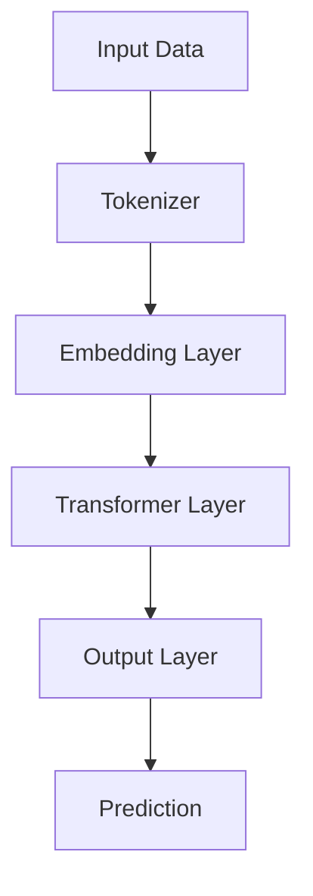

                 

关键词：大型语言模型，社会影响，技术应用，未来展望，人工智能

> 摘要：随着大型语言模型（LLM）技术的快速发展，其在各个领域的应用日益广泛。本文旨在探讨LLM技术在社会中的持续影响，分析其在当前阶段的优势与挑战，以及未来可能的趋势。

## 1. 背景介绍

自2018年谷歌提出BERT模型以来，大型语言模型（LLM）技术经历了飞速发展。LLM通过深度学习算法从大量文本数据中学习语言模式和语义关系，实现了在各种自然语言处理任务中的高性能。从最初的BERT到GPT、T5、OPT等，LLM在文本生成、问答系统、机器翻译、文本分类等任务上取得了显著的突破。

### 1.1 发展历程

1. **BERT：**2018年，谷歌提出BERT（Bidirectional Encoder Representations from Transformers），这是一种基于Transformer架构的双向编码语言模型，能够捕捉到句子中的双向依赖关系。

2. **GPT：**2018年，OpenAI发布了GPT（Generative Pre-trained Transformer），这是一种基于Transformer的预训练语言模型，主要用于生成文本。

3. **T5：**2020年，谷歌提出了T5（Text-To-Text Transfer Transformer），这是一个通用目的的预训练语言模型，它将所有自然语言处理任务转换为文本到文本的转换任务。

4. **OPT：**2021年，Meta AI发布了OPT（Open Pretrained Transformer），这是一个具有超过1万亿参数的预训练语言模型，是目前最大的预训练模型。

### 1.2 应用领域

LLM技术已经广泛应用于多个领域，包括但不限于：

- **文本生成：**包括故事、文章、代码、摘要等的生成。
- **问答系统：**如搜索引擎、对话系统等。
- **机器翻译：**实现高质量的双语翻译。
- **文本分类：**对新闻、社交媒体等文本数据进行分类。
- **情感分析：**分析文本中的情感倾向。

## 2. 核心概念与联系

为了深入理解LLM技术，我们需要了解其核心概念和基本架构。以下是一个简单的Mermaid流程图，展示了LLM的核心概念和基本架构：



### 2.1 输入数据（Input Data）

LLM的输入数据通常是文本数据，可以是自然语言文本，也可以是结构化数据。通过分词器（Tokenizer），文本数据被转换为模型可以理解的序列。

### 2.2 词嵌入（Embedding Layer）

词嵌入层将输入的文本序列转换为固定大小的向量表示。这一过程通常通过预训练的词嵌入模型（如Word2Vec、GloVe）实现。

### 2.3 变换器层（Transformer Layer）

变换器层是LLM的核心，通过自注意力机制（Self-Attention）捕捉文本序列中的依赖关系。变换器层通常包含多个子层，每个子层都包括多头自注意力机制和前馈网络。

### 2.4 输出层（Output Layer）

输出层将变换器层的输出映射到具体的任务输出，如分类标签、翻译结果或文本生成。

### 2.5 预测（Prediction）

根据任务的不同，模型会输出相应的预测结果。例如，在文本分类任务中，输出可能是概率分布。

## 3. 核心算法原理 & 具体操作步骤

### 3.1 算法原理概述

LLM的核心算法是基于变换器架构的预训练语言模型。预训练语言模型通常包括两个阶段：预训练和微调。

- **预训练：**在大量文本数据上进行预训练，学习语言模式和语义关系。
- **微调：**在特定任务数据上进行微调，使模型适应具体任务。

### 3.2 算法步骤详解

1. **数据预处理：**收集和清洗文本数据，将其转换为模型可以理解的格式。
2. **词嵌入：**使用预训练的词嵌入模型，将文本转换为向量表示。
3. **变换器层：**通过自注意力机制和前馈网络，对向量进行多次变换。
4. **输出层：**根据任务需求，将变换器层的输出映射到具体的任务输出。
5. **微调：**在特定任务数据上进行微调，优化模型参数。

### 3.3 算法优缺点

**优点：**

- **强泛化能力：**LLM通过预训练阶段学习到了大量的语言模式和语义关系，具有很好的泛化能力。
- **多任务兼容：**变换器架构使得LLM可以轻松适应各种自然语言处理任务。
- **高效性：**变换器层的设计使得模型在计算效率上具有优势。

**缺点：**

- **训练成本高：**预训练阶段需要大量的计算资源和时间。
- **解释性差：**由于模型内部的黑箱特性，很难解释模型做出的预测。

### 3.4 算法应用领域

LLM技术已经广泛应用于多个领域，包括但不限于：

- **文本生成：**包括故事、文章、代码、摘要等的生成。
- **问答系统：**如搜索引擎、对话系统等。
- **机器翻译：**实现高质量的双语翻译。
- **文本分类：**对新闻、社交媒体等文本数据进行分类。
- **情感分析：**分析文本中的情感倾向。

## 4. 数学模型和公式 & 详细讲解 & 举例说明

### 4.1 数学模型构建

LLM的数学模型主要基于变换器架构，其核心是多头自注意力机制（Multi-Head Self-Attention）。

#### 4.1.1 自注意力机制（Self-Attention）

自注意力机制是一种计算文本序列中每个单词对于其他所有单词的权重的方法。具体公式如下：

$$
\text{Attention}(Q, K, V) = \text{softmax}\left(\frac{QK^T}{\sqrt{d_k}}\right)V
$$

其中，$Q, K, V$ 分别为查询（Query）、关键（Key）、值（Value）向量，$d_k$ 为关键向量的维度。

#### 4.1.2 多头自注意力（Multi-Head Self-Attention）

多头自注意力是将自注意力机制扩展到多个头（Head），每个头独立计算注意力权重，然后合并结果。具体公式如下：

$$
\text{MultiHead}(Q, K, V) = \text{Concat}(\text{head}_1, \text{head}_2, ..., \text{head}_h)W^O
$$

其中，$h$ 为头数，$W^O$ 为输出权重。

### 4.2 公式推导过程

以下是多头自注意力的推导过程：

1. **嵌入层（Embedding Layer）**：将输入文本序列转换为嵌入向量。
   $$
   \text{Input} = [x_1, x_2, ..., x_n], \quad \text{Embedding} = [e_1, e_2, ..., e_n]
   $$
2. **变换器层（Transformer Layer）**：计算自注意力权重。
   $$
   Q = \text{Linear}(E), \quad K = \text{Linear}(E), \quad V = \text{Linear}(E)
   $$
   $$
   \text{Attention}(Q, K, V) = \text{softmax}\left(\frac{QK^T}{\sqrt{d_k}}\right)V
   $$
3. **多头自注意力（Multi-Head Self-Attention）**：合并多个头的注意力结果。
   $$
   \text{MultiHead}(Q, K, V) = \text{Concat}(\text{head}_1, \text{head}_2, ..., \text{head}_h)W^O
   $$
4. **前馈网络（Feedforward Network）**：对多头自注意力结果进行进一步处理。
   $$
   \text{Output} = \text{ReLU}(\text{Linear}(\text{MultiHead}(Q, K, V)))W^O
   $$

### 4.3 案例分析与讲解

假设有一个包含3个单词的文本序列：“苹果，橙子，香蕉”。以下是使用变换器模型对其进行处理的步骤：

1. **词嵌入（Embedding Layer）**：将文本序列转换为嵌入向量。
   $$
   \text{Input}: ["苹果"，"橙子"，"香蕉"]
   $$
   $$
   \text{Embedding}: [e_1, e_2, e_3]
   $$
2. **自注意力（Self-Attention）**：计算每个单词对于其他两个单词的权重。
   $$
   Q = \text{Linear}(E), \quad K = \text{Linear}(E), \quad V = \text{Linear}(E)
   $$
   $$
   \text{Attention}(Q, K, V) = \text{softmax}\left(\frac{QK^T}{\sqrt{d_k}}\right)V
   $$
   $$
   \text{Output}: [a_1, a_2, a_3]
   $$
3. **多头自注意力（Multi-Head Self-Attention）**：合并多个头的注意力结果。
   $$
   \text{MultiHead}(Q, K, V) = \text{Concat}(\text{head}_1, \text{head}_2, ..., \text{head}_h)W^O
   $$
   $$
   \text{Output}: [b_1, b_2, b_3]
   $$
4. **前馈网络（Feedforward Network）**：对多头自注意力结果进行进一步处理。
   $$
   \text{Output} = \text{ReLU}(\text{Linear}(\text{MultiHead}(Q, K, V)))W^O
   $$
   $$
   \text{Output}: [c_1, c_2, c_3]
   $$

通过以上步骤，变换器模型成功地处理了输入的文本序列，并生成了对应的输出序列。

## 5. 项目实践：代码实例和详细解释说明

### 5.1 开发环境搭建

为了运行LLM模型，我们需要搭建相应的开发环境。以下是一个简单的Python环境搭建步骤：

1. **安装Python**：确保Python版本为3.8或更高。
2. **安装PyTorch**：使用以下命令安装PyTorch：
   ```
   pip install torch torchvision
   ```
3. **安装Hugging Face Transformers**：使用以下命令安装Hugging Face Transformers：
   ```
   pip install transformers
   ```

### 5.2 源代码详细实现

以下是一个简单的LLM模型实现代码示例，使用了Hugging Face Transformers库：

```python
import torch
from transformers import BertModel, BertTokenizer

# 加载预训练模型和分词器
tokenizer = BertTokenizer.from_pretrained('bert-base-uncased')
model = BertModel.from_pretrained('bert-base-uncased')

# 输入文本
input_text = "苹果，橙子，香蕉"

# 分词
input_ids = tokenizer.encode(input_text, add_special_tokens=True, return_tensors='pt')

# 前向传播
with torch.no_grad():
    outputs = model(input_ids)

# 输出结果
last_hidden_state = outputs.last_hidden_state
```

### 5.3 代码解读与分析

1. **加载预训练模型和分词器**：使用Hugging Face Transformers库加载预训练的BERT模型和分词器。
2. **输入文本**：将输入的文本编码为模型可以理解的格式。
3. **分词**：使用分词器对输入文本进行分词，生成输入序列。
4. **前向传播**：执行前向传播，得到模型的输出。
5. **输出结果**：提取模型的最后隐藏状态，作为输出结果。

### 5.4 运行结果展示

执行上述代码后，我们将得到一个包含3个单词的文本序列的输出结果。具体输出结果取决于输入文本和模型的预训练参数。

## 6. 实际应用场景

### 6.1 文本生成

LLM在文本生成领域具有广泛的应用，例如：

- **自动写作**：自动生成文章、故事、新闻报道等。
- **聊天机器人**：为聊天机器人提供自然流畅的对话能力。
- **代码生成**：自动生成代码，提高开发效率。

### 6.2 问答系统

LLM在问答系统领域也具有显著优势，例如：

- **搜索引擎**：为搜索引擎提供基于自然语言理解的搜索结果。
- **智能客服**：为客服系统提供智能问答功能，提高用户体验。
- **教育辅导**：为学生提供个性化的问答辅导。

### 6.3 机器翻译

LLM在机器翻译领域也取得了显著成果，例如：

- **跨语言交流**：为跨语言交流提供高质量的翻译服务。
- **多语言文档**：为多语言文档提供翻译支持，提高文档的可读性。
- **全球化业务**：为企业全球化业务提供语言支持。

### 6.4 文本分类

LLM在文本分类领域也具有广泛应用，例如：

- **新闻分类**：对新闻进行自动分类，提高新闻推荐效率。
- **社交媒体分析**：对社交媒体文本进行分析，识别热点话题。
- **垃圾邮件过滤**：对电子邮件进行分类，提高垃圾邮件过滤效果。

### 6.5 情感分析

LLM在情感分析领域也具有显著优势，例如：

- **舆情监测**：对社交媒体文本进行分析，监测公众情感。
- **客户反馈**：分析客户反馈，了解客户需求，优化产品和服务。
- **广告投放**：根据用户情感，精准投放广告。

## 7. 未来应用展望

随着LLM技术的不断发展，未来它在各个领域将有更广泛的应用。以下是一些可能的未来应用方向：

- **自动化内容创作**：利用LLM技术自动生成高质量的内容，降低内容创作的成本和门槛。
- **智能助理**：为智能助理提供更强大的自然语言理解和处理能力，提高用户体验。
- **智能客服**：利用LLM技术构建智能客服系统，提高客服效率和用户体验。
- **教育个性化**：利用LLM技术为教育提供个性化辅导，提高教育质量和效率。
- **医疗诊断**：利用LLM技术辅助医疗诊断，提高诊断准确率和效率。

## 8. 总结：未来发展趋势与挑战

### 8.1 研究成果总结

LLM技术在过去几年取得了显著的成果，其在文本生成、问答系统、机器翻译、文本分类和情感分析等领域的应用取得了显著进展。LLM技术为自然语言处理领域带来了新的机遇和挑战。

### 8.2 未来发展趋势

未来，LLM技术将朝着以下方向发展：

- **模型规模扩大**：随着计算资源的增加，LLM模型的规模将不断增大。
- **多模态融合**：将LLM与其他模态（如图像、音频）进行融合，实现更强大的自然语言处理能力。
- **个性化模型**：根据用户需求和场景，构建个性化LLM模型，提高模型适应能力。
- **高效推理**：研究高效推理算法，提高LLM在实时应用中的性能。

### 8.3 面临的挑战

LLM技术在发展中仍面临以下挑战：

- **计算资源需求**：大规模LLM模型的训练和推理需要大量的计算资源，这对硬件设施和能源消耗提出了挑战。
- **数据隐私**：大规模数据训练可能导致数据泄露和隐私问题，如何确保数据隐私成为重要课题。
- **偏见和伦理**：LLM模型的训练数据可能存在偏见，如何避免模型在应用中产生偏见和伦理问题。
- **安全性**：如何确保LLM技术在应用中的安全性，防止恶意攻击和滥用。

### 8.4 研究展望

未来，LLM技术的研究将集中在以下几个方面：

- **模型压缩与高效推理**：研究模型压缩和高效推理算法，提高LLM在实时应用中的性能。
- **多模态融合**：探索多模态融合的方法，实现更强大的自然语言处理能力。
- **个性化模型**：研究个性化LLM模型，提高模型在特定场景中的应用效果。
- **数据隐私与伦理**：研究数据隐私保护方法和伦理准则，确保LLM技术在应用中的公正性和可解释性。

## 9. 附录：常见问题与解答

### 9.1 什么是LLM？

LLM（Large Language Model）是指大型语言模型，是一种基于深度学习的预训练语言模型，能够从大量文本数据中学习语言模式和语义关系，实现各种自然语言处理任务。

### 9.2 LLM有哪些优点？

LLM的主要优点包括：

- **强泛化能力**：LLM通过预训练阶段学习到了大量的语言模式和语义关系，具有很好的泛化能力。
- **多任务兼容**：变换器架构使得LLM可以轻松适应各种自然语言处理任务。
- **高效性**：变换器层的设计使得模型在计算效率上具有优势。

### 9.3 LLM有哪些缺点？

LLM的主要缺点包括：

- **训练成本高**：预训练阶段需要大量的计算资源和时间。
- **解释性差**：由于模型内部的黑箱特性，很难解释模型做出的预测。

### 9.4 LLM有哪些应用领域？

LLM在以下领域具有广泛的应用：

- **文本生成**：包括故事、文章、代码、摘要等的生成。
- **问答系统**：如搜索引擎、对话系统等。
- **机器翻译**：实现高质量的双语翻译。
- **文本分类**：对新闻、社交媒体等文本数据进行分类。
- **情感分析**：分析文本中的情感倾向。

### 9.5 LLM的发展趋势是什么？

未来，LLM技术将朝着以下方向发展：

- **模型规模扩大**：随着计算资源的增加，LLM模型的规模将不断增大。
- **多模态融合**：将LLM与其他模态（如图像、音频）进行融合，实现更强大的自然语言处理能力。
- **个性化模型**：根据用户需求和场景，构建个性化LLM模型，提高模型适应能力。
- **高效推理**：研究高效推理算法，提高LLM在实时应用中的性能。


----------------------------------------------------------------
**作者：禅与计算机程序设计艺术 / Zen and the Art of Computer Programming**

