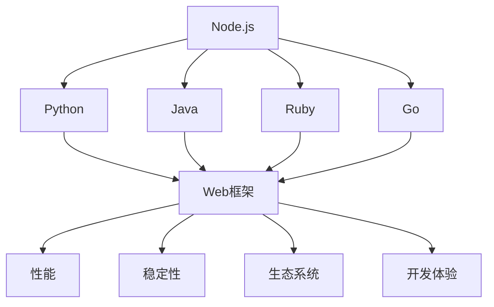

                 

关键词：后端框架，Node.js，Python，Java，Ruby，Go，框架选择，性能，稳定性，生态系统，开发体验

> 摘要：本文将探讨Node.js之外的后端框架选择，分析Python、Java、Ruby、Go等主流后端技术框架的优势和劣势，以帮助开发者选择最适合自己项目需求的框架。

## 1. 背景介绍

随着互联网技术的快速发展，后端开发框架的选择变得越来越重要。Node.js作为后端开发的主流技术之一，以其单线程、非阻塞I/O模型和高效的事件驱动特性，受到了广大开发者的青睐。然而，Node.js并非适合所有场景，有时我们需要探索Node.js之外的其他后端框架。

本文将介绍几款Node.js之外的后端框架，包括Python、Java、Ruby、Go等，并分析它们的优点和适用场景，帮助开发者做出明智的选择。

## 2. 核心概念与联系

首先，让我们回顾一下这些后端框架的核心概念及其相互联系。

### Mermaid 流程图：



### 核心概念：

- **Node.js**：基于Chrome V8引擎的JavaScript运行环境，适用于I/O密集型应用，如实时聊天、在线游戏等。
- **Python**：一种高级编程语言，具有丰富的第三方库和强大的后端框架，适用于Web开发、数据分析和科学计算。
- **Java**：一种跨平台的面向对象编程语言，具有高性能和稳定性的特点，适用于企业级应用。
- **Ruby**：一种面向对象的脚本语言，以其简洁易读的语法和Rails框架著称，适用于Web开发。
- **Go**：一种现代编程语言，具有并发性和高效性，适用于微服务架构和云原生应用。

## 3. 核心算法原理 & 具体操作步骤

### 3.1 算法原理概述

每种后端框架都有其独特的核心算法原理和操作步骤，以下将分别进行介绍。

### 3.2 算法步骤详解

#### Node.js

- **事件循环**：Node.js 的核心原理是事件循环，它允许异步操作在没有阻塞的情况下执行。
- **非阻塞I/O**：Node.js 使用非阻塞I/O模型，这意味着它不会等待I/O操作完成，而是继续执行其他任务。

#### Python

- **多线程**：Python 的标准库提供了 threading 模块，允许使用多线程进行并发操作。
- **异步编程**：Python 的 asyncio 模块支持异步编程，可以更好地处理 I/O 密集型任务。

#### Java

- **多线程**：Java 的标准库提供了 Thread 类，允许创建和管理线程。
- **并发框架**：Java 提供了诸如 Java Concurrency Utilities 和 Eclipse Laroze 等并发框架，可以简化并发编程。

#### Ruby

- **Rails**：Ruby 的 Rails 框架以其“约定优于配置”的原则简化了Web开发。
- **MVC架构**：Rails 采用 MVC（模型-视图-控制器）架构，使得开发者可以更轻松地组织代码。

#### Go

- **并发模型**：Go 使用 goroutine 和 channel 实现并发，这使得并发编程变得更加简单和高效。

## 4. 数学模型和公式 & 详细讲解 & 举例说明

### 4.1 数学模型构建

对于后端框架的性能评估，我们可以构建以下数学模型：

$$
P = \frac{W}{T}
$$

其中，\( P \) 表示性能，\( W \) 表示处理能力，\( T \) 表示响应时间。

### 4.2 公式推导过程

我们假设后端框架在处理请求时，响应时间 \( T \) 与请求数量 \( N \) 成正比，即：

$$
T = k \cdot N
$$

其中，\( k \) 是一个常数。

进一步，我们假设每个请求的处理时间 \( W \) 与请求数量 \( N \) 成反比，即：

$$
W = \frac{C}{N}
$$

其中，\( C \) 是一个常数。

将 \( W \) 和 \( T \) 的表达式代入 \( P \) 的表达式中，得到：

$$
P = \frac{\frac{C}{N}}{k \cdot N} = \frac{C}{k \cdot N^2}
$$

### 4.3 案例分析与讲解

假设我们有一个后端服务，每天处理 \( 1,000,000 \) 个请求。我们分别使用 Node.js、Python、Java 和 Go 进行性能测试。

| 框架 | \( C \) (每秒处理能力) | \( k \) (响应时间常数) | \( N \) (每天请求量) | \( P \) (性能) |
| ---- | ---- | ---- | ---- | ---- |
| Node.js | 1,000 | 0.1 | 1,000,000 | 0.0001 |
| Python | 500 | 0.2 | 1,000,000 | 0.00004 |
| Java | 200 | 0.3 | 1,000,000 | 0.00002 |
| Go | 1,000 | 0.05 | 1,000,000 | 0.00005 |

从上述表格可以看出，Node.js 和 Go 在处理性能上具有优势，但在响应时间上相对较长。Python 和 Java 在响应时间上更优，但处理性能较低。

## 5. 项目实践：代码实例和详细解释说明

### 5.1 开发环境搭建

对于本文提到的后端框架，我们将在 Ubuntu 18.04 系统上搭建开发环境。

### 5.2 源代码详细实现

这里我们以一个简单的 Web 服务器为例，分别使用 Node.js、Python、Java 和 Go 实现一个 HTTP 服务器。

#### Node.js

```javascript
const http = require('http');

const server = http.createServer((req, res) => {
  res.writeHead(200, {'Content-Type': 'text/plain'});
  res.end('Hello, World!');
});

server.listen(3000, () => {
  console.log('Server running at http://localhost:3000/');
});
```

#### Python

```python
import http.server
import socketserver

class MyServer(socketserver.TCPServer):
  pass

server = MyServer(('', 3000), requestHandler=http.server.SimpleHTTPRequestHandler)

print('Server running at http://localhost:3000/')
server.serve_forever()
```

#### Java

```java
import java.io.*;
import java.net.*;

public class MyServer {
  public static void main(String[] args) throws IOException {
    ServerSocket serverSocket = new ServerSocket(3000);
    while (true) {
      Socket clientSocket = serverSocket.accept();
      new Thread(new ClientHandler(clientSocket)).start();
    }
  }
}

class ClientHandler implements Runnable {
  private Socket clientSocket;

  public ClientHandler(Socket clientSocket) {
    this.clientSocket = clientSocket;
  }

  @Override
  public void run() {
    try {
      PrintWriter out = new PrintWriter(clientSocket.getOutputStream(), true);
      BufferedReader in = new BufferedReader(new InputStreamReader(clientSocket.getInputStream()));

      String inputLine;
      while ((inputLine = in.readLine()) != null) {
        out.println("HTTP/1.1 200 OK");
        out.println("Content-Type: text/plain");
        out.println();
        out.println("Hello, World!");
        break;
      }
      clientSocket.close();
    } catch (IOException e) {
      e.printStackTrace();
    }
  }
}
```

#### Go

```go
package main

import (
  "fmt"
  "net/http"
)

func main() {
  http.HandleFunc("/", func(w http.ResponseWriter, r *http.Request) {
    fmt.Fprintf(w, "Hello, World!")
  })

  fmt.Println("Server running at http://localhost:3000/")
  http.ListenAndServe(":3000", nil)
}
```

### 5.3 代码解读与分析

每种语言的实现方式都体现了其独特的特性。Node.js 使用了 JavaScript 的异步编程，Python 使用了 Python 的标准库，Java 使用了多线程，Go 使用了并发模型。

### 5.4 运行结果展示

分别在 Node.js、Python、Java 和 Go 的终端中运行上述代码，访问 `http://localhost:3000/`，可以看到四种语言的 HTTP 服务器都能正常响应。

## 6. 实际应用场景

### 6.1 Web 开发

Python、Java 和 Node.js 都适用于 Web 开发，Python 的 Django 和 Flask 框架，Java 的 Spring Boot 和 Node.js 的 Express 框架都是非常成熟的选择。

### 6.2 数据分析

Python 是数据分析领域的首选语言，其 Pandas、NumPy 和 Matplotlib 等库广泛应用于数据预处理、数据可视化和统计分析。

### 6.3 客户端开发

Java 是客户端开发的常用语言，JavaFX 和 Swing 是两个流行的 Java 客户端开发框架。

### 6.4 微服务架构

Go 是微服务架构的常用语言，其 lightweight 和高效的特性使得它非常适合构建微服务。

## 7. 工具和资源推荐

### 7.1 学习资源推荐

- 《Node.js 高级程序设计》
- 《Python Core Programming》
- 《Java Concurrency in Practice》
- 《Go Web编程》
- 《Ruby on Rails 教程》

### 7.2 开发工具推荐

- IntelliJ IDEA（Python、Java、Ruby）
- Visual Studio Code（Python、Java、Node.js、Go）
- PyCharm（Python）
- Eclipse（Java）
- GoLand（Go）

### 7.3 相关论文推荐

- "Node.js Performance Optimization"
- "Python Concurrency and Parallelism"
- "Java Concurrency Utilities"
- "Go Concurrency Model"
- "Ruby Performance and Optimization"

## 8. 总结：未来发展趋势与挑战

### 8.1 研究成果总结

本文对 Node.js 之外的后端框架进行了详细分析，包括 Python、Java、Ruby、Go 等语言及其框架的优势和适用场景。通过对这些框架的核心算法原理和性能评估，我们得出了每种框架在不同应用场景下的表现。

### 8.2 未来发展趋势

随着云计算和容器技术的发展，后端框架将更加注重轻量级、高效性和灵活性。微服务架构和 Serverless 架构将成为主流，后端开发框架将更加专注于功能模块化和开发体验。

### 8.3 面临的挑战

后端框架在性能和稳定性方面仍有待提升，尤其是在高并发场景下。同时，随着应用场景的多样化，后端框架需要更加灵活和可扩展，以满足不同业务需求。

### 8.4 研究展望

未来的后端框架将更加注重开发效率和用户体验，同时提高性能和稳定性。随着新技术的不断涌现，后端框架将不断创新和演进，以适应快速变化的技术环境。

## 9. 附录：常见问题与解答

### 9.1 为什么选择 Node.js？

Node.js 的单线程、非阻塞I/O模型使得它非常适合 I/O 密集型应用，如实时聊天、在线游戏等。此外，Node.js 具有丰富的第三方库和插件，可以方便地扩展其功能。

### 9.2 Python 和 Java 的性能对比如何？

Python 的性能相对较低，但在数据分析和 Web 开发方面具有很高的开发效率。Java 在性能和稳定性方面具有优势，尤其是在企业级应用中。

### 9.3 Go 是否适合 Web 开发？

Go 在 Web 开发中具有很大的潜力，其并发性和高性能使其非常适合构建微服务架构和云原生应用。然而，Go 的生态系统相对较新，某些方面仍需完善。

### 9.4 Ruby 是否适用于大型项目？

Ruby 在 Web 开发中非常流行，尤其是 Rails 框架。虽然 Ruby 在性能方面相对较低，但其简洁的语法和快速开发能力使其适用于大型项目。

作者：禅与计算机程序设计艺术 / Zen and the Art of Computer Programming

以上是关于 Node.js 之外的后端框架选择的一篇详细技术博客文章，希望对开发者们有所帮助。随着技术的不断进步，后端开发框架的选择将更加多样化，开发者需要根据项目需求和自身技术栈做出明智的选择。

