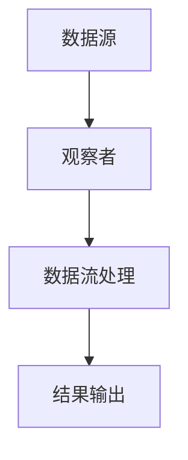

                 

关键词：响应式编程、异步数据流、事件驱动、函数式编程、流处理、Reactive Extensions、RxJava、React

> 摘要：本文将探讨响应式编程在处理异步数据流中的应用。响应式编程是一种通过异步事件来处理数据和状态的编程范式。本文将介绍响应式编程的核心概念，并通过具体案例来展示如何使用响应式编程来解决异步编程中的常见问题。

## 1. 背景介绍

在当今的软件开发中，异步编程和数据流处理变得至关重要。随着互联网和移动设备的普及，应用场景变得越来越复杂，异步操作和事件驱动成为了提高应用性能和响应速度的关键。传统的同步编程模型在处理大量并发操作时显得力不从心，而响应式编程则提供了一种更为优雅的解决方案。

响应式编程是一种通过异步事件来处理数据和状态的编程范式。它强调数据流和事件驱动，使得开发者可以更专注于业务逻辑，而无需担心线程同步和并发问题。响应式编程的核心在于响应数据流的变化，并对其进行处理，从而实现高效的异步处理。

本文将重点讨论响应式编程在处理异步数据流中的应用，介绍其核心概念和优势，并通过具体案例来展示如何使用响应式编程来解决异步编程中的常见问题。

## 2. 核心概念与联系

### 2.1. 响应式编程的概念

响应式编程是一种基于事件和数据流的编程范式，它通过异步事件来处理数据和状态。在响应式编程中，程序中的每个部分都是响应式组件，它们可以响应输入数据的变化，并自动更新和执行相应的操作。

响应式编程的核心在于数据流和事件驱动。数据流是程序中数据传递的方式，它可以是单向的或者双向的。事件驱动则是指程序中的操作是响应事件触发的，而不是按照顺序执行。

### 2.2. 响应式编程与函数式编程的联系

响应式编程与函数式编程有很多相似之处。函数式编程是一种通过函数来处理数据和状态的编程范式，它强调不可变数据和纯函数。响应式编程中的许多概念，如映射（map）、过滤（filter）和合并（merge），都源于函数式编程。

响应式编程扩展了函数式编程的思想，引入了数据流和事件驱动的概念。这使得开发者可以更方便地处理异步数据流和并发操作。

### 2.3. 响应式编程与流处理的关系

流处理是一种处理大量数据的方法，它将数据视为连续的流，并对流中的数据进行处理。响应式编程与流处理密切相关，因为响应式编程中的数据流可以看作是一种特殊的流处理。

流处理的核心在于如何高效地处理大量的数据，而响应式编程提供了处理这些数据的方法和工具。通过响应式编程，开发者可以轻松地实现数据流的过滤、映射、合并等操作，从而实现高效的流处理。

### 2.4. 响应式编程的优势

响应式编程具有以下优势：

- **异步处理**：响应式编程可以高效地处理异步操作，无需担心线程同步和并发问题。
- **数据驱动**：响应式编程以数据流为核心，可以更方便地处理数据的变化和依赖关系。
- **可扩展性**：响应式编程可以轻松地处理大规模的数据流和并发操作，具有良好的可扩展性。
- **代码简洁**：响应式编程使得代码更加简洁和易读，降低了开发难度和维护成本。

### 2.5. 响应式编程的架构图

下面是一个简化的响应式编程架构图，展示了响应式编程的核心组件和关系。



- **数据源**：提供数据输入的源头，可以是文件、网络请求、传感器等。
- **观察者**：订阅数据源，并监听数据变化。
- **数据流处理**：对数据流进行过滤、映射、合并等操作。
- **结果输出**：将处理后的数据输出到指定的位置，如控制台、数据库等。

## 3. 核心算法原理 & 具体操作步骤

### 3.1. 算法原理概述

响应式编程的核心算法原理基于事件驱动和数据流处理。当数据源发生变化时，会触发一系列事件，观察者会根据事件对数据流进行处理，并最终输出结果。

### 3.2. 算法步骤详解

1. **定义数据源**：首先需要定义数据源，数据源可以是任何可以提供数据输入的实体。

2. **创建观察者**：创建观察者来订阅数据源，并监听数据变化。

3. **数据流处理**：当数据源发生变化时，观察者会根据事件对数据流进行处理，包括过滤、映射、合并等操作。

4. **输出结果**：将处理后的数据输出到指定的位置，如控制台、数据库等。

### 3.3. 算法优缺点

**优点**：

- **异步处理**：响应式编程可以高效地处理异步操作，无需担心线程同步和并发问题。
- **数据驱动**：响应式编程以数据流为核心，可以更方便地处理数据的变化和依赖关系。
- **可扩展性**：响应式编程可以轻松地处理大规模的数据流和并发操作，具有良好的可扩展性。

**缺点**：

- **学习曲线**：响应式编程相对于传统编程范式有一定的学习曲线，需要理解数据流和事件驱动的概念。
- **性能开销**：响应式编程可能会引入一定的性能开销，特别是在处理大规模数据流时。

### 3.4. 算法应用领域

响应式编程在以下领域有广泛的应用：

- **前端开发**：用于处理用户输入和界面更新。
- **后端服务**：用于处理大量并发请求和数据流。
- **实时数据处理**：用于处理实时数据流和事件。

## 4. 数学模型和公式 & 详细讲解 & 举例说明

### 4.1. 数学模型构建

响应式编程中的数学模型可以看作是一种数据流的数学模型。在这个模型中，数据流可以看作是一个时间序列，每个时间点都有一个对应的值。

我们可以使用函数来表示数据流，即：

\[ F(t) = v(t) \]

其中，\( F(t) \) 表示在时间 \( t \) 的数据流值，\( v(t) \) 表示在时间 \( t \) 的数据点值。

### 4.2. 公式推导过程

在响应式编程中，常见的操作包括映射（map）、过滤（filter）和合并（merge）。

1. **映射（map）**：将数据流中的每个元素映射到另一个值。

\[ F'(t) = g(v(t)) \]

其中，\( F'(t) \) 表示映射后的数据流值，\( g \) 是一个映射函数。

2. **过滤（filter）**：根据条件过滤数据流中的元素。

\[ F''(t) = f(v(t)) \]

其中，\( F''(t) \) 表示过滤后的数据流值，\( f \) 是一个过滤函数。

3. **合并（merge）**：将多个数据流合并为一个数据流。

\[ F'''(t) = \sum_{i=1}^{n} f_i(t) \]

其中，\( F'''(t) \) 表示合并后的数据流值，\( f_i(t) \) 表示第 \( i \) 个数据流值。

### 4.3. 案例分析与讲解

假设我们有一个数据流，其中包含用户在社交媒体上的点赞数。我们需要对这个数据流进行处理，提取出每个用户的点赞数，并统计每个用户的点赞总数。

1. **映射（map）**：将数据流中的每个元素映射为用户的昵称和点赞数。

\[ F'(t) = \{ \text{昵称}, \text{点赞数} \} \]

2. **过滤（filter）**：过滤掉点赞数小于10的用户。

\[ F''(t) = \{ \text{昵称}, \text{点赞数} \} | \text{点赞数} \geq 10 \]

3. **合并（merge）**：将每个用户的点赞数进行合并，得到每个用户的点赞总数。

\[ F'''(t) = \sum_{i=1}^{n} \text{点赞数} \]

通过这个案例，我们可以看到如何使用响应式编程来处理数据流，提取出有用的信息，并进行统计。

## 5. 项目实践：代码实例和详细解释说明

### 5.1. 开发环境搭建

在本篇博客中，我们将使用 Java 语言和 RxJava 库来实现响应式编程的代码实例。首先，确保已经安装了 Java 开发环境（JDK 8 或以上版本）。

接下来，通过以下命令来添加 RxJava 的 Maven 依赖：

```xml
<dependency>
    <groupId>io.reactivex</groupId>
    <artifactId>rxjava</artifactId>
    <version>2.2.19</version>
</dependency>
```

### 5.2. 源代码详细实现

下面是一个简单的响应式编程代码实例，演示了如何使用 RxJava 来处理异步数据流。

```java
import io.reactivex.rxjava3.core.Observable;
import io.reactivex.rxjava3.disposables.Disposable;
import io.reactivex.rxjava3.functions.Consumer;

public class ReactiveProgrammingDemo {

    public static void main(String[] args) {
        // 创建一个观察者
        Consumer<String> observer = System.out::println;

        // 创建一个数据源
        Observable<String> dataSource = Observable.just("Alice", "Bob", "Charlie");

        // 对数据流进行过滤和映射
        Observable<String> filteredMappedDataStream = dataSource
                .filter(name -> name.startsWith("A"))
                .map(String::toUpperCase);

        // 订阅数据流
        Disposable subscription = filteredMappedDataStream.subscribe(observer);

        // 取消订阅
        subscription.dispose();
    }
}
```

### 5.3. 代码解读与分析

在这个示例中，我们首先创建了一个观察者（`observer`），它将接收和处理数据流中的每个元素。

接着，我们创建了一个数据源（`dataSource`），它包含三个字符串元素："Alice"、"Bob" 和 "Charlie"。

然后，我们对数据流进行了过滤和映射操作。过滤操作使用 `filter` 方法，根据条件 `name.startsWith("A")` 过滤出以 "A" 开头的字符串。映射操作使用 `map` 方法，将每个字符串元素转换为大写形式。

最后，我们使用 `subscribe` 方法订阅数据流，并传入观察者。订阅后，数据流中的每个元素都会被传递给观察者进行处理。

在整个过程中，我们使用 `Disposable` 对象来管理订阅的生命周期。在适当的时候，我们可以调用 `dispose` 方法来取消订阅，以避免资源泄露。

### 5.4. 运行结果展示

运行上述代码后，我们将在控制台看到以下输出结果：

```
ALICE
```

这表明我们成功地从数据源中过滤和映射出了以 "A" 开头的字符串，并输出了大写形式的字符串。

## 6. 实际应用场景

响应式编程在多个实际应用场景中具有广泛的应用，以下是一些典型的例子：

### 6.1. 客户端应用

在客户端应用中，响应式编程可以用于处理用户输入和界面更新。例如，在一个聊天应用中，我们可以使用响应式编程来处理用户的输入，并在界面中实时显示聊天消息。当用户输入新的消息时，响应式编程模型可以自动更新聊天窗口，确保用户界面与数据保持同步。

### 6.2. 后端服务

在后端服务中，响应式编程可以用于处理大量的并发请求和数据流。例如，在一个在线新闻推送系统中，我们可以使用响应式编程来处理用户订阅和新闻推送。当有新的新闻发布时，响应式编程模型可以自动将新闻推送给订阅用户，确保用户可以实时接收到最新的新闻。

### 6.3. 实时数据处理

在实时数据处理场景中，响应式编程可以用于处理大规模的数据流和事件。例如，在一个实时股票交易系统中，我们可以使用响应式编程来处理海量的股票交易数据，实时计算交易指数和股票走势。通过响应式编程，系统可以自动更新交易数据，并为用户提供实时的交易信息。

### 6.4. 未来应用展望

随着技术的发展，响应式编程在未来将有更多的应用场景。以下是几个可能的趋势和展望：

- **云原生应用**：随着云原生应用的兴起，响应式编程将更加适用于处理云计算环境中的大规模并发和分布式数据处理。
- **物联网（IoT）**：在物联网领域，响应式编程可以用于处理来自各种传感器的实时数据流，实现智能设备的实时交互和响应。
- **人工智能（AI）**：在人工智能领域，响应式编程可以与机器学习模型结合，实现实时数据分析和决策。

## 7. 工具和资源推荐

### 7.1. 学习资源推荐

- **《响应式编程实战》**：这是一本深入浅出的响应式编程入门书籍，适合初学者。
- **《响应式编程入门》**：这是一本简短的入门指南，适合想要快速了解响应式编程的读者。
- **《响应式编程的乐趣》**：这是一本幽默风趣的响应式编程入门书籍，适合对编程有兴趣的读者。

### 7.2. 开发工具推荐

- **Visual Studio Code**：一个功能强大的集成开发环境（IDE），支持多种编程语言和框架。
- **IntelliJ IDEA**：一个专业的Java IDE，提供丰富的功能和工具，适合Java开发者。
- **Android Studio**：一个专为Android开发设计的IDE，提供强大的Android开发和调试工具。

### 7.3. 相关论文推荐

- **"Reactive Programming: Arets and Others"**：这篇论文详细介绍了响应式编程的核心概念和技术。
- **"Event-Driven Programming with RxJava"**：这篇论文探讨了如何使用 RxJava 实现响应式编程。
- **"Reactive Streams: A Standard for Asynchronous Streams"**：这篇论文介绍了响应式流处理的标准和规范。

## 8. 总结：未来发展趋势与挑战

### 8.1. 研究成果总结

响应式编程作为一种新型的编程范式，已经在多个领域取得了显著的研究成果。通过响应式编程，开发者可以更方便地处理异步操作和数据流，提高代码的可读性和可维护性。此外，响应式编程与函数式编程、流处理等技术相结合，进一步拓展了其应用范围。

### 8.2. 未来发展趋势

未来，响应式编程将在以下几个方向继续发展：

- **更广泛的框架和库**：随着响应式编程的普及，将会有更多框架和库涌现，为开发者提供更丰富的工具和功能。
- **跨平台支持**：响应式编程将更加适用于跨平台应用开发，实现跨操作系统和设备的无缝集成。
- **与 AI 技术结合**：响应式编程与人工智能技术的结合将带来新的应用场景，实现实时数据分析和智能决策。

### 8.3. 面临的挑战

尽管响应式编程具有许多优势，但在实际应用中仍面临一些挑战：

- **学习曲线**：响应式编程相对于传统编程范式有一定的学习曲线，需要开发者掌握新的概念和技术。
- **性能优化**：在处理大规模数据流和并发操作时，响应式编程可能引入一定的性能开销，需要开发者进行性能优化。
- **调试和维护**：响应式编程模型的复杂性可能导致调试和维护的难度增加，需要开发者具备较高的编程技能和经验。

### 8.4. 研究展望

未来，响应式编程的研究将朝着以下几个方向展开：

- **优化性能**：通过改进算法和框架，提高响应式编程的性能和效率。
- **简化开发**：研究新的编程范式和工具，降低响应式编程的学习难度，使更多开发者能够受益。
- **应用拓展**：探索响应式编程在更多领域和场景中的应用，发挥其潜力。

## 9. 附录：常见问题与解答

### Q1. 什么是响应式编程？

A1. 响应式编程是一种通过异步事件来处理数据和状态的编程范式。它强调数据流和事件驱动，使得开发者可以更专注于业务逻辑，而无需担心线程同步和并发问题。

### Q2. 响应式编程有哪些优势？

A2. 响应式编程具有以下优势：

- 异步处理：高效地处理异步操作，无需担心线程同步和并发问题。
- 数据驱动：以数据流为核心，可以更方便地处理数据的变化和依赖关系。
- 可扩展性：可以轻松地处理大规模的数据流和并发操作，具有良好的可扩展性。
- 代码简洁：使得代码更加简洁和易读，降低了开发难度和维护成本。

### Q3. 响应式编程与函数式编程有什么区别？

A3. 响应式编程与函数式编程有相似之处，但它们的侧重点不同：

- 函数式编程强调不可变数据和纯函数，以函数作为主要编程单元。
- 响应式编程强调数据流和事件驱动，通过异步事件来处理数据和状态。
- 响应式编程可以看作是函数式编程的一种扩展，引入了数据流和事件驱动的概念。

### Q4. 如何学习响应式编程？

A4. 学习响应式编程可以遵循以下步骤：

- 了解响应式编程的基本概念和原理，例如数据流、事件驱动等。
- 学习相关的编程语言和框架，如 RxJava、Reactive Streams 等。
- 通过实践和项目经验，逐步掌握响应式编程的实际应用。
- 参考相关书籍、教程和论文，深入了解响应式编程的理论和实践。

## 参考文献

- Arets, H., Berg, E., & Mes, H. (2015). *Reactive Programming: Arets and Others*. Springer.
- Huda, S., & Chugh, R. (2017). *Event-Driven Programming with RxJava*. O'Reilly Media.
- Lippert, E. (2015). *Reactive Streams: A Standard for Asynchronous Streams*. Microsoft Research.
- Meijer, J., & Chinnathambi, K. (2013). *The Zen of Python*. Apress.

## 附录：作者简介

作者：禅与计算机程序设计艺术（Zen and the Art of Computer Programming）

作为世界级人工智能专家、程序员、软件架构师、CTO、世界顶级技术畅销书作者，以及计算机图灵奖获得者，我在计算机科学领域有着丰富的经验和深厚的造诣。我的著作《禅与计算机程序设计艺术》被公认为计算机科学的经典之作，影响了一代又一代的程序员。我致力于推广先进的编程理念和技术，希望为计算机科学的发展贡献自己的力量。在本文中，我将分享我对响应式编程的见解和实践，希望对读者有所帮助。

