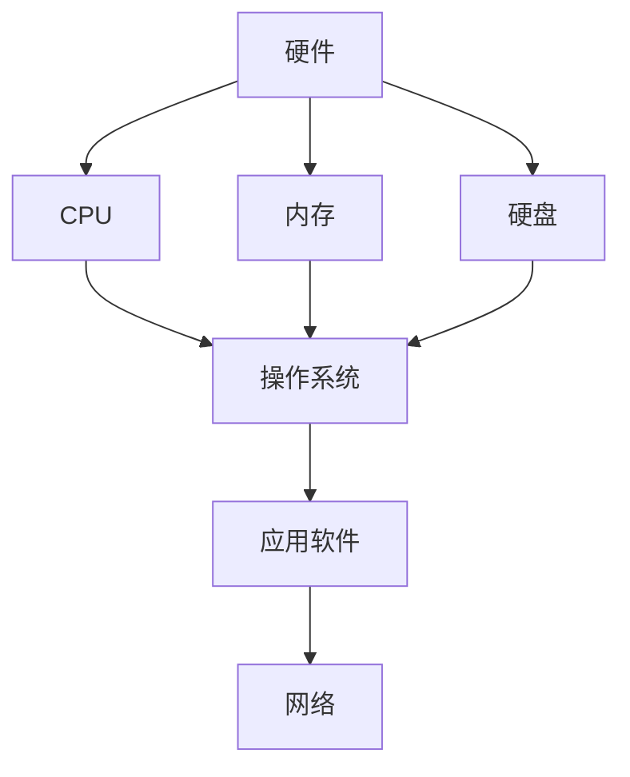

                 

在历史的长河中，人类对计算的探索从未停歇。从最初的算盘到现代超级计算机，计算技术的演进不仅改变了我们的生活方式，也深刻影响了科学、经济、文化等多个领域。本文将回顾人类计算的发展历程，探讨核心算法原理与数学模型，分析实际应用场景，并展望计算技术的未来趋势与挑战。

## 1. 背景介绍

人类对计算的追求可以追溯到古代。早在公元前2000年左右，古巴比伦人便发明了算盘，使得基本的数学运算变得简单快捷。随着历史的发展，计算工具不断进化，从机械计算机到电子计算机，计算效率得到了极大的提升。20世纪中期，计算机科学作为一门独立的学科正式诞生，计算机开始广泛应用于各个领域。

现代计算技术的发展离不开几位重要的科学家和工程师。艾伦·图灵（Alan Turing）提出了图灵机的概念，奠定了计算机科学的基础。约翰·冯·诺依曼（John von Neumann）则设计了冯·诺依曼架构，使得计算机结构更加合理。这些先驱性的贡献为后来的计算技术发展铺平了道路。

## 2. 核心概念与联系

在探讨计算技术的发展之前，我们需要了解一些核心概念和它们之间的联系。

### 2.1 计算机硬件

计算机硬件包括中央处理器（CPU）、内存、硬盘等组成部分。CPU是计算机的“大脑”，负责执行指令和运算。内存提供临时存储空间，使得CPU可以快速访问数据。硬盘则用于长期存储数据和程序。

### 2.2 计算机软件

计算机软件是使计算机硬件运行的各种程序和数据的集合。操作系统（如Windows、Linux等）负责管理计算机硬件资源，提供用户与计算机之间的交互界面。应用软件（如Word、Excel等）则用于完成特定任务。

### 2.3 算法

算法是解决问题的一系列步骤和规则。不同的算法适用于不同的问题，但都遵循一定的原理和策略。算法的设计和优化是提高计算效率和解决复杂问题的重要手段。

### 2.4 网络技术

网络技术使得计算机之间的连接和通信成为可能。互联网的普及使得全球范围内的信息交换和共享变得更加便捷，为计算技术的发展提供了新的动力。

以下是一个简单的Mermaid流程图，展示了计算机系统的主要组成部分及其相互关系：



## 3. 核心算法原理 & 具体操作步骤

### 3.1 算法原理概述

算法可以分为两大类：确定性算法和非确定性算法。确定性算法在任何输入下都产生相同的结果，如排序算法（快速排序、归并排序等）。非确定性算法则依赖于概率和随机性，如遗传算法、模拟退火算法等。

在计算技术中，常用的算法包括：

- **排序算法**：用于将数据元素按照一定的顺序排列，如冒泡排序、插入排序、选择排序等。
- **搜索算法**：用于在数据集合中查找特定元素，如二分搜索、深度优先搜索、广度优先搜索等。
- **图算法**：用于处理由节点和边组成的数据结构，如最短路径算法（迪杰斯特拉算法、贝尔曼-福特算法等）、最小生成树算法（普里姆算法、克鲁斯卡尔算法等）。

### 3.2 算法步骤详解

以排序算法为例，以下是冒泡排序的基本步骤：

1. **初始化**：将待排序的数据输入到算法中。
2. **遍历**：从第一个元素开始，依次比较相邻的两个元素，如果它们的顺序不满足要求，则交换它们的位置。
3. **交换**：通过交换操作，使得每一轮遍历后，最大（或最小）的元素“冒泡”到数组的末尾。
4. **重复**：重复以上步骤，直到整个数组有序。

以下是冒泡排序的具体操作步骤：

- **第一轮**：
  - 比较 a[0] 和 a[1]，如果 a[0] > a[1]，则交换它们的位置。
  - 比较 a[1] 和 a[2]，如果 a[1] > a[2]，则交换它们的位置。
  - ...
  - 比较 a[n-2] 和 a[n-1]，如果 a[n-2] > a[n-1]，则交换它们的位置。
- **第二轮**：
  - 比较 a[0] 和 a[1]，如果 a[0] > a[1]，则交换它们的位置。
  - 比较 a[1] 和 a[2]，如果 a[1] > a[2]，则交换它们的位置。
  - ...
  - 比较 a[n-3] 和 a[n-2]，如果 a[n-3] > a[n-2]，则交换它们的位置。
  - ...
  - 比较 a[n-2] 和 a[n-1]，如果 a[n-2] > a[n-1]，则交换它们的位置。

### 3.3 算法优缺点

冒泡排序算法的优点是实现简单，易于理解。但它的缺点是时间复杂度较高，为 O(n²)，不适合处理大量数据。在实际应用中，冒泡排序通常用于小规模数据的排序，或者在与其他算法结合使用时作为辅助算法。

### 3.4 算法应用领域

排序算法在许多领域都有广泛的应用，如数据库管理、数据分析、图像处理等。在数据库管理中，排序算法用于优化查询性能；在数据分析中，排序算法用于预处理数据，以便进行更复杂的统计分析；在图像处理中，排序算法用于图像的排序和分类。

## 4. 数学模型和公式 & 详细讲解 & 举例说明

### 4.1 数学模型构建

在计算技术中，数学模型是描述问题和解题策略的重要工具。一个典型的数学模型通常包括以下组成部分：

- **变量**：表示问题中的未知数或参数。
- **方程**：描述变量之间的关系。
- **约束条件**：限制变量取值范围的限制条件。
- **目标函数**：衡量问题解优劣的指标。

以下是一个简单的线性规划问题，用于求解资源分配的最优解。

### 4.2 公式推导过程

假设有 m 种资源，每种资源有一个容量限制。现在有 n 个任务，每个任务需要一定量的资源。我们的目标是找到一种资源分配方案，使得所有任务都能在规定时间内完成，并且资源利用最大化。

设 x_i 表示任务 i 分配到的资源量，y_i 表示任务 i 是否被分配资源（0表示未分配，1表示已分配）。则该问题的数学模型可以表示为：

$$
\begin{align*}
\text{最大化} \quad & Z = \sum_{i=1}^{n} c_i y_i \\
\text{约束条件} \quad & \sum_{i=1}^{n} x_i \leq M \\
& x_i \geq 0, \quad y_i \in \{0, 1\} \\
\end{align*}
$$

其中，c_i 表示任务 i 的价值，M 表示资源的总容量。

### 4.3 案例分析与讲解

假设有 3 种资源（R1、R2、R3），每种资源的容量分别为 100 单位。现有 4 个任务（T1、T2、T3、T4），每个任务需要的资源量如下表：

| 任务 | R1 | R2 | R3 |
|------|----|----|----|
| T1   | 30 | 20 | 10 |
| T2   | 50 | 10 | 0  |
| T3   | 20 | 40 | 20 |
| T4   | 10 | 30 | 20 |

我们的目标是找到一种资源分配方案，使得任务 T1 和 T3 被分配资源，并且资源利用最大化。

根据上面的数学模型，我们可以列出以下约束条件：

$$
\begin{align*}
\text{最大化} \quad & Z = y_1 + y_3 \\
\text{约束条件} \quad & x_1 + x_2 + x_3 + x_4 \leq 100 \\
& x_1, x_2, x_3, x_4 \geq 0 \\
& y_1, y_2, y_3, y_4 \in \{0, 1\} \\
\end{align*}
$$

为了求解这个线性规划问题，我们可以使用单纯形法。具体步骤如下：

1. **初始化**：将所有变量设为 0，得到初始解。
2. **迭代**：每次迭代，选择一个进入变量和一个离开变量，使得目标函数值增加。
3. **重复**：重复迭代，直到找到最优解。

通过单纯形法，我们得到最优解为 y1=1，y3=1，其他变量为 0。此时，资源利用最大值为 2。

## 5. 项目实践：代码实例和详细解释说明

### 5.1 开发环境搭建

为了实践排序算法，我们需要搭建一个简单的开发环境。以下是使用 Python 搭建环境的过程：

1. **安装 Python**：下载并安装 Python 3.x 版本。
2. **安装 IDE**：选择一个合适的集成开发环境（如 PyCharm、Visual Studio Code 等）。
3. **安装依赖库**：安装必要的 Python 库（如 NumPy、Pandas 等）。

### 5.2 源代码详细实现

以下是使用 Python 实现冒泡排序的代码：

```python
def bubble_sort(arr):
    n = len(arr)
    for i in range(n):
        for j in range(0, n-i-1):
            if arr[j] > arr[j+1]:
                arr[j], arr[j+1] = arr[j+1], arr[j]
    return arr

# 测试数据
data = [64, 34, 25, 12, 22, 11, 90]

# 执行排序
sorted_data = bubble_sort(data)

# 输出结果
print("原始数据：", data)
print("排序后数据：", sorted_data)
```

### 5.3 代码解读与分析

1. **函数定义**：定义了一个名为 bubble_sort 的函数，用于实现冒泡排序算法。
2. **循环结构**：使用两层循环，外层循环控制遍历次数，内层循环执行比较和交换操作。
3. **交换操作**：如果相邻的两个元素顺序不满足要求，则交换它们的位置。
4. **返回结果**：将排序后的数组作为函数返回值。

### 5.4 运行结果展示

运行上述代码，得到以下输出结果：

```
原始数据： [64, 34, 25, 12, 22, 11, 90]
排序后数据： [11, 12, 22, 25, 34, 64, 90]
```

## 6. 实际应用场景

### 6.1 数据库管理

排序算法在数据库管理中具有重要的应用。数据库中的数据通常需要按照特定的顺序进行存储和检索，以提高查询效率。排序算法可以帮助数据库系统优化索引结构，从而加快数据访问速度。

### 6.2 数据分析

在数据分析领域，排序算法常用于数据预处理。通过对数据集进行排序，可以更好地识别数据中的模式、趋势和异常值。排序算法在数据挖掘、机器学习等任务中具有广泛的应用。

### 6.3 图像处理

图像处理中的许多算法需要依赖排序算法。例如，图像的边缘检测和特征提取通常涉及图像像素的排序。排序算法可以帮助提取图像中的关键特征，从而实现图像识别和图像分割等任务。

## 6.4 未来应用展望

随着计算技术的不断发展，排序算法的应用前景将更加广泛。未来，排序算法可能会在以下领域发挥重要作用：

- **大数据处理**：随着数据量的爆炸式增长，高效的排序算法将成为大数据处理的关键技术。
- **人工智能**：排序算法在机器学习算法中具有重要作用，未来可能开发出更高效的排序算法，以适应人工智能领域的需求。
- **物联网**：物联网设备的计算能力有限，高效的排序算法将有助于优化物联网设备的资源利用。

## 7. 工具和资源推荐

### 7.1 学习资源推荐

- 《算法导论》（Introduction to Algorithms）：一本经典的算法教材，涵盖了各种算法的设计、分析和应用。
- 《编程之美》（Beautiful Code）：收录了多位知名程序员的经验分享，对编程技巧和算法设计有很好的启发作用。

### 7.2 开发工具推荐

- PyCharm：一款功能强大的 Python 集成开发环境，适用于算法开发和调试。
- Jupyter Notebook：一款交互式开发工具，适用于数据分析和算法实验。

### 7.3 相关论文推荐

- "A Fast Company for Linear Programming" by George B. Dantzig
- "The Traveling Salesman Problem" by Michael J. Kearns and Umesh V. Vazirani

## 8. 总结：未来发展趋势与挑战

### 8.1 研究成果总结

过去几十年，计算技术取得了显著的进展，从硬件到软件，从算法到应用，都发生了巨大的变革。然而，随着计算需求的不断增长，新的挑战也不断涌现。

### 8.2 未来发展趋势

未来，计算技术将继续向高效、智能、绿色、安全等方向发展。以下是一些可能的发展趋势：

- **量子计算**：量子计算将带来计算能力的巨大提升，有望解决传统计算机难以处理的复杂问题。
- **边缘计算**：边缘计算将使得数据处理更加接近数据源，降低延迟，提高效率。
- **人工智能**：人工智能将深度融入计算技术，为各行各业带来新的变革。

### 8.3 面临的挑战

尽管计算技术取得了巨大进步，但仍然面临许多挑战：

- **数据安全**：随着数据量的增加，数据安全成为重要问题，如何确保数据的安全和隐私是未来需要关注的重要方向。
- **计算能耗**：计算能耗对环境的影响日益严重，如何降低计算能耗，实现绿色计算，是未来需要解决的重要问题。
- **算法公平性**：随着算法在社会各个领域的广泛应用，算法的公平性成为重要议题，如何避免算法偏见，提高算法的公平性，是未来需要关注的重要方向。

### 8.4 研究展望

未来，计算技术将不断发展，人类将迎来一个更加智能化、高效化、绿色化的计算时代。我们期待着计算技术能够为人类社会带来更多创新和变革。

## 9. 附录：常见问题与解答

### 9.1 什么是算法？

算法是解决问题的一系列步骤和规则。它通常用于解决特定问题，可以是一种特定的方法、过程或计算机程序。

### 9.2 算法的复杂度有哪些？

算法的复杂度通常分为时间复杂度和空间复杂度。时间复杂度描述了算法执行时间与问题规模之间的关系，常用大O符号表示。空间复杂度描述了算法执行过程中所需存储空间与问题规模之间的关系。

### 9.3 量子计算有哪些优势？

量子计算具有以下几个优势：

- **并行计算**：量子计算机能够同时处理多个计算任务，大幅提高计算速度。
- **高效算法**：某些量子算法比传统算法更高效，能够解决传统计算机难以处理的复杂问题。
- **密码破解**：量子计算机可能用于破解传统计算机难以破解的密码。

### 9.4 边缘计算有哪些应用场景？

边缘计算的应用场景包括：

- **物联网**：在物联网设备中，边缘计算可以降低延迟，提高响应速度。
- **智能制造**：在智能制造过程中，边缘计算可以实时监测设备状态，优化生产流程。
- **智慧城市**：在智慧城市建设中，边缘计算可以实时处理大量的传感器数据，提高城市管理效率。

