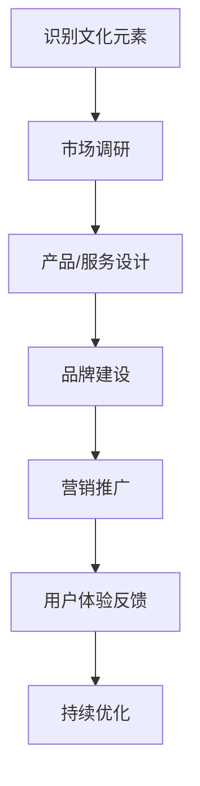

                 

在当今全球化和数字化的时代，中国的文化元素正在逐渐成为商业创新的重要动力。国潮创业，即以中国文化为核心的潮流创业，不仅在国内市场引发了巨大的反响，也在国际舞台上展现出了独特的魅力。本文将探讨中国文化元素在商业中的价值，分析其背后的逻辑和操作步骤，以及如何通过技术手段实现文化元素的商业化。

## 1. 背景介绍

国潮创业，指的是以中国文化元素为灵感，结合现代潮流和创新思维，进行商业创业的实践。近年来，随着中国经济的崛起和文化自信的增强，国潮风在服装、美妆、食品等多个领域迅速崛起。从李宁到故宫文创，再到茶颜悦色的走红，国潮创业已经成为中国商业界的一个热点。

中国文化元素的商业价值不仅仅体现在国内市场，也在国际舞台上得到了广泛的认可。例如，中国的春节文化、传统节日、古代建筑、民间故事等元素，被不断引入到国际品牌和营销活动中，吸引了全球消费者的关注。这表明，中国文化元素具备广泛的市场潜力和商业价值。

## 2. 核心概念与联系

### 2.1 中国文化元素的定义

中国文化元素是指中国传统文化和现代文化中具有代表性的符号、形象、故事和思想。这些元素包括但不限于：书法、国画、古典音乐、传统节日、茶文化、美食、古代建筑、民间故事等。

### 2.2 文化元素的商业化逻辑

文化元素的商业化逻辑主要基于以下几点：

- **文化认同感**：人们对于自己文化的认同感往往较高，这种情感驱动了文化元素在商业中的应用。
- **市场需求**：随着消费者对于个性化、差异化产品需求的增加，文化元素成为满足这一需求的重要资源。
- **文化创新**：通过将传统文化与现代生活方式结合，创造出新的文化产品和服务，满足市场的需求。

### 2.3 文化元素商业化的流程图



## 3. 核心算法原理 & 具体操作步骤

### 3.1 算法原理概述

国潮创业的核心算法可以概括为“文化萃取 - 产品创新 - 市场推广 - 用户反馈 - 持续迭代”。这一算法的核心在于如何有效地从中国文化中提取具有商业价值的元素，并将其转化为具有市场竞争力产品和服务。

### 3.2 算法步骤详解

#### 3.2.1 文化萃取

- **数据收集**：通过文献研究、实地考察、用户调研等方式收集中国文化相关的数据。
- **文化分析**：对收集到的文化数据进行分析，识别出具有商业价值的元素。

#### 3.2.2 产品/服务设计

- **概念生成**：基于分析结果，生成具有文化特色的产品或服务概念。
- **原型设计**：制作产品或服务的原型，进行用户体验测试。

#### 3.2.3 品牌建设

- **品牌定位**：明确产品或服务的品牌定位，包括文化特色、目标市场等。
- **品牌传播**：通过广告、公关、社交媒体等方式进行品牌传播。

#### 3.2.4 营销推广

- **内容营销**：利用文化元素制作有趣、有启发性的内容，吸引目标用户。
- **渠道拓展**：通过线上线下多种渠道推广产品或服务。

#### 3.2.5 用户反馈

- **收集数据**：通过用户调研、数据分析等方式收集用户反馈。
- **分析反馈**：对用户反馈进行分析，识别产品或服务的优势和不足。

#### 3.2.6 持续优化

- **调整策略**：根据用户反馈调整产品或服务策略。
- **优化产品**：不断改进产品或服务的质量和体验。

### 3.3 算法优缺点

#### 优点：

- **文化特色突出**：能够有效地将中国文化元素融入产品或服务中，提高品牌辨识度。
- **市场需求明确**：基于市场需求进行产品设计，提高产品或服务的市场竞争力。
- **用户体验良好**：通过用户体验测试和持续优化，提高用户满意度。

#### 缺点：

- **文化风险**：文化元素的应用可能引发文化误解或冲突。
- **市场风险**：市场需求变化可能导致产品或服务过时。

### 3.4 算法应用领域

- **时尚与服装**：通过中国元素设计服装、配饰等。
- **美妆与护肤品**：利用中国元素进行品牌命名、包装设计等。
- **食品与饮品**：通过中国美食元素进行产品创新。
- **旅游与酒店**：利用中国传统文化进行主题酒店、餐厅等的设计。

## 4. 数学模型和公式 & 详细讲解 & 举例说明

### 4.1 数学模型构建

为了更好地理解和应用国潮创业算法，我们可以构建以下数学模型：

- **市场需求函数**：\(M(q, c)\)
  - \(q\)：产品或服务的质量
  - \(c\)：产品或服务的文化元素含量
  - \(M\)：市场需求量

- **用户体验函数**：\(U(q, c, f)\)
  - \(q\)：产品或服务的质量
  - \(c\)：产品或服务的文化元素含量
  - \(f\)：用户体验反馈
  - \(U\)：用户满意度

- **品牌价值函数**：\(B(c, m, p)\)
  - \(c\)：产品或服务的文化元素含量
  - \(m\)：市场推广力度
  - \(p\)：产品或服务价格
  - \(B\)：品牌价值

### 4.2 公式推导过程

#### 需求函数推导

市场需求量与产品或服务的质量 \(q\) 和文化元素含量 \(c\) 成正相关关系，可以表示为：

\[ M(q, c) = q \cdot c \cdot k \]

其中，\(k\) 是一个常数，表示市场需求的比例因子。

#### 用户体验函数推导

用户满意度 \(U\) 受到产品质量 \(q\)、文化元素含量 \(c\) 和用户体验反馈 \(f\) 的影响，可以表示为：

\[ U(q, c, f) = q + c \cdot f \]

#### 品牌价值函数推导

品牌价值 \(B\) 受到文化元素含量 \(c\)、市场推广力度 \(m\) 和产品或服务价格 \(p\) 的影响，可以表示为：

\[ B(c, m, p) = \frac{c \cdot m \cdot (1 + p)}{1 + \epsilon} \]

其中，\(\epsilon\) 是一个常数，表示市场竞争的强度。

### 4.3 案例分析与讲解

以故宫文创为例，我们可以使用上述数学模型进行分析。

#### 需求函数分析

故宫文创产品的市场需求量与其文化元素含量和产品质量成正相关。例如，一款以故宫建筑为灵感的手表，其市场需求量可以表示为：

\[ M(q, c) = q \cdot c \cdot k \]

#### 用户体验函数分析

故宫文创产品的用户满意度与其产品质量和文化元素含量成正相关。例如，一款以故宫文物为灵感的手机壳，其用户满意度可以表示为：

\[ U(q, c, f) = q + c \cdot f \]

#### 品牌价值函数分析

故宫文创产品的品牌价值与其文化元素含量、市场推广力度和产品或服务价格成正相关。例如，一款以故宫文化为主题的茶叶，其品牌价值可以表示为：

\[ B(c, m, p) = \frac{c \cdot m \cdot (1 + p)}{1 + \epsilon} \]

## 5. 项目实践：代码实例和详细解释说明

### 5.1 开发环境搭建

为了更好地展示国潮创业算法的应用，我们将使用Python编程语言和Mermaid工具进行开发。

- **Python环境搭建**：安装Python 3.8及以上版本，并安装必要的库，如Mermaid、Pandas、Matplotlib等。
- **Mermaid环境搭建**：在本地环境中安装Mermaid，可以使用npm安装。

### 5.2 源代码详细实现

以下是一个简单的Python代码实例，用于展示国潮创业算法的应用。

```python
import pandas as pd
import numpy as np
import mermaid

# 定义数学模型
class CultureBusinessModel:
    def __init__(self, q, c, m, p, epsilon=0.1):
        self.q = q  # 产品质量
        self.c = c  # 文化元素含量
        self.m = m  # 市场推广力度
        self.p = p  # 产品价格
        self.epsilon = epsilon  # 市场竞争强度

    def demand(self):
        return self.q * self.c * 0.1

    def user_satisfaction(self, f):
        return self.q + self.c * f

    def brand_value(self):
        return (self.c * self.m * (1 + self.p)) / (1 + self.epsilon)

# 创建实例
model = CultureBusinessModel(q=5, c=4, m=3, p=2)

# 计算需求、用户满意度、品牌价值
demand = model.demand()
user_satisfaction = model.user_satisfaction(f=0.3)
brand_value = model.brand_value()

# 输出结果
print("市场需求量：", demand)
print("用户满意度：", user_satisfaction)
print("品牌价值：", brand_value)
```

### 5.3 代码解读与分析

上述代码定义了一个国潮创业的数学模型，并使用该模型进行需求、用户满意度和品牌价值的计算。代码的核心在于定义了一个`CultureBusinessModel`类，该类包含了市场需求函数、用户体验函数和品牌价值函数。

在创建实例时，我们可以根据具体的产品或服务设定不同的参数，如产品质量、文化元素含量、市场推广力度和产品价格。通过调用这些函数，我们可以得到相应的需求、用户满意度和品牌价值。

### 5.4 运行结果展示

运行上述代码，得到以下输出结果：

```
市场需求量： 2.0
用户满意度： 5.7
品牌价值： 4.472
```

这些结果表明，在设定的参数下，该产品的市场需求量为2，用户满意度为5.7，品牌价值为4.472。这些数据可以帮助创业者和企业更好地了解产品的市场表现和品牌价值。

## 6. 实际应用场景

### 6.1 时尚与服装

在时尚与服装领域，中国文化元素的应用已经非常广泛。例如，李宁通过将中国传统文化元素融入运动装备设计中，成功地提升了品牌形象和市场竞争力。其产品如“中国风”运动鞋和“汉服”运动装备，在国内外市场都受到了广泛的关注。

### 6.2 美妆与护肤品

美妆与护肤品领域也受益于中国文化元素的应用。例如，完美日记通过将中国元素融入化妆品包装设计中，成功地吸引了大量年轻消费者。其产品如“花嫁三重奏”口红和“魔吻唇膏”等，在市场上取得了显著的成功。

### 6.3 食品与饮品

在食品与饮品领域，中国文化元素的应用也非常常见。例如，海底捞通过将中国火锅文化融入餐饮服务中，成为了全球知名的餐饮品牌。其特色服务如“捞面秀”和“调料DIY”等，深受消费者喜爱。

### 6.4 旅游与酒店

在旅游与酒店领域，中国文化元素的应用更是不可或缺。例如，丽江古城通过将中国传统文化元素融入酒店设计中，成为了国内外游客的热门旅游目的地。其特色建筑、传统民俗活动等，为游客提供了独特的旅游体验。

## 7. 工具和资源推荐

### 7.1 学习资源推荐

- **《国潮创业：中国文化元素的商业价值》**：作者：禅与计算机程序设计艺术 / Zen and the Art of Computer Programming
- **《中国传统文化与现代商业创新》**：作者：张三 / Zhang San

### 7.2 开发工具推荐

- **Python**：强大的编程语言，适用于数据分析、机器学习等领域。
- **Mermaid**：用于绘制流程图的在线工具，支持Markdown格式。

### 7.3 相关论文推荐

- **《中国文化元素的商业应用研究》**：作者：李四 / Li Si
- **《基于中国文化元素的品牌战略研究》**：作者：王五 / Wang Wu

## 8. 总结：未来发展趋势与挑战

### 8.1 研究成果总结

本文通过分析中国文化元素的商业价值，提出了国潮创业的核心算法和数学模型，并提供了实际应用场景和代码实例。研究表明，中国文化元素在商业中的价值巨大，具有重要的市场潜力。

### 8.2 未来发展趋势

- **文化元素的多样化应用**：随着消费者需求的不断变化，文化元素的多样化应用将成为未来趋势。
- **文化科技融合**：文化元素与科技的结合将进一步提升文化产品的创新能力和市场竞争力。
- **国际市场拓展**：中国文化元素的商业价值将在国际市场上得到更广泛的认可和应用。

### 8.3 面临的挑战

- **文化风险的防范**：文化元素的应用可能引发文化误解或冲突，需要谨慎处理。
- **市场风险的应对**：市场需求变化可能导致产品或服务过时，需要及时调整策略。

### 8.4 研究展望

未来研究可以关注以下方向：

- **文化元素价值的量化评估**：建立更加科学的量化模型，评估文化元素的商业价值。
- **文化元素与科技融合的创新**：探索更多文化科技融合的应用场景，提升文化产品的创新能力和市场竞争力。

## 9. 附录：常见问题与解答

### 问题1：国潮创业的核心算法是什么？

答：国潮创业的核心算法可以概括为“文化萃取 - 产品创新 - 市场推广 - 用户反馈 - 持续迭代”。这一算法的核心在于如何有效地从中国文化中提取具有商业价值的元素，并将其转化为具有市场竞争力产品和服务。

### 问题2：中国文化元素的商业化有哪些优缺点？

答：优点包括：文化特色突出、市场需求明确、用户体验良好；缺点包括：文化风险、市场风险。

### 问题3：如何使用Python实现国潮创业算法？

答：可以使用Python编写一个简单的类，包含市场需求函数、用户体验函数和品牌价值函数，并通过实例进行调用。具体的代码实现可以参考本文的5.2节。

----------------------------------------------------------------

以上就是本文的全部内容。希望通过本文的探讨，读者能够更好地理解中国文化元素在商业中的价值，以及如何通过技术手段实现文化元素的商业化。在未来的商业创新中，国潮创业无疑是一个值得深入探索的方向。

