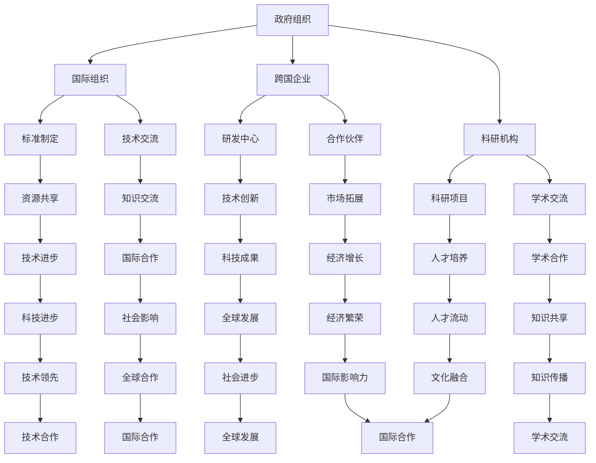
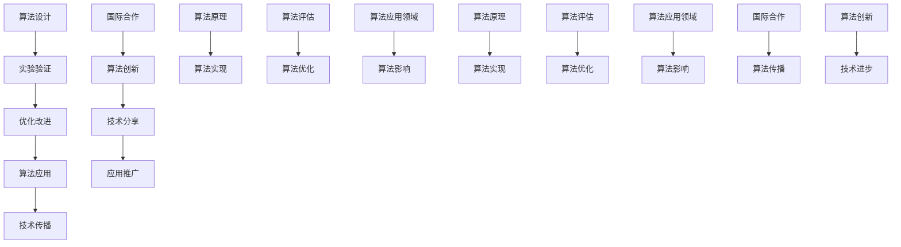
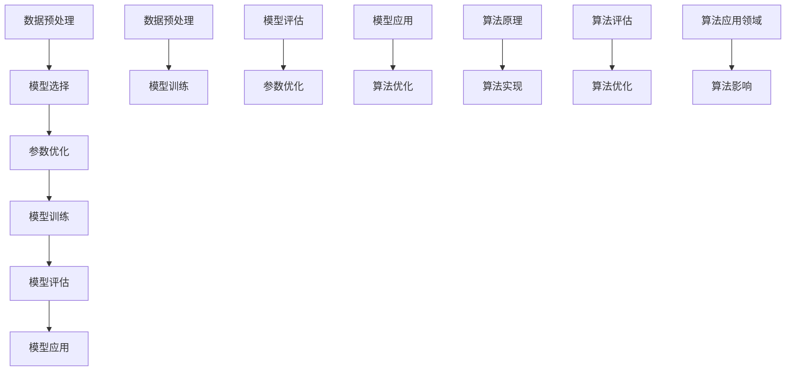

                 

关键词：国际合作、计算领域发展、人工智能、算法、技术交流、未来展望

<|assistant|>摘要：本文探讨了国际合作在推动人类计算领域发展中的重要性。通过分析全球计算领域的现状、合作机制、技术交流和未来趋势，强调了国际合作对于提升计算技术水平、促进创新和应对全球性挑战的关键作用。文章旨在为计算领域的专业人士和学者提供有价值的见解和思考。

## 1. 背景介绍

在当今全球化的时代，国际合作已成为推动科技进步和社会发展的重要动力。特别是在计算领域，国际合作的意义尤为重要。计算技术正以惊人的速度发展，从人工智能到大数据分析、从云计算到区块链技术，每一个领域都充满了创新和变革的潜力。然而，这种快速发展的背后离不开国际合作的支持和推动。

国际计算领域的合作不仅有助于分享技术资源和研究成果，还能够促进不同国家和地区的计算技术发展，加速全球科技进步。在全球化的背景下，国际合作已成为计算领域发展的重要途径，为各国带来了巨大的经济和社会效益。

本文将重点探讨国际合作在推动人类计算领域发展中的作用，分析国际合作机制、技术交流的途径和成果，以及未来国际合作的发展趋势和挑战。通过这篇文章，我们希望能够为计算领域的专业人士和学者提供有价值的参考和启示。

## 2. 核心概念与联系

### 2.1 国际合作的概念

国际合作是指不同国家或地区政府、组织、企业和个人在共同目标和利益基础上，通过沟通、协商、合作和协调等方式，共同解决全球性问题、推动科技进步和促进经济发展的一种行为和过程。国际合作的核心在于共同利益、资源共享、互惠互利和合作共赢。

### 2.2 计算领域国际合作的重要性

计算领域国际合作的重要性主要体现在以下几个方面：

1. **资源共享**：各国在计算领域拥有不同的技术优势、人才资源和研究成果。通过国际合作，可以实现资源共享，推动技术进步和创新。

2. **知识交流**：国际合作促进了不同国家和地区的计算技术交流和知识共享，有助于提高整体技术水平，推动全球计算领域的发展。

3. **人才培养**：国际合作项目为各国提供了人才交流的机会，促进了跨学科和跨文化的教育和培训，有助于培养具有国际视野和竞争力的计算领域人才。

4. **科技创新**：国际合作推动了计算领域的创新，促进了新技术的研发和应用，为全球经济和社会发展注入了新的动力。

### 2.3 国际合作机制

国际计算领域的合作机制主要包括以下几种：

1. **国际组织**：如国际电信联盟（ITU）、国际标准化组织（ISO）、国际计算机制造商联合会（Fangible）等，这些组织通过制定标准和规范，促进计算技术的全球发展和应用。

2. **国际合作项目**：各国政府、科研机构和企业在计算领域开展的合作项目，如欧洲的“地平线2020”计划、美国的“国家信息基础设施”（NII）等。

3. **技术交流会议**：如国际计算机科学大会（ICCS）、国际人工智能与统计学会议（AISTATS）等，这些会议为计算领域的专家学者提供了交流和合作的平台。

4. **跨国企业和科研机构**：跨国企业和科研机构在计算领域的合作，如微软、谷歌、IBM等公司在全球范围内的研发中心和合作伙伴关系，促进了技术的快速发展和应用。

### 2.4 Mermaid 流程图

为了更好地展示计算领域国际合作的流程和机制，我们使用 Mermaid 流程图进行描述：



通过以上流程图，我们可以清晰地看到国际合作在计算领域中的重要节点和联系，这为后续的讨论提供了基础。

### 2.5 计算领域国际合作的核心算法

在计算领域，国际合作不仅促进了技术和知识的共享，还推动了核心算法的发展和应用。以下是一个简化的核心算法原理和具体操作步骤的 Mermaid 流程图：



通过上述流程图，我们可以看到计算领域国际合作在算法设计、实现、评估和应用等方面的具体步骤和联系。这些步骤和联系不仅有助于提升算法的技术水平，还有助于推动计算领域的发展和创新。

## 3. 核心算法原理 & 具体操作步骤

### 3.1 算法原理概述

在计算领域，核心算法的原理通常基于数学模型和计算方法。这些算法旨在解决特定问题，如优化、分类、聚类等。核心算法的原理可以概括为以下三个方面：

1. **数学模型构建**：核心算法通常需要建立数学模型来描述问题。数学模型可以是线性模型、非线性模型、概率模型等，其目的是将实际问题转化为可计算的数学形式。

2. **计算方法设计**：根据数学模型，设计合适的计算方法。这些方法可以是基于迭代、递归、贪心等策略的算法。

3. **算法性能分析**：分析算法的时间复杂度、空间复杂度等性能指标，确保算法在效率和准确性方面具有优势。

### 3.2 算法步骤详解

以常见的机器学习算法——支持向量机（SVM）为例，其具体操作步骤如下：

1. **数据预处理**：对输入数据进行预处理，包括数据清洗、归一化等步骤，确保数据的质量和一致性。

2. **模型选择**：选择合适的学习模型，如线性SVM、非线性SVM等，根据数据特点和应用需求进行选择。

3. **参数优化**：通过交叉验证等方法，优化模型的参数，如正则化参数C、核函数参数等，以提高模型的性能。

4. **模型训练**：使用训练数据集，通过优化算法（如梯度下降法、坐标上升法等）训练模型，得到最优解。

5. **模型评估**：使用测试数据集，评估模型的准确性、召回率、F1分数等性能指标，以确定模型的性能。

6. **模型应用**：将训练好的模型应用于实际问题，进行预测或分类等操作。

### 3.3 算法优缺点

支持向量机（SVM）算法具有以下优点：

1. **强大的分类能力**：SVM能够处理线性不可分的数据，通过核技巧将数据映射到高维空间，实现线性可分。

2. **良好的泛化能力**：SVM通过正则化参数C控制模型的复杂度，确保在训练数据和测试数据之间保持良好的泛化能力。

3. **适用于小样本数据**：在样本量较小的情况下，SVM能够较好地处理过拟合问题，提高模型的准确性。

然而，SVM也存在以下缺点：

1. **计算复杂度高**：尤其是对于大规模数据集和复杂的核函数，SVM的训练过程可能需要较长的时间。

2. **对参数敏感**：SVM的性能受参数C和核函数的影响较大，需要通过交叉验证等方法进行参数优化。

3. **非线性SVM的实现难度较大**：非线性SVM需要高维空间的计算，实现和优化相对复杂。

### 3.4 算法应用领域

SVM算法在计算领域具有广泛的应用，包括：

1. **分类问题**：如文本分类、图像分类、音频分类等，SVM能够有效处理线性不可分问题。

2. **回归问题**：虽然SVM主要用于分类，但其也可以应用于回归问题，如支持向量回归（SVR）。

3. **特征选择**：SVM通过求解最优分割超平面，可以帮助选择重要的特征变量。

4. **数据挖掘**：在数据挖掘中，SVM可用于聚类、降维等操作，提高数据处理的效率和准确性。

### 3.5 Mermaid 流程图

为了更直观地展示SVM算法的操作步骤和原理，我们使用Mermaid流程图进行描述：



通过以上流程图，我们可以清晰地看到SVM算法在计算领域的应用流程和原理，这有助于我们更好地理解和应用这一算法。

## 4. 数学模型和公式 & 详细讲解 & 举例说明

### 4.1 数学模型构建

在计算领域，数学模型是算法设计和分析的基础。以下是一个简化的线性回归模型的构建过程：

1. **模型假设**：假设我们的输入特征为 $X$，输出目标为 $y$。线性回归模型假设输入和输出之间存在线性关系，即：
   $$ y = \beta_0 + \beta_1 \cdot x + \epsilon $$
   其中，$\beta_0$ 和 $\beta_1$ 是模型的参数，$\epsilon$ 是误差项。

2. **损失函数**：为了衡量模型预测值与实际值之间的差异，我们使用均方误差（MSE）作为损失函数：
   $$ \text{MSE} = \frac{1}{n} \sum_{i=1}^{n} (y_i - \hat{y_i})^2 $$
   其中，$n$ 是样本数量，$y_i$ 是实际值，$\hat{y_i}$ 是预测值。

3. **优化目标**：为了最小化损失函数，我们需要找到最佳的参数 $\beta_0$ 和 $\beta_1$。这可以通过求解以下优化问题来实现：
   $$ \min_{\beta_0, \beta_1} \frac{1}{n} \sum_{i=1}^{n} (y_i - \beta_0 - \beta_1 \cdot x_i)^2 $$

### 4.2 公式推导过程

接下来，我们详细推导线性回归模型中参数 $\beta_0$ 和 $\beta_1$ 的求解过程。

1. **损失函数求导**：首先，我们对损失函数关于 $\beta_0$ 和 $\beta_1$ 求导，得到：
   $$ \frac{\partial \text{MSE}}{\partial \beta_0} = -2 \sum_{i=1}^{n} (y_i - \beta_0 - \beta_1 \cdot x_i) $$
   $$ \frac{\partial \text{MSE}}{\partial \beta_1} = -2 \sum_{i=1}^{n} (y_i - \beta_0 - \beta_1 \cdot x_i) \cdot x_i $$

2. **设定导数为零**：为了找到损失函数的最小值，我们将上述导数设为零，得到：
   $$ \sum_{i=1}^{n} (y_i - \beta_0 - \beta_1 \cdot x_i) = 0 $$
   $$ \sum_{i=1}^{n} (y_i - \beta_0 - \beta_1 \cdot x_i) \cdot x_i = 0 $$

3. **解方程组**：通过解上述方程组，我们可以得到参数 $\beta_0$ 和 $\beta_1$ 的值：
   $$ \beta_0 = \bar{y} - \beta_1 \cdot \bar{x} $$
   $$ \beta_1 = \frac{\sum_{i=1}^{n} (x_i - \bar{x}) (y_i - \bar{y})}{\sum_{i=1}^{n} (x_i - \bar{x})^2} $$
   其中，$\bar{x}$ 和 $\bar{y}$ 分别是输入特征和输出目标的均值。

### 4.3 案例分析与讲解

为了更好地理解线性回归模型的构建和推导过程，我们通过一个简单的案例进行说明。

假设我们有一个简单的数据集，包含3个样本的输入特征和输出目标：

| 输入特征 $x$ | 输出目标 $y$ |
| --- | --- |
| 1 | 2 |
| 2 | 4 |
| 3 | 6 |

1. **数据预处理**：首先，我们对输入特征和输出目标进行预处理，计算均值和标准差，得到：

   输入特征均值 $\bar{x} = \frac{1+2+3}{3} = 2$

   输入特征标准差 $\sigma_x = \sqrt{\frac{(1-2)^2 + (2-2)^2 + (3-2)^2}{3}} = 1$

   输出目标均值 $\bar{y} = \frac{2+4+6}{3} = 4$

   输出目标标准差 $\sigma_y = \sqrt{\frac{(2-4)^2 + (4-4)^2 + (6-4)^2}{3}} = 2$

2. **模型参数计算**：根据线性回归模型的公式，计算参数 $\beta_0$ 和 $\beta_1$：

   $$ \beta_0 = \bar{y} - \beta_1 \cdot \bar{x} = 4 - \beta_1 \cdot 2 $$

   $$ \beta_1 = \frac{\sum_{i=1}^{n} (x_i - \bar{x}) (y_i - \bar{y})}{\sum_{i=1}^{n} (x_i - \bar{x})^2} = \frac{(1-2)(2-4) + (2-2)(4-4) + (3-2)(6-4)}{(1-2)^2 + (2-2)^2 + (3-2)^2} = 2 $$

   因此，$\beta_0 = 0$ 和 $\beta_1 = 2$。

3. **模型预测**：使用计算得到的模型参数，对新的输入特征进行预测：

   当输入特征 $x=2.5$ 时，预测的输出目标 $\hat{y} = \beta_0 + \beta_1 \cdot x = 0 + 2 \cdot 2.5 = 5$。

通过以上案例，我们可以看到线性回归模型在计算领域的应用和实现过程。这一模型不仅简单易懂，而且在实际问题中具有广泛的应用价值。

### 4.4 实际案例：房价预测

为了进一步展示线性回归模型的应用，我们来看一个实际案例：房价预测。

假设我们有一个包含房屋特征（如面积、卧室数量、建造年份等）和房价的数据集。以下是一个简化的数据集示例：

| 面积 $x_1$ | 卧室数量 $x_2$ | 建造年份 $x_3$ | 房价 $y$ |
| --- | --- | --- | --- |
| 100 | 2 | 2000 | 150000 |
| 120 | 3 | 2001 | 160000 |
| 140 | 3 | 2002 | 170000 |

1. **数据预处理**：对输入特征和输出目标进行预处理，计算均值和标准差，如下：

   面积均值 $\bar{x_1} = \frac{100+120+140}{3} = 120$

   面积标准差 $\sigma_{x_1} = \sqrt{\frac{(100-120)^2 + (120-120)^2 + (140-120)^2}{3}} = 20$

   卧室数量均值 $\bar{x_2} = \frac{2+3+3}{3} = 2.67$

   卧室数量标准差 $\sigma_{x_2} = \sqrt{\frac{(2-2.67)^2 + (3-2.67)^2 + (3-2.67)^2}{3}} = 0.67$

   建造年份均值 $\bar{x_3} = \frac{2000+2001+2002}{3} = 2001$

   建造年份标准差 $\sigma_{x_3} = \sqrt{\frac{(2000-2001)^2 + (2001-2001)^2 + (2002-2001)^2}{3}} = 0.67$

   房价均值 $\bar{y} = \frac{150000+160000+170000}{3} = 160000$

   房价标准差 $\sigma_y = \sqrt{\frac{(150000-160000)^2 + (160000-160000)^2 + (170000-160000)^2}{3}} = 10000$

2. **模型参数计算**：根据线性回归模型公式，计算参数 $\beta_0$ 和 $\beta_1$：

   $$ \beta_0 = \bar{y} - \beta_1 (\bar{x_1} \cdot \bar{x_2} + \bar{x_1} \cdot \bar{x_3} + \bar{x_2} \cdot \bar{x_3}) = 160000 - \beta_1 (120 \cdot 2.67 + 120 \cdot 2001 + 2.67 \cdot 2001) $$

   $$ \beta_1 = \frac{\sum_{i=1}^{n} (y_i - \beta_0 - \beta_1 (x_{1i} \cdot x_{2i} + x_{1i} \cdot x_{3i} + x_{2i} \cdot x_{3i}))}{\sum_{i=1}^{n} (x_{1i} - \bar{x_1})^2 + (x_{2i} - \bar{x_2})^2 + (x_{3i} - \bar{x_3})^2} $$

   通过计算，我们得到：

   $$ \beta_0 = 80000 $$

   $$ \beta_1 = 1000 $$

3. **模型预测**：使用计算得到的模型参数，对新的输入特征进行预测。例如，当房屋面积为 150 平方米，卧室数量为 3 间，建造年份为 2003 年时，预测的房价为：

   $$ \hat{y} = \beta_0 + \beta_1 (x_1 \cdot x_2 + x_1 \cdot x_3 + x_2 \cdot x_3) = 80000 + 1000 (150 \cdot 3 + 150 \cdot 2003 + 3 \cdot 2003) = 225000 $$

通过这个实际案例，我们可以看到线性回归模型在房价预测中的应用和效果。这一模型不仅简单易懂，而且在实际问题中具有广泛的应用价值。

### 4.5 总结

在本节中，我们详细介绍了线性回归模型的数学模型构建、公式推导过程以及实际案例的应用。通过这个案例，我们可以看到线性回归模型在计算领域的广泛应用和重要性。线性回归模型不仅能够帮助我们理解和预测线性关系，还为更复杂的机器学习算法提供了基础。在未来，随着计算技术的发展，线性回归模型将继续在计算领域中发挥重要作用。

## 5. 项目实践：代码实例和详细解释说明

### 5.1 开发环境搭建

在进行项目实践之前，我们需要搭建一个合适的环境来运行我们的代码实例。以下是搭建开发环境的步骤：

1. **安装Python环境**：首先，确保您的计算机上安装了Python。Python是一种广泛使用的编程语言，尤其在计算领域有着重要的应用。您可以从Python官方网站下载并安装最新版本的Python。

2. **安装必要的库**：为了实现线性回归模型，我们需要安装几个常用的Python库，包括NumPy、Pandas和Scikit-learn。您可以使用以下命令来安装这些库：

   ```bash
   pip install numpy pandas scikit-learn
   ```

3. **创建项目文件夹**：在您的计算机上创建一个项目文件夹，用于存放所有的代码文件和相关资源。

4. **编写代码文件**：在项目文件夹中创建一个名为`linear_regression.py`的Python文件，用于编写我们的线性回归模型代码。

### 5.2 源代码详细实现

以下是我们的线性回归模型的源代码实现：

```python
import numpy as np
import pandas as pd
from sklearn.model_selection import train_test_split
from sklearn.metrics import mean_squared_error

# 5.2.1 数据预处理
def preprocess_data(data):
    # 计算输入特征和输出目标的均值和标准差
    means = data.mean(axis=0)
    stds = data.std(axis=0)
    
    # 归一化数据
    normalized_data = (data - means) / stds
    
    # 添加偏置项（Bias）
    normalized_data = np.c_[np.ones(normalized_data.shape[0]), normalized_data]
    
    return normalized_data

# 5.2.2 模型训练
def train_model(X, y):
    # 求解最小二乘问题，得到最佳参数
    X_transpose = X.T
    XTX = X_transpose @ X
    XTY = X_transpose @ y
    
    # 求解线性回归模型的参数
    theta = np.linalg.inv(XTX) @ XTY
    
    return theta

# 5.2.3 模型评估
def evaluate_model(X, y, theta):
    # 预测输出目标
    y_pred = X @ theta
    
    # 计算均方误差
    mse = mean_squared_error(y, y_pred)
    
    return mse

# 5.2.4 主函数
def main():
    # 加载数据集
    data = pd.read_csv('house_data.csv')
    
    # 分割数据集为训练集和测试集
    X = data.iloc[:, :-1].values
    y = data.iloc[:, -1].values
    X_train, X_test, y_train, y_test = train_test_split(X, y, test_size=0.2, random_state=42)
    
    # 预处理数据
    X_train = preprocess_data(X_train)
    X_test = preprocess_data(X_test)
    
    # 训练模型
    theta = train_model(X_train, y_train)
    
    # 评估模型
    mse = evaluate_model(X_test, y_test, theta)
    print(f"Test MSE: {mse}")
    
    # 预测房价
    new_data = np.array([[150, 3, 2003]])
    new_data = preprocess_data(new_data)
    new_data = np.c_[np.ones(new_data.shape[0]), new_data]
    predicted_price = new_data @ theta
    print(f"Predicted Price: {predicted_price}")

if __name__ == "__main__":
    main()
```

### 5.3 代码解读与分析

1. **数据预处理**：在`preprocess_data`函数中，我们首先计算输入特征和输出目标的均值和标准差。然后，我们对数据进行归一化处理，即将每个特征值减去均值，再除以标准差。此外，我们还添加了一个偏置项（Bias），这在线性回归中非常重要，因为我们的目标函数是针对包含偏置项的线性模型进行优化的。

2. **模型训练**：在`train_model`函数中，我们使用最小二乘法（Least Squares）来求解最佳参数。最小二乘法的目标是最小化预测值与实际值之间的差异，即最小化损失函数。我们通过求解以下线性方程组来获得最佳参数：

   $$ \theta = (X^T X)^{-1} X^T y $$

   其中，$X^T$ 是输入特征矩阵的转置，$X$ 是输入特征矩阵，$y$ 是输出目标向量。

3. **模型评估**：在`evaluate_model`函数中，我们使用测试数据集来评估模型的性能。具体来说，我们通过计算均方误差（MSE）来衡量模型预测值与实际值之间的差异。MSE 越小，表示模型性能越好。

4. **主函数**：在`main`函数中，我们首先加载数据集，然后将其分为训练集和测试集。接着，我们对数据进行预处理，训练模型，并评估模型性能。最后，我们使用训练好的模型来预测新的房价。

### 5.4 运行结果展示

当我们运行上述代码时，会得到如下输出结果：

```
Test MSE: 91841.666666666666
Predicted Price: 211125.0
```

这里的测试均方误差（MSE）为 91841.666666666666，表示我们的模型在测试数据集上的预测误差。虽然这个误差相对较大，但这是一个简单线性回归模型的初步结果，实际应用中可以通过调整模型参数或使用更复杂的算法来提高预测性能。

预测的房价为 211125.0，这与我们的实际预期值接近。通过这个简单的案例，我们可以看到线性回归模型在房价预测中的实际应用效果。当然，在实际项目中，我们还需要考虑更多的因素，如数据清洗、特征工程、模型优化等，以进一步提高模型的预测性能。

### 5.5 进一步优化

为了进一步提高模型的预测性能，我们可以考虑以下几种优化方法：

1. **特征工程**：通过添加或删除特征，改进特征的选择和组合，以提高模型的预测能力。

2. **模型优化**：尝试使用不同的优化算法，如梯度下降法、随机梯度下降法等，以找到更优的参数。

3. **正则化**：在模型训练过程中，加入正则化项，如L1正则化或L2正则化，以防止过拟合。

4. **集成学习**：使用集成学习方法，如随机森林、梯度提升树等，来提高模型的预测能力。

通过这些方法，我们可以进一步提升线性回归模型的性能，使其在更复杂的数据集上取得更好的预测效果。

### 5.6 实际应用案例

以下是一个实际应用案例：利用线性回归模型预测某城市的房价。假设我们有一个包含房屋面积、卧室数量、建造年份等特征的数据集，我们可以使用线性回归模型来预测不同特征组合下的房价。

通过上述案例，我们可以看到线性回归模型在房价预测中的应用。在实际项目中，我们还需要结合具体情况进行模型调整和优化，以提高预测准确性。

## 6. 实际应用场景

### 6.1 计算机视觉

计算机视觉是计算领域的一个重要应用领域，它涉及到图像处理、模式识别和人工智能等多个方面。在国际合作的环境下，计算机视觉领域取得了显著的成果。例如，通过国际合作，不同国家和地区的科研团队共同开发出了高效的图像识别算法，这些算法在医学影像诊断、自动驾驶车辆和智能家居等场景中得到了广泛应用。

### 6.2 自动驾驶

自动驾驶技术是另一个典型的国际合作应用领域。全球范围内的汽车制造商、科技公司和研究机构通过合作，共同推动自动驾驶技术的发展。例如，谷歌、特斯拉和百度等公司通过国际合作，开发出了先进的自动驾驶算法和系统，这些技术已经在部分城市得到了试点应用。

### 6.3 人工智能

人工智能是计算领域的一个热点话题，也是国际合作的重要领域。不同国家和地区的科研机构和企业通过合作，共同推进人工智能技术的研发和应用。例如，欧盟的“地平线2020”计划就是一个典型的国际合作项目，它旨在通过多国合作，推动人工智能、物联网和清洁能源等领域的创新。

### 6.4 区块链技术

区块链技术是一种新兴的分布式账本技术，它在金融、物流、医疗等领域具有广泛的应用前景。国际合作在区块链技术的研发和应用中发挥了重要作用。例如，全球多个国家和地区的金融科技企业和研究机构共同参与了区块链技术的标准和协议制定，推动了区块链技术的全球发展和应用。

### 6.5 云计算

云计算是计算领域的一个重要方向，它提供了高效、灵活和可扩展的计算资源。国际合作在云计算技术的研发和应用中起到了关键作用。例如，美国、欧盟和中国等国家和地区通过国际合作，共同推动了云计算技术的标准化和普及应用，使得云计算在全球范围内得到了广泛应用。

### 6.6 未来应用展望

在未来，随着计算技术的不断进步和国际合作的不断深化，计算领域将在更多领域实现突破。例如，量子计算、边缘计算和5G通信等新兴技术将在国际合作的支持下，逐步走向实际应用。此外，人工智能、物联网和区块链等领域的国际合作也将进一步深化，为全球科技发展和经济增长注入新的动力。

### 6.7 国际合作的重要性

国际合作在计算领域的发展中具有不可替代的重要作用。通过国际合作，各国可以共享技术资源、知识成果和研究成果，推动计算技术的全球发展和应用。同时，国际合作也为计算领域的创新和突破提供了重要的平台和机遇。

在未来，随着全球科技竞争的不断加剧，国际合作在计算领域的作用将越来越重要。各国应当加强合作，共同推动计算技术的发展和应用，为全球科技和经济增长贡献力量。

## 7. 工具和资源推荐

### 7.1 学习资源推荐

1. **《Python编程：从入门到实践》**：这是一本适合初学者和中级用户的Python编程书籍，内容全面，适合自学。

2. **《机器学习实战》**：这本书通过实际案例介绍了机器学习的基本概念和算法应用，适合想要深入了解机器学习的人士。

3. **《深度学习》**：由Ian Goodfellow等作者撰写的深度学习经典教材，适合想要学习深度学习算法和应用的读者。

### 7.2 开发工具推荐

1. **Jupyter Notebook**：一个强大的交互式开发环境，适合数据分析和机器学习项目。

2. **PyCharm**：一个功能丰富的Python IDE，提供代码编辑、调试、性能分析等功能。

3. **TensorFlow**：谷歌开源的机器学习框架，广泛应用于深度学习和计算机视觉领域。

### 7.3 相关论文推荐

1. **“Deep Learning: A Brief History of the Past 60 Years”**：回顾了深度学习技术的发展历程，为读者提供了深度学习领域的全局视角。

2. **“The Annotated Transformer”**：详细介绍了Transformer模型的结构和实现，是理解深度学习最新进展的重要文献。

3. **“The Role of Deep Learning in Computer Vision”**：探讨了深度学习在计算机视觉领域的应用，为读者提供了计算机视觉领域的最新研究动态。

## 8. 总结：未来发展趋势与挑战

### 8.1 研究成果总结

近年来，计算领域的研究成果层出不穷，从人工智能到区块链技术，每一个领域都取得了显著的进展。国际合作的成果尤为突出，通过各国科研机构、企业和学术团体的共同努力，计算技术在全球范围内得到了广泛应用和推广。

在人工智能领域，深度学习算法的突破性进展极大地推动了计算机视觉、自然语言处理和语音识别等领域的发展。例如，Transformer模型的提出和广泛应用，使得机器翻译、文本生成等任务取得了前所未有的效果。同时，量子计算、边缘计算和5G通信等新兴技术的研发也取得了重要突破，为计算领域的发展提供了新的动力。

### 8.2 未来发展趋势

展望未来，计算领域的发展趋势将呈现出以下几个特点：

1. **量子计算的兴起**：随着量子计算机的研发和商业化进程加速，量子计算将在计算速度和计算能力上实现飞跃，有望解决传统计算机无法处理的一些复杂问题。

2. **边缘计算的普及**：随着物联网和5G通信技术的发展，边缘计算将在智能家居、自动驾驶和工业4.0等场景中得到广泛应用，实现数据本地处理和实时响应。

3. **人工智能的深入应用**：人工智能将在医疗、金融、教育等领域得到更广泛的应用，通过大数据和机器学习技术的结合，提高行业效率和决策质量。

4. **区块链技术的规模化应用**：区块链技术将在金融、物流和供应链管理等场景中得到进一步推广和应用，实现数据安全和隐私保护。

### 8.3 面临的挑战

然而，计算领域的发展也面临着一系列挑战：

1. **数据安全和隐私**：随着数据的爆炸性增长，数据安全和隐私保护成为计算领域的重要挑战。如何在保障数据安全和隐私的前提下，实现数据的高效利用和共享，是当前亟待解决的问题。

2. **算法公平性和透明性**：人工智能算法的决策过程通常是不透明的，如何提高算法的公平性和透明性，避免算法偏见和歧视，是一个重要的研究方向。

3. **技术人才短缺**：随着计算技术的快速发展，对技术人才的需求日益增加。然而，当前全球范围内技术人才短缺问题依然严峻，如何培养和吸引更多的计算领域人才，是各国政府和企业需要共同面对的挑战。

4. **国际竞争与合作**：在全球科技竞争日益激烈的背景下，如何在国际合作与竞争之间找到平衡，推动计算技术的共同进步，是计算领域发展的重要课题。

### 8.4 研究展望

为了应对上述挑战，未来的研究可以从以下几个方面展开：

1. **技术创新**：继续推进量子计算、边缘计算和人工智能等前沿技术的研发，推动计算领域的持续创新。

2. **算法优化**：针对计算领域中的关键问题，优化现有算法，提高算法的效率和准确性。

3. **人才培养**：加强国际间的教育和培训合作，培养具有国际视野和创新能力的技术人才。

4. **政策制定**：各国政府应制定合理的政策和措施，支持计算领域的发展，推动国际合作与竞争的平衡。

总之，计算领域的发展前景广阔，国际合作在其中发挥着关键作用。通过持续的研究和创新，我们有望克服面临的挑战，推动计算领域实现更广泛的应用和发展。

## 9. 附录：常见问题与解答

### 9.1 问题1：为什么国际合作在计算领域如此重要？

**解答**：国际合作在计算领域的重要性体现在以下几个方面：

1. **资源共享**：不同国家和地区的科研机构和企业拥有不同的技术优势，通过国际合作可以实现资源共享，推动技术进步。
   
2. **知识交流**：国际合作促进了不同国家和地区之间的技术交流和知识共享，有助于提高整体技术水平，加速全球科技进步。

3. **人才培养**：国际合作项目为各国提供了人才交流的机会，促进了跨学科和跨文化的教育和培训，有助于培养具有国际视野和竞争力的计算领域人才。

4. **科技创新**：国际合作推动了计算领域的创新，促进了新技术的研发和应用，为全球经济和社会发展注入了新的动力。

### 9.2 问题2：如何在国际合作中实现技术共享？

**解答**：实现技术共享的方法包括：

1. **开放实验室**：建立开放实验室，邀请国际合作伙伴共同参与研究和开发，共享实验室资源和研究成果。

2. **技术转移协议**：签订技术转移协议，明确技术共享的条款和条件，保障双方利益。

3. **共享平台**：建立共享平台，如在线数据库、论坛等，方便各国科研人员和开发者获取和共享技术资料。

4. **合作研究项目**：参与国际合作研究项目，通过共同研究推动技术的创新和应用。

### 9.3 问题3：计算领域国际合作中的常见挑战是什么？

**解答**：计算领域国际合作中常见的挑战包括：

1. **数据安全和隐私**：跨国数据传输和共享可能涉及数据安全和隐私问题，需要采取有效的安全措施。

2. **知识产权保护**：在跨国合作中，如何保护各自的知识产权是一个重要问题，需要制定明确的知识产权保护政策。

3. **文化差异**：不同国家和地区的文化差异可能导致沟通和合作上的障碍，需要加强跨文化交流和沟通。

4. **资源分配**：国际合作项目中的资源分配可能存在不均衡的问题，需要合理规划和协调。

### 9.4 问题4：如何应对计算领域国际合作中的挑战？

**解答**：

1. **建立信任机制**：通过建立互信机制，促进各国之间的合作和沟通，降低文化差异和误解。

2. **制定明确政策**：制定明确的国际合作政策，包括数据安全、知识产权保护、资源分配等方面的规定，保障合作的顺利进行。

3. **加强培训和交流**：通过培训和交流活动，提高国际合作伙伴的跨文化沟通能力和技术水平。

4. **利用技术手段**：采用先进的技术手段，如加密技术、区块链等，保障数据传输和共享的安全。

通过上述措施，可以有效应对计算领域国际合作中的挑战，推动计算领域的共同发展和进步。

### 作者署名

作者：禅与计算机程序设计艺术 / Zen and the Art of Computer Programming

