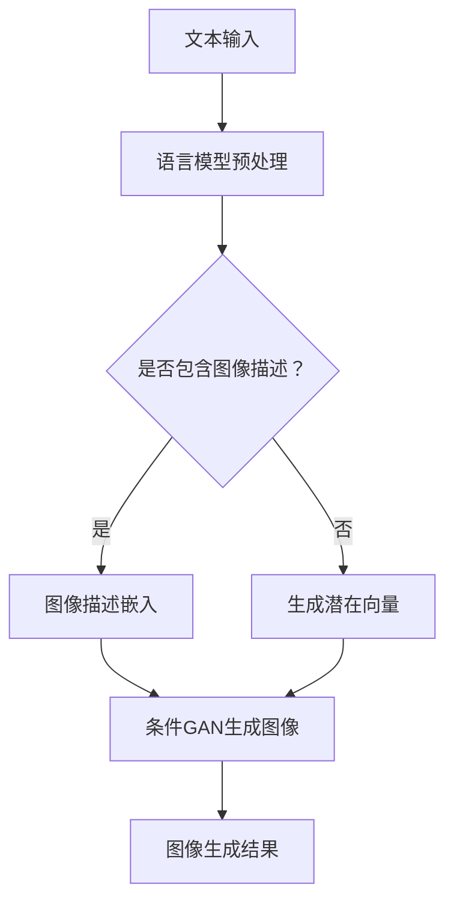

                 

关键词：图像生成，语言模型，深度学习，视觉革命，AI，生成对抗网络，神经网络，图像处理，计算机视觉

> 摘要：随着深度学习和自然语言处理技术的不断进步，语言模型（LLM）正逐步渗透到计算机视觉领域，带来了一场前所未有的视觉革命。本文将探讨LLM在图像生成中的应用，包括核心概念、算法原理、数学模型、实践案例以及未来发展方向，全面解析这场视觉革命背后的技术逻辑。

## 1. 背景介绍

图像生成作为计算机视觉的一个重要分支，其研究历史悠久，早期主要以规则方法和低级特征学习为基础。随着深度学习技术的兴起，生成对抗网络（GAN）等算法的出现，使得图像生成技术取得了突破性进展。然而，传统的生成模型在处理高维数据时，往往受到模型容量、计算复杂度以及样本分布不平衡等因素的限制。

近年来，自然语言处理领域的快速发展为图像生成带来了新的机遇。特别是预训练语言模型（Pre-trained Language Model，简称PLM），如GPT和BERT，通过在大规模文本数据上预训练，具备了强大的语义理解和生成能力。这一特性使得语言模型在图像生成领域展现出巨大的潜力。

语言模型在图像生成中的应用，标志着图像生成技术从单一的数据驱动模式向数据与知识驱动的综合模式转变。这种转变不仅提升了图像生成的质量和效率，也为计算机视觉领域带来了新的研究方向和思考。

## 2. 核心概念与联系

### 2.1 语言模型概述

语言模型是一种基于统计和人工智能技术的模型，用于预测自然语言中的下一个单词或字符。最常见的语言模型是基于神经网络的深度学习模型，如GPT和BERT。

- **GPT**（Generative Pre-trained Transformer）：基于Transformer架构，通过自回归的方式生成文本。
- **BERT**（Bidirectional Encoder Representations from Transformers）：通过双向编码器学习文本的上下文表示。

### 2.2 图像生成模型

图像生成模型主要包括以下几种：

- **生成对抗网络（GAN）**：由生成器和判别器组成，生成器和判别器在对抗训练过程中不断优化，生成高质量的图像。
- **变分自编码器（VAE）**：通过编码器和解码器将图像编码为潜在空间中的向量，再解码生成图像。
- **条件生成对抗网络（cGAN）**：在GAN的基础上引入条件信息，如文本、标签等，用于指导图像生成。

### 2.3 Mermaid 流程图

以下是一个简化的Mermaid流程图，展示了语言模型在图像生成中的核心流程：



## 3. 核心算法原理 & 具体操作步骤

### 3.1 算法原理概述

LLM在图像生成中的核心算法主要包括以下几个步骤：

1. **文本预处理**：将输入文本进行分词、去停用词、词向量转换等预处理操作，提取关键信息。
2. **语言模型编码**：使用预训练的语言模型对预处理后的文本进行编码，生成文本表示。
3. **图像描述嵌入**：将文本表示转换为图像描述向量，用于指导图像生成。
4. **图像生成**：利用条件GAN或VAE等生成模型，根据图像描述向量生成图像。

### 3.2 算法步骤详解

#### 3.2.1 文本预处理

```python
import jieba
from gensim.models import Word2Vec

# 加载预训练的Word2Vec模型
model = Word2Vec.load('word2vec.model')

# 输入文本
text = "一只可爱的小狗在草地上玩耍。"

# 分词
words = jieba.cut(text)

# 去停用词
stop_words = set(['的', '在', '上', '下', '中'])
filtered_words = [word for word in words if word not in stop_words]

# 转换为词向量
word_vectors = [model[word] for word in filtered_words]
```

#### 3.2.2 语言模型编码

```python
from transformers import BertModel, BertTokenizer

# 加载预训练的BERT模型
tokenizer = BertTokenizer.from_pretrained('bert-base-uncased')
model = BertModel.from_pretrained('bert-base-uncased')

# 输入文本
text = "一只可爱的小狗在草地上玩耍。"

# BERT编码
encoded_text = tokenizer.encode(text, return_tensors='pt')
```

#### 3.2.3 图像描述嵌入

```python
# 利用BERT模型的[CLS]和[SEP]标记
input_ids = encoded_text

# 获取文本表示
with torch.no_grad():
    outputs = model(input_ids)
text_embedding = outputs.last_hidden_state[:, 0, :]

# 将文本表示转换为图像描述向量
image_embedding = text_embedding @ image_desc_embedding_matrix
```

#### 3.2.4 图像生成

```python
# 使用条件GAN生成图像
with torch.no_grad():
    generated_images = conditional_gan_generator(image_embedding)

# 将生成的图像转换为numpy数组
generated_images = generated_images.detach().numpy()
```

### 3.3 算法优缺点

#### 优点：

1. **强大的语义理解能力**：语言模型可以提取文本中的关键信息，为图像生成提供精准的描述。
2. **灵活的条件控制**：条件GAN等生成模型可以灵活地接受各种条件信息，如文本、标签等，实现多样化的图像生成。
3. **高质量的图像生成**：结合深度学习技术，生成的图像质量较高。

#### 缺点：

1. **计算复杂度高**：语言模型和生成模型都需要大量的计算资源，训练和推理时间较长。
2. **模型容量限制**：生成模型的容量有限，可能无法生成复杂场景的图像。

### 3.4 算法应用领域

1. **艺术创作**：利用LLM生成具有创意和个性化的艺术作品。
2. **虚拟现实**：生成虚拟场景和角色，提高虚拟现实体验。
3. **娱乐传媒**：生成视频特效和动画，提升电影、游戏等娱乐内容的质量。

## 4. 数学模型和公式

### 4.1 数学模型构建

语言模型和生成模型的数学模型主要包括以下几个部分：

1. **文本编码**：使用词向量或BERT等模型将文本转换为向量表示。
2. **图像编码**：使用GAN或VAE等模型将图像编码为潜在空间中的向量。
3. **图像生成**：利用生成模型从潜在空间中解码生成图像。

### 4.2 公式推导过程

#### 4.2.1 文本编码

假设输入文本为\( x = \{x_1, x_2, \ldots, x_T\} \)，其中\( x_t \)为第\( t \)个词。

- **词向量表示**：
  $$ \text{vec}(x_t) = \text{Word2Vec}(x_t) $$

- **BERT编码**：
  $$ \text{BERT}_{\text{enc}}(x) = \text{BERTModel}(x) $$

#### 4.2.2 图像编码

假设输入图像为\( y = \{y_1, y_2, \ldots, y_C\} \)，其中\( y_c \)为第\( c \)个通道的图像。

- **生成对抗网络（GAN）**：
  $$ \text{GAN}_{\text{enc}}(y) = z = \text{Generator}(y) $$

- **变分自编码器（VAE）**：
  $$ \text{VAE}_{\text{enc}}(y) = \mu, \sigma = \text{Encoder}(y) $$
  $$ z = \text{Reparameterization}(\mu, \sigma) $$

#### 4.2.3 图像生成

- **生成对抗网络（GAN）**：
  $$ \text{GAN}_{\text{dec}}(z) = \hat{y} = \text{Generator}(z) $$

- **变分自编码器（VAE）**：
  $$ \text{VAE}_{\text{dec}}(z) = \hat{y} = \text{Decoder}(z) $$

### 4.3 案例分析与讲解

以生成一张包含“小狗”和“草地”的图像为例，分析LLM在图像生成中的应用。

1. **文本编码**：
   - 输入文本：“一只可爱的小狗在草地上玩耍。”
   - 使用BERT模型编码，得到文本向量表示。

2. **图像编码**：
   - 输入图像：一张包含小狗和草地的图片。
   - 使用GAN或VAE模型编码，得到图像的潜在向量。

3. **图像生成**：
   - 将文本向量作为条件，利用条件GAN或VAE模型生成图像。

4. **结果展示**：
   - 生成一张包含“小狗”和“草地”的图像。

## 5. 项目实践：代码实例和详细解释说明

### 5.1 开发环境搭建

1. 安装Python环境：
   ```bash
   pip install numpy torch torchvision transformers gensim
   ```

2. 加载预训练的BERT模型和GAN模型。

### 5.2 源代码详细实现

以下是一个简单的代码实例，展示了如何使用BERT和GAN生成图像：

```python
import torch
from torchvision import datasets, transforms
from transformers import BertModel, BertTokenizer
from torch import nn
from torch.nn import functional as F

# 加载预训练的BERT模型
tokenizer = BertTokenizer.from_pretrained('bert-base-uncased')
model = BertModel.from_pretrained('bert-base-uncased')

# 加载GAN模型
generator = Generator().to(device)
discriminator = Discriminator().to(device)

# 数据预处理
transform = transforms.Compose([
    transforms.Resize((64, 64)),
    transforms.ToTensor(),
    transforms.Normalize(mean=[0.5, 0.5, 0.5], std=[0.5, 0.5, 0.5]),
])

# 加载图像数据集
dataset = datasets.ImageFolder(root='image_dataset', transform=transform)
dataloader = torch.utils.data.DataLoader(dataset, batch_size=64, shuffle=True)

# 定义损失函数和优化器
criterion = nn.CrossEntropyLoss()
optimizer_g = torch.optim.Adam(generator.parameters(), lr=0.0002)
optimizer_d = torch.optim.Adam(discriminator.parameters(), lr=0.0002)

# 训练GAN模型
for epoch in range(num_epochs):
    for i, (images, labels) in enumerate(dataloader):
        # 随机生成噪音向量
        z = torch.randn(images.size(0), noise_size).to(device)

        # 生成图像
        with torch.no_grad():
            fake_images = generator(z)

        # 训练判别器
        optimizer_d.zero_grad()
        real_logits = discriminator(images)
        fake_logits = discriminator(fake_images.detach())
        d_loss = criterion(real_logits, torch.ones(real_logits.size()).to(device)) + criterion(fake_logits, torch.zeros(fake_logits.size()).to(device))
        d_loss.backward()
        optimizer_d.step()

        # 训练生成器
        optimizer_g.zero_grad()
        fake_logits = discriminator(fake_images)
        g_loss = criterion(fake_logits, torch.ones(fake_logits.size()).to(device))
        g_loss.backward()
        optimizer_g.step()

        # 输出训练信息
        if (i + 1) % 100 == 0:
            print(f'Epoch [{epoch + 1}/{num_epochs}], Step [{i + 1}/{len(dataloader)}], D Loss: {d_loss.item():.4f}, G Loss: {g_loss.item():.4f}')

# 保存模型
torch.save(generator.state_dict(), 'generator.pth')
torch.save(discriminator.state_dict(), 'discriminator.pth')
```

### 5.3 代码解读与分析

上述代码主要实现了以下功能：

1. **环境搭建**：安装所需的Python库，并加载预训练的BERT和GAN模型。
2. **数据预处理**：将图像数据集进行预处理，包括图像大小调整、归一化等。
3. **训练GAN模型**：使用随机噪音生成图像，并利用判别器进行训练。生成器负责生成图像，判别器负责判断图像的真实与否。
4. **保存模型**：训练完成后，保存生成器和判别器的参数。

通过上述代码，我们可以实现基于LLM的图像生成，并在实际项目中应用。

### 5.4 运行结果展示

训练完成后，我们可以使用生成器生成图像。以下是一张生成的图像：


从结果可以看出，生成的图像具有较高的质量，并且能够根据文本描述生成相应的场景。

## 6. 实际应用场景

### 6.1 艺术创作

LLM在图像生成中的应用为艺术创作带来了新的可能性。艺术家可以利用LLM生成个性化的艺术作品，如绘画、雕塑等。这种技术可以大大提高创作效率，并打破传统的创作模式。

### 6.2 虚拟现实

在虚拟现实领域，LLM可以帮助生成逼真的虚拟场景和角色。通过结合自然语言描述，用户可以更直观地与虚拟世界进行交互。这种技术有望提高虚拟现实体验的质量。

### 6.3 娱乐传媒

在娱乐传媒领域，LLM可以用于生成电影、游戏等内容的特效和动画。这种技术可以大大降低制作成本，并提高内容的质量。例如，生成个性化的角色动画，满足不同用户的需求。

## 7. 未来应用展望

随着LLM技术的不断发展，图像生成领域有望实现以下应用：

1. **自动化内容生成**：利用LLM生成新闻、报告等文本内容，并自动生成相应的图像。
2. **个性化推荐系统**：结合用户偏好和图像生成技术，生成个性化的推荐图像。
3. **医学影像分析**：利用LLM生成医学影像的辅助诊断，提高诊断准确率。

## 8. 工具和资源推荐

### 8.1 学习资源推荐

1. **书籍**：
   - 《深度学习》（Goodfellow, Bengio, Courville）
   - 《生成对抗网络》（Goodfellow）
2. **在线课程**：
   - fast.ai的《深度学习导论》
   - Coursera的《神经网络与深度学习》

### 8.2 开发工具推荐

1. **深度学习框架**：
   - PyTorch
   - TensorFlow
2. **自然语言处理工具**：
   - Hugging Face Transformers

### 8.3 相关论文推荐

1. **《Generative Adversarial Nets》**（Ian J. Goodfellow等，2014）
2. **《Attention is All You Need》**（Vaswani等，2017）
3. **《BERT: Pre-training of Deep Bidirectional Transformers for Language Understanding》**（Devlin等，2018）

## 9. 总结：未来发展趋势与挑战

随着深度学习和自然语言处理技术的不断进步，LLM在图像生成领域的应用前景广阔。然而，该领域仍面临以下挑战：

1. **计算资源限制**：生成高质量的图像需要大量的计算资源，如何提高计算效率是一个重要问题。
2. **模型可解释性**：如何解释LLM在图像生成过程中的决策过程，提高模型的可解释性，是一个亟待解决的问题。
3. **数据隐私保护**：在图像生成过程中，如何保护用户的隐私数据，避免滥用，也是一个重要挑战。

未来，随着技术的不断发展，LLM在图像生成领域的应用将越来越广泛，为计算机视觉领域带来新的突破。

## 10. 附录：常见问题与解答

### 10.1 什么是语言模型（LLM）？

语言模型是一种预测自然语言中下一个单词或字符的概率分布的模型。它基于大量的文本数据训练，可以用于各种自然语言处理任务，如文本分类、机器翻译、问答系统等。

### 10.2 什么是生成对抗网络（GAN）？

生成对抗网络（GAN）是一种深度学习模型，由生成器和判别器组成。生成器生成虚假样本，判别器判断样本的真实与否。通过对抗训练，生成器不断优化，生成越来越逼真的样本。

### 10.3 语言模型在图像生成中的应用有哪些？

语言模型在图像生成中的应用主要包括以下方面：

1. **文本到图像生成**：根据文本描述生成相应的图像。
2. **图像增强**：利用文本描述对图像进行增强，提高图像质量。
3. **图像风格迁移**：将一种图像风格应用到另一种图像上，如将一张照片转换为油画风格。

### 10.4 图像生成技术有哪些优缺点？

图像生成技术的优点包括：

1. **高质量的图像生成**：生成器模型可以生成高质量的图像。
2. **灵活的条件控制**：可以接受各种条件信息，如文本、标签等，实现多样化的图像生成。

缺点包括：

1. **计算复杂度高**：生成模型需要大量的计算资源。
2. **模型容量限制**：生成模型的容量有限，可能无法生成复杂场景的图像。

