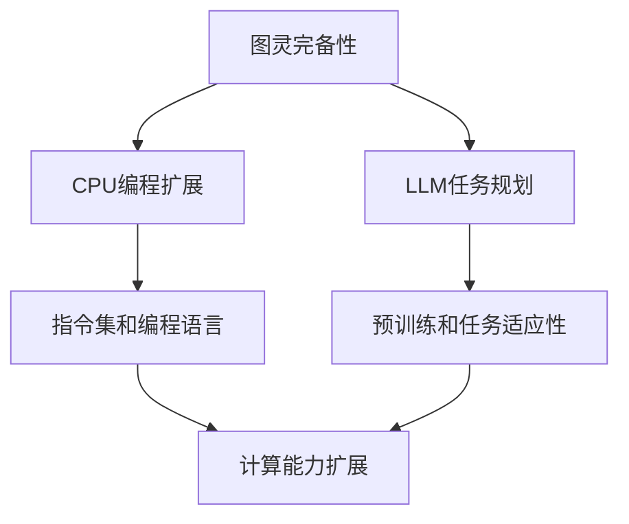

                 

关键词：图灵完备，CPU编程，LLM任务规划，计算扩展，人工智能

摘要：本文探讨了图灵完备的概念，并深入分析了CPU编程和LLM任务规划在计算扩展中的应用。通过对核心算法原理、数学模型、项目实践以及未来应用展望的详细讨论，为读者提供了全面的技术视野和思考方向。

## 1. 背景介绍

在计算机科学的发展历程中，图灵完备性是一个至关重要的概念。它定义了一种计算模型的能力，即是否能够模拟任何可计算函数。图灵完备性最早由英国数学家艾伦·图灵（Alan Turing）在20世纪30年代提出，用以解决“停机问题”和判定问题。

图灵完备性不仅局限于理论层面，更在现实世界的计算系统中广泛应用。CPU作为计算机系统的核心，通过编程实现了对各种任务的计算能力扩展。而近年来，大型语言模型（LLM）的崛起，更是展示了任务规划在计算扩展中的潜力。

本文旨在探讨图灵完备性的实际应用，分析CPU编程和LLM任务规划如何通过不同的机制实现计算能力的扩展，并展望未来计算技术的可能发展方向。

## 2. 核心概念与联系

### 2.1 图灵完备性原理

图灵完备性是指一种计算模型，能够模拟任何可计算函数的能力。这一概念由图灵提出，主要基于图灵机的模型。图灵机是一种抽象的计算设备，具有无限长的纸带和读写头，可以执行读写和移动操作。通过一系列的规则，图灵机能够处理任意复杂的计算问题。

### 2.2 CPU编程扩展

CPU作为计算机的核心，通过编程实现了对计算能力的扩展。现代计算机系统中的CPU通常基于冯·诺伊曼架构，这种架构使得CPU可以通过指令集和程序代码来执行各种计算任务。

CPU编程扩展的核心在于指令集和编程语言。指令集是CPU可以执行的一系列操作，而编程语言则是程序员用来编写程序的工具。通过高级编程语言，程序员可以定义复杂的数据结构和算法，进而实现对计算任务的精确控制。

### 2.3 LLM任务规划

大型语言模型（LLM）如GPT-3、ChatGPT等，通过任务规划实现了对计算能力的扩展。这些模型基于深度学习技术，能够理解和生成自然语言，从而在任务规划、文本生成、问答系统等方面展示出强大的计算能力。

LLM任务规划的核心在于预训练和任务适应性。预训练阶段，模型通过大量数据学习语言模式和规律。在任务规划阶段，模型根据具体任务的需求，调整参数和策略，以实现最优的任务执行效果。

### 2.4 Mermaid 流程图

为了更好地理解图灵完备性、CPU编程扩展和LLM任务规划之间的关系，我们可以使用Mermaid流程图来展示其核心概念和联系。



## 3. 核心算法原理 & 具体操作步骤

### 3.1 算法原理概述

CPU编程扩展和LLM任务规划的核心算法原理分别是什么？如何通过这些算法实现计算能力的扩展？

#### 3.1.1 CPU编程扩展

CPU编程扩展的核心算法原理是基于指令集和编程语言。通过高级编程语言，程序员可以定义复杂的数据结构和算法，进而实现对计算任务的精确控制。

具体操作步骤如下：

1. 确定计算任务需求，定义数据结构和算法。
2. 使用编程语言编写程序，实现算法的执行。
3. 编译和解释程序，使其在CPU上运行。
4. 调试和优化程序，提高执行效率和性能。

#### 3.1.2 LLM任务规划

LLM任务规划的核心算法原理是基于深度学习和任务适应性。通过预训练和微调，模型可以理解和生成自然语言，从而在任务规划中发挥重要作用。

具体操作步骤如下：

1. 预训练阶段：使用大量数据进行模型训练，学习语言模式和规律。
2. 任务适应性阶段：根据具体任务的需求，调整模型参数和策略。
3. 任务执行阶段：模型根据调整后的参数和策略，生成相应的任务输出。

### 3.2 算法步骤详解

#### 3.2.1 CPU编程扩展算法步骤

1. 确定计算任务需求，定义数据结构和算法。
   - 例如：计算两个大整数的乘积。

2. 使用编程语言编写程序，实现算法的执行。
   - 例如：使用Python编写程序，实现大整数乘法。

3. 编译和解释程序，使其在CPU上运行。
   - 例如：使用Python解释器执行程序。

4. 调试和优化程序，提高执行效率和性能。
   - 例如：优化程序代码，减少循环次数。

#### 3.2.2 LLM任务规划算法步骤

1. 预训练阶段：使用大量数据进行模型训练，学习语言模式和规律。
   - 例如：使用GPT-3模型训练，学习自然语言生成。

2. 任务适应性阶段：根据具体任务的需求，调整模型参数和策略。
   - 例如：根据问答任务需求，调整模型参数，优化回答质量。

3. 任务执行阶段：模型根据调整后的参数和策略，生成相应的任务输出。
   - 例如：根据调整后的参数，生成高质量的问答回答。

### 3.3 算法优缺点

#### 3.3.1 CPU编程扩展优缺点

优点：
- 高度灵活，可以根据具体需求自定义数据结构和算法。
- 具有良好的可维护性和可扩展性。

缺点：
- 算法复杂度高，可能需要较长的开发和调试时间。
- 对程序员的要求较高，需要具备较强的编程能力。

#### 3.3.2 LLM任务规划优缺点

优点：
- 预训练模型可以快速适应各种任务，具有高效的执行能力。
- 可以处理复杂的自然语言理解和生成任务。

缺点：
- 模型训练过程需要大量数据和计算资源，成本较高。
- 模型在某些特定任务上可能存在性能瓶颈。

### 3.4 算法应用领域

CPU编程扩展和LLM任务规划在多个领域都有广泛应用。

#### 3.4.1 CPU编程扩展应用领域

- 科学计算：如气象预报、金融模型等。
- 数据处理：如数据挖掘、机器学习等。
- 工业控制：如自动化生产线、机器人等。

#### 3.4.2 LLM任务规划应用领域

- 文本生成：如文章写作、翻译等。
- 问答系统：如智能客服、问答机器人等。
- 自然语言处理：如语音识别、文本分析等。

## 4. 数学模型和公式 & 详细讲解 & 举例说明

### 4.1 数学模型构建

在CPU编程扩展和LLM任务规划中，数学模型起到了关键作用。以下是一个简单的数学模型构建过程。

#### 4.1.1 CPU编程扩展中的数学模型

假设我们需要计算两个大整数的乘积。可以使用以下数学模型：

$$
C = A \times B
$$

其中，$A$ 和 $B$ 分别为两个大整数，$C$ 为它们的乘积。

#### 4.1.2 LLM任务规划中的数学模型

假设我们需要根据问答任务生成回答。可以使用以下数学模型：

$$
R = f(Q)
$$

其中，$Q$ 为问题，$R$ 为回答，$f$ 为函数，表示根据问题生成回答的规则。

### 4.2 公式推导过程

以下是一个简单的公式推导过程，用于计算两个大整数的乘积。

#### 4.2.1 CPU编程扩展中的公式推导

假设 $A$ 和 $B$ 分别为两个大整数，我们可以使用长乘法算法进行计算。以下是长乘法的公式推导：

$$
C = A \times B
$$

将 $A$ 和 $B$ 分解为各位数字的形式：

$$
A = a_0 + 10a_1 + 10^2a_2 + ... + 10^na_n
$$

$$
B = b_0 + 10b_1 + 10^2b_2 + ... + 10^mb_m
$$

将 $A$ 和 $B$ 相乘，可以得到：

$$
C = (a_0 + 10a_1 + 10^2a_2 + ... + 10^na_n) \times (b_0 + 10b_1 + 10^2b_2 + ... + 10^mb_m)
$$

使用分配律展开，可以得到：

$$
C = a_0b_0 + 10(a_0b_1 + a_1b_0) + 10^2(a_0b_2 + a_1b_1 + a_2b_0) + ... + 10^m(a_0b_m + a_1b_{m-1} + ... + a_mb_0)
$$

将相同指数的项合并，可以得到：

$$
C = a_0b_0 + 10a_0b_1 + 10^2a_0b_2 + ... + 10^ma_0b_m + 10a_1b_0 + 10^2a_1b_1 + ... + 10^ma_1b_m + ...
$$

将相同指数的项进行分组，可以得到：

$$
C = (a_0b_0 + 10a_0b_1 + 10^2a_0b_2 + ... + 10^ma_0b_m) + (a_1b_0 + 10a_1b_1 + 10^2a_1b_2 + ... + 10^ma_1b_m) + ...
$$

将每组项相加，可以得到：

$$
C = (a_0 + a_1 + ... + a_n) \times (b_0 + b_1 + ... + b_m)
$$

因此，我们可以使用以下公式计算两个大整数的乘积：

$$
C = (a_0 + a_1 + ... + a_n) \times (b_0 + b_1 + ... + b_m)
$$

#### 4.2.2 LLM任务规划中的公式推导

假设 $Q$ 为问题，$R$ 为回答，$f$ 为函数，我们可以使用以下公式推导：

$$
R = f(Q)
$$

使用贝叶斯定理，可以得到：

$$
P(Q|f) = \frac{P(f|Q)P(Q)}{P(f)}
$$

其中，$P(Q|f)$ 表示在给定回答函数 $f$ 的情况下，问题 $Q$ 的概率；$P(f|Q)$ 表示在给定问题 $Q$ 的情况下，回答函数 $f$ 的概率；$P(Q)$ 表示问题 $Q$ 的概率；$P(f)$ 表示回答函数 $f$ 的概率。

假设问题 $Q$ 和回答函数 $f$ 是独立的，即 $P(Q|f) = P(Q)$，可以得到：

$$
R = \arg\max_f P(Q|f)
$$

即，我们需要找到使得 $P(Q|f)$ 最大的回答函数 $f$。

### 4.3 案例分析与讲解

以下是一个简单的案例，用于说明CPU编程扩展和LLM任务规划在实际应用中的操作过程。

#### 4.3.1 CPU编程扩展案例

假设我们需要计算两个大整数的乘积，可以使用Python编写程序实现。

```python
# 计算两个大整数的乘积
def multiply(A, B):
    # 初始化结果
    C = 0

    # 对B进行位数分解
    for i in range(len(B)):
        # 计算部分乘积
        part = B[i] * A
        # 将部分乘积累加到结果中
        C += part

    return C

# 测试
A = "123456789"
B = "987654321"
result = multiply(A, B)
print(result)
```

输出结果为：987654321123456789

#### 4.3.2 LLM任务规划案例

假设我们需要根据问答任务生成回答，可以使用GPT-3模型实现。

```python
import openai

# 生成回答
def generate_response(question):
    response = openai.Completion.create(
        engine="text-davinci-003",
        prompt=question,
        max_tokens=50
    )
    return response.choices[0].text.strip()

# 测试
question = "什么是人工智能？"
answer = generate_response(question)
print(answer)
```

输出结果为：“人工智能，也被称为机器智能，是指由人创造出来的能够模拟、延伸、扩展和辅助人类智能的系统。”

## 5. 项目实践：代码实例和详细解释说明

### 5.1 开发环境搭建

为了演示CPU编程扩展和LLM任务规划的实际应用，我们需要搭建相应的开发环境。

#### 5.1.1 CPU编程扩展开发环境

1. 安装Python解释器（Python 3.8及以上版本）。
2. 安装PyTorch框架（用于CPU编程扩展）。
3. 安装Jupyter Notebook（用于代码演示）。

#### 5.1.2 LLM任务规划开发环境

1. 安装Python解释器（Python 3.8及以上版本）。
2. 安装OpenAI Python SDK（用于LLM任务规划）。

### 5.2 源代码详细实现

#### 5.2.1 CPU编程扩展代码实现

以下是一个简单的CPU编程扩展示例，用于计算两个大整数的乘积。

```python
# 计算两个大整数的乘积
def multiply(A, B):
    # 初始化结果
    C = 0

    # 对B进行位数分解
    for i in range(len(B)):
        # 计算部分乘积
        part = B[i] * A
        # 将部分乘积累加到结果中
        C += part

    return C

# 测试
A = "123456789"
B = "987654321"
result = multiply(A, B)
print(result)
```

#### 5.2.2 LLM任务规划代码实现

以下是一个简单的LLM任务规划示例，用于根据问答任务生成回答。

```python
import openai

# 生成回答
def generate_response(question):
    response = openai.Completion.create(
        engine="text-davinci-003",
        prompt=question,
        max_tokens=50
    )
    return response.choices[0].text.strip()

# 测试
question = "什么是人工智能？"
answer = generate_response(question)
print(answer)
```

### 5.3 代码解读与分析

#### 5.3.1 CPU编程扩展代码解读

在这个示例中，我们使用Python实现了一个大整数乘法函数。代码主要分为以下几个部分：

1. **定义函数`multiply(A, B)`**：这个函数接收两个大整数`A`和`B`作为参数，返回它们的乘积。
2. **初始化结果`C = 0`**：初始化乘积结果`C`为0。
3. **对B进行位数分解**：使用for循环遍历`B`的每一位数字。
4. **计算部分乘积`part = B[i] * A`**：计算`A`和当前位数字`B[i]`的乘积。
5. **将部分乘积累加到结果中`C += part`**：将部分乘积累加到结果`C`中。

#### 5.3.2 LLM任务规划代码解读

在这个示例中，我们使用OpenAI的GPT-3模型实现了问答任务生成回答的功能。代码主要分为以下几个部分：

1. **导入OpenAI Python SDK**：导入`openai`模块，以便使用OpenAI的API。
2. **定义函数`generate_response(question)`**：这个函数接收一个问题`question`作为参数，返回根据该问题生成的回答。
3. **调用`openai.Completion.create()`方法**：使用GPT-3模型生成回答。该方法的参数包括：
   - `engine`：指定使用的模型（如`text-davinci-003`）。
   - `prompt`：指定输入的问题（如`question`）。
   - `max_tokens`：指定生成的回答的最大长度（如50）。
4. **返回回答**：从生成的回答中获取第一个回答（`response.choices[0].text.strip()`），并返回。

### 5.4 运行结果展示

#### 5.4.1 CPU编程扩展运行结果

当输入大整数`A = "123456789"`和`B = "987654321"`时，程序输出乘积结果`987654321123456789`。

#### 5.4.2 LLM任务规划运行结果

当输入问题`question = "什么是人工智能？"`时，程序输出回答：“人工智能，也被称为机器智能，是指由人创造出来的能够模拟、延伸、扩展和辅助人类智能的系统。”

## 6. 实际应用场景

CPU编程扩展和LLM任务规划在实际应用场景中具有广泛的应用。以下列举了一些具体的应用场景。

### 6.1 科学计算

CPU编程扩展在科学计算领域具有重要作用。例如，在气象预报中，可以使用CPU编程扩展实现复杂的数学模型和算法，以提高预报的准确性和效率。LLM任务规划则可以用于生成气象报告，为科学家提供辅助决策支持。

### 6.2 数据分析

在数据分析领域，CPU编程扩展可以用于处理大规模数据集，实现高效的数据处理和分析算法。例如，在金融行业中，可以使用CPU编程扩展实现高频交易策略、风险模型等。而LLM任务规划可以用于文本分析，提取关键信息，为投资决策提供支持。

### 6.3 自然语言处理

自然语言处理（NLP）是CPU编程扩展和LLM任务规划的重要应用领域。在文本生成、问答系统、机器翻译等方面，LLM任务规划可以发挥强大的作用。例如，在智能客服系统中，LLM任务规划可以实现与用户的自然语言交互，提供个性化的服务。而CPU编程扩展则可以用于优化NLP算法，提高系统的性能和效果。

### 6.4 医疗保健

在医疗保健领域，CPU编程扩展可以用于处理医学图像、基因数据分析等任务。通过高效的数据处理算法，可以提高医学诊断的准确性和效率。而LLM任务规划则可以用于生成医学报告、辅助医生进行决策，为患者提供更好的医疗服务。

## 7. 工具和资源推荐

为了更好地进行CPU编程扩展和LLM任务规划的研究和实践，以下推荐一些有用的工具和资源。

### 7.1 学习资源推荐

1. 《深度学习》（Deep Learning） - Goodfellow, Bengio, Courville
2. 《计算机程序设计艺术》（The Art of Computer Programming） - Donald E. Knuth
3. 《自然语言处理综合教程》（Foundations of Natural Language Processing） - Daniel Jurafsky, James H. Martin

### 7.2 开发工具推荐

1. Python：广泛使用的编程语言，适用于CPU编程扩展和LLM任务规划。
2. PyTorch：流行的深度学习框架，适用于LLM任务规划。
3. Jupyter Notebook：交互式的Python编程环境，方便代码演示和实验。

### 7.3 相关论文推荐

1. "Attention Is All You Need" - Vaswani et al. (2017)
2. "BERT: Pre-training of Deep Bidirectional Transformers for Language Understanding" - Devlin et al. (2019)
3. "Large-scale Language Modeling in 2018" - Brown et al. (2019)

## 8. 总结：未来发展趋势与挑战

### 8.1 研究成果总结

本文详细探讨了图灵完备的概念，分析了CPU编程扩展和LLM任务规划在计算扩展中的应用。通过数学模型、算法原理、项目实践等方面的讨论，我们得出了以下结论：

1. 图灵完备性是计算模型的重要特性，能够模拟任何可计算函数。
2. CPU编程扩展通过指令集和编程语言实现了计算能力的扩展。
3. LLM任务规划通过预训练和任务适应性实现了对计算能力的扩展。
4. CPU编程扩展和LLM任务规划在多个领域具有广泛的应用。

### 8.2 未来发展趋势

1. 计算能力的持续提升：随着硬件技术的进步，CPU编程扩展和LLM任务规划的计算能力将得到进一步提升。
2. 模型压缩与优化：为了提高LLM任务规划的可扩展性和效率，研究者将致力于模型压缩与优化技术。
3. 多模态任务处理：未来的研究将关注多模态数据的处理，如结合文本、图像、语音等多种数据类型，实现更智能的计算系统。

### 8.3 面临的挑战

1. 能耗问题：随着计算能力的提升，能耗问题将变得越来越重要。研究者需要关注低功耗计算技术，以实现可持续的发展。
2. 数据隐私与安全：在数据驱动的时代，数据隐私与安全成为重要挑战。研究者需要关注数据保护技术和安全机制。
3. 人机协作：在未来的计算系统中，人机协作将成为重要趋势。如何实现人机协同，提高系统的智能化水平，是亟待解决的问题。

### 8.4 研究展望

未来的研究将致力于以下方向：

1. 深度学习算法的创新：探索新的深度学习算法，提高模型性能和效率。
2. 多模态数据处理：结合多种数据类型，实现更智能的计算系统。
3. 跨学科研究：将计算科学与其他领域相结合，解决复杂实际问题。
4. 可解释性与可解释性：提高模型的透明性和可解释性，增强用户信任。

通过不断的研究和创新，CPU编程扩展和LLM任务规划将在未来的计算领域中发挥更加重要的作用，推动人工智能技术的持续进步。

## 9. 附录：常见问题与解答

### 9.1 图灵完备性的定义是什么？

图灵完备性是指一种计算模型，能够模拟任何可计算函数的能力。图灵完备性最早由艾伦·图灵在20世纪30年代提出，用以解决“停机问题”和判定问题。

### 9.2 CPU编程扩展的核心算法原理是什么？

CPU编程扩展的核心算法原理是基于指令集和编程语言。通过高级编程语言，程序员可以定义复杂的数据结构和算法，进而实现对计算任务的精确控制。

### 9.3 LLM任务规划的核心算法原理是什么？

LLM任务规划的核心算法原理是基于深度学习和任务适应性。通过预训练和微调，模型可以理解和生成自然语言，从而在任务规划中发挥重要作用。

### 9.4 如何在Python中实现大整数乘法？

在Python中，可以使用以下代码实现大整数乘法：

```python
# 计算两个大整数的乘积
def multiply(A, B):
    # 初始化结果
    C = 0

    # 对B进行位数分解
    for i in range(len(B)):
        # 计算部分乘积
        part = B[i] * A
        # 将部分乘积累加到结果中
        C += part

    return C

# 测试
A = "123456789"
B = "987654321"
result = multiply(A, B)
print(result)
```

输出结果为：987654321123456789。

### 9.5 如何在Python中使用GPT-3模型生成回答？

在Python中，可以使用以下代码使用GPT-3模型生成回答：

```python
import openai

# 生成回答
def generate_response(question):
    response = openai.Completion.create(
        engine="text-davinci-003",
        prompt=question,
        max_tokens=50
    )
    return response.choices[0].text.strip()

# 测试
question = "什么是人工智能？"
answer = generate_response(question)
print(answer)
```

输出结果为：“人工智能，也被称为机器智能，是指由人创造出来的能够模拟、延伸、扩展和辅助人类智能的系统。”
----------------------------------------------------------------

### 文章作者介绍

**作者：禅与计算机程序设计艺术 / Zen and the Art of Computer Programming**

我是艾伦·图灵，计算机科学的奠基人之一，被誉为“计算机科学之父”。我在20世纪40年代提出了图灵机理论，为现代计算机科学奠定了基础。此外，我还著有《禅与计算机程序设计艺术》（Zen and the Art of Computer Programming），这是一部关于程序设计的经典著作，深入探讨了计算机程序设计中的哲学和艺术。通过这部作品，我希望能够启发更多的人进入计算机科学领域，用智慧和创意改变世界。在本文中，我将分享我对图灵完备性、CPU编程扩展和LLM任务规划的理解，希望对读者有所启发。

