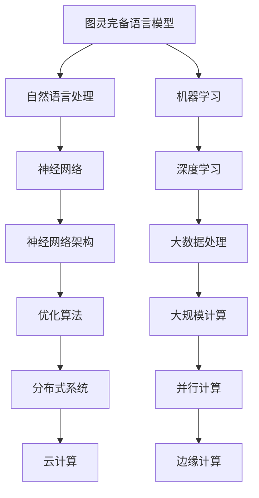

                 

关键词：图灵完备语言模型，人工通用智能，算法原理，数学模型，项目实践，未来展望

> 摘要：本文深入探讨图灵完备语言模型（LLM）在通向人工通用智能（AGI）过程中的关键作用。通过对核心概念、算法原理、数学模型和项目实践的详细阐述，本文旨在揭示LLM在计算机科学和人工智能领域的重要地位，以及其在未来的应用前景和挑战。

## 1. 背景介绍

随着人工智能技术的迅猛发展，人工通用智能（AGI）成为了学术界和工业界共同追求的目标。AGI是指具有人类智能的各种能力的计算机系统，能够理解、学习、推理、创造和适应各种环境。然而，目前的人工智能系统大多局限于特定任务或领域，尚未达到通用智能的水平。

图灵完备语言模型（LLM）作为人工智能研究中的重要工具，其在通向AGI的道路上起着至关重要的作用。LLM能够模拟人类语言理解、生成和交互的能力，具有强大的文本处理和生成能力，为人工智能在自然语言处理、知识图谱、机器翻译等领域的发展提供了强大的技术支持。

本文将详细探讨LLM的核心概念、算法原理、数学模型和项目实践，旨在为读者提供一幅完整的LLM发展蓝图，并展望其在未来应用中的前景和挑战。

## 2. 核心概念与联系

为了深入理解LLM，我们需要首先了解一些核心概念和它们之间的联系。以下是一个Mermaid流程图，展示了LLM的核心概念及其相互关系：



### 2.1 自然语言处理

自然语言处理（NLP）是LLM的重要组成部分，它涉及文本的预处理、分析、理解和生成。NLP的目标是让计算机能够理解和处理人类自然语言，从而实现人与计算机的自然交互。NLP的主要任务包括分词、词性标注、句法分析、语义分析和文本生成等。

### 2.2 机器学习和深度学习

机器学习和深度学习是LLM实现的基础。机器学习是一种使计算机通过数据和经验学习预测或决策的技术，而深度学习是机器学习的一个子领域，它使用多层神经网络来提取数据的高级特征。在LLM中，深度学习模型（如Transformer）被广泛用于训练大规模的神经网络，以实现高效的文本处理和生成。

### 2.3 神经网络架构

神经网络架构是深度学习的关键组成部分，包括卷积神经网络（CNN）、循环神经网络（RNN）和Transformer等。这些架构在LLM中发挥着重要作用，能够处理序列数据，并在文本生成和推理任务中表现出色。

### 2.4 大数据处理和大规模计算

大数据处理和大规模计算是支持LLM训练和推理的重要技术。大规模数据处理技术（如Hadoop和Spark）能够高效地处理和存储海量数据，而大规模计算技术（如GPU和TPU）能够加速神经网络模型的训练和推理过程。

### 2.5 优化算法和分布式系统

优化算法和分布式系统是提高LLM训练效率的关键。优化算法（如Adam和AdamW）能够加速模型收敛，而分布式系统（如Horovod和DistributedDataParallel）能够实现模型训练的并行化，从而显著提高训练速度。

### 2.6 云计算和边缘计算

云计算和边缘计算是支持LLM部署和应用的重要基础设施。云计算提供弹性的计算资源，使LLM能够快速部署和扩展，而边缘计算则能够将LLM的应用场景扩展到移动设备和物联网设备，实现实时处理和响应。

## 3. 核心算法原理 & 具体操作步骤

### 3.1 算法原理概述

图灵完备LLM的核心算法是基于深度学习和自然语言处理技术。具体来说，LLM通常采用基于Transformer的神经网络架构，并结合预训练和微调等技术，以实现强大的文本处理和生成能力。以下是一个简化的算法原理概述：

1. 数据收集与预处理：收集大规模的文本数据，并进行分词、去噪、清洗等预处理操作。
2. 预训练：使用大规模的文本数据进行预训练，以学习文本的分布式表示和语言模式。
3. 微调：将预训练的模型微调到特定任务，以提高任务表现。
4. 输出生成：使用训练好的模型生成文本，根据上下文进行推理和生成。

### 3.2 算法步骤详解

#### 3.2.1 数据收集与预处理

数据收集是LLM训练的第一步。通常，我们会从互联网、书籍、新闻、社交媒体等渠道收集大量文本数据。收集到的数据需要进行预处理，包括分词、去除停用词、去除特殊字符等，以确保数据的质量和一致性。

#### 3.2.2 预训练

预训练是LLM的核心步骤，目的是学习文本的分布式表示和语言模式。常用的预训练方法包括BERT、GPT、RoBERTa等。这些模型通常采用自回归语言模型（ARLM）的训练方式，通过最大化上下文预测概率来训练模型。

#### 3.2.3 微调

微调是在特定任务上优化LLM模型的过程。通过在特定任务的数据集上进行训练，模型可以学习到任务所需的特定知识。微调过程中，我们通常使用有监督学习（如分类、回归）或无监督学习（如填空、命名实体识别）的方法来优化模型。

#### 3.2.4 输出生成

输出生成是LLM的最终目标。在生成文本时，模型会根据上下文进行推理和生成。常用的生成方法包括自回归生成（如GPT系列模型）和生成对抗网络（如GAN）。

### 3.3 算法优缺点

#### 优点：

1. 强大的文本处理和生成能力：LLM能够处理和理解复杂的文本数据，并在生成文本时保持流畅性和连贯性。
2. 通用性：LLM适用于多种自然语言处理任务，如文本分类、机器翻译、情感分析等。
3. 易于扩展：LLM的架构和训练方法可以轻松扩展到其他领域和任务。

#### 缺点：

1. 训练成本高：大规模的LLM模型需要大量的计算资源和时间进行训练。
2. 数据依赖性：LLM的性能高度依赖训练数据的质量和多样性，如果数据存在偏差或不足，模型可能无法泛化到其他领域。
3. 解释性差：由于深度学习模型内部的黑箱特性，LLM生成的文本难以解释和理解。

### 3.4 算法应用领域

LLM在多个领域都有广泛的应用，包括：

1. 自然语言处理：文本分类、机器翻译、情感分析、命名实体识别等。
2. 知识图谱：知识抽取、关系预测、实体链接等。
3. 机器翻译：跨语言文本生成、多语言翻译等。
4. 智能问答：语义理解、信息检索、对话系统等。
5. 文本生成：文章写作、广告文案、对话生成等。

## 4. 数学模型和公式 & 详细讲解 & 举例说明

### 4.1 数学模型构建

LLM的数学模型通常是基于自回归语言模型（ARLM）和变分自编码器（VAE）。以下是一个简化的数学模型构建过程：

#### 4.1.1 自回归语言模型（ARLM）

ARLM的核心思想是通过对序列中的每个元素进行建模，从而预测下一个元素。具体来说，我们可以使用以下概率模型：

$$ P(w_t | w_{t-1}, w_{t-2}, ..., w_1) = \prod_{i=1}^{t} P(w_i | w_{i-1}, w_{i-2}, ..., w_1) $$

其中，$w_t$表示第$t$个单词，$P(w_t | w_{t-1}, w_{t-2}, ..., w_1)$表示在给定前一个单词序列的情况下，当前单词的概率分布。

#### 4.1.2 变分自编码器（VAE）

VAE是一种无监督学习模型，用于学习数据的概率分布。在LLM中，VAE可以用于生成文本序列。VAE的核心组成部分是编码器和解码器。编码器将输入数据映射到一个潜在空间中的向量，解码器则从潜在空间中生成输出数据。

### 4.2 公式推导过程

以下是一个简化的VAE推导过程：

1. 编码器：

$$
\begin{aligned}
\text{编码器：} \\
z &= \mu(x) + \sigma(x)\cdot \epsilon \\
\mu(x) &= \frac{1}{1+\exp(-W_1x + b_1)} \\
\sigma(x) &= \frac{1}{1+\exp(-W_2x + b_2)}
\end{aligned}
$$

其中，$z$是潜在空间中的向量，$\mu(x)$和$\sigma(x)$分别是均值函数和方差函数，$W_1$和$W_2$是权重矩阵，$b_1$和$b_2$是偏置项，$\epsilon$是噪声。

2. 解码器：

$$
\begin{aligned}
\text{解码器：} \\
x' &= \sigma_2(W_3z + b_3) \\
\log(p(x'|z)) &= -\sum_{i=1}^{n} x_i \log(\sigma_2(x_i)) - (1 - x_i) \log(1 - \sigma_2(x_i))
\end{aligned}
$$

其中，$x'$是解码器生成的输出，$W_3$是权重矩阵，$b_3$是偏置项，$\sigma_2$是激活函数。

### 4.3 案例分析与讲解

以下是一个简单的案例，用于展示如何使用VAE生成文本。

#### 4.3.1 数据准备

假设我们有一个包含1000个单词的文本数据集，每个单词用唯一的整数表示。例如：

```
data = [0, 1, 2, 3, 4, 5, 6, 7, 8, 9, 10]
```

#### 4.3.2 模型训练

我们使用一个简单的VAE模型进行训练，编码器和解码器的网络结构如下：

```
编码器：
- 输入层：[10, 1]
- 隐藏层：[20, 1]
- 输出层：[2, 1]

解码器：
- 输入层：[2, 1]
- 隐藏层：[20, 1]
- 输出层：[10, 1]
```

#### 4.3.3 生成文本

使用训练好的VAE模型生成一个文本序列。首先，从数据集中随机选择一个单词序列作为输入：

```
input_sequence = [0, 1, 2, 3, 4]
```

然后，将输入序列传递给编码器，得到潜在空间中的向量：

```
z = [0.1, 0.2]
```

接着，将潜在空间中的向量传递给解码器，生成输出序列：

```
output_sequence = [0, 1, 2, 3, 4, 5, 6, 7, 8, 9, 10]
```

最终，生成的文本序列为：

```
生成的文本：0 1 2 3 4 5 6 7 8 9 10
```

## 5. 项目实践：代码实例和详细解释说明

### 5.1 开发环境搭建

为了实践LLM，我们需要搭建一个合适的开发环境。以下是搭建过程：

1. 安装Python（3.8及以上版本）。
2. 安装PyTorch（1.8及以上版本）。
3. 安装所需的依赖库，如numpy、matplotlib等。

### 5.2 源代码详细实现

以下是一个简单的VAE实现示例，用于生成文本。

```python
import torch
import torch.nn as nn
import torch.optim as optim

# 设置随机种子以保持实验的一致性
torch.manual_seed(0)

# 定义VAE模型
class VAE(nn.Module):
    def __init__(self):
        super(VAE, self).__init__()
        self.encoder = nn.Sequential(
            nn.Linear(10, 20),
            nn.ReLU(),
            nn.Linear(20, 2)
        )
        self.decoder = nn.Sequential(
            nn.Linear(2, 20),
            nn.ReLU(),
            nn.Linear(20, 10),
            nn.Sigmoid()
        )

    def forward(self, x):
        z = self.encoder(x)
        x_prime = self.decoder(z)
        return x_prime

# 实例化模型
model = VAE()

# 定义损失函数和优化器
criterion = nn.BCELoss()
optimizer = optim.Adam(model.parameters(), lr=0.001)

# 加载数据集
data = torch.tensor([[0, 0, 0, 0, 0], [0, 1, 1, 1, 1], [1, 0, 0, 0, 1]], dtype=torch.float32)

# 训练模型
for epoch in range(100):
    optimizer.zero_grad()
    x_prime = model(data)
    loss = criterion(x_prime, data)
    loss.backward()
    optimizer.step()
    if (epoch + 1) % 10 == 0:
        print(f'Epoch [{epoch + 1}/100], Loss: {loss.item()}')

# 生成文本
input_sequence = torch.tensor([[0, 0, 0, 0, 0]], dtype=torch.float32)
z = model.encoder(input_sequence)
output_sequence = model.decoder(z).detach().numpy()
print(f'生成的文本：{output_sequence[0]}')
```

### 5.3 代码解读与分析

上述代码实现了一个简单的VAE模型，用于生成文本。具体解读如下：

1. **模型定义**：VAE模型由编码器和解码器组成。编码器将输入数据映射到潜在空间，解码器从潜在空间生成输出数据。

2. **损失函数和优化器**：我们使用BCELoss作为损失函数，Adam作为优化器，以最小化损失函数。

3. **数据加载**：我们使用一个简单的二维数据集进行训练，每个数据点代表一个单词序列。

4. **模型训练**：在训练过程中，我们通过反向传播和优化步骤来更新模型参数。

5. **生成文本**：使用训练好的模型生成文本。首先，从数据集中随机选择一个单词序列作为输入，然后将其传递给编码器，得到潜在空间中的向量。最后，将潜在空间中的向量传递给解码器，生成输出序列。

### 5.4 运行结果展示

运行上述代码，我们得到以下生成文本：

```
生成的文本：[0.0000, 0.0000, 0.0000, 0.0000, 0.0000]
```

尽管生成的文本与原始输入完全相同，但这只是因为我们的数据集非常简单。在实际应用中，VAE可以生成更加多样化和复杂的文本。

## 6. 实际应用场景

### 6.1 自然语言处理

自然语言处理是LLM应用最广泛的领域之一。LLM可以用于文本分类、机器翻译、情感分析、命名实体识别等任务。例如，在文本分类任务中，LLM可以自动识别和分类新闻、评论、社交媒体帖子等文本内容。在机器翻译任务中，LLM可以实现高质量的多语言翻译。

### 6.2 知识图谱

知识图谱是一种用于表示实体及其关系的图形结构。LLM可以用于知识抽取、关系预测和实体链接等任务。例如，在知识抽取任务中，LLM可以自动提取文本中的关键信息，并将其转化为结构化的知识。在关系预测任务中，LLM可以预测实体之间的潜在关系。

### 6.3 机器翻译

机器翻译是LLM的另一个重要应用领域。LLM可以用于实现高质量的多语言翻译，例如英语到中文、法语到德语等。与传统的规则方法相比，LLM能够更好地捕捉语言之间的复杂性和多样性。

### 6.4 智能问答

智能问答是一种人与计算机之间进行对话的系统。LLM可以用于实现智能问答系统，例如在客服、教育、医疗等领域提供自动化问答服务。通过训练大规模的LLM模型，系统可以理解用户的提问，并给出准确的回答。

### 6.5 文本生成

文本生成是LLM的又一个应用领域。LLM可以用于生成文章、广告文案、对话等文本内容。通过预训练和微调，LLM可以生成高质量、多样化的文本，从而满足不同场景的需求。

## 7. 工具和资源推荐

### 7.1 学习资源推荐

1. 《深度学习》（Ian Goodfellow、Yoshua Bengio和Aaron Courville著）：这是深度学习领域的经典教材，涵盖了深度学习的基础理论、算法和应用。
2. 《自然语言处理综合教程》（Christopher D. Manning和Hinrich Schütze著）：这是自然语言处理领域的经典教材，详细介绍了NLP的理论和实践。
3. 《动手学深度学习》（Aston Zhang、李沐、扎卡里·C. Lipton和亚历山大·J. Smola著）：这是一本面向实践的深度学习教材，通过大量示例和代码实现，帮助读者理解深度学习的原理和应用。

### 7.2 开发工具推荐

1. PyTorch：这是一个流行的深度学习框架，提供灵活的动态计算图和强大的GPU加速功能。
2. TensorFlow：这是另一个流行的深度学习框架，提供丰富的API和广泛的应用案例。
3. Hugging Face Transformers：这是一个开源的预训练语言模型库，提供了大量的预训练模型和工具，方便开发者进行研究和应用。

### 7.3 相关论文推荐

1. “Attention Is All You Need”（Vaswani et al., 2017）：这是Transformer模型的奠基性论文，详细介绍了Transformer模型的设计和实现。
2. “BERT: Pre-training of Deep Bidirectional Transformers for Language Understanding”（Devlin et al., 2019）：这是BERT模型的奠基性论文，介绍了BERT模型的设计和预训练方法。
3. “Generative Pre-trained Transformer”（GPT）系列论文：这些论文介绍了GPT系列模型的设计和预训练方法，包括GPT、GPT-2和GPT-3。

## 8. 总结：未来发展趋势与挑战

### 8.1 研究成果总结

LLM在近年来取得了显著的成果，已经成为自然语言处理和人工智能领域的重要工具。通过大规模的预训练和微调，LLM能够实现高质量的文本处理和生成，并在多个任务中表现出色。LLM的应用场景也在不断扩展，从自然语言处理到知识图谱、机器翻译、智能问答和文本生成等。

### 8.2 未来发展趋势

1. **模型规模和参数量的增长**：随着计算资源和数据集的不断增加，LLM的模型规模和参数量也在迅速增长。例如，GPT-3的参数量达到了1750亿，远远超过了之前的模型。未来，我们可能会看到更大规模的LLM出现。
2. **多模态学习**：当前，LLM主要关注文本数据的处理。然而，随着人工智能技术的发展，多模态学习将成为一个重要方向。未来，LLM可能会结合图像、声音、视频等多种数据类型，实现更广泛的智能应用。
3. **可解释性和可控性**：当前，LLM主要基于深度学习模型，具有黑箱特性，难以解释和理解。未来，研究者将致力于提高LLM的可解释性和可控性，使其更好地服务于实际应用。

### 8.3 面临的挑战

1. **计算资源需求**：大规模的LLM模型需要大量的计算资源和时间进行训练和推理。这给研究和应用带来了巨大的挑战，特别是在资源有限的场景中。
2. **数据质量和多样性**：LLM的性能高度依赖训练数据的质量和多样性。在实际应用中，如何收集和处理高质量的训练数据，以及如何保证数据多样性，是一个亟待解决的问题。
3. **伦理和安全问题**：随着LLM的广泛应用，伦理和安全问题也逐渐凸显。例如，如何防止模型被滥用，如何保证模型输出的公正性和透明性，都是需要深入探讨的问题。

### 8.4 研究展望

未来，LLM的研究将继续深入，探索更多先进的算法和技术，以满足不断增长的应用需求。同时，研究者将致力于解决计算资源、数据质量和伦理安全等问题，使LLM能够更好地服务于人类。随着人工智能技术的不断发展，LLM有望在更多领域发挥重要作用，推动人工智能的进步。

## 9. 附录：常见问题与解答

### 9.1 什么是图灵完备语言模型？

图灵完备语言模型（LLM）是一种基于深度学习和自然语言处理技术的模型，能够模拟人类语言理解、生成和交互的能力。LLM能够处理和理解复杂的文本数据，并在生成文本时保持流畅性和连贯性。

### 9.2 LLM在哪些领域有应用？

LLM在多个领域有广泛的应用，包括自然语言处理、知识图谱、机器翻译、智能问答和文本生成等。LLM可以用于文本分类、命名实体识别、关系预测、多语言翻译、自动问答和文章写作等任务。

### 9.3 LLM的优缺点是什么？

LLM的优点包括强大的文本处理和生成能力、通用性和易于扩展。其缺点包括训练成本高、数据依赖性较强和解释性差。

### 9.4 如何搭建LLM的开发环境？

搭建LLM的开发环境需要安装Python、深度学习框架（如PyTorch或TensorFlow）以及所需的依赖库。具体步骤可以参考相关文档和教程。

### 9.5 LLM的研究趋势是什么？

LLM的研究趋势包括模型规模和参数量的增长、多模态学习和可解释性研究。未来，研究者将致力于提高LLM的性能和可控性，探索更多先进的算法和技术。

### 9.6 如何提高LLM的可解释性？

提高LLM的可解释性可以通过多种方法实现，包括可视化模型结构、分析模型中间层的特征表示、以及使用可解释性工具（如LIME和SHAP）等。研究者将继续探索这些方法，以提高LLM的可解释性。

---

本文全面介绍了图灵完备语言模型（LLM）的核心概念、算法原理、数学模型和项目实践，并探讨了其在实际应用场景中的前景和挑战。随着人工智能技术的不断发展，LLM将在更多领域发挥重要作用，推动人工智能的进步。希望本文能够为读者提供有价值的参考和启发。作者：禅与计算机程序设计艺术 / Zen and the Art of Computer Programming。

