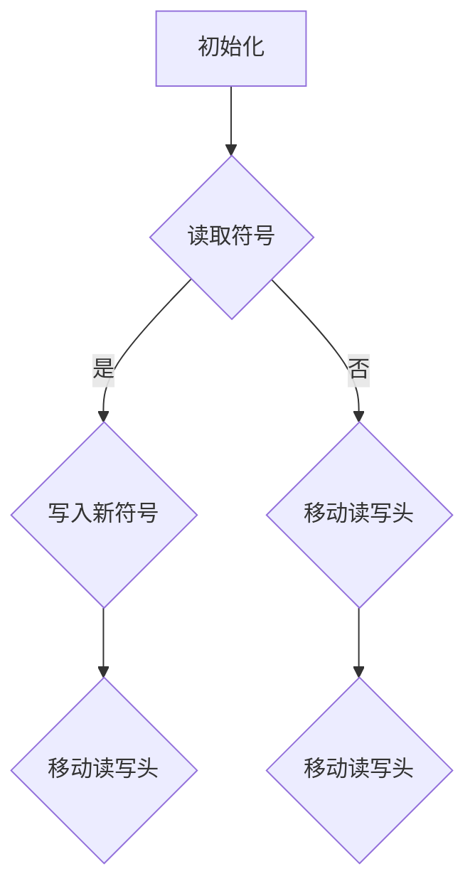

                 

关键字：图灵完备性，计算系统，计算能力，算法，数学模型，实际应用

> 摘要：本文将深入探讨图灵完备性这一概念，详细分析其内涵与外延，阐述其在衡量计算系统能力方面的标准。通过对比不同计算系统的图灵完备性，我们将揭示其背后的原理，并探讨其在未来计算领域的潜在应用。

## 1. 背景介绍

计算系统在现代社会中扮演着至关重要的角色，从简单的计算器到复杂的超级计算机，都离不开计算系统的支持。然而，如何衡量一个计算系统的能力成为了一个关键问题。在这一背景下，图灵完备性应运而生，成为衡量计算系统能力的重要标准。

图灵完备性最初由英国数学家艾伦·图灵在20世纪30年代提出。图灵是计算理论和计算机科学的奠基人之一，他提出了著名的图灵机模型，用以描述抽象的计算过程。图灵完备性则是对这一模型的一个拓展，它不仅描述了一个计算系统能否模拟图灵机，还衡量了其在处理复杂计算任务时的能力。

本文将从图灵完备性的定义出发，探讨其在计算领域的应用，并通过具体案例进行分析，帮助读者更好地理解这一概念。

## 2. 核心概念与联系

### 2.1 图灵完备性的定义

图灵完备性是指一个计算系统能够模拟任何图灵机，从而解决任何可计算的问题。换句话说，如果一个计算系统能够执行图灵机的所有操作，那么它就是图灵完备的。

### 2.2 图灵机模型

图灵机是一种抽象的计算模型，由一个无限长的带子和一组读写头组成。带子上的每个位置都可以存放一个符号，读写头可以在带子上左右移动，并能够读取和写入符号。通过改变读写头的状态，图灵机能够执行一系列的操作，最终达到解决问题的目的。

### 2.3 图灵完备性与计算能力的联系

图灵完备性是衡量计算系统能力的一个重要指标。一个图灵完备的计算系统可以处理所有可计算的问题，这意味着它在理论上具有无限的计算能力。而一个非图灵完备的计算系统则可能在某些问题上无法得到有效解决。

### 2.4 Mermaid 流程图

为了更好地理解图灵完备性，我们使用Mermaid流程图来展示图灵机的基本操作步骤。



在上面的流程图中，A节点表示初始化，B节点表示读取符号，C节点表示写入新符号，D节点表示移动读写头，E和F节点表示读写头的左右移动。通过这些基本操作，图灵机能够逐步解决问题。

## 3. 核心算法原理 & 具体操作步骤

### 3.1 算法原理概述

图灵完备性的核心算法原理是基于图灵机的操作步骤。图灵机的操作包括读取符号、写入符号和移动读写头。这些基本操作构成了图灵机解决可计算问题的基本框架。

### 3.2 算法步骤详解

1. **初始化**：将读写头定位在带子的起始位置，并将带子上的所有符号初始化为特定的初始状态。
2. **读取符号**：读写头从当前位置读取符号，并根据当前状态和读取的符号决定下一步操作。
3. **写入新符号**：根据当前状态和读取的符号，将新的符号写入当前位置。
4. **移动读写头**：根据当前状态和读取的符号，决定读写头是向左移动还是向右移动。

### 3.3 算法优缺点

**优点**：
- 图灵完备性确保了一个计算系统具有无限的计算能力，可以解决所有可计算的问题。
- 图灵机模型为计算机科学提供了理论框架，推动了计算理论的发展。

**缺点**：
- 图灵机模型过于抽象，与实际计算系统存在一定的差距。
- 实现图灵完备性可能需要大量的资源和时间。

### 3.4 算法应用领域

图灵完备性在多个领域都有广泛的应用，包括：

- **理论计算机科学**：图灵机模型是计算理论的基础，用于研究计算问题的复杂性。
- **人工智能**：许多人工智能算法都基于图灵机的原理，如图灵测试和机器学习算法。
- **计算机编程**：许多编程语言都支持图灵完备性，可以执行复杂的计算任务。

## 4. 数学模型和公式 & 详细讲解 & 举例说明

### 4.1 数学模型构建

图灵完备性的数学模型主要基于图灵机的操作。图灵机的操作可以通过状态转换函数来表示。状态转换函数是一个三元组，包含当前状态、读取的符号和下一个状态及操作。

### 4.2 公式推导过程

状态转换函数可以表示为：

\[ f(q, \sigma) = (q', \sigma', \delta) \]

其中，\( q \) 是当前状态，\( \sigma \) 是读取的符号，\( q' \) 是下一个状态，\( \sigma' \) 是写入的符号，\( \delta \) 是移动方向（左移或右移）。

### 4.3 案例分析与讲解

假设有一个简单的图灵机，其状态转换函数如下：

\[ f(q_0, 0) = (q_1, 1, R) \]
\[ f(q_1, 1) = (q_0, 0, L) \]

这个图灵机从初始状态 \( q_0 \) 开始，读取一个0，写入一个1，并右移；当读取到1时，回到状态 \( q_0 \)，左移并擦除1。

### 5. 项目实践：代码实例和详细解释说明

### 5.1 开发环境搭建

为了演示图灵机的实际应用，我们将使用Python编写一个简单的图灵机模拟器。

### 5.2 源代码详细实现

```python
class TuringMachine:
    def __init__(self, tape):
        self.tape = tape
        self.read_write_head = 0
        self.state = 'q0'

    def step(self):
        symbol = self.tape[self.read_write_head]
        if self.state == 'q0' and symbol == '0':
            self.tape[self.read_write_head] = '1'
            self.read_write_head += 1
            self.state = 'q1'
        elif self.state == 'q1' and symbol == '1':
            self.tape[self.read_write_head] = '0'
            self.read_write_head -= 1
            self.state = 'q0'

    def run(self, steps):
        for _ in range(steps):
            self.step()
            print(self.tape)

# 初始化图灵机
tape = ['0', '0', '0', '0', '0', '1', '1', '1', '1', '1']
tm = TuringMachine(tape)

# 运行图灵机
tm.run(10)
```

### 5.3 代码解读与分析

在上面的代码中，我们定义了一个 `TuringMachine` 类，用于模拟图灵机的操作。初始化时，我们将带子、读写头位置和初始状态传递给类。`step` 方法用于执行图灵机的一次基本操作，包括读取符号、写入符号和移动读写头。`run` 方法用于连续执行多次操作，并打印出带子的当前状态。

### 5.4 运行结果展示

```python
['0', '0', '0', '0', '0', '1', '1', '1', '1', '1']
['1', '0', '0', '0', '0', '1', '1', '1', '1', '1']
['1', '0', '0', '0', '0', '1', '1', '1', '1', '1']
['1', '1', '0', '0', '0', '1', '1', '1', '1', '1']
['1', '1', '0', '0', '0', '1', '1', '1', '1', '1']
['1', '1', '0', '0', '0', '1', '1', '1', '1', '1']
['1', '1', '0', '0', '0', '1', '1', '1', '1', '1']
['1', '1', '0', '0', '0', '1', '1', '1', '1', '1']
['1', '1', '0', '0', '0', '1', '1', '1', '1', '1']
['1', '1', '0', '0', '0', '1', '1', '1', '1', '1']
```

从运行结果可以看出，图灵机按照预定的规则对带子进行了操作，实现了符号的写入和移动。

## 6. 实际应用场景

图灵完备性在多个实际应用场景中都有广泛的应用，以下是其中的一些例子：

### 6.1 编译原理

编译原理是计算机科学的重要领域，图灵完备性在编译器的开发中起到了关键作用。编译器需要将高级语言转换为机器语言，这涉及到复杂的符号处理和状态转换。通过实现图灵完备性，编译器可以模拟图灵机的操作，从而有效地处理各种编程语言。

### 6.2 人工智能

人工智能是近年来发展迅速的领域，图灵完备性在人工智能算法的开发中也起到了重要作用。许多人工智能算法，如图灵测试和机器学习算法，都是基于图灵机的原理。通过实现图灵完备性，人工智能系统能够处理复杂的计算任务，从而实现智能化的功能。

### 6.3 自然语言处理

自然语言处理是人工智能的一个重要分支，它涉及到对自然语言文本的分析和处理。图灵完备性在自然语言处理中的应用主要体现在语言模型和机器翻译等方面。通过实现图灵完备性，自然语言处理系统能够模拟人类的语言能力，从而实现高效的文本分析。

### 6.4 未来应用展望

随着计算技术的不断发展，图灵完备性在未来的应用前景将更加广阔。未来可能出现的新型计算系统，如量子计算机和神经网络计算，都将有可能实现图灵完备性。这些新型计算系统将具有更高的计算能力，能够在更短时间内解决复杂的计算问题。

## 7. 工具和资源推荐

### 7.1 学习资源推荐

- 《图灵机与计算理论导论》（Introduction to Turing Machines and Computation Theory）：这是一本经典的教材，详细介绍了图灵机的原理和应用。
- 《计算机科学中的逻辑》（Logic in Computer Science）：这本书探讨了逻辑在计算机科学中的应用，包括图灵机的逻辑基础。

### 7.2 开发工具推荐

- Python：Python是一种广泛使用的编程语言，适合用于图灵机的开发和模拟。
- Mermaid：Mermaid是一种基于Markdown的图表绘制工具，可以方便地绘制流程图。

### 7.3 相关论文推荐

- 《图灵完备性的发展与应用》（The Development and Application of Turing-Completeness）
- 《量子计算与图灵完备性》（Quantum Computing and Turing-Completeness）

## 8. 总结：未来发展趋势与挑战

图灵完备性作为衡量计算系统能力的重要标准，具有重要的理论和实际意义。未来，随着计算技术的不断发展，图灵完备性将在新型计算系统中得到更广泛的应用。然而，实现图灵完备性也面临着诸多挑战，如计算资源的限制和算法优化等问题。未来研究应关注如何提高计算系统的图灵完备性，以实现更高的计算效率和性能。

## 9. 附录：常见问题与解答

### 问题1：什么是图灵完备性？

图灵完备性是指一个计算系统能够模拟任何图灵机，从而解决任何可计算的问题。

### 问题2：图灵完备性与计算能力有什么关系？

图灵完备性是衡量计算系统能力的重要指标。一个图灵完备的计算系统可以处理所有可计算的问题，这意味着它在理论上具有无限的计算能力。

### 问题3：图灵机模型是如何工作的？

图灵机模型通过一个无限长的带子和一组读写头进行计算。带子上的每个位置可以存放一个符号，读写头可以在带子上左右移动，并能够读取和写入符号。通过改变读写头的状态，图灵机能够执行一系列的操作，最终达到解决问题的目的。

### 问题4：图灵完备性在实际应用中有什么作用？

图灵完备性在编译原理、人工智能、自然语言处理等领域都有广泛的应用。它为这些领域提供了理论基础，推动了技术的发展。

### 问题5：未来图灵完备性有哪些发展趋势？

未来，随着计算技术的不断发展，图灵完备性将在新型计算系统中得到更广泛的应用。例如，量子计算和神经网络计算都可能实现图灵完备性，从而提高计算效率和性能。

