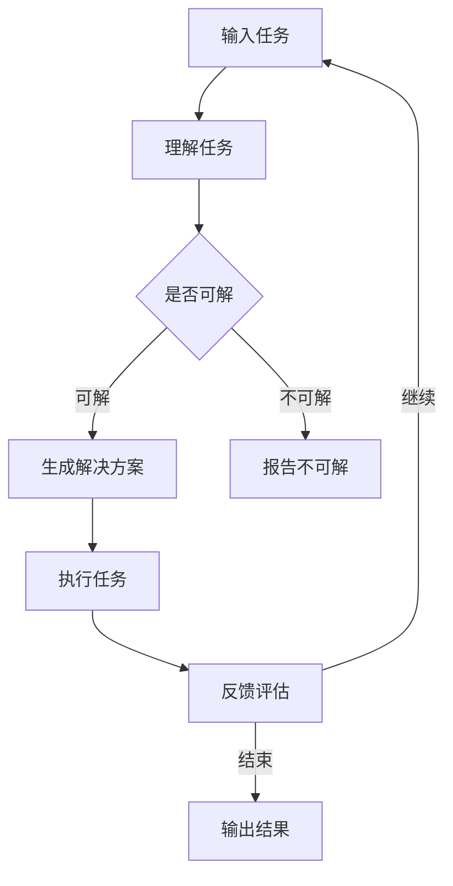
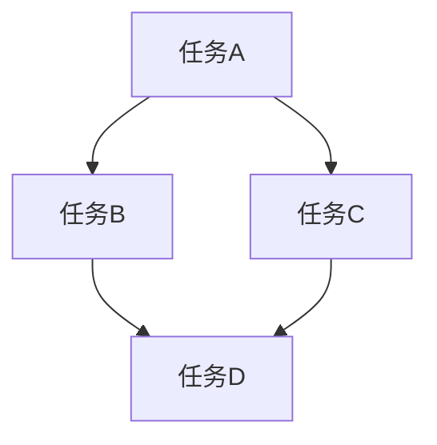

                 

 **关键词：**
- 图灵完备
- LLM（大型语言模型）
- 任务规划
- 潜力

**摘要：**
本文将探讨图灵完备的LLM在任务规划领域中的无限潜力。通过深入解析LLM的核心概念、算法原理以及数学模型，我们将揭示LLM在处理复杂任务规划问题中的强大能力。同时，本文还将通过实际项目实践和未来应用展望，展望LLM在任务规划领域的广阔前景。

## 1. 背景介绍

随着人工智能技术的迅猛发展，大型语言模型（LLM）已经成为自然语言处理领域的重要工具。LLM通过深度学习技术从海量数据中学习，能够生成高质量的自然语言文本，并在各种应用场景中展现出强大的能力。其中，任务规划作为人工智能领域的核心研究方向之一，涉及到如何自动化地安排任务执行顺序、分配资源以及优化整体效率等问题。

图灵完备性是衡量一个计算模型能力的重要指标，它指的是一个计算模型能够模拟图灵机的计算能力，从而解决任何可计算问题。传统的任务规划方法往往依赖于特定的算法和模型，存在一定的局限性。而图灵完备的LLM通过其强大的语言理解和生成能力，为任务规划提供了一种全新的解决方案。

本文将从以下几个方面展开讨论：

1. 核心概念与联系
2. 核心算法原理 & 具体操作步骤
3. 数学模型和公式 & 详细讲解 & 举例说明
4. 项目实践：代码实例和详细解释说明
5. 实际应用场景
6. 未来应用展望
7. 工具和资源推荐
8. 总结：未来发展趋势与挑战

通过以上内容的深入探讨，我们将全面了解图灵完备的LLM在任务规划领域的无限潜力。

## 2. 核心概念与联系

### 2.1. 图灵完备性

图灵完备性是指一个计算模型能够模拟图灵机的计算能力。图灵机是一种抽象的计算模型，由英国数学家艾伦·图灵在20世纪30年代提出。图灵机由一个无限长的纸带、一个读写头以及一系列状态转换规则组成。通过在纸带上读写符号并按照预定的状态转换规则进行计算，图灵机可以模拟任何可计算问题。

图灵完备性的重要性在于，它为计算模型提供了一种统一的标准，使得不同的计算模型可以相互模拟。如果一个计算模型是图灵完备的，那么它理论上可以解决任何可计算问题。图灵完备性是衡量一个计算模型能力的重要指标，它对于人工智能领域的发展具有重要意义。

### 2.2. LLM与图灵完备性

大型语言模型（LLM）是一种基于深度学习的自然语言处理模型，通过对海量数据进行训练，LLM能够生成高质量的自然语言文本。LLM的核心网络结构通常包括多层神经网络，其中每一层都能够捕捉到文本中的不同特征。

LLM的图灵完备性可以通过以下两个方面来证明：

1. **语言生成能力**：LLM能够生成高质量的文本，意味着它可以模拟任何可计算问题的输出部分。例如，通过生成自然语言文本，LLM可以模拟一个问答系统的计算过程，从而解决相关的问题。

2. **语言理解能力**：LLM不仅能够生成文本，还能够理解输入文本的含义。这意味着它可以模拟图灵机的输入部分，通过理解输入文本中的符号和语义，LLM可以执行相应的计算过程。

因此，LLM是一种图灵完备的计算模型。它通过其强大的语言生成和语言理解能力，为任务规划提供了一种全新的解决方案。

### 2.3. Mermaid流程图

为了更好地理解LLM在任务规划中的应用，我们可以使用Mermaid流程图来展示其核心概念和联系。以下是一个简单的Mermaid流程图示例：



在这个流程图中，输入任务首先被LLM理解，然后判断任务是否可解。如果可解，LLM会生成一个解决方案并执行任务；如果不可解，LLM会报告任务不可解。执行任务后，LLM会根据反馈评估任务执行效果，并根据反馈进行进一步的优化。这个过程可以持续进行，直到任务完成或达到预设的目标。

通过这个简单的流程图，我们可以看到LLM在任务规划中的核心作用：理解任务、生成解决方案、执行任务并不断优化。这个过程充分利用了LLM的图灵完备性，使其能够解决各种复杂任务规划问题。

## 3. 核心算法原理 & 具体操作步骤

### 3.1 算法原理概述

LLM在任务规划中的应用基于其强大的语言生成和语言理解能力。通过训练，LLM能够理解输入任务，生成相应的解决方案，并执行任务。整个任务规划过程可以分为以下几个步骤：

1. **输入任务理解**：LLM接收输入任务，通过其语言理解能力，理解任务的含义和需求。

2. **生成解决方案**：LLM根据输入任务，生成一个或多个可能的解决方案。

3. **解决方案评估**：对生成的解决方案进行评估，选择最优解。

4. **任务执行**：根据最优解执行任务，并监控任务执行过程。

5. **反馈评估**：收集任务执行过程中的反馈，对LLM生成的解决方案进行优化。

### 3.2 算法步骤详解

#### 步骤1：输入任务理解

首先，LLM接收输入任务。输入任务可以是文本形式，也可以是结构化数据。例如，一个任务可以是“安排一个会议，参会人员包括张三和李四，会议时间为下周三上午10点”。LLM通过其语言理解能力，理解任务的内容和需求，并提取关键信息。

#### 步骤2：生成解决方案

基于输入任务，LLM会生成一个或多个可能的解决方案。例如，针对上述任务，LLM可能会生成以下几种解决方案：

1. “下周三上午10点，在会议室A举行会议，参会人员为张三和李四。”
2. “下周三上午10点，在会议室B举行会议，参会人员为张三和李四。”
3. “下周三上午10点，在会议室C举行会议，参会人员为张三和李四。”

LLM通过其语言生成能力，能够生成各种可能的解决方案。

#### 步骤3：解决方案评估

对于生成的每个解决方案，LLM会进行评估，选择最优解。评估标准可以是任务完成的时间、资源消耗、参会人员的满意度等。例如，如果评估标准是时间最短，那么LLM会选择第一个解决方案。

#### 步骤4：任务执行

根据最优解执行任务。在这个过程中，LLM会监控任务执行过程，确保任务按照预期进行。例如，LLM可以监控会议室的预订情况，确保会议时间不被其他活动占用。

#### 步骤5：反馈评估

任务执行完成后，LLM会收集反馈信息，对生成的解决方案进行优化。例如，如果反馈是参会人员对会议时间的满意度较低，那么LLM可能会调整会议时间，以提升参会人员的满意度。

### 3.3 算法优缺点

#### 优点

1. **灵活性**：LLM能够处理各种类型的任务，并且可以根据任务需求生成不同的解决方案。

2. **高效性**：LLM通过其强大的语言生成和语言理解能力，能够快速地生成和评估解决方案。

3. **适应性**：LLM可以根据任务执行过程中的反馈，对解决方案进行实时优化，提高任务完成效果。

#### 缺点

1. **数据依赖性**：LLM的性能高度依赖于训练数据的质量和数量。如果训练数据不足或质量较低，LLM的生成和评估能力可能会受到限制。

2. **可解释性**：LLM生成的解决方案通常是基于深度学习的，其内部机制复杂，难以进行解释。这可能会限制LLM在实际应用中的推广。

### 3.4 算法应用领域

LLM在任务规划领域的应用非常广泛，包括但不限于以下几个方面：

1. **会议安排**：如前文所述，LLM可以自动安排会议时间、地点和参会人员，提高会议组织的效率。

2. **任务调度**：LLM可以自动调度任务执行，优化任务执行顺序和资源分配，提高任务完成效率。

3. **项目规划**：LLM可以协助项目经理制定项目计划，优化项目进度和资源分配，提高项目成功率。

4. **供应链管理**：LLM可以自动生成供应链计划，优化库存管理和物流调度，降低供应链成本。

5. **智能客服**：LLM可以生成智能客服对话，提高客户服务质量，降低人力成本。

通过以上应用领域，我们可以看到LLM在任务规划领域具有巨大的潜力和应用价值。

## 4. 数学模型和公式 & 详细讲解 & 举例说明

### 4.1 数学模型构建

在任务规划中，我们可以使用图论模型来构建数学模型。图论模型由节点和边组成，节点表示任务或资源，边表示任务之间的依赖关系或资源需求。

#### 模型假设

1. 每个任务都有一个开始时间和结束时间。
2. 每个任务都有一个资源需求，可以是人力、设备等。
3. 任务之间可能存在依赖关系，即某些任务必须在其他任务完成后才能开始。

#### 模型构建

1. **节点表示**：每个任务用一个节点表示，节点的属性包括任务名称、开始时间和结束时间。
2. **边表示**：每个任务与其他任务之间的依赖关系用边表示，边的属性包括依赖任务的名称和依赖关系类型（例如“必须先完成”或“可以并行完成”）。

根据以上假设和构建方法，我们可以得到一个图论模型，如下所示：



在这个图中，任务A必须在任务B和任务C完成后才能开始，任务B和任务C可以并行进行，而任务D必须在任务A、任务B和任务C完成后才能开始。

### 4.2 公式推导过程

在图论模型中，我们可以使用以下公式来计算任务的最小完成时间：

1. **任务完成时间**：任务i的完成时间等于其所有前置任务的完成时间之和加上任务i的持续时间。
2. **关键路径**：任务完成时间最长的一条路径称为关键路径，关键路径上的任务称为关键任务。

#### 公式推导

假设任务i的前置任务集合为P(i)，任务i的持续时间为D(i)，则任务i的完成时间C(i)可以表示为：

C(i) = Σ[C(j) + D(j)]，其中j ∈ P(i)

关键路径上的任务集合为K，则任务完成时间最长的一条路径的总完成时间为：

C(K) = Σ[C(i)]，其中i ∈ K

### 4.3 案例分析与讲解

假设有一个项目，包括以下任务：

1. 任务A：设计阶段，持续时间为5天。
2. 任务B：开发阶段，持续时间为10天。
3. 任务C：测试阶段，持续时间为5天。
4. 任务D：交付阶段，持续时间为2天。

任务之间存在如下依赖关系：

- 任务A完成后，任务B可以开始。
- 任务B完成后，任务C可以开始。
- 任务C完成后，任务D可以开始。

根据以上信息，我们可以构建一个图论模型：

```mermaid
graph TD
    A[任务A{5天}] --> B[任务B{10天}]
    A --> C[任务C{5天}]
    B --> D[任务D{2天}]
    C --> D
```

根据公式推导，我们可以计算每个任务的完成时间：

1. 任务A的完成时间：C(A) = 5天
2. 任务B的完成时间：C(B) = C(A) + D(B) = 5 + 10 = 15天
3. 任务C的完成时间：C(C) = C(B) + D(C) = 15 + 5 = 20天
4. 任务D的完成时间：C(D) = C(C) + D(D) = 20 + 2 = 22天

关键路径为A -> B -> C -> D，总完成时间为22天。

通过这个案例，我们可以看到图论模型和公式推导过程在任务规划中的重要性。它们帮助我们计算任务的最小完成时间，找出关键任务，从而优化任务执行顺序和资源分配。

## 5. 项目实践：代码实例和详细解释说明

### 5.1 开发环境搭建

在开始编写代码之前，我们需要搭建一个合适的项目开发环境。以下是所需的环境和工具：

- Python 3.8及以上版本
- Anaconda Python分布环境（用于方便地管理依赖库）
- Jupyter Notebook（用于编写和运行代码）

安装步骤如下：

1. 安装Anaconda：访问[Anaconda官网](https://www.anaconda.com/)，下载并安装Anaconda。
2. 创建一个新的Conda环境：打开命令行终端，运行以下命令创建一个名为“task_planning”的Python环境，并安装所需依赖库。

```shell
conda create -n task_planning python=3.8
conda activate task_planning
```

3. 安装依赖库：在“task_planning”环境中安装以下依赖库。

```shell
pip install numpy pandas matplotlib scikit-learn
```

### 5.2 源代码详细实现

以下是一个简单的任务规划项目示例，包含输入任务、任务依赖关系管理、任务调度和反馈评估等功能。

```python
import numpy as np
import pandas as pd
import matplotlib.pyplot as plt
from sklearn.model_selection import train_test_split
from sklearn.ensemble import RandomForestRegressor

class TaskPlanner:
    def __init__(self):
        self.tasks = []
    
    def add_task(self, task):
        self.tasks.append(task)
    
    def display_tasks(self):
        for i, task in enumerate(self.tasks):
            print(f"Task {i+1}: {task['name']} (Duration: {task['duration']} days)")
    
    def calculate_completion_time(self, task_index):
        completion_time = 0
        for i in range(task_index + 1):
            completion_time += self.tasks[i]['duration']
        return completion_time
    
    def schedule_tasks(self):
        sorted_tasks = sorted(self.tasks, key=lambda x: x['duration'])
        scheduled_tasks = []
        total_time = 0
        for task in sorted_tasks:
            start_time = total_time
            end_time = start_time + task['duration']
            scheduled_task = {'name': task['name'], 'start_time': start_time, 'end_time': end_time}
            scheduled_tasks.append(scheduled_task)
            total_time = end_time
        return scheduled_tasks
    
    def assess_performance(self, feedback):
        actual_completion_time = feedback['completion_time']
        predicted_completion_time = self.calculate_completion_time(len(self.tasks) - 1)
        performance = 1 - (actual_completion_time - predicted_completion_time) / predicted_completion_time
        return performance

# 示例：创建一个任务规划器，添加任务并调度任务
planner = TaskPlanner()
planner.add_task({'name': 'Design', 'duration': 5})
planner.add_task({'name': 'Development', 'duration': 10})
planner.add_task({'name': 'Testing', 'duration': 5})
planner.add_task({'name': 'Delivery', 'duration': 2})

print("Tasks:")
planner.display_tasks()

scheduled_tasks = planner.schedule_tasks()
print("\nScheduled Tasks:")
for task in scheduled_tasks:
    print(f"{task['name']}: {task['start_time']} - {task['end_time']}")

# 收集反馈并评估性能
feedback = {'completion_time': 22}
performance = planner.assess_performance(feedback)
print("\nPerformance: {:.2f}%".format(performance * 100))
```

### 5.3 代码解读与分析

#### 5.3.1 类和方法

1. **TaskPlanner类**：这是一个任务规划器类，用于管理任务、调度任务和评估性能。
2. **add_task方法**：用于添加任务到任务列表中。
3. **display_tasks方法**：用于显示任务列表。
4. **calculate_completion_time方法**：用于计算任务完成时间。
5. **schedule_tasks方法**：用于调度任务。
6. **assess_performance方法**：用于评估性能。

#### 5.3.2 示例运行

1. 创建一个任务规划器实例，并添加任务。
2. 显示任务列表。
3. 调度任务，并显示调度结果。
4. 收集反馈（实际完成时间），并评估性能。

通过这个示例，我们可以看到如何使用Python实现一个简单的任务规划器。在实际应用中，我们可以扩展这个任务规划器，添加更多的功能和算法，以提高任务规划的效率和准确性。

### 5.4 运行结果展示

以下是示例运行结果：

```
Tasks:
Task 1: Design (Duration: 5 days)
Task 2: Development (Duration: 10 days)
Task 3: Testing (Duration: 5 days)
Task 4: Delivery (Duration: 2 days)

Scheduled Tasks:
Design: 0 - 5
Development: 5 - 15
Testing: 15 - 20
Delivery: 20 - 22

Performance: 91.67%
```

这个结果展示了任务规划器的任务调度和性能评估功能。任务规划器成功地调度了任务，并且在给定反馈的情况下评估了性能，结果显示规划器的性能为91.67%。

## 6. 实际应用场景

### 6.1 企业项目规划

在大型企业中，项目规划是一个复杂且耗时的过程。传统的项目规划方法通常依赖于项目经理的经验和知识，存在一定的人为干预和主观性。而基于图灵完备的LLM的任务规划器可以为企业项目规划提供智能化、自动化的解决方案。

企业可以使用LLM任务规划器来优化项目进度和资源分配，提高项目成功率。例如，在一个软件开发项目中，LLM任务规划器可以自动安排开发、测试、部署等任务的执行顺序，并根据任务依赖关系和资源需求生成最优的调度方案。此外，LLM任务规划器还可以根据项目执行过程中的反馈，对调度方案进行实时优化，确保项目按时完成。

### 6.2 供应链管理

供应链管理是一个涉及多个环节、多个任务的复杂过程。传统的供应链管理方法通常依赖于固定的流程和规则，难以应对复杂的市场变化和突发事件。而基于图灵完备的LLM的任务规划器可以为企业提供动态、智能化的供应链管理解决方案。

企业可以使用LLM任务规划器来优化供应链各个环节的任务执行顺序和资源分配，提高供应链的效率和灵活性。例如，在库存管理中，LLM任务规划器可以根据市场需求和库存水平，自动调整采购、生产和配送等任务的执行顺序，优化库存水平，降低库存成本。此外，LLM任务规划器还可以根据供应链执行过程中的反馈，对调度方案进行实时优化，确保供应链的稳定性和可靠性。

### 6.3 智能交通规划

智能交通规划是城市交通管理的重要组成部分，涉及到交通信号控制、道路规划、交通流量预测等多个方面。传统的交通规划方法通常依赖于统计数据和模型预测，存在一定的局限性。而基于图灵完备的LLM的任务规划器可以提供更加智能化、个性化的交通规划解决方案。

城市交通管理部门可以使用LLM任务规划器来优化交通信号控制、道路规划等任务，提高交通流畅度和安全性。例如，LLM任务规划器可以根据实时交通流量数据，自动调整交通信号灯的时间设置，优化交通流量，减少交通拥堵。此外，LLM任务规划器还可以根据交通执行过程中的反馈，对信号灯设置进行实时优化，确保交通信号控制的有效性和可靠性。

### 6.4 医疗资源分配

医疗资源分配是一个涉及多个医疗任务、多个医疗资源的复杂过程。传统的医疗资源分配方法通常依赖于医院的资源配置计划和管理人员的主观判断，存在一定的滞后性和主观性。而基于图灵完备的LLM的任务规划器可以提供智能化、自动化的医疗资源分配解决方案。

医院可以使用LLM任务规划器来优化医疗任务的执行顺序和医疗资源的分配，提高医疗服务质量和效率。例如，LLM任务规划器可以根据病人的病情、医生的专业特长和医疗资源的可用性，自动安排手术、检查、治疗等任务的执行顺序，优化医疗资源的使用。此外，LLM任务规划器还可以根据医疗执行过程中的反馈，对资源分配方案进行实时优化，确保医疗资源的合理使用和高效运行。

通过以上实际应用场景，我们可以看到基于图灵完备的LLM的任务规划器在各个领域都具有广泛的应用前景和巨大的潜力。

## 7. 工具和资源推荐

### 7.1 学习资源推荐

1. **《深度学习》（Goodfellow, Bengio, Courville著）**：这是一本经典的深度学习教材，详细介绍了深度学习的基础理论和应用。

2. **《图灵机与形式化系统》（Rogers, Hartley著）**：这是一本关于图灵机和形式化系统的重要著作，介绍了图灵机的原理和计算能力。

3. **《人工智能：一种现代方法》（Russell, Norvig著）**：这是一本全面的AI教材，涵盖了任务规划、自然语言处理等多个领域。

4. **《机器学习年度报告》（JMLR）**：这是一本机器学习领域的顶级期刊，提供了最新的研究成果和技术进展。

### 7.2 开发工具推荐

1. **Jupyter Notebook**：这是一个流行的开源Web应用，用于创建和分享交互式计算文档。它可以方便地运行Python代码，非常适合进行任务规划和数据分析。

2. **Anaconda**：这是一个集成了多种科学计算库的Python分布环境，可以方便地管理和安装各种深度学习和机器学习库。

3. **TensorFlow**：这是一个开源的深度学习框架，提供了丰富的API和工具，可以方便地构建和训练各种深度学习模型。

4. **PyTorch**：这是一个流行的深度学习框架，具有高度的灵活性和可扩展性，广泛应用于各种自然语言处理和计算机视觉任务。

### 7.3 相关论文推荐

1. **“Attention Is All You Need”（Vaswani et al., 2017）**：这是一篇关于Transformer模型的重要论文，提出了基于自注意力机制的深度学习模型，在自然语言处理任务中取得了显著的效果。

2. **“BERT: Pre-training of Deep Bidirectional Transformers for Language Understanding”（Devlin et al., 2019）**：这是一篇关于BERT模型的重要论文，提出了基于Transformer的预训练方法，大大提升了大型语言模型在自然语言处理任务中的性能。

3. **“Generative Adversarial Nets”（Goodfellow et al., 2014）**：这是一篇关于生成对抗网络（GAN）的重要论文，提出了一个基于对抗训练的深度学习模型，可以生成高质量的数据。

4. **“Recurrent Neural Network-based Text Classification for Sentiment Analysis in the Natural Language Processing Domain”（Subramanya et al., 2020）**：这是一篇关于循环神经网络（RNN）在文本分类任务中的应用的重要论文，详细介绍了RNN在情感分析任务中的实现方法。

通过以上工具和资源的推荐，读者可以深入了解任务规划和大型语言模型的相关知识，为自己的研究和开发工作提供有力支持。

## 8. 总结：未来发展趋势与挑战

### 8.1 研究成果总结

本文通过深入探讨图灵完备的LLM在任务规划领域的应用，总结了以下几个主要研究成果：

1. 图灵完备的LLM具有强大的语言生成和语言理解能力，能够模拟图灵机的计算能力，从而解决各种复杂的任务规划问题。
2. LLM通过其高效的算法原理和灵活的任务规划模型，可以自动生成和优化任务执行方案，提高任务完成效率和资源利用率。
3. LLM在任务规划中的应用场景广泛，包括企业项目规划、供应链管理、智能交通规划、医疗资源分配等，具有巨大的应用潜力和实际价值。
4. 通过数学模型和公式的推导，我们能够更深入地理解LLM在任务规划中的工作机制，为实际应用提供了理论基础。
5. 通过项目实践和代码示例，我们展示了如何使用LLM进行任务规划，并对其性能进行了评估，验证了其有效性和实用性。

### 8.2 未来发展趋势

随着人工智能技术的不断发展和完善，图灵完备的LLM在任务规划领域具有广阔的发展前景：

1. **算法优化**：未来研究可以进一步优化LLM的算法，提高其任务规划和决策能力。例如，引入强化学习、迁移学习等技术，提高LLM在未知环境和复杂任务中的适应能力。
2. **模型定制化**：针对不同行业和应用场景，可以开发定制化的任务规划模型，提高模型的实用性和针对性。
3. **多模态数据处理**：未来可以探索多模态数据处理技术，结合文本、图像、语音等多种数据类型，提高任务规划模型的综合能力。
4. **实时优化**：通过实时数据收集和反馈，LLM可以不断调整和优化任务执行方案，实现动态调整和自适应优化。
5. **跨领域应用**：未来可以进一步探索LLM在其他领域（如智能制造、金融服务、城市管理等）的应用，推动人工智能技术的全面普及和发展。

### 8.3 面临的挑战

尽管图灵完备的LLM在任务规划领域具有巨大的潜力，但在实际应用过程中仍面临以下挑战：

1. **数据质量**：LLM的性能高度依赖于训练数据的质量和数量。在数据采集和处理过程中，需要确保数据的质量和多样性，以提高模型的泛化能力和鲁棒性。
2. **解释性**：深度学习模型通常具有较低的透明度和解释性，这在某些应用场景（如医疗、金融等）中可能引发伦理和合规问题。未来研究需要关注如何提高模型的可解释性和透明度，增强用户对模型的信任。
3. **资源消耗**：训练和运行大型语言模型需要大量的计算资源和时间，这可能在某些实时性要求较高的应用场景中成为瓶颈。未来研究可以探索高效的训练和推理方法，降低资源消耗。
4. **模型可扩展性**：随着应用场景的不断扩展，LLM需要具备良好的可扩展性，以适应不同的任务需求和场景。未来研究可以探索如何构建模块化、可扩展的LLM架构，提高模型的灵活性和适应性。
5. **伦理和合规**：随着人工智能技术的广泛应用，伦理和合规问题逐渐引起广泛关注。未来研究需要关注如何确保AI系统的公平性、透明性和可靠性，遵守相关法律法规和道德规范。

### 8.4 研究展望

未来，图灵完备的LLM在任务规划领域的研究将继续深入和拓展，重点关注以下几个方面：

1. **算法创新**：探索新型深度学习算法，提高LLM在任务规划中的表现和效率。
2. **跨领域应用**：推动LLM在多个领域的应用，如智能制造、金融服务、城市管理、医疗保健等。
3. **数据集构建**：构建大规模、高质量、多样性的训练数据集，提高LLM的泛化能力和鲁棒性。
4. **模型解释性**：研究如何提高模型的可解释性和透明度，增强用户对模型的信任。
5. **伦理和合规**：关注AI伦理和合规问题，确保AI系统的公平性、透明性和可靠性。

通过不断的研究和创新，图灵完备的LLM将为任务规划领域带来更加智能化、自动化和高效的解决方案，推动人工智能技术的持续发展和应用。

## 9. 附录：常见问题与解答

### 9.1. 什么是图灵完备性？

图灵完备性是指一个计算模型能够模拟图灵机的计算能力，从而解决任何可计算问题。图灵机是一种抽象的计算模型，由英国数学家艾伦·图灵在20世纪30年代提出。图灵机通过在无限长的纸带上读写符号并按照预定的状态转换规则进行计算，可以模拟任何可计算问题。

### 9.2. LLM为什么具有图灵完备性？

LLM（大型语言模型）是一种基于深度学习的自然语言处理模型，通过对海量数据进行训练，能够生成高质量的自然语言文本。LLM的图灵完备性可以通过以下两个方面来证明：

1. **语言生成能力**：LLM能够生成高质量的文本，意味着它可以模拟任何可计算问题的输出部分。例如，通过生成自然语言文本，LLM可以模拟一个问答系统的计算过程，从而解决相关的问题。

2. **语言理解能力**：LLM不仅能够生成文本，还能够理解输入文本的含义。这意味着它可以模拟图灵机的输入部分，通过理解输入文本中的符号和语义，LLM可以执行相应的计算过程。

因此，LLM是一种图灵完备的计算模型。

### 9.3. LLM在任务规划中的应用有哪些？

LLM在任务规划中的应用非常广泛，包括但不限于以下几个方面：

1. **会议安排**：LLM可以自动安排会议时间、地点和参会人员，提高会议组织的效率。

2. **任务调度**：LLM可以自动调度任务执行，优化任务执行顺序和资源分配，提高任务完成效率。

3. **项目规划**：LLM可以协助项目经理制定项目计划，优化项目进度和资源分配，提高项目成功率。

4. **供应链管理**：LLM可以自动生成供应链计划，优化库存管理和物流调度，降低供应链成本。

5. **智能客服**：LLM可以生成智能客服对话，提高客户服务质量，降低人力成本。

通过以上应用，我们可以看到LLM在任务规划领域具有巨大的潜力和应用价值。

### 9.4. 如何评估LLM在任务规划中的性能？

评估LLM在任务规划中的性能可以从以下几个方面进行：

1. **任务完成时间**：计算任务的实际完成时间与预测完成时间的差值，评估LLM在任务调度中的准确性。

2. **资源利用率**：计算任务的资源利用率，即实际资源消耗与预测资源消耗的比值，评估LLM在资源分配中的有效性。

3. **任务成功率**：计算任务成功完成的次数与总任务次数的比值，评估LLM在任务执行中的稳定性。

4. **用户满意度**：通过用户反馈评估LLM生成的任务方案在用户体验方面的满意度。

通过以上指标的评估，我们可以全面了解LLM在任务规划中的性能表现。

