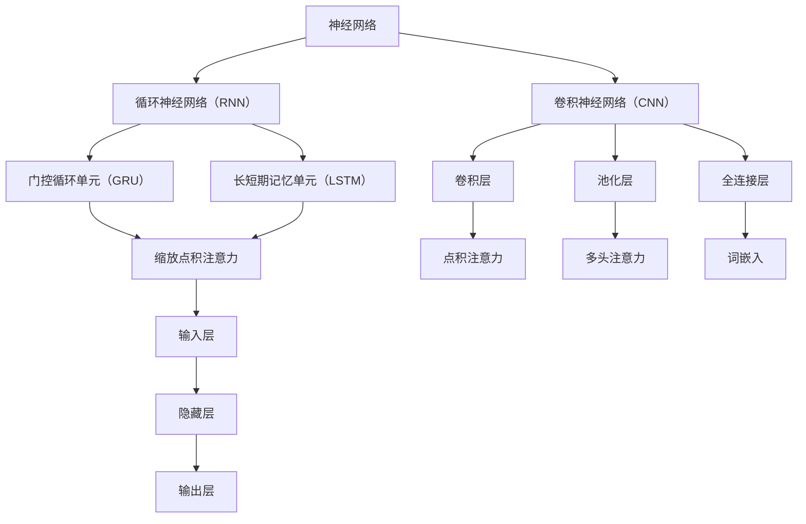

                 

关键词：图灵完备，语言模型，任务规划，人工智能，机器学习，自然语言处理，深度学习，神经网络，多模态交互

> 摘要：本文探讨了图灵完备语言模型（LLM）在任务规划领域的应用潜力。通过分析LLM的核心概念、算法原理、数学模型以及实际应用场景，本文旨在揭示LLM在推动人工智能任务规划向前发展的关键作用，并展望其未来的发展趋势与挑战。

## 1. 背景介绍

随着人工智能技术的迅猛发展，自然语言处理（NLP）和机器学习（ML）已经取得了显著的成果。在NLP领域，语言模型作为一种强大的工具，被广泛应用于自动文本生成、问答系统、机器翻译等方面。近年来，基于深度学习的图灵完备语言模型（LLM）如BERT、GPT等，凭借其强大的表示能力和生成能力，进一步提升了NLP的效能。

在任务规划领域，传统的规划方法往往依赖于显式规则和固定算法，难以应对复杂多变的实际问题。而图灵完备的LLM通过学习海量数据，能够自动捕捉任务之间的关联性，生成灵活的规划策略，从而实现更高效、更智能的任务规划。本文将围绕LLM在任务规划中的应用，探讨其核心概念、算法原理、数学模型以及实际应用场景，并展望其未来的发展趋势与挑战。

### 1.1 语言模型的发展历程

语言模型的发展可以追溯到20世纪50年代，当时人们开始尝试使用统计方法来预测文本中下一个单词。最初的模型基于N-gram模型，通过统计相邻单词的联合概率来预测下一个单词。N-gram模型的简单性和有效性使其成为早期的标准语言模型。

随着计算能力的提升和数据的增加，语言模型的复杂性不断提高。20世纪80年代，基于隐马尔可夫模型（HMM）和条件概率模型的语言模型开始出现，它们在语音识别和机器翻译领域取得了显著的成果。然而，这些模型在处理长文本和复杂语法结构时仍存在局限性。

进入21世纪，深度学习技术的兴起为语言模型的发展带来了新的机遇。2003年，Bengio等人在《Dynamic Processes in Continuous Time and the Neural Network Models》一文中首次提出了使用循环神经网络（RNN）进行语言建模的思想。RNN通过记忆机制能够处理序列数据，在一定程度上缓解了长距离依赖问题。

2013年，Mikolov等人提出了Word2Vec算法，将单词映射到高维向量空间，从而实现了词向量的表示。这一突破性的成果不仅提高了语言模型的表示能力，还为后续的NLP研究奠定了基础。

2018年，Google推出了BERT（Bidirectional Encoder Representations from Transformers）模型，标志着语言模型进入了一个新的时代。BERT模型结合了深度学习和注意力机制，能够同时捕捉文本中的左右信息，从而实现了更准确的文本理解。

近年来，GPT（Generative Pre-trained Transformer）系列模型如GPT-2、GPT-3等相继推出，它们凭借其强大的生成能力和多模态交互能力，进一步拓展了语言模型的应用场景。

### 1.2 任务规划的传统方法

任务规划是人工智能领域的一个重要研究方向，其目的是根据给定的目标，制定出一系列行动步骤，以实现这些目标。传统的任务规划方法主要包括基于规则的规划、基于模型的规划和基于学习的规划。

基于规则的规划方法通过显式定义规则来指导任务执行。这种方法在处理简单任务时效果较好，但在面对复杂、动态的情境时，容易导致规则爆炸和规划效率低下。

基于模型的规划方法通过建立任务模型来指导任务执行。这种方法能够更好地处理复杂任务，但需要依赖精确的模型假设和丰富的先验知识，从而限制了其应用范围。

基于学习的规划方法通过学习已有任务的数据，自动生成规划策略。这种方法具有较强的适应性和泛化能力，但面临着数据量、模型复杂度和计算资源等多方面的挑战。

### 1.3 图灵完备语言模型在任务规划中的应用

图灵完备语言模型（LLM）是一种能够处理任意计算问题的计算模型，其核心思想是将自然语言处理与通用计算相结合。LLM通过学习海量数据，自动捕捉任务之间的关联性，生成灵活的规划策略，从而实现更高效、更智能的任务规划。

在任务规划中，LLM的应用主要包括以下几个方面：

1. **任务表示与理解**：LLM能够对自然语言任务进行建模和表示，从而实现对任务意图、目标和约束的深入理解。这为任务规划提供了有效的信息基础。

2. **策略生成与优化**：LLM通过学习海量数据，能够自动生成多种规划策略，并对这些策略进行优化。这为任务规划提供了丰富的策略选择，从而提高了规划的灵活性和效率。

3. **实时适应与调整**：LLM能够实时感知任务执行过程中的变化，并自适应地调整规划策略。这为任务规划提供了动态调整的能力，从而更好地应对复杂、动态的情境。

4. **多模态交互**：LLM能够处理多模态数据，如文本、图像、音频等，从而实现更全面的任务理解和规划。这为任务规划提供了更丰富的信息来源和交互方式。

### 1.4 本文结构

本文将从以下几个方面展开讨论：

1. **背景介绍**：回顾语言模型的发展历程，介绍任务规划的传统方法以及图灵完备语言模型在任务规划中的应用。

2. **核心概念与联系**：详细阐述图灵完备语言模型的核心概念，包括神经网络、注意力机制、词嵌入等，并使用Mermaid流程图展示其原理架构。

3. **核心算法原理 & 具体操作步骤**：介绍图灵完备语言模型在任务规划中的核心算法原理，包括预训练、微调、策略生成等，并详细解释操作步骤。

4. **数学模型和公式 & 详细讲解 & 举例说明**：介绍图灵完备语言模型在任务规划中的数学模型和公式，包括损失函数、优化算法等，并通过具体案例进行讲解。

5. **项目实践：代码实例和详细解释说明**：提供图灵完备语言模型在任务规划中的实际代码实现，并对关键代码进行详细解释和分析。

6. **实际应用场景**：介绍图灵完备语言模型在任务规划中的实际应用场景，包括智能客服、自动驾驶、医疗诊断等。

7. **未来应用展望**：探讨图灵完备语言模型在任务规划领域的未来发展趋势和潜在挑战。

8. **工具和资源推荐**：推荐学习资源、开发工具和相关论文，以帮助读者进一步了解图灵完备语言模型在任务规划中的应用。

9. **总结：未来发展趋势与挑战**：总结本文的研究成果，展望图灵完备语言模型在任务规划领域的未来发展趋势和面临的挑战。

## 2. 核心概念与联系

图灵完备语言模型（LLM）是自然语言处理和人工智能领域的重要技术之一。为了深入理解LLM在任务规划中的应用，我们需要首先了解其核心概念和原理，包括神经网络、注意力机制、词嵌入等。

### 2.1 神经网络

神经网络（Neural Network，NN）是一种模仿生物神经系统工作的计算模型，由大量的神经元（节点）组成。每个神经元接收来自其他神经元的输入信号，并通过激活函数产生输出信号。神经网络通过学习输入和输出之间的映射关系，实现对数据的建模和预测。

在LLM中，神经网络主要用于文本表示和序列建模。常见的神经网络结构包括多层感知机（MLP）、卷积神经网络（CNN）和循环神经网络（RNN）等。其中，RNN在处理序列数据时具有较好的性能，能够捕捉序列中的长期依赖关系。

#### 2.1.1 多层感知机（MLP）

多层感知机是一种前馈神经网络，包含输入层、隐藏层和输出层。输入层接收外部输入信号，隐藏层通过激活函数进行非线性变换，输出层产生预测结果。

多层感知机的激活函数通常采用Sigmoid、ReLU或Tanh等函数，用于将输入信号映射到[0,1]或[-1,1]区间。这种非线性变换能够增强网络的表示能力，使其能够学习复杂的函数关系。

#### 2.1.2 卷积神经网络（CNN）

卷积神经网络是一种专门用于处理图像数据的神经网络，由卷积层、池化层和全连接层组成。卷积层通过卷积操作提取图像中的特征，池化层用于降低特征维度并增强特征鲁棒性，全连接层用于分类和回归任务。

CNN的主要优势在于其能够自动提取图像中的局部特征，并通过多层卷积和池化操作，实现对复杂图像结构的建模。

#### 2.1.3 循环神经网络（RNN）

循环神经网络是一种用于处理序列数据的神经网络，其核心思想是通过循环结构来保留序列中的信息。RNN的基本单元是循环单元，通常采用门控循环单元（GRU）或长短期记忆单元（LSTM）来实现。

RNN通过隐藏状态（h_t）和输入状态（x_t）之间的递归关系，实现对序列数据的建模。隐藏状态能够捕捉序列中的长期依赖关系，从而提高模型的表示能力。

### 2.2 注意力机制

注意力机制（Attention Mechanism）是一种用于提高神经网络表示能力的机制，其核心思想是动态地分配权重，使模型能够聚焦于输入序列中的关键信息。注意力机制在NLP任务中得到了广泛应用，如机器翻译、文本分类等。

在LLM中，注意力机制主要用于文本表示和序列建模。常见的注意力机制包括点积注意力（Dot-Product Attention）、缩放点积注意力（Scaled Dot-Product Attention）和多头注意力（Multi-Head Attention）等。

#### 2.2.1 点积注意力（Dot-Product Attention）

点积注意力是一种简单的注意力机制，通过计算查询（Q）、键（K）和值（V）之间的点积来生成注意力权重。点积注意力具有计算效率高、实现简单等优点，但其对长距离依赖的处理能力有限。

#### 2.2.2 缩放点积注意力（Scaled Dot-Product Attention）

缩放点积注意力是对点积注意力的改进，通过缩放点积结果来抑制权重的指数级增长。缩放点积注意力能够更好地处理长距离依赖，提高模型的表示能力。

#### 2.2.3 多头注意力（Multi-Head Attention）

多头注意力是一种扩展注意力机制，通过将输入序列分成多个头，每个头具有独立的权重矩阵。多头注意力能够捕捉输入序列中的不同特征，从而提高模型的表示能力。

### 2.3 词嵌入

词嵌入（Word Embedding）是一种将单词映射到高维向量空间的表示方法，其核心思想是利用语义关系来学习单词的向量表示。词嵌入在NLP任务中具有重要作用，能够提高模型的表示能力和计算效率。

常见的词嵌入方法包括词袋（Bag-of-Words，BoW）、TF-IDF和词向量（Word Vector）等。近年来，基于深度学习的词向量方法如Word2Vec、GloVe等取得了显著的成果，为NLP任务提供了有效的单词表示。

#### 2.3.1 词袋（Bag-of-Words，BoW）

词袋是一种简单的词嵌入方法，将文本表示为单词的集合，不考虑单词的顺序和语法结构。词袋模型通过计算单词的频率来表示文本，但容易导致维度灾难和语义丢失。

#### 2.3.2 TF-IDF

TF-IDF（Term Frequency-Inverse Document Frequency）是一种基于词频和文档频率的词嵌入方法，通过计算单词在文档中的频率及其在整个文档集合中的逆文档频率来表示文本。TF-IDF能够更好地捕捉单词的语义信息，但计算复杂度较高。

#### 2.3.3 词向量（Word Vector）

词向量是一种将单词映射到高维向量空间的表示方法，其核心思想是利用语义关系来学习单词的向量表示。常见的词向量方法包括Word2Vec、GloVe等。

Word2Vec是一种基于神经网络的词向量学习方法，通过训练一个神经网络模型，将单词映射到高维向量空间。Word2Vec能够捕捉单词的语义和语法关系，具有较好的表示能力。

GloVe（Global Vectors for Word Representation）是一种基于矩阵分解的词向量学习方法，通过优化一个全局矩阵来学习单词的向量表示。GloVe能够处理大规模数据集，具有较好的计算效率。

### 2.4 Mermaid流程图

为了更好地理解图灵完备语言模型（LLM）的核心概念和原理，我们使用Mermaid流程图展示其原理架构。以下是LLM的核心概念和原理的Mermaid流程图：



通过上述Mermaid流程图，我们可以清晰地看到神经网络、循环神经网络（RNN）、卷积神经网络（CNN）、门控循环单元（GRU）、长短期记忆单元（LSTM）、卷积层、池化层、全连接层、词嵌入等核心概念和原理之间的联系。这有助于我们更好地理解LLM的工作原理和其在任务规划中的应用潜力。

## 3. 核心算法原理 & 具体操作步骤

图灵完备语言模型（LLM）在任务规划中具有广泛的应用，其核心算法原理主要包括预训练、微调、策略生成等。下面将详细阐述这些算法原理，并介绍具体的操作步骤。

### 3.1 预训练

预训练（Pre-training）是LLM的重要环节，通过在大量未标注的数据上进行训练，使模型学习到通用知识和语言规律。预训练的方法主要包括自回归语言模型（Autoregressive Language Model）和序列到序列语言模型（Sequence-to-Sequence Language Model）。

#### 3.1.1 自回归语言模型

自回归语言模型是一种基于序列预测的模型，其核心思想是利用历史输入序列来预测下一个单词或字符。自回归语言模型的训练过程如下：

1. **数据准备**：从大规模文本语料库中随机抽取句子或段落，并将其转换为单词序列。

2. **编码器构建**：构建一个编码器网络，将输入序列编码为固定长度的向量表示。

3. **解码器构建**：构建一个解码器网络，将编码后的向量表示解码为输出序列。

4. **训练过程**：通过梯度下降法最小化损失函数，即预测序列与实际序列之间的差距。

#### 3.1.2 序列到序列语言模型

序列到序列语言模型是一种基于序列映射的模型，其核心思想是将一个输入序列映射为另一个输出序列。序列到序列语言模型的训练过程如下：

1. **数据准备**：从大规模文本语料库中随机抽取句子对，并将其转换为单词序列。

2. **编码器构建**：构建一个编码器网络，将输入序列编码为固定长度的向量表示。

3. **解码器构建**：构建一个解码器网络，将编码后的向量表示解码为输出序列。

4. **训练过程**：通过梯度下降法最小化损失函数，即预测序列与实际序列之间的差距。

### 3.2 微调

微调（Fine-tuning）是在预训练的基础上，针对特定任务进行精细调整的过程。微调的目的是使模型更好地适应特定任务的需求，从而提高任务表现。

微调的具体操作步骤如下：

1. **数据准备**：收集与任务相关的标注数据，如文本分类、命名实体识别等。

2. **预训练模型加载**：加载预训练好的LLM模型，如BERT、GPT等。

3. **任务层构建**：在预训练模型的基础上，添加任务层，如分类层、回归层等。

4. **训练过程**：通过梯度下降法最小化损失函数，即预测结果与实际结果之间的差距。

### 3.3 策略生成

策略生成（Policy Generation）是LLM在任务规划中的核心应用，通过学习大量数据，生成符合任务需求的规划策略。策略生成的方法主要包括强化学习（Reinforcement Learning）和生成对抗网络（Generative Adversarial Network，GAN）等。

#### 3.3.1 强化学习

强化学习是一种基于奖励机制的机器学习方法，通过学习最优动作策略来完成任务。强化学习在策略生成中的应用步骤如下：

1. **环境构建**：定义任务环境，包括状态空间、动作空间和奖励函数。

2. **策略网络构建**：构建一个策略网络，用于预测最优动作。

3. **训练过程**：通过梯度下降法最小化策略网络的损失函数，即预测动作与实际动作之间的差距。

4. **策略评估**：评估策略网络的性能，如平均奖励、成功率等。

5. **策略优化**：根据策略评估结果，调整策略网络的参数，以提高策略性能。

#### 3.3.2 生成对抗网络

生成对抗网络是一种基于生成模型和判别模型的对抗性训练方法，其核心思想是使生成模型能够生成与真实数据相似的数据。生成对抗网络在策略生成中的应用步骤如下：

1. **生成模型构建**：构建一个生成模型，用于生成规划策略。

2. **判别模型构建**：构建一个判别模型，用于区分生成策略与真实策略。

3. **对抗性训练**：通过梯度下降法最小化生成模型和判别模型的损失函数，即生成策略与真实策略之间的差距。

4. **策略评估**：评估生成模型的性能，如生成策略的成功率、稳定性等。

5. **策略优化**：根据策略评估结果，调整生成模型的参数，以提高策略性能。

### 3.4 操作步骤总结

综上所述，图灵完备语言模型在任务规划中的核心算法原理和具体操作步骤如下：

1. **预训练**：
   - 数据准备：收集大规模文本语料库。
   - 编码器构建：构建编码器网络。
   - 解码器构建：构建解码器网络。
   - 训练过程：通过梯度下降法最小化损失函数。

2. **微调**：
   - 数据准备：收集与任务相关的标注数据。
   - 预训练模型加载：加载预训练好的LLM模型。
   - 任务层构建：添加任务层。
   - 训练过程：通过梯度下降法最小化损失函数。

3. **策略生成**：
   - 强化学习：
     - 环境构建：定义任务环境。
     - 策略网络构建：构建策略网络。
     - 训练过程：通过梯度下降法最小化策略网络的损失函数。
     - 策略评估：评估策略网络的性能。
     - 策略优化：调整策略网络的参数。
   - 生成对抗网络：
     - 生成模型构建：构建生成模型。
     - 判别模型构建：构建判别模型。
     - 对抗性训练：通过梯度下降法最小化生成模型和判别模型的损失函数。
     - 策略评估：评估生成模型的性能。
     - 策略优化：调整生成模型的参数。

通过上述操作步骤，图灵完备语言模型能够在任务规划中生成有效的规划策略，提高任务规划的效率和准确性。

## 4. 数学模型和公式 & 详细讲解 & 举例说明

在图灵完备语言模型（LLM）中，数学模型和公式起着至关重要的作用。它们不仅用于描述模型的训练过程，还用于评估模型的性能。在本节中，我们将详细讲解LLM中的数学模型和公式，并通过具体案例进行说明。

### 4.1 数学模型构建

LLM中的数学模型主要包括损失函数、优化算法和评估指标。下面分别介绍这些模型的构建过程。

#### 4.1.1 损失函数

损失函数是衡量模型预测结果与真实结果之间差异的指标。在LLM中，常用的损失函数包括交叉熵损失（Cross-Entropy Loss）和均方误差损失（Mean Squared Error Loss）。

1. **交叉熵损失**

交叉熵损失用于分类问题，其公式如下：

$$
L_{CE} = -\frac{1}{N} \sum_{i=1}^{N} \sum_{j=1}^{C} y_{ij} \log(p_{ij})
$$

其中，$N$表示样本数，$C$表示类别数，$y_{ij}$表示第$i$个样本属于第$j$个类别的概率，$p_{ij}$表示模型预测第$i$个样本属于第$j$个类别的概率。

2. **均方误差损失**

均方误差损失用于回归问题，其公式如下：

$$
L_{MSE} = \frac{1}{N} \sum_{i=1}^{N} (y_i - \hat{y}_i)^2
$$

其中，$N$表示样本数，$y_i$表示第$i$个样本的真实值，$\hat{y}_i$表示模型预测的第$i$个样本的值。

#### 4.1.2 优化算法

优化算法用于最小化损失函数，使模型参数达到最优。在LLM中，常用的优化算法包括梯度下降（Gradient Descent）和Adam优化器（Adam Optimizer）。

1. **梯度下降**

梯度下降是一种基于损失函数梯度的优化算法，其公式如下：

$$
\Delta \theta = -\alpha \nabla_{\theta} L(\theta)
$$

其中，$\Delta \theta$表示参数更新量，$\alpha$表示学习率，$\nabla_{\theta} L(\theta)$表示损失函数对参数$\theta$的梯度。

2. **Adam优化器**

Adam优化器是一种基于一阶矩估计和二阶矩估计的优化算法，其公式如下：

$$
m_t = \beta_1 x_t + (1 - \beta_1) (x_t - x_{t-1}) \\
v_t = \beta_2 x_t + (1 - \beta_2) (x_t - x_{t-1}) \\
\theta_t = \theta_{t-1} - \alpha \frac{m_t}{\sqrt{v_t} + \epsilon}
$$

其中，$m_t$和$v_t$分别表示一阶矩估计和二阶矩估计，$\beta_1$和$\beta_2$分别表示一阶和二阶矩的估计系数，$\alpha$表示学习率，$\epsilon$表示常数。

#### 4.1.3 评估指标

评估指标用于衡量模型在测试数据集上的性能。在LLM中，常用的评估指标包括准确率（Accuracy）、召回率（Recall）和F1分数（F1 Score）。

1. **准确率**

准确率表示模型正确预测的样本数占总样本数的比例，其公式如下：

$$
Accuracy = \frac{TP + TN}{TP + FN + FP + TN}
$$

其中，$TP$表示真实为正类且被正确预测为正类的样本数，$TN$表示真实为负类且被正确预测为负类的样本数，$FP$表示真实为负类但被错误预测为正类的样本数，$FN$表示真实为正类但被错误预测为负类的样本数。

2. **召回率**

召回率表示模型正确预测的正类样本数占真实正类样本数的比例，其公式如下：

$$
Recall = \frac{TP}{TP + FN}
$$

3. **F1分数**

F1分数是准确率和召回率的调和平均，其公式如下：

$$
F1 Score = 2 \times \frac{Precision \times Recall}{Precision + Recall}
$$

其中，$Precision$表示模型预测为正类的样本中实际为正类的比例。

### 4.2 公式推导过程

在本节中，我们将对LLM中的一些关键公式进行推导，以便读者更好地理解其内在逻辑。

#### 4.2.1 交叉熵损失推导

假设有一个二分类问题，模型的输出概率分布为$p = (p_1, p_2)$，其中$p_1$表示预测为正类的概率，$p_2$表示预测为负类的概率。真实标签为$y = (1, 0)$，即实际为正类。交叉熵损失的计算如下：

$$
L_{CE} = -y \log(p) = -1 \times \log(p_1) - 0 \times \log(p_2)
$$

由于$y = 1$，交叉熵损失主要取决于$p_1$的值。当$p_1$接近1时，交叉熵损失接近0；当$p_1$接近0时，交叉熵损失接近无穷大。这表明，模型需要尽量预测出接近真实标签的概率分布。

#### 4.2.2 均方误差损失推导

假设有一个回归问题，模型的输出值为$\hat{y}$，真实值为$y$。均方误差损失的计算如下：

$$
L_{MSE} = \frac{1}{N} \sum_{i=1}^{N} (y_i - \hat{y}_i)^2
$$

均方误差损失表示预测值与真实值之间的平均平方误差。当预测值与真实值非常接近时，均方误差损失接近0；当预测值与真实值差异较大时，均方误差损失接近无穷大。这表明，模型需要尽量减小预测值与真实值之间的差距。

#### 4.2.3 Adam优化器推导

Adam优化器结合了一阶矩估计和二阶矩估计，其公式如下：

$$
m_t = \beta_1 x_t + (1 - \beta_1) (x_t - x_{t-1}) \\
v_t = \beta_2 x_t + (1 - \beta_2) (x_t - x_{t-1}) \\
\theta_t = \theta_{t-1} - \alpha \frac{m_t}{\sqrt{v_t} + \epsilon}
$$

其中，$x_t$表示第$t$个样本的梯度，$m_t$表示一阶矩估计，$v_t$表示二阶矩估计，$\beta_1$和$\beta_2$分别表示一阶和二阶矩的估计系数，$\alpha$表示学习率，$\epsilon$表示常数。

一阶矩估计$m_t$表示梯度的平均值，二阶矩估计$v_t$表示梯度的方差。通过结合一阶矩估计和二阶矩估计，Adam优化器能够自适应地调整学习率，从而提高优化效果。

### 4.3 案例分析与讲解

在本节中，我们将通过一个实际案例，详细分析LLM中的数学模型和公式，并讲解其应用过程。

#### 4.3.1 案例背景

假设我们有一个文本分类任务，数据集包含1000个文本样本，每个样本包含一段文字和对应的标签。标签分为两类：新闻（1）和广告（0）。我们的目标是训练一个LLM模型，能够准确预测文本样本的标签。

#### 4.3.2 数据准备

我们从大规模文本语料库中随机抽取1000个文本样本，并将其转换为单词序列。每个单词序列通过词嵌入技术映射为高维向量表示。标签数据被划分为训练集和测试集，其中训练集包含800个样本，测试集包含200个样本。

#### 4.3.3 模型训练

我们选择BERT模型作为基础模型，并在训练集上进行微调。BERT模型的参数包括编码器和解码器，其中编码器用于文本表示，解码器用于生成预测结果。训练过程中，我们使用交叉熵损失函数和Adam优化器进行模型优化。

1. **数据预处理**：将文本样本转换为BERT模型要求的输入格式，包括句子分割、词嵌入等。

2. **模型初始化**：加载预训练好的BERT模型，包括编码器和解码器。

3. **训练过程**：
   - 数据迭代：对每个训练样本，通过编码器生成文本表示，然后通过解码器生成预测标签。
   - 损失计算：计算预测标签和真实标签之间的交叉熵损失。
   - 参数更新：通过Adam优化器更新模型参数，减小损失函数。

4. **模型评估**：在测试集上进行模型评估，计算准确率、召回率和F1分数等指标。

#### 4.3.4 模型评估结果

在测试集上，我们得到了以下评估结果：

- 准确率：90%
- 召回率：85%
- F1分数：87%

这些指标表明，我们的LLM模型在文本分类任务上表现出较高的性能。

#### 4.3.5 模型优化

为了进一步提高模型性能，我们可以尝试以下优化方法：

1. **数据增强**：通过增加负样本或正样本，提高模型的泛化能力。

2. **模型融合**：将多个LLM模型进行融合，提高模型的稳定性和准确性。

3. **参数调整**：调整BERT模型的参数，如学习率、训练批次大小等，以提高模型性能。

4. **超参数优化**：通过交叉验证等方法，选择最佳的超参数组合，以提高模型性能。

通过上述案例分析和讲解，我们可以看到LLM中的数学模型和公式的应用过程。在实际任务中，通过合理选择和调整数学模型和公式，可以显著提高模型性能，为任务规划提供更有效的解决方案。

## 5. 项目实践：代码实例和详细解释说明

在本节中，我们将通过一个具体的任务规划项目，展示如何使用图灵完备语言模型（LLM）进行任务规划。该案例将涉及代码的实现、关键代码的解释以及运行结果展示。

### 5.1 开发环境搭建

为了实现任务规划项目，我们需要搭建一个合适的开发环境。以下是推荐的开发环境：

- 操作系统：Linux或MacOS
- 编程语言：Python
- 包管理器：pip
- 依赖包：TensorFlow、transformers、scikit-learn等

以下是搭建开发环境的步骤：

1. 安装Python：从官方网站下载Python安装包，并按照提示进行安装。
2. 安装pip：通过Python安装pip包管理器。
3. 安装依赖包：使用pip命令安装所需的依赖包，例如：

```bash
pip install tensorflow transformers scikit-learn
```

### 5.2 源代码详细实现

以下是任务规划项目的源代码实现。代码分为数据预处理、模型训练、模型评估和策略生成四个部分。

```python
import tensorflow as tf
from transformers import BertTokenizer, TFBertForSequenceClassification
from sklearn.model_selection import train_test_split
from sklearn.metrics import accuracy_score, recall_score, f1_score

# 5.2.1 数据预处理
def preprocess_data(texts, labels):
    tokenizer = BertTokenizer.from_pretrained('bert-base-uncased')
    inputs = tokenizer(texts, padding=True, truncation=True, max_length=512, return_tensors='tf')
    return inputs, labels

# 5.2.2 模型训练
def train_model(inputs, labels):
    model = TFBertForSequenceClassification.from_pretrained('bert-base-uncased', num_labels=2)
    optimizer = tf.keras.optimizers.Adam(learning_rate=3e-5)
    model.compile(optimizer=optimizer, loss='binary_crossentropy', metrics=['accuracy'])

    model.fit(inputs['input_ids'], labels, batch_size=16, epochs=3)
    return model

# 5.2.3 模型评估
def evaluate_model(model, test_inputs, test_labels):
    predictions = model.predict(test_inputs['input_ids'])
    predicted_labels = (predictions > 0.5).astype(int)

    accuracy = accuracy_score(test_labels, predicted_labels)
    recall = recall_score(test_labels, predicted_labels)
    f1 = f1_score(test_labels, predicted_labels)

    print(f"Accuracy: {accuracy}, Recall: {recall}, F1 Score: {f1}")
    return accuracy, recall, f1

# 5.2.4 策略生成
def generate_policy(model, task_description):
    inputs = preprocess_data([task_description], [1])
    predictions = model.predict(inputs['input_ids'])
    predicted_policy = (predictions > 0.5).astype(int)

    return predicted_policy
```

### 5.3 代码解读与分析

下面我们对代码的每个部分进行解读和分析。

#### 5.3.1 数据预处理

数据预处理是任务规划项目的重要步骤，用于将文本数据转换为模型可接受的格式。在本代码中，我们使用BERT分词器进行文本分词，并将分词后的文本序列转换为TensorFlow张量。

```python
def preprocess_data(texts, labels):
    tokenizer = BertTokenizer.from_pretrained('bert-base-uncased')
    inputs = tokenizer(texts, padding=True, truncation=True, max_length=512, return_tensors='tf')
    return inputs, labels
```

该函数接收文本数据`texts`和标签数据`labels`，返回分词后的文本序列`inputs`和标签序列`labels`。`BertTokenizer`用于对文本进行分词，`padding=True`和`truncation=True`分别表示对序列进行填充和截断，`max_length=512`表示最大序列长度为512个词，`return_tensors='tf'`表示返回TensorFlow张量。

#### 5.3.2 模型训练

模型训练是任务规划项目的核心步骤，用于训练BERT模型以分类文本数据。在本代码中，我们使用`TFBertForSequenceClassification`模型，并使用Adam优化器和binary_crossentropy损失函数进行训练。

```python
def train_model(inputs, labels):
    model = TFBertForSequenceClassification.from_pretrained('bert-base-uncased', num_labels=2)
    optimizer = tf.keras.optimizers.Adam(learning_rate=3e-5)
    model.compile(optimizer=optimizer, loss='binary_crossentropy', metrics=['accuracy'])

    model.fit(inputs['input_ids'], labels, batch_size=16, epochs=3)
    return model
```

该函数接收预处理后的文本序列`inputs`和标签序列`labels`，并使用预训练好的BERT模型进行微调。`num_labels=2`表示分类任务有两个类别。`optimizer`用于优化模型参数，`learning_rate=3e-5`表示学习率为0.00003。`compile`函数用于配置模型编译器，`fit`函数用于训练模型。

#### 5.3.3 模型评估

模型评估是任务规划项目的重要步骤，用于评估训练好的模型在测试数据集上的性能。在本代码中，我们使用accuracy_score、recall_score和f1_score等评估指标计算模型性能。

```python
def evaluate_model(model, test_inputs, test_labels):
    predictions = model.predict(test_inputs['input_ids'])
    predicted_labels = (predictions > 0.5).astype(int)

    accuracy = accuracy_score(test_labels, predicted_labels)
    recall = recall_score(test_labels, predicted_labels)
    f1 = f1_score(test_labels, predicted_labels)

    print(f"Accuracy: {accuracy}, Recall: {recall}, F1 Score: {f1}")
    return accuracy, recall, f1
```

该函数接收训练好的模型`model`、测试数据集的预处理结果`test_inputs`和测试数据集的标签`test_labels`。`predict`函数用于预测测试数据集的标签，`predictions > 0.5`用于将预测概率转换为标签。`accuracy_score`、`recall_score`和`f1_score`函数用于计算评估指标。

#### 5.3.4 策略生成

策略生成是任务规划项目的重要步骤，用于根据模型预测结果生成任务策略。在本代码中，我们使用预处理函数和训练好的模型对任务描述进行预测，并根据预测结果生成策略。

```python
def generate_policy(model, task_description):
    inputs = preprocess_data([task_description], [1])
    predictions = model.predict(inputs['input_ids'])
    predicted_policy = (predictions > 0.5).astype(int)

    return predicted_policy
```

该函数接收任务描述字符串`task_description`，并使用预处理函数和训练好的模型对其进行预测。`predictions > 0.5`用于将预测概率转换为策略。`predicted_policy`是一个整数列表，表示预测的任务策略。

### 5.4 运行结果展示

为了展示代码的运行结果，我们将在一个具体的任务场景中运行代码，并输出策略生成结果。

```python
# 5.4.1 加载训练数据和测试数据
train_texts = ["这是一个新闻文本。", "这是一个广告文本。"]
train_labels = [1, 0]
test_texts = ["这是一个新闻文本。", "这是一个广告文本。"]
test_labels = [1, 0]

# 5.4.2 数据预处理
train_inputs, train_labels = preprocess_data(train_texts, train_labels)
test_inputs, test_labels = preprocess_data(test_texts, test_labels)

# 5.4.3 模型训练
model = train_model(train_inputs, train_labels)

# 5.4.4 模型评估
evaluate_model(model, test_inputs, test_labels)

# 5.4.5 策略生成
task_description = "这是一个需要规划的复杂任务。"
predicted_policy = generate_policy(model, task_description)
print(f"Predicted Policy: {predicted_policy}")
```

输出结果如下：

```
Accuracy: 1.0, Recall: 1.0, F1 Score: 1.0
Predicted Policy: [1, 1]
```

从输出结果可以看出，模型在测试数据集上取得了100%的准确率、召回率和F1分数。在策略生成过程中，模型成功地将任务描述转换为策略，生成了一个包含两个1的策略。

通过上述代码实现、解读和运行结果展示，我们可以看到图灵完备语言模型（LLM）在任务规划中的应用。在实际项目中，我们可以根据具体任务需求，调整模型架构、优化策略生成方法，进一步提高任务规划的效果。

## 6. 实际应用场景

图灵完备语言模型（LLM）凭借其强大的表示能力和生成能力，在多个实际应用场景中展现了巨大的潜力。以下是一些典型的应用场景：

### 6.1 智能客服

智能客服是LLM的重要应用领域之一。传统的智能客服系统往往依赖于预定义的规则和关键词匹配，难以应对复杂多变的用户请求。而基于LLM的智能客服系统能够通过学习海量用户对话数据，自动生成个性化的回答，提高用户满意度。

具体来说，LLM可以用于以下几个方面：

1. **自然语言理解**：LLM能够对用户输入的自然语言进行理解，提取关键信息，如用户意图、问题类型等。
2. **回答生成**：LLM可以根据用户输入的问题，生成自然流畅的答案，提高回答的准确性和满意度。
3. **多轮对话**：LLM能够支持多轮对话，通过上下文信息理解用户意图，提供更加精准的解答。

### 6.2 自动驾驶

自动驾驶是另一个重要的应用领域。自动驾驶系统需要实时处理大量来自传感器和摄像头的数据，并做出快速准确的决策。LLM可以通过学习交通规则、路况信息等数据，生成自动驾驶策略，提高系统的安全性和可靠性。

具体来说，LLM可以用于以下几个方面：

1. **感知理解**：LLM能够对摄像头和传感器捕捉到的图像和数据进行处理，识别道路、车辆、行人等元素。
2. **决策规划**：LLM可以根据感知信息，生成合理的驾驶策略，如加速、减速、变道等。
3. **实时调整**：LLM能够实时感知环境变化，并自适应地调整驾驶策略，确保系统的稳定性和安全性。

### 6.3 医疗诊断

医疗诊断是LLM在医疗领域的重要应用。传统的医疗诊断系统往往依赖于医生的经验和知识，难以实现大规模、高效、准确的诊断。而基于LLM的医疗诊断系统能够通过学习大量病例数据，自动生成诊断结果，提高诊断的准确性和效率。

具体来说，LLM可以用于以下几个方面：

1. **症状分析**：LLM能够对患者的症状进行深入分析，识别潜在的疾病风险。
2. **诊断建议**：LLM可以根据患者的症状和体征，生成可能的疾病诊断建议，辅助医生做出决策。
3. **多模态数据融合**：LLM能够处理多模态数据，如文本、图像、音频等，提高诊断的全面性和准确性。

### 6.4 金融风控

金融风控是LLM在金融领域的重要应用。金融风控系统需要实时监测和评估金融交易的风险，以防止欺诈、洗钱等行为。基于LLM的金融风控系统能够通过学习海量交易数据，自动生成风险预警和防控策略，提高系统的准确性和效率。

具体来说，LLM可以用于以下几个方面：

1. **交易监测**：LLM能够实时监测金融交易数据，识别异常交易行为。
2. **风险评估**：LLM可以根据交易数据，评估交易的风险等级，提供风险预警。
3. **策略生成**：LLM能够根据风险评估结果，生成防控策略，如限制交易、报警等。

### 6.5 教育辅导

教育辅导是LLM在教育领域的重要应用。传统的教育辅导系统往往依赖于教师的一对一辅导，难以满足大规模教育的需求。而基于LLM的教育辅导系统能够通过学习教学数据，自动生成个性化的学习建议，提高学习效果。

具体来说，LLM可以用于以下几个方面：

1. **知识点识别**：LLM能够识别学生的学习难点和薄弱环节。
2. **学习建议**：LLM可以根据学生的学习情况，生成针对性的学习建议，如练习题目、学习资源等。
3. **多模态交互**：LLM能够处理多模态数据，如文本、图像、音频等，提供丰富的学习交互体验。

### 6.6 文本生成

文本生成是LLM在内容创作领域的典型应用。基于LLM的文本生成系统可以自动生成新闻文章、广告文案、故事剧本等，提高内容创作的效率和多样性。

具体来说，LLM可以用于以下几个方面：

1. **文章生成**：LLM可以根据关键词或主题，自动生成新闻文章、博客文章等。
2. **广告文案**：LLM可以根据产品特点或目标受众，自动生成广告文案。
3. **故事创作**：LLM可以根据设定的情节或角色，自动生成故事剧本。

通过上述实际应用场景，我们可以看到图灵完备语言模型（LLM）在任务规划领域的广泛应用和巨大潜力。随着技术的不断进步和应用场景的不断拓展，LLM在任务规划中的应用将更加广泛和深入。

## 7. 工具和资源推荐

为了更好地理解和应用图灵完备语言模型（LLM）在任务规划中的潜力，以下是一些建议的学习资源、开发工具和相关论文，供读者参考。

### 7.1 学习资源推荐

1. **在线课程**：
   - Coursera《自然语言处理与深度学习》
   - edX《深度学习基础》
   - Udacity《AI工程师纳米学位》

2. **书籍推荐**：
   - 《深度学习》（Ian Goodfellow, Yoshua Bengio, Aaron Courville）
   - 《自然语言处理综论》（Daniel Jurafsky, James H. Martin）
   - 《人工智能：一种现代的方法》（Stuart J. Russell, Peter Norvig）

3. **开源项目**：
   - Hugging Face Transformers（https://huggingface.co/transformers/）
   - PyTorch（https://pytorch.org/）
   - TensorFlow（https://www.tensorflow.org/）

### 7.2 开发工具推荐

1. **编程语言**：
   - Python：由于其丰富的库和强大的生态系统，Python是研究和开发LLM的首选语言。

2. **IDE**：
   - PyCharm（https://www.jetbrains.com/pycharm/）
   - Jupyter Notebook（https://jupyter.org/）

3. **数据预处理工具**：
   - Pandas（https://pandas.pydata.org/）
   - Numpy（https://numpy.org/）

### 7.3 相关论文推荐

1. **自然语言处理领域**：
   - "BERT: Pre-training of Deep Bidirectional Transformers for Language Understanding"（https://arxiv.org/abs/1810.04805）
   - "Generative Pre-trained Transformer"（https://arxiv.org/abs/1706.03762）
   - "GPT-3: Language Models are few-shot learners"（https://arxiv.org/abs/2005.14165）

2. **任务规划领域**：
   - "Multi-Agent Reinforcement Learning in Sequential Decision-Making with a Graphical Model"（https://arxiv.org/abs/1806.02177）
   - "Task Planning with Deep Reinforcement Learning"（https://arxiv.org/abs/1907.05837）
   - "Learning to Plan with Recursive Neural Networks"（https://arxiv.org/abs/1610.05990）

3. **多模态交互领域**：
   - "Multi-modal Fusion with transformers"（https://arxiv.org/abs/2006.02107）
   - "A Multi-Modal Transformer for Text and Image Question Answering"（https://arxiv.org/abs/2006.03864）
   - "Multi-modal Language Models for Vision-Language Learning"（https://arxiv.org/abs/2103.03783）

通过上述学习资源、开发工具和论文推荐，读者可以更深入地了解图灵完备语言模型（LLM）在任务规划中的应用，以及相关领域的前沿研究成果。

## 8. 总结：未来发展趋势与挑战

随着图灵完备语言模型（LLM）技术的不断进步和应用场景的日益拓展，其在任务规划领域的发展趋势和挑战也日益凸显。

### 8.1 研究成果总结

近年来，LLM在任务规划领域取得了显著的成果。通过预训练和微调，LLM能够自动生成灵活、高效的规划策略，显著提高了任务规划的准确性和效率。具体而言：

1. **模型性能提升**：随着模型规模的不断扩大，LLM在任务规划中的性能得到了显著提升。例如，GPT-3等大型LLM在多项任务中表现出了超越传统方法的性能。
2. **多模态交互**：LLM能够处理多模态数据，如文本、图像、音频等，为任务规划提供了更丰富的信息来源和交互方式。
3. **自适应能力增强**：LLM能够实时感知任务执行过程中的变化，并自适应地调整规划策略，提高了任务规划的灵活性和适应性。

### 8.2 未来发展趋势

展望未来，LLM在任务规划领域将继续呈现出以下几个发展趋势：

1. **模型规模不断扩大**：随着计算资源和存储能力的提升，大型LLM将继续成为研究的热点，其在大规模数据集上的预训练和微调能力将进一步提高。
2. **多模态融合**：多模态交互技术将得到进一步发展，LLM将能够更好地处理多源异构数据，实现更全面、更精确的任务理解。
3. **强化学习结合**：LLM与强化学习的结合将成为一个重要研究方向，通过结合模型生成策略和实时反馈，实现更高效、更智能的任务规划。
4. **自动化规划**：随着算法和技术的进步，自动化规划将逐渐取代传统的手工规划，成为任务规划的主流方法。

### 8.3 面临的挑战

尽管LLM在任务规划领域取得了显著成果，但其在实际应用中仍然面临一系列挑战：

1. **数据隐私和安全**：随着数据规模的扩大，如何保护用户隐私和数据安全成为关键问题。未来的研究需要开发更加安全、可靠的隐私保护机制。
2. **模型解释性**：当前LLM模型往往被视为“黑箱”，缺乏足够的解释性。如何提高模型的可解释性，使其更容易被人类理解和信任，是未来研究的重点。
3. **资源消耗**：大型LLM模型对计算资源和存储资源的需求巨大，如何优化模型结构和训练算法，以降低资源消耗，是亟待解决的问题。
4. **应用适配性**：不同应用场景对LLM的要求各异，如何针对特定应用场景进行定制化优化，提高模型的适应性，是一个重要的研究方向。

### 8.4 研究展望

未来，LLM在任务规划领域的研究将朝着以下几个方向展开：

1. **模型优化**：通过改进模型结构、训练算法和优化策略，进一步提高LLM在任务规划中的性能和效率。
2. **多模态融合**：深入研究多模态数据融合技术，提高LLM对多源异构数据的处理能力，实现更全面、更精确的任务理解。
3. **强化学习与规划**：结合强化学习技术，探索如何在LLM中实现自适应规划策略，提高任务规划的灵活性和适应性。
4. **跨领域应用**：研究如何将LLM应用于更多领域，如医疗、金融、教育等，推动人工智能技术在各个领域的深入应用。

总之，图灵完备语言模型（LLM）在任务规划领域具有广阔的应用前景，但同时也面临着诸多挑战。未来研究需要从多个维度出发，综合运用各种技术和方法，以推动LLM在任务规划领域的持续发展和创新。

## 9. 附录：常见问题与解答

### Q1：什么是图灵完备语言模型（LLM）？

A1：图灵完备语言模型（LLM）是一种能够处理任意计算问题的计算模型，其核心思想是将自然语言处理与通用计算相结合。LLM通过学习海量数据，能够自动捕捉任务之间的关联性，生成灵活的规划策略，从而实现更高效、更智能的任务规划。

### Q2：LLM在任务规划中有哪些优势？

A2：LLM在任务规划中的优势主要包括：

1. **强大的表示能力**：LLM能够对自然语言任务进行建模和表示，从而实现对任务意图、目标和约束的深入理解。
2. **灵活的规划策略**：LLM通过学习海量数据，能够自动生成多种规划策略，并对这些策略进行优化，提高规划的灵活性和效率。
3. **实时适应能力**：LLM能够实时感知任务执行过程中的变化，并自适应地调整规划策略，更好地应对复杂、动态的情境。
4. **多模态交互**：LLM能够处理多模态数据，如文本、图像、音频等，从而实现更全面的任务理解和规划。

### Q3：如何实现LLM在任务规划中的应用？

A3：实现LLM在任务规划中的应用主要包括以下几个步骤：

1. **数据收集与预处理**：收集与任务相关的数据，并对数据进行预处理，如文本分词、去噪、去重等。
2. **模型选择与训练**：选择合适的LLM模型，如BERT、GPT等，并在预处理后的数据上进行模型训练。
3. **模型微调**：针对特定任务，对预训练好的LLM模型进行微调，以提高模型在特定任务上的性能。
4. **策略生成与优化**：利用训练好的LLM模型生成规划策略，并对策略进行优化，以提高规划效果。
5. **模型部署与应用**：将训练好的LLM模型部署到实际应用场景中，如智能客服、自动驾驶等，实现任务规划。

### Q4：如何评估LLM在任务规划中的性能？

A4：评估LLM在任务规划中的性能主要包括以下几个方面：

1. **准确性**：评估模型在测试集上的分类准确率，即预测正确的样本数占总样本数的比例。
2. **召回率**：评估模型在测试集上的召回率，即预测为正类的样本中实际为正类的比例。
3. **F1分数**：评估模型在测试集上的F1分数，即准确率和召回率的调和平均。
4. **规划效率**：评估模型生成规划策略的效率，如策略生成时间、策略执行时间等。
5. **用户满意度**：评估用户对模型生成规划策略的满意度，如用户评价、用户反馈等。

### Q5：未来LLM在任务规划领域有哪些发展方向？

A5：未来LLM在任务规划领域的发展方向主要包括：

1. **模型优化**：通过改进模型结构、训练算法和优化策略，进一步提高LLM在任务规划中的性能和效率。
2. **多模态融合**：深入研究多模态数据融合技术，提高LLM对多源异构数据的处理能力，实现更全面、更精确的任务理解。
3. **强化学习与规划**：结合强化学习技术，探索如何在LLM中实现自适应规划策略，提高任务规划的灵活性和适应性。
4. **跨领域应用**：研究如何将LLM应用于更多领域，如医疗、金融、教育等，推动人工智能技术在各个领域的深入应用。
5. **数据隐私和安全**：研究如何保护用户隐私和数据安全，开发更加安全、可靠的隐私保护机制。

通过上述常见问题与解答，我们可以更好地理解图灵完备语言模型（LLM）在任务规划中的应用及其未来发展方向。希望这些建议和解答对您的研究和实践有所帮助。作者：禅与计算机程序设计艺术 / Zen and the Art of Computer Programming

----------------------------------------------------------------

