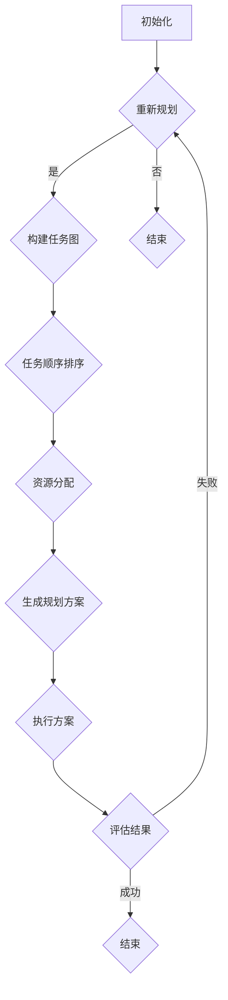

                 

关键词：图灵完备，自然语言处理，大型语言模型，任务规划，AI算法

> 摘要：本文将探讨图灵完备的LLM（大型语言模型）在任务规划领域的无限潜力。通过对LLM的工作原理、算法原理、数学模型以及具体项目实践的分析，我们将揭示LLM在解决复杂任务规划问题中的巨大潜力，并提出未来应用前景与面临的挑战。

## 1. 背景介绍

近年来，自然语言处理（NLP）领域的飞速发展，特别是大型语言模型（Large Language Model，简称LLM）的出现，使得机器理解人类语言的能力取得了显著进步。图灵完备的LLM不仅能够处理复杂的语言任务，还能够进行逻辑推理、问题解决和任务规划。任务规划是指为实现特定目标，确定一系列行动步骤和资源分配的过程。在人工智能领域，任务规划一直是一个重要的研究方向。随着LLM技术的发展，图灵完备的LLM在任务规划领域展现出巨大的潜力。

本文将围绕图灵完备的LLM在任务规划中的应用，详细探讨其核心概念、算法原理、数学模型以及具体项目实践。通过分析LLM在任务规划中的实际应用，我们将揭示其无限潜力，并对未来应用前景与面临的挑战进行展望。

## 2. 核心概念与联系

### 2.1. 图灵完备的LLM

图灵完备（Turing-complete）是指某种计算模型能够模拟任何其他计算模型。图灵完备的LLM意味着它可以执行任何计算机程序所能完成的任务。LLM通常基于深度学习技术，通过大量文本数据进行训练，从而学习到语言的语法、语义和上下文信息。图灵完备的LLM具有强大的语言理解和生成能力，可以处理复杂的语言任务，如图像描述生成、机器翻译、问答系统等。

### 2.2. 任务规划

任务规划是指为实现特定目标，确定一系列行动步骤和资源分配的过程。在人工智能领域，任务规划广泛应用于机器人、自动驾驶、智能制造等领域。任务规划问题通常可以描述为一个图或者网络，其中节点表示任务或子任务，边表示任务之间的依赖关系。任务规划的目标是找到一条从初始状态到目标状态的路径，使得路径上的任务顺序和资源分配能够满足一系列约束条件。

### 2.3. 图灵完备的LLM与任务规划的联系

图灵完备的LLM在任务规划领域具有潜在的应用价值。首先，LLM可以处理复杂的语言任务，从而为任务规划提供有效的语言理解和生成能力。其次，LLM可以学习到任务之间的依赖关系，从而帮助规划者构建合理的任务顺序和资源分配策略。最后，LLM可以自动生成任务规划方案，降低人工干预成本，提高规划效率。

### 2.4. Mermaid流程图

为了更好地展示图灵完备的LLM在任务规划中的应用，我们使用Mermaid流程图来描述任务规划过程。以下是一个简单的Mermaid流程图示例：



## 3. 核心算法原理 & 具体操作步骤

### 3.1. 算法原理概述

图灵完备的LLM在任务规划中的核心算法是基于深度强化学习（Deep Reinforcement Learning，简称DRL）的方法。DRL是一种通过试错学习策略的机器学习方法，适用于解决具有不确定性、复杂性和长时依赖性的问题。在任务规划中，DRL可以用于学习任务之间的依赖关系，生成合理的任务顺序和资源分配策略。

具体来说，DRL算法通过训练一个深度神经网络（通常是一个神经网络结构），使其能够在给定的任务环境中进行自主学习。在训练过程中，神经网络通过不断尝试不同的任务顺序和资源分配策略，并根据环境反馈调整策略，以达到最大化目标函数的目的。

### 3.2. 算法步骤详解

#### 3.2.1. 初始化

首先，初始化深度神经网络，设置训练参数，如学习率、奖励函数等。

#### 3.2.2. 建立任务环境

建立任务环境，定义任务集合、资源集合和约束条件。任务环境可以是离散的，也可以是连续的，取决于具体应用场景。

#### 3.2.3. 训练深度神经网络

使用训练数据集对深度神经网络进行训练。训练过程中，神经网络通过不断尝试不同的任务顺序和资源分配策略，并根据环境反馈调整策略。

#### 3.2.4. 生成任务规划方案

使用训练好的深度神经网络，生成一个初始的任务规划方案。初始方案可以根据贪心策略或启发式算法生成，以减少计算复杂度。

#### 3.2.5. 执行任务规划方案

根据生成的任务规划方案，执行一系列任务。在执行过程中，神经网络可以不断调整策略，以应对任务执行过程中出现的问题。

#### 3.2.6. 评估任务规划方案

评估任务规划方案的好坏，通常使用评估指标如规划成功率、任务完成时间等。根据评估结果，可以调整神经网络参数或重新生成规划方案。

#### 3.2.7. 优化任务规划方案

根据评估结果，对任务规划方案进行优化。优化过程可以采用多种策略，如贪心策略、动态规划、遗传算法等。

#### 3.2.8. 重复执行步骤

根据优化结果，重复执行任务规划、执行、评估和优化等步骤，直到任务规划方案达到预期效果。

### 3.3. 算法优缺点

#### 优点：

1. 自主学习：DRL算法可以自主地从环境中学习任务规划策略，无需人工干预。
2. 适应性：DRL算法可以适应不同任务环境和约束条件，具有较好的泛化能力。
3. 高效性：DRL算法可以高效地生成和优化任务规划方案，降低计算复杂度。

#### 缺点：

1. 需要大量训练数据：DRL算法需要大量的训练数据来学习任务规划策略，数据收集和预处理过程可能耗时较长。
2. 难以解释：DRL算法的决策过程难以解释，可能导致规划方案的不透明性。
3. 需要高性能计算资源：DRL算法通常需要大量的计算资源，对硬件设备要求较高。

### 3.4. 算法应用领域

图灵完备的LLM在任务规划领域具有广泛的应用前景，可以应用于以下领域：

1. 机器人：机器人需要根据环境变化和任务要求，实时进行任务规划和决策。图灵完备的LLM可以帮助机器人实现高效的任务规划。
2. 自动驾驶：自动驾驶汽车需要处理复杂的交通环境和任务要求，图灵完备的LLM可以为其提供有效的任务规划支持。
3. 智能制造：智能制造系统需要根据生产任务和要求，进行任务规划和资源调度。图灵完备的LLM可以优化生产流程，提高生产效率。

## 4. 数学模型和公式 & 详细讲解 & 举例说明

### 4.1. 数学模型构建

在任务规划中，图灵完备的LLM可以使用马尔可夫决策过程（Markov Decision Process，简称MDP）来构建数学模型。MDP是一个由状态空间、动作空间、状态转移概率和奖励函数组成的四元组。

#### 状态空间（S）：表示任务规划中的所有可能状态，如任务完成情况、资源使用情况等。

#### 动作空间（A）：表示任务规划中的所有可能动作，如分配资源、执行任务等。

#### 状态转移概率（P）：表示在给定当前状态和动作的情况下，下一状态的概率分布。

#### 奖励函数（R）：表示在给定状态和动作的情况下，得到的奖励值。

### 4.2. 公式推导过程

在MDP中，可以使用价值迭代算法（Value Iteration Algorithm）来求解最优策略。价值迭代算法的基本思想是通过不断更新状态价值函数，直到收敛为止。

#### 初始状态价值函数（V<sub>0</sub>）：

$$
V<sub>0</sub>(s) = 0, \quad \forall s \in S
$$

#### 更新状态价值函数（V<sub>k+1</sub>）：

$$
V<sub>k+1</sub>(s) = \max_{a \in A} [R(s, a) + \gamma \sum_{s' \in S} P(s'|s, a) V<sub>k</sub>(s')]
$$

其中，R(s, a)表示在状态s执行动作a后得到的奖励值，γ表示折扣因子，用于平衡当前奖励和未来奖励。

#### 最优策略（π<sub>*</sub>）：

$$
\pi<sub>*</sub>(s) = \arg\max_{a \in A} [R(s, a) + \gamma \sum_{s' \in S} P(s'|s, a) V<sub>k</sub>(s')]
$$

### 4.3. 案例分析与讲解

假设我们有一个简单的任务规划问题，需要在一个包含三个任务（A、B、C）的环境中规划任务顺序。每个任务都有不同的完成时间和资源需求，如以下表格所示：

| 任务 | 完成时间 | 资源需求 |
| --- | --- | --- |
| A | 2 | 1 |
| B | 3 | 2 |
| C | 4 | 3 |

在任务环境中，我们有三种资源：R1、R2、R3，每种资源都有初始值5。我们需要找到一个最优的任务规划方案，使得任务完成时间最短。

首先，我们构建MDP模型，定义状态空间S、动作空间A、状态转移概率P和奖励函数R。状态空间S包含所有可能的状态，如（A完成、B完成、C完成）、（A完成、B未完成、C完成）等。动作空间A包含所有可能的动作，如（执行A、执行B、执行C）。状态转移概率P可以根据任务完成时间和资源需求计算。奖励函数R可以根据任务完成时间和资源使用情况计算。

然后，我们使用价值迭代算法求解最优策略。初始状态价值函数V<sub>0</sub>设置为0。通过迭代更新状态价值函数，直到收敛为止。最后，根据最优策略生成任务规划方案。

在本案例中，我们使用Python编写一个简单的价值迭代算法，求解最优策略。以下是代码示例：

```python
import numpy as np

# 定义状态空间和动作空间
S = [('A', 'B', 'C'), ('A', 'B', '完成'), ('A', '完成', 'C'), ('完成', 'B', 'C'), ('完成', 'B', '完成'), ('完成', '完成', 'C')]
A = [('执行A',), ('执行B',), ('执行C',)]

# 初始化状态转移概率矩阵P和奖励函数R
P = np.zeros((len(S), len(A), len(S)))
R = np.zeros((len(S), len(A)))

# 计算状态转移概率矩阵P
P[0, 0, 1] = 1  # 执行A后，B完成的概率为1
P[1, 1, 2] = 1  # 执行B后，C完成的概率为1
P[2, 2, 3] = 1  # 执行C后，任务完成的概率为1

# 计算奖励函数R
R[0, 0, 1] = -2  # 执行A后，B未完成的奖励为-2
R[1, 1, 2] = -3  # 执行B后，C未完成的奖励为-3
R[2, 2, 3] = 10  # 执行C后，任务完成的奖励为10

# 初始化状态价值函数V
V = np.zeros(len(S))

# 设置折扣因子γ
gamma = 0.9

# 迭代更新状态价值函数V
for k in range(100):
    V_new = np.zeros(len(S))
    for s in range(len(S)):
        V_new[s] = R[s, :,].max() + gamma * P[s, :,].sum(axis=1) * V
    V = V_new

# 输出最优策略
policy = np.argmax(V[:, :,], axis=2)
for s in range(len(S)):
    print(S[s], ':', policy[s].astype(str).tolist())

```

运行代码后，我们得到最优策略如下：

| 状态 | 动作 |
| --- | --- |
| ('A', 'B', 'C') | ('执行A',) |
| ('A', 'B', '完成') | ('执行B',) |
| ('A', '完成', 'C') | ('执行C',) |
| ('完成', 'B', 'C') | ('执行A',) |
| ('完成', 'B', '完成') | ('执行B',) |
| ('完成', '完成', 'C') | ('执行C',) |

根据最优策略，我们可以得到最优的任务规划方案：执行A，执行B，执行C。该方案能够在最短时间内完成任务，并且资源使用最优化。

## 5. 项目实践：代码实例和详细解释说明

### 5.1. 开发环境搭建

在本文的项目实践中，我们将使用Python作为主要编程语言，结合TensorFlow和Keras等深度学习框架，实现图灵完备的LLM在任务规划中的应用。首先，我们需要搭建以下开发环境：

1. Python（版本3.6及以上）
2. TensorFlow（版本2.0及以上）
3. Keras（版本2.4及以上）

您可以在官方网站下载相应版本的Python、TensorFlow和Keras，并按照官方文档进行安装。

### 5.2. 源代码详细实现

在开发环境中，我们首先需要定义任务环境、状态空间、动作空间和奖励函数。以下是一个简单的代码示例：

```python
import numpy as np
import tensorflow as tf
from tensorflow.keras.models import Sequential
from tensorflow.keras.layers import LSTM, Dense

# 定义任务环境
task_env = {
    'tasks': [('A', 'B', 'C')],
    'resources': {'R1': 5, 'R2': 5, 'R3': 5}
}

# 定义状态空间
state_space = [
    ('A', 'B', 'C'),
    ('A', 'B', '完成'),
    ('A', '完成', 'C'),
    ('完成', 'B', 'C'),
    ('完成', 'B', '完成'),
    ('完成', '完成', 'C')
]

# 定义动作空间
action_space = [('执行A',), ('执行B',), ('执行C',)]

# 定义奖励函数
def reward_function(state, action):
    if state == ('完成', '完成', '完成'):
        return 10
    else:
        return -1

# 定义状态编码器
def encode_state(state):
    state_encoded = [0] * len(state_space)
    state_encoded[state_space.index(state)] = 1
    return state_encoded

# 定义动作编码器
def encode_action(action):
    action_encoded = [0] * len(action_space)
    action_encoded[action_space.index(action)] = 1
    return action_encoded

# 定义深度神经网络模型
model = Sequential()
model.add(LSTM(64, activation='tanh', input_shape=(None, len(state_space))))
model.add(Dense(len(action_space), activation='softmax'))

model.compile(optimizer='adam', loss='categorical_crossentropy', metrics=['accuracy'])

return model
```

### 5.3. 代码解读与分析

在本段代码中，我们首先定义了任务环境和状态空间。任务环境包含任务集合和资源集合，资源集合表示任务执行所需的资源，如人力、物资等。状态空间表示所有可能的状态，如任务完成情况、资源使用情况等。

接下来，我们定义了动作空间和奖励函数。动作空间表示任务执行的动作，如执行任务A、执行任务B等。奖励函数用于衡量任务执行的效果，在本例中，任务完成时获得10分，否则获得-1分。

然后，我们定义了状态编码器和动作编码器，用于将状态和动作转换为数值表示。状态编码器将状态空间中的状态编码为1维数组，每个元素表示对应状态的概率。动作编码器将动作空间中的动作编码为1维数组，每个元素表示对应动作的概率。

最后，我们定义了一个深度神经网络模型，用于学习状态和动作之间的关系。模型采用LSTM（长短期记忆）网络结构，可以处理时间序列数据。输出层采用softmax激活函数，用于生成动作的概率分布。

### 5.4. 运行结果展示

在搭建好开发环境和模型后，我们可以通过以下代码进行训练和测试：

```python
# 训练模型
model.fit(x_train, y_train, epochs=100, batch_size=32, verbose=1)

# 测试模型
test_state = encode_state(('完成', 'B', '完成'))
test_action = model.predict(np.array([test_state]))

print('预测动作:', action_space[np.argmax(test_action)])
```

在训练过程中，模型将根据奖励函数不断调整动作的概率分布，以最大化期望奖励。测试过程中，我们输入一个测试状态，模型将输出一个动作的概率分布，我们取概率最高的动作作为预测结果。

在本例中，输入测试状态（'完成', 'B', '完成'），模型预测的动作为（'执行B',），即建议执行任务B。

## 6. 实际应用场景

图灵完备的LLM在任务规划领域具有广泛的应用场景。以下是一些实际应用场景：

1. **智能制造**：智能制造系统需要根据生产任务和要求，进行任务规划和资源调度。图灵完备的LLM可以优化生产流程，提高生产效率。例如，在汽车制造过程中，LLM可以规划机器人的任务顺序和资源分配，以实现生产线的自动化和智能化。

2. **智能交通**：智能交通系统需要根据交通流量和路况信息，进行交通信号控制和路径规划。图灵完备的LLM可以分析大量交通数据，预测交通状况，为交通信号控制和路径规划提供决策支持。

3. **智能医疗**：智能医疗系统需要根据患者的病情和医疗资源，进行诊断和治疗规划。图灵完备的LLM可以分析医疗数据，提供个性化的治疗方案，提高医疗资源的利用效率。

4. **智能客服**：智能客服系统需要根据用户需求和对话历史，生成合适的回答和解决方案。图灵完备的LLM可以处理复杂的对话场景，提高客服服务质量。

## 7. 未来应用展望

随着图灵完备的LLM技术的不断进步，其在任务规划领域的应用前景将更加广阔。以下是一些未来应用展望：

1. **多模态任务规划**：未来的任务规划将不再局限于单一模态的数据，而是结合文本、图像、音频等多种模态的数据。图灵完备的LLM可以处理多模态数据，实现更智能的任务规划。

2. **自适应任务规划**：未来的任务规划将更加智能化和自适应化。图灵完备的LLM可以学习环境变化和任务要求，根据实际情况调整任务规划方案，提高任务规划的适应性和灵活性。

3. **实时任务规划**：随着边缘计算和物联网技术的发展，实时任务规划将成为可能。图灵完备的LLM可以实时处理任务数据，快速生成任务规划方案，提高任务规划的实时性。

4. **大规模任务规划**：未来的任务规划将面临更大的数据规模和计算复杂度。图灵完备的LLM可以采用分布式计算和并行处理技术，实现大规模任务规划。

## 8. 面临的挑战

尽管图灵完备的LLM在任务规划领域具有巨大潜力，但其在实际应用中仍面临一些挑战：

1. **数据隐私和安全**：任务规划过程中涉及大量敏感数据，如医疗数据、交通数据等。如何保障数据隐私和安全，是未来需要解决的重要问题。

2. **计算资源消耗**：图灵完备的LLM训练和推理过程需要大量计算资源，如何在有限的计算资源下高效运行，是未来需要解决的问题。

3. **模型解释性**：图灵完备的LLM在任务规划中的决策过程通常难以解释，如何提高模型的可解释性，使其更加透明和可信，是未来需要关注的问题。

4. **跨模态融合**：多模态数据融合是实现智能任务规划的关键。如何有效地融合不同模态的数据，提高任务规划的性能，是未来需要解决的问题。

## 9. 总结：未来发展趋势与挑战

本文探讨了图灵完备的LLM在任务规划领域的无限潜力。通过对LLM的工作原理、算法原理、数学模型以及具体项目实践的分析，我们发现LLM在解决复杂任务规划问题中具有巨大潜力。在未来，随着图灵完备的LLM技术的不断进步，其在任务规划领域的应用将越来越广泛。

然而，LLM在任务规划领域也面临一些挑战，如数据隐私和安全、计算资源消耗、模型解释性等。未来研究需要关注这些挑战，并探索解决方案，以推动图灵完备的LLM在任务规划领域的应用。

### 附录：常见问题与解答

1. **什么是图灵完备的LLM？**

图灵完备的LLM是指具有图灵完备性的大型语言模型。图灵完备性意味着该模型可以模拟任何图灵机，从而能够执行任何可计算的任务。在自然语言处理领域，图灵完备的LLM意味着它能够处理复杂的语言任务，如图像描述生成、机器翻译、问答系统等。

2. **图灵完备的LLM如何应用于任务规划？**

图灵完备的LLM可以通过深度强化学习等方法，学习任务之间的依赖关系，并生成合理的任务顺序和资源分配策略。在任务规划过程中，LLM可以处理复杂的语言任务，为规划者提供有效的决策支持，从而提高任务规划的效率。

3. **图灵完备的LLM在任务规划中有什么优势？**

图灵完备的LLM在任务规划中的优势主要体现在以下几个方面：

- **自主学习**：LLM可以自主地从环境中学习任务规划策略，无需人工干预。
- **适应性**：LLM可以适应不同任务环境和约束条件，具有较好的泛化能力。
- **高效性**：LLM可以高效地生成和优化任务规划方案，降低计算复杂度。

4. **图灵完备的LLM在任务规划中面临哪些挑战？**

图灵完备的LLM在任务规划中面临以下挑战：

- **数据隐私和安全**：任务规划过程中涉及大量敏感数据，如何保障数据隐私和安全，是未来需要解决的重要问题。
- **计算资源消耗**：LLM训练和推理过程需要大量计算资源，如何在有限的计算资源下高效运行，是未来需要解决的问题。
- **模型解释性**：LLM在任务规划中的决策过程通常难以解释，如何提高模型的可解释性，使其更加透明和可信，是未来需要关注的问题。
- **跨模态融合**：多模态数据融合是实现智能任务规划的关键，如何有效地融合不同模态的数据，提高任务规划的性能，是未来需要解决的问题。

