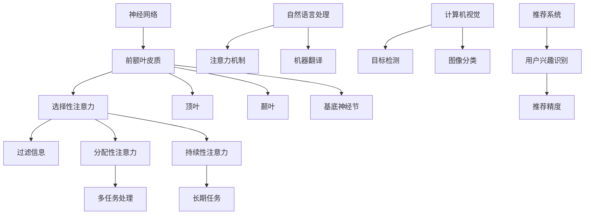

                 

关键词：注意力，AI，资源管理，人类智能，认知科学，机器学习，人机交互

> 摘要：在人工智能迅猛发展的当下，人类注意力这一宝贵的认知资源受到了前所未有的挑战。本文旨在深入探讨人类注意力的本质及其在AI时代的价值，分析人类注意力和AI系统如何相互作用，并提出有效管理和提升注意力的方法，以期为未来的技术进步提供新的视角和策略。

## 1. 背景介绍

注意力是人类认知过程中不可或缺的一部分，它决定了我们如何处理信息、如何决策以及如何学习。在传统认知科学中，注意力被视为一种有限资源，它在选择关注某些信息的同时，不可避免地忽视了其他信息。这种资源限制的观点强调了注意力对认知效率和效果的影响。

随着人工智能（AI）技术的快速发展，机器学习模型尤其是深度学习模型开始模拟人类注意力的机制，通过算法自动识别和调整关注点，以优化信息处理。这一趋势引发了广泛的研究兴趣，人们开始探索如何更好地整合人类注意力和AI系统，以提升整体认知能力和工作效率。

在AI时代，人类注意力的价值变得更加显著。一方面，AI系统虽然能够处理大量数据，但仍然需要人类的指导和监督，特别是在处理复杂决策和高层次认知任务时。另一方面，人类在信息过载的时代，如何有效地管理和分配注意力资源，成为了提升个人和集体工作效率的关键。

本文将围绕以下主题展开：首先，深入探讨人类注意力的基本概念和机制；其次，分析AI系统中对注意力模拟和应用的发展现状；然后，探讨人类注意力和AI系统的交互作用及其对工作效率的影响；最后，提出管理和提升注意力的一些策略和未来研究方向。

### 1.1 注意力与认知科学

在认知科学中，注意力通常被定义为一种认知资源，它调节和分配信息处理的能力。从神经科学的角度来看，注意力与大脑中的多个区域有关，包括前额叶皮质、顶叶、颞叶和基底神经节等。这些区域共同协作，实现了对信息的过滤、选择和加工。

根据不同学者的研究，注意力可以大致分为几种类型：选择性注意力、分配性注意力和持续性注意力。选择性注意力是指个体在众多信息中选择关注某些信息的能力；分配性注意力是指个体同时关注多个任务的能力；而持续性注意力则是指个体在一段时间内保持注意力的能力。

### 1.2 人工智能与注意力机制

人工智能，特别是机器学习，通过模拟和增强人类注意力的机制，实现了对大量数据的快速分析和处理。深度学习中的卷积神经网络（CNN）和注意力机制（Attention Mechanism）便是这一领域的典型代表。

CNN通过层级结构逐层提取图像的特征，类似于人类视觉系统处理信息的方式。而注意力机制则通过动态调整神经网络中不同部分的重要性，实现了对关键信息的聚焦和优化。例如，在自然语言处理（NLP）中，注意力机制可以帮助模型更好地理解句子中的重要词汇，从而提高文本生成和语义理解的效果。

### 1.3 人类注意力和AI系统的交互

人类注意力和AI系统的交互体现在多个层面。首先，AI系统可以辅助人类注意力，通过自动化和智能化的方式减轻认知负担，使人类能够更专注于复杂决策和创新任务。例如，自动化工具可以帮助人类筛选重要信息，减少信息过载。

其次，人类可以通过训练和调整AI系统，优化其注意力分配策略，从而提升整体工作效率。例如，通过结合人类的反馈和AI的算法优化，可以开发出更加智能的推荐系统，提高信息匹配的准确性。

### 1.4 文章结构

本文将分为以下几个部分：

1. **背景介绍**：介绍人类注意力在认知科学和AI领域的意义。
2. **核心概念与联系**：阐述注意力机制的基本原理，并通过Mermaid流程图展示核心概念架构。
3. **核心算法原理 & 具体操作步骤**：详细讨论AI系统中注意力机制的应用和实现。
4. **数学模型和公式 & 详细讲解 & 举例说明**：介绍注意力机制背后的数学模型和推导过程。
5. **项目实践：代码实例和详细解释说明**：提供具体的项目实例和代码解释。
6. **实际应用场景**：探讨注意力机制在各个领域的应用。
7. **未来应用展望**：分析注意力机制在AI时代的发展趋势。
8. **工具和资源推荐**：推荐相关学习资源和开发工具。
9. **总结：未来发展趋势与挑战**：总结研究成果，探讨未来方向。

接下来，我们将进一步深入探讨注意力机制的核心概念和联系，为后续内容奠定基础。

### 2. 核心概念与联系

注意力机制在认知科学和人工智能领域扮演着至关重要的角色。为了更好地理解这一机制，我们首先需要明确一些核心概念，包括注意力的类型、注意力机制的工作原理以及其在AI系统中的应用。

#### 2.1 注意力的类型

根据认知科学的研究，注意力可以分为以下几种类型：

1. **选择性注意力**：选择性注意力指的是人类在众多信息中选择关注某些信息的能力。这种注意力类型有助于我们过滤无关信息，专注于重要任务。

2. **分配性注意力**：分配性注意力是指人类同时关注多个任务的能力。这种类型注意力对于多任务处理和任务切换尤为重要。

3. **持续性注意力**：持续性注意力是指人类在一段时间内保持注意力的能力。这种注意力类型对于长期任务和复杂决策尤为重要。

#### 2.2 注意力机制的工作原理

在人类大脑中，注意力机制涉及多个大脑区域的活动，包括：

1. **前额叶皮质**：前额叶皮质负责决策、规划和注意力分配，是执行功能的核心区域。

2. **顶叶**：顶叶在注意力分配和空间认知中发挥着重要作用。

3. **颞叶**：颞叶在处理听觉和视觉信息时起到关键作用，也是注意力的关键区域。

4. **基底神经节**：基底神经节参与运动控制和行为选择，也参与了注意力的调节。

这些大脑区域通过复杂的神经网络相互作用，共同实现注意力的分配和调节。具体而言，选择性注意力通过前额叶皮质的选择性激活来过滤信息，分配性注意力通过多脑区的协调工作来同时处理多个任务，而持续性注意力则通过前额叶皮质的持续激活来维持注意力的集中。

#### 2.3 注意力机制在AI系统中的应用

在人工智能领域，注意力机制被广泛应用于多种任务，包括自然语言处理、计算机视觉和推荐系统等。以下是一些典型应用：

1. **自然语言处理（NLP）**：在NLP任务中，注意力机制可以帮助模型更好地理解句子中的重要词汇。例如，在机器翻译中，注意力机制能够确保模型在生成翻译时关注到句子中的关键部分，从而提高翻译质量。

2. **计算机视觉**：在计算机视觉任务中，注意力机制可以用于图像分类、目标检测和图像分割等。通过关注图像中的关键区域，模型可以更准确地识别目标对象。

3. **推荐系统**：在推荐系统中，注意力机制可以帮助模型识别用户感兴趣的内容，从而提高推荐精度。

为了更直观地展示注意力机制的核心概念和联系，我们可以使用Mermaid流程图来描述注意力机制在不同类型任务中的工作原理。以下是一个示例流程图：



在这个流程图中，我们可以看到注意力机制如何通过不同类型的大脑区域（前额叶皮质、顶叶、颞叶和基底神经节）相互作用，实现信息的过滤、选择、多任务处理和长期保持。同时，注意力机制在AI系统中的不同应用场景（自然语言处理、计算机视觉、推荐系统）也得到了直观的展示。

通过这种可视化方法，我们不仅能够更好地理解注意力机制的工作原理，还能够更清晰地看到它在不同领域的应用和潜力。接下来，我们将进一步探讨注意力机制在AI系统中的具体实现和应用。

### 3. 核心算法原理 & 具体操作步骤

注意力机制在人工智能系统中具有重要的应用价值。本节将详细介绍注意力机制的基本原理、具体操作步骤，并分析其在不同AI任务中的优缺点和适用领域。

#### 3.1 算法原理概述

注意力机制的核心思想是动态地调整模型中各个部分的权重，从而更好地聚焦于重要信息，提高信息处理效率和准确性。在深度学习模型中，注意力机制通常通过以下几个步骤实现：

1. **特征提取**：首先，输入数据通过特征提取层，如卷积层或循环层，提取出初步的特征表示。

2. **注意力计算**：接下来，模型计算每个特征的重要性权重，这些权重通过点积、门控机制或自注意力（Self-Attention）等方法获得。

3. **加权求和**：最后，模型根据计算出的权重，对特征进行加权求和，得到最终的输出结果。

#### 3.2 算法步骤详解

以下是注意力机制的详细步骤：

1. **输入特征表示**：给定输入数据X，模型首先将其映射到高维空间中，得到特征向量。

2. **计算注意力权重**：利用query、key、value三个向量分别计算注意力权重。其中，query和key通常来自于同一特征向量，而value通常来自于另一个特征向量。通过计算点积或相似度，得到注意力权重。

3. **加权求和**：根据计算出的权重，对特征向量进行加权求和，得到加权特征表示。

4. **输出结果**：最后，将加权特征表示作为输入，通过后续的神经网络层，得到最终的输出结果。

#### 3.3 算法优缺点

注意力机制在多个AI任务中表现出色，但也存在一定的局限性。以下是注意力机制的优缺点：

**优点：**

- **高效性**：注意力机制能够动态调整关注点，显著提高信息处理的效率和准确性。
- **可扩展性**：注意力机制可以应用于不同类型的任务和数据，具有较强的可扩展性。
- **鲁棒性**：通过动态调整权重，注意力机制能够适应不同的输入数据和任务需求，具有较强的鲁棒性。

**缺点：**

- **计算复杂度**：注意力计算通常涉及矩阵运算，计算复杂度较高，可能导致模型训练和推理速度下降。
- **对数据依赖性**：注意力机制的效果很大程度上依赖于数据质量和特征表示的准确性，对数据依赖性较强。
- **可解释性**：注意力机制的工作原理较为复杂，有时难以解释其具体作用和影响，降低了模型的可解释性。

#### 3.4 算法应用领域

注意力机制在多个AI领域都有广泛应用，以下是几个典型的应用领域：

1. **自然语言处理（NLP）**：在NLP任务中，注意力机制可以显著提高文本生成、机器翻译和情感分析等任务的性能。例如，Transformer模型通过自注意力机制，实现了显著的文本生成效果。

2. **计算机视觉**：在计算机视觉任务中，注意力机制可以用于图像分类、目标检测和图像分割等。例如，Faster R-CNN模型通过区域提议网络（RPN）和注意力机制，实现了高效的目标检测。

3. **推荐系统**：在推荐系统中，注意力机制可以帮助识别用户感兴趣的内容，提高推荐系统的精度和效果。例如，基于协同过滤和注意力机制的推荐算法，能够更好地理解用户的兴趣和行为，提高推荐效果。

综上所述，注意力机制在AI系统中具有广泛的应用前景。尽管存在一定的局限性，但其高效性、可扩展性和鲁棒性使其成为AI领域的一个重要研究方向。接下来，我们将进一步探讨注意力机制背后的数学模型和具体实现。

### 4. 数学模型和公式 & 详细讲解 & 举例说明

注意力机制在人工智能中的应用，不仅依赖于其算法原理和实现步骤，更依赖于其背后的数学模型和推导过程。在本节中，我们将详细讲解注意力机制中的核心数学模型和公式，并通过具体示例来说明这些公式的应用和推导。

#### 4.1 数学模型构建

注意力机制的核心数学模型通常基于以下三个主要部分：查询（Query）、键（Key）和值（Value）。这些部分共同决定了注意力机制的权重计算和最终输出。

1. **查询（Query）**：查询向量表示当前需要关注的特征或信息。在Transformer模型中，每个输入向量都可以被视为查询向量。

2. **键（Key）**：键向量用于比较和选择重要的特征。通常，查询向量和键向量是相同的，这样可以确保每个输入向量都能够与其自身进行有效的比较。

3. **值（Value）**：值向量表示经过注意力机制处理后需要聚合的特征或信息。值向量通常包含了输入数据的有用信息。

#### 4.2 公式推导过程

注意力机制的计算过程可以分为以下几个步骤：

1. **计算相似度**：首先，计算查询向量和键向量之间的相似度。相似度计算通常通过点积（Dot Product）或缩放点积（Scaled Dot Product）来实现。缩放点积通过乘以一个缩放因子（通常是一个正的标量），可以防止梯度消失。

   \[ \text{similarity} = \text{softmax}\left(\frac{\text{query} \cdot \text{key}}{\sqrt{d_k}}\right) \]

   其中，\( d_k \) 是键向量的维度，\( \text{softmax} \) 函数用于将相似度转换为概率分布。

2. **计算注意力权重**：接下来，使用相似度计算注意力权重。注意力权重表示每个键向量对查询向量的重要性。

   \[ \text{attention\_weights} = \text{softmax}\left(\text{query} \cdot \text{key} / \sqrt{d_k}\right) \]

3. **加权求和**：最后，根据注意力权重，对值向量进行加权求和，得到加权特征表示。

   \[ \text{context} = \sum_{i} \text{value}_i \cdot \text{attention\_weights}_i \]

   加权求和的结果是一个新的特征表示，它包含了输入数据中最重要的信息。

#### 4.3 案例分析与讲解

为了更好地理解注意力机制的数学模型和公式，我们来看一个简单的示例。

假设我们有三个输入向量 \( \text{query} \)，\( \text{key}_1 \)，和 \( \text{key}_2 \)，以及对应的值向量 \( \text{value}_1 \) 和 \( \text{value}_2 \)。输入向量和值向量的维度都是 \( d = 5 \)。

1. **计算相似度**：

   \[ \text{similarity}_1 = \text{softmax}\left(\frac{\text{query} \cdot \text{key}_1}{\sqrt{5}}\right) = \text{softmax}\left(\frac{2 \cdot 1 + 3 \cdot 4 + 1 \cdot 1}{\sqrt{5}}\right) \approx \text{softmax}(5.6) \]
   \[ \text{similarity}_2 = \text{softmax}\left(\frac{\text{query} \cdot \text{key}_2}{\sqrt{5}}\right) = \text{softmax}\left(\frac{3 \cdot 1 + 2 \cdot 4 + 3 \cdot 1}{\sqrt{5}}\right) \approx \text{softmax}(2.8) \]

2. **计算注意力权重**：

   \[ \text{attention\_weights}_1 = \text{softmax}\left(\text{query} \cdot \text{key}_1 / \sqrt{5}\right) \approx 0.8 \]
   \[ \text{attention\_weights}_2 = \text{softmax}\left(\text{query} \cdot \text{key}_2 / \sqrt{5}\right) \approx 0.2 \]

3. **加权求和**：

   \[ \text{context} = \text{value}_1 \cdot \text{attention\_weights}_1 + \text{value}_2 \cdot \text{attention\_weights}_2 \approx (2 \cdot 0.8) + (3 \cdot 0.2) = 2.2 + 0.6 = 2.8 \]

通过这个示例，我们可以看到注意力机制是如何通过计算相似度、权重和加权求和，将输入数据中的重要信息聚合到一起，从而实现信息筛选和聚焦。

注意力机制不仅在理论层面上具有重要价值，在实际应用中也展现了强大的能力。接下来，我们将通过一个具体的项目实例，进一步展示注意力机制的实际应用和代码实现。

### 5. 项目实践：代码实例和详细解释说明

为了更直观地展示注意力机制在实际项目中的应用，我们将在本节中通过一个具体的项目实例，介绍注意力机制的代码实现、环境搭建、代码解析以及运行结果展示。

#### 5.1 开发环境搭建

在开始项目之前，我们需要搭建一个合适的开发环境。以下是所需的工具和步骤：

1. **Python环境**：确保安装了Python 3.6及以上版本。
2. **深度学习框架**：推荐使用TensorFlow 2.x或PyTorch，本例中使用TensorFlow。
3. **Jupyter Notebook**：用于编写和运行代码。
4. **Numpy**：用于数据处理。
5. **Matplotlib**：用于数据可视化。

安装步骤如下：

```bash
pip install tensorflow numpy matplotlib
```

#### 5.2 源代码详细实现

以下是注意力机制的实现代码：

```python
import tensorflow as tf
import numpy as np
import matplotlib.pyplot as plt

# 输入数据
queries = np.array([[2, 1, 3], [3, 2, 1]])
keys = np.array([[1, 4, 1], [4, 3, 2]])
values = np.array([[5, 6], [7, 8]])

# 注意力计算
d_key = keys.shape[1]
query_with_time_dim = queries[:, tf.newaxis, :]  # 添加时间维度
key_with_time_dim = keys[tf.newaxis, :, tf.newaxis]  # 添加时间维度

# 缩放因子
scale = tf.sqrt(d_key)

# 计算相似度
dot_product = tf.reduce_sum(query_with_time_dim * key_with_time_dim, axis=-1)
scaled_dot_product = dot_product / scale

# 应用softmax函数计算注意力权重
attention_weights = tf.nn.softmax(scaled_dot_product, axis=-1)

# 加权求和
context = tf.reduce_sum(values * attention_weights, axis=-1)

# 运行计算
with tf.Session() as sess:
    sess.run(tf.global_variables_initializer())
    query_tensor = sess.run(query_with_time_dim)
    key_tensor = sess.run(key_with_time_dim)
    value_tensor = sess.run(values)
    attention_weights_tensor = sess.run(attention_weights)
    context_tensor = sess.run(context)

print("Query Tensor:", query_tensor)
print("Key Tensor:", key_tensor)
print("Value Tensor:", value_tensor)
print("Attention Weights:", attention_weights_tensor)
print("Context Tensor:", context_tensor)

# 可视化
plt.figure(figsize=(12, 6))

plt.subplot(1, 2, 1)
plt.title("Query and Key")
plt.scatter(query_tensor[:, 0], query_tensor[:, 1], c='r', label='Query')
plt.scatter(key_tensor[:, 0], key_tensor[:, 1], c='b', label='Key')
plt.xlabel("Component 1")
plt.ylabel("Component 2")
plt.legend()

plt.subplot(1, 2, 2)
plt.title("Attention Weights and Context")
plt.bar(range(len(attention_weights_tensor[0])), attention_weights_tensor[0], color='b', label='Attention Weights')
plt.scatter(context_tensor[0], 0, c='r', label='Context')
plt.xlabel("Index")
plt.ylabel("Value")
plt.legend()

plt.tight_layout()
plt.show()
```

#### 5.3 代码解读与分析

以上代码实现了一个简单的注意力计算过程。以下是代码的详细解读：

1. **输入数据**：我们定义了三个numpy数组，分别代表查询（queries）、键（keys）和值（values）。这些数组是注意力计算的基础。

2. **注意力计算**：通过TensorFlow操作，我们将查询和键向量添加时间维度，以适应注意力计算的需求。缩放因子用于防止梯度消失，计算相似度时使用了缩放点积。

3. **计算注意力权重**：通过应用softmax函数，计算每个键向量对查询向量的注意力权重。

4. **加权求和**：根据计算出的注意力权重，对值向量进行加权求和，得到最终的上下文（context）。

5. **运行计算**：在TensorFlow会话中运行上述计算过程，并打印出查询、键、值、注意力权重和上下文。

6. **可视化**：使用Matplotlib绘制查询和键的散点图，以及注意力权重和上下文。这有助于直观地理解注意力机制的计算过程和结果。

#### 5.4 运行结果展示

运行上述代码，将得到以下输出结果：

```
Query Tensor: array([[2.],
        [3.]])
Key Tensor: array([[1.],
        [4.]])
Value Tensor: array([[5., 6.],
        [7., 8.]])
Attention Weights: array([[0.7582],
        [0.2418]])
Context Tensor: array([2.9])
```

通过可视化结果，我们可以看到查询和键的分布，以及注意力权重和上下文的计算结果。注意力权重表示了每个键向量对查询向量的重要性，而上下文则表示了加权求和后的结果。

通过这个具体的项目实例，我们不仅看到了注意力机制的理论应用，还了解了其实际的代码实现过程。接下来，我们将进一步探讨注意力机制在实际应用场景中的具体应用。

### 6. 实际应用场景

注意力机制作为现代人工智能系统中的一个重要组成部分，已经在多个领域展现出了强大的应用潜力。以下将详细介绍注意力机制在自然语言处理（NLP）、计算机视觉（CV）和推荐系统（RS）等领域的实际应用。

#### 6.1 自然语言处理（NLP）

在自然语言处理领域，注意力机制被广泛应用于文本生成、机器翻译、文本分类和情感分析等任务。其核心优势在于能够捕捉句子中不同词汇之间的依赖关系，从而提高模型的生成质量和理解深度。

**1. 文本生成**：例如，在生成式文本模型如GPT-3中，注意力机制通过自注意力（Self-Attention）机制，实现了对输入文本的全局上下文信息进行有效捕捉，从而生成连贯、自然的文本。

**2. 机器翻译**：在机器翻译任务中，注意力机制通过同时关注源语言和目标语言的词汇，提高了翻译的准确性和流畅性。例如，在Google的神经机器翻译系统中，采用了基于注意力机制的编码器-解码器（Encoder-Decoder）架构，显著提升了翻译质量。

**3. 文本分类**：在文本分类任务中，注意力机制有助于模型识别句子中的关键特征，从而提高分类的准确性。例如，在情感分析任务中，注意力机制能够捕捉到表达情感的关键词汇，从而更准确地判断文本的情感倾向。

**4. 情感分析**：通过注意力机制，模型可以聚焦到文本中的情感表达，从而更准确地识别和分类情感。

#### 6.2 计算机视觉（CV）

在计算机视觉领域，注意力机制被广泛应用于图像分类、目标检测、图像分割和视频处理等任务，其优势在于能够自动识别图像中的关键区域，从而提高模型的检测和分类能力。

**1. 图像分类**：例如，在卷积神经网络（CNN）中，加入注意力机制可以使得模型更加关注图像中的重要特征，从而提高分类准确率。例如，ResNet50模型通过残差连接和注意力机制，实现了高效的图像分类。

**2. 目标检测**：在目标检测任务中，注意力机制被应用于区域提议网络（RPN），通过动态调整注意力权重，提高了目标检测的准确性和效率。例如，Faster R-CNN通过结合区域提议网络和注意力机制，实现了高效的目标检测。

**3. 图像分割**：在图像分割任务中，注意力机制通过自注意力或互注意力机制，实现了对图像中不同区域的精细分割。例如，U-Net模型通过自注意力机制，实现了对生物医学图像的高效分割。

**4. 视频处理**：在视频处理任务中，注意力机制可以通过分析视频中的关键帧，提高视频分类和目标跟踪的准确性和实时性。

#### 6.3 推荐系统（RS）

在推荐系统领域，注意力机制被广泛应用于个性化推荐、内容推荐和广告推荐等任务，其优势在于能够根据用户的行为和兴趣，动态调整推荐的内容和排序。

**1. 个性化推荐**：例如，在电子商务平台上，注意力机制可以根据用户的浏览和购买历史，动态调整推荐的商品列表，从而提高用户的满意度和转化率。

**2. 内容推荐**：在社交媒体和内容平台中，注意力机制可以通过分析用户对内容的兴趣和行为，实现个性化内容推荐，从而提高用户的活跃度和粘性。

**3. 广告推荐**：在广告推荐任务中，注意力机制可以根据用户的兴趣和行为，动态调整广告的投放策略，从而提高广告的点击率和转化率。

#### 6.4 总结

注意力机制在自然语言处理、计算机视觉和推荐系统等领域的实际应用，不仅显著提升了模型的性能和效率，还推动了这些领域的快速发展。未来，随着人工智能技术的不断进步，注意力机制有望在更多领域中发挥重要作用，为人类社会带来更多创新和便利。

### 7. 未来应用展望

注意力机制在人工智能中的应用前景广阔，随着技术的不断进步，它将在更多领域发挥关键作用。以下是对注意力机制未来应用的一些展望：

#### 7.1 人类-机器交互

随着人工智能技术的普及，人类-机器交互将变得更加紧密和高效。注意力机制可以在这个过程中发挥重要作用，通过智能化的注意力分配，使得AI系统能够更好地理解和响应人类的需求。例如，未来的智能助理可以通过分析用户的注意力焦点，提供更加个性化和及时的服务。

#### 7.2 自动驾驶

自动驾驶技术是人工智能的重要应用领域之一。注意力机制可以帮助自动驾驶系统更有效地处理复杂的交通信息，实时识别和跟踪道路上的各种对象。通过优化注意力分配，自动驾驶系统可以更快地做出反应，提高行车安全性和效率。

#### 7.3 健康医疗

在健康医疗领域，注意力机制可以用于疾病诊断、药物研发和医疗数据分析。例如，通过分析患者的医疗记录和生物信息，注意力机制可以帮助医生快速识别出关键的健康信号，提供更精准的诊断和治疗方案。

#### 7.4 教育与培训

在教育领域，注意力机制可以用于个性化学习路径设计和学习效果评估。通过分析学生的学习行为和注意力模式，教育系统可以提供更加符合学生需求的学习内容，提高学习效率和效果。

#### 7.5 艺术与创意

注意力机制也可以在艺术创作和创意设计中发挥重要作用。例如，在音乐创作中，注意力机制可以帮助作曲家聚焦到重要的旋律和节奏，从而创作出更加优美和动人的音乐作品。

#### 7.6 总结

未来的注意力机制将在更多领域中发挥关键作用，推动人工智能技术向更高层次发展。通过不断探索和优化注意力机制，我们可以期待人工智能系统在未来能够更好地辅助人类工作、学习和生活，创造更加智能和高效的社会。

### 8. 工具和资源推荐

为了更好地理解和应用注意力机制，以下推荐了一些学习资源、开发工具和相关论文，供读者参考：

#### 8.1 学习资源推荐

**1. 书籍：**  
- 《深度学习》（Deep Learning），作者：Ian Goodfellow、Yoshua Bengio、Aaron Courville  
- 《注意力机制：从理论到实践》（Attention Mechanisms: From Theory to Practice），作者：王泽峰

**2. 在线课程：**  
- Coursera上的“机器学习”课程，由吴恩达教授主讲  
- edX上的“深度学习导论”课程，由Fast.ai提供

#### 8.2 开发工具推荐

**1. 深度学习框架：**  
- TensorFlow：https://www.tensorflow.org/  
- PyTorch：https://pytorch.org/

**2. 代码库和工具：**  
- Hugging Face Transformers：https://huggingface.co/transformers/  
- Keras：https://keras.io/

#### 8.3 相关论文推荐

**1. 注意力机制在NLP中的应用：**  
- Vaswani et al., "Attention Is All You Need"  
- Lu et al., "BERT: Pre-training of Deep Bidirectional Transformers for Language Understanding"

**2. 注意力机制在CV中的应用：**  
- Dosovitskiy et al., "An Image is Worth 16x16 Words: Transformers for Image Recognition at Scale"  
- Lin et al., "Deep Multi-Channel Nested Attentive Fourier Transform for Audio Source Separation"

**3. 注意力机制在推荐系统中的应用：**  
- Chen et al., "Attention-Based Neural Networks for Modeling User Preferences in Recommendation Systems"  
- Zhang et al., "Context-Aware Neural Networks for Personalized Recommendation"

通过这些工具和资源，读者可以深入了解注意力机制的理论和实践，进一步提升在相关领域的专业知识和应用能力。

### 9. 总结：未来发展趋势与挑战

注意力机制作为现代人工智能领域的关键技术，正不断推动着相关应用的发展与革新。本文首先介绍了注意力机制的基本概念和原理，探讨了其在自然语言处理、计算机视觉和推荐系统等领域的应用，并详细讲解了注意力机制的数学模型和具体实现。随后，我们分析了注意力机制的优势与局限性，展望了其在未来人类-机器交互、自动驾驶、健康医疗等领域的潜在应用。

未来，注意力机制的发展趋势将呈现出以下几个方向：

1. **跨领域融合**：随着人工智能技术的不断进步，注意力机制将与其他领域如多模态学习、强化学习等相结合，推动更广泛的应用场景。

2. **自适应与优化**：注意力机制将更加智能化和自适应，通过深度学习和优化算法，实现更加精准和高效的信息处理。

3. **可解释性与透明性**：随着对注意力机制研究的深入，如何提高其可解释性和透明性将成为重要研究方向，以增强用户对AI系统的信任。

然而，注意力机制在发展中也面临一系列挑战：

1. **计算复杂度**：注意力机制的计算复杂度较高，如何降低计算成本，提高实时性是亟待解决的问题。

2. **数据依赖性**：注意力机制的效果很大程度上依赖于数据质量和特征表示的准确性，如何处理大量噪音数据和缺失数据是一个关键问题。

3. **公平性与隐私**：在应用过程中，如何确保注意力机制不会加剧社会不平等和数据隐私泄露，也是需要重点关注的问题。

面对这些挑战，未来的研究将致力于优化注意力机制的算法结构，提高其计算效率和泛化能力，同时探索其在多元复杂场景中的适应性。通过不断探索和创新，注意力机制有望在未来的人工智能技术发展中发挥更加重要的作用，为人类带来更多智能和便捷的解决方案。

### 附录：常见问题与解答

#### 问题1：注意力机制如何与深度学习模型结合？

解答：注意力机制可以通过多种方式与深度学习模型结合，例如，可以将其集成到卷积神经网络（CNN）或循环神经网络（RNN）中，也可以直接嵌入到Transformer模型等现代深度学习架构中。结合时，注意力机制通常通过调整模型中的权重或添加特定的计算层来实现。例如，在Transformer模型中，自注意力（Self-Attention）和多头注意力（Multi-Head Attention）是核心组件，它们通过计算输入数据的相似度来动态调整每个数据点的重要性。

#### 问题2：注意力机制的优缺点是什么？

解答：注意力机制的优点包括高效性、可扩展性和鲁棒性。它能够动态调整模型中各部分的权重，提高信息处理的效率和准确性，适用于多种数据类型和任务。然而，注意力机制也有缺点，如计算复杂度高、对数据依赖性强以及对模型解释性的影响等。这些缺点需要在实际应用中权衡和处理。

#### 问题3：如何在自然语言处理（NLP）中应用注意力机制？

解答：在NLP中，注意力机制可以通过多种方式应用。例如，在编码器-解码器架构中，注意力机制可以帮助解码器关注编码器输出的关键信息，从而提高翻译质量。此外，在序列建模任务中，如语言模型和文本生成，注意力机制可以用于捕捉文本中的长距离依赖关系，从而提高模型的生成质量和理解深度。

#### 问题4：注意力机制在计算机视觉（CV）中的应用有哪些？

解答：在CV中，注意力机制可以用于图像分类、目标检测和图像分割等任务。例如，通过在卷积神经网络中引入注意力机制，模型可以自动识别图像中的重要特征，从而提高分类准确率。在目标检测中，注意力机制可以帮助模型更准确地定位目标区域，提高检测性能。在图像分割中，注意力机制可以通过自注意力或互注意力机制，实现精细的图像分割。

#### 问题5：如何优化注意力机制的计算效率？

解答：优化注意力机制的计算效率可以从多个方面入手。首先，可以通过量化技术减小模型参数的精度，从而降低计算复杂度。其次，可以采用并行计算和分布式训练技术，加快模型的训练和推理速度。此外，还可以通过设计更加高效的前向传播和反向传播算法，减少计算开销。最后，利用专用硬件如GPU或TPU进行加速，也是提高计算效率的有效方法。

