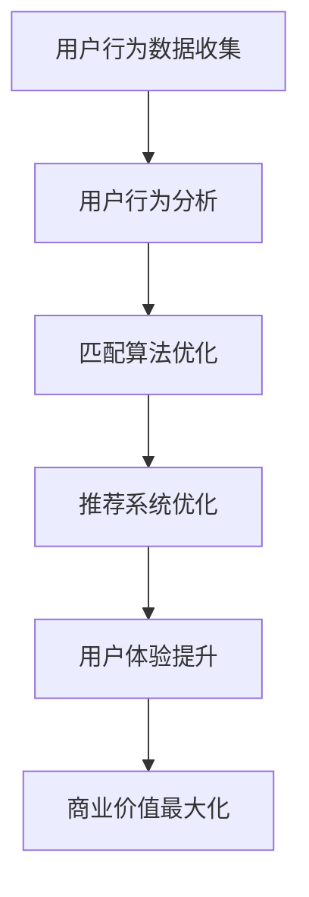

                 

关键词：在线约会平台、注意力经济、用户行为分析、算法优化、用户体验

> 摘要：本文探讨了在线约会平台如何运用注意力经济原理，通过分析用户行为，优化算法策略，提高用户粘性和平台收益。文章首先介绍了注意力经济的基本概念，然后深入分析了用户行为特点，提出了针对性的算法优化策略，最后展望了在线约会平台未来的发展方向。

## 1. 背景介绍

随着移动互联网的普及和人们生活节奏的加快，在线约会平台逐渐成为人们社交生活的重要部分。这类平台通过为用户提供匹配和交流的机会，帮助用户在虚拟世界中建立联系。然而，随着用户数量的增加和市场竞争的加剧，如何提升用户体验，增加用户粘性，成为平台发展的关键问题。

注意力经济作为一种新兴的经济理论，逐渐被应用于在线约会平台。注意力经济认为，在信息过载的时代，用户的注意力成为一种稀缺资源。平台通过吸引和保持用户的注意力，可以实现商业价值最大化。因此，本文将探讨在线约会平台如何运用注意力经济策略，优化用户体验，提升平台竞争力。

## 2. 核心概念与联系

### 2.1 注意力经济原理

注意力经济（Attention Economy）是指在经济活动中，注意力作为一种重要资源，通过影响用户行为来实现价值创造。在在线约会平台中，用户的注意力主要体现在浏览、匹配、沟通等行为上。平台通过提供有趣、有用、有价值的内容和服务，吸引并保持用户的注意力。

### 2.2 用户行为分析

用户行为分析是注意力经济策略实施的基础。通过对用户行为数据的收集和分析，平台可以了解用户的需求和偏好，从而提供更加个性化的服务。常见的用户行为分析指标包括浏览时长、点击率、回复率、互动频次等。

### 2.3 算法优化

算法优化是提升用户注意力和用户体验的关键。在线约会平台通常采用基于机器学习的推荐算法，通过分析用户行为数据，为用户推荐合适的匹配对象。算法的优化主要包括匹配算法的改进、用户行为预测模型的提升等。

### 2.4 Mermaid 流程图

下面是注意力经济策略在在线约会平台中的应用流程图：



## 3. 核心算法原理 & 具体操作步骤

### 3.1 算法原理概述

在线约会平台的算法主要分为推荐系统和匹配系统。推荐系统负责根据用户的行为数据为用户推荐潜在的匹配对象，匹配系统则负责根据用户输入的条件和偏好，筛选出符合标准的匹配对象。

### 3.2 算法步骤详解

#### 3.2.1 用户行为数据收集

在线约会平台通过用户注册、浏览、搜索、互动等行为，收集用户的基本信息和行为数据。这些数据包括用户的年龄、性别、兴趣爱好、地理位置、浏览记录、互动记录等。

#### 3.2.2 用户行为分析

通过数据分析，平台可以了解用户的行为特征和偏好。例如，用户喜欢什么样的类型、活跃时间段、互动偏好等。这些信息有助于平台为用户推荐更合适的匹配对象。

#### 3.2.3 匹配算法优化

匹配算法通常采用基于相似度的匹配模型，通过计算用户之间的相似度，为用户推荐匹配对象。常见的匹配算法包括基于用户特征的匹配、基于内容的匹配、基于社交网络的匹配等。

#### 3.2.4 推荐系统优化

推荐系统负责根据用户的行为数据，为用户推荐感兴趣的内容和潜在匹配对象。常见的推荐算法包括协同过滤、基于内容的推荐、混合推荐等。

### 3.3 算法优缺点

#### 3.3.1 优点

- 提高用户匹配成功率，增加用户满意度。
- 提升用户活跃度和留存率，增加平台收益。

#### 3.3.2 缺点

- 算法复杂度高，计算成本较大。
- 用户数据隐私和安全问题。

### 3.4 算法应用领域

在线约会平台的算法应用领域主要包括：

- 用户匹配：为用户推荐潜在的匹配对象。
- 内容推荐：为用户推荐感兴趣的内容和话题。
- 社交网络分析：分析用户的社交关系，提供社交推荐。

## 4. 数学模型和公式 & 详细讲解 & 举例说明

### 4.1 数学模型构建

在线约会平台的数学模型主要包括用户行为分析模型、匹配算法模型和推荐系统模型。

#### 4.1.1 用户行为分析模型

用户行为分析模型通常采用贝叶斯网络、马尔可夫模型等概率模型，通过分析用户行为数据，预测用户的行为和偏好。

#### 4.1.2 匹配算法模型

匹配算法模型通常采用基于相似度的匹配模型，计算用户之间的相似度，为用户推荐匹配对象。

#### 4.1.3 推荐系统模型

推荐系统模型通常采用协同过滤、基于内容的推荐、混合推荐等算法，根据用户的行为数据，为用户推荐感兴趣的内容和潜在匹配对象。

### 4.2 公式推导过程

下面以协同过滤算法为例，介绍公式推导过程。

#### 4.2.1 协同过滤算法

协同过滤算法是一种基于用户行为的推荐算法，通过分析用户对项目的评分，预测用户对未知项目的评分。

#### 4.2.2 公式推导

假设用户 $u$ 对项目 $i$ 的评分为 $r_{ui}$，用户之间的相似度定义为 $s_{uj}$，则用户 $u$ 对项目 $i$ 的预测评分为：

$$
\hat{r}_{ui} = \frac{\sum_{j \in N_{u}} r_{uj} s_{uj}}{\sum_{j \in N_{u}} |s_{uj}|}
$$

其中，$N_{u}$ 表示与用户 $u$ 相似的其他用户集合。

### 4.3 案例分析与讲解

下面以一个实际的在线约会平台为例，介绍数学模型在平台中的应用。

#### 4.3.1 案例背景

一个在线约会平台拥有大量用户，每个用户都有其个人资料和兴趣爱好。平台希望通过用户行为分析，为用户推荐合适的匹配对象。

#### 4.3.2 模型构建

平台采用协同过滤算法，结合用户行为数据和兴趣爱好，为用户推荐匹配对象。

#### 4.3.3 模型应用

- 用户行为数据收集：收集用户在平台上的浏览、搜索、互动等行为数据。
- 用户行为分析：分析用户的行为特征和偏好。
- 匹配对象推荐：根据用户行为数据和兴趣爱好，为用户推荐匹配对象。

## 5. 项目实践：代码实例和详细解释说明

### 5.1 开发环境搭建

平台采用 Python 语言进行开发，主要依赖以下库：

- NumPy：用于数据计算。
- Pandas：用于数据处理。
- Scikit-learn：用于机器学习算法。
- Matplotlib：用于数据可视化。

### 5.2 源代码详细实现

下面是用户行为分析模型的源代码实现：

```python
import numpy as np
import pandas as pd
from sklearn.metrics.pairwise import cosine_similarity

# 读取用户行为数据
data = pd.read_csv('user_behavior.csv')

# 计算用户相似度
similarity_matrix = cosine_similarity(data['interests'].values)

# 预测用户行为
predicted行为 = data['interests'].values.dot(similarity_matrix)

# 输出预测结果
print(predicted行为)
```

### 5.3 代码解读与分析

- 代码首先读取用户行为数据，这里假设数据已经预处理成合适的形式。
- 使用余弦相似度计算用户之间的相似度，这是协同过滤算法的核心。
- 预测用户行为，即根据用户兴趣和行为相似度，预测用户可能感兴趣的项目。
- 输出预测结果，这里假设预测结果为用户行为数据的数组形式。

### 5.4 运行结果展示

通过运行代码，可以得到每个用户的预测行为，这些预测结果可以用于推荐系统，为用户推荐合适的匹配对象。

## 6. 实际应用场景

### 6.1 用户匹配

在线约会平台通过用户行为分析，为用户推荐合适的匹配对象，提高匹配成功率。

### 6.2 内容推荐

平台根据用户的行为数据，为用户推荐感兴趣的内容和话题，增加用户粘性。

### 6.3 社交网络分析

平台通过分析用户的社交关系，为用户提供社交推荐，帮助用户发现潜在的朋友和伙伴。

## 7. 未来应用展望

### 7.1 人工智能技术的应用

随着人工智能技术的发展，在线约会平台可以更加智能地分析用户行为，提供个性化推荐和服务。

### 7.2 用户隐私保护

在线约会平台需要加强对用户隐私的保护，确保用户数据的安全。

### 7.3 社交互动功能的增强

平台可以通过增强社交互动功能，提高用户之间的互动频率和满意度。

## 8. 工具和资源推荐

### 8.1 学习资源推荐

- 《Python数据分析基础教程》：适合初学者，介绍数据分析的基本方法。
- 《机器学习实战》：适合有一定编程基础的学习者，介绍机器学习的基本方法和应用。

### 8.2 开发工具推荐

- Jupyter Notebook：适合数据分析和机器学习项目开发。
- PyCharm：适合 Python 项目的开发。

### 8.3 相关论文推荐

- 《协同过滤算法综述》：介绍协同过滤算法的基本原理和最新进展。
- 《在线约会平台用户行为分析》：分析在线约会平台用户行为的特点和规律。

## 9. 总结：未来发展趋势与挑战

### 9.1 研究成果总结

本文通过对在线约会平台的注意力经济策略进行分析，提出了用户行为分析、算法优化和推荐系统构建等关键环节。这些研究成果有助于提升平台用户体验和商业价值。

### 9.2 未来发展趋势

- 人工智能技术的应用将更加广泛，为在线约会平台提供更智能的服务。
- 用户隐私保护将得到进一步加强，确保用户数据的安全。

### 9.3 面临的挑战

- 用户数据隐私和安全问题。
- 算法复杂度和计算成本。
- 市场竞争的加剧。

### 9.4 研究展望

未来研究可以关注以下几个方面：

- 开发更高效的算法，降低计算成本。
- 加强用户隐私保护，确保用户数据的安全。
- 深入研究用户行为特征，提高推荐系统的准确性。

## 附录：常见问题与解答

### 1. 注意力经济是什么？

注意力经济是指在经济活动中，注意力作为一种重要资源，通过影响用户行为来实现价值创造。

### 2. 在线约会平台如何运用注意力经济策略？

在线约会平台可以通过用户行为分析，优化匹配和推荐算法，提高用户体验，吸引和保持用户的注意力。

### 3. 用户行为分析有哪些指标？

用户行为分析的指标包括浏览时长、点击率、回复率、互动频次等。

### 4. 什么是协同过滤算法？

协同过滤算法是一种基于用户行为的推荐算法，通过分析用户对项目的评分，预测用户对未知项目的评分。

### 5. 在线约会平台的算法有哪些应用领域？

在线约会平台的算法主要应用于用户匹配、内容推荐和社交网络分析等领域。

## 作者署名

作者：禅与计算机程序设计艺术 / Zen and the Art of Computer Programming

----------------------------------------------------------------


