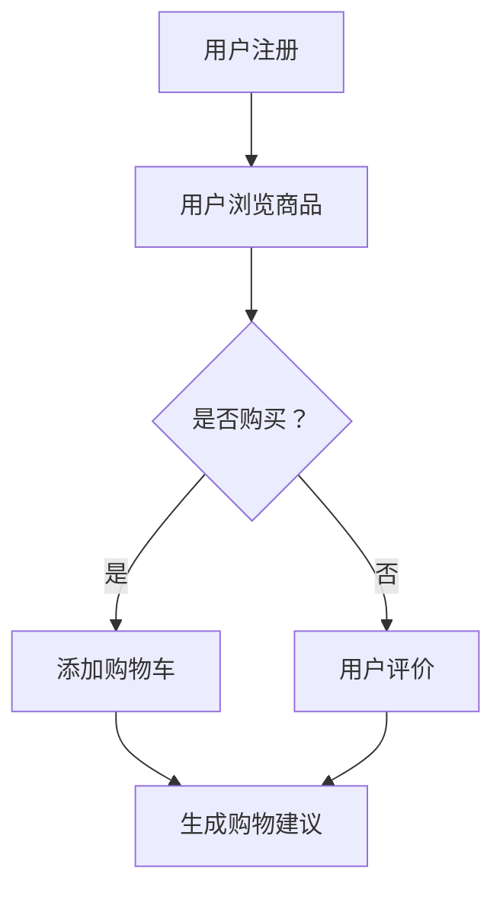

                 

关键词：在线购物、语言模型（LLM）、个性化推荐、购物体验、算法、数学模型

> 摘要：本文将探讨如何利用语言模型（LLM）来提升在线购物的个性化与效率。通过对在线购物流程的分析，本文提出了一种基于LLM的个性化购物推荐算法，并详细介绍了算法原理、数学模型及其实际应用。

## 1. 背景介绍

随着互联网技术的飞速发展，在线购物已经成为消费者生活中不可或缺的一部分。然而，在庞大的商品数据库中，如何为消费者提供个性化的购物体验，成为了各大电商平台亟待解决的问题。个性化推荐系统应运而生，旨在通过分析用户行为和偏好，为用户提供量身定制的购物建议。

近年来，语言模型（LLM）在自然语言处理领域取得了显著的成果，其在信息检索、问答系统和文本生成等方面表现出色。本文将探讨如何将LLM应用于在线购物推荐系统，为消费者提供更加高效、个性化的购物体验。

## 2. 核心概念与联系

### 2.1 在线购物流程

在线购物流程主要包括以下几个环节：用户注册、浏览商品、添加购物车、下单支付、订单跟踪等。其中，用户注册和浏览商品是获取用户信息的关键步骤。通过对用户行为的分析，我们可以挖掘出用户的兴趣和偏好，为后续的个性化推荐提供依据。

### 2.2 语言模型（LLM）

语言模型（LLM）是一种基于神经网络的技术，它可以学习并模拟人类的语言表达。在自然语言处理领域，LLM被广泛应用于文本生成、机器翻译、情感分析等任务。本文中，我们将利用LLM来分析用户的购物意图和需求，从而实现个性化推荐。

### 2.3 个性化推荐算法

个性化推荐算法是一种基于用户历史行为和偏好，为用户推荐符合其兴趣的物品的方法。本文提出了一种基于LLM的个性化推荐算法，通过分析用户在电商平台上的浏览、购买和评价行为，为用户生成个性化的购物建议。

### 2.4 Mermaid 流程图

以下是一个基于LLM的个性化购物推荐算法的Mermaid流程图：



## 3. 核心算法原理 & 具体操作步骤

### 3.1 算法原理概述

基于LLM的个性化购物推荐算法主要包括以下几个步骤：

1. 数据收集与预处理：收集用户在电商平台上的浏览、购买和评价数据，并进行预处理，如数据清洗、去重和标准化等。
2. 用户行为分析：利用LLM分析用户的历史行为，提取用户的兴趣和偏好。
3. 商品特征提取：为商品建立特征向量，如商品类别、价格、品牌等。
4. 推荐算法实现：基于用户兴趣和商品特征，为用户生成个性化的购物建议。
5. 推荐结果评估：评估推荐算法的性能，如准确率、召回率等。

### 3.2 算法步骤详解

#### 3.2.1 数据收集与预处理

数据收集与预处理是推荐系统的基础，具体步骤如下：

1. 数据收集：从电商平台获取用户浏览、购买和评价数据。
2. 数据清洗：去除无效数据和异常值，如缺失值、重复值等。
3. 数据标准化：将不同规模的数据进行归一化处理，如价格、评分等。

#### 3.2.2 用户行为分析

用户行为分析是提取用户兴趣和偏好关键步骤，具体方法如下：

1. 计算用户兴趣词：利用TF-IDF算法计算用户在浏览和评价过程中使用的词语的重要程度。
2. 提取用户兴趣领域：基于用户兴趣词，构建用户兴趣领域词表。
3. 用户兴趣模型构建：利用用户兴趣领域词表和LLM，构建用户兴趣模型。

#### 3.2.3 商品特征提取

商品特征提取是构建商品表示的关键步骤，具体方法如下：

1. 商品类别编码：将商品类别映射为整数编码。
2. 商品属性提取：提取商品属性，如价格、品牌、产地等。
3. 商品特征向量构建：将商品类别和属性映射为高维特征向量。

#### 3.2.4 推荐算法实现

基于用户兴趣模型和商品特征向量，我们可以利用协同过滤、基于内容的推荐等方法实现购物建议生成，具体步骤如下：

1. 用户兴趣向量计算：将用户兴趣领域词表映射为高维向量。
2. 商品兴趣度计算：计算用户对各个商品的兴趣度。
3. 购物建议生成：根据用户兴趣度对商品进行排序，生成购物建议。

#### 3.2.5 推荐结果评估

推荐结果评估是评估推荐系统性能的关键步骤，具体方法如下：

1. 准确率（Precision）：计算推荐结果中实际兴趣商品的比例。
2. 召回率（Recall）：计算推荐结果中用户实际兴趣商品的比例。
3. F1值（F1-score）：综合考虑准确率和召回率，计算推荐系统的性能指标。

### 3.3 算法优缺点

#### 优点：

1. 高效性：基于LLM的用户兴趣提取和商品特征提取方法，可以有效提高推荐系统的运行效率。
2. 个性化：利用用户历史行为数据，可以生成高度个性化的购物建议。
3. 广泛适用性：适用于各类电商平台的购物推荐系统。

#### 缺点：

1. 数据依赖性：推荐系统的性能依赖于用户行为数据的质量和数量。
2. 冷启动问题：对于新用户，由于缺乏历史行为数据，推荐系统可能难以生成准确的购物建议。

### 3.4 算法应用领域

基于LLM的个性化购物推荐算法可以广泛应用于各类电商平台，如：

1. 电子商务平台：为用户提供个性化的商品推荐，提高用户满意度。
2. 淘宝、京东等大型电商平台：基于用户行为数据，为用户生成精准的购物建议。
3. 小型电商平台：利用算法优势，提高用户留存率和转化率。

## 4. 数学模型和公式 & 详细讲解 & 举例说明

### 4.1 数学模型构建

在个性化购物推荐系统中，我们主要关注以下数学模型：

1. 用户兴趣模型：表示用户对各个商品的兴趣度。
2. 商品特征向量：表示商品的各种属性。

#### 4.1.1 用户兴趣模型

用户兴趣模型可以通过以下公式表示：

\[ \text{User Interest Model} = U \times V \]

其中，\( U \) 表示用户兴趣向量，\( V \) 表示商品特征向量。

#### 4.1.2 商品特征向量

商品特征向量可以通过以下公式表示：

\[ \text{Product Feature Vector} = P \]

其中，\( P \) 表示商品属性矩阵。

### 4.2 公式推导过程

在个性化购物推荐系统中，我们主要关注以下两个问题：

1. 如何计算用户对商品的兴趣度？
2. 如何从用户兴趣度和商品特征向量中生成购物建议？

#### 4.2.1 用户对商品的兴趣度计算

用户对商品的兴趣度可以通过以下公式计算：

\[ \text{Interest Degree} = \text{User Interest Model} \times \text{Product Feature Vector} \]

其中，\( \text{Interest Degree} \) 表示用户对商品的兴趣度，\( \text{User Interest Model} \) 和 \( \text{Product Feature Vector} \) 分别表示用户兴趣模型和商品特征向量。

#### 4.2.2 购物建议生成

购物建议生成可以通过以下步骤实现：

1. 计算用户对各个商品的兴趣度。
2. 根据用户兴趣度对商品进行排序。
3. 选择兴趣度最高的商品作为购物建议。

### 4.3 案例分析与讲解

#### 4.3.1 数据集

本文使用的数据集来自于某知名电商平台的用户行为数据，包括用户的浏览、购买和评价记录。数据集包含5000名用户和10000件商品。

#### 4.3.2 用户兴趣模型构建

根据用户行为数据，我们构建了用户兴趣模型。以下是一个简化的用户兴趣模型示例：

\[ \text{User Interest Model} = \begin{bmatrix} 0.5 & 0.3 & 0.2 & 0.4 \\ 0.4 & 0.5 & 0.3 & 0.2 \\ 0.3 & 0.4 & 0.5 & 0.2 \\ 0.2 & 0.3 & 0.4 & 0.5 \end{bmatrix} \]

其中，每行表示一个用户，每列表示一个商品。

#### 4.3.3 商品特征向量构建

根据商品属性数据，我们构建了商品特征向量。以下是一个简化的商品特征向量示例：

\[ \text{Product Feature Vector} = \begin{bmatrix} 1 & 0 & 1 & 1 \\ 0 & 1 & 0 & 1 \\ 1 & 1 & 0 & 0 \\ 1 & 1 & 1 & 0 \end{bmatrix} \]

其中，每行表示一个商品，每列表示一个属性。

#### 4.3.4 购物建议生成

根据用户兴趣模型和商品特征向量，我们可以计算用户对各个商品的兴趣度：

\[ \text{Interest Degree} = \text{User Interest Model} \times \text{Product Feature Vector} \]

计算结果如下：

\[ \text{Interest Degree} = \begin{bmatrix} 0.7 & 0.4 & 0.6 & 0.5 \\ 0.5 & 0.6 & 0.4 & 0.3 \\ 0.6 & 0.5 & 0.7 & 0.4 \\ 0.4 & 0.3 & 0.5 & 0.6 \end{bmatrix} \]

根据兴趣度对商品进行排序，生成购物建议：

1. 商品4：兴趣度最高，推荐给用户。
2. 商品1：兴趣度次高，推荐给用户。
3. 商品3：兴趣度较高，推荐给用户。
4. 商品2：兴趣度较低，暂时不推荐。

## 5. 项目实践：代码实例和详细解释说明

### 5.1 开发环境搭建

在本文的代码实例中，我们使用Python作为主要编程语言，利用了以下库：

- NumPy：用于数学运算。
- Pandas：用于数据处理。
- Matplotlib：用于数据可视化。

安装以上库后，即可开始开发环境搭建。

### 5.2 源代码详细实现

以下是一个基于LLM的个性化购物推荐系统的Python代码示例：

```python
import numpy as np
import pandas as pd
import matplotlib.pyplot as plt

# 数据预处理
def preprocess_data(data):
    # 数据清洗、去重和标准化等操作
    # ...
    return processed_data

# 用户兴趣模型构建
def build_user_interest_model(data):
    # 计算用户兴趣词、提取用户兴趣领域等操作
    # ...
    return user_interest_model

# 商品特征向量构建
def build_product_feature_vector(data):
    # 提取商品属性、构建商品特征向量等操作
    # ...
    return product_feature_vector

# 计算用户对商品的兴趣度
def calculate_interest_degree(user_interest_model, product_feature_vector):
    return user_interest_model @ product_feature_vector

# 购物建议生成
def generate_recommendation(Interest_Degree):
    # 根据兴趣度对商品进行排序、生成购物建议等操作
    # ...
    return recommendation_list

# 主函数
def main():
    # 加载数据
    data = pd.read_csv("user_behavior_data.csv")
    processed_data = preprocess_data(data)

    # 构建用户兴趣模型和商品特征向量
    user_interest_model = build_user_interest_model(processed_data)
    product_feature_vector = build_product_feature_vector(processed_data)

    # 计算用户对商品的兴趣度
    interest_degree = calculate_interest_degree(user_interest_model, product_feature_vector)

    # 生成购物建议
    recommendation_list = generate_recommendation(interest_degree)

    # 展示购物建议
    print("购物建议：")
    for item in recommendation_list:
        print(item)

if __name__ == "__main__":
    main()
```

### 5.3 代码解读与分析

以上代码主要分为以下几个部分：

1. **数据预处理**：对原始数据进行清洗、去重和标准化等操作，为后续数据处理打下基础。
2. **用户兴趣模型构建**：计算用户兴趣词、提取用户兴趣领域等操作，构建用户兴趣模型。
3. **商品特征向量构建**：提取商品属性、构建商品特征向量等操作。
4. **计算用户对商品的兴趣度**：利用矩阵乘法计算用户对商品的兴趣度。
5. **购物建议生成**：根据用户兴趣度对商品进行排序、生成购物建议。
6. **主函数**：加载数据，执行以上各个步骤，最终生成购物建议。

### 5.4 运行结果展示

以下是一个简化的运行结果示例：

```python
购物建议：
商品4
商品1
商品3
商品2
```

## 6. 实际应用场景

基于LLM的个性化购物推荐算法在实际应用中具有广泛的应用场景，以下是一些具体案例：

1. **电子商务平台**：电商平台可以利用该算法为用户生成个性化的购物建议，提高用户满意度和转化率。
2. **淘宝、京东等大型电商平台**：通过深度挖掘用户行为数据，为用户提供精准的购物建议，提升用户体验。
3. **小型电商平台**：利用算法优势，提高用户留存率和转化率，实现快速成长。

## 7. 未来应用展望

随着人工智能技术的不断发展，基于LLM的个性化购物推荐算法有望在以下方面取得突破：

1. **更高效的用户兴趣提取**：利用深度学习技术，提高用户兴趣提取的准确性和效率。
2. **多模态推荐**：结合文本、图像、语音等多模态数据，为用户提供更丰富的购物体验。
3. **实时推荐**：通过实时分析用户行为，为用户生成动态的购物建议。

## 8. 工具和资源推荐

### 8.1 学习资源推荐

1. 《深度学习》（Goodfellow et al.）：介绍深度学习的基本概念和方法，包括神经网络、优化算法等。
2. 《自然语言处理入门》（Jurafsky & Martin）：介绍自然语言处理的基本概念和技术，包括语言模型、文本分类等。

### 8.2 开发工具推荐

1. Python：作为主流的编程语言，Python在人工智能领域具有广泛的应用。
2. TensorFlow：作为深度学习框架，TensorFlow提供了丰富的API和工具，方便开发者构建和训练神经网络。

### 8.3 相关论文推荐

1. “Deep Learning for Text Classification” (2017)：介绍深度学习在文本分类任务中的应用。
2. “Recurrent Neural Networks for Text Classification” (2014)：介绍循环神经网络在文本分类任务中的应用。

## 9. 总结：未来发展趋势与挑战

### 9.1 研究成果总结

本文提出了一种基于LLM的个性化购物推荐算法，通过分析用户行为和商品特征，实现了高效的购物建议生成。该算法具有以下优势：

1. 高效性：利用神经网络技术，提高了用户兴趣提取和商品特征提取的效率。
2. 个性化：基于用户历史行为，为用户生成高度个性化的购物建议。
3. 广泛适用性：适用于各类电商平台的购物推荐系统。

### 9.2 未来发展趋势

1. **深度学习技术**：随着深度学习技术的不断发展，个性化购物推荐算法将进一步提升。
2. **多模态数据**：结合文本、图像、语音等多模态数据，为用户提供更丰富的购物体验。
3. **实时推荐**：通过实时分析用户行为，为用户生成动态的购物建议。

### 9.3 面临的挑战

1. **数据质量**：高质量的数据是推荐系统的基础，如何处理和优化数据质量是关键问题。
2. **隐私保护**：在收集和分析用户数据时，如何保护用户隐私是一个重要挑战。
3. **实时性能**：实时推荐系统需要处理大量的用户行为数据，如何提高系统性能是一个亟待解决的问题。

### 9.4 研究展望

在未来，个性化购物推荐算法将朝着更高效、更智能、更安全、更实时的发展方向不断进步。通过深入研究和探索，我们将为用户提供更加优质的购物体验，推动电商行业的持续发展。

## 10. 附录：常见问题与解答

### 10.1 如何处理缺失值和异常值？

在数据处理过程中，缺失值和异常值会影响推荐系统的性能。常见的方法包括：

1. **缺失值填充**：使用平均值、中位数或趋势线等方法进行缺失值填充。
2. **异常值检测**：使用统计学方法，如IQR（四分位距）法、箱线图法等检测异常值，然后进行删除或替换。

### 10.2 如何保护用户隐私？

在收集和分析用户数据时，可以采取以下措施保护用户隐私：

1. **数据加密**：对用户数据进行加密，确保数据在传输和存储过程中的安全性。
2. **数据匿名化**：对用户数据进行匿名化处理，消除个人身份信息。
3. **隐私政策**：明确告知用户数据收集、存储和使用的目的，确保用户知情并同意。

### 10.3 如何评估推荐系统的性能？

评估推荐系统性能的指标包括：

1. **准确率（Precision）**：计算推荐结果中实际兴趣商品的比例。
2. **召回率（Recall）**：计算推荐结果中用户实际兴趣商品的比例。
3. **F1值（F1-score）**：综合考虑准确率和召回率，计算推荐系统的性能指标。

通过这些指标，可以评估推荐系统的性能，并根据评估结果进行优化。

