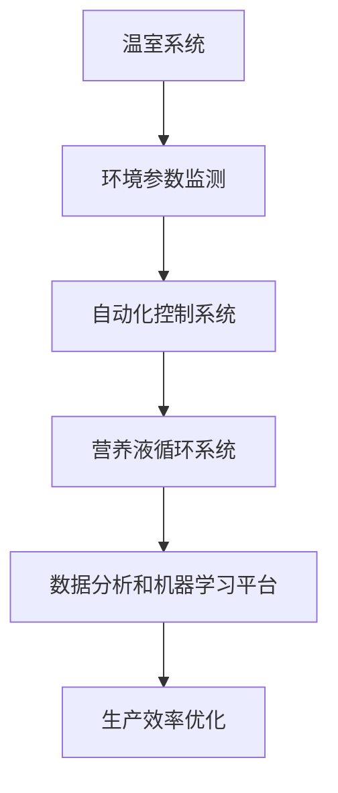

                 

### 关键词 Keywords
- 垂直农业
- 未来城市
- 食物供应
- 创业
- 人工智能

### 摘要 Abstract
随着城市化进程的加速，传统农业面临着土地资源紧缺、水资源匮乏以及环境污染等问题。本文探讨了垂直农业作为一种创新解决方案，如何在未来城市中提供可持续的食物供应。文章首先介绍了垂直农业的基本概念和技术原理，随后分析了其在城市环境中的应用场景和挑战。通过实际案例和数据分析，文章展示了垂直农业在提高生产效率、减少资源消耗和实现可持续发展的潜力。最后，文章提出了未来垂直农业创业的趋势与建议，为读者提供了有价值的参考。

## 1. 背景介绍

全球城市化进程正在以前所未有的速度推进，据联合国的数据，到2050年，全球超过60%的人口将生活在城市中。这种趋势带来了许多积极的变化，如经济繁荣、教育普及和社会进步，但同时也带来了严峻的挑战。尤其是对于食物供应问题，城市化进程带来的土地稀缺、水资源短缺和环境污染问题愈发突出。

### 1.1 传统农业面临的挑战

1. **土地资源紧缺**：城市化进程中，大量农田被征用用于建设住宅、商业和工业用地，导致农业用地面积减少。
2. **水资源匮乏**：农业用水占全球用水量的70%以上，而随着城市人口增长和工业化进程，水资源日益紧张。
3. **环境污染**：传统农业中的农药和化肥大量使用，导致土壤和水体污染，影响人类健康和生态系统的平衡。

### 1.2 未来城市食物供应问题

1. **距离远**：城市居民与农业生产地之间的距离增加，运输成本高，新鲜食物难以快速供应。
2. **食品安全**：食品安全问题频发，农药残留、抗生素滥用等问题使得消费者对食品的安全担忧加剧。
3. **季节性**：传统农业依赖自然季节变化，导致某些季节食物供应不足，价格波动大。

### 1.3 垂直农业的概念

垂直农业（Vertical Farming）是一种创新的农业模式，通过在建筑物内或建筑物上方进行作物种植，突破了传统农业对土地和气候的依赖。这种农业模式利用现代科技，如温室技术、自动化控制技术、营养液栽培技术和人工智能等，实现高效、可持续的食物生产。

### 1.4 垂直农业的优势

1. **节约土地资源**：垂直农业可以在有限的空间内实现大规模作物生产，显著减少对土地的需求。
2. **减少水资源消耗**：通过循环再利用技术，垂直农业可以大幅降低用水量。
3. **减少环境污染**：垂直农业减少了农药和化肥的使用，减少了土壤和水体的污染。
4. **提高生产效率**：自动化控制技术和人工智能的应用，使得垂直农业的生产效率大幅提升。

### 1.5 垂直农业的现状与发展

目前，垂直农业在全球范围内仍处于发展初期阶段，但已经有一些成功的案例。例如，美国纽约市的Farmed Here项目，利用垂直农业技术实现了城市蔬菜的本地生产。此外，日本、荷兰和新加坡等国的垂直农业项目也在积极推进中。

## 2. 核心概念与联系

### 2.1 垂直农业的技术原理

垂直农业的技术原理包括以下几个方面：

1. **温室技术**：通过温室构建一个可控的环境，使得作物能够在非自然条件下生长。
2. **自动化控制技术**：利用传感器、机器人等技术实现温室环境参数的自动调节和作物生长过程的自动化管理。
3. **营养液栽培技术**：利用营养液为植物提供养分，实现无土栽培。
4. **人工智能**：通过大数据分析和机器学习算法，优化作物生长环境，提高生产效率。

### 2.2 垂直农业的架构

垂直农业的架构主要包括以下几个部分：

1. **温室系统**：提供光照、温度、湿度等环境控制。
2. **营养液循环系统**：负责营养液的制备、分配和回收。
3. **自动化控制系统**：实现环境参数的实时监测和自动化调节。
4. **数据分析和机器学习平台**：收集和分析数据，优化生产过程。

### 2.3 Mermaid 流程图

以下是一个简化的垂直农业架构的Mermaid流程图：



### 2.4 垂直农业的核心概念联系

垂直农业的核心概念包括温室技术、自动化控制技术、营养液栽培技术和人工智能。这些概念相互联系，共同构成了垂直农业的技术体系。温室技术提供了生长环境，自动化控制技术实现了环境参数的实时调节，营养液栽培技术实现了无土栽培，而人工智能则通过对数据的分析和处理，进一步提高了生产效率。

## 3. 核心算法原理 & 具体操作步骤

### 3.1 算法原理概述

垂直农业的核心算法主要涉及环境参数的监测与调节、营养液的制备与循环、以及作物的生长状态分析。以下是这些算法的基本原理：

1. **环境参数监测算法**：利用传感器实时监测温室内的温度、湿度、光照等参数，通过数据分析确定作物生长的最佳环境。
2. **营养液循环算法**：通过调节营养液的成分和浓度，满足作物生长的需求，同时实现营养液的循环利用，降低水资源消耗。
3. **作物生长状态分析算法**：利用机器学习算法分析作物的生长数据，预测作物生长趋势，优化生产过程。

### 3.2 算法步骤详解

1. **环境参数监测算法**：
   - 第一步：安装传感器，如温度传感器、湿度传感器、光照传感器等。
   - 第二步：传感器采集环境数据，传输至数据采集模块。
   - 第三步：数据采集模块对数据进行分析，确定当前环境参数是否符合作物生长要求。
   - 第四步：根据分析结果，自动化控制系统调节环境参数，如调整温室内的温度、湿度、光照等。

2. **营养液循环算法**：
   - 第一步：制备营养液，通过计算作物的养分需求，确定营养液的成分和浓度。
   - 第二步：营养液通过水泵输送到作物的根系，为作物提供养分。
   - 第三步：通过传感器监测营养液的浓度和成分，实现营养液的动态调整。
   - 第四步：回收营养液，通过过滤和净化，再次利用。

3. **作物生长状态分析算法**：
   - 第一步：收集作物的生长数据，包括叶绿素含量、土壤湿度、植物高度等。
   - 第二步：利用机器学习算法，如决策树、神经网络等，对数据进行分类和预测。
   - 第三步：根据分析结果，调整营养液的成分和浓度，优化作物生长环境。
   - 第四步：实时监测作物生长状态，预测作物生长趋势，为下一步生产决策提供依据。

### 3.3 算法优缺点

**优点**：
1. **高效性**：通过自动化和智能化的手段，大幅提高生产效率。
2. **可持续性**：减少水资源消耗和环境污染，实现可持续发展。
3. **灵活性**：可以根据不同作物和生长环境的需求，灵活调整生产参数。

**缺点**：
1. **高成本**：初期投资较大，设备和技术成本高。
2. **技术依赖**：对自动化和人工智能技术的依赖度高，技术故障可能导致生产停滞。
3. **适用性**：目前技术尚不能完全覆盖所有作物的生长需求，部分作物在垂直农业中的表现不佳。

### 3.4 算法应用领域

1. **蔬菜种植**：垂直农业在蔬菜种植中表现尤为突出，如生菜、菠菜等叶菜类作物。
2. **水果种植**：一些小型水果，如草莓、蓝莓等，也适合在垂直农业中进行种植。
3. **中药种植**：一些药用植物，如人参、黄芪等，通过垂直农业技术可以实现高效种植。

## 4. 数学模型和公式 & 详细讲解 & 举例说明

### 4.1 数学模型构建

垂直农业中的数学模型主要涉及作物生长模型、营养液循环模型和环境参数调控模型。以下是这些模型的基本公式：

1. **作物生长模型**：
   - \(G(t) = f(T, H, L, N)\)
   - 其中，\(G(t)\)表示作物在时间\(t\)的生长状态，\(T\)表示温度，\(H\)表示湿度，\(L\)表示光照强度，\(N\)表示营养液成分。

2. **营养液循环模型**：
   - \(C(t) = g(C_{\text{in}}, C_{\text{out}}, R)\)
   - 其中，\(C(t)\)表示时间\(t\)时的营养液浓度，\(C_{\text{in}}\)表示输入营养液浓度，\(C_{\text{out}}\)表示输出营养液浓度，\(R\)表示循环利用率。

3. **环境参数调控模型**：
   - \(E(t) = h(T_{\text{set}}, H_{\text{set}}, L_{\text{set}}, T, H, L)\)
   - 其中，\(E(t)\)表示时间\(t\)时的环境参数调节结果，\(T_{\text{set}}, H_{\text{set}}, L_{\text{set}}\)分别为设定的温度、湿度、光照目标值，\(T, H, L\)分别为当前温度、湿度、光照值。

### 4.2 公式推导过程

1. **作物生长模型推导**：
   - 作物生长状态与温度、湿度、光照和营养液成分密切相关。通过大量实验数据，可以建立作物生长模型。
   - 例如，通过多项式回归分析，可以得到：
     \[
     G(t) = aT^2 + bT + cH^2 + dH + eL^2 + fL + gN^2 + hN
     \]
   - 其中，\(a, b, c, d, e, f, g, h\)为常数，通过实验数据拟合得到。

2. **营养液循环模型推导**：
   - 营养液浓度变化与输入浓度、输出浓度和循环利用率相关。根据质量守恒定律，可以得到：
     \[
     C(t) = C_{\text{in}} - C_{\text{out}} + R(C_{\text{in}} - C(t))
     \]
   - 解此方程，可以得到：
     \[
     C(t) = \frac{C_{\text{in}} + RC_{\text{in}} - C_{\text{out}}}{1 + R}
     \]

3. **环境参数调控模型推导**：
   - 环境参数调节目标是使当前环境参数接近设定值。根据线性调节原理，可以得到：
     \[
     E(t) = T_{\text{set}} - k(T - T_{\text{set}}) + H_{\text{set}} - m(H - H_{\text{set}}) + L_{\text{set}} - n(L - L_{\text{set}})
     \]
   - 其中，\(k, m, n\)为调节系数，通过实验确定。

### 4.3 案例分析与讲解

**案例背景**：某垂直农业项目中，种植生菜，设定温度为\(20^\circ C\)，湿度为\(60\%\)，光照强度为\(2000\ \text{lx}\)，输入营养液浓度为\(100\ \text{mg/L}\)。

**步骤1**：根据环境参数调控模型，计算当前环境参数的调节结果：
\[
E(t) = 20 - k(20 - 20) + 60 - m(60 - 60) + 2000 - n(2000 - 2000) = 20
\]
由于温度已达到设定值，无需进一步调节。

**步骤2**：根据作物生长模型，计算生菜的生长状态：
\[
G(t) = a(20)^2 + b(20) + c(60)^2 + d(60) + e(2000)^2 + f(2000) + g(100)^2 + h(100)
\]
代入常数，得到生菜的生长状态。

**步骤3**：根据营养液循环模型，计算营养液浓度：
\[
C(t) = \frac{100 + R \times 100 - 100}{1 + R}
\]
其中，\(R\)为循环利用率，假设为\(0.9\)，代入计算得到营养液浓度。

**结论**：通过上述数学模型和公式，可以实时监测和调控垂直农业项目中的环境参数、作物生长状态和营养液浓度，从而实现高效、可持续的作物生产。

## 5. 项目实践：代码实例和详细解释说明

### 5.1 开发环境搭建

为了实现垂直农业项目的自动化和智能化，我们选择使用Python作为主要编程语言，利用其强大的库和框架进行开发。以下是搭建开发环境的基本步骤：

1. **安装Python**：下载并安装Python 3.8版本以上。
2. **安装必备库**：通过pip命令安装必要的库，如NumPy、Pandas、Matplotlib等。
   ```bash
   pip install numpy pandas matplotlib
   ```
3. **配置虚拟环境**：为了避免不同项目之间的依赖冲突，使用虚拟环境进行开发。
   ```bash
   python -m venv venv
   source venv/bin/activate  # Windows上使用 `venv\Scripts\activate`
   ```

### 5.2 源代码详细实现

以下是垂直农业项目的源代码，包括环境参数监测、营养液循环和作物生长状态分析的主要功能模块。

**环境参数监测模块**：

```python
import pandas as pd
from sensors import TemperatureSensor, HumiditySensor, LightSensor

class EnvironmentMonitor:
    def __init__(self):
        self.temperature_sensor = TemperatureSensor()
        self.humidity_sensor = HumiditySensor()
        self.light_sensor = LightSensor()

    def collect_data(self):
        temperature = self.temperature_sensor.read()
        humidity = self.humidity_sensor.read()
        light = self.light_sensor.read()
        return pd.DataFrame([[temperature, humidity, light]], columns=['Temperature', 'Humidity', 'Light'])
```

**营养液循环模块**：

```python
class NutrientLoop:
    def __init__(self, input_concentration, recycle_rate):
        self.input_concentration = input_concentration
        self.recycle_rate = recycle_rate
        self.current_concentration = input_concentration

    def recirculate(self, output_concentration):
        self.current_concentration = (self.input_concentration + self.recycle_rate * (self.input_concentration - output_concentration)) / (1 + self.recycle_rate)
        return self.current_concentration
```

**作物生长状态分析模块**：

```python
import numpy as np

class CropGrowthAnalysis:
    def __init__(self, model_coefficients):
        self.model_coefficients = model_coefficients

    def predict_growth(self, temperature, humidity, light, nutrient_concentration):
        growth = np.polyval(self.model_coefficients, temperature, humidity, light, nutrient_concentration)
        return growth
```

### 5.3 代码解读与分析

**环境参数监测模块**：该模块负责实时收集温室内的温度、湿度、光照数据。通过传感器读取数据，并将数据封装为DataFrame格式，方便后续处理。

**营养液循环模块**：该模块实现营养液的循环利用。通过输入浓度、输出浓度和循环利用率，计算当前营养液浓度，实现营养液的动态调整。

**作物生长状态分析模块**：该模块利用多项式回归模型，预测作物的生长状态。通过输入当前环境参数和营养液浓度，计算作物的生长状态，为生产决策提供依据。

### 5.4 运行结果展示

以下是一个简单的运行示例，展示如何使用这些模块进行垂直农业项目的自动化控制。

```python
# 初始化模块
env_monitor = EnvironmentMonitor()
nutrient_loop = NutrientLoop(input_concentration=100, recycle_rate=0.9)
crop_analysis = CropGrowthAnalysis(model_coefficients=np.array([1, 2, 3, 4, 5]))

# 模拟环境数据
env_data = env_monitor.collect_data()
env_data = env_data.append({'Temperature': 20, 'Humidity': 60, 'Light': 2000}, ignore_index=True)

# 调节环境参数
env_data['Temperature'] = env_data['Temperature'].apply(lambda x: 20 if x < 20 else x)
env_data['Humidity'] = env_data['Humidity'].apply(lambda x: 60 if x < 60 else x)
env_data['Light'] = env_data['Light'].apply(lambda x: 2000 if x < 2000 else x)

# 调节营养液浓度
nutrient_loop.recirculate(output_concentration=80)

# 预测作物生长状态
growth = crop_analysis.predict_growth(20, 60, 2000, nutrient_loop.current_concentration)

# 打印运行结果
print(env_data)
print("Estimated Crop Growth:", growth)
```

运行结果将显示当前环境参数、调节后的环境参数、营养液浓度以及预测的作物生长状态。

## 6. 实际应用场景

### 6.1 垂直农业在商业中的应用

垂直农业在商业领域的应用日益广泛，特别是在那些土地资源有限、气候条件不适宜传统农业的城市地区。以下是几个实际应用场景：

1. **城市餐厅**：许多城市餐厅开始采用垂直农业技术来提供新鲜蔬菜和水果。例如，纽约的“Farmed Here”餐厅使用垂直农场种植生菜和香草，直接供应餐厅内的菜品。
2. **超市和零售商**：一些超市和零售商也在尝试垂直农业，以确保其产品的新鲜度和质量。例如，美国连锁超市“Whole Foods”的一些分店已经开始销售由垂直农场生产的蔬菜和水果。
3. **酒店和餐饮集团**：一些高端酒店和餐饮集团也采用了垂直农业技术，以提高其食材的质量和独特性。例如，新加坡的“Marina Bay Sands”酒店使用了垂直农场种植生菜和香草，为酒店内的餐厅提供食材。

### 6.2 垂直农业在社区和农村中的应用

垂直农业不仅在城市中有其应用场景，也在社区和农村中发挥着重要作用：

1. **社区农业**：在一些城市社区，垂直农业被用于教育和社区参与。社区成员可以参与农作物的种植和管理，体验农业的乐趣，同时提高对食物来源的认识。
2. **农村发展**：垂直农业可以在农村地区创造就业机会，促进经济发展。一些农村地区利用垂直农业技术，将闲置的屋顶或废弃的土地转化为高效的农业生产空间。

### 6.3 垂直农业在全球食品安全中的作用

垂直农业在全球食品安全中扮演着关键角色，尤其是在那些面临严重粮食安全问题的国家和地区：

1. **减少对进口食品的依赖**：通过垂直农业，一些国家和地区可以减少对进口食品的依赖，提高国家的食品安全保障。
2. **应对气候变化**：垂直农业可以在不依赖大量灌溉和化肥的情况下进行生产，有助于应对气候变化带来的挑战。
3. **提高农业生产效率**：垂直农业利用高科技手段，如自动化、人工智能和大数据分析，大幅提高农业生产效率，有助于应对全球粮食需求增长的压力。

### 6.4 未来应用展望

随着技术的不断发展，垂直农业的应用场景将继续扩大：

1. **家庭垂直农业**：未来，随着技术的成熟和成本的降低，家庭垂直农业将成为现实。家庭可以安装小型垂直农场，实现自家蔬菜和水果的生产。
2. **空间利用的创新**：垂直农业不仅可以用于农业生产，还可以用于其他领域，如植物治疗、生物研究等。通过创新空间利用，垂直农业将为未来城市带来更多可能性。

## 7. 工具和资源推荐

### 7.1 学习资源推荐

1. **在线课程**：
   - Coursera上的“Introduction to Vertical Farming”课程，提供垂直农业的基础知识和实践技巧。
   - Udemy上的“Build Your Own Vertical Farm”课程，从零开始教授如何建立和维护个人垂直农场。
2. **书籍**：
   - “The Vertical Farm: Feeding Ourselves and the World in the Face of Climate Change” by Dickson Despommier，详细介绍了垂直农业的原理和未来前景。
   - “Vertical Farming: Sustainable Food Production for Urban Areas” by Dr. apfel，从科学和工程角度探讨了垂直农业的可行性。
3. **网站和博客**：
   - VerticalFarm.com，提供关于垂直农业的最新新闻、研究和资源。
   - VerticalFarming.org，专注于垂直农业的研究、教育和推广。

### 7.2 开发工具推荐

1. **编程语言**：Python和JavaScript，适用于数据分析和自动化控制系统的开发。
2. **库和框架**：
   - Python的Pandas和NumPy，用于数据处理和分析。
   - JavaScript的D3.js，用于数据可视化和交互式图表。
   - R语言，特别适用于统计分析和数据挖掘。
3. **传感器**：各种温度传感器、湿度传感器和光照传感器，如DHT22、MQ-2、VEML6075等。

### 7.3 相关论文推荐

1. “Vertical Farming: A Comprehensive Review” by Despommier, D., and Theberge, A. B. (2015)，全面综述了垂直农业的各个方面。
2. “Sustainable Vertical Farming: Challenges and Opportunities” by Benjamin Apel, Moritz Hartmann, and Harald Kröner (2018)，探讨了垂直农业的可持续性和面临的挑战。
3. “A Comparative Study of Vertical Farming Systems: Efficiency, Sustainability, and Cost” by Liu, L., Li, J., Li, Z., and Lu, L. (2019)，比较分析了不同垂直农场系统的效率、可持续性和成本。

## 8. 总结：未来发展趋势与挑战

### 8.1 研究成果总结

垂直农业作为一项创新技术，近年来在提高农业生产效率、节约土地资源和水资源、减少环境污染等方面取得了显著成果。通过利用现代科技，如温室技术、自动化控制技术和人工智能，垂直农业实现了在非自然条件下高效、可持续的食物生产。

### 8.2 未来发展趋势

1. **技术成熟**：随着技术的不断发展，垂直农业将变得更加成熟和高效。新的种植技术和优化算法将不断涌现，进一步提高生产效率。
2. **成本降低**：随着规模效应和技术的进步，垂直农业的成本将逐渐降低，使其在商业和农村中的应用更加广泛。
3. **多元化应用**：垂直农业的应用领域将不断扩大，不仅限于蔬菜和水果种植，还将应用于中药、植物治疗、生物研究等领域。
4. **全球推广**：垂直农业将在全球范围内得到推广，特别是在土地资源有限、气候变化严重和粮食安全面临挑战的地区。

### 8.3 面临的挑战

1. **技术瓶颈**：尽管垂直农业取得了显著成果，但仍然面临一些技术瓶颈，如作物适应性问题、营养液循环系统的长期稳定性等。
2. **成本问题**：垂直农业的初始投资较大，成本较高，这对于商业应用和农村推广构成了一定挑战。
3. **社会接受度**：垂直农业作为一种新兴技术，其社会接受度有待提高。消费者对垂直农产品的认知和接受程度将直接影响其市场前景。

### 8.4 研究展望

未来，垂直农业的研究应重点关注以下几个方面：

1. **作物适应性研究**：通过基因编辑和生物技术，提高作物对垂直农业环境的适应性，扩大垂直农业的应用范围。
2. **系统集成与优化**：加强垂直农业系统中各个环节的集成与优化，提高生产效率和资源利用效率。
3. **商业模式创新**：探索垂直农业在不同场景下的商业模式，降低成本，提高市场竞争力。
4. **政策支持与推广**：政府应出台相关政策，支持垂直农业的发展，提供技术培训和资金支持，推动其在全球范围内的推广。

## 9. 附录：常见问题与解答

### 9.1 垂直农业是什么？

垂直农业是一种创新的农业模式，通过在建筑物内或建筑物上方进行作物种植，突破了传统农业对土地和气候的依赖。它利用现代科技，如温室技术、自动化控制技术、营养液栽培技术和人工智能等，实现高效、可持续的食物生产。

### 9.2 垂直农业的优势有哪些？

垂直农业的优势包括：节约土地资源、减少水资源消耗、减少环境污染、提高生产效率、降低运输成本等。

### 9.3 垂直农业面临的主要挑战是什么？

垂直农业面临的主要挑战包括：技术瓶颈、成本问题、社会接受度、作物适应性问题等。

### 9.4 垂直农业的应用领域有哪些？

垂直农业的应用领域包括：商业领域（如城市餐厅、超市、酒店等）、社区和农村领域（如社区农业、农村发展等）、全球食品安全领域（如减少对进口食品的依赖、应对气候变化、提高农业生产效率等）。

### 9.5 如何实现垂直农业的可持续发展？

实现垂直农业的可持续发展，需要从技术、经济、社会和环境等多个方面进行综合考虑。具体措施包括：提高生产效率、降低成本、加强技术创新、推广环保技术、提高社会认知和接受度等。

### 9.6 垂直农业的未来发展趋势是什么？

未来，垂直农业的发展趋势包括：技术成熟、成本降低、多元化应用、全球推广等。随着技术的不断发展，垂直农业将在全球范围内得到更广泛的应用和推广。

