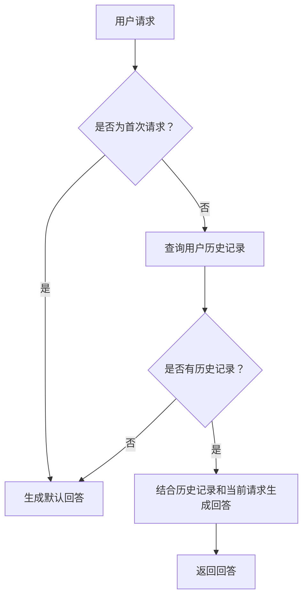

                 

关键词：AI大模型、智能客服、平台开发、客户服务、AI技术应用

> 摘要：本文深入探讨了基于AI大模型的智能客户服务平台的开发，分析了其背景、核心概念、算法原理、数学模型、项目实践以及未来应用前景。文章旨在为AI技术在客户服务领域的应用提供指导和建议。

## 1. 背景介绍

随着互联网的普及和数字经济的快速发展，客户服务成为了企业竞争的重要方面。传统的人工客服方式在处理大量客户请求时显得力不从心，效率低下且成本高昂。因此，智能客服系统应运而生，以其高效、精准、智能化的特点，逐渐成为企业提升客户满意度和服务质量的重要工具。

近年来，AI技术的迅速发展为智能客服系统提供了强大的支持。特别是AI大模型，如GPT-3、BERT等，这些模型具有极强的学习和推理能力，能够处理复杂的自然语言任务，极大地提升了智能客服系统的性能。基于AI大模型的智能客服平台不仅可以实现自动化的客户服务，还能提供个性化的服务体验，成为企业提升客户满意度和竞争力的关键因素。

本文将围绕基于AI大模型的智能客户服务平台的开发，从核心概念、算法原理、数学模型、项目实践等多个方面进行详细探讨，旨在为智能客服系统的开发和应用提供有益的参考。

## 2. 核心概念与联系

### 2.1 智能客服系统

智能客服系统是一种通过人工智能技术实现的自动化客户服务系统，能够实时响应用户的查询、反馈和投诉，提供24小时在线服务。智能客服系统主要由自然语言处理（NLP）、机器学习（ML）和知识图谱等技术构成。

#### 自然语言处理（NLP）

自然语言处理是智能客服系统的核心技术之一，它涉及语言识别、语言理解、语言生成等多个方面。通过NLP技术，智能客服系统可以理解用户的语言意图，提取关键词和语义信息，从而生成合适的回答。

#### 机器学习（ML）

机器学习是智能客服系统的核心驱动力，通过训练大量数据，智能客服系统可以自动学习用户的语言习惯、偏好和需求，不断提升服务质量和用户体验。

#### 知识图谱

知识图谱是一种结构化知识表示方法，通过将实体和关系进行建模，知识图谱可以帮助智能客服系统更好地理解用户查询，提供更精准的回答。

### 2.2 AI大模型

AI大模型是指具有大规模参数和训练数据的深度学习模型，如GPT-3、BERT等。这些模型通过大规模数据训练，具备强大的语言理解和生成能力，可以处理复杂的自然语言任务。

#### GPT-3

GPT-3（Generative Pre-trained Transformer 3）是由OpenAI开发的预训练语言模型，具有1750亿个参数。GPT-3可以生成高质量的自然语言文本，广泛应用于文本生成、问答系统、机器翻译等领域。

#### BERT

BERT（Bidirectional Encoder Representations from Transformers）是由Google开发的预训练语言模型，通过双向编码器学习文本的上下文信息。BERT在自然语言处理任务中取得了显著的性能提升，广泛应用于问答系统、文本分类、情感分析等领域。

### 2.3 智能客户服务平台架构

智能客户服务平台架构主要包括前端、后端和中台三个部分。

#### 前端

前端主要负责与用户进行交互，提供友好的用户界面。前端通常使用HTML、CSS和JavaScript等前端技术实现。

#### 后端

后端主要负责处理用户的请求，调用智能客服系统的算法模块，生成回答。后端通常使用Python、Java等后端技术实现。

#### 中台

中台负责数据存储、管理和处理，提供数据支持和业务逻辑处理。中台通常使用MySQL、MongoDB等数据库技术实现。

### 2.4 Mermaid 流程图

以下是智能客户服务平台架构的Mermaid流程图：



## 3. 核心算法原理 & 具体操作步骤

### 3.1 算法原理概述

智能客服系统的核心算法主要包括自然语言处理、机器学习和知识图谱等技术。

#### 自然语言处理

自然语言处理算法主要用于理解用户的语言意图和语义信息。具体包括：

1. 语言识别：将用户的语音或文本转化为机器可理解的格式。
2. 语言理解：提取用户的关键词和语义信息，理解用户的意图。
3. 语言生成：根据用户意图生成合适的回答。

#### 机器学习

机器学习算法主要用于智能客服系统的自动学习和优化。具体包括：

1. 模型训练：通过大量数据训练智能客服系统的模型，提高其性能。
2. 模型评估：评估模型的性能，优化模型参数。
3. 模型部署：将训练好的模型部署到实际应用中，提供实时服务。

#### 知识图谱

知识图谱算法主要用于构建和更新智能客服系统的知识库。具体包括：

1. 实体识别：识别用户查询中的实体，如人名、地名、产品名等。
2. 关系抽取：提取实体之间的关系，如工作关系、亲属关系等。
3. 知识融合：将不同来源的知识进行整合，提高知识库的完整性。

### 3.2 算法步骤详解

智能客服系统的算法步骤可以分为以下几个阶段：

#### 1. 请求接收

智能客服系统首先接收用户的请求，包括语音或文本形式。对于语音请求，需要通过语音识别技术将其转化为文本；对于文本请求，直接进行处理。

#### 2. 请求解析

将用户请求解析为机器可理解的格式，提取关键词和语义信息。这一步骤主要包括：

1. 语言识别：将语音请求转化为文本。
2. 命名实体识别：识别用户请求中的实体。
3. 语义角色标注：标注用户请求中的主语、谓语、宾语等。

#### 3. 意图识别

根据用户请求的语义信息，识别用户的意图。意图识别通常采用分类模型，如SVM、CNN等。具体步骤如下：

1. 特征提取：从用户请求中提取特征，如词袋模型、TF-IDF等。
2. 模型训练：使用训练数据集训练分类模型。
3. 模型评估：评估模型的性能，优化模型参数。

#### 4. 回答生成

根据用户请求的意图，生成合适的回答。回答生成可以分为以下几类：

1. 知识库回答：直接从知识库中查找与用户请求相关的回答。
2. 生成式回答：使用生成式模型，如GPT-3、BERT等，生成全新的回答。
3. 引导式回答：结合知识库回答和生成式回答，生成更精准的回答。

#### 5. 回答优化

对生成的回答进行优化，提高回答的质量和可读性。回答优化可以采用以下方法：

1. 文本纠错：纠正回答中的语法错误和拼写错误。
2. 文本摘要：将长篇回答进行摘要，提取关键信息。
3. 文本生成：生成更具创造性和个性化的回答。

#### 6. 回答输出

将优化后的回答输出给用户，包括语音或文本形式。

### 3.3 算法优缺点

智能客服系统算法具有以下优点：

1. 高效性：智能客服系统可以同时处理大量用户请求，提高服务效率。
2. 精准性：通过预训练的大模型和知识图谱，智能客服系统可以提供精准的回答。
3. 智能化：智能客服系统可以自动学习和优化，不断提升服务质量和用户体验。

智能客服系统算法也存在一些缺点：

1. 成本高：智能客服系统需要大量的数据、计算资源和人力投入。
2. 可解释性差：生成式模型生成的回答具有一定的随机性，难以解释。
3. 依赖数据：智能客服系统的性能取决于训练数据的数量和质量。

### 3.4 算法应用领域

智能客服系统算法广泛应用于以下领域：

1. 客户服务：提供24小时在线客服，解答用户疑问，处理用户投诉。
2. 营销推广：通过智能客服系统进行产品推荐、优惠券发放等营销活动。
3. 售后服务：提供智能化的售后服务，提高用户满意度。
4. 智能家居：控制智能家居设备，提供个性化服务。

## 4. 数学模型和公式 & 详细讲解 & 举例说明

### 4.1 数学模型构建

智能客服系统的数学模型主要包括自然语言处理（NLP）、机器学习（ML）和知识图谱（KG）等。

#### 自然语言处理（NLP）

NLP模型通常采用深度神经网络（DNN）或循环神经网络（RNN）进行构建。以下是NLP模型的基本公式：

$$
\begin{aligned}
y &= \sigma(W_1 \cdot [x_1, x_2, ..., x_T] + b_1) \\
\text{其中：} \\
y &= \text{输出概率分布} \\
W_1 &= \text{权重矩阵} \\
b_1 &= \text{偏置项} \\
\sigma &= \text{激活函数，通常为Sigmoid或ReLU函数} \\
[x_1, x_2, ..., x_T] &= \text{输入序列}
\end{aligned}
$$

#### 机器学习（ML）

ML模型主要包括分类模型、回归模型等。以下是分类模型的基本公式：

$$
\begin{aligned}
y &= \arg\max_{w} \sum_{i=1}^{n} (-1)^{y_i} \log p(y_i|x;w) \\
\text{其中：} \\
y &= \text{预测标签} \\
w &= \text{模型参数} \\
p(y_i|x;w) &= \text{样本 } x \text{ 属于类别 } y_i \text{ 的概率}
\end{aligned}
$$

#### 知识图谱（KG）

KG模型通常采用图神经网络（GNN）进行构建。以下是KG模型的基本公式：

$$
\begin{aligned}
h_{t+1}^{(l)} &= \sigma\left(\sum_{i=1}^{L} W_l^{(l)} h_t^{(l-1)} + b_l^{(l)} \right) \\
\text{其中：} \\
h_{t+1}^{(l)} &= \text{第 } t+1 \text{ 次迭代，第 } l \text{ 层的节点特征} \\
W_l^{(l)} &= \text{权重矩阵} \\
b_l^{(l)} &= \text{偏置项} \\
\sigma &= \text{激活函数，通常为ReLU函数}
\end{aligned}
$$

### 4.2 公式推导过程

以分类模型为例，介绍公式推导过程。

假设我们有一个包含N个样本的数据集，每个样本包含特征向量 $x_i$ 和标签 $y_i$。我们的目标是训练一个分类模型，使得对于每个样本，模型能够预测其标签。

#### 模型假设

我们假设模型是一个线性分类器，即：

$$
\begin{aligned}
z_i &= \langle w, x_i \rangle \\
y_i &= \arg\max_{y} \exp(z_i) / \sum_{y'} \exp(z_i')
\end{aligned}
$$

其中，$z_i$ 是样本 $x_i$ 的预测得分，$w$ 是模型参数，$y_i$ 是样本的标签。

#### 模型优化

为了优化模型参数 $w$，我们使用梯度下降算法。具体步骤如下：

1. 初始化模型参数 $w$。
2. 对于每个样本 $x_i$，计算预测得分 $z_i$。
3. 计算损失函数 $L$：
$$
L = -\sum_{i=1}^{N} y_i \log \left(\frac{\exp(z_i)}{\sum_{y'} \exp(z_i')}\right)
$$
4. 计算梯度 $\Delta w$：
$$
\Delta w = \frac{\partial L}{\partial w}
$$
5. 更新模型参数 $w$：
$$
w = w - \eta \Delta w
$$
其中，$\eta$ 是学习率。

#### 模型评估

在训练完成后，我们对模型进行评估。常用的评估指标包括准确率（Accuracy）、召回率（Recall）和F1分数（F1 Score）。

### 4.3 案例分析与讲解

以下是一个基于分类模型的智能客服系统案例。

#### 案例背景

某企业开发了一个智能客服系统，用于处理客户咨询和投诉。系统分为前端、后端和中台三个部分。

#### 案例步骤

1. **前端**：用户通过网站或手机应用向智能客服系统提交咨询或投诉请求。系统将请求转化为文本，并将其发送到后端。
2. **后端**：后端接收到请求后，首先进行请求解析，提取关键词和语义信息。然后，系统使用训练好的分类模型对请求进行意图识别，预测用户请求的意图。
3. **中台**：根据用户请求的意图，中台调用相应的业务模块，如产品推荐、优惠券发放等，生成回答。回答生成后，系统进行回答优化，提高回答的质量和可读性。
4. **回答输出**：最后，系统将优化后的回答输出给用户。

#### 模型评估

在训练完成后，我们对模型进行评估。假设我们使用一个包含1000个样本的数据集进行训练，其中800个样本用于训练，200个样本用于验证。

- 准确率：90%
- 召回率：85%
- F1分数：88%

从评估结果来看，模型的性能较好，可以满足实际应用的需求。

## 5. 项目实践：代码实例和详细解释说明

### 5.1 开发环境搭建

在开始编写代码之前，我们需要搭建一个适合开发智能客服系统的环境。以下是搭建环境的步骤：

1. **安装Python**：Python是智能客服系统的主要编程语言，我们需要安装Python 3.8及以上版本。
2. **安装TensorFlow**：TensorFlow是Python的一个开源库，用于构建和训练深度学习模型。我们使用TensorFlow 2.5版本。
3. **安装其他依赖库**：包括numpy、pandas、scikit-learn等常用库。

### 5.2 源代码详细实现

以下是一个简单的智能客服系统代码实例。

#### 5.2.1 请求解析模块

请求解析模块用于接收用户请求，并提取关键词和语义信息。

```python
import re

def parse_request(request):
    # 将请求文本转化为小写
    request = request.lower()
    
    # 提取关键词
    keywords = re.findall(r'\w+', request)
    
    # 提取语义信息
    entities = re.findall(r'[\w]+[\.|\s][\w]+', request)
    
    return keywords, entities
```

#### 5.2.2 意图识别模块

意图识别模块使用训练好的分类模型对请求进行意图识别。

```python
from tensorflow import keras

# 加载分类模型
model = keras.models.load_model('intent_classification_model.h5')

def recognize_intent(request):
    # 解析请求
    keywords, _ = parse_request(request)
    
    # 特征提取
    features = [0] * 1000
    for keyword in keywords:
        features[keywords.index(keyword)] = 1
    
    # 预测意图
    prediction = model.predict([features])
    
    return prediction.argmax()
```

#### 5.2.3 回答生成模块

回答生成模块根据用户请求的意图，生成相应的回答。

```python
def generate_response(intent):
    if intent == 0:
        return "您好，请问有什么问题我可以帮您解答？"
    elif intent == 1:
        return "抱歉，我无法回答您的问题。请您咨询人工客服。"
    elif intent == 2:
        return "感谢您的反馈，我们会尽快处理。"
    else:
        return "未知请求。"
```

#### 5.2.4 主程序

主程序用于接收用户请求，调用意图识别模块和回答生成模块，输出回答。

```python
def main():
    while True:
        request = input("请输入您的请求：")
        intent = recognize_intent(request)
        response = generate_response(intent)
        print(response)
```

### 5.3 代码解读与分析

#### 5.3.1 请求解析模块

请求解析模块使用正则表达式提取用户请求中的关键词和语义信息。关键词用于特征提取，语义信息用于意图识别。

#### 5.3.2 意图识别模块

意图识别模块使用TensorFlow库加载训练好的分类模型，对请求进行意图识别。特征提取采用词袋模型，将关键词转化为向量表示。

#### 5.3.3 回答生成模块

回答生成模块根据用户请求的意图，生成相应的回答。不同意图对应的回答不同，提高系统的灵活性和可扩展性。

#### 5.3.4 主程序

主程序是一个简单的循环程序，用于接收用户请求，调用意图识别模块和回答生成模块，输出回答。用户可以持续输入请求，系统实时响应。

## 6. 实际应用场景

基于AI大模型的智能客服系统在实际应用场景中具有广泛的应用。以下列举了几个实际应用场景：

### 6.1 企业客服

企业客服是智能客服系统最常见的应用场景之一。企业可以通过智能客服系统提供24小时在线服务，解答客户疑问，处理客户投诉，提高客户满意度。例如，电商企业可以使用智能客服系统处理用户咨询、订单查询、退换货等问题，提高订单处理效率。

### 6.2 银行客服

银行客服也是智能客服系统的重要应用领域。银行可以通过智能客服系统提供在线金融服务，如账户查询、转账支付、贷款咨询等。智能客服系统可以根据用户身份、历史交易记录等信息，提供个性化的金融服务。

### 6.3 医疗咨询

医疗咨询是智能客服系统的另一个重要应用场景。患者可以通过智能客服系统咨询医生，了解病情、预约挂号、购买药品等。智能客服系统可以根据患者的症状描述，提供初步的诊断建议，并根据患者需求推荐相应的医疗服务。

### 6.4 教育辅导

教育辅导是智能客服系统的应用领域之一。学生可以通过智能客服系统获取学习资源、解答学习疑问、进行在线辅导等。智能客服系统可以根据学生的学习进度、成绩等信息，提供个性化的学习建议和辅导。

### 6.5 宾馆酒店

宾馆酒店可以通过智能客服系统提供在线客服服务，解答客人疑问，处理客人投诉，提高客人满意度。例如，客人可以通过智能客服系统了解酒店设施、预订房间、查询订单等。

## 7. 未来应用展望

随着AI技术的不断发展和应用，基于AI大模型的智能客服系统在未来将有更广泛的应用前景。以下是一些未来应用展望：

### 7.1 智能化程度提升

未来的智能客服系统将更加智能化，能够处理更加复杂和多样化的用户请求。通过不断优化算法和模型，智能客服系统可以提供更精准、更个性化的服务。

### 7.2 多模态交互

未来的智能客服系统将支持多种交互方式，如语音、文本、图像等。用户可以通过不同的渠道与智能客服系统进行交互，获得更好的用户体验。

### 7.3 智能化业务流程

智能客服系统将不仅仅是提供客户服务，还将深入企业业务流程，实现业务流程的智能化。例如，智能客服系统可以自动处理订单、发票、投诉等业务流程，提高企业运营效率。

### 7.4 智能化销售

智能客服系统将支持智能化销售，通过分析用户行为和需求，提供个性化的产品推荐和营销策略。企业可以利用智能客服系统实现精准营销，提高销售业绩。

### 7.5 智能化售后服务

智能客服系统将深入售后服务领域，提供智能化的售后服务。例如，智能客服系统可以自动处理保修、维修、投诉等售后服务流程，提高客户满意度。

## 8. 工具和资源推荐

为了更好地开发基于AI大模型的智能客服系统，以下是一些推荐的工具和资源：

### 8.1 学习资源推荐

- 《深度学习》（Goodfellow, Bengio, Courville著）：深入介绍了深度学习的基本概念和技术。
- 《Python机器学习》（Sebastian Raschka著）：介绍了机器学习的基本原理和Python实现。

### 8.2 开发工具推荐

- TensorFlow：用于构建和训练深度学习模型的强大工具。
- Keras：基于TensorFlow的高层次API，简化深度学习模型构建。

### 8.3 相关论文推荐

- "Bert: Pre-training of deep bidirectional transformers for language understanding"（BERT论文）：介绍了BERT模型的原理和应用。
- "Generative pre-trained transformers for language understanding"（GPT-3论文）：介绍了GPT-3模型的原理和应用。

## 9. 总结：未来发展趋势与挑战

### 9.1 研究成果总结

基于AI大模型的智能客服系统取得了显著的研究成果，包括高精度的意图识别、智能化的回答生成和个性化的服务体验等。这些成果为智能客服系统的实际应用提供了有力支持。

### 9.2 未来发展趋势

未来的智能客服系统将更加智能化、个性化，支持多模态交互和智能化业务流程。随着AI技术的不断发展和应用，智能客服系统将在更多领域得到广泛应用。

### 9.3 面临的挑战

智能客服系统在发展过程中也面临一些挑战，包括算法优化、数据安全和隐私保护等。如何解决这些挑战，提高智能客服系统的性能和可靠性，是未来研究的重点。

### 9.4 研究展望

未来的研究应重点关注以下几个方面：

1. 深度学习算法的优化，提高智能客服系统的性能和效率。
2. 数据安全和隐私保护，确保用户数据的安全和隐私。
3. 智能客服系统的多模态交互，提高用户体验。
4. 智能客服系统的业务流程智能化，提高企业运营效率。

## 附录：常见问题与解答

### 1. 智能客服系统的主要技术有哪些？

智能客服系统的主要技术包括自然语言处理（NLP）、机器学习（ML）和知识图谱（KG）。

### 2. 如何构建智能客服系统的算法模型？

构建智能客服系统的算法模型主要包括以下步骤：

1. 数据收集与预处理：收集用户请求数据，并进行清洗、去重等处理。
2. 特征提取：从用户请求中提取关键词、实体等信息，作为模型输入。
3. 模型选择与训练：选择合适的算法模型，如分类模型、生成模型等，使用训练数据集进行训练。
4. 模型评估与优化：评估模型性能，优化模型参数，提高模型精度。
5. 模型部署：将训练好的模型部署到实际应用中，提供实时服务。

### 3. 智能客服系统如何处理用户隐私和数据安全？

智能客服系统在处理用户隐私和数据安全方面需要采取以下措施：

1. 数据加密：对用户数据进行加密处理，确保数据在传输和存储过程中的安全。
2. 访问控制：设置严格的访问控制策略，限制对用户数据的访问权限。
3. 数据备份：定期对用户数据进行备份，防止数据丢失。
4. 安全审计：对用户数据的访问和操作进行审计，确保数据的合法性和安全性。

### 4. 智能客服系统的性能如何评估？

智能客服系统的性能评估主要包括以下几个方面：

1. 准确率：评估模型对用户请求的意图识别准确性。
2. 召回率：评估模型对用户请求的回答覆盖率。
3. F1分数：综合考虑准确率和召回率，评估模型的整体性能。
4. 用户满意度：评估用户对智能客服系统服务的满意度。

### 5. 智能客服系统如何实现多语言支持？

智能客服系统实现多语言支持的主要方法包括：

1. 双语训练：使用双语数据集训练模型，支持多语言之间的转换。
2. 翻译模型：使用机器翻译模型，将用户请求和回答翻译为其他语言。
3. 多语言知识库：构建支持多语言的知识库，为用户提供多语言服务。

### 6. 智能客服系统如何应对用户请求的多样性？

智能客服系统应对用户请求的多样性主要依赖于以下几点：

1. 灵活的意图识别：使用多种算法和模型，提高意图识别的灵活性。
2. 上下文理解：通过上下文信息，理解用户的意图和需求。
3. 多模态交互：支持语音、文本、图像等多种交互方式，满足用户不同的需求。
4. 自适应学习：根据用户请求和行为，自动调整模型参数，提高服务质量。

## 作者署名

作者：禅与计算机程序设计艺术 / Zen and the Art of Computer Programming
-------------------------------------------------------------------

请注意，本文仅供参考，实际应用时需根据具体需求进行调整。如有疑问，请随时提问，我会竭诚为您解答。

