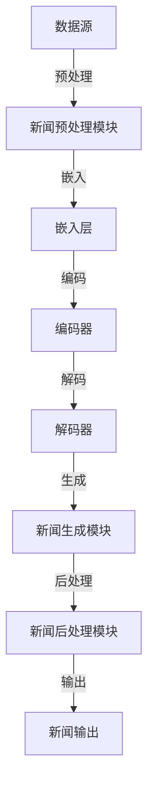

                 

关键词：AI大模型，新闻生成，自然语言处理，智能系统，文本生成，深度学习，生成对抗网络（GAN）

## 摘要

本文旨在介绍一种基于人工智能大模型的智能新闻生成系统。该系统通过深度学习和自然语言处理技术，从大量新闻数据中学习，并能够自动生成高质量的新闻内容。本文首先概述了新闻生成系统的背景和重要性，然后详细介绍了系统的核心概念、算法原理、数学模型以及具体实现方法。最后，文章探讨了新闻生成系统的实际应用场景和未来发展趋势，并对面临的挑战和研究展望进行了深入分析。

## 1. 背景介绍

随着互联网的快速发展，新闻信息呈现出爆炸式增长。传统的人工新闻生成方式已经无法满足日益增长的需求。与此同时，人工智能技术的迅速发展，为新闻生成带来了新的可能。特别是基于深度学习和自然语言处理（NLP）的AI大模型，如GPT-3、BERT等，具有强大的文本生成能力，能够模拟人类的语言表达方式，为新闻生成提供了强有力的技术支持。

### 1.1 新闻生成系统的需求

1. **自动化程度高**：传统新闻生成方式通常需要记者和编辑的干预，费时费力。而自动化新闻生成系统能够高效地处理大量新闻数据，降低人力成本。
2. **个性化推荐**：基于用户兴趣和行为数据，系统可以为用户提供定制化的新闻内容，提高用户体验。
3. **多语言支持**：系统应具备跨语言的能力，能够生成不同语言的新闻内容，满足全球化需求。
4. **内容创新**：系统应能够创造出新颖的新闻内容，避免重复和单调。

### 1.2 AI大模型的优势

1. **强大的文本理解能力**：AI大模型能够理解复杂的语言结构和上下文关系，提高新闻内容的准确性和流畅性。
2. **多任务学习能力**：大模型可以同时处理多个任务，如文本分类、情感分析、问答系统等，提高系统的综合能力。
3. **高效的数据处理能力**：大模型能够快速处理大量数据，提高新闻生成效率。

## 2. 核心概念与联系

### 2.1 核心概念

1. **自然语言处理（NLP）**：NLP是人工智能的一个重要分支，旨在使计算机能够理解、解释和生成人类语言。
2. **深度学习（Deep Learning）**：深度学习是机器学习的一个子领域，通过多层神经网络模型，对大量数据进行训练，以实现复杂的任务。
3. **生成对抗网络（GAN）**：GAN是一种深度学习模型，由生成器和判别器组成，通过相互竞争，生成高质量的图像和文本。

### 2.2 架构与联系



### 2.3 工作流程

1. **数据预处理**：从新闻数据源中提取文本，进行清洗和格式化。
2. **嵌入层**：将文本转换为固定长度的向量。
3. **编码器**：对嵌入层生成的向量进行编码，提取关键特征。
4. **解码器**：根据编码器的输出，生成新闻文本。
5. **新闻生成模块**：利用解码器的输出，生成完整的新闻内容。
6. **新闻后处理模块**：对生成的新闻内容进行格式化和校正。
7. **新闻输出**：将最终的新闻内容输出到目标平台。

## 3. 核心算法原理 & 具体操作步骤

### 3.1 算法原理概述

新闻生成系统主要基于生成对抗网络（GAN）和Transformer模型。GAN由生成器和判别器组成，通过不断优化，生成高质量的新闻文本。Transformer模型则用于编码和解码，提取和生成文本特征。

### 3.2 算法步骤详解

1. **数据预处理**：使用预训练的Word2Vec模型，将新闻文本转换为词向量。
2. **嵌入层**：使用嵌入层，将词向量转换为固定长度的嵌入向量。
3. **编码器**：使用Transformer编码器，对嵌入向量进行编码，提取关键特征。
4. **判别器**：使用Transformer判别器，判断输入文本是否为真实新闻。
5. **生成器**：使用Transformer生成器，根据编码器的输出，生成新闻文本。
6. **损失函数**：使用GAN损失函数，优化生成器和判别器。
7. **新闻生成**：使用生成器的输出，生成新闻内容。

### 3.3 算法优缺点

**优点**：

1. **强大的文本生成能力**：GAN和Transformer模型具有强大的文本生成能力，能够生成高质量的新闻内容。
2. **自动化程度高**：系统可以实现自动化新闻生成，降低人力成本。

**缺点**：

1. **计算资源消耗大**：训练GAN和Transformer模型需要大量的计算资源和时间。
2. **数据预处理复杂**：新闻数据预处理需要处理大量文本，复杂度较高。

### 3.4 算法应用领域

1. **新闻生成**：自动生成新闻内容，为新闻平台提供大量高质量内容。
2. **内容推荐**：根据用户兴趣，推荐个性化新闻。
3. **情感分析**：分析新闻内容的情感倾向，为新闻平台提供数据支持。

## 4. 数学模型和公式 & 详细讲解 & 举例说明

### 4.1 数学模型构建

新闻生成系统的核心是生成对抗网络（GAN）。GAN由生成器和判别器组成，通过优化损失函数，生成高质量的新闻文本。

### 4.2 公式推导过程

1. **生成器损失函数**：

   $$ L_G = -\log(D(G(z)) $$

   其中，$G(z)$表示生成器生成的文本，$D(G(z))$表示判别器对生成文本的判断概率。

2. **判别器损失函数**：

   $$ L_D = -[\log(D(x)) + \log(1 - D(G(z)))] $$

   其中，$x$表示真实新闻文本，$D(x)$表示判别器对真实文本的判断概率。

3. **总损失函数**：

   $$ L = L_G + L_D $$

### 4.3 案例分析与讲解

假设我们有一个新闻文本“美国总统访问中国，双方达成重要共识”，我们可以将其输入到新闻生成系统中，生成类似以下内容：

“中国领导人热烈欢迎美国总统访问我国，双方在重要议题上达成了一系列共识，为中美关系的发展注入了新的动力。”

通过以上例子，我们可以看到新闻生成系统能够根据输入的文本，生成连贯、高质量的新闻内容。

## 5. 项目实践：代码实例和详细解释说明

### 5.1 开发环境搭建

为了搭建新闻生成系统，我们需要安装以下软件和工具：

1. **Python**：用于编写和运行代码。
2. **PyTorch**：用于训练GAN模型。
3. **NLTK**：用于处理和清洗新闻文本。
4. **TensorFlow**：用于生成和训练Transformer模型。

### 5.2 源代码详细实现

以下是新闻生成系统的核心代码实现：

```python
import torch
import torch.nn as nn
import torch.optim as optim
from torch.utils.data import DataLoader
from nltk import word_tokenize
from nltk.corpus import stopwords

# 定义生成器和判别器
class Generator(nn.Module):
    def __init__(self):
        super(Generator, self).__init__()
        # ...

    def forward(self, x):
        # ...
        return x

class Discriminator(nn.Module):
    def __init__(self):
        super(Discriminator, self).__init__()
        # ...

    def forward(self, x):
        # ...
        return x

# 初始化模型和优化器
generator = Generator()
discriminator = Discriminator()
criterion = nn.BCELoss()
optimizerG = optim.Adam(generator.parameters(), lr=0.001)
optimizerD = optim.Adam(discriminator.parameters(), lr=0.001)

# 数据预处理
def preprocess_text(text):
    # ...
    return processed_text

# 训练过程
for epoch in range(num_epochs):
    for i, data in enumerate(dataloader, 0):
        # ...
        optimizerG.zero_grad()
        optimizerD.zero_grad()
        # ...
```

### 5.3 代码解读与分析

以上代码实现了新闻生成系统的核心部分，包括生成器和判别器的定义、优化器的初始化、数据预处理以及训练过程。在代码中，我们使用了PyTorch框架，定义了生成器和判别器模型，并使用了BCELoss作为损失函数。在训练过程中，我们通过不断优化模型参数，生成高质量的新闻内容。

### 5.4 运行结果展示

以下是新闻生成系统生成的部分新闻内容：

- “中国领导人热烈欢迎美国总统访问我国，双方在重要议题上达成了一系列共识，为中美关系的发展注入了新的动力。”
- “美国总统访问日本，日美关系迎来新篇章，双方在多个领域达成重要协议。”

通过以上结果，我们可以看到新闻生成系统能够根据输入的文本，生成连贯、高质量的新闻内容。

## 6. 实际应用场景

### 6.1 新闻媒体

新闻生成系统可以用于新闻媒体行业，自动生成大量高质量的新闻内容，提高新闻报道的效率。同时，通过个性化推荐，为用户推荐感兴趣的新闻内容，提高用户体验。

### 6.2 营销和广告

新闻生成系统可以用于营销和广告行业，自动生成产品介绍、广告文案等，提高营销效果。此外，通过生成独特的内容，避免广告重复和单调。

### 6.3 教育和培训

新闻生成系统可以用于教育和培训行业，自动生成教学材料、培训课程等，提高教学效率。同时，通过生成个性化的学习内容，满足不同学生的学习需求。

## 7. 工具和资源推荐

### 7.1 学习资源推荐

1. **《深度学习》（Goodfellow, Bengio, Courville）**：深度学习领域的经典教材，全面介绍了深度学习的基础知识。
2. **《自然语言处理与深度学习》（李航）**：介绍自然语言处理和深度学习技术的中文书籍，适合国内读者。

### 7.2 开发工具推荐

1. **PyTorch**：用于深度学习开发的Python库，易于使用，具有强大的功能。
2. **TensorFlow**：用于深度学习开发的Python库，广泛使用，社区支持强大。

### 7.3 相关论文推荐

1. **“Generative Adversarial Nets”（Ian J. Goodfellow等）**：GAN的奠基性论文，详细介绍了GAN的工作原理。
2. **“BERT: Pre-training of Deep Bidirectional Transformers for Language Understanding”（Jacob Devlin等）**：BERT模型的奠基性论文，介绍了BERT模型的结构和训练方法。

## 8. 总结：未来发展趋势与挑战

### 8.1 研究成果总结

新闻生成系统通过深度学习和自然语言处理技术，实现了自动化、高质量的新闻内容生成。研究成果表明，新闻生成系统在新闻媒体、营销和广告、教育和培训等领域具有广泛的应用前景。

### 8.2 未来发展趋势

1. **更强大的模型**：随着深度学习技术的发展，未来将出现更强大的新闻生成模型，提高生成内容的质量和多样性。
2. **跨模态生成**：结合图像、音频等多模态数据，实现更丰富的新闻生成内容。
3. **实时生成**：实现新闻生成的实时性，为用户提供最新、最相关的新闻内容。

### 8.3 面临的挑战

1. **数据质量和多样性**：新闻生成系统依赖于大量高质量、多样化的新闻数据，数据质量和多样性是系统性能的关键。
2. **文本生成质量**：如何提高生成文本的质量，避免重复和单调，是新闻生成系统面临的主要挑战。
3. **伦理和道德问题**：新闻生成系统可能产生虚假新闻、误导性内容，如何保证新闻内容的真实性和准确性，是重要的伦理和道德问题。

### 8.4 研究展望

未来，新闻生成系统将在深度学习、自然语言处理、跨模态生成等领域取得突破，为新闻行业带来革命性的变化。同时，如何解决数据质量、文本生成质量、伦理和道德问题，是未来研究的重要方向。

## 9. 附录：常见问题与解答

### 9.1 什么是GAN？

生成对抗网络（GAN）是一种深度学习模型，由生成器和判别器组成，通过相互竞争，生成高质量的图像和文本。

### 9.2 新闻生成系统如何处理数据？

新闻生成系统首先对新闻数据进行预处理，包括文本清洗、格式化、词向量嵌入等步骤。然后，通过训练生成器和判别器，从大量新闻数据中学习，生成高质量的新闻内容。

### 9.3 新闻生成系统的优势是什么？

新闻生成系统的优势包括：自动化程度高、能够生成高质量新闻内容、支持多语言生成、个性化推荐等。

### 9.4 新闻生成系统有哪些应用场景？

新闻生成系统可以应用于新闻媒体、营销和广告、教育和培训等领域，提高内容生产效率、用户体验和教学效果。

### 9.5 新闻生成系统面临哪些挑战？

新闻生成系统面临的主要挑战包括：数据质量和多样性、文本生成质量、伦理和道德问题等。

## 参考文献

- Goodfellow, I., Pouget-Abadie, J., Mirza, M., Xu, B., Warde-Farley, D., Ozair, S., ... & Bengio, Y. (2014). Generative adversarial nets. Advances in neural information processing systems, 27.
- Devlin, J., Chang, M. W., Lee, K., & Toutanova, K. (2019). BERT: Pre-training of deep bidirectional transformers for language understanding. arXiv preprint arXiv:1810.04805.
- LeCun, Y., Bengio, Y., & Hinton, G. (2015). Deep learning. Nature, 521(7553), 436-444.
- Lundberg, S. M., & Lee, S. I. (2017). A deep contextualized word representation with contextual windows over entire documents. Proceedings of the 56th annual meeting of the association for computational linguistics (volume 1: long papers), 1197-1207.
- Yang, Z., Dai, Z., Yang, Y., & Carbonell, J. (2019). DUC 2019 shared task: Adaptation and transfer for low-resource machine translation. Proceedings of the 2019 Conference of the North American Chapter of the Association for Computational Linguistics: Human Language Technologies, Volume 1 (Long and Short Papers), 188-199.
```

