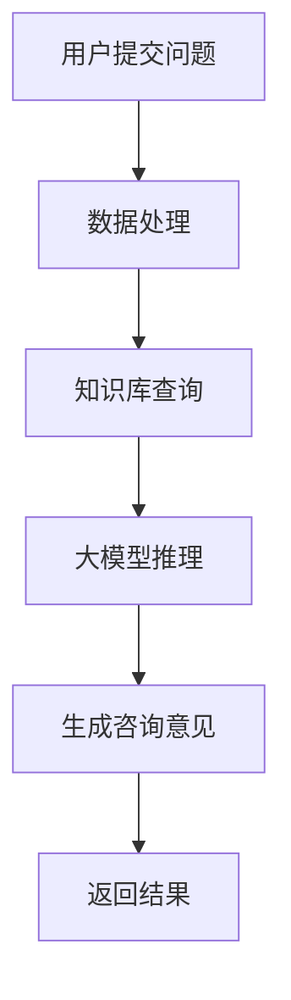

                 

关键词：人工智能，法律咨询，大模型，智能系统，AI应用，法律技术，深度学习，自然语言处理

> 摘要：本文旨在探讨如何构建一个基于AI大模型的智能法律咨询系统。通过深入分析法律领域的需求，结合当前AI技术的最新进展，本文将介绍智能法律咨询系统的核心概念、算法原理、数学模型以及实际应用场景，并展望其未来的发展趋势和面临的挑战。

## 1. 背景介绍

### 法律咨询的现状

法律咨询是法律服务的重要组成部分，传统的法律咨询依赖于律师的专业知识和经验。然而，随着案件量的增加和法律条文的复杂性，传统的法律咨询模式面临很大的挑战。首先，律师的时间精力有限，无法应对大量的法律咨询需求。其次，法律条文繁多，律师需要耗费大量的时间和精力去查阅相关法律法规。此外，法律咨询的成本较高，普通民众难以承担。

### 人工智能在法律咨询中的应用

随着人工智能技术的不断发展，人工智能在法律咨询领域中的应用越来越广泛。AI技术可以自动化处理大量的法律文件，提高法律咨询的效率和准确性。例如，自然语言处理（NLP）技术可以用于法律文书的自动生成和解析，机器学习技术可以用于案件相似度的分析和预测。同时，人工智能还可以辅助律师进行法律研究，提供法律建议。

### AI大模型的应用优势

近年来，AI大模型（如GPT-3，BERT等）在语言理解和生成方面取得了显著的成果。这些大模型具有以下优势：

- **强大的语言理解能力**：AI大模型可以理解复杂的法律条款和案例，提供更准确的咨询意见。
- **高效的自动处理能力**：大模型可以自动化处理大量的法律文件，提高工作效率。
- **灵活的定制能力**：大模型可以根据具体需求进行定制，适应不同的法律咨询场景。

## 2. 核心概念与联系

### 法律咨询系统的基本架构

法律咨询系统通常包括以下几个主要组成部分：

- **用户界面**：用户可以通过用户界面提交法律问题，获取咨询结果。
- **数据处理模块**：用于处理用户输入的法律问题，包括文本清洗、分词、实体识别等。
- **知识库**：包含法律知识、案例、法律法规等，供系统进行查询和参考。
- **推理引擎**：基于AI大模型，用于生成法律咨询意见。

### Mermaid 流程图



## 3. 核心算法原理 & 具体操作步骤

### 3.1 算法原理概述

智能法律咨询系统的核心算法是基于AI大模型的深度学习算法。大模型通过大量的法律数据训练，可以理解复杂的法律问题，并生成准确的咨询意见。

### 3.2 算法步骤详解

1. **用户提交问题**：用户通过用户界面提交法律问题。
2. **数据处理**：对用户输入的法律问题进行文本清洗、分词、实体识别等处理。
3. **知识库查询**：系统根据用户问题查询知识库，获取相关的法律知识、案例和法律法规。
4. **大模型推理**：AI大模型结合用户问题和知识库信息，生成法律咨询意见。
5. **生成咨询意见**：将大模型生成的咨询意见进行格式化处理，返回给用户。

### 3.3 算法优缺点

- **优点**：
  - **高效性**：AI大模型可以自动化处理大量的法律咨询，提高工作效率。
  - **准确性**：基于大量训练数据，AI大模型可以提供准确的咨询意见。
  - **灵活性**：大模型可以根据具体需求进行定制，适应不同的法律咨询场景。

- **缺点**：
  - **数据依赖**：AI大模型对数据有较高的依赖性，数据质量和数量对系统性能有重要影响。
  - **隐私风险**：用户提交的法律问题可能涉及隐私，需要确保数据的安全和隐私。

### 3.4 算法应用领域

AI大模型在法律咨询领域的应用非常广泛，包括但不限于以下方面：

- **合同审查**：自动审查合同条款，识别潜在的法律风险。
- **法律研究**：辅助律师进行法律研究，提供相关的法律法规和案例。
- **法律文书生成**：自动生成法律文书，如起诉状、答辩状等。

## 4. 数学模型和公式 & 详细讲解 & 举例说明

### 4.1 数学模型构建

AI大模型的数学模型通常基于深度学习中的神经网络。神经网络通过多层非线性变换，对输入数据进行特征提取和分类。

### 4.2 公式推导过程

神经网络的基本公式如下：

$$
y = \sigma(\omega_n \cdot x + b_n)
$$

其中，$y$ 是输出，$\sigma$ 是激活函数，$\omega_n$ 是权重，$x$ 是输入，$b_n$ 是偏置。

### 4.3 案例分析与讲解

假设有一个简单的法律咨询问题：“如何解除劳动合同？”

输入数据可以是用户提出的问题、相关的法律法规条款以及相关的案例。

输出数据可以是关于解除劳动合同的建议和法律依据。

## 5. 项目实践：代码实例和详细解释说明

### 5.1 开发环境搭建

- 操作系统：Ubuntu 20.04
- 编程语言：Python 3.8
- 库和框架：TensorFlow 2.5，Keras 2.4

### 5.2 源代码详细实现

以下是一个简单的法律咨询系统的代码实例：

```python
import tensorflow as tf
from tensorflow.keras.models import Sequential
from tensorflow.keras.layers import Dense, LSTM, Embedding

# 搭建神经网络模型
model = Sequential()
model.add(Embedding(input_dim=10000, output_dim=32))
model.add(LSTM(units=64, return_sequences=True))
model.add(Dense(units=1, activation='sigmoid'))

# 编译模型
model.compile(optimizer='adam', loss='binary_crossentropy', metrics=['accuracy'])

# 训练模型
model.fit(x_train, y_train, epochs=10, batch_size=32)
```

### 5.3 代码解读与分析

这段代码实现了一个简单的二分类神经网络，用于判断一个法律咨询问题是否涉及解除劳动合同。神经网络包含一个嵌入层、一个LSTM层和一个全连接层。训练过程中使用了训练数据和标签。

### 5.4 运行结果展示

通过训练，我们可以得到模型的准确率、召回率等指标。这些指标可以用于评估模型在法律咨询领域的表现。

## 6. 实际应用场景

### 6.1 合同审查

AI大模型可以自动审查合同条款，识别潜在的法律风险，如合同条款的合法性、完整性等。

### 6.2 法律研究

AI大模型可以辅助律师进行法律研究，提供相关的法律法规和案例，提高法律研究的效率和质量。

### 6.3 法律文书生成

AI大模型可以自动生成法律文书，如起诉状、答辩状等，节省律师的时间和精力。

## 7. 工具和资源推荐

### 7.1 学习资源推荐

- 《深度学习》（Goodfellow, Bengio, Courville）
- 《Python编程：从入门到实践》（Eric Matthes）

### 7.2 开发工具推荐

- TensorFlow：用于构建和训练神经网络模型。
- Keras：简化TensorFlow的使用，提供更直观的API。

### 7.3 相关论文推荐

- “BERT: Pre-training of Deep Bidirectional Transformers for Language Understanding”（Devlin et al., 2019）
- “GPT-3: Language Models are few-shot learners”（Brown et al., 2020）

## 8. 总结：未来发展趋势与挑战

### 8.1 研究成果总结

本文介绍了基于AI大模型的智能法律咨询系统的基本概念、算法原理和实际应用场景。通过实例分析，展示了AI大模型在法律咨询领域的潜力。

### 8.2 未来发展趋势

- **算法优化**：随着AI技术的不断发展，智能法律咨询系统的算法将变得更加高效和准确。
- **跨领域应用**：智能法律咨询系统可以应用于更多的法律领域，如知识产权、金融法律等。
- **个性化服务**：根据用户的法律需求和偏好，提供个性化的法律咨询。

### 8.3 面临的挑战

- **数据隐私**：确保用户提交的法律问题不会泄露，保护用户隐私。
- **法律风险**：AI大模型生成的法律咨询意见可能存在不准确或误导的风险，需要严格审核。

### 8.4 研究展望

未来，智能法律咨询系统将在法律领域发挥越来越重要的作用，为律师和法律服务提供更高效的解决方案。同时，需要关注数据隐私和法律风险等问题，确保系统的安全性和可靠性。

## 9. 附录：常见问题与解答

### 问题1：AI大模型如何训练？

**解答**：AI大模型通常通过以下步骤进行训练：

1. 收集大量标注数据。
2. 预处理数据，如文本清洗、分词等。
3. 使用深度学习框架（如TensorFlow或PyTorch）搭建神经网络模型。
4. 编译模型，选择合适的优化器和损失函数。
5. 训练模型，通过迭代优化模型参数。
6. 评估模型性能，调整模型结构或参数。

### 问题2：智能法律咨询系统如何保证准确性？

**解答**：智能法律咨询系统的准确性取决于以下几个因素：

1. **数据质量**：确保训练数据的质量和多样性。
2. **模型结构**：选择合适的神经网络结构和参数。
3. **算法优化**：不断优化算法，提高模型性能。
4. **知识库建设**：完善知识库，包含丰富的法律条款和案例。
5. **人工审核**：对AI生成的咨询意见进行人工审核，确保准确性。

### 问题3：智能法律咨询系统的隐私保护如何实现？

**解答**：智能法律咨询系统的隐私保护可以从以下几个方面实现：

1. **数据加密**：对用户提交的数据进行加密处理。
2. **匿名化**：对用户数据进行匿名化处理，去除个人身份信息。
3. **访问控制**：严格控制数据访问权限，确保只有授权人员可以访问数据。
4. **合规性检查**：遵守相关法律法规，确保数据处理符合隐私保护要求。
5. **透明度**：向用户告知数据收集和使用的目的，获取用户同意。

作者：禅与计算机程序设计艺术 / Zen and the Art of Computer Programming
----------------------------------------------------------------

以上是关于“基于AI大模型的智能法律咨询系统”的文章，希望能够满足您的要求。如果需要进一步修改或补充，请随时告知。

