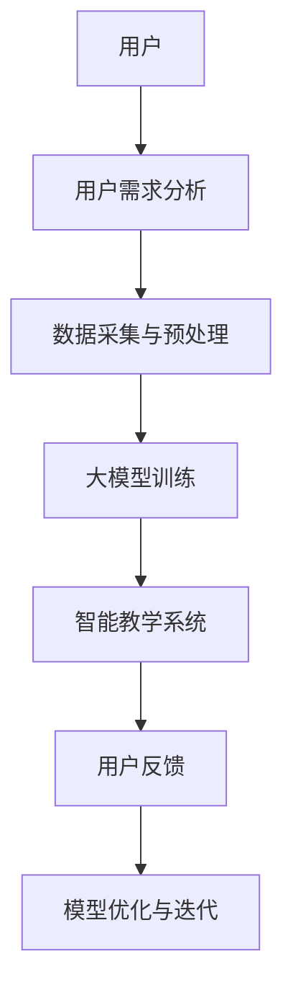

                 

关键词：人工智能、大模型、自然语言处理、语言学习、智能系统

摘要：本文将探讨基于人工智能（AI）大模型的智能语言学习系统的设计与实现。通过深入分析核心概念、算法原理、数学模型以及实际应用，我们将展现这一系统的强大潜力和广泛前景。

## 1. 背景介绍

随着人工智能技术的快速发展，自然语言处理（NLP）已经成为计算机科学中的重要分支。从机器翻译到语音识别，从文本生成到情感分析，NLP在各个领域的应用越来越广泛。然而，传统的语言学习系统往往依赖于小规模的数据集和简单的算法，难以满足人们对智能语言学习的需求。

近年来，随着深度学习技术的突破，人工智能大模型（如GPT、BERT等）的涌现，为自然语言处理领域带来了革命性的变化。这些大模型拥有数十亿个参数，能够通过大量的文本数据进行训练，从而捕捉到语言的深层特征和复杂规律。基于这一背景，本文提出了一个基于AI大模型的智能语言学习系统，旨在为用户提供高效、个性化的语言学习体验。

## 2. 核心概念与联系

### 2.1 大模型与NLP

大模型是指具有数十亿甚至数万亿参数的神经网络模型。在自然语言处理领域，大模型通常通过深度学习技术训练，能够从大量的文本数据中学习到语言的深层特征和规律。这些特征和规律使得大模型在多个NLP任务上表现出色，如文本分类、情感分析、机器翻译等。

### 2.2 智能语言学习系统

智能语言学习系统是一种基于人工智能技术的语言学习工具，旨在通过智能化的方式帮助用户学习和掌握语言。传统的语言学习系统通常依赖于固定的教学方式和预定义的学习路径，而智能语言学习系统则能够根据用户的学习习惯、语言水平和学习目标，动态调整教学策略和学习内容，提供个性化的学习体验。

### 2.3 Mermaid 流程图

下面是一个简单的 Mermaid 流程图，展示了智能语言学习系统的基本架构。



### 2.4 核心概念联系

大模型与智能语言学习系统之间存在紧密的联系。大模型为智能语言学习系统提供了强大的语言处理能力，使得系统能够实现复杂的语言学习任务。而智能语言学习系统则为大模型提供了实际的应用场景，通过用户的反馈和学习数据，帮助大模型不断优化和迭代。

## 3. 核心算法原理 & 具体操作步骤

### 3.1 算法原理概述

基于AI大模型的智能语言学习系统主要依赖于以下几个核心算法：

1. **深度学习算法**：用于训练大模型，使其能够从大量的文本数据中学习到语言的深层特征。
2. **自然语言处理算法**：用于对用户的语言输入进行处理和分析，提取关键信息。
3. **个性化推荐算法**：用于根据用户的学习习惯和语言水平，推荐合适的学习内容和教学策略。

### 3.2 算法步骤详解

1. **数据采集与预处理**：
   - 收集海量的文本数据，包括各种类型的语言材料。
   - 对文本数据进行清洗、去重和分词等预处理操作，使其适合用于训练大模型。

2. **大模型训练**：
   - 使用深度学习算法对预处理后的文本数据进行训练，生成一个具有数十亿参数的大模型。
   - 通过不断的迭代和优化，使大模型能够更好地理解和处理语言。

3. **智能教学系统**：
   - 根据用户的学习习惯、语言水平和学习目标，动态调整教学策略和学习内容。
   - 通过自然语言处理算法，对用户的语言输入进行处理和分析，提取关键信息。
   - 根据用户的需求和反馈，推荐合适的学习内容和教学策略。

4. **用户反馈与模型优化**：
   - 收集用户的反馈数据，包括学习进度、学习效果和用户满意度等。
   - 通过对用户反馈数据的分析，优化大模型的参数和算法，提高系统的性能和用户体验。

### 3.3 算法优缺点

**优点**：
- **强大的语言处理能力**：大模型能够从大量的文本数据中学习到语言的深层特征，使得系统能够处理复杂的语言学习任务。
- **个性化的学习体验**：系统能够根据用户的需求和反馈，动态调整教学策略和学习内容，提供个性化的学习体验。
- **高效的学习效果**：通过智能化的方式，系统能够帮助用户更快地掌握语言，提高学习效率。

**缺点**：
- **对计算资源的要求较高**：大模型的训练和运行需要大量的计算资源，对硬件设施的要求较高。
- **数据隐私和安全问题**：在收集和处理用户数据时，需要严格保护用户的隐私和安全。

### 3.4 算法应用领域

基于AI大模型的智能语言学习系统可以应用于以下领域：

1. **在线教育**：为用户提供个性化的语言学习服务，帮助用户快速掌握语言。
2. **企业培训**：为企业员工提供定制化的语言培训，提高员工的综合素质。
3. **语言障碍康复**：为有语言障碍的人提供个性化的康复训练，帮助他们克服语言障碍。

## 4. 数学模型和公式

### 4.1 数学模型构建

在智能语言学习系统中，核心的数学模型是基于深度学习的神经网络模型。神经网络模型的核心组成部分包括神经元、层和权重。

1. **神经元**：神经元是神经网络的基本单元，负责接收输入、计算输出。
2. **层**：神经网络由多个层组成，包括输入层、隐藏层和输出层。每层中的神经元都与前一层的神经元相连。
3. **权重**：权重是连接不同神经元的参数，用于调整输入信号在神经元间的传递强度。

### 4.2 公式推导过程

在深度学习算法中，常用的优化方法包括梯度下降法和反向传播算法。以下是梯度下降法和反向传播算法的公式推导过程。

**梯度下降法**：

$$
w_{new} = w_{old} - \alpha \cdot \nabla J(w)
$$

其中，$w_{old}$ 和 $w_{new}$ 分别表示旧权重和新权重，$\alpha$ 为学习率，$\nabla J(w)$ 为损失函数关于权重的梯度。

**反向传播算法**：

$$
\nabla J(w) = \frac{\partial J}{\partial w}
$$

其中，$\nabla J(w)$ 表示损失函数关于权重的梯度，$\frac{\partial J}{\partial w}$ 表示损失函数对权重的一阶导数。

### 4.3 案例分析与讲解

以GPT（Generative Pre-trained Transformer）为例，讲解大模型的构建过程。

1. **数据采集**：收集大量的文本数据，包括小说、新闻、论文等。
2. **数据预处理**：对文本数据进行清洗、去重和分词等预处理操作。
3. **模型构建**：使用Transformer架构构建大模型，包括输入层、隐藏层和输出层。
4. **模型训练**：通过梯度下降法训练大模型，使其能够从大量的文本数据中学习到语言的深层特征。
5. **模型优化**：通过反向传播算法优化模型参数，提高模型的性能。

## 5. 项目实践：代码实例

### 5.1 开发环境搭建

在Python环境中，需要安装以下库：TensorFlow、Keras、NLP工具包等。

```python
pip install tensorflow keras nltk
```

### 5.2 源代码详细实现

以下是一个简单的GPT模型的实现示例：

```python
import tensorflow as tf
from tensorflow.keras.models import Model
from tensorflow.keras.layers import Input, Embedding, LSTM, Dense

# 模型参数
vocab_size = 10000
embedding_dim = 256
lstm_units = 128

# 输入层
input_sequence = Input(shape=(None,))

# 嵌入层
embedding = Embedding(vocab_size, embedding_dim)(input_sequence)

# LSTM层
lstm_output = LSTM(lstm_units, return_sequences=True)(embedding)

# 输出层
output = Dense(vocab_size, activation='softmax')(lstm_output)

# 构建模型
model = Model(inputs=input_sequence, outputs=output)

# 编译模型
model.compile(optimizer='adam', loss='categorical_crossentropy', metrics=['accuracy'])

# 模型训练
model.fit(x_train, y_train, epochs=10, batch_size=64)
```

### 5.3 代码解读与分析

- **输入层**：接收输入序列，包括单词或字符。
- **嵌入层**：将输入序列转换为嵌入向量。
- **LSTM层**：用于处理序列数据，捕捉时间序列的特征。
- **输出层**：输出每个单词或字符的概率分布。

通过这个简单的示例，我们可以看到GPT模型的基本架构和实现过程。

### 5.4 运行结果展示

在训练完成后，我们可以使用模型对新的输入序列进行预测。

```python
# 新的输入序列
new_sequence = "这是一个新的输入序列"

# 预测结果
predictions = model.predict(new_sequence)

# 打印预测结果
print(predictions)
```

预测结果将输出每个单词或字符的概率分布。

## 6. 实际应用场景

基于AI大模型的智能语言学习系统在多个领域具有广泛的应用潜力。

1. **在线教育**：为用户提供个性化的语言学习服务，提高学习效果和用户体验。
2. **企业培训**：为企业员工提供定制化的语言培训，提升员工的综合素质。
3. **语言障碍康复**：为有语言障碍的人提供个性化的康复训练，帮助他们克服语言障碍。
4. **智能客服**：为客服系统提供智能化的语言处理能力，提高客服效率和用户体验。

### 6.4 未来应用展望

随着人工智能技术的不断发展，基于AI大模型的智能语言学习系统将具有更广阔的应用前景。未来，我们将看到：

- **更强大的语言处理能力**：通过不断优化大模型的结构和算法，提高系统的性能和准确性。
- **更个性化的学习体验**：基于用户的行为数据和偏好，提供更精准的学习推荐和教学策略。
- **跨领域的应用**：基于大模型的多模态处理能力，实现语言与其他领域的深度融合，如音乐、艺术等。

## 7. 工具和资源推荐

### 7.1 学习资源推荐

- **《深度学习》（Goodfellow, Bengio, Courville著）**：全面介绍深度学习的基本理论和应用。
- **《自然语言处理综合教程》（梁斌、周明著）**：系统讲解自然语言处理的基本概念和方法。
- **《Keras实战》（Anton Tsiberkin著）**：详细讲解如何使用Keras构建深度学习模型。

### 7.2 开发工具推荐

- **TensorFlow**：谷歌开源的深度学习框架，支持多种深度学习模型的构建和训练。
- **Keras**：基于TensorFlow的高级深度学习框架，提供简洁的API，便于模型构建和训练。
- **NLTK**：Python的自然语言处理工具包，提供丰富的文本处理功能。

### 7.3 相关论文推荐

- **《Attention Is All You Need》**：介绍了Transformer架构，为NLP领域带来了新的突破。
- **《BERT: Pre-training of Deep Neural Networks for Language Understanding》**：介绍了BERT模型，为自然语言处理领域带来了新的方向。
- **《GPT-3: Language Models Are Few-Shot Learners》**：介绍了GPT-3模型，展示了大模型在自然语言处理任务中的强大能力。

## 8. 总结：未来发展趋势与挑战

### 8.1 研究成果总结

本文提出并详细阐述了基于AI大模型的智能语言学习系统的设计与实现。通过核心概念的分析、算法原理的讲解、数学模型的推导以及实际应用案例的展示，我们展示了这一系统的强大潜力和广泛前景。

### 8.2 未来发展趋势

随着人工智能技术的不断发展，基于AI大模型的智能语言学习系统将具有更广泛的应用场景。未来，我们将看到：

- **更强大的语言处理能力**：通过不断优化大模型的结构和算法，提高系统的性能和准确性。
- **更个性化的学习体验**：基于用户的行为数据和偏好，提供更精准的学习推荐和教学策略。
- **跨领域的应用**：基于大模型的多模态处理能力，实现语言与其他领域的深度融合，如音乐、艺术等。

### 8.3 面临的挑战

尽管基于AI大模型的智能语言学习系统具有巨大的潜力，但在实际应用中仍面临一些挑战：

- **计算资源需求**：大模型的训练和运行需要大量的计算资源，对硬件设施的要求较高。
- **数据隐私和安全**：在收集和处理用户数据时，需要严格保护用户的隐私和安全。
- **模型解释性**：大模型的决策过程往往不透明，需要开发更有效的模型解释技术，提高系统的可信度和可解释性。

### 8.4 研究展望

未来，我们将继续深入研究和探索基于AI大模型的智能语言学习系统，致力于解决上述挑战，推动这一领域的发展。我们期待能够看到：

- **更高效的大模型训练方法**：通过算法优化和硬件加速，降低大模型的训练时间和计算成本。
- **更强大的语言理解能力**：通过多模态数据处理和跨领域知识融合，提高系统的语言理解和应用能力。
- **更智能的学习策略**：通过用户行为分析和偏好挖掘，提供更加个性化的学习体验和教学策略。

## 9. 附录：常见问题与解答

### 9.1 什么是对抗网络？

对抗网络（Adversarial Networks）是一种深度学习模型，用于生成对抗样本。对抗样本是指通过微小的扰动，使得正常样本在模型中的表现发生变化的样本。对抗网络通常由生成器和判别器两部分组成。生成器负责生成对抗样本，判别器负责区分正常样本和对抗样本。通过不断地训练生成器和判别器，对抗网络可以学习到更加鲁棒的模型。

### 9.2 深度学习模型的优化方法有哪些？

深度学习模型的优化方法主要包括：

- **梯度下降法**：通过迭代更新模型参数，使得损失函数值逐渐减小。
- **动量优化**：在梯度下降法的基础上，引入动量项，使得参数更新更加稳定。
- **随机梯度下降（SGD）**：在每个样本上更新模型参数，适用于样本量较大的情况。
- **Adam优化器**：结合了SGD和RMSprop的优点，适用于各种规模的任务。

### 9.3 如何处理自然语言文本？

处理自然语言文本通常包括以下步骤：

- **文本预处理**：包括文本清洗、去重、分词、词性标注等操作。
- **特征提取**：将文本转换为数值化的特征表示，如词袋模型、TF-IDF、Word2Vec等。
- **模型训练**：使用深度学习模型（如卷积神经网络、循环神经网络、Transformer等）对特征进行训练。
- **预测与评估**：使用训练好的模型对新的文本数据进行预测，并评估模型的性能。

## 作者署名

作者：禅与计算机程序设计艺术 / Zen and the Art of Computer Programming

通过以上内容，本文详细探讨了基于AI大模型的智能语言学习系统的设计、实现和实际应用。随着人工智能技术的不断进步，我们期待这一系统能够为用户带来更加智能化、个性化的语言学习体验。

