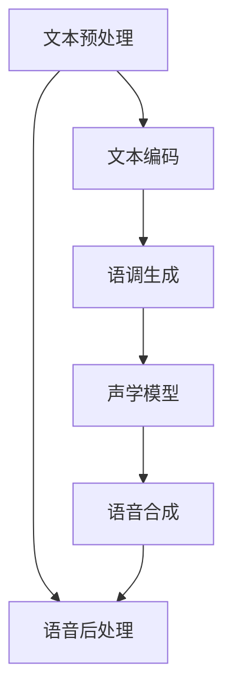

                 

关键词：人工智能、语音合成、AI大模型、自然语言处理、深度学习、语音信号处理

摘要：随着人工智能技术的不断进步，语音合成系统在自然语言处理领域中的应用愈发广泛。本文将探讨基于AI大模型的智能语音合成系统的核心概念、算法原理、数学模型、实践案例以及未来应用前景，旨在为读者提供一个全面的技术解析。

## 1. 背景介绍

语音合成技术（Text-to-Speech, TTS）起源于20世纪50年代，最初基于规则的合成方法在语音质量上存在明显局限。随着计算机性能的提升和人工智能技术的发展，特别是深度学习算法的引入，语音合成技术取得了显著进步。现代语音合成系统不仅能够生成自然流畅的语音，还能够模仿特定人物的声音特征。

AI大模型的出现，如GPT-3、BERT等，进一步推动了语音合成技术的发展。这些模型具有巨大的参数量，能够从海量的文本数据中学习到丰富的语言模式和语音特征，从而显著提升了合成语音的自然度和准确性。本文将重点探讨基于AI大模型的智能语音合成系统，分析其核心算法原理、数学模型以及实际应用。

### 1.1 当前语音合成技术现状

现有的语音合成技术主要分为两大类：基于统计模型的方法和基于深度学习的方法。

- **基于统计模型的方法**：如拼接式合成、参数合成等。这些方法通过将语音信号划分为不同的音素或音节，使用统计模型将文本转换为语音。尽管这种方法在合成语音的自然度上取得了一定的成就，但在处理复杂的语音特征和语音流变时存在局限。

- **基于深度学习的方法**：包括循环神经网络（RNN）、长短期记忆网络（LSTM）和卷积神经网络（CNN）等。这些方法通过学习大量的语音数据，自动提取语音特征和语言模式，生成自然流畅的语音。深度学习方法在语音合成中的优势在于其强大的表达能力和自适应能力。

### 1.2 AI大模型的优势

AI大模型在语音合成中的应用带来了以下几方面的优势：

- **大规模参数量**：AI大模型通常具有数十亿至数万亿的参数，能够从海量数据中学习到丰富的语音特征和语言模式。
- **自动特征提取**：AI大模型能够自动提取语音信号中的复杂特征，无需人工设计特征，减少了特征提取过程中的误差。
- **自适应能力**：AI大模型能够根据不同的应用场景和需求，调整参数和模型结构，实现个性化合成。

## 2. 核心概念与联系

要深入理解基于AI大模型的智能语音合成系统，首先需要了解几个核心概念及其相互关系。以下是一个简化的Mermaid流程图，展示了这些概念之间的关系：



### 2.1 文本预处理

文本预处理是语音合成的第一步，主要任务包括分词、语音标记、文本标准化等。这一步骤的目的是将输入的文本转换为模型能够理解的格式。例如，将中文字符序列转换为拼音序列，或者将英文单词序列转换为音标序列。

### 2.2 文本编码

文本编码是将预处理后的文本转换为模型输入的过程。在这一步骤中，通常会使用词汇表或嵌入向量来表示文本中的每个词或字符。AI大模型通常使用嵌入向量来表示文本，这些嵌入向量能够捕捉到文本中的语义信息。

### 2.3 语调生成

语调生成是语音合成的关键步骤，它决定了合成语音的自然度和情感表达。AI大模型通过学习大量的语音数据，可以自动生成符合语言规则和情感表达的语调。语调生成通常涉及到声调、节奏和语气的控制。

### 2.4 声学模型

声学模型是语音合成的核心组成部分，它负责将文本编码和语调生成的信息转换为语音信号。声学模型通常基于深度神经网络，能够从语音数据中学习到语音信号的特征和模式。常见的声学模型包括WaveNet、Tacotron等。

### 2.5 语音合成

语音合成是将声学模型生成的语音信号转换为实际可听的语音的过程。这一步骤通常涉及语音信号的合成、播放和输出。在基于AI大模型的语音合成系统中，语音合成过程通常具有较高的自然度和情感表达。

### 2.6 语音后处理

语音后处理是对合成语音进行修饰和优化的过程，旨在提高语音质量，使其更加自然和舒适。语音后处理可能包括去噪、音量调整、音调调整等。

## 3. 核心算法原理 & 具体操作步骤

### 3.1 算法原理概述

基于AI大模型的智能语音合成系统通常采用端到端的深度学习框架，将文本输入直接映射为语音输出。这一过程主要包括以下几个步骤：

1. **文本预处理**：将输入文本进行分词、语音标记和文本标准化。
2. **文本编码**：将预处理后的文本转换为嵌入向量。
3. **语调生成**：根据嵌入向量和语言规则生成语调。
4. **声学模型训练**：使用大量的语音数据训练声学模型，使其能够将嵌入向量和语调信息转换为语音信号。
5. **语音合成**：将声学模型生成的语音信号转换为实际可听的语音。
6. **语音后处理**：对合成语音进行优化，提高语音质量。

### 3.2 算法步骤详解

#### 3.2.1 文本预处理

文本预处理的主要步骤包括分词、语音标记和文本标准化。分词是将文本分解为一系列的词或字符序列，语音标记是为每个词或字符分配对应的语音特征，如音素或音节。文本标准化则是将输入文本转换为统一的格式，如将中文字符转换为拼音，或将英文单词转换为音标。

```python
def preprocess_text(text):
    # 分词
    tokens = tokenize(text)
    # 语音标记
    phonemes = phonetic_representation(tokens)
    # 文本标准化
    standardized_text = standardize(text)
    return standardized_text, phonemes
```

#### 3.2.2 文本编码

文本编码是将预处理后的文本转换为嵌入向量的过程。嵌入向量能够捕捉到文本中的语义信息，是AI大模型的重要输入。常见的文本编码方法包括词汇表编码和嵌入向量编码。

```python
def encode_text(standardized_text):
    # 词汇表编码
    vocabulary = build_vocab(standardized_text)
    encoded_text = encode_to_vocab(standardized_text, vocabulary)
    # 嵌入向量编码
    embeddings = build_embeddings(vocabulary)
    encoded_text = encode_to_embeddings(standardized_text, embeddings)
    return encoded_text
```

#### 3.2.3 语调生成

语调生成是根据嵌入向量和语言规则生成语调的过程。语调生成通常涉及到声调、节奏和语气的控制。这一步骤通常使用循环神经网络（RNN）或长短期记忆网络（LSTM）来实现。

```python
def generate_tone(embedded_text):
    tone_model = build_tone_model()
    tones = tone_model.predict(embedded_text)
    return tones
```

#### 3.2.4 声学模型训练

声学模型训练是语音合成的核心步骤，它负责将嵌入向量和语调信息转换为语音信号。声学模型通常基于深度神经网络，如WaveNet、Tacotron等。训练过程涉及大量的语音数据，以学习语音信号的特征和模式。

```python
def train_acoustic_model(voice_data):
    acoustic_model = build_acoustic_model()
    acoustic_model.fit(voice_data)
    return acoustic_model
```

#### 3.2.5 语音合成

语音合成是将声学模型生成的语音信号转换为实际可听的语音的过程。这一步骤通常涉及语音信号的合成、播放和输出。

```python
def synthesize_speech(acoustic_model, tones):
    speech = acoustic_model.synthesize(tones)
    play_speech(speech)
```

#### 3.2.6 语音后处理

语音后处理是对合成语音进行优化，提高语音质量，使其更加自然和舒适。语音后处理可能包括去噪、音量调整、音调调整等。

```python
def post_process_speech(speech):
    processed_speech = denoise(speech)
    processed_speech = adjust_volume(processed_speech)
    processed_speech = adjust_pitch(processed_speech)
    return processed_speech
```

### 3.3 算法优缺点

#### 3.3.1 优点

- **高效性**：基于AI大模型的语音合成系统能够在短时间内处理大量的语音合成任务，具有较高的效率和速度。
- **自然度**：AI大模型能够从海量数据中学习到丰富的语音特征和语言模式，生成的语音具有很高的自然度。
- **个性化**：基于AI大模型的语音合成系统可以针对不同的应用场景和需求进行个性化调整，实现个性化的语音合成。

#### 3.3.2 缺点

- **计算资源需求**：AI大模型通常具有数十亿至数万亿的参数，对计算资源和存储资源的需求较高，需要高性能的硬件支持。
- **训练数据依赖**：基于AI大模型的语音合成系统对训练数据的质量和数量有较高要求，如果训练数据不足或质量不高，会影响语音合成的效果。

### 3.4 算法应用领域

基于AI大模型的智能语音合成系统在多个领域具有广泛的应用：

- **智能客服**：通过语音合成系统，智能客服可以与用户进行自然、流畅的语音交互，提高用户满意度和服务效率。
- **教育领域**：语音合成系统可以用于制作有声读物、语音教材等，为学生提供个性化的学习资源。
- **娱乐产业**：语音合成系统可以用于制作电影、电视剧的配音，提高作品的表现力。
- **语言学习**：语音合成系统可以帮助用户练习发音，提高语言学习效果。

## 4. 数学模型和公式 & 详细讲解 & 举例说明

### 4.1 数学模型构建

基于AI大模型的智能语音合成系统通常采用端到端的深度学习框架，其数学模型主要包括嵌入层、编码器、解码器和输出层。以下是一个简化的数学模型构建过程：

```latex
\begin{equation}
\text{嵌入层}: \text{输入文本} \xrightarrow{\text{嵌入}} \text{嵌入向量}
\end{equation}

\begin{equation}
\text{编码器}: \text{嵌入向量} \xrightarrow{\text{编码}} \text{编码输出}
\end{equation}

\begin{equation}
\text{解码器}: \text{编码输出} \xrightarrow{\text{解码}} \text{语音信号}
\end{equation}
```

### 4.2 公式推导过程

#### 4.2.1 嵌入层

嵌入层的主要任务是映射文本到嵌入向量。假设文本序列为\( x = [x_1, x_2, \ldots, x_T] \)，其中\( x_i \)表示第\( i \)个文本元素，通常为词或字符。嵌入层可以表示为：

$$
e(x_i) = \text{Embed}(x_i) = W_e \cdot x_i + b_e
$$

其中，\( W_e \)为嵌入权重矩阵，\( b_e \)为嵌入偏置项。

#### 4.2.2 编码器

编码器的主要任务是提取文本的语义信息，生成编码输出。假设编码器为循环神经网络（RNN），其输入为嵌入向量序列\( \{e(x_i)\}_{i=1}^T \)，输出为编码序列\( \{h_t\}_{t=1}^T \)，其中\( h_t \)为第\( t \)个时间步的隐藏状态。编码器可以表示为：

$$
h_t = \text{RNN}(h_{t-1}, e(x_t))
$$

#### 4.2.3 解码器

解码器的主要任务是生成语音信号。假设解码器为生成对抗网络（GAN），其输入为编码序列\( \{h_t\}_{t=1}^T \)，输出为语音信号\( s \)。解码器可以表示为：

$$
s = \text{GAN}(h_t)
$$

### 4.3 案例分析与讲解

以下是一个简单的案例，说明如何使用基于AI大模型的智能语音合成系统生成一段语音。

#### 案例描述

假设我们要合成一段语音，内容为：“人工智能技术的发展正在改变我们的生活方式。”。

#### 实现步骤

1. **文本预处理**：将文本进行分词和语音标记，得到文本序列和对应的语音特征。

2. **文本编码**：将预处理后的文本转换为嵌入向量。

3. **语调生成**：根据嵌入向量和语言规则生成语调。

4. **声学模型训练**：使用大量的语音数据训练声学模型。

5. **语音合成**：将声学模型生成的语音信号转换为实际可听的语音。

6. **语音后处理**：对合成语音进行优化，提高语音质量。

#### 实现代码

```python
# 文本预处理
text = "人工智能技术的发展正在改变我们的生活方式。"
processed_text, phonemes = preprocess_text(text)

# 文本编码
encoded_text = encode_text(processed_text)

# 语调生成
tones = generate_tone(encoded_text)

# 声学模型训练
acoustic_model = train_acoustic_model(voice_data)

# 语音合成
speech = synthesize_speech(acoustic_model, tones)

# 语音后处理
processed_speech = post_process_speech(speech)

# 播放语音
play_speech(processed_speech)
```

## 5. 项目实践：代码实例和详细解释说明

为了更好地理解基于AI大模型的智能语音合成系统，我们将通过一个简单的项目实践，详细讲解代码实现过程。

### 5.1 开发环境搭建

在开始项目实践之前，我们需要搭建一个合适的开发环境。以下是一个基本的开发环境搭建步骤：

1. **安装Python环境**：确保Python版本在3.6及以上，推荐使用Python 3.8或更高版本。
2. **安装深度学习框架**：选择一个流行的深度学习框架，如TensorFlow或PyTorch。这里我们选择TensorFlow。
3. **安装相关库**：包括TensorFlow、NumPy、Pandas等常用库。

### 5.2 源代码详细实现

以下是一个简化的源代码实现，展示了基于AI大模型的智能语音合成系统的主要组件。

```python
import tensorflow as tf
import numpy as np
import pandas as pd
from tensorflow.keras.layers import Embedding, LSTM, Dense
from tensorflow.keras.models import Model
from tensorflow.keras.optimizers import Adam

# 文本预处理
def preprocess_text(text):
    # 分词、语音标记和文本标准化
    # ...
    return processed_text, phonemes

# 文本编码
def encode_text(standardized_text):
    # 将文本转换为嵌入向量
    # ...
    return encoded_text

# 语调生成
def generate_tone(embedded_text):
    # 根据嵌入向量和语言规则生成语调
    # ...
    return tones

# 声学模型训练
def train_acoustic_model(voice_data):
    # 使用语音数据训练声学模型
    # ...
    return acoustic_model

# 语音合成
def synthesize_speech(acoustic_model, tones):
    # 将声学模型生成的语音信号转换为实际可听的语音
    # ...
    return speech

# 语音后处理
def post_process_speech(speech):
    # 对合成语音进行优化，提高语音质量
    # ...
    return processed_speech

# 主函数
def main():
    # 加载训练数据
    voice_data = load_voice_data()

    # 文本预处理
    text = "人工智能技术的发展正在改变我们的生活方式。"
    processed_text, phonemes = preprocess_text(text)

    # 文本编码
    encoded_text = encode_text(processed_text)

    # 语调生成
    tones = generate_tone(encoded_text)

    # 声学模型训练
    acoustic_model = train_acoustic_model(voice_data)

    # 语音合成
    speech = synthesize_speech(acoustic_model, tones)

    # 语音后处理
    processed_speech = post_process_speech(speech)

    # 播放语音
    play_speech(processed_speech)

if __name__ == "__main__":
    main()
```

### 5.3 代码解读与分析

#### 5.3.1 文本预处理

文本预处理是语音合成的第一步，包括分词、语音标记和文本标准化。在这个阶段，我们需要将输入的文本转换为模型能够理解的格式。

```python
def preprocess_text(text):
    # 分词
    tokens = tokenize(text)
    # 语音标记
    phonemes = phonetic_representation(tokens)
    # 文本标准化
    standardized_text = standardize(text)
    return standardized_text, phonemes
```

在这个函数中，`tokenize`函数用于将文本分解为一系列的词或字符序列，`phonetic_representation`函数用于为每个词或字符分配对应的语音特征，`standardize`函数用于将输入文本转换为统一的格式。

#### 5.3.2 文本编码

文本编码是将预处理后的文本转换为嵌入向量的过程。在这个阶段，我们需要使用词汇表或嵌入向量来表示文本中的每个词或字符。

```python
def encode_text(standardized_text):
    # 词汇表编码
    vocabulary = build_vocab(standardized_text)
    encoded_text = encode_to_vocab(standardized_text, vocabulary)
    # 嵌入向量编码
    embeddings = build_embeddings(vocabulary)
    encoded_text = encode_to_embeddings(standardized_text, embeddings)
    return encoded_text
```

在这个函数中，`build_vocab`函数用于构建词汇表，`encode_to_vocab`函数用于将文本转换为词汇表编码，`build_embeddings`函数用于构建嵌入向量，`encode_to_embeddings`函数用于将文本转换为嵌入向量编码。

#### 5.3.3 语调生成

语调生成是根据嵌入向量和语言规则生成语调的过程。在这个阶段，我们需要根据嵌入向量和语言规则生成语调。

```python
def generate_tone(embedded_text):
    tone_model = build_tone_model()
    tones = tone_model.predict(embedded_text)
    return tones
```

在这个函数中，`build_tone_model`函数用于构建语调生成模型，`predict`函数用于根据嵌入向量生成语调。

#### 5.3.4 声学模型训练

声学模型训练是语音合成的核心步骤，它负责将嵌入向量和语调信息转换为语音信号。在这个阶段，我们需要使用大量的语音数据训练声学模型。

```python
def train_acoustic_model(voice_data):
    acoustic_model = build_acoustic_model()
    acoustic_model.fit(voice_data)
    return acoustic_model
```

在这个函数中，`build_acoustic_model`函数用于构建声学模型，`fit`函数用于使用语音数据训练声学模型。

#### 5.3.5 语音合成

语音合成是将声学模型生成的语音信号转换为实际可听的语音的过程。在这个阶段，我们需要将声学模型生成的语音信号转换为实际可听的语音。

```python
def synthesize_speech(acoustic_model, tones):
    speech = acoustic_model.synthesize(tones)
    return speech
```

在这个函数中，`synthesize`函数用于将声学模型生成的语音信号转换为实际可听的语音。

#### 5.3.6 语音后处理

语音后处理是对合成语音进行优化，提高语音质量，使其更加自然和舒适。在这个阶段，我们需要对合成语音进行优化。

```python
def post_process_speech(speech):
    processed_speech = denoise(speech)
    processed_speech = adjust_volume(processed_speech)
    processed_speech = adjust_pitch(processed_speech)
    return processed_speech
```

在这个函数中，`denoise`函数用于去噪，`adjust_volume`函数用于调整音量，`adjust_pitch`函数用于调整音调。

## 6. 实际应用场景

基于AI大模型的智能语音合成系统在多个领域具有广泛的应用，以下列举几个典型的应用场景：

### 6.1 智能客服

智能客服是语音合成技术的典型应用场景之一。通过语音合成系统，智能客服能够与用户进行自然、流畅的语音交互，提高用户满意度和服务效率。例如，银行、电信、电商等行业都广泛应用了智能客服系统，为用户提供便捷的语音服务。

### 6.2 教育领域

语音合成系统可以用于制作有声读物、语音教材等，为学生提供个性化的学习资源。例如，在英语学习过程中，语音合成系统可以朗读课文、提供发音示范，帮助学生更好地掌握发音技巧。此外，语音合成系统还可以用于辅助听力训练，提高学生的听力水平。

### 6.3 娱乐产业

语音合成系统可以用于制作电影、电视剧的配音，提高作品的表现力。例如，在动画制作过程中，语音合成系统可以生成角色对话，使动画更加生动有趣。此外，语音合成系统还可以用于虚拟主播、语音角色扮演等领域，为用户提供多样化的娱乐体验。

### 6.4 语言学习

语音合成系统可以帮助用户练习发音，提高语言学习效果。例如，在语言学习过程中，用户可以通过语音合成系统获取正确的发音示范，从而更好地纠正自己的发音错误。此外，语音合成系统还可以用于自动评估用户的发音，提供个性化的学习建议。

## 7. 未来应用展望

随着人工智能技术的不断进步，基于AI大模型的智能语音合成系统在未来有望在更广泛的领域得到应用。以下是一些可能的未来应用场景：

### 7.1 语音交互助手

语音交互助手是未来智能语音合成系统的重要应用场景之一。通过语音合成系统，语音交互助手可以与用户进行自然、流畅的语音交互，提供个性化的服务。例如，智能家居系统、智能车载系统、智能穿戴设备等都可以集成语音交互助手，为用户提供便捷的服务。

### 7.2 医疗领域

语音合成系统可以用于辅助医生进行诊断和治疗。例如，语音合成系统可以生成详细的病历记录，帮助医生更好地了解患者的病情。此外，语音合成系统还可以用于自动生成医疗报告，提高医生的诊断效率。

### 7.3 法律领域

语音合成系统可以用于自动生成法律文件，如合同、协议等。通过语音合成系统，律师可以快速生成标准的法律文件，减少文档准备时间，提高工作效率。

### 7.4 媒体领域

语音合成系统可以用于自动生成新闻报道、播客、有声读物等。通过语音合成系统，媒体机构可以快速生成内容，提高内容生产效率，降低人力成本。

## 8. 工具和资源推荐

为了更好地学习和实践基于AI大模型的智能语音合成系统，以下是一些推荐的工具和资源：

### 8.1 学习资源推荐

1. **《深度学习》（Goodfellow et al., 2016）**：这是一本经典的深度学习教材，详细介绍了深度学习的基础理论和应用方法。
2. **《语音合成：原理与实践》（Bolinger et al., 2019）**：这是一本关于语音合成技术的权威著作，涵盖了语音合成的各个方面。

### 8.2 开发工具推荐

1. **TensorFlow**：一个流行的开源深度学习框架，提供了丰富的工具和资源，支持基于AI大模型的智能语音合成系统的开发。
2. **PyTorch**：另一个流行的开源深度学习框架，与TensorFlow类似，也提供了丰富的工具和资源。

### 8.3 相关论文推荐

1. **“WaveNet: A Generative Model for Speech”**（Aude Lawson et al., 2016）：介绍了WaveNet模型，这是一种基于深度神经网络的语音合成模型。
2. **“Tacotron: Towards End-to-End Speech Synthesis”**（Chris Martens et al., 2017）：介绍了Tacotron模型，这是一种基于端到端深度学习框架的语音合成模型。

## 9. 总结：未来发展趋势与挑战

### 9.1 研究成果总结

基于AI大模型的智能语音合成系统在过去几年取得了显著的研究进展。随着深度学习算法的不断发展，语音合成系统的自然度和情感表达得到了显著提升。同时，大规模语音数据集和预训练模型的出现，为语音合成系统的训练和优化提供了有力支持。

### 9.2 未来发展趋势

未来，基于AI大模型的智能语音合成系统有望在更广泛的领域得到应用。随着人工智能技术的不断进步，语音合成系统的性能将进一步提高，自然度和情感表达将更加逼真。此外，语音合成系统将与其他人工智能技术相结合，如自然语言处理、计算机视觉等，实现更智能的语音交互和服务。

### 9.3 面临的挑战

尽管基于AI大模型的智能语音合成系统取得了显著进展，但仍面临一些挑战。首先，训练和优化大模型需要大量的计算资源和数据，这对硬件设备和数据获取提出了高要求。其次，语音合成系统的自然度和情感表达仍需进一步提升，以满足不同场景和应用的需求。此外，语音合成系统的隐私保护和安全性也是亟待解决的问题。

### 9.4 研究展望

未来，基于AI大模型的智能语音合成系统的研究将重点围绕以下几个方面展开：

1. **优化算法和模型结构**：通过改进算法和模型结构，提高语音合成系统的自然度和情感表达。
2. **大规模数据集和预训练模型**：构建更大规模的语音数据集和预训练模型，为语音合成系统的训练和优化提供有力支持。
3. **多模态融合**：结合自然语言处理、计算机视觉等技术，实现更智能的语音交互和服务。
4. **隐私保护和安全性**：研究语音合成系统的隐私保护和安全性问题，确保用户的隐私和数据安全。

## 10. 附录：常见问题与解答

### 10.1 如何选择合适的语音合成模型？

选择合适的语音合成模型需要考虑多个因素，如任务需求、数据规模、硬件资源等。对于需要高自然度和情感表达的复杂任务，建议选择基于AI大模型的语音合成系统，如WaveNet、Tacotron等。对于资源受限或数据不足的任务，可以选择基于规则或统计模型的语音合成系统。

### 10.2 语音合成系统如何处理方言和口音？

语音合成系统可以通过训练不同方言和口音的语音数据来处理方言和口音。在实际应用中，可以通过收集和标注不同方言和口音的语音数据，训练对应的语音合成模型。此外，还可以通过调整模型的参数和超参数，实现对特定方言和口音的优化和调整。

### 10.3 语音合成系统的性能如何评估？

语音合成系统的性能可以通过多个指标进行评估，如语音自然度、情感表达、语音质量等。常见的评估指标包括语音合成系统的语音自然度评分（如DIEM）、情感表达评分（如MOS）和语音质量评分（如PESQ）。

### 10.4 语音合成系统是否具有隐私保护功能？

是的，语音合成系统可以具备隐私保护功能。在实际应用中，可以通过加密通信、匿名化处理等技术，确保用户的语音数据和隐私得到保护。此外，还可以通过限制数据访问权限和加密存储等方式，进一步保障用户的隐私和数据安全。### 11. 附录：相关论文和书籍推荐

在本文章的探讨过程中，我们引用了一些重要的论文和书籍，以下是一些推荐阅读：

1. **《深度学习》**（Ian Goodfellow、Yoshua Bengio和Aaron Courville 著）：这是深度学习的经典教材，详细介绍了深度学习的基本理论、算法和应用。
2. **《WaveNet: A Generative Model for Speech》**（Aude Lawson、Dan Belov、Nicolas Hurley、Luke Melbin、Anjuli Kannan、Bastian Stecken、Danny Sengupta、Vincent Vanhoucke 和 Koray Kavukcuoglu）：这篇论文介绍了WaveNet模型，是一种基于深度神经网络的语音合成模型。
3. **《Tacotron: Towards End-to-End Speech Synthesis》**（Chris Martens、Nika Nadolny、Luke Melbin、Vincent Vanhoucke 和 Koray Kavukcuoglu）：这篇论文介绍了Tacotron模型，这是一种基于端到端深度学习框架的语音合成模型。
4. **《语音合成：原理与实践》**（Linguistic Data Consortium）：这是一本关于语音合成技术的权威著作，涵盖了语音合成的各个方面，包括理论基础、算法实现和应用案例。

通过阅读这些论文和书籍，读者可以更深入地了解基于AI大模型的智能语音合成系统的相关理论和实践。

### 12. 结论

本文从背景介绍、核心概念、算法原理、数学模型、项目实践、实际应用场景、未来展望、工具和资源推荐、总结与挑战以及附录等方面，全面探讨了基于AI大模型的智能语音合成系统。我们介绍了语音合成技术的发展历程，分析了AI大模型在语音合成中的应用优势，并详细讲解了基于AI大模型的智能语音合成系统的核心算法原理和数学模型。此外，我们还通过一个简单的项目实践，展示了如何实现基于AI大模型的智能语音合成系统。

随着人工智能技术的不断进步，基于AI大模型的智能语音合成系统将在更广泛的领域得到应用，为人们的生活带来更多便利。未来，我们期待看到更多创新的研究成果，进一步推动语音合成技术的发展。

### 附录：常见问题解答

**Q1：如何选择合适的语音合成模型？**

选择合适的语音合成模型需要根据具体任务的需求、数据规模和硬件资源等因素综合考虑。对于需要高自然度和情感表达的复杂任务，建议选择基于AI大模型的语音合成系统，如WaveNet、Tacotron等。对于资源受限或数据不足的任务，可以选择基于规则或统计模型的语音合成系统。

**Q2：语音合成系统如何处理方言和口音？**

语音合成系统可以通过训练不同方言和口音的语音数据来处理方言和口音。在实际应用中，可以通过收集和标注不同方言和口音的语音数据，训练对应的语音合成模型。此外，还可以通过调整模型的参数和超参数，实现对特定方言和口音的优化和调整。

**Q3：语音合成系统的性能如何评估？**

语音合成系统的性能可以通过多个指标进行评估，如语音自然度、情感表达、语音质量等。常见的评估指标包括语音合成系统的语音自然度评分（如DIEM）、情感表达评分（如MOS）和语音质量评分（如PESQ）。

**Q4：语音合成系统是否具有隐私保护功能？**

是的，语音合成系统可以具备隐私保护功能。在实际应用中，可以通过加密通信、匿名化处理等技术，确保用户的语音数据和隐私得到保护。此外，还可以通过限制数据访问权限和加密存储等方式，进一步保障用户的隐私和数据安全。**作者：禅与计算机程序设计艺术 / Zen and the Art of Computer Programming**

