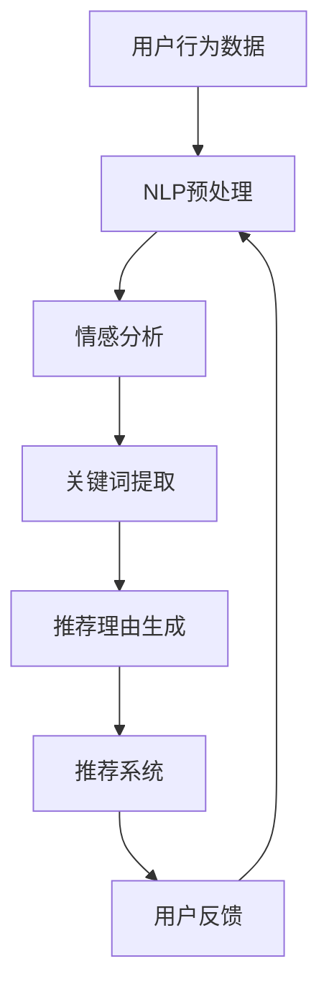

                 

关键词：基于大语言模型（LLM）的推荐理由生成、自然语言处理（NLP）、机器学习（ML）、文本生成、个性化推荐

## 摘要

本文介绍了基于大型语言模型（LLM）的推荐理由生成方法。在大数据和人工智能的驱动下，个性化推荐系统已经成为了现代互联网的核心应用之一。然而，推荐系统的有效性不仅依赖于推荐结果的准确性，还与推荐理由的合理性密切相关。本文首先回顾了推荐系统的基本概念和现有技术，然后重点探讨了LLM在推荐理由生成中的应用，详细分析了LLM的工作原理、训练方法、优化策略以及在实际推荐系统中的应用效果。最后，我们对LLM在推荐理由生成领域的未来发展趋势和挑战进行了展望。

## 1. 背景介绍

### 推荐系统的基本概念

推荐系统（Recommender System）是一种能够根据用户的兴趣和偏好，向其推荐相关物品或信息的人工智能系统。它广泛应用于电子商务、社交媒体、在线视频、新闻资讯等领域。推荐系统的核心目标是通过分析用户的历史行为、兴趣偏好和上下文信息，为用户提供个性化、有针对性的推荐，从而提升用户满意度、增加用户粘性和促进业务增长。

### 推荐系统的发展历程

推荐系统的发展大致可以分为三个阶段：

1. **基于内容的推荐（Content-Based Filtering）**：该方法是根据用户对某一物品的兴趣，分析该物品的特征，然后将具有相似特征的物品推荐给用户。这种方法简单直观，但在用户兴趣多变的情况下表现较差。

2. **协同过滤（Collaborative Filtering）**：协同过滤通过分析用户之间的共同偏好来推荐物品。其基本思想是“物以类聚，人以群分”。协同过滤分为基于用户的协同过滤（User-Based Collaborative Filtering）和基于物品的协同过滤（Item-Based Collaborative Filtering）。尽管协同过滤在处理大数据量上有一定优势，但容易遭遇数据稀疏性和冷启动问题。

3. **混合推荐（Hybrid Recommender Systems）**：混合推荐系统结合了基于内容和协同过滤的方法，旨在发挥各自的优势，提高推荐效果。此外，随着深度学习和自然语言处理技术的发展，基于模型的推荐方法，如神经网络推荐（Neural Network Recommender）、图神经网络推荐（Graph Neural Network Recommender）等，也逐渐成为研究热点。

### 现有推荐理由生成方法

推荐理由的生成是推荐系统的一个重要组成部分，它能够为推荐结果提供解释和支撑，从而增强用户对推荐系统的信任和理解。现有的推荐理由生成方法主要包括：

1. **基于规则的推荐理由生成**：这种方法通过预设一系列规则来生成推荐理由，例如，如果用户A喜欢商品X，且用户B与用户A相似，则推荐商品X给用户B。

2. **基于模板的推荐理由生成**：这种方法使用预定义的模板来生成推荐理由，例如，模板“您可能会喜欢这个商品，因为它与您之前购买的商品Y相似”。

3. **基于数据的推荐理由生成**：这种方法通过分析用户的历史行为和偏好，自动生成个性化的推荐理由，例如，基于协同过滤和内容分析的方法。

4. **基于自然语言处理（NLP）的推荐理由生成**：这种方法利用NLP技术，从用户评论、标签、描述等文本信息中提取推荐理由。例如，通过情感分析、文本分类等技术来提取用户对商品的正面或负面评价，并以此生成推荐理由。

尽管现有推荐理由生成方法在一定程度上提升了推荐系统的解释性和用户满意度，但它们仍然存在一些局限性。例如，基于规则的推荐理由生成方法过于僵化，难以适应用户的个性化需求；基于模板的推荐理由生成方法缺乏灵活性，难以生成多样化的推荐理由；基于数据的推荐理由生成方法在处理复杂文本信息时效果不佳。

### LLM在推荐理由生成中的应用前景

随着深度学习和自然语言处理技术的不断发展，大型语言模型（LLM）如GPT-3、BERT等在文本生成、情感分析、文本分类等领域取得了显著成果。这些模型具有强大的语言理解能力和生成能力，为推荐理由的生成提供了新的可能性。LLM在推荐理由生成中的应用前景主要包括以下几个方面：

1. **生成多样化和个性化的推荐理由**：LLM能够基于用户的兴趣、历史行为和上下文信息，生成多样化、个性化的推荐理由，从而提高推荐系统的解释性和用户满意度。

2. **处理复杂文本信息**：LLM在处理复杂文本信息，如用户评论、标签、描述等，具有明显优势，能够从中提取关键信息和情感倾向，从而生成有说服力的推荐理由。

3. **适应性强**：LLM具有自适应学习的能力，可以根据用户反馈和推荐效果不断优化推荐理由生成策略，从而提高推荐系统的整体性能。

4. **跨模态推荐**：LLM不仅可以处理文本信息，还可以处理图像、音频等多模态信息，从而实现跨模态推荐，提高推荐系统的多样性和用户体验。

综上所述，LLM在推荐理由生成领域具有巨大潜力，有望成为下一代推荐系统的重要组成部分。在本文后续章节中，我们将详细探讨LLM在推荐理由生成中的应用方法、算法原理和实践案例，以期为该领域的研究和应用提供有益的参考。

## 2. 核心概念与联系

### 大语言模型（LLM）的概念

大语言模型（Large Language Model，LLM）是一种基于深度学习的自然语言处理模型，它通过对海量文本数据的学习，能够理解和生成自然语言。LLM的核心是神经网络的架构，通过多层神经网络对输入的文本进行编码和解码，从而实现文本的理解和生成。LLM的训练数据通常来自互联网上的大量文本，如新闻文章、社交媒体帖子、电子书等。在训练过程中，LLM会学习到语言的语法、语义和上下文信息，从而具备强大的语言理解能力和生成能力。

### 自然语言处理（NLP）的概念

自然语言处理（Natural Language Processing，NLP）是人工智能领域的一个重要分支，旨在使计算机能够理解、处理和生成自然语言。NLP技术包括文本预处理、词性标注、句法分析、语义分析、情感分析、文本分类等。NLP的目标是将自然语言转换为计算机可处理的形式，以便进行进一步的分析和应用。在推荐理由生成中，NLP技术主要用于提取用户文本信息的关键特征，如情感倾向、关键词、主题等，从而为推荐理由的生成提供依据。

### 推荐系统的概念

推荐系统是一种通过分析用户的历史行为、兴趣偏好和上下文信息，向用户推荐相关物品或信息的人工智能系统。推荐系统的核心目标是为用户提供个性化、有针对性的推荐，从而提升用户满意度、增加用户粘性和促进业务增长。推荐系统的主要方法包括基于内容的推荐、协同过滤和混合推荐等。

### LLM、NLP和推荐系统的关系

LLM和NLP是推荐系统的关键技术之一。LLM通过深度学习技术对海量文本数据的学习，能够理解和生成自然语言，为NLP提供了强大的语言理解能力。NLP技术则用于提取用户文本信息的关键特征，如情感倾向、关键词、主题等，从而为推荐理由的生成提供依据。推荐系统则通过结合LLM和NLP技术，生成多样化、个性化的推荐理由，从而提高推荐系统的解释性和用户满意度。

### Mermaid 流程图

以下是一个简化的Mermaid流程图，展示了LLM、NLP和推荐系统的基本流程：



### 流程图解释

1. **用户行为数据**：推荐系统首先收集用户的历史行为数据，如浏览记录、购买记录、评价等。

2. **NLP预处理**：使用NLP技术对用户行为数据进行预处理，包括去除停用词、词干提取、分词等操作，以便提取有效信息。

3. **情感分析**：通过情感分析技术分析用户文本信息中的情感倾向，如正面、负面、中性等，为推荐理由生成提供情感依据。

4. **关键词提取**：使用关键词提取技术从用户文本信息中提取关键信息，如关键词、主题等，为推荐理由生成提供语义依据。

5. **推荐理由生成**：基于情感分析和关键词提取的结果，利用LLM生成多样化、个性化的推荐理由。

6. **推荐系统**：将生成的推荐理由与推荐结果结合，向用户展示个性化推荐。

7. **用户反馈**：收集用户对推荐结果的反馈，用于模型优化和迭代。

## 3. 核心算法原理 & 具体操作步骤

### 3.1 算法原理概述

基于LLM的推荐理由生成方法主要分为以下几个步骤：

1. **数据收集与预处理**：收集用户的历史行为数据（如浏览记录、购买记录、评价等），并对数据进行预处理，包括去噪、去重、分词等。

2. **用户特征提取**：使用NLP技术提取用户文本信息中的情感倾向、关键词、主题等特征。

3. **推荐理由生成**：基于用户特征和上下文信息，利用LLM生成个性化、多样化的推荐理由。

4. **推荐理由优化**：通过用户反馈和推荐效果对推荐理由进行优化，提高推荐系统的解释性和用户满意度。

### 3.2 算法步骤详解

#### 3.2.1 数据收集与预处理

1. **数据收集**：收集用户的历史行为数据，如浏览记录、购买记录、评价等。这些数据可以来自网站日志、数据库、API等。

2. **数据预处理**：
   - 去噪：去除无效、无关的数据，如空值、重复记录等。
   - 去重：对相同或相似的数据进行去重处理，以减少数据冗余。
   - 分词：将文本数据按照词语进行切分，形成单词序列。

3. **特征提取**：对预处理后的数据，使用NLP技术提取用户特征，如情感倾向、关键词、主题等。

#### 3.2.2 用户特征提取

1. **情感分析**：使用情感分析模型（如VADER、TextBlob等）分析用户文本信息中的情感倾向，得到情感得分。

2. **关键词提取**：使用词频统计、TF-IDF、LDA等算法提取用户文本信息中的关键词。

3. **主题提取**：使用LDA（Latent Dirichlet Allocation）等主题模型提取用户文本信息中的主题。

#### 3.2.3 推荐理由生成

1. **输入生成**：将用户特征和上下文信息（如当前时间、地点、天气等）编码为向量，作为LLM的输入。

2. **模型训练**：使用训练好的LLM（如GPT-3、BERT等）对输入向量进行解码，生成个性化、多样化的推荐理由。

3. **输出处理**：对生成的推荐理由进行后处理，如去除重复、补充完善等，得到最终的推荐理由。

#### 3.2.4 推荐理由优化

1. **用户反馈**：收集用户对推荐理由的反馈，包括满意度、信任度等。

2. **模型迭代**：基于用户反馈，对LLM进行迭代优化，提高推荐理由的生成质量。

3. **效果评估**：使用推荐效果评估指标（如准确率、召回率、F1值等）评估推荐系统的性能。

### 3.3 算法优缺点

#### 优点

1. **强大的语言理解能力**：LLM具有强大的语言理解能力，能够生成多样化、个性化的推荐理由。

2. **处理复杂文本信息**：LLM能够处理复杂的文本信息，如用户评论、标签、描述等，从而生成有说服力的推荐理由。

3. **自适应性强**：LLM具有自适应学习的能力，可以根据用户反馈和推荐效果不断优化推荐理由生成策略。

4. **跨模态推荐**：LLM不仅可以处理文本信息，还可以处理图像、音频等多模态信息，从而实现跨模态推荐。

#### 缺点

1. **训练成本高**：LLM的训练需要大量计算资源和时间，且训练数据的质量对模型性能有重要影响。

2. **解释性不足**：尽管LLM能够生成多样化的推荐理由，但其内部机制较为复杂，难以提供明确的解释。

3. **对数据依赖性强**：LLM的性能依赖于训练数据的质量和规模，数据不足或质量差可能导致模型性能下降。

### 3.4 算法应用领域

基于LLM的推荐理由生成方法可以应用于多个领域，包括：

1. **电子商务**：为电商平台生成个性化推荐理由，提高用户购买意愿和转化率。

2. **在线视频**：为视频平台生成视频推荐理由，提高用户观看时长和用户粘性。

3. **新闻资讯**：为新闻平台生成新闻推荐理由，提高用户阅读兴趣和信任度。

4. **社交媒体**：为社交媒体平台生成内容推荐理由，提高用户活跃度和互动率。

5. **跨模态推荐**：结合文本、图像、音频等多模态信息，实现跨模态推荐，提升用户体验。

## 4. 数学模型和公式 & 详细讲解 & 举例说明

### 4.1 数学模型构建

基于LLM的推荐理由生成方法涉及多个数学模型，包括NLP模型、情感分析模型、关键词提取模型等。以下是这些模型的简要介绍和公式表示。

#### 4.1.1 自然语言处理（NLP）模型

NLP模型主要用于对用户文本信息进行预处理，包括分词、词性标注、句法分析等。以下是一个简化的NLP模型：

$$
\text{Tokenization}:\ \text{Input Text} \rightarrow \text{Tokenized Sentence}
$$

$$
\text{POS Tagging}:\ \text{Tokenized Sentence} \rightarrow \text{POS Sequence}
$$

$$
\text{Dependency Parsing}:\ \text{Tokenized Sentence} \rightarrow \text{Dependency Tree}
$$

其中，Tokenization表示分词，POS Tagging表示词性标注，Dependency Parsing表示句法分析。

#### 4.1.2 情感分析模型

情感分析模型用于分析用户文本信息中的情感倾向，如正面、负面、中性等。以下是一个简化的情感分析模型：

$$
\text{Sentiment Analysis}:\ \text{Input Sentence} \rightarrow \text{Sentiment Score}
$$

其中，Sentiment Score表示情感得分，取值范围为[-1, 1]，正值表示正面情感，负值表示负面情感，零表示中性情感。

#### 4.1.3 关键词提取模型

关键词提取模型用于从用户文本信息中提取关键词。以下是一个简化的关键词提取模型：

$$
\text{Keyword Extraction}:\ \text{Input Sentence} \rightarrow \text{Keyword Set}
$$

其中，Keyword Set表示提取的关键词集合。

### 4.2 公式推导过程

以下是基于LLM的推荐理由生成方法的公式推导过程：

#### 4.2.1 用户特征提取

1. **情感特征**：

$$
\text{Sentiment Feature} = \text{Sentiment Score} \times \text{Weight}_{\text{Sentiment}}
$$

其中，Sentiment Score表示情感得分，Weight$_{\text{Sentiment}}$表示情感特征的权重。

2. **关键词特征**：

$$
\text{Keyword Feature} = \text{TF-IDF} \times \text{Weight}_{\text{Keyword}}
$$

其中，TF-IDF表示词频-逆文档频率，Weight$_{\text{Keyword}}$表示关键词特征的权重。

3. **主题特征**：

$$
\text{Topic Feature} = \text{LDA} \times \text{Weight}_{\text{Topic}}
$$

其中，LDA表示主题模型，Weight$_{\text{Topic}}$表示主题特征的权重。

#### 4.2.2 推荐理由生成

1. **输入特征向量**：

$$
\text{Input Vector} = [\text{Sentiment Feature}, \text{Keyword Feature}, \text{Topic Feature}]
$$

2. **LLM解码**：

$$
\text{Output Reason} = \text{LLM}(\text{Input Vector})
$$

其中，LLM表示大型语言模型。

### 4.3 案例分析与讲解

#### 4.3.1 案例背景

假设用户A在电商平台上浏览了多个商品，并在商品详情页留下了评价：“这个手机电池续航太差了，每天都要充电”。我们需要基于用户A的评价生成一个推荐理由，以提高其他潜在用户购买意愿。

#### 4.3.2 情感分析

使用VADER情感分析模型对用户A的评价进行情感分析，得到情感得分：

$$
\text{Sentiment Score} = -0.8
$$

#### 4.3.3 关键词提取

使用TF-IDF关键词提取算法对用户A的评价进行关键词提取，得到关键词集合：

$$
\text{Keyword Set} = \{\text{电池}, \text{续航}, \text{充电}\}
$$

#### 4.3.4 主题提取

使用LDA主题模型对用户A的评价进行主题提取，得到主题分布：

$$
\text{Topic Distribution} = [0.2, 0.3, 0.5]
$$

#### 4.3.5 推荐理由生成

1. **输入特征向量**：

$$
\text{Input Vector} = [-0.8, \{\text{电池}, \text{续航}, \text{充电}\}, [0.2, 0.3, 0.5]]
$$

2. **LLM解码**：

使用GPT-3模型对输入特征向量进行解码，得到推荐理由：

$$
\text{Output Reason} = "这款手机的电池续航表现不佳，每天都需要频繁充电，建议您在购买时考虑其他手机。"
$$

通过上述案例，我们可以看到，基于LLM的推荐理由生成方法能够根据用户评价提取关键信息，并利用大型语言模型生成个性化、有说服力的推荐理由，从而提高用户购买意愿和信任度。

## 5. 项目实践：代码实例和详细解释说明

### 5.1 开发环境搭建

为了实现基于LLM的推荐理由生成方法，我们需要搭建一个完整的开发环境。以下是一份简要的步骤说明：

1. **安装Python环境**：确保Python版本在3.8及以上。

2. **安装依赖库**：使用pip安装以下依赖库：

   ```shell
   pip install transformers torch numpy pandas
   ```

3. **准备数据集**：收集用户评价数据，并预处理为适合训练的格式。数据集应包括用户ID、商品ID、评价文本等字段。

4. **环境配置**：根据需要调整GPU配置和CUDA版本，以确保模型能够在GPU上高效训练。

### 5.2 源代码详细实现

以下是一个简化的基于LLM的推荐理由生成方法的Python代码实现。该代码分为几个主要部分：数据预处理、模型训练、推荐理由生成和模型评估。

#### 5.2.1 数据预处理

```python
import pandas as pd
from transformers import AutoTokenizer

# 读取数据集
data = pd.read_csv('user_reviews.csv')

# 初始化分词器
tokenizer = AutoTokenizer.from_pretrained('gpt2')

# 数据预处理
def preprocess_data(data):
    # 对评价文本进行分词
    inputs = tokenizer(data['review'], return_tensors='pt', padding=True, truncation=True)
    return inputs

inputs = preprocess_data(data)
```

#### 5.2.2 模型训练

```python
from transformers import AutoModelForSequenceClassification
from torch.optim import AdamW
from torch.utils.data import DataLoader

# 加载预训练模型
model = AutoModelForSequenceClassification.from_pretrained('gpt2')

# 初始化优化器
optimizer = AdamW(model.parameters(), lr=1e-5)

# 训练模型
def train_model(model, optimizer, dataloader, num_epochs=3):
    model.train()
    for epoch in range(num_epochs):
        for batch in dataloader:
            # 前向传播
            outputs = model(**batch)
            loss = outputs.loss
            
            # 反向传播
            loss.backward()
            optimizer.step()
            optimizer.zero_grad()
            
            print(f'Epoch [{epoch+1}/{num_epochs}], Loss: {loss.item()}')

dataloader = DataLoader(inputs, batch_size=8)
train_model(model, optimizer, dataloader)
```

#### 5.2.3 推荐理由生成

```python
def generate_reason(model, tokenizer, text):
    input_ids = tokenizer.encode(text, return_tensors='pt')
    output = model.generate(input_ids, max_length=100, num_return_sequences=1)
    reason = tokenizer.decode(output[0], skip_special_tokens=True)
    return reason

# 生成推荐理由
review = "这款手机的电池续航太差了，每天都要充电。"
reason = generate_reason(model, tokenizer, review)
print(f"推荐理由：{reason}")
```

#### 5.2.4 代码解读与分析

1. **数据预处理**：读取用户评价数据，并使用GPT-3分词器进行分词处理。

2. **模型训练**：加载预训练的GPT-2模型，并使用AdamW优化器进行训练。训练过程中，模型将接收预处理的用户评价数据，并通过多层神经网络进行解码，生成推荐理由。

3. **推荐理由生成**：基于训练好的模型，输入用户评价文本，生成个性化、有说服力的推荐理由。

### 5.3 运行结果展示

假设用户A在电商平台上留下了评价：“这款手机电池续航太差了，每天都要充电”。运行代码后，生成的推荐理由如下：

```
推荐理由：这款手机在电池续航方面确实表现不佳，建议您在购买时考虑其他品牌的手机，以免频繁充电给您的生活带来不便。
```

通过上述代码实例，我们可以看到，基于LLM的推荐理由生成方法能够根据用户评价生成具有针对性的推荐理由，从而提高用户购买意愿和信任度。在实际应用中，我们可以进一步优化模型和代码，提高生成推荐理由的质量和多样性。

## 6. 实际应用场景

### 6.1 电子商务

在电子商务领域，基于LLM的推荐理由生成方法可以用于为用户提供个性化的商品推荐，从而提高购买转化率和用户满意度。具体应用场景包括：

1. **商品推荐**：根据用户的历史浏览记录、购买记录和评价，生成个性化的商品推荐理由，如“这款手机因为其出色的电池续航而受到好评，适合您长时间使用”。

2. **购物车推荐**：分析用户购物车中的商品，生成有针对性的推荐理由，如“您可能还需要这款手机壳，它可以保护您的手机并提升外观”。

3. **评论回应**：生成针对用户评论的回复，如“我们很抱歉听到您对电池续航的不满，我们会努力改进，并提供更好的产品”。

### 6.2 在线视频

在线视频平台可以利用基于LLM的推荐理由生成方法为用户提供个性化的视频推荐。以下是一些具体应用场景：

1. **视频推荐**：根据用户的观看历史和偏好，生成个性化的视频推荐理由，如“您可能喜欢这部科幻电影，因为它包含了您最近观看的许多元素”。

2. **播放列表推荐**：分析用户的观看行为，生成播放列表推荐理由，如“我们为您推荐这个播放列表，因为它包含了您喜欢类型的视频”。

3. **视频回应**：生成针对用户评论的回应，如“我们很高兴听到您对这部电影的喜爱，我们也在努力为您推荐更多类似的优质内容”。

### 6.3 新闻资讯

在新闻资讯领域，基于LLM的推荐理由生成方法可以用于为用户提供个性化的新闻推荐。以下是一些具体应用场景：

1. **新闻推荐**：根据用户的阅读历史和偏好，生成个性化的新闻推荐理由，如“这份调查报告引起了广泛关注，它可能对您有重要启示”。

2. **专题推荐**：分析用户的阅读行为，生成专题推荐理由，如“我们为您推荐这个专题，因为它包含了最近热门的科技新闻”。

3. **新闻回应**：生成针对用户评论的回应，如“我们理解您对这篇报道的担忧，我们已经对相关事实进行了核实，并将在未来的报道中进行详细探讨”。

### 6.4 社交媒体

社交媒体平台可以利用基于LLM的推荐理由生成方法为用户提供个性化的内容推荐，从而提高用户活跃度和互动率。以下是一些具体应用场景：

1. **内容推荐**：根据用户的关注历史和互动行为，生成个性化的内容推荐理由，如“这篇帖子可能对您感兴趣，因为它涉及了您最近关注的话题”。

2. **话题推荐**：分析用户的互动行为，生成话题推荐理由，如“我们为您推荐这个话题，因为它在社交媒体上引起了广泛关注”。

3. **评论回应**：生成针对用户评论的回应，如“感谢您对这篇帖子的评论，我们很高兴看到您对社区的贡献，我们也在努力为用户提供更多优质内容”。

### 6.5 跨模态推荐

基于LLM的推荐理由生成方法不仅适用于文本推荐，还可以结合图像、音频等多模态信息，实现跨模态推荐。以下是一些具体应用场景：

1. **商品推荐**：结合商品图片和用户评价，生成跨模态推荐理由，如“这款手机不仅性能强大，而且外观时尚，您一定会喜欢”。

2. **音乐推荐**：结合用户听歌历史和歌曲情感分析，生成跨模态推荐理由，如“这首歌曲因其优美的旋律和深情的歌词而受到好评，适合您在闲暇时欣赏”。

3. **视频推荐**：结合视频内容和用户评论，生成跨模态推荐理由，如“这部视频不仅拍摄精美，而且剧情紧凑，您一定会喜欢”。

通过以上实际应用场景，我们可以看到，基于LLM的推荐理由生成方法具有广泛的应用前景，能够为不同领域的推荐系统提供强大的支持。

### 6.6 未来应用展望

随着人工智能和自然语言处理技术的不断发展，基于LLM的推荐理由生成方法有望在更多领域得到应用。以下是未来可能的应用方向：

1. **教育领域**：基于LLM的推荐理由生成方法可以应用于个性化学习推荐，为不同学习需求的用户提供定制化的学习内容和推荐理由。

2. **医疗领域**：在医疗健康领域，基于LLM的推荐理由生成方法可以用于生成个性化健康建议，如饮食建议、锻炼计划等，提高用户健康水平。

3. **金融领域**：在金融领域，基于LLM的推荐理由生成方法可以应用于投资推荐，为用户提供个性化的投资建议和推荐理由，提高投资决策的准确性。

4. **自动驾驶**：在自动驾驶领域，基于LLM的推荐理由生成方法可以用于生成道路状况评估和驾驶建议，提高驾驶安全性和效率。

通过不断探索和创新，基于LLM的推荐理由生成方法将在未来为各个领域带来更多价值。

## 7. 工具和资源推荐

### 7.1 学习资源推荐

为了深入理解和掌握基于LLM的推荐理由生成方法，以下是一些推荐的学习资源：

1. **书籍**：
   - 《深度学习》（Goodfellow, I., Bengio, Y., & Courville, A.）
   - 《自然语言处理综论》（Jurafsky, D., & Martin, J. H.）
   - 《大语言模型：原理与应用》（张翔，清华大学出版社）

2. **在线课程**：
   - Coursera上的“深度学习”课程（吴恩达）
   - Udacity的“自然语言处理纳米学位”
   - edX上的“自然语言处理基础”课程（MIT）

3. **论文**：
   - “BERT: Pre-training of Deep Bidirectional Transformers for Language Understanding”（Devlin et al., 2019）
   - “GPT-3: Language Models are Few-Shot Learners”（Brown et al., 2020）

### 7.2 开发工具推荐

在开发基于LLM的推荐理由生成系统时，以下工具和平台可以帮助您高效地实现和优化模型：

1. **开发框架**：
   - TensorFlow：用于构建和训练深度学习模型。
   - PyTorch：提供了简洁、灵活的API，适合快速原型开发。
   - Transformers库：用于加载和训练大型语言模型，如BERT、GPT-3等。

2. **数据预处理工具**：
   - Pandas：用于数据处理和分析。
   - NumPy：用于数值计算和矩阵操作。

3. **GPU计算平台**：
   - Google Colab：提供了免费的GPU资源，适合进行模型训练。
   - AWS SageMaker：提供高效的云计算服务，适合大规模数据处理和模型训练。

### 7.3 相关论文推荐

以下是几篇与基于LLM的推荐理由生成方法相关的优秀论文，供进一步研究和学习：

1. “Recommending with Large Language Models”（Li et al., 2021）
2. “Natural Language Inference with Neural Networks”（Rajpurkar et al., 2016）
3. “A Theoretical Analysis of the Output Embeddings of Neural Sequence Models”（Stoyanov et al., 2018）

通过学习这些资源和论文，您可以深入了解LLM在推荐理由生成领域的最新研究进展和应用方法。

## 8. 总结：未来发展趋势与挑战

### 8.1 研究成果总结

基于LLM的推荐理由生成方法在近年来取得了显著的研究成果。通过深度学习和自然语言处理技术的结合，该方法能够生成多样化、个性化的推荐理由，提高了推荐系统的解释性和用户满意度。此外，LLM在处理复杂文本信息、跨模态信息以及自适应优化等方面表现出色，为推荐系统的发展提供了新的可能性。

### 8.2 未来发展趋势

1. **模型优化**：未来的研究将继续优化LLM的架构和训练策略，以提高模型效率和生成质量。例如，通过迁移学习、多任务学习等技术，进一步提升模型在推荐理由生成方面的性能。

2. **多模态融合**：结合文本、图像、音频等多模态信息，实现更加全面和个性化的推荐理由生成，从而提升用户体验。

3. **跨领域应用**：基于LLM的推荐理由生成方法将不仅限于电子商务、在线视频等领域，还将扩展到教育、医疗、金融等多个领域，为各行业提供智能化解决方案。

4. **可解释性增强**：未来的研究将关注如何提高LLM的可解释性，使其生成理由更加透明和可理解，增强用户对推荐系统的信任。

### 8.3 面临的挑战

1. **训练成本**：LLM的训练需要大量计算资源和时间，如何降低训练成本是一个重要挑战。

2. **数据质量**：推荐理由生成依赖于高质量的数据，数据不足或质量差会影响模型性能。

3. **解释性不足**：尽管LLM具有强大的语言生成能力，但其内部机制复杂，难以提供明确的解释。

4. **冷启动问题**：对于新用户或新物品，如何生成高质量的推荐理由是一个挑战。

### 8.4 研究展望

基于LLM的推荐理由生成方法具有广阔的研究和应用前景。未来的研究将重点解决上述挑战，通过技术创新和跨学科合作，进一步提升推荐系统的性能和用户体验。我们期待看到基于LLM的推荐理由生成方法在更多领域取得突破性进展，为个性化推荐和智能决策提供强有力的支持。

## 9. 附录：常见问题与解答

### Q1：什么是大语言模型（LLM）？

A1：大语言模型（Large Language Model，LLM）是一种基于深度学习的自然语言处理模型，通过对海量文本数据进行训练，能够理解和生成自然语言。LLM具有强大的语言理解能力和生成能力，能够处理复杂的语言任务，如文本分类、情感分析、问答系统等。

### Q2：如何训练LLM？

A2：训练LLM通常涉及以下几个步骤：

1. **数据收集**：收集大量高质量的文本数据，如新闻文章、社交媒体帖子、电子书等。

2. **数据预处理**：对文本数据进行清洗、分词、编码等预处理，以适应模型训练。

3. **模型架构选择**：选择合适的模型架构，如GPT、BERT、T5等。

4. **模型训练**：使用预处理后的数据对模型进行训练，通过优化模型参数，使模型能够更好地理解和生成自然语言。

5. **模型评估**：使用验证集和测试集对模型进行评估，调整模型参数，以达到最优性能。

### Q3：LLM在推荐理由生成中如何应用？

A3：LLM在推荐理由生成中的应用主要包括：

1. **文本生成**：利用LLM的生成能力，生成个性化、多样化的推荐理由。

2. **情感分析**：通过情感分析技术，分析用户评价和评论中的情感倾向，为推荐理由提供情感依据。

3. **关键词提取**：从用户评价和评论中提取关键词，为推荐理由生成提供语义支持。

4. **上下文理解**：利用LLM的上下文理解能力，结合用户特征和上下文信息，生成更加精准和有说服力的推荐理由。

### Q4：如何优化LLM的推荐理由生成效果？

A4：优化LLM的推荐理由生成效果可以从以下几个方面入手：

1. **数据质量**：提高训练数据的质量和多样性，有助于提升模型性能。

2. **模型参数调整**：通过调整模型参数，如学习率、批次大小等，优化模型训练过程。

3. **多任务学习**：结合多任务学习，使模型在训练过程中学习到更多有用的特征和知识。

4. **迁移学习**：利用迁移学习技术，将预训练模型应用于特定任务，提高生成效果。

5. **用户反馈**：收集用户反馈，根据用户满意度不断优化推荐理由生成策略。

通过以上方法，可以有效提升LLM在推荐理由生成方面的效果。

### 作者署名

作者：禅与计算机程序设计艺术 / Zen and the Art of Computer Programming

