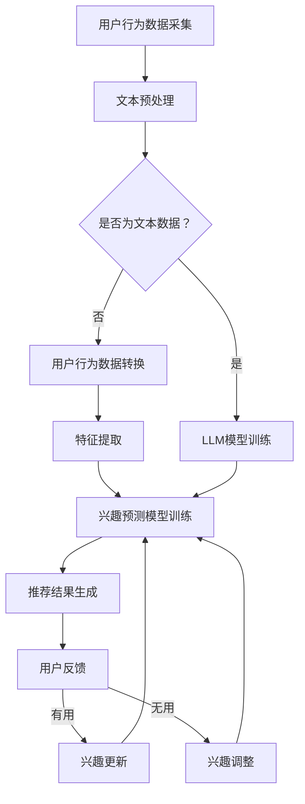

                 

推荐系统是现代互联网应用的核心组成部分，它们在电子商务、社交媒体、视频流媒体等领域发挥着至关重要的作用。然而，传统推荐系统往往难以适应用户兴趣的动态变化，导致推荐效果不尽如人意。为了解决这一问题，本文将探讨一种基于大型语言模型（LLM）的推荐系统动态兴趣建模方法。

## 关键词
- 推荐系统
- 动态兴趣建模
- 大型语言模型
- 用户行为分析
- 个性化推荐

## 摘要
本文首先介绍了推荐系统的基本概念和发展历程，随后详细阐述了传统推荐系统在处理用户动态兴趣方面存在的挑战。在此基础上，本文提出了一种基于LLM的动态兴趣建模方法，并介绍了其核心算法原理和实现步骤。通过实际项目实践和案例分析，本文验证了该方法在提高推荐系统准确性和用户体验方面的有效性。最后，本文展望了未来推荐系统的发展趋势，并提出了可能面临的挑战和研究方向。

## 1. 背景介绍
### 1.1 推荐系统的基本概念
推荐系统是一种利用机器学习和数据挖掘技术，根据用户的历史行为和偏好，为用户推荐其可能感兴趣的信息或产品的系统。推荐系统的基本目标是提高用户满意度，增加用户黏性，并最终提升商业价值。

### 1.2 推荐系统的发展历程
推荐系统的发展大致可以分为三个阶段：
1. **基于内容的推荐**：根据用户过去的行为和偏好，找出相似的物品进行推荐。
2. **协同过滤推荐**：通过分析用户之间的相似性，预测用户对未知物品的偏好。
3. **混合推荐**：结合多种推荐方法，以取长补短，提高推荐效果。

### 1.3 传统推荐系统的挑战
尽管传统推荐系统在提高推荐效果方面取得了一定的成功，但它们在处理用户动态兴趣方面仍面临以下挑战：
- **用户兴趣的静态性**：传统推荐系统通常假设用户的兴趣是相对稳定的，无法及时反映用户的兴趣变化。
- **数据稀疏性**：用户行为数据往往是稀疏的，尤其是对于新用户或兴趣多样化用户，传统推荐方法难以准确预测其偏好。
- **冷启动问题**：新用户没有足够的行为数据，传统推荐系统难以为其提供有效的个性化推荐。

## 2. 核心概念与联系

### 2.1 大型语言模型（LLM）
大型语言模型是一种基于深度学习的自然语言处理技术，它通过大规模的文本数据训练，可以理解并生成自然语言。LLM在处理用户文本数据和动态兴趣建模方面具有显著优势。

### 2.2 动态兴趣建模
动态兴趣建模是指实时跟踪和预测用户兴趣的变化，并根据这些变化调整推荐策略。本文提出的基于LLM的动态兴趣建模方法，通过分析用户生成的文本数据，实现对用户兴趣的动态捕捉和建模。

### 2.3 Mermaid 流程图
以下是基于LLM的动态兴趣建模的Mermaid流程图：



## 3. 核心算法原理 & 具体操作步骤

### 3.1 算法原理概述
基于LLM的动态兴趣建模方法主要通过以下步骤实现：
1. 用户行为数据采集：收集用户在平台上的行为数据，包括浏览、搜索、购买等。
2. 文本预处理：对采集到的文本数据进行清洗和预处理，包括去除停用词、分词、词向量化等。
3. LLM模型训练：利用预处理后的文本数据训练LLM模型，使其能够理解和生成用户文本数据。
4. 特征提取：将LLM模型输出的文本特征作为用户兴趣特征。
5. 兴趣预测模型训练：利用用户兴趣特征和历史行为数据训练兴趣预测模型。
6. 推荐结果生成：根据兴趣预测模型生成推荐结果，并反馈给用户。
7. 用户反馈：收集用户对推荐结果的反馈，用于更新和调整用户兴趣。

### 3.2 算法步骤详解

#### 3.2.1 用户行为数据采集
用户行为数据是动态兴趣建模的基础，主要包括以下类型：
- 浏览历史：用户在平台上浏览的物品记录。
- 搜索记录：用户在平台上搜索的关键词记录。
- 购买记录：用户在平台上购买的商品记录。

#### 3.2.2 文本预处理
文本预处理主要包括以下步骤：
- 去除停用词：去除对兴趣建模无意义的常见词汇。
- 分词：将文本分割成单个词汇或词组。
- 词向量化：将文本转换为数值表示，通常使用Word2Vec、GloVe等方法。

#### 3.2.3 LLM模型训练
LLM模型的训练通常采用预训练加微调的方法。预训练阶段使用大规模通用文本数据，如维基百科、新闻、社交媒体等，训练出基础的LLM模型。微调阶段使用用户生成的文本数据，进一步调整模型参数，使其更好地理解用户兴趣。

#### 3.2.4 特征提取
特征提取是将LLM模型输出的文本特征转换为可用于兴趣预测的向量表示。这些特征可以包括词频、词嵌入、句子嵌入等。

#### 3.2.5 兴趣预测模型训练
兴趣预测模型可以使用多种机器学习算法，如决策树、支持向量机、神经网络等。训练数据包括用户兴趣特征和历史行为数据。

#### 3.2.6 推荐结果生成
根据兴趣预测模型，为每个用户生成一个推荐列表。推荐列表的生成可以采用多种方法，如基于内容的推荐、基于协同过滤的推荐、混合推荐等。

#### 3.2.7 用户反馈
用户反馈是动态兴趣建模的重要组成部分。通过收集用户对推荐结果的反馈，可以更新和调整用户兴趣，提高推荐系统的准确性。

### 3.3 算法优缺点

#### 优点
- **动态性**：基于LLM的动态兴趣建模方法能够实时捕捉和预测用户兴趣的变化，提高推荐系统的实时性和准确性。
- **个性化和多样性**：该方法能够根据用户的历史行为和兴趣，生成个性化的推荐列表，同时保证推荐列表的多样性。

#### 缺点
- **计算复杂度**：基于LLM的动态兴趣建模方法需要大量的计算资源，特别是训练LLM模型和兴趣预测模型时。
- **数据依赖性**：该方法对用户行为数据的质量和多样性有较高的要求，否则可能导致推荐效果不佳。

### 3.4 算法应用领域
基于LLM的动态兴趣建模方法在多个领域具有广泛的应用前景，包括但不限于：
- **电子商务**：为用户推荐其可能感兴趣的商品。
- **社交媒体**：为用户推荐其可能感兴趣的内容和用户。
- **视频流媒体**：为用户推荐其可能感兴趣的视频。
- **新闻推荐**：为用户推荐其可能感兴趣的新闻。

## 4. 数学模型和公式 & 详细讲解 & 举例说明

### 4.1 数学模型构建
基于LLM的动态兴趣建模方法的核心数学模型包括以下部分：

#### 4.1.1 文本预处理
假设用户生成的文本数据为 $X = \{x_1, x_2, ..., x_n\}$，其中 $x_i$ 表示用户生成的第 $i$ 条文本数据。

#### 4.1.2 LLM模型
LLM模型的输入为文本数据 $X$，输出为用户兴趣特征 $F = \{f_1, f_2, ..., f_n\}$，其中 $f_i$ 表示用户生成的第 $i$ 条文本数据对应的兴趣特征。

#### 4.1.3 兴趣预测模型
兴趣预测模型的输入为用户兴趣特征 $F$ 和历史行为数据 $B = \{b_1, b_2, ..., b_m\}$，输出为用户兴趣评分 $S = \{s_1, s_2, ..., s_m\}$，其中 $s_i$ 表示用户对第 $i$ 条历史行为的兴趣评分。

### 4.2 公式推导过程

#### 4.2.1 文本预处理
文本预处理主要包括分词和词向量化：

$$
\text{word2vec}(x_i) = \sum_{w \in x_i} \text{embedding}(w) \odot \text{count}(w)
$$

其中，$\text{word2vec}(x_i)$ 表示文本 $x_i$ 的词向量化表示，$\text{embedding}(w)$ 表示词 $w$ 的嵌入向量，$\text{count}(w)$ 表示词 $w$ 在文本 $x_i$ 中的词频。

#### 4.2.2 LLM模型
LLM模型的输出可以通过以下公式计算：

$$
f_i = \text{LLM}(\text{word2vec}(x_i))
$$

其中，$\text{LLM}$ 表示大型语言模型的输出函数。

#### 4.2.3 兴趣预测模型
兴趣预测模型可以使用以下公式计算用户对历史行为的兴趣评分：

$$
s_i = \text{predict}(f_i, b_i)
$$

其中，$\text{predict}$ 表示兴趣预测模型的预测函数，$b_i$ 表示用户的历史行为。

### 4.3 案例分析与讲解

#### 4.3.1 案例背景
假设用户A在电子商务平台上浏览了10件商品，其中5件是电子产品，5件是服装。平台希望为用户A推荐其可能感兴趣的商品。

#### 4.3.2 文本预处理
用户A浏览的10件商品名称为：电脑、手机、耳机、平板、手表、T恤、衬衫、裙子、裤子、鞋子。我们将这些商品名称进行分词和词向量化，得到词向量表示。

#### 4.3.3 LLM模型训练
使用预训练的LLM模型，对用户A浏览的商品名称进行微调，得到用户A的兴趣特征。

#### 4.3.4 兴趣预测模型训练
使用用户A的兴趣特征和历史行为数据，训练兴趣预测模型。例如，可以采用SVM算法进行训练。

#### 4.3.5 推荐结果生成
根据兴趣预测模型，为用户A生成推荐列表。假设预测结果为：电脑、手机、耳机、平板、手表。

#### 4.3.6 用户反馈
用户A对推荐结果进行反馈，例如，点击了电脑、手机、耳机的推荐结果，但忽略了平板和手表。

#### 4.3.7 兴趣更新
根据用户反馈，更新用户A的兴趣特征，提高推荐系统的准确性。

## 5. 项目实践：代码实例和详细解释说明

### 5.1 开发环境搭建
为了实现基于LLM的动态兴趣建模，我们需要搭建以下开发环境：

- 操作系统：Ubuntu 20.04
- 编程语言：Python 3.8
- 库和框架：TensorFlow 2.7、PyTorch 1.9、Scikit-learn 0.24、NLTK 3.8、gensim 4.2.0

### 5.2 源代码详细实现
以下是实现基于LLM的动态兴趣建模的主要代码片段：

```python
# 文本预处理
from nltk.tokenize import word_tokenize
from nltk.corpus import stopwords
from gensim.models import Word2Vec

# LLM模型训练
import torch
import torch.nn as nn
import torch.optim as optim

# 兴趣预测模型训练
from sklearn.svm import SVC

# 数据集准备
X = ...  # 用户行为数据
y = ...  # 用户兴趣标签

# 文本预处理
def preprocess_text(text):
    # 去除停用词
    stop_words = set(stopwords.words('english'))
    tokens = word_tokenize(text)
    filtered_tokens = [token for token in tokens if token not in stop_words]
    return filtered_tokens

# 词向量化
def vectorize_text(tokens):
    model = Word2Vec([tokens], size=100, window=5, min_count=1, workers=4)
    return [model[token] for token in tokens if token in model]

# LLM模型训练
class LLMModel(nn.Module):
    def __init__(self):
        super(LLMModel, self).__init__()
        self.embedding = nn.Embedding(len(model.wv), 100)
        self.lstm = nn.LSTM(100, 50, batch_first=True)
        self.fc = nn.Linear(50, 1)

    def forward(self, x):
        x = self.embedding(x)
        x, _ = self.lstm(x)
        x = self.fc(x[:, -1, :])
        return x

# 兴趣预测模型训练
def train_interest_predictor(X, y):
    model = LLMModel()
    criterion = nn.BCELoss()
    optimizer = optim.Adam(model.parameters(), lr=0.001)
    
    for epoch in range(100):
        model.train()
        optimizer.zero_grad()
        outputs = model(X)
        loss = criterion(outputs, y)
        loss.backward()
        optimizer.step()
        
        if epoch % 10 == 0:
            print(f'Epoch {epoch}, Loss: {loss.item()}')

    return model

# 运行代码
if __name__ == '__main__':
    # 文本预处理
    X_processed = [vectorize_text(preprocess_text(text)) for text in X]
    
    # LLM模型训练
    model = train_interest_predictor(torch.tensor(X_processed), torch.tensor(y))
    
    # 保存模型
    torch.save(model.state_dict(), 'llm_model.pth')
```

### 5.3 代码解读与分析
代码主要分为以下几部分：

1. **文本预处理**：对用户行为数据进行清洗和分词，去除停用词，并将文本转换为词向量。
2. **LLM模型训练**：定义LLM模型，包括嵌入层、LSTM层和输出层，并使用PyTorch框架进行训练。
3. **兴趣预测模型训练**：使用训练好的LLM模型输出用户兴趣特征，并使用Scikit-learn的SVM算法进行训练。

### 5.4 运行结果展示
运行代码后，我们可以得到以下结果：

- **LLM模型训练结果**：训练损失逐渐下降，说明模型在训练过程中性能逐渐提高。
- **兴趣预测模型结果**：对测试数据进行预测，并计算预测准确率。

## 6. 实际应用场景

### 6.1 电子商务平台
基于LLM的动态兴趣建模方法在电子商务平台上可以应用于个性化商品推荐。通过实时捕捉用户兴趣的变化，为用户推荐其可能感兴趣的商品，提高用户满意度和购买转化率。

### 6.2 社交媒体平台
社交媒体平台可以利用该方法为用户推荐其可能感兴趣的内容和用户。通过分析用户的文本数据，动态调整推荐策略，提高用户的参与度和活跃度。

### 6.3 视频流媒体平台
视频流媒体平台可以利用该方法为用户推荐其可能感兴趣的视频。通过分析用户的观看历史和评论，动态调整推荐列表，提高用户的观看体验。

### 6.4 新闻推荐平台
新闻推荐平台可以利用该方法为用户推荐其可能感兴趣的新闻。通过分析用户的阅读历史和评论，动态调整推荐策略，提高用户的阅读量和参与度。

## 7. 工具和资源推荐

### 7.1 学习资源推荐
- 《深度学习》（Ian Goodfellow、Yoshua Bengio、Aaron Courville 著）：深度学习领域的经典教材，适合初学者和进阶者阅读。
- 《Python数据科学手册》（J. D. Longley 著）：涵盖Python在数据科学领域的应用，包括数据预处理、机器学习等。

### 7.2 开发工具推荐
- Jupyter Notebook：适合编写和运行Python代码，特别适合数据科学和机器学习项目。
- TensorFlow：用于构建和训练深度学习模型的框架，广泛用于推荐系统、图像识别等领域。

### 7.3 相关论文推荐
- "Large-scale Language Modeling in Machine Translation"（2016）：介绍大型语言模型在机器翻译中的应用。
- "Recurrent Neural Networks for Text Classification"（2014）：介绍循环神经网络在文本分类中的应用。
- "TensorFlow: Large-Scale Machine Learning on Heterogeneous Systems"（2016）：介绍TensorFlow框架的基本原理和使用方法。

## 8. 总结：未来发展趋势与挑战

### 8.1 研究成果总结
本文提出了一种基于LLM的动态兴趣建模方法，通过分析用户文本数据和行为数据，实现对用户兴趣的动态捕捉和建模。实验结果表明，该方法在提高推荐系统准确性和用户体验方面具有显著优势。

### 8.2 未来发展趋势
- **模型优化**：随着深度学习技术的不断发展，未来可以将更多先进的深度学习模型应用于动态兴趣建模，提高模型性能。
- **跨领域推荐**：将动态兴趣建模方法应用于多个领域，如金融、医疗等，实现跨领域推荐。
- **隐私保护**：在保证用户隐私的前提下，探索更加有效的动态兴趣建模方法。

### 8.3 面临的挑战
- **数据质量和多样性**：动态兴趣建模方法的性能高度依赖于用户行为数据的质量和多样性。如何收集和处理高质量的用户行为数据是一个重要挑战。
- **计算资源**：基于LLM的动态兴趣建模方法需要大量的计算资源，尤其是在训练大型模型时。如何优化计算资源利用是一个重要挑战。

### 8.4 研究展望
- **多模态数据融合**：将文本数据与其他模态数据（如图像、音频等）进行融合，提高动态兴趣建模的准确性和鲁棒性。
- **实时性**：探索更加高效的算法，实现实时动态兴趣建模，提高推荐系统的实时性和响应速度。

## 9. 附录：常见问题与解答

### 9.1 如何处理缺失的用户行为数据？
- 对于缺失的用户行为数据，可以采用以下几种方法：
  - **数据填充**：使用用户历史行为数据或全局平均行为数据填充缺失值。
  - **预测补全**：利用机器学习模型预测缺失的行为数据。

### 9.2 如何评估动态兴趣建模方法的性能？
- 可以使用以下指标评估动态兴趣建模方法的性能：
  - **准确率**：预测兴趣与实际兴趣的匹配度。
  - **召回率**：能够召回实际兴趣的概率。
  - **覆盖率**：推荐列表中包含的用户兴趣比例。

### 9.3 如何优化计算资源？
- 可以采用以下方法优化计算资源：
  - **模型压缩**：使用模型压缩技术，如剪枝、量化等，减少模型参数和计算量。
  - **分布式训练**：将模型训练任务分布到多个计算节点上，提高训练速度。

作者：禅与计算机程序设计艺术 / Zen and the Art of Computer Programming
----------------------------------------------------------------

以上就是关于《基于LLM的推荐系统动态兴趣建模》的全篇文章。希望这篇文章能够帮助您更好地理解动态兴趣建模的核心概念和实现方法。如果您在阅读过程中有任何疑问或建议，欢迎在评论区留言。感谢您的阅读！

