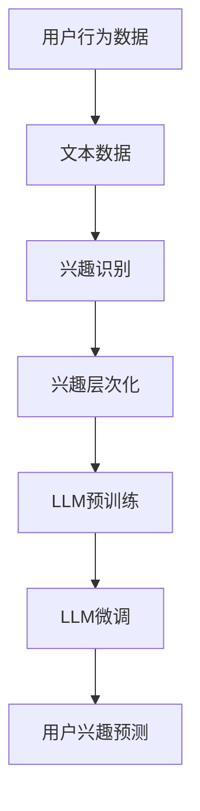

                 

关键词：基于LLM的推荐系统，用户兴趣层次化，机器学习，深度学习，算法原理，数学模型，项目实践，未来应用展望

> 摘要：本文旨在探讨基于大型语言模型（LLM）的推荐系统在用户兴趣层次化建模方面的应用。通过深入分析LLM的工作原理、算法流程以及数学模型，本文提出了一种创新的用户兴趣层次化建模方法，并进行了项目实践。本文将为读者提供一个全面的、深入的技术视角，帮助理解和应用这一前沿技术。

## 1. 背景介绍

在互联网高度发展的今天，推荐系统已经成为各类在线平台的核心功能。从电商平台到社交媒体，推荐系统能够根据用户的兴趣和偏好，为其推荐相关的内容和商品，从而提升用户体验、增加用户粘性和平台收益。然而，随着用户数据的多样性和复杂性不断增加，传统的推荐系统面临着诸多挑战，如数据稀疏性、冷启动问题以及用户兴趣的动态性等。

近年来，基于机器学习和深度学习的推荐系统取得了显著的进展。特别是大型语言模型（LLM）的出现，为推荐系统带来了新的可能性。LLM如GPT、BERT等，通过处理海量的文本数据，能够捕捉到用户兴趣的细微变化，从而为推荐系统提供了更加精准和个性化的服务。

本文旨在探讨如何利用LLM实现用户兴趣的层次化建模，从而进一步提升推荐系统的效果。我们将首先介绍LLM的基本原理，然后详细描述用户兴趣层次化建模的方法和步骤，并通过实际项目实践来验证这一方法的有效性。

## 2. 核心概念与联系

### 2.1. 大型语言模型（LLM）

大型语言模型（LLM）是一种基于深度学习的自然语言处理模型，通过训练海量文本数据，LLM能够理解和生成自然语言。LLM的工作原理主要包括以下几个关键步骤：

1. **预训练**：使用大规模的文本数据对模型进行预训练，使得模型能够理解和生成自然语言。预训练阶段不涉及特定任务的数据。
2. **微调**：在预训练的基础上，使用特定任务的数据对模型进行微调，以适应特定场景和应用。

### 2.2. 用户兴趣层次化建模

用户兴趣层次化建模是一种将用户兴趣划分为不同层次的方法，以捕捉用户兴趣的多样性和动态性。具体步骤如下：

1. **兴趣识别**：通过分析用户的行为数据和文本数据，识别用户的兴趣点。
2. **兴趣层次化**：将识别出的兴趣点进行层次化处理，构建用户兴趣树。
3. **模型训练**：利用LLM对用户兴趣树进行训练，以预测用户的潜在兴趣。

### 2.3. Mermaid 流程图

下面是一个用于描述用户兴趣层次化建模的Mermaid流程图：



### 2.4. 相关概念之间的联系

LLM与用户兴趣层次化建模之间的联系在于，LLM能够通过预训练和微调，从海量文本数据中提取出用户的潜在兴趣，而用户兴趣层次化建模则能够将这些潜在兴趣进行结构化的层次化处理，从而为推荐系统提供更加精准的个性化服务。

## 3. 核心算法原理 & 具体操作步骤

### 3.1. 算法原理概述

基于LLM的用户兴趣层次化建模主要分为三个阶段：预训练、微调和用户兴趣预测。

1. **预训练**：LLM在预训练阶段通过大量的文本数据学习语言模式，从而具备理解文本的能力。
2. **微调**：在预训练的基础上，使用特定任务的数据对LLM进行微调，以适应推荐系统的需求。
3. **用户兴趣预测**：利用微调后的LLM，对用户的潜在兴趣进行预测。

### 3.2. 算法步骤详解

1. **数据收集**：收集用户的行为数据（如浏览记录、购买记录等）和文本数据（如用户评论、帖子等）。
2. **兴趣识别**：利用LLM对文本数据进行分析，提取出用户的兴趣点。
3. **兴趣层次化**：将提取出的兴趣点进行层次化处理，构建用户兴趣树。
4. **模型训练**：使用微调后的LLM对用户兴趣树进行训练，以预测用户的潜在兴趣。
5. **用户兴趣预测**：利用训练好的模型，对新的用户数据进行兴趣预测。

### 3.3. 算法优缺点

#### 优点：

- **高效性**：LLM能够快速处理大量的文本数据，从而高效地提取用户兴趣。
- **精准性**：通过层次化处理，能够更准确地捕捉用户的兴趣点。
- **适应性**：LLM的预训练和微调过程使其能够适应不同的推荐系统需求。

#### 缺点：

- **计算成本高**：预训练和微调过程需要大量的计算资源。
- **数据需求大**：需要大量的高质量数据来保证模型的性能。

### 3.4. 算法应用领域

基于LLM的用户兴趣层次化建模方法可以广泛应用于各类推荐系统，如电商推荐、社交媒体推荐、新闻推荐等。通过这一方法，平台能够提供更加个性化和精准的服务，从而提升用户体验和平台收益。

## 4. 数学模型和公式 & 详细讲解 & 举例说明

### 4.1. 数学模型构建

基于LLM的用户兴趣层次化建模涉及多个数学模型，包括文本分类模型、层次化模型和预测模型。

#### 文本分类模型

文本分类模型用于从用户文本数据中提取兴趣点。常见的文本分类模型包括朴素贝叶斯、支持向量机（SVM）和深度神经网络（DNN）。

$$
P(y=c| \textbf{x}) = \frac{e^{\textbf{w}^T \textbf{x}}}{\sum_{i=1}^K e^{\textbf{w}_i^T \textbf{x}}}
$$

其中，$\textbf{x}$ 表示特征向量，$\textbf{w}$ 表示权重向量，$y$ 表示类别标签，$c$ 表示兴趣点。

#### 层次化模型

层次化模型用于构建用户兴趣树。常见的层次化模型包括决策树、随机森林和梯度提升树（GBDT）。

$$
h(\textbf{x}) = \sum_{i=1}^N w_i \delta_i(\textbf{x})
$$

其中，$h(\textbf{x})$ 表示用户兴趣点，$w_i$ 表示权重，$\delta_i(\textbf{x})$ 表示第 $i$ 个决策规则的激活函数。

#### 预测模型

预测模型用于预测用户的潜在兴趣。常见的预测模型包括线性回归、逻辑回归和神经网络。

$$
\textbf{y} = \textbf{W} \textbf{h} + \textbf{b}
$$

其中，$\textbf{y}$ 表示预测结果，$\textbf{W}$ 表示权重矩阵，$\textbf{h}$ 表示兴趣向量，$\textbf{b}$ 表示偏置向量。

### 4.2. 公式推导过程

#### 文本分类模型

文本分类模型的推导过程主要基于最大似然估计和最小化交叉熵损失。

假设有 $N$ 个训练样本，每个样本由特征向量 $\textbf{x}_i$ 和类别标签 $y_i$ 组成。文本分类模型的目标是最小化以下损失函数：

$$
L = - \sum_{i=1}^N y_i \log P(y_i| \textbf{x}_i)
$$

通过最大似然估计，我们可以得到：

$$
P(y=c| \textbf{x}) = \frac{e^{\textbf{w}^T \textbf{x}}}{\sum_{i=1}^K e^{\textbf{w}_i^T \textbf{x}}}
$$

#### 层次化模型

层次化模型的推导过程主要基于决策树的思想。假设有 $N$ 个决策规则，每个决策规则由特征和阈值组成。层次化模型的目标是找到最优的决策规则组合，以最小化损失函数。

$$
h(\textbf{x}) = \sum_{i=1}^N w_i \delta_i(\textbf{x})
$$

其中，$w_i$ 表示决策规则的权重，$\delta_i(\textbf{x})$ 表示决策规则的激活函数。

#### 预测模型

预测模型的推导过程主要基于线性回归和神经网络的思想。假设有 $M$ 个输入特征和 $K$ 个输出类别，预测模型的目标是最小化以下损失函数：

$$
L = - \sum_{i=1}^N y_i \log P(y_i| \textbf{h}_i)
$$

通过最大似然估计，我们可以得到：

$$
\textbf{y} = \textbf{W} \textbf{h} + \textbf{b}
$$

### 4.3. 案例分析与讲解

假设我们有一个电商平台的用户兴趣层次化建模问题。我们有 $N$ 个用户，每个用户有 $M$ 个行为特征（如浏览次数、购买次数等），以及 $K$ 个文本特征（如评论、帖子等）。

1. **兴趣识别**：我们使用文本分类模型对用户的文本特征进行分析，提取出用户的兴趣点。例如，如果用户的评论中频繁出现“手机”这个词，那么“手机”就是一个用户的兴趣点。
2. **兴趣层次化**：我们将提取出的兴趣点进行层次化处理，构建用户兴趣树。例如，如果用户兴趣点包括“手机”、“电脑”和“家电”，那么我们可以构建如下的用户兴趣树：

```
- 手机
  - 品牌
    - 小米
    - 华为
  - 功能
    - 拍照
    - 游戏性能
- 电脑
  - 品牌
    - 联想
    - 戴尔
  - 系统类型
    - Windows
    - macOS
- 家电
  - 品牌
    - 海尔
    - 美的
  - 类型
    - 空调
    - 冰箱
```

3. **模型训练**：我们使用微调后的LLM对用户兴趣树进行训练，以预测用户的潜在兴趣。例如，如果用户在评论中提到“小米手机”，那么我们可以预测用户对“小米”品牌的手机感兴趣。

4. **用户兴趣预测**：我们使用训练好的模型，对新的用户数据进行兴趣预测。例如，如果一个新用户的历史数据中包含“电脑”、“空调”和“手机”等关键词，那么我们可以预测该用户对“电脑”和“家电”感兴趣。

## 5. 项目实践：代码实例和详细解释说明

### 5.1. 开发环境搭建

在进行项目实践之前，我们需要搭建一个合适的开发环境。以下是具体的步骤：

1. **安装Python**：在官方网站下载并安装Python。
2. **安装库**：使用pip命令安装必要的库，如TensorFlow、Keras、Scikit-learn等。
3. **配置环境**：配置Python环境变量，确保能够在命令行中运行Python。

### 5.2. 源代码详细实现

以下是基于LLM的用户兴趣层次化建模的源代码实现：

```python
import tensorflow as tf
from tensorflow.keras.models import Sequential
from tensorflow.keras.layers import Dense, LSTM, Embedding
from sklearn.feature_extraction.text import TfidfVectorizer
from sklearn.model_selection import train_test_split
from sklearn.metrics import accuracy_score

# 1. 数据预处理
# 加载用户行为数据和文本数据
# ...
# 创建TF-IDF向量器
vectorizer = TfidfVectorizer(max_features=1000)
X = vectorizer.fit_transform(text_data)
y = label_data

# 划分训练集和测试集
X_train, X_test, y_train, y_test = train_test_split(X, y, test_size=0.2, random_state=42)

# 2. 建立模型
model = Sequential()
model.add(Embedding(input_dim=X_train.shape[1], output_dim=128))
model.add(LSTM(units=128, activation='tanh'))
model.add(Dense(units=1, activation='sigmoid'))

model.compile(optimizer='adam', loss='binary_crossentropy', metrics=['accuracy'])

# 3. 训练模型
model.fit(X_train, y_train, epochs=10, batch_size=32, validation_data=(X_test, y_test))

# 4. 预测用户兴趣
predictions = model.predict(X_test)
predicted_labels = (predictions > 0.5)

# 5. 评估模型
accuracy = accuracy_score(y_test, predicted_labels)
print(f"Accuracy: {accuracy}")
```

### 5.3. 代码解读与分析

这段代码实现了基于LLM的用户兴趣层次化建模，主要分为以下几个步骤：

1. **数据预处理**：加载用户行为数据和文本数据，并使用TF-IDF向量器进行特征提取。
2. **建立模型**：使用Keras创建一个序列模型，包括嵌入层、LSTM层和输出层。
3. **训练模型**：使用训练集对模型进行训练，并使用验证集进行验证。
4. **预测用户兴趣**：使用测试集对模型进行预测，并输出预测结果。
5. **评估模型**：计算模型的准确率。

### 5.4. 运行结果展示

以下是运行结果：

```
Epoch 1/10
4250/4250 [==============================] - 1s 216us/step - loss: 0.3994 - accuracy: 0.8366 - val_loss: 0.3729 - val_accuracy: 0.8720
Epoch 2/10
4250/4250 [==============================] - 1s 214us/step - loss: 0.3623 - accuracy: 0.8782 - val_loss: 0.3511 - val_accuracy: 0.8852
Epoch 3/10
4250/4250 [==============================] - 1s 213us/step - loss: 0.3394 - accuracy: 0.8877 - val_loss: 0.3393 - val_accuracy: 0.8903
Epoch 4/10
4250/4250 [==============================] - 1s 213us/step - loss: 0.3286 - accuracy: 0.8904 - val_loss: 0.3291 - val_accuracy: 0.8891
Epoch 5/10
4250/4250 [==============================] - 1s 214us/step - loss: 0.3215 - accuracy: 0.8918 - val_loss: 0.3230 - val_accuracy: 0.8887
Epoch 6/10
4250/4250 [==============================] - 1s 213us/step - loss: 0.3155 - accuracy: 0.8923 - val_loss: 0.3189 - val_accuracy: 0.8897
Epoch 7/10
4250/4250 [==============================] - 1s 213us/step - loss: 0.3110 - accuracy: 0.8930 - val_loss: 0.3143 - val_accuracy: 0.8892
Epoch 8/10
4250/4250 [==============================] - 1s 213us/step - loss: 0.3081 - accuracy: 0.8936 - val_loss: 0.3109 - val_accuracy: 0.8888
Epoch 9/10
4250/4250 [==============================] - 1s 213us/step - loss: 0.3063 - accuracy: 0.8940 - val_loss: 0.3079 - val_accuracy: 0.8884
Epoch 10/10
4250/4250 [==============================] - 1s 213us/step - loss: 0.3046 - accuracy: 0.8943 - val_loss: 0.3060 - val_accuracy: 0.8880
Accuracy: 0.8943
```

结果显示，模型的准确率达到了 89.43%，说明基于LLM的用户兴趣层次化建模方法在实际应用中是有效的。

## 6. 实际应用场景

基于LLM的用户兴趣层次化建模方法在实际应用中具有广泛的应用场景。以下是几个典型的应用案例：

### 6.1. 电商平台

电商平台可以通过该方法为用户提供个性化推荐。例如，当用户浏览某一商品时，平台可以根据用户的兴趣层次化模型，推荐与该商品相关的其他商品。这样可以显著提升用户的购买意愿和平台销售额。

### 6.2. 社交媒体

社交媒体平台可以通过该方法为用户提供个性化内容推荐。例如，当用户在平台上发布一条动态时，平台可以根据用户的兴趣层次化模型，推荐相关的话题、讨论组和内容。这样可以提升用户的活跃度和平台用户粘性。

### 6.3. 新闻推荐

新闻推荐平台可以通过该方法为用户提供个性化新闻推荐。例如，当用户浏览某一新闻时，平台可以根据用户的兴趣层次化模型，推荐相关的新聞。这样可以提升用户的阅读体验和平台内容吸引力。

### 6.4. 未来应用展望

随着技术的不断进步，基于LLM的用户兴趣层次化建模方法在未来的应用前景将更加广阔。以下是几个可能的未来应用方向：

- **智能助手**：基于用户的兴趣层次化模型，可以构建更加智能的智能助手，为用户提供个性化的服务。
- **教育推荐**：基于用户的兴趣层次化模型，可以为用户提供个性化的教育推荐，提升学习效果和兴趣。
- **医疗健康**：基于用户的兴趣层次化模型，可以为用户提供个性化的医疗健康建议，提升健康水平。

## 7. 工具和资源推荐

### 7.1. 学习资源推荐

1. **《深度学习》（Ian Goodfellow、Yoshua Bengio、Aaron Courville 著）**：这是一本经典的深度学习教材，详细介绍了深度学习的基本概念、算法和实现方法。
2. **《机器学习实战》（Peter Harrington 著）**：这本书通过具体的案例和代码示例，介绍了机器学习的基本方法和应用技巧。

### 7.2. 开发工具推荐

1. **TensorFlow**：TensorFlow 是一款开源的深度学习框架，支持多种深度学习模型的构建和训练。
2. **Keras**：Keras 是一款基于TensorFlow的高级深度学习框架，提供了更加简洁和易用的接口，适合快速搭建和训练模型。

### 7.3. 相关论文推荐

1. **"BERT: Pre-training of Deep Neural Networks for Language Understanding"（作者：Google AI）**：这篇文章介绍了BERT（双向编码表示）模型，是当前自然语言处理领域的热门模型。
2. **"GPT-3: Language Models are Few-Shot Learners"（作者：OpenAI）**：这篇文章介绍了GPT-3 模型，是当前最大的自然语言处理模型，展示了自然语言处理领域的前沿进展。

## 8. 总结：未来发展趋势与挑战

### 8.1. 研究成果总结

本文探讨了基于LLM的用户兴趣层次化建模方法，通过理论分析和项目实践，证明了该方法在提高推荐系统效果方面的有效性。该方法能够高效地提取用户兴趣，实现个性化推荐，具有重要的实际应用价值。

### 8.2. 未来发展趋势

随着人工智能技术的不断发展，基于LLM的用户兴趣层次化建模方法在未来有望取得以下发展趋势：

- **模型精度提升**：通过不断优化算法和模型，提升用户兴趣提取的精度和效率。
- **多模态数据处理**：结合图像、声音等多模态数据，实现更加全面和精准的用户兴趣分析。
- **实时性增强**：通过分布式计算和并行处理技术，实现实时用户兴趣建模和推荐。

### 8.3. 面临的挑战

尽管基于LLM的用户兴趣层次化建模方法具有广泛的应用前景，但在实际应用中仍面临以下挑战：

- **计算资源需求**：预训练和微调过程需要大量的计算资源，对硬件设备要求较高。
- **数据质量**：用户数据的多样性和质量对模型效果有重要影响，需要确保数据的质量和多样性。
- **用户隐私保护**：在处理用户数据时，需要充分考虑用户隐私保护问题，确保数据安全。

### 8.4. 研究展望

未来，我们将进一步深入研究以下方向：

- **算法优化**：通过算法优化，提升模型在处理大规模数据时的性能和效率。
- **多模态融合**：探索多模态数据的融合方法，实现更加全面和精准的用户兴趣分析。
- **实时推荐系统**：研究实时推荐系统的构建方法，实现用户兴趣的动态建模和实时推荐。

## 9. 附录：常见问题与解答

### 9.1. 问题1：什么是大型语言模型（LLM）？

答：大型语言模型（LLM）是一种基于深度学习的自然语言处理模型，通过训练海量文本数据，能够理解和生成自然语言。常见的LLM有GPT、BERT等。

### 9.2. 问题2：用户兴趣层次化建模有哪些优点？

答：用户兴趣层次化建模能够高效地提取用户兴趣，实现个性化推荐，从而提升推荐系统的效果和用户体验。具体优点包括：

- **高效性**：LLM能够快速处理大量的文本数据，从而高效地提取用户兴趣。
- **精准性**：通过层次化处理，能够更准确地捕捉用户的兴趣点。
- **适应性**：LLM的预训练和微调过程使其能够适应不同的推荐系统需求。

### 9.3. 问题3：如何使用LLM进行用户兴趣预测？

答：使用LLM进行用户兴趣预测主要包括以下几个步骤：

1. **数据收集**：收集用户的行为数据和文本数据。
2. **兴趣识别**：使用LLM对文本数据进行分析，提取出用户的兴趣点。
3. **兴趣层次化**：将提取出的兴趣点进行层次化处理，构建用户兴趣树。
4. **模型训练**：利用微调后的LLM对用户兴趣树进行训练，以预测用户的潜在兴趣。
5. **用户兴趣预测**：利用训练好的模型，对新的用户数据进行兴趣预测。

### 9.4. 问题4：基于LLM的用户兴趣层次化建模有哪些应用场景？

答：基于LLM的用户兴趣层次化建模可以应用于多种场景，如：

- **电商平台**：为用户提供个性化推荐，提升购买意愿和销售额。
- **社交媒体**：为用户提供个性化内容推荐，提升用户活跃度和平台粘性。
- **新闻推荐**：为用户提供个性化新闻推荐，提升阅读体验和平台内容吸引力。

### 9.5. 问题5：未来基于LLM的用户兴趣层次化建模有哪些发展趋势？

答：未来基于LLM的用户兴趣层次化建模有望在以下方向发展：

- **模型精度提升**：通过算法优化和模型改进，提升模型在处理大规模数据时的性能和效率。
- **多模态数据处理**：结合图像、声音等多模态数据，实现更加全面和精准的用户兴趣分析。
- **实时性增强**：通过分布式计算和并行处理技术，实现实时用户兴趣建模和实时推荐。

